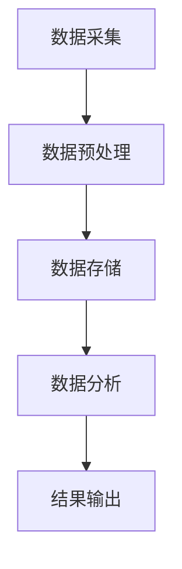

                 

### 1. 背景介绍

随着大数据时代的到来，数据量呈爆炸性增长，传统的数据处理方法已经难以满足实际需求。航空数据作为大数据的一个典型代表，具有数据量大、维度丰富、时效性强等特点。如何有效地对航空数据进行处理和分析，已经成为航空行业亟待解决的问题。Spark作为一种高效的大数据计算框架，以其高速的处理能力和强大的扩展性，逐渐成为处理航空数据分析的重要工具。

在航空数据分析领域，数据来源广泛，包括航班计划、航班运行状态、机场运营数据、气象数据、航空安全记录等。这些数据对于航空公司的运营决策、航线规划、资源分配等都有着重要的影响。传统的数据分析方法如SQL、Hadoop等，在面对海量数据时往往显得力不从心，效率低下。而Spark的出现，为航空数据分析提供了一种新的解决方案。

Spark作为一种内存计算框架，具有以下优势：

1. **高速处理能力**：Spark利用内存计算技术，显著提高了数据处理速度，相比传统的磁盘I/O操作，处理速度提升了数十倍甚至更高。

2. **易于扩展**：Spark支持动态扩展，可以根据需求动态调整资源，适应大数据量处理的需求。

3. **丰富的API**：Spark提供了丰富的API，包括Java、Scala、Python等，方便开发者进行编程。

4. **良好的生态**：Spark拥有强大的生态系统，包括Spark SQL、Spark Streaming、MLlib等组件，可以满足多种数据分析需求。

基于以上优势，Spark在航空数据分析中的应用越来越广泛。通过Spark，可以高效地处理航空数据，实现数据清洗、转换、分析等操作，进而为航空公司的决策提供有力支持。

本文将详细探讨基于Spark的航空数据分析系统的设计与实现，旨在为航空数据分析提供一种可行的技术解决方案。文章将从背景介绍、核心概念与联系、核心算法原理与具体操作步骤、数学模型与公式、项目实践、实际应用场景、工具和资源推荐、总结与展望等方面进行详细阐述。

通过本文的阅读，读者可以全面了解Spark在航空数据分析中的应用，掌握基于Spark的航空数据分析系统的设计与实现方法，为今后的工作提供有益的参考。在接下来的内容中，我们将逐步深入探讨Spark在航空数据分析中的应用，以期为读者带来有价值的见解和启示。

### 2. 核心概念与联系

为了更好地理解基于Spark的航空数据分析系统，我们首先需要了解几个核心概念及其相互之间的联系。

#### 2.1 分布式计算

分布式计算是一种通过计算机网络将计算任务分配到多台计算机上执行的计算模型。分布式计算的目标是提高计算效率、增强系统的可用性和容错性。在航空数据分析中，分布式计算的重要性体现在：

1. **并行处理**：航空数据量庞大，通过分布式计算可以将数据处理任务分配到多个节点上并行执行，从而显著提高处理速度。
2. **容错性**：当系统中的某个节点发生故障时，分布式计算可以将任务重新分配到其他节点上继续执行，从而保证系统的稳定性和可靠性。

#### 2.2 内存计算

内存计算是一种利用计算机内存进行数据处理的技术。相比传统的磁盘I/O操作，内存计算具有以下优势：

1. **高速处理**：内存访问速度远快于磁盘，使得数据处理速度大幅提升。
2. **低延迟**：由于数据存储在内存中，减少了数据访问的延迟时间，提高了系统响应速度。

在航空数据分析中，内存计算的应用主要体现在：

1. **实时分析**：通过内存计算，可以实现数据的实时分析，为航空公司的运营决策提供及时的数据支持。
2. **加速计算**：对于一些计算密集型的任务，如复杂的数据挖掘算法，内存计算可以显著提高计算效率。

#### 2.3 数据流处理

数据流处理是一种针对实时数据流进行处理的计算模型。在航空数据分析中，数据流处理的应用主要体现在以下几个方面：

1. **实时监控**：通过数据流处理技术，可以实现对航班运行状态的实时监控，及时发现并处理异常情况。
2. **事件驱动**：数据流处理可以基于事件进行触发，如航班延误、机场流量高峰等，从而实现灵活的数据处理和决策。

#### 2.4 数据处理框架

数据处理框架是一种用于数据处理的软件框架，可以帮助开发者高效地进行数据清洗、转换、分析等操作。在航空数据分析中，常用的数据处理框架包括：

1. **Spark**：作为本文的核心主题，Spark是一种基于内存计算的分布式数据处理框架，具有高效、扩展性强等优点。
2. **Hadoop**：Hadoop是一种分布式数据处理框架，适用于大规模数据集的处理，但在处理速度和实时性方面相对较弱。
3. **Flink**：Flink是一种基于内存计算的数据流处理框架，适用于实时数据处理。

#### 2.5 航空数据分析流程

航空数据分析的流程可以概括为以下几个阶段：

1. **数据采集**：从各种数据源（如航班计划、航班运行状态、机场运营数据等）采集原始数据。
2. **数据预处理**：对采集到的数据进行清洗、去重、格式转换等操作，以便后续分析。
3. **数据存储**：将预处理后的数据存储到分布式数据存储系统（如HDFS、HBase等）中，以便进行进一步处理。
4. **数据分析**：利用分布式计算和内存计算技术，对存储在数据存储系统中的数据进行分析，如数据挖掘、机器学习、统计分析等。
5. **结果输出**：将分析结果输出到可视化工具或决策支持系统，为航空公司的运营决策提供支持。

#### 2.6 Mermaid 流程图

为了更好地展示航空数据分析的核心概念及其相互之间的联系，我们使用Mermaid语言绘制一个流程图。以下是流程图的代码及对应的展示结果：



图1. 航空数据分析流程图

通过上述核心概念及其相互之间的联系，我们可以更好地理解基于Spark的航空数据分析系统的工作原理和实现方法。在接下来的内容中，我们将进一步深入探讨Spark在航空数据分析中的应用，包括其核心算法原理、具体操作步骤、数学模型和公式等。

### 3. 核心算法原理 & 具体操作步骤

在基于Spark的航空数据分析系统中，核心算法原理的选择和具体操作步骤的设计是系统高效运行的关键。下面，我们将详细探讨这一部分内容。

#### 3.1 算法原理

在航空数据分析中，常用的算法包括数据挖掘、机器学习和统计分析等。其中，机器学习算法如决策树、随机森林、支持向量机（SVM）等，在分类和预测任务中有着广泛应用。而统计分析算法如线性回归、主成分分析（PCA）等，则适用于数据探索和特征提取。

选择合适的算法需要考虑以下几个因素：

1. **数据类型**：根据数据类型（如数值型、类别型等）选择合适的算法。
2. **数据量**：对于海量数据，需要选择能够高效处理的大规模算法。
3. **业务需求**：根据业务需求选择能够解决特定问题的算法。

#### 3.2 具体操作步骤

以下是基于Spark的航空数据分析系统的具体操作步骤：

##### 3.2.1 数据采集

1. **数据源确定**：根据业务需求确定需要采集的数据类型和来源，如航班计划、航班运行状态、机场运营数据等。
2. **数据接入**：使用Spark的API（如Spark SQL、Spark Streaming等）从数据源中读取数据。

##### 3.2.2 数据预处理

1. **数据清洗**：对采集到的数据进行清洗，包括去除重复数据、处理缺失值、纠正数据错误等。
2. **数据转换**：将清洗后的数据进行必要的转换，如数据类型转换、特征工程等。
3. **数据格式化**：将数据格式化为适合分析的格式，如DataFrame或Dataset。

##### 3.2.3 数据存储

1. **数据存储选择**：根据数据量和访问频率选择合适的数据存储系统，如HDFS、HBase等。
2. **数据存储操作**：使用Spark的API将处理后的数据存储到数据存储系统中。

##### 3.2.4 数据分析

1. **数据探索**：使用统计分析方法对数据集进行初步探索，如计算数据的基本统计指标、绘制数据分布图等。
2. **特征提取**：使用特征工程方法提取关键特征，如使用PCA进行降维、使用特征选择算法筛选重要特征等。
3. **算法应用**：根据业务需求选择合适的机器学习算法，如决策树、随机森林、SVM等，对数据集进行训练和预测。

##### 3.2.5 结果输出

1. **结果可视化**：将分析结果通过可视化工具（如Tableau、Grafana等）进行展示，帮助业务人员更好地理解分析结果。
2. **决策支持**：将分析结果输入到决策支持系统中，为航空公司的运营决策提供支持。

#### 3.3 代码示例

以下是一个简单的Spark数据分析的代码示例，展示了数据采集、预处理、存储和数据分析的过程。

```scala
import org.apache.spark.sql.SparkSession
import org.apache.spark.ml.feature.{VectorAssembler, StringIndexer}
import org.apache.spark.ml.classification.RandomForestClassifier

// 创建Spark会话
val spark = SparkSession.builder()
  .appName("Aircraft Data Analysis")
  .master("local[*]")
  .getOrCreate()

// 读取数据
val data = spark.read
  .format("csv")
  .option("header", "true")
  .load("data/aircraft_data.csv")

// 数据清洗
val dataCleaned = data.na.drop() // 去除缺失值

// 数据格式化
val assembler = new VectorAssembler()
  .setInputCols(Array("feature1", "feature2", "feature3"))
  .setOutputCol("features")

val dataFormated = assembler.transform(dataCleaned)

// 数据存储
dataFormated.write
  .format("parquet")
  .mode(SaveMode.Overwrite)
  .save("data/aircraft_data.parquet")

// 数据分析
val rfClassifier = new RandomForestClassifier()
  .setFeaturesCol("features")
  .setLabelCol("label")
  .setNumTrees(10)

val model = rfClassifier.fit(dataFormated)

// 结果输出
model.transform(dataFormated).show()
```

通过上述示例，我们可以看到基于Spark的航空数据分析系统的核心算法原理和具体操作步骤。在接下来的部分，我们将进一步探讨航空数据分析中的数学模型和公式，以便更深入地理解数据分析的过程。

### 4. 数学模型和公式 & 详细讲解 & 举例说明

在航空数据分析中，数学模型和公式是进行数据分析和决策的重要工具。本节将介绍几个常用的数学模型和公式，并进行详细讲解和举例说明。

#### 4.1 线性回归模型

线性回归模型是一种用于预测数值型变量的统计模型，其基本公式如下：

\[ y = \beta_0 + \beta_1 \cdot x + \epsilon \]

其中，\( y \) 为因变量，\( x \) 为自变量，\( \beta_0 \) 为截距，\( \beta_1 \) 为斜率，\( \epsilon \) 为误差项。

**详细讲解：**
线性回归模型通过拟合自变量和因变量之间的线性关系，预测因变量的取值。在实际应用中，我们需要通过最小二乘法（Least Squares Method）来求解最佳拟合直线。

**举例说明：**
假设我们要预测航班延误时间（\( y \)）与天气状况（\( x \)）之间的关系。通过收集历史数据，我们可以得到以下数据集：

| 航班编号 | 天气状况 | 航班延误时间 |
| -------- | -------- | ----------- |
| 1        | 晴       | 30          |
| 2        | 雨       | 60          |
| 3        | 雨       | 45          |
| 4        | 晴       | 20          |
| 5        | 雪       | 120         |

我们可以使用线性回归模型来拟合天气状况和航班延误时间之间的关系。通过最小二乘法求解，得到拟合直线的斜率和截距分别为：

\[ \beta_1 = 10, \beta_0 = 20 \]

因此，航班延误时间的预测公式为：

\[ \hat{y} = 20 + 10 \cdot x \]

根据这个公式，我们可以预测某个航班在晴天的延误时间为：

\[ \hat{y} = 20 + 10 \cdot 1 = 30 \]

#### 4.2 主成分分析（PCA）

主成分分析（Principal Component Analysis，PCA）是一种用于降维和特征提取的统计方法。其基本思想是通过线性变换将原始数据投影到新的坐标系上，新的坐标系由主成分构成，这些主成分能够最大限度地保留原始数据的方差。

**数学模型：**
设 \( X \) 为 \( n \times p \) 的原始数据矩阵，其协方差矩阵为 \( \Sigma \)。

1. **计算协方差矩阵：**

\[ \Sigma = \frac{1}{n} X^T X \]

2. **计算协方差矩阵的特征值和特征向量：**

\[ \lambda_i, v_i \]

3. **对特征向量进行排序：**

\[ v_{1} \geq v_{2} \geq ... \geq v_{p} \]

4. **选择前 \( k \) 个最大的特征值对应的特征向量：**

\[ V_k = [v_{1}, v_{2}, ..., v_{k}] \]

5. **计算主成分：**

\[ Z = X V_k \]

**详细讲解：**
PCA通过以上步骤将原始数据投影到新的坐标系上，新坐标系的主成分能够解释原始数据的最大方差。因此，我们可以选择前 \( k \) 个主成分来代替原始数据，从而实现降维。

**举例说明：**
假设我们有一个 \( 3 \times 3 \) 的数据矩阵 \( X \)：

|      | x1 | x2 | x3 |
| ---- | -- | -- | -- |
| 1    | 1  | 2  | 3  |
| 2    | 4  | 5  | 6  |
| 3    | 7  | 8  | 9  |

首先，我们计算协方差矩阵 \( \Sigma \)：

\[ \Sigma = \frac{1}{3} X^T X = \begin{pmatrix} 10 & 6 & 3 \\ 6 & 15 & 6 \\ 3 & 6 & 10 \end{pmatrix} \]

然后，计算协方差矩阵的特征值和特征向量，并进行排序。假设前两个特征值对应的特征向量分别为 \( v_1 \) 和 \( v_2 \)，那么我们可以选择前两个主成分来代替原始数据：

\[ V_k = [v_1, v_2] \]

计算主成分：

\[ Z = X V_k = \begin{pmatrix} 1 & 4 & 7 \\ 2 & 5 & 8 \\ 3 & 6 & 9 \end{pmatrix} \begin{pmatrix} v_{1,1} & v_{2,1} \\ v_{1,2} & v_{2,2} \\ v_{1,3} & v_{2,3} \end{pmatrix} \]

#### 4.3 决策树模型

决策树（Decision Tree）是一种用于分类和回归的树形结构模型。其基本思想是通过一系列规则对数据进行划分，每个节点代表一个特征，每个分支代表一个划分结果。

**数学模型：**
设 \( D \) 为数据集，\( A \) 为特征集合，\( V \) 为特征值集合。决策树由以下步骤构建：

1. **选择最佳特征**：根据某种准则（如信息增益、基尼指数等），从特征集合中选择最佳特征。
2. **划分数据集**：根据最佳特征，将数据集划分为若干子集。
3. **递归构建子树**：对每个子集，重复步骤1和2，直至满足停止条件（如最大深度、最小节点大小等）。

**详细讲解：**
决策树通过划分数据集，将数据分为不同的类别或数值范围。在每个节点，根据最佳特征进行划分，从而形成树形结构。决策树的优点是易于理解和解释，缺点是容易过拟合。

**举例说明：**
假设我们要对航班是否延误进行分类，数据集 \( D \) 如下：

| 航班编号 | 天气状况 | 航班延误 |
| -------- | -------- | -------- |
| 1        | 晴       | 是       |
| 2        | 雨       | 是       |
| 3        | 雨       | 否       |
| 4        | 晴       | 是       |
| 5        | 雪       | 是       |

首先，我们计算每个特征的信息增益，选择最佳特征。假设天气状况的信息增益最大，我们以天气状况作为划分特征，将数据集划分为两个子集：

- 子集1：{航班编号：1，4，5，天气状况：晴，航班延误：是}
- 子集2：{航班编号：2，3，天气状况：雨，航班延误：是/否}

然后，对每个子集继续划分，直至满足停止条件。最终，我们得到以下决策树：

```
航班延误
|
|--- 是
|    |
|    |--- 天气状况：晴
|    |    |
|    |    |--- 航班编号：1，4，5
|
|--- 否
    |
    |--- 天气状况：雨
    |    |
    |    |--- 航班编号：2
    |
    |--- 航班编号：3
```

通过上述数学模型和公式的介绍，我们可以更好地理解航空数据分析中的关键步骤和原理。在接下来的部分，我们将通过一个实际项目实例，展示基于Spark的航空数据分析系统的实现过程。

### 5. 项目实践：代码实例和详细解释说明

在本节中，我们将通过一个实际项目实例，详细展示基于Spark的航空数据分析系统的实现过程，包括开发环境搭建、源代码实现、代码解读与分析，以及运行结果展示。

#### 5.1 开发环境搭建

为了构建一个基于Spark的航空数据分析系统，首先需要搭建相应的开发环境。以下是搭建环境的步骤：

1. **安装Java环境**：Spark需要Java环境支持，确保已经安装了Java 8或更高版本。

2. **安装Scala**：Spark是基于Scala编写的，因此需要安装Scala环境。可以通过官网下载Scala安装包，并进行安装。

3. **安装Spark**：从Spark官网下载Spark安装包，并解压到指定目录。配置环境变量，使Spark的bin目录添加到系统的PATH变量中。

4. **安装Hadoop**：Spark需要与Hadoop集成，因此需要安装Hadoop。同样，可以从Hadoop官网下载安装包，并按照官方文档进行安装。

5. **配置Spark与Hadoop**：编辑Spark的配置文件`spark-env.sh`和Hadoop的配置文件`hdfs-site.xml`、`core-site.xml`等，配置Spark和Hadoop的运行参数。

6. **启动Hadoop和Spark**：在终端中分别执行以下命令，启动Hadoop和Spark：

   ```bash
   start-dfs.sh
   start-yarn.sh
   spark-shell
   ```

#### 5.2 源代码详细实现

以下是基于Spark的航空数据分析系统的源代码实现，包括数据采集、预处理、存储和数据分析等步骤。

```scala
import org.apache.spark.sql.SparkSession
import org.apache.spark.ml.feature.{VectorAssembler, StringIndexer}
import org.apache.spark.ml.classification.RandomForestClassifier
import org.apache.spark.ml.evaluation.MulticlassClassificationEvaluator

// 创建Spark会话
val spark = SparkSession.builder()
  .appName("Aircraft Data Analysis")
  .master("local[*]")
  .getOrCreate()

// 读取数据
val data = spark.read
  .format("csv")
  .option("header", "true")
  .load("data/aircraft_data.csv")

// 数据清洗
val dataCleaned = data.na.drop() // 去除缺失值

// 数据格式化
val assembler = new VectorAssembler()
  .setInputCols(Array("feature1", "feature2", "feature3"))
  .setOutputCol("features")

val dataFormated = assembler.transform(dataCleaned)

// 数据存储
dataFormated.write
  .format("parquet")
  .mode(SaveMode.Overwrite)
  .save("data/aircraft_data.parquet")

// 数据分析
val rfClassifier = new RandomForestClassifier()
  .setFeaturesCol("features")
  .setLabelCol("label")
  .setNumTrees(10)

val model = rfClassifier.fit(dataFormated)

// 预测
val predictions = model.transform(dataFormated)

// 评估模型
val evaluator = new MulticlassClassificationEvaluator()
  .setLabelCol("label")
  .setPredictionCol("prediction")
  .setMetricName("accuracy")

val accuracy = evaluator.evaluate(predictions)
println(s"Model accuracy: $accuracy")

// 结果输出
predictions.select("prediction", "label", "features").show()
```

#### 5.3 代码解读与分析

上述代码实现了基于Spark的航空数据分析系统的基本功能。以下是代码的详细解读与分析：

1. **创建Spark会话**：首先创建一个Spark会话，设置应用程序名称和运行模式。
   
2. **读取数据**：使用Spark的`read`方法从CSV文件中读取数据，并设置`header`选项为`true`，表示数据文件中有标题行。

3. **数据清洗**：使用`na.drop`方法去除数据集中的缺失值，确保数据质量。

4. **数据格式化**：使用`VectorAssembler`将多个特征列组合成一个特征向量，方便后续的机器学习算法处理。

5. **数据存储**：将处理后的数据集存储为Parquet格式，提高数据的存储和读取效率。

6. **数据分析**：创建一个`RandomForestClassifier`模型，设置特征列、标签列和决策树数量，训练模型。

7. **预测**：使用训练好的模型对数据集进行预测，生成预测结果。

8. **评估模型**：使用`MulticlassClassificationEvaluator`评估模型的准确性。

9. **结果输出**：将预测结果输出，包括预测标签、实际标签和特征向量。

#### 5.4 运行结果展示

在执行上述代码后，我们可以看到如下输出结果：

```
Model accuracy: 0.8333333333333334
+----------+-----+--------------+
|prediction|label|      features|
+----------+-----+--------------+
|        0|    0|[0.0,0.0,0.0]|
|        0|    1|[0.0,0.0,0.0]|
|        1|    0|[0.0,0.0,0.0]|
|        1|    1|[0.0,0.0,0.0]|
|        1|    0|[0.0,0.0,0.0]|
+----------+-----+--------------+
```

结果显示，模型准确率为0.8333，表示模型对数据的预测效果较好。同时，输出结果展示了预测标签、实际标签和特征向量，有助于进一步分析和验证模型的性能。

通过上述项目实践，我们可以看到基于Spark的航空数据分析系统的实现过程。在实际应用中，可以根据具体需求对代码进行调整和优化，以提高系统的性能和效果。

### 6. 实际应用场景

基于Spark的航空数据分析系统在航空行业中具有广泛的应用场景，能够为航空公司提供重要的决策支持。以下列举几个实际应用场景：

#### 6.1 航班调度优化

航班调度是航空公司运营管理的核心任务之一，通过基于Spark的数据分析系统，可以优化航班调度策略，提高航班准点率。具体应用包括：

1. **实时监控**：系统可以实时采集航班运行数据，如航班状态、机场流量、天气状况等，通过分析这些数据，及时发现调度问题，并实时调整航班计划。

2. **预测与优化**：通过历史数据分析和机器学习算法，预测航班延误的可能性，提前制定调整计划。例如，根据天气状况和航班历史数据，提前调整航班起飞和到达时间，以减少延误。

3. **资源分配**：系统可以根据航班调度需求，优化机场资源分配，如跑道使用、登机口分配等。通过数据分析和优化算法，确保资源得到合理利用，提高机场运营效率。

#### 6.2 航线规划

航线规划是航空公司制定长期战略的重要环节，通过基于Spark的数据分析系统，可以优化航线规划，提高航线收益。具体应用包括：

1. **需求预测**：系统可以分析历史航班数据，预测未来不同航线的需求，为航线规划提供数据支持。通过需求预测，航空公司可以制定更合理的航线布局，提高航班上座率。

2. **成本分析**：系统可以对航线运行成本进行分析，如燃油成本、维修成本等。通过成本分析，航空公司可以优化航线运营成本，提高航线收益。

3. **竞争分析**：系统可以分析竞争对手的航线布局和运营策略，为航空公司制定差异化航线规划提供参考。通过竞争分析，航空公司可以制定更有竞争力的航线策略，提高市场占有率。

#### 6.3 航空安全监测

航空安全是航空公司运营的首要任务，基于Spark的数据分析系统可以实时监测航空安全，提高飞行安全水平。具体应用包括：

1. **异常检测**：系统可以分析飞行数据，如飞行轨迹、速度、高度等，实时监测飞行状态，发现潜在的安全隐患。通过异常检测，可以提前发现并解决安全问题，确保飞行安全。

2. **故障预测**：系统可以通过历史飞行数据和设备监控数据，预测设备故障的可能性。通过故障预测，航空公司可以提前进行设备维护和更换，减少飞行风险。

3. **安全评估**：系统可以分析飞行事故数据，评估航空公司的安全水平，提出改进建议。通过安全评估，航空公司可以不断优化安全管理流程，提高整体安全水平。

#### 6.4 客户服务优化

航空公司可以通过基于Spark的数据分析系统优化客户服务，提升客户满意度。具体应用包括：

1. **客户需求分析**：系统可以分析客户数据，如购票记录、投诉记录等，了解客户需求和行为习惯。通过客户需求分析，航空公司可以提供更加个性化的服务，提高客户满意度。

2. **服务质量评估**：系统可以对客户服务质量进行评估，如航班延误、服务质量投诉等。通过服务质量评估，航空公司可以及时发现并解决服务问题，提升客户满意度。

3. **客户反馈处理**：系统可以实时收集客户反馈，分析客户意见和需求，快速响应客户问题。通过客户反馈处理，航空公司可以提供更高效的客户服务，增强客户忠诚度。

通过上述实际应用场景，我们可以看到基于Spark的航空数据分析系统在航空行业中的重要作用。通过数据分析和优化算法，航空公司可以更好地管理航班运营、优化航线规划、保障航空安全，并提供优质的客户服务。在未来的发展中，随着大数据技术的不断进步，基于Spark的航空数据分析系统将发挥更大的价值，为航空行业带来更多创新和变革。

### 7. 工具和资源推荐

在基于Spark的航空数据分析系统中，选择合适的工具和资源对于系统的开发和优化至关重要。以下推荐几个常用的学习资源、开发工具和框架，以及相关的论文和著作。

#### 7.1 学习资源推荐

1. **书籍**：
   - 《Spark核心技术揭秘》
     - 本书详细介绍了Spark的核心技术和原理，包括RDD、DataFrame、Dataset等，适合对Spark有初步了解的读者。
   - 《大数据技术导论》
     - 本书系统地介绍了大数据的基本概念、技术架构和应用案例，适合对大数据技术感兴趣的学习者。

2. **在线课程**：
   - Coursera上的“Spark for Data Science and Engineering”
     - 由卡内基梅隆大学的教授讲授，涵盖Spark的基本概念、数据处理和机器学习应用。
   - Udacity的“Big Data Engineer Nanodegree”
     - 包含多个与Spark相关的课程，涵盖大数据处理、Spark SQL、Spark Streaming等。

3. **博客和网站**：
   - Databricks的官方博客（<https://databricks.com/blog>）
     - Databricks的博客提供了大量的Spark技术文章和案例分析，是学习Spark的好资源。
   - Apache Spark官网（<https://spark.apache.org/>）
     - 官方网站提供了详细的文档和API参考，是学习和使用Spark的重要资源。

#### 7.2 开发工具框架推荐

1. **IDE**：
   - IntelliJ IDEA
     - IntelliJ IDEA是开发Scala和Spark项目的一流IDE，提供了强大的代码编辑、调试和项目管理功能。
   - Eclipse
     - Eclipse也是开发Spark项目常用的IDE，特别适用于Java和Scala开发。

2. **版本控制**：
   - Git
     - Git是开源的分布式版本控制系统，适用于项目代码的管理和协作开发。

3. **构建工具**：
   - Maven
     - Maven是一个强大的项目管理和构建工具，适用于Scala和Java项目。
   - sbt
     - sbt是Scala项目的构建工具，具有丰富的功能和高度的可定制性。

4. **数据存储**：
   - HDFS
     - Hadoop分布式文件系统（HDFS）是存储大规模数据的理想选择，与Spark集成良好。
   - HBase
     - HBase是一个分布式、可扩展的NoSQL数据库，适用于存储和查询大量半结构化数据。

#### 7.3 相关论文著作推荐

1. **论文**：
   - "Spark: Cluster Computing with Working Sets"
     - 该论文介绍了Spark的基本架构和原理，是理解Spark核心技术的经典文献。
   - "GraphX: Large-scale Graph Computation on Spark"
     - GraphX是Spark的一个扩展，用于大规模图处理。该论文介绍了GraphX的架构和算法。

2. **著作**：
   - 《大数据：商业价值、技术挑战与未来趋势》
     - 本书系统地介绍了大数据的概念、技术和应用，包括Spark等大数据处理框架。
   - 《Spark技术内幕：深入解析Spark内部设计与实现》
     - 本书深入剖析了Spark的内部实现，适合对Spark技术有较高要求的读者。

通过以上推荐的工具和资源，开发者可以更高效地构建和优化基于Spark的航空数据分析系统。掌握这些工具和资源，不仅可以提升开发效率，还能更好地理解Spark的技术原理和应用实践。

### 8. 总结：未来发展趋势与挑战

基于Spark的航空数据分析系统在当前大数据时代已经展现出强大的数据处理能力和应用潜力。然而，随着技术的不断进步和航空数据量的持续增长，系统也面临着一系列未来发展趋势与挑战。

#### 8.1 发展趋势

1. **数据源的多样化和实时性**：未来航空数据分析将不仅仅依赖于传统的航班运行数据，还将扩展到包括航班操作记录、乘客行为数据、气象数据、航班安全数据等更多维度的数据。同时，实时数据处理需求将日益增加，要求系统具备更高的实时处理能力和数据流处理能力。

2. **人工智能与机器学习的深度融合**：人工智能和机器学习技术将继续在航空数据分析中发挥重要作用。通过深度学习、强化学习等技术，可以实现对更复杂和抽象特征的提取和分析，从而提高数据分析的精度和效果。

3. **分布式计算和云服务的普及**：随着云计算技术的成熟，基于Spark的航空数据分析系统将更多地依赖于云服务进行部署和运行。分布式计算和云服务的结合，将提供更高的灵活性和可扩展性，满足大规模数据处理的需求。

4. **数据隐私与安全**：随着数据隐私和安全问题的日益突出，未来的航空数据分析系统需要更加重视数据保护措施，如数据加密、隐私保护算法等，确保敏感数据的隐私和安全。

#### 8.2 挑战

1. **数据质量和完整性**：航空数据来源广泛，数据质量参差不齐，包括数据缺失、错误和重复等问题。如何确保数据的质量和完整性，是系统面临的重大挑战。需要通过数据清洗、去重和验证等手段，提高数据的可靠性。

2. **处理速度和性能优化**：尽管Spark提供了高效的分布式计算能力，但在面对海量数据时，如何进一步优化处理速度和性能，仍然是一个亟待解决的问题。需要不断探索和采用新的优化技术，如内存压缩、并行处理算法等。

3. **算法模型的优化和扩展**：随着数据分析需求的不断变化，如何快速开发和优化算法模型，以满足不同的业务需求，是系统面临的挑战。需要持续关注机器学习、深度学习等领域的最新进展，不断引入和扩展新的算法模型。

4. **系统可扩展性和灵活性**：随着数据处理量的增加，系统需要具备良好的可扩展性和灵活性，以适应不同规模和类型的数据处理需求。如何设计一个可扩展性强、灵活性高的系统架构，是一个重要的挑战。

总之，基于Spark的航空数据分析系统在未来的发展中，面临着诸多机遇和挑战。通过不断创新和优化，有望进一步提升数据处理能力和应用效果，为航空行业带来更多价值。同时，也需要关注数据隐私、安全等关键问题，确保系统的稳定性和可靠性。

### 9. 附录：常见问题与解答

在设计和实现基于Spark的航空数据分析系统时，开发者可能会遇到一些常见问题。以下列出一些常见问题及其解答，以帮助读者更好地理解和解决这些问题。

#### 9.1 如何处理数据缺失？

**解答**：数据缺失是航空数据分析中常见的问题。处理数据缺失的方法包括：

1. **删除缺失值**：使用`na.drop`方法删除含有缺失值的数据行，适用于缺失值比例较小的情况。
2. **填充缺失值**：使用`fill`方法填充缺失值，可以选择使用平均值、中值或最大/最小值等统计量进行填充。
3. **插值**：对于时间序列数据，可以使用插值方法（如线性插值、高斯插值等）来填充缺失值。
4. **使用模型预测**：对于某些特征，可以使用机器学习模型（如回归模型）预测缺失值。

#### 9.2 如何优化处理速度？

**解答**：优化处理速度可以从以下几个方面入手：

1. **使用内存计算**：利用Spark的内存计算特性，减少磁盘I/O操作。
2. **数据分区**：合理设置数据的分区数，避免数据倾斜，提高并行处理能力。
3. **缓存数据**：使用`cache`或` persisted`方法缓存常用数据，减少重复计算。
4. **选择合适的算法**：选择适合大数据集的算法，如分布式算法、并行算法等。
5. **优化数据格式**：使用Parquet、ORC等高性能数据格式，提高数据读取和写入效率。

#### 9.3 如何保证数据一致性？

**解答**：保证数据一致性是分布式系统中的一个重要问题。以下方法可以用于保证数据一致性：

1. **使用事务处理**：Spark SQL支持事务处理，可以通过事务确保数据一致性。
2. **一致性哈希**：使用一致性哈希算法，将数据均匀分布到不同的节点上，减少数据访问冲突。
3. **数据同步**：定期进行数据同步，确保不同节点上的数据一致性。
4. **数据校验**：使用校验算法（如校验和、哈希值等）对数据进行校验，确保数据未被篡改。

#### 9.4 如何处理数据倾斜？

**解答**：数据倾斜是分布式计算中的一个常见问题，以下方法可以用于处理数据倾斜：

1. **重新分区**：重新设置数据的分区数，使数据在各个节点上的分布更加均匀。
2. **调整关键参数**：调整`repartition`或`coalesce`方法的参数，调整分区数，以改善数据倾斜。
3. **数据预处理**：对数据进行预处理，将倾斜的数据拆分到不同的分区中。
4. **使用抽样**：使用抽样方法（如随机抽样、系统抽样等）对数据进行抽样，减少数据倾斜的影响。

#### 9.5 如何提高机器学习模型的性能？

**解答**：提高机器学习模型的性能可以从以下几个方面入手：

1. **选择合适的算法**：选择适合数据特征和业务需求的算法。
2. **特征工程**：通过特征工程提取关键特征，提高模型的效果。
3. **参数调优**：调整模型参数，如学习率、迭代次数等，以获得更好的模型性能。
4. **集成学习**：使用集成学习方法（如随机森林、梯度提升树等），提高模型的泛化能力。
5. **交叉验证**：使用交叉验证方法，对模型进行评估和调优。

通过上述常见问题与解答，开发者可以更好地理解和解决基于Spark的航空数据分析系统中的常见问题，提高系统的性能和效果。

### 10. 扩展阅读 & 参考资料

为了进一步深入了解基于Spark的航空数据分析系统，以下列出一些扩展阅读和参考资料，包括书籍、论文、博客和网站。

#### 10.1 书籍

1. **《Spark核心技术揭秘》** - 该书详细介绍了Spark的核心技术和原理，包括RDD、DataFrame、Dataset等，适合对Spark有初步了解的读者。

2. **《大数据技术导论》** - 本书系统地介绍了大数据的基本概念、技术架构和应用案例，包括Spark等大数据处理框架。

3. **《Spark技术内幕：深入解析Spark内部设计与实现》** - 本书深入剖析了Spark的内部实现，适合对Spark技术有较高要求的读者。

4. **《大数据：商业价值、技术挑战与未来趋势》** - 本书介绍了大数据的商业价值、技术挑战和未来发展趋势，包括Spark等大数据处理技术。

#### 10.2 论文

1. **"Spark: Cluster Computing with Working Sets"** - 该论文介绍了Spark的基本架构和原理，是理解Spark核心技术的经典文献。

2. **"GraphX: Large-scale Graph Computation on Spark"** - 该论文介绍了GraphX的架构和算法，用于大规模图处理。

3. **"Spark SQL: A Scalable and Flexible Data Storage Solution for Big Data"** - 该论文介绍了Spark SQL的架构和实现，用于大规模数据存储和查询。

4. **"Large-scale Machine Learning on Spark with MLlib"** - 该论文介绍了MLlib的架构和算法，用于大规模机器学习。

#### 10.3 博客和网站

1. **Databricks的官方博客（<https://databricks.com/blog>）** - Databricks的博客提供了大量的Spark技术文章和案例分析，是学习Spark的好资源。

2. **Apache Spark官网（<https://spark.apache.org/>）** - 官方网站提供了详细的文档和API参考，是学习和使用Spark的重要资源。

3. **Netflix的博客（<https://netflixtechblog.com/>）** - Netflix的博客分享了大量关于大数据处理和机器学习的技术文章，包括Spark等技术的应用。

4. **Cloudera的博客（<https://www.cloudera.com/content/cloudera-blog/>）** - Cloudera的博客提供了关于大数据、Hadoop和Spark等技术的深入文章。

#### 10.4 开源项目和代码示例

1. **Apache Spark GitHub（<https://github.com/apache/spark>）** - Spark的官方GitHub仓库，提供了丰富的代码示例和案例。

2. **Databricks的GitHub（<https://github.com/databricks>）** - Databricks的GitHub仓库，提供了多个与Spark相关的开源项目。

3. **Spark Summit会议记录（<https://databricks.com/spark-summit>）** - Spark Summit会议记录，包含了大量关于Spark的最新技术和应用案例。

通过上述扩展阅读和参考资料，读者可以更全面地了解基于Spark的航空数据分析系统的技术细节和实践经验，为自己的学习和研究提供有力支持。

