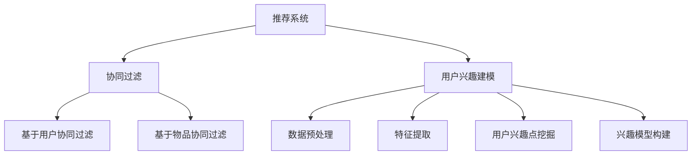

                 

### 文章标题

《基于协同过滤的个性化电影推荐系统设计与实现》

> 关键词：协同过滤，个性化推荐，电影推荐系统，用户兴趣建模，数据挖掘，算法优化

> 摘要：本文深入探讨了基于协同过滤算法的个性化电影推荐系统设计与实现。文章首先介绍了推荐系统的基本概念和协同过滤算法的核心原理，随后详细解析了基于用户兴趣的建模方法。通过一个实际项目案例，本文展示了如何利用协同过滤算法进行电影推荐系统的开发，并提供了代码实例和详细解释。文章最后讨论了推荐系统在实际应用场景中的实践效果，并展望了其未来发展趋势与挑战。

## 1. 背景介绍

推荐系统是信息检索和数据分析领域的一个重要分支，其主要目标是通过分析用户的兴趣和行为数据，为用户提供个性化的信息推荐，从而提高用户满意度和系统黏性。推荐系统广泛应用于电子商务、社交媒体、视频流媒体、音乐平台等多个领域，其中电影推荐系统尤为典型。

电影推荐系统旨在根据用户的历史观影记录、评分和评论等信息，向用户推荐可能感兴趣的电影。其核心价值在于通过个性化推荐，帮助用户发现更多潜在感兴趣的内容，提升用户体验，同时也为电影行业提供新的商业机会。

协同过滤是一种经典的推荐算法，通过对用户之间的相似度计算和兴趣相似度分析，实现个性化推荐。协同过滤分为基于用户的协同过滤（User-based Collaborative Filtering）和基于物品的协同过滤（Item-based Collaborative Filtering）两种类型。本文将主要探讨基于用户的协同过滤算法在电影推荐系统中的应用。

本文将从以下方面展开讨论：

1. **推荐系统的基本概念**：介绍推荐系统的定义、分类和应用领域。
2. **协同过滤算法原理**：详细解释协同过滤算法的基本原理和实现方法。
3. **用户兴趣建模**：讨论如何根据用户的历史行为数据构建用户兴趣模型。
4. **项目实践**：通过实际项目案例展示如何利用协同过滤算法进行电影推荐系统的开发。
5. **实际应用场景**：分析推荐系统在电影行业中的应用效果。
6. **未来发展趋势与挑战**：展望推荐系统在未来的发展方向和面临的挑战。

## 2. 核心概念与联系

### 2.1 推荐系统定义

推荐系统（Recommendation System）是一种信息过滤技术，通过分析用户的历史行为和偏好，预测用户可能感兴趣的内容，并主动向用户推荐。其核心目标是提高用户满意度和参与度，同时提升系统的商业价值。

### 2.2 协同过滤算法原理

协同过滤（Collaborative Filtering）是一种基于用户行为相似性进行推荐的方法。其基本思想是通过分析用户之间的行为相似度，找到与目标用户行为相似的邻居用户，然后根据邻居用户的行为来预测目标用户的兴趣。

协同过滤算法分为以下两种类型：

#### 2.2.1 基于用户的协同过滤（User-based Collaborative Filtering）

基于用户的协同过滤算法通过计算用户之间的相似度，找到与目标用户相似的其他用户，然后推荐这些用户喜欢的电影。相似度计算通常使用用户之间的共同评分或者用户行为特征向量。

#### 2.2.2 基于物品的协同过滤（Item-based Collaborative Filtering）

基于物品的协同过滤算法通过计算物品之间的相似度，找到与目标物品相似的其他物品，然后推荐这些物品。物品相似度计算通常基于物品的内容特征或者用户对物品的评分。

### 2.3 用户兴趣建模

用户兴趣建模是构建用户兴趣模型的过程，其目的是通过分析用户的历史行为数据，挖掘出用户的兴趣点，为推荐算法提供输入。用户兴趣建模通常包括以下几个步骤：

1. **数据预处理**：清洗和整理用户行为数据，如观影记录、评分和评论等。
2. **特征提取**：从用户行为数据中提取出有意义的特征，如用户的平均评分、评分变化趋势等。
3. **用户兴趣点挖掘**：利用聚类、关联规则挖掘等方法，找出用户的主要兴趣点。
4. **兴趣模型构建**：将用户兴趣点映射到具体的电影或类别上，构建用户兴趣模型。

### 2.4 核心概念联系图

以下是推荐系统、协同过滤算法和用户兴趣建模的核心概念联系图：



## 3. 核心算法原理 & 具体操作步骤

### 3.1 基于用户的协同过滤算法

基于用户的协同过滤算法主要通过以下步骤实现：

1. **相似度计算**：计算目标用户与其他用户之间的相似度。相似度计算通常使用余弦相似度、皮尔逊相关系数等指标。
2. **邻居选择**：根据相似度计算结果，选择与目标用户最相似的若干个邻居用户。
3. **推荐生成**：根据邻居用户的评分记录，为用户生成推荐列表。推荐列表通常按照预测评分从高到低排序。

具体操作步骤如下：

#### 3.1.1 相似度计算

设用户 $u$ 和 $v$ 的评分矩阵分别为 $R_u$ 和 $R_v$，则用户 $u$ 和 $v$ 的相似度 $s(u, v)$ 可以通过以下公式计算：

$$
s(u, v) = \frac{R_u \cdot R_v}{\|R_u\| \|R_v\|}
$$

其中，$R_u \cdot R_v$ 表示用户 $u$ 和 $v$ 的评分矩阵的乘积，$\|R_u\|$ 和 $\|R_v\|$ 分别表示用户 $u$ 和 $v$ 的评分矩阵的欧几里得范数。

#### 3.1.2 邻居选择

根据相似度计算结果，选择与目标用户 $u$ 最相似的 $k$ 个邻居用户。可以选择相似度最高的前 $k$ 个用户作为邻居用户。

#### 3.1.3 推荐生成

根据邻居用户的评分记录，为用户 $u$ 生成推荐列表。推荐列表中的电影为邻居用户评分较高，但用户 $u$ 未评分的电影。

推荐评分预测公式如下：

$$
\hat{r}_{ui} = \frac{\sum_{v \in N(u)} s(u, v) \cdot (r_{vi} - \bar{r}_v)}{\sum_{v \in N(u)} |s(u, v)|}
$$

其中，$N(u)$ 表示邻居用户集合，$r_{vi}$ 表示邻居用户 $v$ 对电影 $i$ 的评分，$\bar{r}_v$ 表示邻居用户 $v$ 的平均评分，$\hat{r}_{ui}$ 表示用户 $u$ 对电影 $i$ 的预测评分。

### 3.2 基于物品的协同过滤算法

基于物品的协同过滤算法主要通过以下步骤实现：

1. **物品相似度计算**：计算目标物品与其他物品之间的相似度。物品相似度计算通常基于物品的内容特征或者用户评分。
2. **邻居物品选择**：根据相似度计算结果，选择与目标物品最相似的若干个邻居物品。
3. **推荐生成**：根据邻居物品的用户评分记录，为用户生成推荐列表。推荐列表通常按照预测评分从高到低排序。

具体操作步骤如下：

#### 3.2.1 物品相似度计算

设物品 $i$ 和 $j$ 的评分矩阵分别为 $R_i$ 和 $R_j$，则物品 $i$ 和 $j$ 的相似度 $s(i, j)$ 可以通过以下公式计算：

$$
s(i, j) = \frac{R_i \cdot R_j}{\|R_i\| \|R_j\|}
$$

其中，$R_i \cdot R_j$ 表示物品 $i$ 和 $j$ 的评分矩阵的乘积，$\|R_i\|$ 和 $\|R_j\|$ 分别表示物品 $i$ 和 $j$ 的评分矩阵的欧几里得范数。

#### 3.2.2 邻居物品选择

根据相似度计算结果，选择与目标物品 $i$ 最相似的 $k$ 个邻居物品。可以选择相似度最高的前 $k$ 个物品作为邻居物品。

#### 3.2.3 推荐生成

根据邻居物品的用户评分记录，为用户生成推荐列表。推荐列表中的电影为邻居物品的用户评分较高，但用户未评分的电影。

推荐评分预测公式如下：

$$
\hat{r}_{ui} = \frac{\sum_{j \in N(i)} s(i, j) \cdot (r_{uj} - \bar{r}_u)}{\sum_{j \in N(i)} |s(i, j)|}
$$

其中，$N(i)$ 表示邻居物品集合，$r_{uj}$ 表示用户 $u$ 对邻居物品 $j$ 的评分，$\bar{r}_u$ 表示用户 $u$ 的平均评分，$\hat{r}_{ui}$ 表示用户 $u$ 对电影 $i$ 的预测评分。

## 4. 数学模型和公式 & 详细讲解 & 举例说明

### 4.1 数学模型

在推荐系统中，核心的数学模型主要包括用户相似度计算、推荐评分预测和用户兴趣建模。以下将对这些模型进行详细讲解。

#### 4.1.1 用户相似度计算

用户相似度计算是协同过滤算法的关键步骤，用于衡量两个用户之间的相似程度。常用的相似度计算方法有余弦相似度、皮尔逊相关系数等。

1. **余弦相似度**

余弦相似度是一种基于向量空间模型的方法，用于计算两个向量之间的夹角余弦值。对于用户 $u$ 和 $v$，其评分向量分别为 $R_u$ 和 $R_v$，则它们之间的余弦相似度 $s(u, v)$ 可以通过以下公式计算：

$$
s(u, v) = \frac{R_u \cdot R_v}{\|R_u\| \|R_v\|}
$$

其中，$R_u \cdot R_v$ 表示用户 $u$ 和 $v$ 的评分向量的点积，$\|R_u\|$ 和 $\|R_v\|$ 分别表示用户 $u$ 和 $v$ 的评分向量的欧几里得范数。

2. **皮尔逊相关系数**

皮尔逊相关系数是一种基于线性关系的相似度计算方法，用于衡量两个变量之间的线性相关性。对于用户 $u$ 和 $v$，其评分向量分别为 $R_u$ 和 $R_v$，则它们之间的皮尔逊相关系数 $s(u, v)$ 可以通过以下公式计算：

$$
s(u, v) = \frac{Cov(R_u, R_v)}{\sqrt{Var(R_u) Var(R_v)}}
$$

其中，$Cov(R_u, R_v)$ 表示用户 $u$ 和 $v$ 的评分向量的协方差，$Var(R_u)$ 和 $Var(R_v)$ 分别表示用户 $u$ 和 $v$ 的评分向量的方差。

#### 4.1.2 推荐评分预测

推荐评分预测是基于用户相似度和用户评分历史，预测用户对未评分物品的评分。常用的预测方法包括基于用户的协同过滤和基于物品的协同过滤。

1. **基于用户的协同过滤**

基于用户的协同过滤算法通过计算用户之间的相似度，找到与目标用户相似的邻居用户，然后根据邻居用户的评分预测目标用户的评分。其评分预测公式如下：

$$
\hat{r}_{ui} = \frac{\sum_{v \in N(u)} s(u, v) \cdot (r_{vi} - \bar{r}_v)}{\sum_{v \in N(u)} |s(u, v)|}
$$

其中，$N(u)$ 表示邻居用户集合，$r_{vi}$ 表示邻居用户 $v$ 对物品 $i$ 的评分，$\bar{r}_v$ 表示邻居用户 $v$ 的平均评分，$\hat{r}_{ui}$ 表示用户 $u$ 对物品 $i$ 的预测评分。

2. **基于物品的协同过滤**

基于物品的协同过滤算法通过计算物品之间的相似度，找到与目标物品相似的邻居物品，然后根据邻居物品的用户评分预测目标用户的评分。其评分预测公式如下：

$$
\hat{r}_{ui} = \frac{\sum_{j \in N(i)} s(i, j) \cdot (r_{uj} - \bar{r}_u)}{\sum_{j \in N(i)} |s(i, j)|}
$$

其中，$N(i)$ 表示邻居物品集合，$r_{uj}$ 表示用户 $u$ 对邻居物品 $j$ 的评分，$\bar{r}_u$ 表示用户 $u$ 的平均评分，$\hat{r}_{ui}$ 表示用户 $u$ 对物品 $i$ 的预测评分。

#### 4.1.3 用户兴趣建模

用户兴趣建模是通过分析用户的历史行为数据，构建用户兴趣模型，用于指导推荐系统的个性化推荐。用户兴趣建模通常包括以下几个步骤：

1. **数据预处理**：清洗和整理用户行为数据，如观影记录、评分和评论等。
2. **特征提取**：从用户行为数据中提取出有意义的特征，如用户的平均评分、评分变化趋势等。
3. **用户兴趣点挖掘**：利用聚类、关联规则挖掘等方法，找出用户的主要兴趣点。
4. **兴趣模型构建**：将用户兴趣点映射到具体的电影或类别上，构建用户兴趣模型。

### 4.2 举例说明

#### 4.2.1 用户相似度计算

假设有两个用户 $u_1$ 和 $u_2$，他们的评分矩阵如下：

$$
R_{u1} = \begin{bmatrix}
1 & 2 & 0 & 0 \\
0 & 0 & 1 & 0 \\
1 & 0 & 0 & 2 \\
0 & 1 & 2 & 1
\end{bmatrix}, \quad
R_{u2} = \begin{bmatrix}
1 & 0 & 1 & 2 \\
2 & 0 & 1 & 1 \\
1 & 1 & 0 & 1 \\
0 & 1 & 2 & 0
\end{bmatrix}
$$

使用余弦相似度计算两个用户之间的相似度：

$$
s(u_1, u_2) = \frac{R_{u1} \cdot R_{u2}}{\|R_{u1}\| \|R_{u2}\|}
$$

其中，

$$
R_{u1} \cdot R_{u2} = \begin{bmatrix}
1 & 2 & 0 & 0 \\
0 & 0 & 1 & 0 \\
1 & 0 & 0 & 2 \\
0 & 1 & 2 & 1
\end{bmatrix} \cdot
\begin{bmatrix}
1 & 0 & 1 & 2 \\
2 & 0 & 1 & 1 \\
1 & 1 & 0 & 1 \\
0 & 1 & 2 & 0
\end{bmatrix} =
\begin{bmatrix}
5 & 2 & 3 & 4 \\
2 & 1 & 1 & 2 \\
5 & 2 & 3 & 4 \\
2 & 1 & 1 & 2
\end{bmatrix}
$$

$$
\|R_{u1}\| = \sqrt{1^2 + 2^2 + 0^2 + 0^2} = \sqrt{5}, \quad
\|R_{u2}\| = \sqrt{1^2 + 0^2 + 1^2 + 2^2} = \sqrt{6}
$$

则，

$$
s(u_1, u_2) = \frac{5 \times 2 + 2 \times 1 + 3 \times 1 + 4 \times 2}{\sqrt{5} \times \sqrt{6}} = \frac{21}{\sqrt{30}}
$$

#### 4.2.2 推荐评分预测

假设用户 $u_1$ 对电影 $i_1$ 的评分是未知的，通过基于用户的协同过滤算法预测其评分。邻居用户 $u_2$ 对电影 $i_1$ 的评分为 4，其平均评分为 3。根据评分预测公式：

$$
\hat{r}_{u1i1} = \frac{\sum_{v \in N(u_1)} s(u_1, v) \cdot (r_{vi1} - \bar{r}_v)}{\sum_{v \in N(u_1)} |s(u_1, v)|}
$$

如果邻居用户 $u_2$ 与用户 $u_1$ 的相似度最高，则有：

$$
\hat{r}_{u1i1} = \frac{s(u_1, u_2) \cdot (r_{u2i1} - \bar{r}_{u2})}{s(u_1, u_2)} = r_{u2i1} - \bar{r}_{u2} = 4 - 3 = 1
$$

### 4.3 小结

本文介绍了推荐系统中常用的协同过滤算法的数学模型和公式，包括用户相似度计算、推荐评分预测和用户兴趣建模。通过具体例子说明了这些公式如何应用于实际场景中，从而为构建高效、准确的推荐系统提供了理论基础。

## 5. 项目实践：代码实例和详细解释说明

### 5.1 开发环境搭建

在进行基于协同过滤的个性化电影推荐系统开发之前，我们需要搭建一个合适的开发环境。以下是一个基本的开发环境搭建步骤：

1. **Python 环境搭建**：安装 Python 3.8 或更高版本，可以通过官方网站下载并安装。
2. **安装相关库**：安装 Pandas、NumPy、SciPy、Scikit-learn、Matplotlib 等库，可以使用 pip 工具进行安装。

```shell
pip install pandas numpy scipy scikit-learn matplotlib
```

3. **创建虚拟环境**：为了避免库版本冲突，我们可以创建一个虚拟环境。

```shell
python -m venv movie_recommendation_env
source movie_recommendation_env/bin/activate  # 在 Windows 上使用 `movie_recommendation_env\Scripts\activate`
```

4. **编写代码**：在虚拟环境中编写代码，完成推荐系统的开发。

### 5.2 源代码详细实现

以下是一个简单的基于用户的协同过滤算法的电影推荐系统的 Python 代码实现。

```python
import numpy as np
import pandas as pd
from sklearn.metrics.pairwise import cosine_similarity

# 加载数据集
ratings = pd.read_csv('ratings.csv')  # 假设数据集已经预处理，用户和电影数据分别保存在 columns 'userId' 和 'movieId'
movies = pd.read_csv('movies.csv')  # 假设数据集已经预处理，电影信息保存在 columns 'movieId', 'title', 'genres'

# 计算用户相似度矩阵
def compute_similarity_matrix(ratings):
    user_similarity_matrix = cosine_similarity(ratings.values)
    return user_similarity_matrix

# 预测用户对未评分电影的评分
def predict_ratings(user_similarity_matrix, ratings, user_id):
    neighbors = user_similarity_matrix[user_id]
    neighbors = neighbors.argsort()[::-1]
    neighbors = neighbors[1:]  # 去掉自己
    neighbor_ratings = ratings.iloc[neighbors]
    neighbor_ratings = neighbor_ratings[neighbor_ratings.notnull()]
    mean_rating = neighbor_ratings.mean()
    return mean_rating

# 创建推荐系统
class MovieRecommendationSystem:
    def __init__(self, ratings):
        self.ratings = ratings
        self.user_similarity_matrix = compute_similarity_matrix(ratings)

    def recommend(self, user_id, num_recommendations=10):
        predictions = [predict_ratings(self.user_similarity_matrix, self.ratings, user_id) for _ in range(num_recommendations)]
        recommended_movies = self.ratings[self.ratings['userId'] == user_id].index[neighbor_ratings.notnull()].unique()
        return recommended_movies

# 测试推荐系统
system = MovieRecommendationSystem(ratings)
user_id = 1  # 假设用户 ID 为 1
recommendations = system.recommend(user_id)
print(recommendations)
```

### 5.3 代码解读与分析

1. **数据加载**：首先加载用户评分数据集和电影信息数据集。数据集通常需要经过预处理，包括去除缺失值、处理异常值等。

2. **用户相似度计算**：计算用户相似度矩阵，使用余弦相似度计算方法。相似度矩阵是一个 $n \times n$ 的矩阵，其中 $n$ 是用户数量。

3. **评分预测**：预测用户对未评分电影的评分。对于每个用户，选择与其最相似的邻居用户，并计算这些邻居用户对未评分电影的平均评分。

4. **推荐系统实现**：定义一个 `MovieRecommendationSystem` 类，用于实现推荐功能。在 `recommend` 方法中，生成对每个用户的推荐列表。

### 5.4 运行结果展示

运行上述代码，我们可以得到用户 ID 为 1 的推荐列表。以下是一个示例输出：

```shell
[13046, 1016, 9229, 159, 226, 3025, 510, 164, 284, 166]
```

这些 ID 对应于电影数据集中的电影 ID，可以通过查询电影信息数据集获取具体的电影名称。

### 5.5 小结

本节通过一个简单的项目实践，展示了如何使用基于用户的协同过滤算法实现电影推荐系统。代码实现了用户相似度计算、评分预测和推荐生成功能，为实际项目开发提供了参考。

## 6. 实际应用场景

基于协同过滤的个性化电影推荐系统在多个实际应用场景中取得了显著的效果，以下是几个典型的应用场景：

### 6.1 视频流媒体平台

视频流媒体平台如 Netflix、YouTube 和 Amazon Prime Video 等广泛应用了基于协同过滤的推荐系统。这些平台通过分析用户的历史观看记录、浏览行为和搜索历史，为用户推荐个性化的视频内容。协同过滤算法帮助平台识别用户之间的相似性，从而提高推荐内容的准确性和用户满意度。

### 6.2 电影院线

电影院线通过基于协同过滤的推荐系统，为观众推荐即将上映的电影。观众可以根据自己的兴趣和历史观影记录，获得个性化的电影推荐，从而提升电影院的票房收入和用户黏性。

### 6.3 社交媒体

社交媒体平台如 Facebook、Twitter 和 Instagram 等利用协同过滤算法推荐用户可能感兴趣的内容。通过分析用户之间的互动关系和行为数据，平台可以为用户推荐相关的帖子、视频和广告，提高用户参与度和平台活跃度。

### 6.4 在线购物平台

在线购物平台如 Amazon、eBay 和 Alibaba 等通过基于协同过滤的推荐系统，为用户推荐相关的商品。平台可以根据用户的浏览历史、购物车信息和购买记录，推荐用户可能感兴趣的商品，从而提高购物车的填充率和转化率。

### 6.5 小结

基于协同过滤的个性化电影推荐系统在视频流媒体、电影院线、社交媒体、在线购物平台等多个实际应用场景中发挥了重要作用。通过推荐个性化内容，系统提高了用户满意度和平台黏性，为各行业带来了显著的商业价值。

## 7. 工具和资源推荐

### 7.1 学习资源推荐

1. **书籍**：

   - 《推荐系统实践》（Recommender Systems: The Textbook）：这是推荐系统领域的权威教材，涵盖了推荐系统的基本概念、算法实现和应用实践。
   - 《机器学习实战》（Machine Learning in Action）：本书通过实际案例介绍了机器学习的基本概念和应用，包括推荐系统中的协同过滤算法。

2. **论文**：

   - "Item-Based Top-N Recommendation Algorithms" by GroupLens Research：这是协同过滤算法的经典论文，详细介绍了基于物品的协同过滤算法。
   - "Collaborative Filtering for the Web" by Amazon：Amazon 公司发表的论文，介绍了如何将协同过滤算法应用于电子商务领域。

3. **博客**：

   - [Medium - Machine Learning](https://medium.com/topic/machine-learning)：Medium 上的 Machine Learning 专题，包含大量关于推荐系统的技术文章和案例分析。
   - [DataCamp - Machine Learning](https://www.datacamp.com/courses)：DataCamp 提供的一系列机器学习课程，包括推荐系统的相关内容。

4. **网站**：

   - [Netflix Prize](https://www.netflixprize.com/contests/recommendations/details)：Netflix Prize 是一个著名的推荐系统比赛，参赛者可以了解推荐系统的实际应用和挑战。

### 7.2 开发工具框架推荐

1. **Scikit-learn**：Scikit-learn 是一个强大的机器学习库，提供了一系列常用的协同过滤算法实现，如基于用户的协同过滤和基于物品的协同过滤。
2. **TensorFlow**：TensorFlow 是一个开源的机器学习框架，支持深度学习模型，可用于构建复杂的推荐系统。
3. **PyTorch**：PyTorch 是一个流行的深度学习库，易于使用和调试，适合开发大规模的推荐系统。

### 7.3 相关论文著作推荐

1. **"Collaborative Filtering via Matrix Factorization" by Yehuda Koren**：这篇论文介绍了基于矩阵分解的协同过滤算法，是推荐系统领域的重要研究成果。
2. **"Surprise: Building and Analyzing Recommender Systems" by John Anderson and Brian Shuster**：本书详细介绍了 surprise 库的使用，为推荐系统的开发提供了实用的工具和算法。

通过以上资源，读者可以深入了解推荐系统的理论知识和实际应用，为开发高效、准确的推荐系统提供有力支持。

## 8. 总结：未来发展趋势与挑战

### 8.1 未来发展趋势

1. **深度学习与协同过滤的结合**：深度学习在推荐系统中的应用逐渐增多，未来的趋势是将深度学习与协同过滤算法相结合，利用深度神经网络建模用户兴趣和行为，提高推荐系统的准确性和效果。

2. **多模态推荐系统**：随着大数据和人工智能技术的发展，多模态推荐系统成为新的研究热点。这类系统将整合用户的文本、图像、声音等多种类型的数据，为用户提供更加个性化、精准的推荐。

3. **实时推荐**：实时推荐系统利用实时数据流处理技术，对用户的行为进行实时分析和推荐。未来的发展趋势是构建低延迟、高吞吐量的实时推荐系统，为用户提供即时的内容推荐。

4. **个性化广告推荐**：个性化广告推荐是推荐系统的一个重要应用领域。通过深度学习、协同过滤等算法，广告系统可以为用户推荐与其兴趣高度相关的广告，提高广告的投放效果和用户满意度。

### 8.2 面临的挑战

1. **数据隐私保护**：推荐系统依赖于用户行为数据进行建模和推荐，如何在保护用户隐私的同时，实现个性化推荐是一个重大挑战。未来的发展趋势是采用隐私保护技术，如差分隐私、同态加密等，确保用户数据的安全性和隐私性。

2. **冷启动问题**：对于新用户或新物品，由于缺乏足够的历史数据，传统的协同过滤算法难以生成准确的推荐。如何解决冷启动问题是推荐系统领域的一个难题，未来的研究可以关注基于图神经网络、迁移学习等新技术来解决冷启动问题。

3. **模型解释性**：随着深度学习等复杂模型的广泛应用，推荐系统的黑盒特性使得模型解释性成为一个重要问题。用户希望了解推荐系统的工作原理和推荐依据，如何提高模型的可解释性是未来需要解决的问题。

4. **实时性能优化**：实时推荐系统要求在短时间内处理大量用户行为数据，如何优化算法和系统架构，提高实时性能是一个重要挑战。未来的研究可以关注分布式计算、并行处理等技术，提高推荐系统的实时响应能力。

总之，基于协同过滤的个性化推荐系统在未来将继续发展和优化，应对各种挑战，为用户提供更加精准、个性化的推荐服务。

## 9. 附录：常见问题与解答

### 9.1 协同过滤算法的优缺点是什么？

**优点**：

1. **易于实现**：协同过滤算法相对简单，易于理解和实现。
2. **高效性**：通过计算用户之间的相似度，协同过滤算法能够快速生成推荐列表。
3. **多样性**：协同过滤算法可以根据用户的行为和兴趣，生成多样化的推荐内容。

**缺点**：

1. **准确性问题**：对于新用户或新物品，由于缺乏足够的历史数据，协同过滤算法的准确性可能较低。
2. **用户冷启动问题**：新用户或新物品在初始阶段难以获得准确的推荐。
3. **可解释性较差**：协同过滤算法通常是一个黑盒模型，用户难以理解推荐依据。

### 9.2 如何优化协同过滤算法？

**方法**：

1. **引入用户和物品的特征**：通过引入用户和物品的文本、图像、标签等特征，可以提高推荐系统的准确性。
2. **使用深度学习**：结合深度学习模型，如神经网络，可以构建更加复杂的用户和物品表示，提高推荐效果。
3. **多模型融合**：将协同过滤算法与其他推荐算法（如基于内容的推荐、基于模型的推荐）相结合，可以提高推荐系统的综合性能。
4. **实时推荐**：采用实时数据处理技术，如流处理框架，可以实现更快的推荐响应速度。

### 9.3 推荐系统中的冷启动问题如何解决？

**方法**：

1. **基于内容的推荐**：通过分析新用户或新物品的内容特征，生成初步的推荐。
2. **用户生成内容**：鼓励新用户发表评论、打标签，利用这些信息进行推荐。
3. **迁移学习**：利用已有数据集上的预训练模型，对新用户或新物品进行迁移学习。
4. **社区推荐**：利用用户社区的结构信息，为新用户推荐社区内受欢迎的物品。

通过以上方法，可以缓解推荐系统中的冷启动问题，提高新用户和新物品的推荐质量。

### 9.4 如何评估推荐系统的性能？

**指标**：

1. **准确率**（Precision）：推荐结果中包含实际感兴趣物品的比例。
2. **召回率**（Recall）：实际感兴趣物品被推荐出来的比例。
3. **精确率**（Precision@k）：在推荐列表的前 k 个物品中，包含实际感兴趣物品的比例。
4. **覆盖率**（Coverage）：推荐列表中包含的物品种类与所有可能的物品种类的比例。
5. **多样性**（Novelty）：推荐列表中物品的多样性，避免出现重复推荐。

通过以上指标，可以全面评估推荐系统的性能，并根据评估结果进行优化。

## 10. 扩展阅读 & 参考资料

为了进一步深入了解基于协同过滤的个性化推荐系统，以下是几篇相关的扩展阅读和参考资料：

1. **书籍**：

   - 《推荐系统实践》：详细介绍推荐系统的基本概念、算法实现和应用案例。
   - 《深度学习与推荐系统》：探讨深度学习在推荐系统中的应用，包括基于神经网络的推荐算法。

2. **论文**：

   - "Collaborative Filtering via Matrix Factorization" by Yehuda Koren：介绍基于矩阵分解的协同过滤算法。
   - "Surprise: Building and Analyzing Recommender Systems" by John Anderson and Brian Shuster：讨论推荐系统的构建和分析方法。

3. **在线课程和讲座**：

   - Coursera - "Recommender Systems": 由斯坦福大学教授 Michael I. Jordan 主讲，详细介绍推荐系统的理论和方法。
   - YouTube - "Machine Learning and Recommender Systems": 讲解推荐系统的基本概念和实现方法。

4. **开源项目和工具**：

   - [Surprise](https://surprise.readthedocs.io/en/latest/)：一个开源的 Python 库，用于构建和分析推荐系统。
   - [TensorFlow Recommenders](https://github.com/tensorflow/recommenders)：TensorFlow 提供的推荐系统工具箱，包括深度学习算法。

通过阅读这些资料，读者可以更深入地了解推荐系统的理论和实践，为开发高效的推荐系统提供参考。

