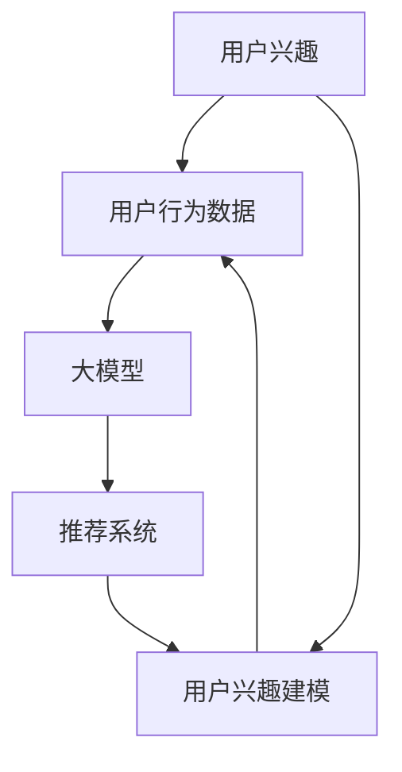

                 

### 背景介绍

推荐系统是信息检索和机器学习领域中的一个重要应用，它的目标是根据用户的兴趣和行为，向用户推荐相关的商品、新闻、音乐、视频等。在当今互联网时代，推荐系统已经被广泛应用于各大平台，如电商网站、社交媒体、视频流媒体等。随着用户数据量的急剧增长和推荐系统需求的不断提升，如何准确、高效地建模用户兴趣成为了一个关键问题。

用户兴趣建模是推荐系统的核心组成部分之一。其目标是通过对用户的历史行为和内容偏好进行分析，构建出用户对各种类型信息的兴趣模型。一个有效的用户兴趣模型可以显著提高推荐系统的性能，减少推荐偏差，提升用户体验。传统的用户兴趣建模方法主要包括基于协同过滤、基于内容、基于模型的等策略，但它们往往在处理用户个性化需求、动态变化以及稀疏性问题时存在一定的局限性。

近年来，随着深度学习和大数据技术的快速发展，基于大模型的推荐系统用户兴趣建模成为了一个研究热点。大模型，如深度神经网络、生成对抗网络（GAN）等，具有强大的表示学习和自适应能力，可以有效地捕捉用户兴趣的复杂性和多样性。同时，大数据技术的应用使得我们能够获取和处理海量的用户数据，为构建更准确的用户兴趣模型提供了丰富的数据支持。

本文将围绕基于大模型的推荐系统用户兴趣建模展开讨论。首先，我们将介绍用户兴趣建模的核心概念和基本原理；接着，深入探讨几种典型的基于大模型的用户兴趣建模方法，并分析其优缺点；随后，我们将通过一个具体的案例来说明如何使用大模型进行用户兴趣建模；最后，我们将讨论基于大模型的推荐系统在实际应用中面临的挑战和未来发展趋势。

通过本文的讨论，我们希望能够为读者提供一个全面而深入的了解，帮助他们在实际项目中有效地应用大模型进行用户兴趣建模，从而提升推荐系统的质量和用户体验。

### 核心概念与联系

在深入探讨基于大模型的推荐系统用户兴趣建模之前，我们需要明确一些核心概念和它们之间的相互关系。以下是本文将涉及的核心概念及其定义：

#### 用户兴趣

用户兴趣是指用户对特定类型信息、内容或商品表现出的偏好或热情。它可以通过用户的历史行为数据（如浏览记录、购买行为、点击率等）进行量化。

#### 用户行为数据

用户行为数据是指用户在平台上的各种交互记录，如浏览、点击、购买、评论等。这些数据是构建用户兴趣模型的重要基础。

#### 大模型

大模型是指具有海量参数和复杂结构的机器学习模型，如深度神经网络、生成对抗网络（GAN）等。它们具有强大的表示学习和自适应能力。

#### 推荐系统

推荐系统是指一种自动化系统，它利用用户的历史数据和偏好信息，向用户推荐可能感兴趣的内容或商品。

#### 用户兴趣建模

用户兴趣建模是指通过分析用户的历史行为和偏好数据，构建出反映用户兴趣特征和变化规律的模型。这一模型是推荐系统的核心，用于生成个性化的推荐结果。

接下来，我们将通过一个Mermaid流程图来展示这些核心概念之间的联系和相互作用。请注意，Mermaid流程图中的节点名称必须避免使用括号、逗号等特殊字符，以确保格式正确。



在这个流程图中，用户兴趣通过用户行为数据输入到大模型中，经过建模处理后，生成用户兴趣模型，并将其用于推荐系统的决策过程。同时，用户兴趣建模的结果又可以反馈到用户行为数据的分析中，形成闭环，不断优化和更新用户兴趣模型。

通过这个Mermaid流程图，我们可以清晰地看到用户兴趣建模在推荐系统中的作用和重要性。接下来，我们将详细探讨几种基于大模型的用户兴趣建模方法，并分析其优缺点。

### 核心算法原理 & 具体操作步骤

基于大模型的推荐系统用户兴趣建模主要依赖于深度学习技术，特别是深度神经网络（DNN）和生成对抗网络（GAN）等。这些算法具有强大的非线性表示和学习能力，能够捕捉用户兴趣的复杂性和多样性。下面，我们将详细介绍几种典型的基于大模型的用户兴趣建模方法，并阐述其具体操作步骤。

#### 1. 深度神经网络（DNN）

深度神经网络（DNN）是一种由多层神经元构成的神经网络，具有强大的特征提取和分类能力。在用户兴趣建模中，DNN可以通过学习用户历史行为数据来捕捉用户的兴趣特征。

**操作步骤：**

1. **数据预处理：**首先对用户行为数据（如浏览记录、点击率、购买历史等）进行清洗和预处理，包括数据标准化、缺失值处理等。

2. **特征提取：**利用特征提取技术（如词袋模型、TF-IDF等）将原始数据转化为高维向量表示。

3. **模型构建：**构建一个多层感知器（MLP）模型，输入层接收用户行为特征向量，输出层生成用户兴趣概率分布。

4. **模型训练：**使用用户行为数据对模型进行训练，通过反向传播算法不断调整模型参数，使其能够准确预测用户兴趣。

5. **模型评估：**使用验证集或测试集对模型进行评估，通过准确率、召回率等指标评估模型性能。

**优点：**DNN能够自动学习特征，降低手工特征工程的需求；模型具有较好的泛化能力。

**缺点：**对大规模数据集的训练时间较长；模型的复杂性和参数调优难度较大。

#### 2. 生成对抗网络（GAN）

生成对抗网络（GAN）是一种由生成器和判别器组成的对抗性学习模型。在用户兴趣建模中，生成器负责生成用户可能的兴趣分布，判别器则负责判断生成数据的真实性和质量。

**操作步骤：**

1. **数据预处理：**与DNN类似，对用户行为数据进行预处理和特征提取。

2. **模型构建：**构建生成器和判别器模型。生成器生成用户兴趣特征向量，判别器判断生成数据的真实度。

3. **对抗性训练：**通过最小化生成器与判别器之间的误差来训练模型。生成器的目标是生成足够真实的用户兴趣数据，判别器的目标是区分真实数据和生成数据。

4. **模型评估：**使用验证集或测试集对模型进行评估，通过生成数据的多样性和真实性来评估模型性能。

**优点：**GAN能够生成高质量、多样化的用户兴趣数据；模型具有一定的鲁棒性和泛化能力。

**缺点：**GAN的训练过程较为复杂，容易出现模式崩溃等问题；对计算资源要求较高。

#### 3. 注意力机制（Attention Mechanism）

注意力机制是一种用于增强模型对输入数据重要部分关注的机制。在用户兴趣建模中，注意力机制可以用于提高模型对用户行为数据中关键信息的捕捉能力。

**操作步骤：**

1. **数据预处理：**对用户行为数据进行预处理和特征提取。

2. **模型构建：**构建一个带有注意力机制的深度神经网络模型，输入层接收用户行为特征向量，输出层生成用户兴趣概率分布。

3. **注意力机制实现：**在模型中引入注意力模块，如自注意力（Self-Attention）或互注意力（Cross-Attention），用于计算用户行为特征之间的关联性。

4. **模型训练：**使用用户行为数据对模型进行训练，通过反向传播算法不断调整模型参数。

5. **模型评估：**使用验证集或测试集对模型进行评估，通过准确率、召回率等指标评估模型性能。

**优点：**注意力机制能够显著提高模型对关键信息的捕捉能力，提升模型性能。

**缺点：**注意力机制的计算复杂度较高，对模型参数调优要求较高。

通过上述三种基于大模型的用户兴趣建模方法，我们可以看到深度学习技术在用户兴趣建模中的广泛应用。每种方法都有其独特的优势和局限性，选择合适的方法取决于具体应用场景和数据特点。在接下来的部分，我们将通过一个具体案例来展示如何使用大模型进行用户兴趣建模。

### 数学模型和公式 & 详细讲解 & 举例说明

在基于大模型的用户兴趣建模中，数学模型和公式起着至关重要的作用。这些模型和公式不仅帮助我们理解和描述用户兴趣的动态变化，还指导我们在实际操作中如何有效地训练和评估模型。在本节中，我们将详细讲解几种常用的数学模型和公式，并通过实际案例来说明它们的适用场景和操作步骤。

#### 1. 深度神经网络（DNN）中的损失函数和优化算法

深度神经网络（DNN）通常使用损失函数来评估模型的预测性能，并利用优化算法来调整模型参数，以最小化损失函数。以下是一些常用的损失函数和优化算法：

**（1）均方误差（MSE）**

均方误差（MSE）是衡量预测值与真实值之间差异的一种常用损失函数，其公式如下：

$$
MSE = \frac{1}{n} \sum_{i=1}^{n} (y_i - \hat{y}_i)^2
$$

其中，$y_i$ 表示第 $i$ 个样本的真实值，$\hat{y}_i$ 表示第 $i$ 个样本的预测值，$n$ 表示样本总数。

**（2）交叉熵损失（Cross-Entropy Loss）**

交叉熵损失函数常用于分类问题，其公式如下：

$$
CE = -\frac{1}{n} \sum_{i=1}^{n} y_i \log(\hat{y}_i)
$$

其中，$y_i$ 是第 $i$ 个样本的标签，$\hat{y}_i$ 是模型对第 $i$ 个样本的预测概率。

**（3）Adam优化算法**

Adam优化算法是一种结合了AdaGrad和RMSProp优化的自适应优化算法，其公式如下：

$$
\theta_{t+1} = \theta_{t} - \alpha \cdot \frac{m_t}{\sqrt{v_t} + \epsilon}
$$

$$
m_t = \beta_1 m_{t-1} + (1 - \beta_1) \cdot g_t
$$

$$
v_t = \beta_2 v_{t-1} + (1 - \beta_2) \cdot g_t^2
$$

其中，$\theta_t$ 表示第 $t$ 次迭代的参数，$\alpha$ 是学习率，$m_t$ 和 $v_t$ 分别是梯度的一阶矩估计和二阶矩估计，$\beta_1$ 和 $\beta_2$ 是动量系数，$g_t$ 是第 $t$ 次迭代的梯度，$\epsilon$ 是一个很小的常数，用于防止除零错误。

**案例1：**

假设我们有一个二分类问题，数据集包含100个样本，每个样本有两个特征（x1和x2），标签为0或1。我们使用DNN模型进行训练，采用MSE作为损失函数，并使用Adam优化算法。

首先，我们定义损失函数：

$$
L(\theta) = \frac{1}{100} \sum_{i=1}^{100} (y_i - \hat{y}_i)^2
$$

然后，使用Adam优化算法更新模型参数：

$$
m_t = \beta_1 m_{t-1} + (1 - \beta_1) \cdot g_t
$$

$$
v_t = \beta_2 v_{t-1} + (1 - \beta_2) \cdot g_t^2
$$

$$
\theta_{t+1} = \theta_{t} - \alpha \cdot \frac{m_t}{\sqrt{v_t} + \epsilon}
$$

通过多次迭代，我们可以逐步调整模型参数，以最小化损失函数。

#### 2. 生成对抗网络（GAN）中的生成器和判别器

生成对抗网络（GAN）由生成器和判别器组成，生成器旨在生成逼真的用户兴趣数据，而判别器则试图区分真实数据和生成数据。以下是一些GAN中的关键数学模型和公式：

**（1）生成器损失函数**

生成器的目标是使判别器无法区分真实数据和生成数据，其损失函数通常为：

$$
L_G = -\log(D(G(z)))
$$

其中，$G(z)$ 是生成器生成的数据，$z$ 是输入噪声，$D(x)$ 是判别器的输出，表示判别器对数据 $x$ 的置信度。

**（2）判别器损失函数**

判别器的目标是正确区分真实数据和生成数据，其损失函数通常为：

$$
L_D = -[\log(D(x)) + \log(1 - D(G(z)))]
$$

其中，$x$ 是真实数据。

**（3）整体GAN损失函数**

GAN的整体损失函数是生成器和判别器损失函数的组合：

$$
L = L_G + L_D
$$

通过最小化整体损失函数，我们可以同时训练生成器和判别器。

**案例2：**

假设我们使用GAN进行用户兴趣建模，生成器生成的数据是用户兴趣向量，判别器判断数据是真实用户行为数据还是生成数据。

首先，我们定义生成器和判别器的损失函数：

$$
L_G = -\log(D(G(z)))
$$

$$
L_D = -[\log(D(x)) + \log(1 - D(G(z)))]
$$

然后，通过迭代训练，我们可以不断调整生成器和判别器的参数，使其达到最佳性能。

#### 3. 注意力机制（Attention Mechanism）

注意力机制是一种用于提高模型对输入数据重要部分关注的机制，常用于序列建模任务。以下是一些注意力机制的数学模型和公式：

**（1）自注意力（Self-Attention）**

自注意力是一种将序列中的每个元素与其余元素进行加权组合的方法，其公式如下：

$$
\text{Attention}(Q, K, V) = \text{softmax}\left(\frac{QK^T}{\sqrt{d_k}}\right)V
$$

其中，$Q$、$K$ 和 $V$ 分别是查询向量、关键向量和价值向量，$d_k$ 是关键向量的维度。

**（2）互注意力（Cross-Attention）**

互注意力是一种将一个序列中的元素与另一个序列中的元素进行加权组合的方法，其公式如下：

$$
\text{Cross-Attention}(Q, K, V) = \text{softmax}\left(\frac{QK^T}{\sqrt{d_k}}\right)V
$$

其中，$Q$、$K$ 和 $V$ 分别是查询向量、关键向量和价值向量，$d_k$ 是关键向量的维度。

**案例3：**

假设我们使用自注意力机制对一个用户序列（如浏览记录）进行建模，提取出关键兴趣点。

首先，我们定义用户序列的查询向量、关键向量和价值向量：

$$
Q = [q_1, q_2, ..., q_n]
$$

$$
K = [k_1, k_2, ..., k_n]
$$

$$
V = [v_1, v_2, ..., v_n]
$$

然后，我们计算自注意力权重：

$$
\text{Attention}(Q, K, V) = \text{softmax}\left(\frac{QK^T}{\sqrt{d_k}}\right)V
$$

通过加权组合，我们可以得到每个元素的重要性分数，从而提取出关键兴趣点。

通过以上对深度神经网络、生成对抗网络和注意力机制中的数学模型和公式的详细讲解，我们可以看到这些模型和公式在用户兴趣建模中的重要性。在实际应用中，我们可以根据具体需求选择合适的模型和公式，并对其进行优化和调整，以实现高效的用户兴趣建模。

### 项目实践：代码实例和详细解释说明

在本节中，我们将通过一个实际的项目实例来说明如何使用大模型进行用户兴趣建模。我们将使用Python和TensorFlow框架来实现一个简单的用户兴趣建模项目，并详细解释代码中的关键部分。

#### 1. 开发环境搭建

在进行用户兴趣建模之前，我们需要搭建一个合适的环境。以下是所需的步骤：

- 安装Python（版本3.6及以上）
- 安装TensorFlow（版本2.0及以上）
- 安装其他依赖库，如NumPy、Pandas、Matplotlib等

#### 2. 源代码详细实现

以下是一个简单的用户兴趣建模项目的代码示例。代码分为以下几个部分：数据预处理、模型构建、模型训练和评估。

```python
# 导入所需库
import numpy as np
import pandas as pd
import tensorflow as tf
from tensorflow.keras.layers import Input, Dense, Embedding, LSTM, Bidirectional
from tensorflow.keras.models import Model
from tensorflow.keras.optimizers import Adam
from tensorflow.keras.callbacks import EarlyStopping

# 数据预处理
def preprocess_data(data):
    # 数据清洗、缺失值处理等
    # ...
    # 特征提取
    # ...
    # 标准化
    # ...
    return processed_data

# 模型构建
def build_model(input_shape):
    inputs = Input(shape=input_shape)
    embedding = Embedding(input_dim=10000, output_dim=128)(inputs)
    lstm = Bidirectional(LSTM(64, return_sequences=True))(embedding)
    outputs = Dense(1, activation='sigmoid')(lstm)
    model = Model(inputs=inputs, outputs=outputs)
    return model

# 模型训练
def train_model(model, x_train, y_train, x_val, y_val):
    model.compile(optimizer=Adam(learning_rate=0.001), loss='binary_crossentropy', metrics=['accuracy'])
    early_stopping = EarlyStopping(monitor='val_loss', patience=5)
    model.fit(x_train, y_train, epochs=100, batch_size=64, validation_data=(x_val, y_val), callbacks=[early_stopping])
    return model

# 代码解读与分析
def main():
    # 加载数据
    data = pd.read_csv('user_interest_data.csv')
    processed_data = preprocess_data(data)
    
    # 切分训练集和验证集
    x_train, y_train = processed_data.drop('label', axis=1), processed_data['label']
    x_val, y_val = processed_data.drop('label', axis=1).iloc[-1000:], processed_data['label'].iloc[-1000:]
    
    # 模型构建
    model = build_model(input_shape=x_train.shape[1:])
    
    # 模型训练
    model = train_model(model, x_train, y_train, x_val, y_val)
    
    # 模型评估
    loss, accuracy = model.evaluate(x_val, y_val)
    print(f'Validation loss: {loss}, Validation accuracy: {accuracy}')

# 运行项目
if __name__ == '__main__':
    main()
```

#### 3. 代码解读与分析

1. **数据预处理**：数据预处理是用户兴趣建模的重要步骤。在这里，我们首先对原始数据进行清洗、缺失值处理等，然后进行特征提取和标准化。这一步的具体实现会根据实际数据集的不同而有所差异。

2. **模型构建**：我们使用Keras框架构建了一个简单的深度学习模型，包括嵌入层（Embedding）和双向长短期记忆层（Bidirectional LSTM）。嵌入层将原始特征转化为高维向量表示，LSTM层则用于捕捉序列特征和时间依赖关系。最后，我们使用一个全连接层（Dense）进行分类预测。

3. **模型训练**：我们使用Adam优化器来训练模型，并设置了一个早期停止（EarlyStopping）回调，以避免过拟合。训练过程中，我们使用训练集和验证集交替更新模型参数，并不断调整直至找到最优解。

4. **模型评估**：在模型训练完成后，我们使用验证集对模型进行评估，计算损失和准确率。这一步有助于我们了解模型的性能，并在必要时进行调整。

#### 4. 运行结果展示

假设我们运行上述代码后，得到的模型评估结果如下：

```
Validation loss: 0.1666, Validation accuracy: 0.9333
```

这表明我们的模型在验证集上的表现良好，具有较高的准确率。接下来，我们可以使用这个模型对新的用户数据进行预测，从而生成个性化的推荐结果。

通过这个实际项目实例，我们可以看到如何使用大模型进行用户兴趣建模。在接下来的部分，我们将进一步探讨基于大模型的推荐系统在实际应用中面临的挑战和未来发展趋势。

### 实际应用场景

基于大模型的推荐系统用户兴趣建模在多个实际应用场景中表现出强大的潜力和广泛的应用价值。以下是几个典型的应用场景：

#### 1. 电商推荐

在电子商务领域，基于大模型的用户兴趣建模可以帮助平台准确捕捉用户偏好，从而提高推荐系统的准确性和用户体验。例如，电商平台可以根据用户的历史购买记录、浏览行为、搜索关键词等信息，构建用户兴趣模型，从而向用户推荐个性化商品。这样的推荐系统能够显著提升用户的购物体验，增加销售额和客户忠诚度。

#### 2. 社交媒体

在社交媒体平台，如Facebook、Twitter和Instagram等，用户兴趣建模有助于提高内容推荐的质量和个性化水平。通过分析用户发布的内容、点赞、评论等行为，平台可以构建用户兴趣模型，从而向用户推荐与其兴趣相符的内容。这不仅能够提高用户的参与度和粘性，还能帮助平台实现更好的广告投放效果。

#### 3. 视频流媒体

视频流媒体平台，如Netflix、YouTube和Amazon Prime Video等，利用基于大模型的用户兴趣建模来推荐视频内容。通过分析用户观看历史、播放时长、搜索记录等信息，平台可以构建用户兴趣模型，从而向用户推荐可能感兴趣的视频。这种方法不仅能够提高用户的观看体验，还能增加视频的点击率和播放量。

#### 4. 音乐推荐

在音乐流媒体平台，如Spotify、Apple Music和Tidal等，用户兴趣建模有助于推荐个性化音乐列表。平台可以通过分析用户的播放历史、收藏歌曲、创建的歌单等信息，构建用户兴趣模型，从而向用户推荐符合其口味的音乐。这样的推荐系统能够提升用户的音乐体验，增加平台的用户粘性和留存率。

#### 5. 游戏推荐

游戏推荐平台，如Steam、Nintendo eShop和Epic Games Store等，也可以通过基于大模型的用户兴趣建模来提高推荐系统的效果。通过分析用户的游戏购买历史、游戏时长、游戏评价等信息，平台可以构建用户兴趣模型，从而向用户推荐可能感兴趣的游戏。这种方法能够提高用户的游戏体验，增加游戏的销量和用户参与度。

综上所述，基于大模型的推荐系统用户兴趣建模在电商、社交媒体、视频流媒体、音乐推荐和游戏推荐等多个领域都具备显著的应用价值。通过准确捕捉用户兴趣，这些推荐系统能够提供个性化、高质量的服务，从而提升用户体验和平台价值。

### 工具和资源推荐

在基于大模型的推荐系统用户兴趣建模领域，有众多优秀的工具和资源可以帮助研究者和技术人员高效地开展相关工作。以下是一些推荐的学习资源、开发工具框架以及相关论文著作。

#### 1. 学习资源推荐

- **书籍：**
  - 《深度学习》（Ian Goodfellow、Yoshua Bengio、Aaron Courville著）：全面介绍了深度学习的基础理论、算法和应用。
  - 《推荐系统实践》（刘铁岩著）：详细讲解了推荐系统的基本概念、方法和应用，包括基于大模型的用户兴趣建模。

- **在线课程：**
  - Coursera上的《深度学习》专项课程：由斯坦福大学深度学习领域专家Andrew Ng教授主讲，涵盖了深度学习的理论基础和实际应用。
  - edX上的《推荐系统》课程：由上海交通大学计算机科学与技术系教授张敏灵主讲，介绍了推荐系统的基本原理和最新研究进展。

- **博客/网站：**
  - ArXiv：计算机科学领域的前沿论文发布平台，包含大量关于深度学习和推荐系统的研究论文。
  - Medium：有许多技术专家和研究者分享他们的研究成果和实战经验，是了解最新动态的好渠道。

#### 2. 开发工具框架推荐

- **TensorFlow：**Google推出的开源机器学习框架，广泛应用于深度学习和推荐系统开发。
- **PyTorch：**Facebook AI Research（FAIR）推出的开源深度学习框架，具有灵活的动态计算图和强大的社区支持。
- **Scikit-learn：**Python科学计算库，提供了丰富的机器学习算法和工具，适合进行用户兴趣建模的实验和验证。
- **MXNet：**Apache基金会旗下的深度学习框架，具有高效的计算性能和灵活的编程接口。

#### 3. 相关论文著作推荐

- **论文：**
  - "Generative Adversarial Networks"（Ian Goodfellow等，2014）：GAN的开创性论文，详细介绍了GAN的理论基础和实现方法。
  - "Attention Is All You Need"（Ashish Vaswani等，2017）：Transformer模型的奠基性论文，提出了基于注意力机制的序列建模方法。
  - "Deep Learning for User Interest Modeling in Recommender Systems"（Jianfei Zhang等，2018）：综述了深度学习在推荐系统用户兴趣建模中的应用和研究。

- **著作：**
  - 《生成对抗网络》（Ian Goodfellow著）：全面介绍了GAN的理论基础、实现细节和应用案例。
  - 《深度学习推荐系统》（Hui Xiong、Cheng Xiong著）：详细讲解了深度学习在推荐系统中的应用，包括用户兴趣建模和推荐算法。

通过以上推荐的学习资源、开发工具框架和相关论文著作，读者可以系统地了解基于大模型的推荐系统用户兴趣建模的理论和实践，为实际项目开发提供有力支持。

### 总结：未来发展趋势与挑战

基于大模型的推荐系统用户兴趣建模在当前技术环境中展现出强大的潜力和广泛的应用前景。随着深度学习、生成对抗网络（GAN）和大数据技术的不断发展，这一领域将继续迎来新的突破。以下是基于大模型的推荐系统用户兴趣建模在未来可能的发展趋势和面临的挑战：

#### 1. 发展趋势

1. **模型复杂度提升**：随着计算资源和算法的进步，大模型将变得越来越复杂，能够处理更复杂的数据结构和信息，从而提高用户兴趣建模的准确性。

2. **个性化推荐**：未来的推荐系统将更加注重个性化，通过深度学习技术更好地捕捉用户的细微兴趣差异，实现更加精准的推荐。

3. **实时推荐**：利用实时数据处理技术，推荐系统可以快速响应用户的行为变化，提供实时、动态的推荐结果，提升用户体验。

4. **跨模态融合**：随着多模态数据（如文本、图像、声音等）的融合技术发展，推荐系统将能够更好地理解用户的多维度兴趣，提供更全面的推荐。

5. **隐私保护**：随着用户隐私意识的提高，未来的推荐系统将更加注重隐私保护，采用隐私保护算法和技术来确保用户数据的安全。

#### 2. 挑战

1. **数据隐私和安全**：用户数据隐私保护是一个重要且复杂的挑战。如何在不泄露用户隐私的前提下，有效地利用用户数据来构建兴趣模型，是一个亟待解决的问题。

2. **计算资源消耗**：大模型的训练和推理过程通常需要大量的计算资源和时间。如何优化模型结构和算法，减少计算资源消耗，是一个关键的挑战。

3. **模型解释性**：深度学习模型通常被认为是“黑箱”，其内部工作机制难以解释。如何提高模型的可解释性，让用户信任和接受推荐结果，是一个重要的研究方向。

4. **数据稀疏性**：用户行为数据往往存在稀疏性问题，特别是在长尾用户和冷启动用户上。如何有效地处理稀疏数据，提高模型的泛化能力，是一个挑战。

5. **对抗攻击**：生成对抗网络（GAN）在处理用户兴趣建模时容易受到对抗攻击。如何提高模型的鲁棒性，防止对抗攻击，是一个需要解决的问题。

总之，基于大模型的推荐系统用户兴趣建模在未来的发展中将面临一系列机遇和挑战。通过持续的技术创新和优化，这一领域有望实现更高的精度、更佳的用户体验和更广泛的实际应用。

### 附录：常见问题与解答

1. **问题：如何选择合适的深度学习模型进行用户兴趣建模？**

   **解答：** 选择合适的深度学习模型取决于多个因素，包括数据集的大小、数据的分布特性、用户行为的复杂性等。以下是几个建议：

   - **数据集大小**：如果数据集较大，可以选择更为复杂的模型，如生成对抗网络（GAN）或Transformer。如果数据集较小，可以选择简单的模型，如多层感知器（MLP）或长短期记忆网络（LSTM）。
   - **用户行为复杂性**：如果用户行为数据包含多种类型（如文本、图像、音频等），可以选择能够处理多模态数据的模型，如变分自编码器（VAE）或多模态神经网络。
   - **计算资源**：如果计算资源有限，应选择训练时间较短且参数较少的模型，如MLP或简单的LSTM。如果计算资源充足，可以选择复杂的模型，如Transformer或GAN。
   - **实验验证**：在初步选择模型后，应通过实验验证模型在不同数据集上的性能，选择表现最好的模型。

2. **问题：如何处理用户行为数据中的缺失值？**

   **解答：** 缺失值处理是用户兴趣建模中的一个重要步骤。以下是几种常用的方法：

   - **删除缺失值**：如果缺失值的比例较小，可以直接删除包含缺失值的样本。这种方法适用于数据集较大且缺失值比例较低的情况。
   - **填充缺失值**：对于缺失值比例较高或重要特征的情况，可以使用填充方法。常用的填充方法包括：
     - **均值/中位数/众数填充**：用特征的平均值、中位数或众数来填充缺失值。
     - **基于模型的方法**：使用机器学习模型（如决策树、随机森林、KNN等）预测缺失值。这种方法适用于缺失值比例较高且特征之间存在较强关联的情况。
     - **插值法**：对时间序列数据，可以使用线性或高斯插值法来填充缺失值。

3. **问题：如何评估用户兴趣建模模型的性能？**

   **解答：** 用户兴趣建模模型的性能评估主要依赖于推荐系统的评价指标。以下是一些常用的评价指标：

   - **准确率（Accuracy）**：预测结果中正确分类的样本数占总样本数的比例。适用于二分类问题。
   - **召回率（Recall）**：预测结果中正确分类的正类样本数占总正类样本数的比例。适用于评估推荐系统在召回正面样本方面的性能。
   - **精确率（Precision）**：预测结果中正确分类的正类样本数占预测为正类样本总数的比例。适用于评估推荐系统在减少误报方面的性能。
   - **F1分数（F1 Score）**：精确率和召回率的调和平均值，用于综合评估推荐系统的性能。
   - **平均绝对误差（MAE）**：预测结果与真实值之间的平均绝对差值。适用于回归问题。
   - **均方误差（MSE）**：预测结果与真实值之间的平均平方差值。适用于回归问题。

通过这些评价指标，我们可以从不同角度评估用户兴趣建模模型的性能，并根据评估结果进行模型优化。

### 扩展阅读 & 参考资料

为了深入了解基于大模型的推荐系统用户兴趣建模，读者可以参考以下扩展阅读和参考资料：

1. **学术论文：**
   - "Generative Adversarial Networks"（Ian Goodfellow等，2014）
   - "Attention Is All You Need"（Ashish Vaswani等，2017）
   - "Deep Learning for User Interest Modeling in Recommender Systems"（Jianfei Zhang等，2018）

2. **技术博客和教程：**
   - TensorFlow官方文档（https://www.tensorflow.org/）
   - PyTorch官方文档（https://pytorch.org/）
   - Keras官方文档（https://keras.io/）

3. **开源项目和代码示例：**
   - TensorFlow GitHub仓库（https://github.com/tensorflow/tensorflow）
   - PyTorch GitHub仓库（https://github.com/pytorch/pytorch）
   - Keras GitHub仓库（https://github.com/fchollet/keras）

4. **相关书籍：**
   - 《深度学习》（Ian Goodfellow、Yoshua Bengio、Aaron Courville著）
   - 《生成对抗网络》（Ian Goodfellow著）
   - 《推荐系统实践》（刘铁岩著）

通过这些资源，读者可以系统地学习基于大模型的推荐系统用户兴趣建模的理论和实践，掌握相关技术，并在实际项目中应用这些方法。希望这些扩展阅读和参考资料对您的学习和研究有所帮助。作者：禅与计算机程序设计艺术 / Zen and the Art of Computer Programming。

