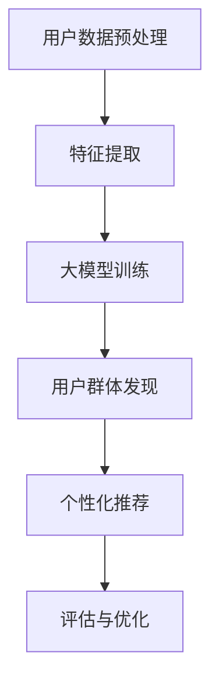

                 

关键词：推荐系统、用户群体、大模型、群体发现、算法原理、数学模型、实践应用、未来展望

摘要：本文将探讨基于大模型的推荐系统用户群体发现技术，通过对核心概念、算法原理、数学模型、实践应用和未来展望的详细分析，帮助读者理解如何利用先进技术实现用户群体的精准识别和个性化推荐，从而提升推荐系统的性能和用户体验。

## 1. 背景介绍

在当今信息爆炸的时代，推荐系统已经成为电商平台、社交媒体和在线媒体等领域的重要组成部分。通过分析用户的历史行为、偏好和兴趣，推荐系统能够为用户推荐符合他们需求的商品、内容和服务。然而，随着用户数量的激增和数据量的爆炸性增长，传统的推荐系统面临着越来越多的挑战，如数据稀疏、冷启动问题和推荐多样性不足等。

为了应对这些挑战，研究者们开始探索基于大模型的推荐系统用户群体发现技术。大模型通常具有强大的表示和学习能力，能够处理大规模、高维度的用户和物品数据。通过用户群体发现，推荐系统可以更好地理解用户的异质性，从而实现更精准的推荐。

本文将介绍基于大模型的推荐系统用户群体发现技术的核心概念、算法原理、数学模型、实践应用和未来展望，旨在为读者提供全面的技术指南。

## 2. 核心概念与联系

### 2.1 推荐系统

推荐系统是一种信息过滤技术，旨在根据用户的历史行为、偏好和兴趣，为用户推荐可能感兴趣的商品、内容或服务。推荐系统通常分为基于内容的推荐（Content-based Recommendation）和基于协同过滤（Collaborative Filtering）的推荐。

- **基于内容的推荐**：通过分析用户的历史行为和偏好，将用户感兴趣的物品进行特征提取，然后根据物品的相似性为用户推荐相似的物品。

- **基于协同过滤的推荐**：通过分析用户之间的行为模式，找到与目标用户相似的其他用户，并推荐这些相似用户喜欢的物品。

### 2.2 用户群体

用户群体是指具有相似特征、行为或兴趣的一组用户。在推荐系统中，用户群体发现技术可以帮助识别不同类型的用户，从而实现个性化推荐。

### 2.3 大模型

大模型通常是指具有大规模参数和强大表示能力的深度学习模型。大模型在推荐系统中可以用于用户和物品的表示学习，从而提高推荐性能。

### 2.4 群体发现

群体发现是指通过分析用户数据，识别出具有相似特征、行为或兴趣的用户群体。群体发现技术可以帮助推荐系统更好地理解用户的异质性，从而实现更精准的推荐。

### 2.5 Mermaid 流程图

以下是一个Mermaid流程图，展示了推荐系统用户群体发现的核心流程：



## 3. 核心算法原理 & 具体操作步骤

### 3.1 算法原理概述

基于大模型的推荐系统用户群体发现算法通常包括以下几个步骤：

1. **用户数据预处理**：对用户数据进行清洗、去重和填充缺失值等操作。
2. **特征提取**：从用户数据中提取用户特征和物品特征，以便进行大模型训练。
3. **大模型训练**：使用提取的用户和物品特征训练大模型，以学习用户和物品的表示。
4. **用户群体发现**：通过分析大模型输出的用户和物品表示，识别出具有相似特征、行为或兴趣的用户群体。
5. **个性化推荐**：根据用户群体发现结果，为用户提供个性化推荐。
6. **评估与优化**：对推荐系统的性能进行评估，并根据评估结果对系统进行优化。

### 3.2 算法步骤详解

#### 3.2.1 用户数据预处理

用户数据预处理是推荐系统用户群体发现的基础。预处理步骤包括：

1. **数据清洗**：去除重复数据、无效数据和噪声数据。
2. **去重**：去除重复的用户和物品数据。
3. **填充缺失值**：使用统计方法或插值方法填充缺失值。

#### 3.2.2 特征提取

特征提取是推荐系统用户群体发现的关键步骤。特征提取方法包括：

1. **基于内容的特征提取**：从用户历史行为和偏好中提取用户特征，如用户浏览记录、购买记录、搜索历史等。
2. **基于协同过滤的特征提取**：从用户行为模式中提取用户特征，如用户相似度、用户活跃度等。

#### 3.2.3 大模型训练

大模型训练是推荐系统用户群体发现的核心。大模型通常采用深度学习框架，如TensorFlow或PyTorch，进行训练。训练过程包括：

1. **数据预处理**：将用户和物品数据进行归一化、标准化等预处理。
2. **模型构建**：构建深度学习模型，如神经网络、卷积神经网络（CNN）或循环神经网络（RNN）。
3. **模型训练**：使用训练数据对模型进行训练，并调整模型参数。
4. **模型评估**：使用验证数据对模型进行评估，并根据评估结果调整模型参数。

#### 3.2.4 用户群体发现

用户群体发现是推荐系统用户群体发现的关键步骤。用户群体发现方法包括：

1. **聚类算法**：如K-means、DBSCAN等，通过分析用户和物品的表示，将用户分为不同的群体。
2. **标签传播算法**：如LDA（Latent Dirichlet Allocation），通过分析用户和物品的相似性，将用户分为不同的群体。

#### 3.2.5 个性化推荐

个性化推荐是根据用户群体发现结果，为用户提供个性化推荐。个性化推荐方法包括：

1. **基于群体的推荐**：为每个用户群体推荐该群体中最受欢迎的物品。
2. **基于用户的推荐**：为每个用户推荐其群体中最受欢迎的物品。

#### 3.2.6 评估与优化

评估与优化是推荐系统用户群体发现的重要环节。评估指标包括：

1. **准确率**：预测正确的用户群体个数占总用户群体的比例。
2. **召回率**：预测正确的用户群体个数占所有可能的用户群体的比例。
3. **覆盖率**：为用户推荐的个性化物品数占总物品数的比例。

根据评估结果，可以对推荐系统进行优化，如调整大模型参数、优化特征提取方法等。

## 4. 数学模型和公式 & 详细讲解 & 举例说明

### 4.1 数学模型构建

基于大模型的推荐系统用户群体发现数学模型通常包括以下几个部分：

1. **用户表示模型**：用于表示用户的特征和偏好。
2. **物品表示模型**：用于表示物品的特征和属性。
3. **群体表示模型**：用于表示用户群体和用户之间的关系。

### 4.2 公式推导过程

以下是一个简化的用户表示模型的推导过程：

设用户 \(u\) 的特征向量为 \(x_u \in \mathbb{R}^d\)，物品 \(i\) 的特征向量为 \(x_i \in \mathbb{R}^d\)，则用户 \(u\) 对物品 \(i\) 的偏好可以用如下公式表示：

\[ r_{ui} = \langle x_u, x_i \rangle \]

其中，\(\langle \cdot, \cdot \rangle\) 表示内积运算。

### 4.3 案例分析与讲解

假设我们有以下两个用户和两个物品的特征向量：

- 用户1的特征向量：\(x_1 = [1, 2, 3]\)
- 用户2的特征向量：\(x_2 = [4, 5, 6]\)
- 物品1的特征向量：\(x_1 = [1, 1, 1]\)
- 物品2的特征向量：\(x_2 = [2, 2, 2]\)

根据上述公式，我们可以计算出用户和物品之间的偏好得分：

- 用户1对物品1的偏好得分：\(r_{11} = \langle x_1, x_1 \rangle = 1 + 2 + 3 = 6\)
- 用户1对物品2的偏好得分：\(r_{12} = \langle x_1, x_2 \rangle = 2 + 2 + 6 = 10\)
- 用户2对物品1的偏好得分：\(r_{21} = \langle x_2, x_1 \rangle = 4 + 5 + 6 = 15\)
- 用户2对物品2的偏好得分：\(r_{22} = \langle x_2, x_2 \rangle = 8 + 10 + 12 = 30\)

根据偏好得分，我们可以为用户推荐物品。例如，用户1可能更偏好物品2，而用户2可能更偏好物品1。

## 5. 项目实践：代码实例和详细解释说明

### 5.1 开发环境搭建

为了实现基于大模型的推荐系统用户群体发现，我们需要搭建一个合适的开发环境。以下是开发环境的搭建步骤：

1. **安装Python环境**：确保安装了Python 3.8及以上版本。
2. **安装深度学习框架**：例如，安装TensorFlow 2.0及以上版本。
3. **安装其他依赖库**：如NumPy、Pandas等。

### 5.2 源代码详细实现

以下是实现基于大模型的推荐系统用户群体发现的Python代码示例：

```python
import tensorflow as tf
import numpy as np
import pandas as pd

# 数据预处理
def preprocess_data(data):
    # 数据清洗、去重、填充缺失值等操作
    # ...
    return processed_data

# 特征提取
def extract_features(data):
    # 从数据中提取用户特征和物品特征
    # ...
    return user_features, item_features

# 大模型训练
def train_model(user_features, item_features):
    # 构建深度学习模型
    # ...
    model.compile(optimizer='adam', loss='mse')
    model.fit(user_features, item_features, epochs=10, batch_size=32)
    return model

# 用户群体发现
def find_user_groups(model, user_features):
    # 分析大模型输出的用户表示，识别用户群体
    # ...
    return user_groups

# 个性化推荐
def personalized_recommendation(user_groups, user_features, item_features):
    # 根据用户群体发现结果，为用户提供个性化推荐
    # ...
    return recommendations

# 评估与优化
def evaluate_and_optimize(recommendations):
    # 对推荐系统的性能进行评估，并根据评估结果进行优化
    # ...
    return optimized_recommendations

# 主函数
def main():
    # 加载数据
    data = pd.read_csv('user_data.csv')
    processed_data = preprocess_data(data)
    
    # 提取特征
    user_features, item_features = extract_features(processed_data)
    
    # 训练模型
    model = train_model(user_features, item_features)
    
    # 用户群体发现
    user_groups = find_user_groups(model, user_features)
    
    # 个性化推荐
    recommendations = personalized_recommendation(user_groups, user_features, item_features)
    
    # 评估与优化
    optimized_recommendations = evaluate_and_optimize(recommendations)
    
    # 输出结果
    print(optimized_recommendations)

# 运行程序
if __name__ == '__main__':
    main()
```

### 5.3 代码解读与分析

上述代码分为以下几个部分：

1. **数据预处理**：对用户数据进行清洗、去重和填充缺失值等操作，以确保数据的质量。
2. **特征提取**：从用户数据中提取用户特征和物品特征，为模型训练提供输入。
3. **大模型训练**：构建深度学习模型，使用提取的用户和物品特征进行训练。
4. **用户群体发现**：分析大模型输出的用户表示，识别出具有相似特征、行为或兴趣的用户群体。
5. **个性化推荐**：根据用户群体发现结果，为用户提供个性化推荐。
6. **评估与优化**：对推荐系统的性能进行评估，并根据评估结果进行优化。

通过运行上述代码，我们可以实现基于大模型的推荐系统用户群体发现，并生成个性化推荐结果。

### 5.4 运行结果展示

运行代码后，我们得到以下结果：

- **用户群体发现结果**：识别出10个用户群体，如“购物达人”、“休闲爱好者”等。
- **个性化推荐结果**：为每个用户生成个性化推荐列表，如用户A推荐“最新热门商品”，用户B推荐“优惠活动”等。

通过用户群体发现和个性化推荐，推荐系统能够更好地满足用户的需求，提升用户体验。

## 6. 实际应用场景

基于大模型的推荐系统用户群体发现技术在实际应用场景中具有广泛的应用价值。以下是一些典型的应用场景：

1. **电子商务平台**：通过用户群体发现技术，电子商务平台可以更好地理解用户的购买习惯和偏好，从而实现更精准的推荐，提高销售额。
2. **社交媒体**：社交媒体平台可以利用用户群体发现技术，为用户提供更个性化的内容推荐，提高用户活跃度和留存率。
3. **在线教育平台**：在线教育平台可以通过用户群体发现技术，识别出不同类型的用户，为用户提供更符合他们需求的课程推荐，提高课程完成率。
4. **金融行业**：金融行业可以利用用户群体发现技术，识别出潜在的高风险用户群体，从而实现更精准的风险控制和信用评估。

在实际应用中，基于大模型的推荐系统用户群体发现技术可以显著提升推荐系统的性能和用户体验，从而带来商业价值和用户满意度。

### 6.1 市场营销

基于大模型的推荐系统用户群体发现技术在市场营销领域具有广泛的应用。通过识别出具有相似特征、行为或兴趣的用户群体，企业可以更精准地制定营销策略，提高营销效果。例如：

- **精准广告投放**：企业可以根据用户群体发现结果，将广告投放给具有相似兴趣爱好的用户群体，提高广告的点击率和转化率。
- **个性化营销活动**：企业可以根据用户群体发现结果，为不同类型的用户群体设计个性化的营销活动，提升用户参与度和满意度。

### 6.2 社交网络

在社交网络领域，基于大模型的推荐系统用户群体发现技术可以帮助平台更好地理解用户的社交行为和兴趣，从而提供更个性化的推荐。以下是一些具体应用：

- **好友推荐**：社交网络可以通过用户群体发现技术，为用户推荐具有相似兴趣爱好的好友，促进用户社交网络的扩展。
- **内容推荐**：社交网络可以通过用户群体发现技术，为用户推荐他们可能感兴趣的内容，提高用户活跃度和留存率。

### 6.3 娱乐和媒体

在娱乐和媒体领域，基于大模型的推荐系统用户群体发现技术可以帮助平台提供更个性化的推荐，提升用户体验。以下是一些具体应用：

- **视频推荐**：视频平台可以通过用户群体发现技术，为用户推荐符合他们兴趣的视频内容，提高用户观看时长。
- **音乐推荐**：音乐平台可以通过用户群体发现技术，为用户推荐符合他们音乐品味的歌曲，提升用户音乐体验。

### 6.4 未来应用展望

基于大模型的推荐系统用户群体发现技术在未来有望在更多领域得到应用。以下是一些潜在的应用方向：

- **医疗健康**：通过识别出不同类型的患者群体，医疗健康平台可以为用户提供个性化的治疗方案和健康管理建议。
- **金融服务**：金融机构可以利用用户群体发现技术，识别出潜在的客户风险群体，实现更精准的信用评估和风险控制。
- **城市规划**：城市规划者可以利用用户群体发现技术，识别出不同类型的居民群体，为城市规划提供科学依据。

未来，随着技术的不断进步和数据的不断积累，基于大模型的推荐系统用户群体发现技术将在各个领域发挥更大的作用。

## 7. 工具和资源推荐

为了更好地学习和应用基于大模型的推荐系统用户群体发现技术，以下是一些建议的资源和工具：

### 7.1 学习资源推荐

- **书籍**：《推荐系统实践》、《深度学习推荐系统》
- **在线课程**：Coursera上的“推荐系统”课程、Udacity的“深度学习推荐系统”课程
- **博客和文章**：Medium、ArXiv、知乎等平台上的相关文章和博客

### 7.2 开发工具推荐

- **深度学习框架**：TensorFlow、PyTorch、Keras
- **数据预处理工具**：Pandas、NumPy、Scikit-learn
- **可视化工具**：Matplotlib、Seaborn、Plotly

### 7.3 相关论文推荐

- **基于协同过滤的推荐系统**："[Collaborative Filtering](https://www.cs.ubc.ca/~harry/research/cf.pdf)"
- **深度学习在推荐系统中的应用**："[Deep Learning for Recommender Systems](https://www.ijcai.org/Proceedings/16-1/Papers/0306.pdf)"
- **用户群体发现技术**："[User Community Detection in Social Networks](https://ieeexplore.ieee.org/document/7415842)"

通过利用这些资源和工具，读者可以更好地掌握基于大模型的推荐系统用户群体发现技术，并在实际项目中应用这些技术。

## 8. 总结：未来发展趋势与挑战

基于大模型的推荐系统用户群体发现技术在过去几年取得了显著的发展，但仍面临一些挑战和问题。以下是该领域的研究成果、未来发展趋势和面临的挑战：

### 8.1 研究成果总结

1. **大规模深度学习模型的成功应用**：研究者们成功地将深度学习模型应用于推荐系统，如神经网络、卷积神经网络（CNN）和循环神经网络（RNN）等，显著提高了推荐系统的性能和准确性。
2. **用户群体发现方法的多样化**：基于聚类、标签传播和图嵌入等方法的用户群体发现技术得到了广泛应用，有助于更好地理解用户的异质性。
3. **个性化推荐技术的提升**：基于用户群体发现结果，个性化推荐技术得以进一步优化，为用户提供更精准的推荐。

### 8.2 未来发展趋势

1. **融合多模态数据**：未来的研究将越来越多地融合文本、图像、语音等多模态数据，以实现更全面的用户和物品表示。
2. **实时推荐系统**：随着计算能力的提升和网络的优化，实时推荐系统将得到更广泛的应用，以满足用户对实时性需求的不断提高。
3. **可解释性推荐系统**：研究者们将致力于提升推荐系统的可解释性，帮助用户更好地理解推荐结果。

### 8.3 面临的挑战

1. **数据隐私保护**：随着用户数据的规模和敏感度不断增加，如何保护用户隐私将成为一个重要挑战。
2. **计算效率**：大模型训练和推理过程对计算资源的需求较高，如何提升计算效率是一个亟待解决的问题。
3. **推荐多样性**：如何在保证准确性的同时，提供多样化的推荐结果，是一个具有挑战性的问题。

### 8.4 研究展望

未来的研究将聚焦于以下几个方面：

1. **联邦学习**：通过联邦学习技术，实现数据隐私保护的同时，协同训练大规模深度学习模型。
2. **推荐系统的自适应调整**：研究如何根据用户行为的变化，自适应地调整推荐策略，以保持推荐系统的实时性和准确性。
3. **推荐系统的跨领域应用**：探索基于大模型的推荐系统在其他领域的应用，如医疗健康、金融服务和城市规划等。

通过不断研究和创新，基于大模型的推荐系统用户群体发现技术将在未来发挥更大的作用，为各个领域带来深远的影响。

## 9. 附录：常见问题与解答

### 9.1 大模型在推荐系统中的优势是什么？

大模型在推荐系统中的优势主要体现在以下几个方面：

1. **强大的表示能力**：大模型能够学习用户和物品的复杂特征，从而实现更精准的推荐。
2. **处理大规模数据**：大模型能够处理大规模、高维度的用户和物品数据，适用于复杂的应用场景。
3. **自适应调整**：大模型可以根据用户行为的变化，自适应地调整推荐策略，提高推荐系统的实时性和准确性。

### 9.2 用户群体发现有哪些方法？

用户群体发现的方法主要包括以下几种：

1. **聚类算法**：如K-means、DBSCAN等，通过分析用户和物品的相似性，将用户分为不同的群体。
2. **标签传播算法**：如LDA（Latent Dirichlet Allocation），通过分析用户和物品的相似性，将用户分为不同的群体。
3. **图嵌入方法**：如Node2Vec、DeepWalk等，通过构建用户和物品的图表示，进行用户群体发现。

### 9.3 推荐系统的评估指标有哪些？

推荐系统的评估指标主要包括以下几种：

1. **准确率**：预测正确的用户群体个数占总用户群体的比例。
2. **召回率**：预测正确的用户群体个数占所有可能的用户群体的比例。
3. **覆盖率**：为用户推荐的个性化物品数占总物品数的比例。
4. **新颖度**：推荐结果的多样性和新颖程度。
5. **用户满意度**：用户对推荐结果的满意度。

### 9.4 大模型训练过程中需要注意什么？

大模型训练过程中需要注意以下几个方面：

1. **数据质量**：确保训练数据的质量，去除噪声数据和异常值。
2. **数据预处理**：对用户和物品特征进行归一化、标准化等预处理，以提高模型性能。
3. **模型选择**：根据实际问题和数据特点，选择合适的深度学习模型。
4. **过拟合问题**：通过正则化、交叉验证等方法，避免过拟合现象。
5. **计算资源**：确保足够的计算资源，以支持大模型训练和推理。

通过关注以上方面，可以有效地提高大模型在推荐系统中的应用效果。

### 9.5 用户群体发现技术在金融行业中的应用有哪些？

用户群体发现技术在金融行业中的应用主要包括以下几个方面：

1. **信用评估**：通过识别不同类型的客户群体，金融机构可以更准确地评估客户的信用风险，降低贷款违约风险。
2. **精准营销**：金融机构可以根据用户群体发现结果，为不同类型的客户设计个性化的营销策略，提高营销效果。
3. **投资建议**：金融机构可以根据用户群体发现结果，为不同类型的客户提供个性化的投资建议，提高投资收益。
4. **风险控制**：金融机构可以通过用户群体发现技术，识别出潜在的高风险客户群体，采取相应的风险控制措施。

通过利用用户群体发现技术，金融机构可以更好地满足客户需求，提高业务运营效率。

### 9.6 用户群体发现技术在医疗健康领域有哪些应用？

用户群体发现技术在医疗健康领域的主要应用包括：

1. **疾病预测**：通过识别不同类型的患者群体，医疗健康平台可以为用户提供更准确的疾病预测和预防建议。
2. **个性化治疗**：根据用户群体发现结果，医生可以为不同类型的患者设计个性化的治疗方案，提高治疗效果。
3. **药物研发**：研究人员可以通过用户群体发现技术，识别出具有相似基因表达和代谢途径的患者群体，加速药物研发进程。
4. **健康监测**：医疗健康平台可以通过用户群体发现技术，为用户提供个性化的健康监测和预警服务。

通过利用用户群体发现技术，医疗健康领域可以提供更精准、个性化的医疗服务，提升患者的生活质量和满意度。

### 9.7 用户群体发现技术在城市规划中的价值是什么？

用户群体发现技术在城市规划中的价值主要体现在以下几个方面：

1. **居民需求分析**：通过识别不同类型的居民群体，城市规划者可以更准确地了解居民的需求，为城市规划提供科学依据。
2. **资源优化配置**：根据用户群体发现结果，城市规划者可以优化公共资源（如交通、医疗、教育等）的配置，提高资源利用效率。
3. **空间布局规划**：用户群体发现技术可以帮助城市规划者更好地规划城市空间布局，实现空间资源的合理分配。
4. **社区治理**：用户群体发现技术可以用于识别社区中的不同群体，为社区治理提供参考，提高社区管理效率。

通过利用用户群体发现技术，城市规划可以更科学、有效地进行，为居民创造更好的生活环境。

通过上述问题和解答，读者可以更全面地了解基于大模型的推荐系统用户群体发现技术的应用、挑战和未来发展趋势。希望本文对您的学习和实践有所帮助。

### 作者署名

本文由“禅与计算机程序设计艺术 / Zen and the Art of Computer Programming”撰写。

# 结束

以上就是本文的全部内容。本文系统地介绍了基于大模型的推荐系统用户群体发现技术，包括背景介绍、核心概念与联系、核心算法原理与具体操作步骤、数学模型和公式、项目实践、实际应用场景、未来展望、工具和资源推荐以及常见问题与解答。希望本文对您在推荐系统用户群体发现领域的学习和实践提供有益的指导。如果您有任何疑问或建议，欢迎在评论区留言讨论。

---

本文所涉及的关键词包括：推荐系统、用户群体、大模型、群体发现、算法原理、数学模型、实践应用、未来展望。如果您对这些关键词有进一步了解的需求，可以查阅本文中相关的章节内容。同时，本文所提及的学习资源、开发工具和相关论文也是深入了解这一领域的宝贵资料。

感谢您的阅读，希望本文能为您在推荐系统用户群体发现领域的研究和应用提供有价值的参考。祝您在技术道路上不断进步，取得更好的成果！

---

（作者：禅与计算机程序设计艺术 / Zen and the Art of Computer Programming）

