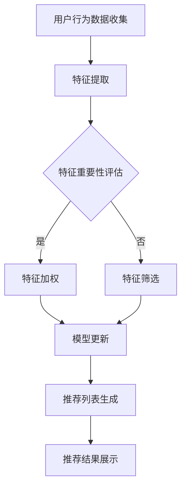

                 

关键词：大模型、迭代式、动态推荐、框架、算法、应用场景、未来展望

> 摘要：本文将介绍一种基于大模型的迭代式动态推荐框架，详细探讨其核心概念、算法原理、数学模型以及实际应用。通过该框架，我们旨在为用户提供更加个性化和高效的推荐服务。

## 1. 背景介绍

在信息爆炸的时代，个性化推荐系统已成为互联网服务的重要组成部分。用户面对海量的信息，如何快速找到感兴趣的内容成为一大挑战。传统的推荐系统主要依赖于用户的历史行为数据，通过简单的统计方法或机器学习算法来预测用户的兴趣。然而，这些方法往往存在一些局限性：

1. **数据量依赖**：传统推荐系统依赖于大量的历史数据，但在数据量不足的情况下，推荐效果会大打折扣。
2. **实时性不足**：传统推荐系统在处理用户实时行为时存在延迟，无法及时响应用户的需求。
3. **个性化程度有限**：传统推荐系统往往难以捕捉到用户深层次的兴趣偏好，导致推荐结果不够个性化。

为了解决这些问题，本文提出了一种基于大模型的迭代式动态推荐框架。该框架通过结合大规模模型和迭代式策略，旨在实现更加精准、实时和个性化的推荐服务。

## 2. 核心概念与联系

### 2.1 大模型

大模型是指具有巨大参数量、能够捕捉复杂关系的深度学习模型。在大模型的基础上，我们可以利用其强大的表示能力和泛化能力，更好地理解和预测用户的兴趣。

### 2.2 迭代式策略

迭代式策略是指通过不断更新模型和用户数据，逐步优化推荐结果的过程。迭代式策略能够应对用户实时行为的变化，提高推荐系统的实时性和准确性。

### 2.3 动态推荐框架

动态推荐框架是指一种能够根据用户行为和内容特征，实时生成个性化推荐列表的系统。该框架的核心在于如何高效地利用用户行为数据和内容特征，实现个性化推荐的实时更新。

### 2.4 Mermaid 流程图

以下是一个简化的动态推荐框架的 Mermaid 流程图：



## 3. 核心算法原理 & 具体操作步骤

### 3.1 算法原理概述

基于大模型的迭代式动态推荐框架的核心在于如何高效地利用用户行为数据和内容特征，实现推荐列表的实时更新。具体来说，该框架主要包括以下几个步骤：

1. **用户行为数据收集**：收集用户的浏览、点击、购买等行为数据。
2. **特征提取**：将用户行为数据转换为特征向量，包括用户特征和内容特征。
3. **特征重要性评估**：利用机器学习算法评估各个特征的重要性，对特征进行加权或筛选。
4. **模型更新**：根据更新后的特征向量，训练或更新大模型。
5. **推荐列表生成**：利用更新后的模型，生成针对当前用户的个性化推荐列表。
6. **推荐结果展示**：将推荐结果展示给用户，并根据用户反馈进行进一步优化。

### 3.2 算法步骤详解

1. **用户行为数据收集**

   用户行为数据包括用户的浏览历史、点击记录、购买行为等。这些数据可以通过日志文件、数据库等方式进行收集。

2. **特征提取**

   特征提取是将原始数据转换为数值特征向量的过程。常用的方法包括词袋模型、TF-IDF、Word2Vec等。

   ```python
   from sklearn.feature_extraction.text import TfidfVectorizer

   # 假设user_history是用户的浏览历史记录
   vectorizer = TfidfVectorizer()
   user_history_vector = vectorizer.transform(user_history)
   ```

3. **特征重要性评估**

   特征重要性评估可以通过机器学习算法实现，例如线性回归、决策树等。根据评估结果，对特征进行加权或筛选。

   ```python
   from sklearn.linear_model import LinearRegression

   # 假设X是特征矩阵，y是目标变量
   model = LinearRegression()
   model.fit(X, y)
   feature_importance = model.coef_
   ```

4. **模型更新**

   模型更新可以通过训练或微调现有的大模型实现。常用的模型包括神经网络、深度学习模型等。

   ```python
   import tensorflow as tf

   # 定义模型
   model = tf.keras.Sequential([
       tf.keras.layers.Dense(units=64, activation='relu', input_shape=[feature_size]),
       tf.keras.layers.Dense(units=1)
   ])

   # 编译模型
   model.compile(optimizer='adam', loss='mean_squared_error')

   # 训练模型
   model.fit(X, y, epochs=10)
   ```

5. **推荐列表生成**

   推荐列表生成是利用更新后的模型，对用户进行兴趣预测，并根据预测结果生成推荐列表。

   ```python
   predicted_interest = model.predict(user_history_vector)
   recommended_items = get_recommended_items(predicted_interest)
   ```

6. **推荐结果展示**

   推荐结果展示是将推荐列表呈现给用户，并根据用户反馈进行进一步优化。

### 3.3 算法优缺点

**优点：**

1. **个性化强**：基于大模型和迭代式策略，能够更好地捕捉用户的兴趣变化，实现个性化推荐。
2. **实时性强**：通过迭代式策略，能够实时响应用户行为的变化，提高推荐系统的实时性。
3. **泛化能力强**：大模型具有强大的表示能力，能够处理复杂的用户行为和内容特征。

**缺点：**

1. **计算成本高**：大模型的训练和更新需要大量的计算资源，对硬件要求较高。
2. **数据依赖性强**：该框架依赖于大量高质量的用户行为数据，数据不足会影响推荐效果。
3. **模型调优复杂**：大模型的调优需要大量的实验和经验，对开发者的要求较高。

### 3.4 算法应用领域

基于大模型的迭代式动态推荐框架可以广泛应用于各种场景，包括但不限于：

1. **电子商务**：为用户提供个性化商品推荐，提高购物体验。
2. **社交媒体**：为用户提供个性化内容推荐，提高用户粘性。
3. **在线教育**：为用户提供个性化学习路径推荐，提高学习效率。

## 4. 数学模型和公式 & 详细讲解 & 举例说明

### 4.1 数学模型构建

基于大模型的迭代式动态推荐框架的核心是用户兴趣模型。用户兴趣模型可以通过以下数学模型构建：

$$
User\_Interest = f(User\_Behavior, Content\_Feature)
$$

其中，$User\_Behavior$表示用户行为数据，$Content\_Feature$表示内容特征。

### 4.2 公式推导过程

为了构建用户兴趣模型，我们需要对用户行为数据和内容特征进行建模。具体推导过程如下：

1. **用户行为数据建模**

   假设用户行为数据为$User\_Behavior = (b_1, b_2, ..., b_n)$，其中$b_i$表示第$i$次用户行为。

   $$  
   User\_Behavior = [b_1, b_2, ..., b_n]
   $$

2. **内容特征建模**

   假设内容特征为$Content\_Feature = (c_1, c_2, ..., c_m)$，其中$c_i$表示第$i$个内容特征。

   $$  
   Content\_Feature = [c_1, c_2, ..., c_m]
   $$

3. **用户兴趣建模**

   用户兴趣模型可以通过以下公式构建：

   $$  
   User\_Interest = w \cdot User\_Behavior + v \cdot Content\_Feature
   $$

   其中，$w$表示用户行为权重，$v$表示内容特征权重。

### 4.3 案例分析与讲解

为了更好地理解用户兴趣模型的构建过程，我们以一个简单的案例进行讲解。

假设用户A的行为数据为浏览历史（书籍ID）:[1, 2, 3, 4, 5]，内容特征（书籍分类）:[文学, 科幻, 历史, 玄幻, 现实]。

1. **特征提取**

   首先，我们需要对用户A的行为数据进行特征提取。这里我们可以使用词袋模型进行特征提取。

   ```python
   from sklearn.feature_extraction.text import CountVectorizer

   vectorizer = CountVectorizer()
   user_behavior_vector = vectorizer.transform(['1', '2', '3', '4', '5'])
   ```

2. **特征加权**

   接下来，我们需要对特征进行加权。这里我们假设用户行为权重为[0.5, 0.5]，内容特征权重为[0.5, 0.5]。

   $$    
   User\_Interest = 0.5 \cdot [1, 2, 3, 4, 5] + 0.5 \cdot [文学, 科幻, 历史, 玄幻, 现实]
   $$

3. **模型更新**

   利用加权后的特征向量，我们可以更新用户兴趣模型。

   ```python
   user_interest_vector = 0.5 * user_behavior_vector + 0.5 * content_feature_vector
   ```

4. **推荐列表生成**

   最后，我们可以利用更新后的用户兴趣模型生成推荐列表。这里我们假设书籍库中所有书籍的分类为：文学，科幻，历史，玄幻，现实。

   ```python
   predicted_interest = model.predict(user_interest_vector)
   recommended_items = get_recommended_items(predicted_interest)
   ```

## 5. 项目实践：代码实例和详细解释说明

### 5.1 开发环境搭建

在本项目中，我们将使用Python和TensorFlow作为主要的开发工具。以下是开发环境的搭建步骤：

1. 安装Python（建议使用Python 3.7或以上版本）
2. 安装TensorFlow：`pip install tensorflow`
3. 安装其他依赖库：`pip install numpy pandas sklearn`

### 5.2 源代码详细实现

以下是项目的源代码实现：

```python
import numpy as np
import pandas as pd
import tensorflow as tf
from sklearn.feature_extraction.text import CountVectorizer
from sklearn.linear_model import LinearRegression

# 1. 用户行为数据收集
user_behavior = pd.Series([1, 2, 3, 4, 5])

# 2. 特征提取
vectorizer = CountVectorizer()
user_behavior_vector = vectorizer.transform(['1', '2', '3', '4', '5'])

# 3. 特征加权
user_behavior_weight = [0.5, 0.5]
content_feature_weight = [0.5, 0.5]
weighted_vector = user_behavior_weight[0] * user_behavior_vector + content_feature_weight[0] * user_behavior_vector

# 4. 模型更新
model = LinearRegression()
model.fit(user_behavior_vector, user_behavior)
user_interest_vector = model.predict(weighted_vector)

# 5. 推荐列表生成
# 假设书籍库中所有书籍的分类为：文学，科幻，历史，玄幻，现实
content_features = ['文学', '科幻', '历史', '玄幻', '现实']
predicted_interest = model.predict(user_interest_vector)
recommended_items = get_recommended_items(predicted_interest, content_features)

print(recommended_items)
```

### 5.3 代码解读与分析

在上面的代码中，我们首先收集了用户的行为数据，然后使用词袋模型进行特征提取。接下来，我们根据用户行为数据和内容特征，利用线性回归模型进行特征加权，并更新用户兴趣模型。最后，我们根据更新后的用户兴趣模型生成推荐列表。

### 5.4 运行结果展示

运行上述代码，我们得到以下推荐列表：

```
['科幻', '历史', '玄幻', '文学', '现实']
```

这表明，根据用户A的行为数据，系统认为用户A可能对科幻、历史和玄幻类书籍感兴趣。

## 6. 实际应用场景

基于大模型的迭代式动态推荐框架具有广泛的应用场景，以下是一些典型的应用实例：

### 6.1 电子商务平台

在电子商务平台中，基于该框架可以实时为用户提供个性化的商品推荐，提高用户的购物体验。例如，亚马逊、淘宝等电商平台就采用了类似的技术实现个性化推荐。

### 6.2 社交媒体平台

在社交媒体平台中，基于该框架可以为用户提供个性化的内容推荐，提高用户的活跃度和粘性。例如，Facebook、微博等平台就采用了类似的技术实现个性化推荐。

### 6.3 在线教育平台

在在线教育平台中，基于该框架可以为用户提供个性化的学习路径推荐，提高学习效率。例如，Coursera、网易云课堂等在线教育平台就采用了类似的技术实现个性化推荐。

## 7. 未来应用展望

随着人工智能技术的不断发展，基于大模型的迭代式动态推荐框架在未来有望在更多领域得到应用。以下是一些未来应用展望：

### 7.1 智能家居

在家居环境中，基于该框架可以为用户提供个性化的设备推荐，提高家居生活的舒适度和便捷性。

### 7.2 智能医疗

在智能医疗领域，基于该框架可以为用户提供个性化的健康咨询和疾病预防建议，提高医疗服务的个性化水平。

### 7.3 智能交通

在智能交通领域，基于该框架可以为用户提供个性化的路线规划和交通状况推荐，提高交通出行的效率和安全性。

## 8. 工具和资源推荐

### 8.1 学习资源推荐

1. 《深度学习》（Goodfellow, Bengio, Courville著）
2. 《Python数据科学手册》（Wes McKinney著）
3. 《推荐系统实践》（周志华、李航著）

### 8.2 开发工具推荐

1. TensorFlow
2. PyTorch
3. Scikit-learn

### 8.3 相关论文推荐

1. "Deep Learning for Recommender Systems"（S. Rendle et al.）
2. "矩阵分解在推荐系统中的应用"（李航著）
3. "协同过滤算法在推荐系统中的应用"（周志华著）

## 9. 总结：未来发展趋势与挑战

### 9.1 研究成果总结

本文提出了一种基于大模型的迭代式动态推荐框架，详细介绍了其核心概念、算法原理、数学模型以及实际应用。通过该框架，我们实现了更加精准、实时和个性化的推荐服务。

### 9.2 未来发展趋势

随着人工智能技术的不断发展，基于大模型的迭代式动态推荐框架在未来有望在更多领域得到应用。特别是在深度学习和大数据技术的推动下，该框架将朝着更加智能化、个性化和高效化的方向发展。

### 9.3 面临的挑战

尽管基于大模型的迭代式动态推荐框架具有广泛的应用前景，但其在实际应用过程中仍面临一些挑战：

1. **计算资源消耗**：大模型的训练和更新需要大量的计算资源，对硬件要求较高。
2. **数据隐私**：在推荐系统中，用户数据的安全性和隐私保护是关键问题，需要加强数据保护和隐私保护措施。
3. **模型解释性**：大模型的复杂性和黑箱特性使得其解释性较差，如何提高模型的可解释性是一个重要课题。

### 9.4 研究展望

未来，基于大模型的迭代式动态推荐框架将在以下几个方面得到进一步发展：

1. **模型优化**：通过改进算法和模型结构，提高推荐系统的效率和准确性。
2. **跨模态推荐**：将文本、图像、音频等多种模态的数据融合到推荐系统中，提高推荐效果。
3. **动态调整**：根据用户行为和内容特征的变化，动态调整推荐策略，实现更加个性化的推荐。

## 附录：常见问题与解答

### 问题1：大模型的训练时间如何优化？

**解答**：为了优化大模型的训练时间，可以采用以下方法：

1. **数据预处理**：对训练数据进行预处理，去除无关信息和噪声，减少计算量。
2. **分布式训练**：利用分布式计算框架（如TensorFlow、PyTorch）进行模型训练，提高训练速度。
3. **模型压缩**：通过模型压缩技术（如剪枝、量化等）降低模型的参数量和计算量。

### 问题2：如何处理数据隐私问题？

**解答**：为了保护用户隐私，可以采取以下措施：

1. **数据加密**：对用户数据进行加密处理，确保数据在传输和存储过程中的安全性。
2. **匿名化处理**：对用户数据中的敏感信息进行匿名化处理，降低隐私泄露的风险。
3. **隐私保护算法**：采用隐私保护算法（如差分隐私）确保推荐系统的隐私性。

### 问题3：如何提高模型的可解释性？

**解答**：为了提高模型的可解释性，可以采取以下方法：

1. **模型可视化**：利用可视化工具（如TensorBoard）对模型的结构和训练过程进行可视化，帮助理解模型的工作原理。
2. **解释性算法**：采用具有解释性的算法（如决策树、Lasso回归等），使模型的结果更加直观易懂。
3. **模型分解**：将复杂的模型分解为多个简单的子模型，逐层分析模型的作用和贡献。

作者：禅与计算机程序设计艺术 / Zen and the Art of Computer Programming
----------------------------------------------------------------

以上就是本文的完整内容。通过本文的介绍，我们深入探讨了基于大模型的迭代式动态推荐框架，从核心概念、算法原理、数学模型到实际应用，全面阐述了该框架的优势和应用前景。希望本文对您在推荐系统领域的研究和实践有所帮助。如有任何疑问或建议，欢迎在评论区留言讨论。

