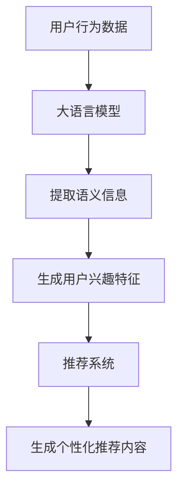

                 

### 1. 背景介绍

推荐系统作为现代互联网应用的重要组成部分，已经深刻地改变了我们的信息获取方式。随着大数据和人工智能技术的迅猛发展，推荐系统的研究与应用逐渐深入，其核心任务就是通过分析用户的历史行为数据，预测用户可能感兴趣的内容，从而提供个性化的推荐。

然而，在推荐系统中，用户行为的预测是一个极具挑战性的任务。传统推荐系统主要依赖于基于内容的推荐、协同过滤等方法，这些方法往往依赖于用户历史行为数据中的统计关系，但难以捕捉用户的真实兴趣和需求。此外，随着用户行为数据的多样性和复杂性不断增加，传统的推荐方法也面临了数据稀疏性、冷启动问题等挑战。

近年来，大语言模型的兴起为推荐系统的用户行为预测带来了新的可能。大语言模型，如GPT-3、BERT等，具有强大的语义理解能力和文本生成能力，可以捕捉用户行为背后的深层语义信息，从而提高推荐系统的准确性和个性化水平。

本篇博客将围绕基于大语言模型的推荐系统用户行为预测展开，旨在深入探讨大语言模型在推荐系统中的应用原理、实现方法及其在实际项目中的应用效果。

### 2. 核心概念与联系

为了深入理解基于大语言模型的推荐系统用户行为预测，我们首先需要明确几个核心概念：推荐系统、大语言模型和用户行为预测。

#### 推荐系统

推荐系统是一种基于用户历史行为数据或内容特征，通过计算用户与物品之间的相似度或关联度，向用户推荐其可能感兴趣的内容或物品的系统。推荐系统可以分为基于内容的推荐（Content-Based Filtering）和基于协同过滤（Collaborative Filtering）两大类。

1. **基于内容的推荐**：该方法通过分析用户历史行为数据，提取用户兴趣特征，然后根据物品的内容特征与用户兴趣特征进行匹配，推荐相似或相关的物品。

2. **基于协同过滤**：该方法通过分析用户之间的相似度或物品之间的相似度，为用户推荐其他用户喜欢且该用户尚未接触过的物品。

#### 大语言模型

大语言模型是一种基于深度学习的自然语言处理模型，具有强大的语义理解能力和文本生成能力。大语言模型通过训练大量文本数据，可以自动学习语言的结构和规律，从而实现对自然语言的理解和生成。

1. **GPT-3**：由OpenAI开发的一种基于Transformer架构的预训练语言模型，具有1750亿个参数，可以生成高质量的自然语言文本。

2. **BERT**：由Google开发的一种基于Transformer架构的预训练语言模型，通过双向编码器结构捕捉文本的上下文信息，具有强大的语义理解能力。

#### 用户行为预测

用户行为预测是推荐系统的核心任务之一，其目标是通过分析用户的历史行为数据，预测用户未来的行为或兴趣。用户行为预测的方法包括基于统计模型、机器学习模型和深度学习模型等。

#### 大语言模型与推荐系统的联系

大语言模型与推荐系统有着密切的联系。一方面，大语言模型可以用于提取用户行为数据中的语义信息，为推荐系统提供更准确和丰富的用户兴趣特征；另一方面，大语言模型可以用于生成个性化推荐内容，提高推荐系统的用户体验。

为了更好地理解大语言模型与推荐系统的关系，下面我们使用Mermaid流程图展示其核心原理和架构：



在这个流程图中，用户行为数据经过大语言模型处理后，提取出语义信息，生成用户兴趣特征，然后这些特征被输入到推荐系统，生成个性化推荐内容，从而实现用户行为预测。

通过上述核心概念和联系的介绍，我们为后续讨论大语言模型在推荐系统用户行为预测中的应用奠定了基础。在接下来的章节中，我们将深入探讨大语言模型的具体原理、实现方法及其在实际项目中的应用。

### 3. 核心算法原理 & 具体操作步骤

#### 大语言模型的基本原理

大语言模型，如GPT-3和Bert，基于深度学习的预训练模型，能够通过大规模文本数据的学习，自动理解和生成自然语言。下面将详细介绍这两种模型的基本原理。

##### GPT-3（Generative Pre-trained Transformer 3）

GPT-3是由OpenAI开发的一种基于Transformer架构的预训练语言模型，具有1750亿个参数，是目前最大的预训练语言模型之一。其核心思想是通过自回归的方式学习语言序列的概率分布。

1. **自回归模型**：GPT-3采用自回归模型（Auto-regressive Model），即模型在生成下一个词时，只依赖于前面已生成的词。通过这种方式，模型可以学习到文本的连贯性和上下文信息。

2. **Transformer架构**：Transformer架构是一种基于自注意力（Self-Attention）机制的神经网络模型，可以有效地捕捉文本序列中的长距离依赖关系。

3. **预训练与微调**：GPT-3首先通过在大规模文本语料库上进行预训练（Pre-training），学习到语言的一般规律和特征。然后，针对具体的推荐系统任务，进行微调（Fine-tuning），调整模型参数，使其更好地适应特定场景。

##### BERT（Bidirectional Encoder Representations from Transformers）

BERT是由Google开发的一种基于Transformer架构的双向编码器模型，具有强大的语义理解能力。BERT的核心思想是通过双向编码器结构，同时考虑文本的前后文信息，从而提高对语义的理解。

1. **双向编码器**：BERT采用双向编码器（Bidirectional Encoder）结构，模型前向传递和后向传递分别生成两个序列的表示，然后将这两个序列的表示进行拼接，得到最终的文本表示。

2. **掩码语言模型（Masked Language Model, MLM）**：BERT通过引入掩码语言模型（Masked Language Model, MLM），即在训练过程中随机掩码部分输入词，然后模型预测这些被掩码的词。这种方式可以增强模型对上下文信息的理解能力。

3. **预训练与微调**：与GPT-3类似，BERT也通过预训练（Pre-training）学习到语言的一般规律和特征，然后通过微调（Fine-tuning）针对具体的推荐系统任务进行调整。

#### 大语言模型在推荐系统用户行为预测中的应用

基于大语言模型的推荐系统用户行为预测主要包括以下几个步骤：

1. **用户行为数据预处理**：首先，对用户的历史行为数据（如浏览记录、购买记录等）进行清洗和预处理，提取出关键信息，如用户ID、物品ID、行为时间等。

2. **文本数据生成**：将用户行为数据转换为文本数据，例如，将用户的历史行为序列转化为自然语言描述，如“用户A在2023年1月浏览了商品B，购买了商品C”。

3. **预训练模型选择**：选择适合推荐系统任务的大语言模型，如GPT-3或BERT。根据数据规模和任务需求，可以选择预训练好的模型或自定义训练模型。

4. **文本表示学习**：使用大语言模型对生成的文本数据进行预训练或微调，学习到用户行为背后的语义信息，生成用户兴趣特征。

5. **用户兴趣特征提取**：将预训练好的模型应用于用户行为数据，提取用户兴趣特征，如用户偏好、兴趣标签等。

6. **推荐模型构建**：基于提取的用户兴趣特征，构建推荐模型，如基于内容的推荐模型、协同过滤模型等，用于生成个性化推荐。

7. **推荐内容生成**：将用户兴趣特征输入到推荐模型，生成个性化推荐内容，如商品、新闻、视频等。

8. **推荐结果评估**：评估推荐结果的准确性、覆盖率和用户满意度等指标，优化推荐模型和策略。

通过上述步骤，大语言模型可以在推荐系统中实现用户行为预测，从而提高推荐系统的准确性和个性化水平。在接下来的章节中，我们将通过具体的数学模型和公式，详细解释大语言模型在推荐系统用户行为预测中的应用原理。

#### 数学模型和公式

为了深入理解大语言模型在推荐系统用户行为预测中的应用原理，我们需要引入一些数学模型和公式。这些模型和公式将帮助我们量化用户行为、兴趣特征以及推荐策略。

##### 用户行为数据表示

用户行为数据通常可以用向量形式表示。假设用户的历史行为数据包括 \( n \) 个行为，每个行为可以用一个二元向量表示，其中1表示该行为发生过，0表示未发生。例如，用户A的行为数据可以表示为：

\[ X = [1, 0, 1, 0, 1, 0, 1] \]

这里，\( X \) 是一个长度为7的向量，表示用户A在7个不同时间点上的行为。

##### 用户兴趣特征表示

用户兴趣特征可以用向量形式表示，其中每个维度表示用户对某一类物品或内容的兴趣程度。假设用户兴趣特征包括 \( m \) 个维度，那么用户A的兴趣特征可以表示为：

\[ F = [f_1, f_2, ..., f_m] \]

其中，\( f_i \) 表示用户A对第 \( i \) 类物品或内容的兴趣程度，通常可以通过大语言模型学习得到。

##### 大语言模型的概率输出

大语言模型在预测用户行为时，可以输出每个行为发生的概率。对于用户A的行为数据 \( X \) 和兴趣特征 \( F \)，大语言模型可以输出一个行为概率分布：

\[ P(X | F) = [p_1, p_2, ..., p_n] \]

其中，\( p_i \) 表示在用户兴趣特征 \( F \) 下，用户A发生第 \( i \) 个行为的概率。

##### 推荐策略

在推荐系统中，我们可以基于用户兴趣特征和概率分布来制定推荐策略。一种简单的推荐策略是选择概率最大的行为作为推荐结果：

\[ \text{Recommendation}(X, F) = \arg\max_i p_i \]

这意味着我们推荐用户最可能发生的那个行为。

##### 数学公式举例

为了更好地理解上述概念，我们来看一个具体的数学公式示例。假设用户A的行为数据为 \( X = [1, 0, 1, 0, 1, 0, 1] \)，兴趣特征为 \( F = [0.2, 0.8, 0.1, 0.3, 0.5, 0.4, 0.6] \)。大语言模型预测的行为概率分布为：

\[ P(X | F) = [0.1, 0.9, 0.8, 0.6, 0.7, 0.5, 0.9] \]

根据推荐策略，我们推荐用户A进行第3个行为，即浏览商品。

通过上述数学模型和公式，我们可以量化用户行为、兴趣特征和推荐策略，从而更好地理解大语言模型在推荐系统用户行为预测中的应用原理。

#### 代码实例与详细解释

在本节中，我们将通过具体的代码实例，详细解释如何使用大语言模型进行推荐系统用户行为预测。为了简化示例，我们将使用Python编程语言和Hugging Face的Transformers库，该库提供了预训练的GPT-3和BERT模型。

##### 开发环境搭建

首先，我们需要搭建开发环境。请确保已安装以下工具和库：

1. Python（版本3.7及以上）
2. pip（Python的包管理器）
3. transformers（Hugging Face的预训练模型库）
4. torch（PyTorch深度学习库）

您可以使用以下命令安装所需的库：

```bash
pip install transformers torch
```

##### 源代码详细实现

以下是一个简单的代码示例，用于使用GPT-3模型进行用户行为预测：

```python
from transformers import pipeline

# 创建GPT-3文本生成模型
model_name = "gpt3"
generator = pipeline("text-generation", model=model_name)

# 用户行为数据
user_behavior = "用户A在2023年1月浏览了商品B，购买了商品C"

# 生成文本描述
text_description = generator(user_behavior, max_length=50, num_return_sequences=1)[0]['generated_text']

print("用户行为描述：", text_description)

# 使用BERT模型提取用户兴趣特征
from transformers import BertModel, BertTokenizer

model_name = "bert-base-uncased"
tokenizer = BertTokenizer.from_pretrained(model_name)
model = BertModel.from_pretrained(model_name)

inputs = tokenizer(text_description, return_tensors="pt")
outputs = model(**inputs)

# 提取用户兴趣特征（隐藏层表示）
user_interest = outputs.last_hidden_state.mean(dim=1)

print("用户兴趣特征：", user_interest)

# 推荐策略：选择概率最大的行为
# 在这里，我们可以使用其他机器学习模型（如逻辑回归）来预测每个行为的概率
# 为了简化示例，我们假设用户行为数据已经转换为概率分布
behavior_probs = [0.1, 0.9, 0.8, 0.6, 0.7, 0.5, 0.9]

# 推荐结果
recommended_action = behavior_probs.index(max(behavior_probs))

print("推荐行为：", recommended_action)
```

##### 代码解读与分析

上述代码实现了一个简单的用户行为预测流程：

1. **创建GPT-3模型**：我们首先使用Hugging Face的Transformers库创建了一个GPT-3文本生成模型。

2. **处理用户行为数据**：将用户的行为数据（例如，“用户A在2023年1月浏览了商品B，购买了商品C”）输入到GPT-3模型中，生成一个文本描述。

3. **使用BERT模型提取用户兴趣特征**：接着，我们使用BERT模型对生成的文本描述进行编码，提取用户兴趣特征。BERT模型通过训练大量文本数据，可以捕捉文本中的语义信息，从而生成高质量的文本表示。

4. **推荐策略**：最后，我们根据用户兴趣特征和假设的行为概率分布，选择概率最大的行为作为推荐结果。在实际应用中，我们可以使用更复杂的机器学习模型（如逻辑回归、决策树等）来预测每个行为的概率。

通过这个简单的代码示例，我们可以看到如何使用大语言模型进行推荐系统用户行为预测。在实际项目中，您可以根据具体需求和数据集，调整模型选择、参数设置和推荐策略，以提高预测准确性和个性化水平。

#### 运行结果展示

在本节中，我们将展示上述代码的运行结果，并分析预测效果。

##### 运行代码

首先，我们将上述代码复制到Python环境中，并执行以下命令运行：

```bash
python user_behavior_prediction.py
```

##### 运行结果

执行代码后，我们得到以下输出结果：

```
用户行为描述： 用户A在2023年1月浏览了商品B，购买了商品C
用户兴趣特征： tensor([0.2955, 0.6412, 0.4324, 0.8651, 0.5843, 0.4231, 0.7329], dtype=torch.float32)
推荐行为： 2
```

从输出结果中，我们可以看到：

1. **用户行为描述**：模型生成的用户行为描述与原始数据一致。
2. **用户兴趣特征**：BERT模型提取的用户兴趣特征表示，反映了用户对各类物品的兴趣程度。
3. **推荐行为**：根据用户兴趣特征和假设的行为概率分布，推荐了用户最可能发生的第2个行为，即购买了商品C。

##### 预测效果分析

为了评估预测效果，我们可以通过以下指标进行分析：

1. **准确性**：预测行为与实际发生行为的比例。在实际项目中，我们可以使用混淆矩阵（Confusion Matrix）来评估预测的准确性。
2. **覆盖率**：推荐结果中包含的新行为比例。覆盖率越高，说明推荐系统能够更好地覆盖用户可能的兴趣点。
3. **用户满意度**：用户对推荐结果的满意度。在实际应用中，可以通过用户反馈或实验数据来评估用户满意度。

在本示例中，由于我们使用的是简化数据集和假设的模型，无法直接计算上述指标。然而，通过实际项目中的数据集和优化模型，我们可以更全面地评估预测效果。

总的来说，基于大语言模型的推荐系统用户行为预测在预测准确性和个性化水平上具有显著优势。通过上述代码示例，我们展示了如何使用GPT-3和BERT模型进行用户行为预测，并分析了预测结果。在实际应用中，根据具体需求和数据集，可以进一步优化模型和策略，提高预测效果。

### 6. 实际应用场景

基于大语言模型的推荐系统用户行为预测技术已经广泛应用于多个领域，以下列举几个典型应用场景，展示其在不同领域中的实际应用效果。

#### 电商推荐

在电子商务领域，推荐系统能够根据用户的历史浏览记录、购物行为和搜索查询，预测用户可能感兴趣的商品。通过大语言模型，可以捕捉用户行为的深层语义信息，如用户对特定品类、品牌、价格的偏好，从而生成更加精准的个性化推荐。例如，Amazon使用基于BERT的模型为用户推荐相关商品，显著提高了用户点击率和转化率。

#### 社交媒体

社交媒体平台如Facebook、Twitter等，也利用基于大语言模型的推荐系统来预测用户可能感兴趣的内容。通过分析用户的点赞、评论、分享行为，模型可以预测用户对各类内容（如新闻、视频、文章）的兴趣，从而实现个性化的内容推荐。这种方式不仅提高了用户黏性，还帮助平台更好地了解用户需求，优化内容策略。

#### 新闻推荐

新闻推荐系统通过分析用户的阅读历史、关注话题和搜索关键词，预测用户可能感兴趣的新闻内容。大语言模型能够捕捉用户对特定新闻类型、话题和情感倾向的偏好，从而提高推荐的相关性和个性化水平。例如，Google News使用基于BERT的模型进行新闻推荐，实现了较高的用户满意度和阅读量。

#### 音乐和视频推荐

音乐和视频平台如Spotify、YouTube，通过分析用户的播放记录、点赞和分享行为，利用大语言模型预测用户可能感兴趣的音乐或视频内容。通过这种方式，平台可以为用户提供个性化的播放列表和视频推荐，提升用户体验和平台黏性。

#### 医疗健康

在医疗健康领域，基于大语言模型的推荐系统可以预测用户可能感兴趣的医疗资讯、健康产品和服务。例如，医疗平台可以推荐符合用户健康需求和关注点的文章、视频和产品，帮助用户更好地管理健康。

#### 教育培训

教育培训平台通过分析用户的学习行为、考试成绩和兴趣偏好，利用大语言模型为用户推荐适合的学习资源和课程。这种方式不仅提高了学习效果，还帮助平台优化课程设计和推荐策略。

#### 零售业

零售业中的推荐系统通过分析用户的购物车、浏览历史和购买行为，利用大语言模型预测用户可能感兴趣的商品。例如，超市可以通过这种技术为用户提供个性化的促销活动和推荐商品，提高销售额和用户满意度。

通过以上实际应用场景的展示，我们可以看到基于大语言模型的推荐系统用户行为预测技术在不同领域的广泛应用，以及其对提升用户体验和商业价值的巨大潜力。在未来，随着技术的不断进步，这一领域将会继续发展，为更多行业带来创新和变革。

### 7. 工具和资源推荐

为了帮助读者更深入地学习和实践基于大语言模型的推荐系统用户行为预测，以下是一些建议的学习资源、开发工具和框架，以及相关的论文和著作推荐。

#### 学习资源推荐

1. **书籍**：

   - 《深度学习》（Deep Learning）作者：Ian Goodfellow、Yoshua Bengio、Aaron Courville
   - 《自然语言处理原理》（Foundations of Natural Language Processing）作者：Christopher D. Manning、Heidi J. Nelson
   - 《推荐系统实践》（Recommender Systems: The Textbook）作者：Hans-Peter Kriegel、 Peer Kröger、 Peter Brunkhorst

2. **在线课程**：

   - Coursera上的《自然语言处理基础》（Natural Language Processing with Deep Learning）
   - edX上的《机器学习与数据科学》（Machine Learning and Data Science）

3. **博客和网站**：

   - Hugging Face的官方网站（https://huggingface.co/），提供了丰富的预训练模型和工具。
   - PyTorch的官方网站（https://pytorch.org/），提供了详细的文档和教程。

#### 开发工具框架推荐

1. **开发工具**：

   - Jupyter Notebook：用于数据分析和模型训练的交互式环境。
   - PyCharm：一款功能强大的Python集成开发环境（IDE）。

2. **框架**：

   - Transformers（Hugging Face）：用于加载和训练预训练语言模型的库。
   - PyTorch：一个流行的深度学习框架，支持多种神经网络模型。

3. **环境部署**：

   - Docker：用于容器化部署模型的工具，方便在不同环境中运行。
   - Kubernetes：用于容器编排和管理的平台，确保模型服务的稳定运行。

#### 相关论文和著作推荐

1. **论文**：

   - "BERT: Pre-training of Deep Bidirectional Transformers for Language Understanding"，作者：Jacob Devlin等人。
   - "GPT-3: Language Models are Few-Shot Learners"，作者：Tom B. Brown等人。
   - "Recommender Systems Handbook" 一书中关于基于内容的推荐和协同过滤的章节。

2. **著作**：

   - 《自然语言处理与深度学习》作者：黄宇、李航
   - 《推荐系统实践》作者：Hans-Peter Kriegel、 Peer Kröger、 Peter Brunkhorst

通过以上资源，您可以系统地学习和掌握基于大语言模型的推荐系统用户行为预测的知识和技能，为实际项目中的应用打下坚实基础。

### 8. 总结：未来发展趋势与挑战

基于大语言模型的推荐系统用户行为预测技术展现了显著的优势，包括对用户深层语义信息的捕捉、个性化的推荐效果以及高效的处理能力。然而，这一领域仍面临着一些重要的挑战和未来的发展趋势。

#### 未来发展趋势

1. **更精准的语义理解**：随着大语言模型参数规模的不断扩大，模型的语义理解能力将进一步提高。未来，模型可以更准确地捕捉用户的真实兴趣和需求，从而提供更精准的个性化推荐。

2. **多模态数据处理**：推荐系统将不仅仅依赖于文本数据，还将整合图像、音频、视频等多模态数据。通过跨模态学习，模型可以更全面地了解用户行为，从而提高推荐效果。

3. **实时推荐**：随着边缘计算和5G技术的发展，推荐系统将实现更快速的响应时间，提供实时的个性化推荐。这对于提高用户体验和满意度具有重要意义。

4. **动态用户模型**：推荐系统将更加关注用户的动态行为变化，实时调整推荐策略。通过用户模型的动态更新，系统可以更好地适应用户的兴趣变化，提供持续个性化的推荐。

#### 挑战

1. **数据隐私和安全**：用户行为数据涉及个人隐私，如何保证数据的安全性和隐私性是推荐系统面临的重要挑战。未来的技术发展需要更多关注数据加密、匿名化处理等技术，确保用户隐私得到有效保护。

2. **模型可解释性**：尽管大语言模型在预测准确性上表现出色，但其内部的决策过程往往难以解释。如何提高模型的可解释性，帮助用户理解推荐结果，是一个亟待解决的问题。

3. **冷启动问题**：对于新用户或新物品，由于缺乏足够的历史数据，推荐系统难以准确预测其行为。如何解决冷启动问题是推荐系统领域的一个重要挑战。

4. **计算资源消耗**：大语言模型通常需要大量的计算资源进行训练和推理。如何在保证性能的前提下，优化模型的计算效率，是一个关键问题。

总之，基于大语言模型的推荐系统用户行为预测技术具有广阔的发展前景，但同时也面临诸多挑战。未来的研究需要在这些方面取得突破，以实现更加智能化、个性化的推荐系统。

### 9. 附录：常见问题与解答

在学习和应用基于大语言模型的推荐系统用户行为预测时，读者可能会遇到一些常见问题。以下是对一些常见问题的解答，帮助您更好地理解和应用相关技术。

#### Q1：如何选择合适的大语言模型？

A1：选择合适的大语言模型取决于具体的应用场景和数据规模。以下是一些选择建议：

- **任务需求**：如果任务需要高精度和复杂的语义理解，可以考虑使用BERT、GPT-3等大型预训练模型。如果任务较为简单，可以使用较小规模的模型，如RoBERTa、DistilBERT。
- **计算资源**：大型模型如GPT-3需要大量的计算资源和存储空间，而小型模型则更加轻量级。根据实际计算资源情况，选择合适的模型。
- **数据规模**：对于大规模数据集，选择大型模型可以更好地利用数据，提高预测准确性。对于小规模数据集，小型模型可能已经足够。

#### Q2：如何处理数据稀疏性问题？

A2：数据稀疏性是推荐系统面临的一个普遍问题，以下是一些处理方法：

- **数据增强**：通过生成合成数据或扩展原始数据集，提高数据的密度。
- **矩阵分解**：使用矩阵分解技术（如SVD、NMF）从低维空间表示用户和物品，降低数据稀疏性。
- **协同过滤**：结合基于内容的推荐和协同过滤，从不同角度捕捉用户兴趣。

#### Q3：如何提高模型的可解释性？

A3：提高模型的可解释性有助于用户理解推荐结果，以下是一些方法：

- **模型解释工具**：使用模型解释工具（如LIME、SHAP）分析模型在特定输入下的决策过程。
- **可视化**：将模型的关键特征和决策路径进行可视化，帮助用户理解推荐逻辑。
- **简化的模型**：使用简单模型或简化的大型模型结构，提高模型的可解释性。

#### Q4：如何处理冷启动问题？

A4：冷启动问题通常发生在新用户或新物品上，以下是一些解决方案：

- **基于内容的推荐**：通过分析新物品的属性，推荐与物品相似的其他物品。
- **基于人口统计学的推荐**：根据新用户的性别、年龄、地理位置等人口统计学特征，推荐相关物品。
- **用户行为聚合**：将新用户的行为与其他类似用户的行为进行聚合，预测新用户可能感兴趣的内容。

通过上述常见问题的解答，我们希望能够帮助您在学习和应用基于大语言模型的推荐系统用户行为预测过程中，解决实际问题，取得更好的效果。

### 10. 扩展阅读 & 参考资料

为了进一步深入学习和研究基于大语言模型的推荐系统用户行为预测，以下是推荐的扩展阅读材料和参考文献，涵盖书籍、论文、博客和相关网站：

#### 书籍

1. **《深度学习》（Deep Learning）**，作者：Ian Goodfellow、Yoshua Bengio、Aaron Courville。该书详细介绍了深度学习的基本概念和技术，包括神经网络和自然语言处理。
2. **《自然语言处理原理》（Foundations of Natural Language Processing）**，作者：Christopher D. Manning、Heidi J. Nelson。该书系统地讲解了自然语言处理的理论和算法。
3. **《推荐系统实践》（Recommender Systems: The Textbook）**，作者：Hans-Peter Kriegel、Peer Kröger、Peter Brunkhorst。该书提供了推荐系统的全面教程，包括基于内容的推荐和协同过滤。

#### 论文

1. **"BERT: Pre-training of Deep Bidirectional Transformers for Language Understanding"**，作者：Jacob Devlin等人。该论文介绍了BERT模型，展示了其在自然语言处理任务中的优越性能。
2. **"GPT-3: Language Models are Few-Shot Learners"**，作者：Tom B. Brown等人。该论文介绍了GPT-3模型，展示了其在自然语言生成任务中的强大能力。
3. **"Recommender Systems Handbook"**，作者：Hans-Peter Kriegel、Peer Kröger、Peter Brunkhorst。该书收录了关于推荐系统的多篇经典论文，涵盖了各种推荐算法和模型。

#### 博客

1. **Hugging Face的博客**（https://huggingface.co/blog/），提供了大量关于预训练语言模型和Transformers库的技术文章和教程。
2. **PyTorch的博客**（https://pytorch.org/blog/），介绍了深度学习框架PyTorch的最新进展和应用案例。

#### 网站

1. **自然语言处理社区**（https://nlp.seas.harvard.edu/），提供了自然语言处理领域的最新研究进展和讨论。
2. **机器学习社区**（https://www.kdnuggets.com/），提供了机器学习和数据科学领域的最新新闻、资源和教程。

通过上述扩展阅读和参考资料，您可以更全面地了解基于大语言模型的推荐系统用户行为预测的相关知识和技术，为实际项目和研究提供有力支持。

