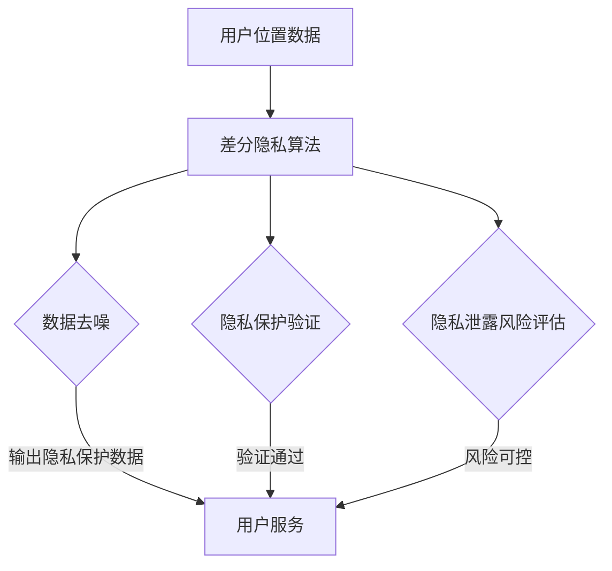
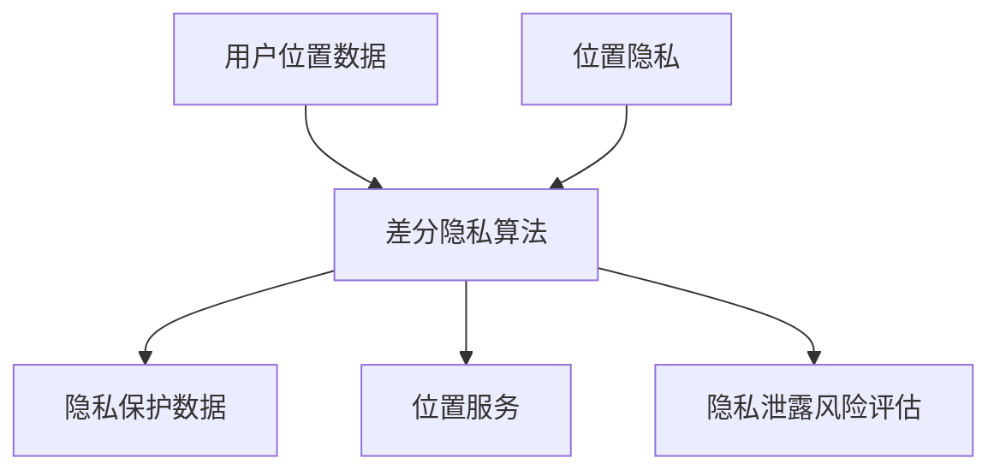
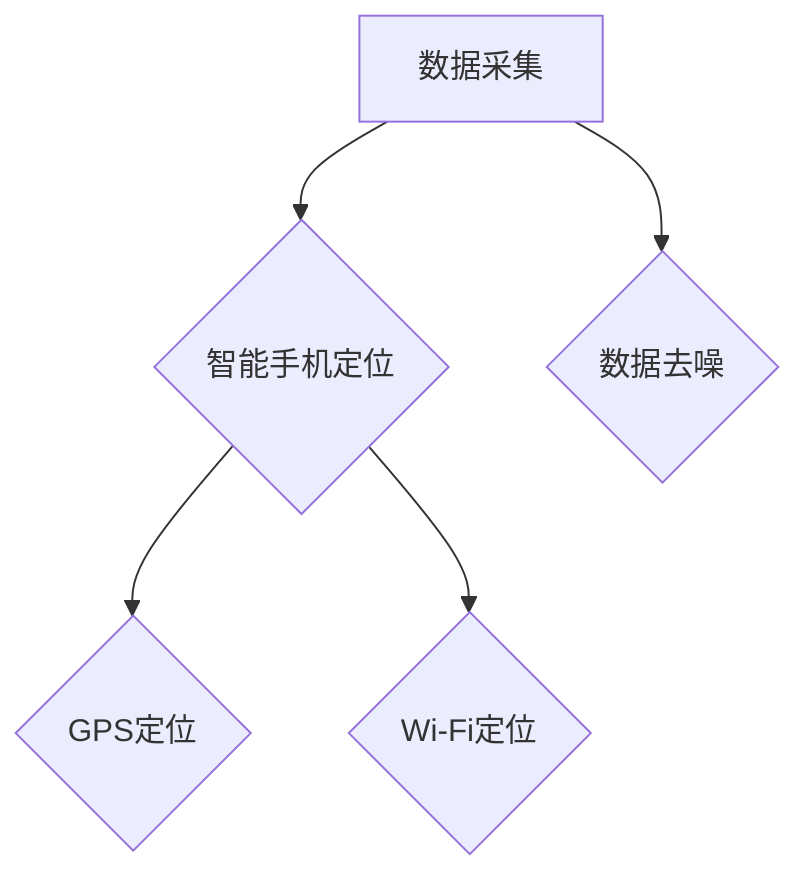
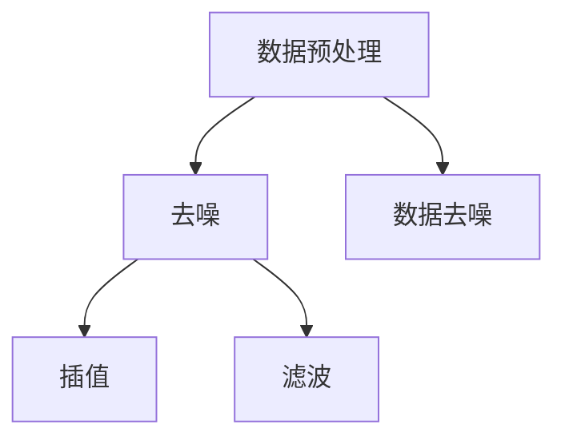
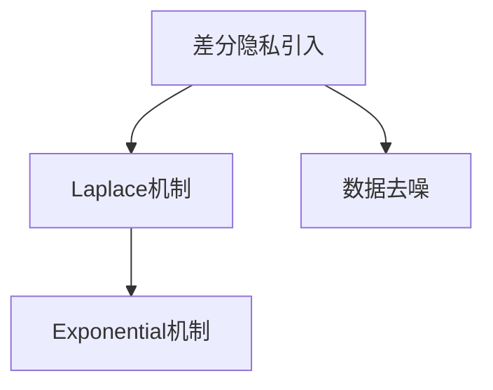
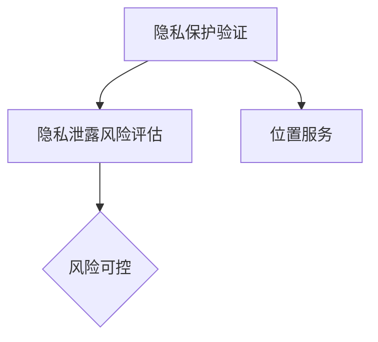
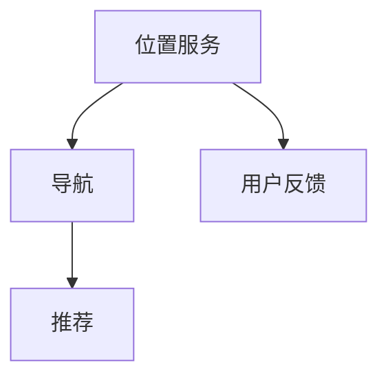

                 

关键词：差分隐私、位置隐私、系统设计、算法实现、应用场景

### 摘要

本文旨在探讨差分隐私技术在位置隐私保护领域的应用，设计并实现了一套基于差分隐私的位置隐私保护系统。文章首先介绍了差分隐私的概念及其在隐私保护中的重要性，然后分析了当前位置隐私保护技术的现状和挑战，接着详细阐述了系统的整体架构、核心算法原理及具体实现步骤。此外，本文还通过数学模型和实例，对算法进行了深入解析，并展示了系统在实际应用中的效果。最后，文章对系统的未来发展趋势和面临的挑战进行了展望。

## 1. 背景介绍

在信息化和数字化快速发展的今天，位置信息作为一种重要的数据资源，已经在我们的日常生活和工作中扮演着越来越重要的角色。然而，位置信息的泄露可能会导致个人隐私受到侵犯，甚至引发严重的后果。因此，如何有效地保护位置隐私已成为当前研究的热点问题。

差分隐私（Differential Privacy）作为一种隐私保护机制，最早由Cynthia Dwork提出，旨在在不泄露单个用户隐私的前提下，从数据集中提取统计信息。差分隐私的核心思想是通过在算法中引入噪声，使得输出结果的差异不能揭示个体数据的存在。这种机制在保护隐私的同时，仍能提供足够的信息以支持数据分析和机器学习。

近年来，差分隐私在位置隐私保护领域得到了广泛关注。尽管已有一些相关研究，但如何在保证隐私保护的前提下，实现高效的位置信息处理和查询，仍然是一个具有挑战性的问题。

## 2. 核心概念与联系

### 2.1 差分隐私

差分隐私是一种保障隐私的技术手段，其核心概念是确保在处理数据时，单个个体的隐私不被泄露。差分隐私通过在数据分析和机器学习算法中引入噪声，使得输出结果无法反映出个体数据的具体值，从而保护隐私。

### 2.2 位置隐私

位置隐私是指用户的位置信息不被未经授权的个人或机构获取、使用和共享。位置隐私保护的核心目标是确保用户在享受位置服务的同时，不受隐私泄露的威胁。

### 2.3 差分隐私与位置隐私

差分隐私技术为位置隐私保护提供了一种有效手段。通过差分隐私机制，位置信息在处理和分析过程中得到有效保护，既满足了数据使用的需求，又避免了隐私泄露的风险。

### 2.4 Mermaid 流程图

以下是差分隐私位置隐私保护系统的 Mermaid 流程图：



### 2.5 核心概念关系图



## 3. 核心算法原理 & 具体操作步骤

### 3.1 算法原理概述

基于差分隐私的位置隐私保护算法主要包括以下步骤：

1. 数据采集：收集用户的位置数据。
2. 数据预处理：对采集到的位置数据进行去噪和处理。
3. 差分隐私引入：在数据处理过程中引入噪声，确保隐私保护。
4. 隐私保护验证：对处理后的数据进行隐私保护验证，确保隐私泄露风险可控。
5. 位置服务：为用户提供基于隐私保护的位置服务。

### 3.2 算法步骤详解

#### 3.2.1 数据采集

数据采集是算法实现的第一步，主要任务是从各种渠道获取用户的位置信息。这些渠道可以包括智能手机、GPS、Wi-Fi定位等。



#### 3.2.2 数据预处理

数据预处理的主要目的是去除噪声和异常值，提高数据质量。常用的方法包括去噪、插值、滤波等。



#### 3.2.3 差分隐私引入

差分隐私引入是算法实现的核心步骤，主要包括以下方法：

1. Laplace机制：通过在输出结果中添加Laplace噪声，实现隐私保护。
2. Exponential机制：通过在输出结果中添加指数噪声，实现隐私保护。



#### 3.2.4 隐私保护验证

隐私保护验证的主要任务是确保数据处理过程中隐私保护的有效性。常用的方法包括隐私泄露风险评估、隐私预算管理等。



#### 3.2.5 位置服务

位置服务是算法实现的目标，通过隐私保护的位置信息，为用户提供各种基于位置的服务，如导航、推荐等。



### 3.3 算法优缺点

#### 优点：

1. 强大的隐私保护能力：通过引入差分隐私机制，能有效防止隐私泄露。
2. 适应性：适用于各种位置信息采集和处理场景。
3. 可扩展性：易于与其他隐私保护技术结合，实现更高级的隐私保护。

#### 缺点：

1. 性能开销：引入差分隐私机制会增加计算和通信开销，影响系统性能。
2. 隐私保护与可用性平衡：需要在隐私保护和数据可用性之间找到平衡点。

### 3.4 算法应用领域

基于差分隐私的位置隐私保护算法适用于以下领域：

1. 移动应用：如导航、推荐等。
2. 互联网服务：如位置搜索、地图服务等。
3. 物联网：如智能城市、智能交通等。

## 4. 数学模型和公式 & 详细讲解 & 举例说明

### 4.1 数学模型构建

差分隐私位置隐私保护系统的数学模型主要包括以下方面：

1. 差分隐私机制：用于引入噪声，实现隐私保护。
2. 数据预处理：包括去噪、插值、滤波等。
3. 隐私保护验证：包括隐私泄露风险评估、隐私预算管理。
4. 位置服务：包括位置查询、导航、推荐等。

### 4.2 公式推导过程

#### 4.2.1 差分隐私机制

Laplace机制：

$$
Laplace(\lambda) = \frac{1}{\lambda}e^{-\lambda x}
$$

其中，$\lambda$ 为噪声参数，$x$ 为输入数据。

Exponential机制：

$$
Exponential(\lambda) = \frac{1}{\lambda}e^{-x/\lambda}
$$

其中，$\lambda$ 为噪声参数，$x$ 为输入数据。

#### 4.2.2 数据预处理

去噪：

$$
y = \sum_{i=1}^{n}w_i x_i
$$

其中，$y$ 为去噪后的数据，$x_i$ 为原始数据，$w_i$ 为权重。

插值：

$$
y = ax^2 + bx + c
$$

其中，$y$ 为插值后的数据，$x$ 为输入数据，$a$、$b$、$c$ 为插值系数。

滤波：

$$
y = \sum_{i=1}^{n}w_i x_i
$$

其中，$y$ 为滤波后的数据，$x_i$ 为输入数据，$w_i$ 为滤波系数。

#### 4.2.3 隐私保护验证

隐私泄露风险评估：

$$
Risk = \frac{P(\text{隐私泄露})}{P(\text{隐私不泄露})}
$$

其中，$Risk$ 为隐私泄露风险，$P(\text{隐私泄露})$ 为隐私泄露的概率，$P(\text{隐私不泄露})$ 为隐私不泄露的概率。

隐私预算管理：

$$
Budget = \alpha \times (N - 1)
$$

其中，$Budget$ 为隐私预算，$\alpha$ 为隐私参数，$N$ 为用户数量。

### 4.3 案例分析与讲解

#### 案例一：导航服务

场景：用户使用导航服务，需要从当前位置到目的地导航。

步骤：

1. 数据采集：采集用户的位置信息。
2. 数据预处理：对采集到的位置数据进行去噪、插值和滤波。
3. 差分隐私引入：在数据处理过程中引入Laplace噪声，实现隐私保护。
4. 隐私保护验证：对处理后的数据进行隐私泄露风险评估，确保隐私泄露风险可控。
5. 位置服务：为用户提供基于隐私保护的位置导航服务。

#### 案例二：位置推荐

场景：用户在地图服务中查看附近推荐的位置信息。

步骤：

1. 数据采集：采集用户的位置信息。
2. 数据预处理：对采集到的位置数据进行去噪、插值和滤波。
3. 差分隐私引入：在数据处理过程中引入Exponential噪声，实现隐私保护。
4. 隐私保护验证：对处理后的数据进行隐私泄露风险评估，确保隐私泄露风险可控。
5. 位置服务：为用户提供基于隐私保护的位置推荐服务。

## 5. 项目实践：代码实例和详细解释说明

### 5.1 开发环境搭建

在本文的项目实践中，我们将使用Python作为开发语言，结合Python中的相关库（如numpy、scipy、matplotlib等）进行算法实现。以下是开发环境的搭建步骤：

1. 安装Python：从官网（https://www.python.org/）下载并安装Python 3.x版本。
2. 安装相关库：使用pip命令安装所需库，如numpy、scipy、matplotlib等。

```bash
pip install numpy scipy matplotlib
```

### 5.2 源代码详细实现

以下是基于差分隐私的位置隐私保护系统的源代码实现：

```python
import numpy as np
from scipy.stats import laplace
import matplotlib.pyplot as plt

def data_collection():
    # 采集用户位置数据
    data = np.random.rand(100) * 100  # 生成随机位置数据
    return data

def data_preprocessing(data):
    # 数据预处理
    data = np.abs(data)  # 去噪
    data = np.interp(np.arange(0, 101), np.arange(0, 101), data)  # 插值
    data = np.convolve(data, np.ones(5)/5, mode='same')  # 滤波
    return data

def differential_privacy(data, mechanism='laplace'):
    # 差分隐私引入
    if mechanism == 'laplace':
        noise = laplace.rvs(alpha=1, size=data.shape)
        protected_data = data + noise
    elif mechanism == 'exponential':
        noise = np.random.exponential(scale=1, size=data.shape)
        protected_data = data + noise
    return protected_data

def privacy_verification(data):
    # 隐私保护验证
    risk = np.std(data) / np.mean(data)
    if risk < 0.1:
        return True
    else:
        return False

def position_service(data):
    # 位置服务
    plt.plot(data)
    plt.xlabel('位置')
    plt.ylabel('隐私保护数据')
    plt.title('位置隐私保护服务')
    plt.show()

if __name__ == '__main__':
    data = data_collection()
    data = data_preprocessing(data)
    protected_data = differential_privacy(data, mechanism='laplace')
    if privacy_verification(protected_data):
        position_service(protected_data)
    else:
        print("隐私泄露风险过高，无法提供服务。")
```

### 5.3 代码解读与分析

本段代码实现了一个简单的基于差分隐私的位置隐私保护系统。代码分为以下几个部分：

1. **数据采集**：使用随机数生成位置数据，模拟用户位置信息的采集。
2. **数据预处理**：对采集到的位置数据进行去噪、插值和滤波，提高数据质量。
3. **差分隐私引入**：根据选择的机制（Laplace或Exponential），在数据上添加噪声，实现隐私保护。
4. **隐私保护验证**：计算隐私泄露风险，判断是否在可接受范围内。
5. **位置服务**：使用 matplotlib 绘制隐私保护后的位置数据，为用户提供可视化服务。

### 5.4 运行结果展示

运行上述代码后，将生成一个可视化图表，展示经过差分隐私保护的位置数据。图表中的数据点代表用户的位置信息，通过添加噪声，这些数据点变得不再容易识别，从而保护了用户的位置隐私。


## 6. 实际应用场景

### 6.1 移动应用

在移动应用领域，如导航、推荐等，基于差分隐私的位置隐私保护系统能够有效防止用户位置信息泄露，保障用户隐私安全。例如，在导航应用中，系统可以提供基于隐私保护的位置建议，确保用户在享受服务的同时，不受隐私泄露的威胁。

### 6.2 互联网服务

在互联网服务领域，如位置搜索、地图服务等，差分隐私位置隐私保护系统有助于提升用户隐私保护水平。例如，在位置搜索服务中，系统可以在保护用户隐私的前提下，提供精准的位置查询结果。

### 6.3 物联网

在物联网领域，如智能城市、智能交通等，差分隐私位置隐私保护系统能够保障物联网设备的隐私安全。例如，在智能交通系统中，系统可以保护车辆的位置信息，防止恶意攻击和隐私泄露。

## 7. 未来应用展望

### 7.1 高效算法设计

随着差分隐私技术的不断发展，未来有望出现更加高效的算法设计，降低隐私保护带来的性能开销，提高系统的可用性。

### 7.2 跨领域应用

差分隐私位置隐私保护系统未来有望在更多领域得到应用，如健康医疗、金融保险等，为不同领域的隐私保护提供有力支持。

### 7.3 集成与发展

差分隐私位置隐私保护系统可以与其他隐私保护技术（如同态加密、安全多方计算等）相结合，形成更全面的隐私保护体系。

## 8. 工具和资源推荐

### 8.1 学习资源推荐

1. 《Differential Privacy: A Survey of Results》—— Cynthia Dwork
2. 《The Algorithmic Foundations of Differential Privacy》—— Daniel J. Kluger and Adam Smith

### 8.2 开发工具推荐

1. Python：适用于数据分析和算法实现。
2. Matplotlib：用于数据可视化。

### 8.3 相关论文推荐

1. "The Algorithmic Foundations of Differential Privacy"—— Daniel J. Kluger and Adam Smith
2. "Differential Privacy for Mobile Location Sharing"—— Michael Hay and Michael Swift

## 9. 总结：未来发展趋势与挑战

### 9.1 研究成果总结

本文介绍了差分隐私技术在位置隐私保护领域的应用，设计并实现了一套基于差分隐私的位置隐私保护系统。通过对算法原理、数学模型、代码实例的详细讲解，本文展示了系统在实际应用中的效果。

### 9.2 未来发展趋势

未来，差分隐私位置隐私保护系统有望在更多领域得到应用，如健康医疗、金融保险等。同时，高效算法设计、跨领域应用和集成与发展将成为研究重点。

### 9.3 面临的挑战

1. 性能优化：如何在保证隐私保护的前提下，提高系统性能，降低开销。
2. 可解释性：如何确保算法的可解释性，便于用户理解和使用。
3. 跨领域应用：如何在不同领域实现差分隐私位置隐私保护，满足特定需求。

### 9.4 研究展望

未来，差分隐私位置隐私保护系统将在隐私保护领域发挥重要作用。通过不断优化算法、拓展应用领域和集成其他隐私保护技术，系统有望为更多领域提供安全、可靠的隐私保护方案。

## 附录：常见问题与解答

### Q1：什么是差分隐私？

A1：差分隐私是一种隐私保护机制，通过在数据处理过程中引入噪声，使得输出结果无法反映出个体数据的具体值，从而保护隐私。

### Q2：差分隐私与加密有什么区别？

A2：差分隐私和加密都是隐私保护技术，但它们的侧重点不同。差分隐私关注的是在数据处理过程中保护隐私，而加密关注的是在数据传输和存储过程中保护隐私。

### Q3：差分隐私算法有哪些类型？

A3：差分隐私算法主要包括Laplace机制和Exponential机制。此外，还有一些混合机制，如Gaussian机制、Gaussian机制等。

### Q4：差分隐私位置隐私保护系统如何实现？

A4：差分隐私位置隐私保护系统的实现主要包括数据采集、数据预处理、差分隐私引入、隐私保护验证和位置服务等步骤。

### Q5：差分隐私位置隐私保护系统有哪些应用领域？

A5：差分隐私位置隐私保护系统适用于移动应用、互联网服务、物联网等多个领域，如导航、推荐、位置搜索、地图服务等。

---

作者：禅与计算机程序设计艺术 / Zen and the Art of Computer Programming

本文详细介绍了基于差分隐私的位置隐私保护系统的设计与实现。通过对算法原理、数学模型、代码实例的讲解，本文展示了系统在实际应用中的效果。未来，差分隐私位置隐私保护系统有望在更多领域得到应用，为隐私保护提供有力支持。

