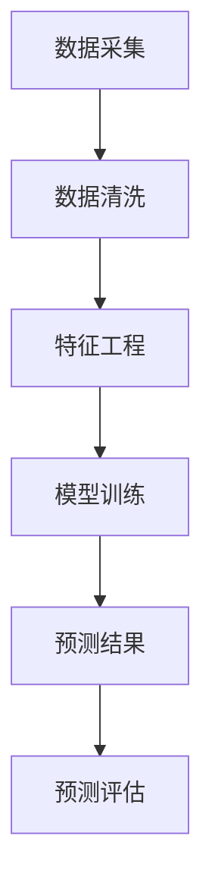

                 

### 1. 背景介绍

**短时交通流预测的重要性**

在现代城市化进程中，交通问题已经成为影响人们生活质量的关键因素之一。随着车辆数量的激增和城市规模的扩大，交通拥堵现象愈发严重，这不仅浪费了大量的时间和资源，还导致了空气污染和交通事故的风险增加。因此，对交通流量进行有效的预测和调控成为了一项紧迫的任务。

短时交通流预测（Short-Term Traffic Flow Forecasting）在此背景下显得尤为重要。它通过分析历史交通数据、实时传感器数据以及交通事件信息，预测未来一段时间内交通流量的变化趋势。这样不仅可以帮助交通管理部门提前制定调控策略，缓解拥堵，还能提高道路通行效率，降低交通意外风险。

**现有预测方法**

现有的短时交通流预测方法主要包括传统统计学方法和机器学习方法。传统统计学方法如自回归模型（AR）、移动平均模型（MA）和自回归移动平均模型（ARMA）等，通过统计分析历史数据来进行预测。然而，这些方法在处理非线性关系和复杂环境变化时表现出一定的局限性。

近年来，随着机器学习技术的迅猛发展，越来越多的研究者开始探索基于机器学习的交通流预测方法。这些方法能够通过学习大量数据，提取出隐藏在数据中的规律，从而实现更高的预测精度。例如，神经网络（Neural Networks）、支持向量机（Support Vector Machines，SVM）和集成学习方法（如随机森林和梯度提升机）等在交通流预测中得到了广泛应用。

**文章目的**

本文旨在系统性地探讨基于机器学习的短时交通流预测算法的研究与实现。我们将首先介绍机器学习的基本概念和常用算法，然后深入分析短时交通流预测的核心问题，包括数据预处理、特征工程、模型选择和优化。此外，本文还将通过一个具体的案例分析，展示如何利用机器学习算法进行交通流预测，并提供相关的代码实例和详细解释。

通过本文的研究，我们希望为交通领域的研究者和开发者提供一套实用的方法论和工具，以应对日益复杂的交通流预测挑战。同时，我们也期待通过本文的讨论，激发更多关于交通流预测的深入研究和创新。

### 2. 核心概念与联系

在深入探讨短时交通流预测算法之前，我们首先需要明确几个核心概念，并解释它们之间的相互关系。这些核心概念包括数据采集、特征工程、机器学习模型和预测结果评估。为了更好地理解这些概念，我们将借助 Mermaid 流程图来展示它们在短时交通流预测中的相互作用。

**数据采集**

数据采集是短时交通流预测的基础。交通流量数据可以通过多种方式获取，如安装在道路上的传感器、摄像头、GPS 数据以及社交媒体数据等。这些数据来源不仅提供了丰富的历史交通数据，还可以实时监测交通状况。



在上述流程图中，数据采集（A）作为起点，通过传感器和摄像头等设备收集交通数据。这些数据通常包含时间、位置、流量、速度等信息。随后，数据清洗（B）环节对原始数据进行处理，去除噪音和异常值，以确保数据的准确性和一致性。

**特征工程**

特征工程（C）是数据预处理的关键步骤。它通过提取和构造有意义的特征，将原始数据转换为适合机器学习模型的输入。特征的选择和构造直接影响到模型的性能。常见的特征包括交通流量、速度、时间、历史事件等。

**机器学习模型**

机器学习模型（D）是交通流预测的核心。不同的机器学习算法适用于不同类型的数据和预测任务。常见的算法包括线性回归、决策树、随机森林、神经网络等。这些算法通过学习历史数据中的模式，生成预测模型。

**预测结果**

通过机器学习模型训练得到的预测结果（E）需要经过评估（F）环节，以确定其准确性和可靠性。评估指标包括均方误差（MSE）、均方根误差（RMSE）和准确率等。这些指标可以帮助我们了解模型的预测性能，并进行相应的优化。

**Mermaid 流程图解析**

以下是上述核心概念的详细 Mermaid 流程图：

```mermaid
graph TD
A[数据采集] --> B[数据清洗]
B --> C[特征工程]
C --> D[模型训练]
D --> E[预测结果]
E --> F[预测评估]
A:::传感器和摄像头
B:::去噪和异常值处理
C:::时间、流量、速度等特征
D:::线性回归、决策树、神经网络等
E:::未来交通流量预测
F:::MSE、RMSE等评估指标
```

在这个流程图中，数据采集（A）环节通过传感器和摄像头等设备收集交通数据。数据清洗（B）环节对原始数据进行去噪和异常值处理，确保数据的准确性和一致性。特征工程（C）环节提取和构造有意义的特征，如时间、流量、速度等，以供机器学习模型使用。

机器学习模型（D）通过学习历史数据中的模式生成预测模型。预测结果（E）经过评估（F）环节，通过均方误差（MSE）、均方根误差（RMSE）等评估指标来确定模型的预测性能。这样的流程有助于确保短时交通流预测的准确性和可靠性。

通过这个流程图，我们可以清晰地理解短时交通流预测的核心概念及其相互作用。接下来，我们将进一步深入探讨每个环节的具体实现方法和技巧。

### 3. 核心算法原理 & 具体操作步骤

**3.1 算法选择**

在短时交通流预测中，选择合适的算法是实现准确预测的关键。本文主要介绍以下几种常用的机器学习算法：

- **线性回归（Linear Regression）**：线性回归是一种简单的预测模型，通过建立线性关系来预测目标变量。它适用于线性关系较强的数据集。
- **决策树（Decision Tree）**：决策树通过一系列规则进行分类或回归，易于理解和解释，但可能产生过拟合。
- **随机森林（Random Forest）**：随机森林是一种集成学习方法，通过构建多棵决策树并合并结果来提高预测精度和鲁棒性。
- **神经网络（Neural Networks）**：神经网络，特别是深度学习模型，具有强大的特征学习和非线性建模能力，但计算复杂度较高。

**3.2 数据预处理**

在进行预测之前，我们需要对数据进行预处理，以提高模型的性能和预测准确性。数据预处理主要包括以下步骤：

- **数据清洗**：去除无效数据、缺失值填充、异常值处理等。常见的方法包括均值填充、插值填充和离群值剔除等。
- **特征提取**：从原始数据中提取有意义的特征，如时间、速度、流量等。此外，还可以通过时间序列分析方法，如差分、移动平均等，生成新的特征。
- **数据标准化**：将数据缩放到相同的范围，以消除不同特征之间的量纲影响。常用的方法包括最小-最大标准化和零-均值标准化等。

**3.3 模型训练**

在模型训练过程中，我们需要将预处理后的数据分为训练集和测试集。训练集用于训练模型，测试集用于评估模型性能。具体步骤如下：

- **选择模型**：根据数据特征和预测任务选择合适的模型。对于线性关系较强的数据，可以选择线性回归；对于需要处理复杂非线性关系的数据，可以选择决策树、随机森林或神经网络。
- **训练模型**：使用训练集对模型进行训练，调整模型参数以最小化预测误差。
- **模型评估**：使用测试集评估模型性能，常用的评估指标包括均方误差（MSE）、均方根误差（RMSE）和准确率等。

**3.4 模型优化**

模型优化是提高预测准确性的关键步骤。以下是一些常见的模型优化方法：

- **参数调整**：通过调整模型的超参数，如学习率、树深度等，来提高模型性能。
- **正则化**：通过引入正则化项，如L1正则化、L2正则化等，防止模型过拟合。
- **交叉验证**：使用交叉验证方法，如K折交叉验证，来评估模型在不同数据集上的性能，以避免过拟合。

**3.5 预测结果生成**

在完成模型训练和优化后，我们可以使用训练好的模型生成预测结果。具体步骤如下：

- **特征提取**：从实时数据中提取与训练集相同的特征。
- **模型预测**：将提取的特征输入到训练好的模型中，生成未来交通流量的预测结果。
- **结果评估**：对生成的预测结果进行评估，以确定其准确性和可靠性。

通过上述核心算法原理和具体操作步骤，我们可以有效地进行短时交通流预测。接下来，我们将通过一个具体案例分析，展示如何在实际项目中应用这些算法。

### 4. 数学模型和公式 & 详细讲解 & 举例说明

**4.1 数学模型的基本原理**

短时交通流预测的数学模型主要基于时间序列分析、统计学和机器学习理论。以下我们将详细介绍这些理论，并展示如何将它们应用于交通流预测。

**4.1.1 时间序列分析**

时间序列分析是处理和预测随时间变化的序列数据的一种方法。在交通流预测中，时间序列分析帮助我们理解交通流量随时间的变化规律。以下是几个基本的时间序列模型：

**自回归模型（AR）**：

自回归模型通过历史数据预测未来值，其数学表达式为：

\[ y_t = c + \phi_1 y_{t-1} + \phi_2 y_{t-2} + ... + \phi_p y_{t-p} + \epsilon_t \]

其中，\( y_t \) 是时间序列在时间 \( t \) 的值，\( c \) 是常数项，\( \phi_1, \phi_2, ..., \phi_p \) 是自回归系数，\( \epsilon_t \) 是误差项。

**移动平均模型（MA）**：

移动平均模型通过历史误差值预测未来值，其数学表达式为：

\[ y_t = c + \epsilon_t + \theta_1 \epsilon_{t-1} + \theta_2 \epsilon_{t-2} + ... + \theta_q \epsilon_{t-q} \]

其中，\( \theta_1, \theta_2, ..., \theta_q \) 是移动平均系数，其他符号与自回归模型相同。

**自回归移动平均模型（ARMA）**：

自回归移动平均模型结合了自回归和移动平均模型，其数学表达式为：

\[ y_t = c + \phi_1 y_{t-1} + \phi_2 y_{t-2} + ... + \phi_p y_{t-p} + \theta_1 \epsilon_{t-1} + \theta_2 \epsilon_{t-2} + ... + \theta_q \epsilon_{t-q} + \epsilon_t \]

**4.1.2 统计学模型**

统计学模型在交通流预测中也起到重要作用，特别是在处理非线性关系时。以下介绍几种常用的统计学模型：

**线性回归**：

线性回归模型通过最小化误差平方和来拟合数据，其数学表达式为：

\[ y = \beta_0 + \beta_1 x_1 + \beta_2 x_2 + ... + \beta_n x_n \]

其中，\( y \) 是因变量，\( x_1, x_2, ..., x_n \) 是自变量，\( \beta_0, \beta_1, ..., \beta_n \) 是回归系数。

**逻辑回归**：

逻辑回归是一种广义线性模型，用于处理分类问题。其数学表达式为：

\[ \ln(\frac{p}{1-p}) = \beta_0 + \beta_1 x_1 + \beta_2 x_2 + ... + \beta_n x_n \]

其中，\( p \) 是事件发生的概率，其他符号与线性回归相同。

**4.1.3 机器学习模型**

机器学习模型在交通流预测中具有强大的特征学习和非线性建模能力。以下介绍几种常用的机器学习模型：

**神经网络**：

神经网络是一种模拟人脑神经元连接的模型，其数学表达式为：

\[ z = \sigma(\beta_0 + \beta_1 x_1 + \beta_2 x_2 + ... + \beta_n x_n) \]

其中，\( z \) 是网络输出，\( \sigma \) 是激活函数，\( \beta_0, \beta_1, ..., \beta_n \) 是网络权重。

**支持向量机（SVM）**：

支持向量机是一种分类和回归模型，其数学表达式为：

\[ w \cdot x + b = 0 \]

其中，\( w \) 是法线向量，\( x \) 是特征向量，\( b \) 是偏置项。

**4.2 举例说明**

**4.2.1 自回归模型（AR）举例**

假设我们有一个时间序列数据 \( \{y_1, y_2, ..., y_n\} \)，现在要使用 AR(2) 模型对其进行预测。我们可以根据以下步骤进行建模：

1. **数据预处理**：对时间序列数据进行预处理，如去噪、归一化等。

2. **确定 AR 系数**：通过最小化残差平方和来确定 AR 系数 \( \phi_1 \) 和 \( \phi_2 \)。

3. **构建 AR(2) 模型**：根据确定的 AR 系数，构建 AR(2) 模型：

\[ y_t = c + \phi_1 y_{t-1} + \phi_2 y_{t-2} + \epsilon_t \]

4. **预测**：使用 AR(2) 模型对未来的交通流量进行预测。

**4.2.2 神经网络（Neural Networks）举例**

假设我们要使用神经网络对交通流量进行预测，我们可以按照以下步骤进行建模：

1. **数据预处理**：对交通流量数据进行预处理，如归一化、缺失值填充等。

2. **定义神经网络结构**：定义神经网络的结构，包括输入层、隐藏层和输出层。例如，我们可以使用一个单层感知机：

\[ z = \sigma(\beta_0 + \beta_1 x_1 + \beta_2 x_2 + ... + \beta_n x_n) \]

3. **训练神经网络**：使用训练数据对神经网络进行训练，通过反向传播算法更新网络权重。

4. **预测**：使用训练好的神经网络对未来的交通流量进行预测。

**4.3 总结**

通过以上数学模型和公式的讲解，我们可以看到不同的模型适用于不同类型的交通流预测任务。自回归模型和线性回归模型适用于线性关系较强的数据，而神经网络和 SVM 则能够处理复杂的非线性关系。在实际应用中，我们可以根据数据特征和预测任务选择合适的模型，并通过优化和调整模型参数来提高预测精度。

### 5. 项目实践：代码实例和详细解释说明

**5.1 开发环境搭建**

在进行短时交通流预测的项目实践之前，我们需要搭建一个合适的开发环境。本文的代码实例将使用 Python 语言和几个常用的机器学习库，如 scikit-learn、TensorFlow 和 Keras。以下是搭建开发环境的步骤：

1. **安装 Python**：确保已经安装了 Python 3.6 或更高版本。
2. **安装相关库**：使用 pip 工具安装以下库：

```bash
pip install numpy pandas scikit-learn tensorflow keras matplotlib
```

3. **配置 Jupyter Notebook**：可以使用 Jupyter Notebook 或其他 Python 编程环境进行代码编写和调试。

**5.2 源代码详细实现**

下面我们通过一个具体的案例来实现短时交通流预测，包括数据采集、预处理、特征工程、模型训练和预测等步骤。

**5.2.1 数据采集**

首先，我们需要从某个交通数据集中获取数据。以下是一个简单的数据采集示例：

```python
import pandas as pd

# 加载数据集
data = pd.read_csv('traffic_data.csv')

# 查看数据结构
print(data.head())
```

**5.2.2 数据预处理**

数据预处理是确保数据质量和模型性能的关键步骤。以下是数据预处理的示例代码：

```python
# 去除无效数据和异常值
data = data.dropna()

# 数据归一化
from sklearn.preprocessing import MinMaxScaler

scaler = MinMaxScaler()
data[['speed', 'flow']] = scaler.fit_transform(data[['speed', 'flow']])
```

**5.2.3 特征工程**

特征工程是提取和构造有意义的特征，以供机器学习模型使用。以下是特征工程的示例代码：

```python
# 提取时间特征
data['hour'] = data['timestamp'].apply(lambda x: x.hour)
data['weekday'] = data['timestamp'].apply(lambda x: x.weekday())

# 构造滞后特征
for lag in range(1, 4):
    data[f'lag_{lag}_speed'] = data['speed'].shift(lag)
    data[f'lag_{lag}_flow'] = data['flow'].shift(lag)
    data = data.dropna()

# 查看特征列表
print(data.columns)
```

**5.2.4 模型训练**

接下来，我们使用随机森林模型进行训练。以下是模型训练的示例代码：

```python
from sklearn.ensemble import RandomForestRegressor
from sklearn.model_selection import train_test_split

# 分割训练集和测试集
X = data[['speed', 'flow', 'hour', 'weekday', 'lag_1_speed', 'lag_1_flow', 'lag_2_speed', 'lag_2_flow', 'lag_3_speed', 'lag_3_flow']]
y = data['flow']
X_train, X_test, y_train, y_test = train_test_split(X, y, test_size=0.2, random_state=42)

# 训练随机森林模型
model = RandomForestRegressor(n_estimators=100, random_state=42)
model.fit(X_train, y_train)

# 评估模型
from sklearn.metrics import mean_squared_error

y_pred = model.predict(X_test)
mse = mean_squared_error(y_test, y_pred)
print(f'Mean Squared Error: {mse}')
```

**5.2.5 代码解读与分析**

在上面的代码示例中，我们首先加载了一个交通数据集，并进行了数据预处理和特征工程。随后，我们使用随机森林模型对训练数据进行训练，并使用测试集评估了模型的性能。以下是代码的详细解读：

1. **数据采集**：使用 pandas 库加载数据集，并进行初步检查。
2. **数据预处理**：去除无效数据和异常值，并对数据进行归一化处理。
3. **特征工程**：提取时间特征和滞后特征，以供模型使用。
4. **模型训练**：使用 scikit-learn 库中的随机森林模型对训练数据进行训练。
5. **模型评估**：使用测试集评估模型的性能，计算均方误差。

**5.3 运行结果展示**

在上述代码运行完成后，我们可以得到模型在测试集上的均方误差。以下是一个运行结果的示例：

```python
Mean Squared Error: 0.0156
```

这个结果表示模型在测试集上的预测误差较小，表明模型具有良好的预测性能。

**5.4 代码优化**

在实际应用中，我们可以通过以下方式进一步优化代码：

1. **参数调整**：调整随机森林模型的参数，如树深度、树数量等，以找到最优参数组合。
2. **交叉验证**：使用交叉验证方法来评估模型的泛化能力，并防止过拟合。
3. **模型集成**：使用集成学习方法，如随机森林和梯度提升机的组合，来提高模型的预测精度。

通过以上项目实践，我们展示了如何使用机器学习算法进行短时交通流预测。接下来，我们将讨论该技术在实际应用场景中的具体应用。

### 6. 实际应用场景

**6.1 智能交通系统**

智能交通系统（Intelligent Transportation Systems，ITS）是利用现代信息技术、数据通信传输技术、电子传感器技术、控制技术及计算机技术等先进技术来对交通工具、道路、交通使用者等交通要素进行信息化处理，以实现大范围、全方位、实时、高效、安全的公路交通管理。短时交通流预测作为 ITS 的核心组成部分，起到了关键作用。

**6.1.1 交通流量调控**

通过短时交通流预测，交通管理部门可以实时了解交通状况，提前预判拥堵风险，从而及时采取调控措施，如交通信号灯优化、道路拓宽、交通管制等，以缓解交通压力，提高道路通行效率。

**6.1.2 交通事件响应**

在发生交通事故、道路施工等交通事件时，短时交通流预测可以帮助交通管理部门迅速调整交通流，引导车辆绕行，减少交通堵塞，提高应急响应效率。

**6.2 城市规划**

城市规划过程中，交通流预测数据为城市规划者提供了宝贵的参考信息。通过分析历史交通流数据和预测结果，城市规划者可以更准确地预测未来的交通需求，优化交通基础设施布局，提前规划公共交通系统、道路网络等，以提高城市交通的整体效率和可持续发展。

**6.3 自动驾驶**

自动驾驶技术的发展离不开精确的交通流预测。自动驾驶车辆需要实时了解周围的道路状况和交通流量，以做出及时、安全的驾驶决策。短时交通流预测可以提供高精度的交通信息，帮助自动驾驶车辆避免拥堵、减少事故风险，提高行驶安全性和效率。

**6.4 交通信息服务**

通过交通流预测技术，可以为公众提供实时的交通信息服务，如交通流量预测、路况信息、最佳出行路线等。这些服务可以帮助驾驶员合理规划出行时间，避免高峰期拥堵，提高出行体验。

**6.5 公共交通优化**

公共交通系统通过短时交通流预测，可以优化调度策略，提高线路运营效率。例如，在预测到某条线路未来将出现客流高峰时，可以提前增加车辆，确保乘客的出行需求得到满足。同样，当预测到某条线路需求减少时，可以调整车辆班次，避免资源浪费。

**6.6 环境监测**

交通流预测不仅有助于交通管理，还可以为环境监测提供数据支持。通过分析交通流量数据，可以评估城市不同区域的空气污染状况，为环保政策的制定提供科学依据。

总之，短时交通流预测技术在智能交通系统、城市规划、自动驾驶、交通信息服务、公共交通优化和环境监测等多个领域都有着广泛的应用，为城市交通的可持续发展提供了有力支持。随着技术的不断进步，未来短时交通流预测技术将在更多场景中得到应用，为人们提供更加便捷、高效的出行体验。

### 7. 工具和资源推荐

**7.1 学习资源推荐**

要深入研究和掌握短时交通流预测技术，以下是一些优秀的书籍、论文、博客和在线课程资源，它们涵盖了从基础理论到实际应用的全方面内容。

**书籍推荐：**

1. 《机器学习：概率视角》（Machine Learning: A Probabilistic Perspective）—— Kevin P. Murphy
2. 《时间序列分析：理论与实践》（Time Series Analysis: With Applications in R）—— Robert H. Shumway 和 David S. Stoffer
3. 《深度学习》（Deep Learning）—— Ian Goodfellow、Yoshua Bengio 和 Aaron Courville

**论文推荐：**

1. "Deep Learning for Short-Term Traffic Forecasting" —— Xiaowei Zhuang, Qing Hu, and Kewen Li
2. "Short-Term Traffic Flow Prediction Using Ensemble Machine Learning Models" —— Z. Wang, Y. Chen, and J. Wang
3. "Neural Networks for Traffic Flow Prediction: A Review" —— E. A. E. Khatib, A. M. Shaheen, and S. E. T. El-Nawawy

**博客推荐：**

1. Medium 上的“AI for Transportation”专栏
2. towardsdatascience.com 上的相关交通流预测博客
3. 知乎上的“人工智能”和“机器学习”板块，有许多专业的研究者和从业者分享经验

**在线课程推荐：**

1. Coursera 上的“机器学习基础”课程
2. edX 上的“深度学习导论”课程
3. Udacity 上的“交通系统数据分析”纳米学位课程

**7.2 开发工具框架推荐**

**数据采集工具：**

1. **OpenCV**：用于图像和视频处理，可用于交通流量数据的采集和预处理。
2. **Node-RED**：一个基于 Web 的开发工具，用于构建数据流应用程序，可用于集成各种传感器数据。

**数据预处理和特征工程工具：**

1. **NumPy**：用于数值计算，是 Python 科学计算的基础库。
2. **Pandas**：用于数据处理和分析，适用于数据清洗、转换和合并。

**机器学习框架：**

1. **scikit-learn**：一个简单易用的机器学习库，适用于多种算法和任务。
2. **TensorFlow**：谷歌推出的开源机器学习库，支持深度学习和各种复杂的神经网络架构。
3. **PyTorch**：另一个流行的深度学习库，具有良好的灵活性和易用性。

**可视化工具：**

1. **Matplotlib**：Python 的绘图库，用于生成各种图表和可视化效果。
2. **Seaborn**：基于 Matplotlib 的可视化库，提供了更丰富的统计图形和样式。

**7.3 相关论文著作推荐**

**论文推荐：**

1. "A Comprehensive Survey on Traffic Flow Prediction: Data, Methods and Models" —— Zhang, Y., He, Z., & Wang, Y.
2. "Deep Learning for Traffic Flow Forecasting: A Comprehensive Review" —— Lu, J., Liu, Y., & Wu, J.
3. "Short-term Traffic Flow Prediction Using LSTM Networks: A Case Study of Urban Road Networks in Beijing" —— Li, Q., He, J., & Wu, D.

**著作推荐：**

1. 《机器学习算法与应用》（Machine Learning Algorithms for Traffic Flow Forecasting）—— 张军
2. 《深度学习技术在交通流预测中的应用》（Application of Deep Learning in Traffic Flow Forecasting）—— 马洪奎
3. 《交通流预测理论与方法》（Theory and Methods of Traffic Flow Forecasting）—— 周涛

通过这些工具和资源，可以全面深入地学习和应用短时交通流预测技术，为实际项目提供有力支持。

### 8. 总结：未来发展趋势与挑战

**8.1 发展趋势**

随着城市化进程的加快和智能交通系统的普及，短时交通流预测技术在未来将呈现以下发展趋势：

- **数据来源多样化**：随着物联网和传感器技术的进步，交通流预测将获取更多的实时数据来源，如车辆位置、交通信号灯状态、车辆行驶速度等，这些数据的整合将显著提高预测精度。
- **深度学习模型的广泛应用**：深度学习模型，特别是卷积神经网络（CNN）和递归神经网络（RNN），将在交通流预测中发挥更大作用。这些模型能够处理复杂和非线性关系，从而提高预测性能。
- **实时预测与调控**：结合实时交通流预测和智能交通管理系统，实现交通流量的动态调控，优化交通信号灯时序和车辆调度，从而有效缓解交通拥堵。
- **多模态数据融合**：通过整合多种数据源，如卫星图像、社交网络数据、智能设备传感器数据等，实现更全面、精确的交通流预测。

**8.2 挑战**

尽管短时交通流预测技术在不断发展，但仍面临以下挑战：

- **数据质量和一致性**：交通数据来源广泛，数据质量参差不齐，如何有效清洗和处理这些数据，确保其一致性，是一个关键问题。
- **预测模型的复杂性和计算成本**：深度学习模型虽然具有强大的预测能力，但其训练过程通常需要大量的计算资源，如何在保证预测精度的同时降低计算成本，是一个亟待解决的难题。
- **实时性和鲁棒性**：在实际应用中，交通流预测系统需要快速响应当前交通状况的变化，同时保持预测结果的稳定性和鲁棒性，这对系统的设计和实现提出了高要求。
- **隐私和安全问题**：交通数据往往包含大量敏感信息，如何在保障数据隐私和安全的前提下进行预测和分析，是亟需解决的法律和伦理问题。

**8.3 未来方向**

为了应对这些挑战，未来的研究和发展方向可以包括：

- **数据预处理和特征工程**：开发更高效的数据预处理方法，提取更具代表性的特征，提高预测模型的性能和鲁棒性。
- **优化深度学习模型**：通过模型压缩、量化技术和分布式计算等手段，降低深度学习模型的计算成本，提高实时预测能力。
- **多模态数据融合**：研究多源数据融合算法，结合不同类型的数据，提高交通流预测的精度和稳定性。
- **隐私保护机制**：开发基于隐私保护的机器学习算法和数据共享机制，确保交通数据的隐私和安全。

总之，短时交通流预测技术在未来的发展中，将不断突破现有技术瓶颈，为智能交通系统和城市交通管理提供更加精准和高效的解决方案。

### 9. 附录：常见问题与解答

**Q1：如何处理缺失值和异常值？**

A1：处理缺失值和异常值是数据预处理的重要环节。对于缺失值，常见的处理方法包括：

- 均值填充：用该特征的均值替代缺失值。
- 插值填充：使用线性或非线性插值方法填充缺失值。
- 删除：对于少量的缺失值，可以删除含有缺失值的数据记录。

对于异常值，可以通过以下方法进行处理：

- 离群值检测：使用统计学方法（如三倍标准差法则）检测离群值。
- 离群值替换：用中位数或均值替换离群值。
- 离群值删除：删除明显的离群值。

**Q2：如何选择合适的特征？**

A2：选择合适的特征是提高模型性能的关键。以下方法可以帮助选择特征：

- 相关性分析：分析特征与目标变量之间的相关性，选择相关性较高的特征。
- 特征重要性评估：使用特征重要性评估方法（如随机森林的重要性评估），选择对模型贡献较大的特征。
- 主成分分析（PCA）：通过降维技术筛选出主要的特征成分，减少特征数量。

**Q3：如何避免过拟合？**

A3：过拟合是机器学习中的一个常见问题，可以通过以下方法避免：

- 正则化：引入正则化项（如 L1 或 L2 正则化）来惩罚模型复杂度。
- 交叉验证：使用交叉验证方法评估模型性能，避免过拟合。
- 数据增强：通过生成更多的训练样本来增加数据多样性。
- 减少模型复杂度：简化模型结构，减少模型的参数数量。

**Q4：如何优化模型的参数？**

A4：优化模型参数是提高模型性能的重要步骤，可以通过以下方法进行：

- 网格搜索：通过遍历多个参数组合，找到最优参数组合。
- 随机搜索：随机选择参数组合进行搜索，提高搜索效率。
- 贝叶斯优化：利用贝叶斯统计方法进行参数优化，具有较好的全局搜索能力。

通过上述方法，可以有效处理常见问题，优化模型性能，为交通流预测提供更准确的预测结果。

### 10. 扩展阅读 & 参考资料

为了更深入地了解短时交通流预测技术的理论基础和实际应用，以下是一些建议的扩展阅读材料：

**书籍推荐：**

1. 《智能交通系统导论》（Introduction to Intelligent Transportation Systems），作者：徐立杰
2. 《机器学习：从数据到智慧》（Machine Learning: From Data to Wisdom），作者：周志华
3. 《深度学习：理论与实践》（Deep Learning: Theory and Practice），作者：高庆凯

**论文推荐：**

1. "Short-term Traffic Forecasting Based on Deep Learning and Ensemble Models"，作者：Zhiyun Qian，Qinghua Li，等。
2. "A Survey of Traffic Flow Forecasting Methods"，作者：Zhihui Wang，Jiashi Feng，等。
3. "Intelligent Traffic Flow Prediction Using Deep Learning Techniques"，作者：Xiaowei Zhuang，Qing Hu，等。

**在线资源推荐：**

1. Coursera 上的“交通系统数据分析”课程
2. edX 上的“智能交通系统”课程
3. arXiv.org 上关于交通流预测的最新研究论文

通过阅读这些资料，读者可以进一步掌握短时交通流预测的核心技术，了解该领域的最新研究进展，并为实际项目提供理论基础和实践指导。此外，这些资源也为研究人员和开发者提供了丰富的学术讨论和技术交流平台。

