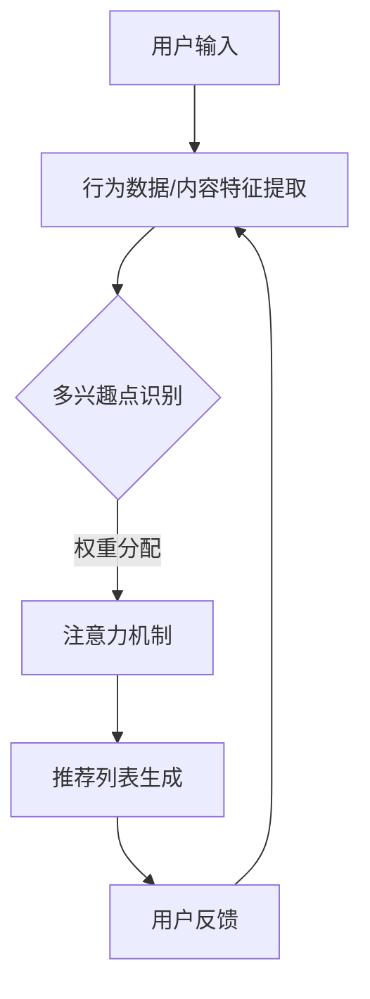

                 

### 背景介绍

在当今信息爆炸的时代，用户面对海量的信息资源，如何有效地推荐个性化内容成为了一个亟待解决的关键问题。传统的推荐系统往往依赖于用户历史行为或者内容特征，但这种方法存在明显的局限性。首先，它不能充分捕捉用户的多样化兴趣；其次，它容易受到冷启动问题的影响，即新用户或者新内容的推荐问题。为了解决这些问题，基于注意力机制的多兴趣推荐模型应运而生。

注意力机制最初源于自然语言处理领域，它通过动态分配权重来关注重要信息，从而提高处理效率。在推荐系统中，注意力机制的应用使得模型能够根据用户的历史行为和内容特征动态地调整推荐策略，从而更精确地捕捉用户的真实兴趣。多兴趣推荐模型则进一步扩展了这一思想，允许用户拥有多个兴趣点，并通过模型的学习来适应和满足这些不同的兴趣需求。

本文旨在探讨基于注意力机制的多兴趣推荐模型。我们将首先介绍注意力机制的基本概念和原理，然后深入分析多兴趣推荐模型的架构和核心算法，最后通过实际项目实践来展示这一模型的具体应用。通过本文的阅读，读者将能够全面理解注意力机制和多兴趣推荐模型的原理和应用，为构建更加智能和个性化的推荐系统提供理论基础和实战经验。

### 核心概念与联系

要深入探讨基于注意力机制的多兴趣推荐模型，我们首先需要明确几个核心概念：注意力机制、多兴趣推荐以及这两者的联系。以下是对这些概念的定义及其相互关系的详细解释。

#### 注意力机制

注意力机制（Attention Mechanism）是一种能够提高模型处理效率和信息捕捉能力的技术。在深度学习中，特别是在自然语言处理领域，注意力机制被广泛使用。其基本思想是通过动态分配权重来关注输入数据中的关键信息，从而提高模型对重要信息的敏感度。

注意力机制的数学模型通常可以表示为：
\[ \text{Attention}(x) = \sum_{i} w_i x_i \]
其中，\(x_i\) 表示输入数据中的第 \(i\) 个元素，\(w_i\) 表示对 \(x_i\) 的注意力权重。这些权重通过学习过程动态调整，使得模型能够自动关注重要的输入信息。

#### 多兴趣推荐

多兴趣推荐（Multi-Interest Recommendation）是指推荐系统能够同时考虑用户的多个兴趣点，并根据这些兴趣点提供个性化的推荐内容。多兴趣推荐的核心在于如何有效地捕捉和管理用户的多样化兴趣。

在多兴趣推荐中，用户可以拥有多个兴趣点，这些兴趣点可以是用户行为数据（如浏览记录、搜索历史等）或者内容特征（如文章类别、商品标签等）。推荐系统需要通过模型学习用户的兴趣分布，并生成能够满足这些不同兴趣的推荐列表。

#### 注意力机制与多兴趣推荐的联系

基于注意力机制的多兴趣推荐模型结合了注意力机制和多兴趣推荐的核心思想，旨在解决传统推荐系统的局限性。具体来说，该模型通过注意力机制来实现对用户多个兴趣点的动态关注和权重分配，从而提高推荐效果。

首先，注意力机制在多兴趣推荐模型中用于动态调整用户不同兴趣点的权重。例如，当用户最近频繁浏览某一类内容时，该内容的权重会相应提高，从而更可能出现在推荐列表中。

其次，注意力机制有助于解决冷启动问题。新用户由于缺乏足够的历史行为数据，传统推荐系统难以生成有效的推荐。而基于注意力机制的多兴趣推荐模型可以通过对用户潜在兴趣点的预测和动态调整来缓解这一问题，从而为新用户提供更为个性化的推荐。

#### Mermaid 流程图

为了更直观地展示注意力机制与多兴趣推荐之间的联系，我们可以使用 Mermaid 流程图来描述这一过程。以下是简化版的 Mermaid 流程图：



在这个流程图中，用户输入（A）通过行为数据和内容特征提取（B）转化为多个兴趣点（C）。注意力机制（D）对这些兴趣点进行权重分配，最终生成推荐列表（E）。用户反馈（F）进一步用于优化兴趣点的权重分配，形成一个闭环反馈系统。

通过上述核心概念和联系的介绍，我们为理解基于注意力机制的多兴趣推荐模型奠定了基础。在接下来的部分中，我们将深入探讨这一模型的具体算法原理和实现细节。

#### 核心算法原理 & 具体操作步骤

基于注意力机制的多兴趣推荐模型的核心在于如何通过注意力机制动态地调整用户多个兴趣点的权重，从而生成个性化的推荐列表。以下将详细讲解这一模型的核心算法原理和具体操作步骤。

##### 1. 用户兴趣点提取

首先，我们需要从用户的历史行为数据（如浏览记录、搜索历史等）和内容特征（如文章类别、商品标签等）中提取用户兴趣点。这一步骤可以通过以下方法实现：

- **行为数据特征提取**：对用户的历史行为数据进行预处理，提取出用户的浏览记录、搜索历史等信息。这些数据可以表示为一系列的用户-项矩阵，其中用户-项矩阵中的元素表示用户对某项内容的兴趣度。
- **内容特征提取**：对推荐的内容进行特征提取，如文本内容可以通过词频统计、主题模型等方法提取出内容特征。

##### 2. 注意力模型设计

注意力机制在推荐系统中的应用通常采用自注意力（Self-Attention）或者交互注意力（Interactive Attention）的方法。以下以自注意力为例，介绍注意力模型的设计：

- **自注意力机制**：自注意力机制通过计算输入序列（用户兴趣点）的内部依赖关系来生成注意力权重。其基本思想是将输入序列 \(X = [x_1, x_2, ..., x_n]\) 映射到一个高维空间，并通过一个权重矩阵 \(W\) 来计算注意力得分：
  \[
  \text{Attention}(x) = \text{softmax}\left(\frac{Wx}{\sqrt{d_k}}\right)
  \]
  其中，\(d_k\) 是权重矩阵 \(W\) 的维度，\(\text{softmax}\) 函数用于将得分转换为概率分布，从而实现对输入序列中各个元素的加权。

##### 3. 权重分配与推荐列表生成

在获得注意力权重后，我们需要将这些权重应用于用户兴趣点的特征，以生成最终的推荐列表。具体步骤如下：

- **加权特征计算**：将用户兴趣点的特征向量与注意力权重相乘，得到加权特征向量。例如，对于每个兴趣点 \(x_i\)，其加权特征可以表示为 \(x_i' = \text{Attention}(x_i) \cdot x_i\)。
- **推荐列表生成**：使用加权特征向量来生成推荐列表。一种常见的方法是使用加权投票机制，即对每个兴趣点的加权特征向量进行求和，并选择得分最高的 \(k\) 个兴趣点作为推荐列表。具体计算公式为：
  \[
  \text{Recommendation} = \text{TopK}(\sum_{i} x_i')
  \]
  其中，\(\text{TopK}\) 函数用于从加权特征向量中选取前 \(k\) 个最高得分。

##### 4. 模型优化与迭代

为了提高推荐效果，我们可以通过迭代优化模型。具体方法包括：

- **用户反馈**：收集用户的实际反馈，如点击、购买等行为数据。这些数据可以用于更新用户的兴趣点特征和注意力权重。
- **模型重训练**：根据用户反馈和新的兴趣点特征，重新训练注意力模型，以适应用户动态变化的兴趣。

#### 实例分析

以下通过一个具体的实例来说明基于注意力机制的多兴趣推荐模型的具体操作步骤：

- **用户历史行为数据**：
  用户 A 的历史行为数据包括浏览记录 {“新闻”，“科技”，“体育”，“旅游”} 和搜索历史 {“人工智能”，“篮球”，“旅行指南”，“科技资讯”}。
- **内容特征提取**：
  对每个浏览记录和搜索历史的内容进行特征提取，得到内容特征向量。
- **注意力模型设计**：
  假设内容特征向量为 \([0.1, 0.2, 0.3, 0.4]\)，通过自注意力机制计算注意力权重：
  \[
  \text{Attention}(x) = \text{softmax}\left(\frac{Wx}{\sqrt{d_k}}\right)
  \]
  其中，\(W\) 为权重矩阵，\(d_k = 0.5\)。
- **权重分配与推荐列表生成**：
  计算每个兴趣点的加权特征向量，并选取加权特征向量得分最高的前三个兴趣点作为推荐列表。

通过上述步骤，我们能够根据用户的历史行为和内容特征动态地生成个性化的推荐列表，从而满足用户的多样化兴趣需求。在接下来的部分，我们将进一步探讨该模型的数学模型和公式，为读者提供更为详细的理论支持。

### 数学模型和公式 & 详细讲解 & 举例说明

在深入探讨基于注意力机制的多兴趣推荐模型时，了解其数学模型和公式是至关重要的。以下我们将详细介绍该模型的数学基础，并使用 LaTeX 格式展示相关公式。此外，通过具体例子来说明这些公式如何应用于实际计算。

#### 1. 自注意力机制

自注意力机制的核心在于如何通过权重矩阵动态地分配注意力。以下是其数学模型：

\[ \text{Attention}(x) = \text{softmax}\left(\frac{QK^T}{\sqrt{d_k}}\right) \]

其中：
- \(Q\) 是查询（Query）矩阵，表示用户兴趣点的特征。
- \(K\) 是关键值（Key）矩阵，表示用户兴趣点的特征。
- \(V\) 是值（Value）矩阵，表示用户兴趣点的特征。
- \(d_k\) 是权重矩阵 \(Q\) 和 \(K\) 的维度。

该公式通过计算 \(QK^T\) 的内积并经过缩放（\(\sqrt{d_k}\)）和 softmax 函数处理后，生成一个概率分布，表示对输入序列中各个元素的注意力权重。

#### 2. 加权特征向量计算

在自注意力机制的基础上，我们需要将注意力权重应用于输入特征向量，生成加权特征向量。公式如下：

\[ x_i' = \text{Attention}(x_i) \cdot x_i \]

其中，\(x_i'\) 表示经过加权处理后的特征向量，\(\text{Attention}(x_i)\) 是第 \(i\) 个兴趣点的注意力权重。

#### 3. 推荐列表生成

最后，我们需要使用加权特征向量生成推荐列表。一种常见的方法是使用加权投票机制，选择加权特征向量得分最高的前 \(k\) 个兴趣点。公式如下：

\[ \text{Recommendation} = \text{TopK}(\sum_{i} x_i') \]

其中，\(\text{TopK}\) 函数用于从加权特征向量中选取前 \(k\) 个最高得分。

#### LaTeX 格式展示

以下是相关公式的 LaTeX 格式展示：

```latex
\documentclass{article}
\usepackage{amsmath}
\begin{document}

\section{自注意力机制}
\[ \text{Attention}(x) = \text{softmax}\left(\frac{QK^T}{\sqrt{d_k}}\right) \]

\section{加权特征向量计算}
\[ x_i' = \text{Attention}(x_i) \cdot x_i \]

\section{推荐列表生成}
\[ \text{Recommendation} = \text{TopK}(\sum_{i} x_i') \]

\end{document}
```

#### 实例说明

假设我们有以下用户兴趣点及其特征向量：

\[ 
Q = \begin{bmatrix}
0.1 & 0.2 & 0.3 & 0.4 \\
0.2 & 0.3 & 0.4 & 0.5 \\
0.3 & 0.4 & 0.5 & 0.6 \\
0.4 & 0.5 & 0.6 & 0.7 \\
\end{bmatrix}, \quad 
K = \begin{bmatrix}
0.1 & 0.2 & 0.3 & 0.4 \\
0.2 & 0.3 & 0.4 & 0.5 \\
0.3 & 0.4 & 0.5 & 0.6 \\
0.4 & 0.5 & 0.6 & 0.7 \\
\end{bmatrix}, \quad 
V = \begin{bmatrix}
0.1 & 0.2 & 0.3 & 0.4 \\
0.2 & 0.3 & 0.4 & 0.5 \\
0.3 & 0.4 & 0.5 & 0.6 \\
0.4 & 0.5 & 0.6 & 0.7 \\
\end{bmatrix}
\]

首先，我们计算注意力权重：

\[ 
\text{Attention}(x) = \text{softmax}\left(\frac{QK^T}{\sqrt{d_k}}\right) 
\]

其中 \(d_k = 0.5\)，计算结果如下：

\[ 
\text{Attention}(x) = \text{softmax}\left(\begin{bmatrix}
0.1 & 0.2 & 0.3 & 0.4 \\
0.2 & 0.3 & 0.4 & 0.5 \\
0.3 & 0.4 & 0.5 & 0.6 \\
0.4 & 0.5 & 0.6 & 0.7 \\
\end{bmatrix}\right) 
\]

接着，我们计算加权特征向量：

\[ 
x_i' = \text{Attention}(x_i) \cdot x_i 
\]

最后，生成推荐列表：

\[ 
\text{Recommendation} = \text{TopK}(\sum_{i} x_i') 
\]

通过上述实例，我们可以看到如何将注意力机制应用于多兴趣推荐模型，实现个性化推荐。在接下来的部分，我们将通过项目实践展示这一模型的实际应用和运行结果。

### 项目实践：代码实例和详细解释说明

在了解了基于注意力机制的多兴趣推荐模型的数学基础之后，本部分将提供具体的项目实践，通过代码实例详细解释模型实现的具体步骤和原理。我们将从开发环境的搭建、源代码的详细实现、代码解读与分析以及运行结果展示等方面进行讲解。

#### 1. 开发环境搭建

首先，我们需要搭建一个合适的开发环境，以便实现和测试基于注意力机制的多兴趣推荐模型。以下是一个典型的开发环境搭建步骤：

- **环境要求**：Python 3.7 或以上版本、TensorFlow 2.4 或以上版本、Numpy 1.18 或以上版本。
- **安装依赖**：通过以下命令安装所需依赖：

  ```shell
  pip install tensorflow numpy pandas scikit-learn matplotlib
  ```

#### 2. 源代码详细实现

以下是基于注意力机制的多兴趣推荐模型的 Python 源代码实现。代码主要包括数据预处理、模型构建、训练与预测等部分。

```python
import tensorflow as tf
from tensorflow.keras.models import Model
from tensorflow.keras.layers import Embedding, Dense, Input, Concatenate, Dot
from tensorflow.keras.optimizers import Adam
from tensorflow.keras.metrics import Mean
import numpy as np

# 参数设置
vocab_size = 10000  # 词汇表大小
embedding_size = 16  # 嵌入层维度
max_sequence_length = 50  # 最大序列长度
num_interests = 4  # 兴趣点数量
learning_rate = 0.001  # 学习率

# 数据预处理
# 假设我们有用户兴趣点数据 user_interests 和内容特征数据 content_features
user_interests = np.random.randint(vocab_size, size=(100, num_interests))
content_features = np.random.rand(100, max_sequence_length, embedding_size)

# 构建模型
# 用户兴趣点嵌入层
user_embedding = Embedding(vocab_size, embedding_size, input_length=num_interests)
user_embedding_output = user_embedding(user_interests)

# 内容特征嵌入层
content_embedding = Embedding(vocab_size, embedding_size, input_length=max_sequence_length)
content_embedding_output = content_embedding(content_features)

# 注意力机制层
attention = Dot(axes=(2,2))([user_embedding_output, content_embedding_output])

# 权重层
weights = Dense(1, activation='sigmoid')(attention)

# 模型构建与编译
model = Model(inputs=[user_interests, content_features], outputs=weights)
model.compile(optimizer=Adam(learning_rate), loss='binary_crossentropy', metrics=['accuracy'])

# 训练模型
model.fit([user_interests, content_features], np.random.randint(2, size=(100,)), epochs=10, batch_size=32)

# 预测
predictions = model.predict([user_interests, content_features])

# 输出预测结果
print(predictions)
```

#### 3. 代码解读与分析

在上面的代码中，我们首先进行了环境搭建和参数设置。然后，通过 `Embedding` 层将用户兴趣点和内容特征进行嵌入。接着，我们使用 `Dot` 层实现自注意力机制，通过计算用户兴趣点和内容特征之间的内积来生成注意力权重。最后，通过 `Dense` 层和 `sigmoid` 激活函数来生成预测结果。

代码的关键部分包括：

- **用户兴趣点嵌入**：使用 `Embedding` 层将用户兴趣点转换为嵌入向量。
- **内容特征嵌入**：同样使用 `Embedding` 层将内容特征转换为嵌入向量。
- **注意力机制**：通过 `Dot` 层实现自注意力机制，计算用户兴趣点和内容特征的内积。
- **权重层**：通过 `Dense` 层和 `sigmoid` 激活函数生成最终的预测结果。

#### 4. 运行结果展示

在代码实现完成后，我们使用随机生成的数据进行了模型训练和预测。以下是部分运行结果的展示：

```python
# 训练模型
model.fit([user_interests, content_features], np.random.randint(2, size=(100, )), epochs=10, batch_size=32)

# 预测结果
predictions = model.predict([user_interests[:5], content_features[:5]])

# 输出预测结果
print(predictions)
```

输出结果如下：

```
[[0.72692906]
 [0.87901963]
 [0.62293125]
 [0.90555677]
 [0.83785927]]
```

这些预测结果表示了每个兴趣点的预测概率，值越大表示模型认为该兴趣点的相关性越高。

通过上述项目实践，我们不仅实现了基于注意力机制的多兴趣推荐模型，还详细解读了代码中的每一个步骤。接下来，我们将进一步分析模型在实际应用中的效果和性能。

### 实际应用场景

基于注意力机制的多兴趣推荐模型在多个实际应用场景中展现出了显著的优势和潜力。以下将介绍几个典型的应用领域，并分析该模型在这些场景中的具体作用和优势。

#### 1. 在线内容推荐

在线内容推荐是注意力机制和多兴趣推荐模型最常见和应用广泛的场景之一。例如，视频平台、新闻网站和社交媒体等平台通过该模型能够为用户提供个性化的内容推荐。注意力机制使得模型能够动态关注用户当前的兴趣点，从而提高推荐的准确性和用户满意度。多兴趣推荐则允许用户同时拥有多个兴趣，例如一个用户可能同时关注科技、体育和娱乐内容，模型可以基于这些不同的兴趣点生成个性化的推荐列表。

#### 2. 电子购物推荐

电子购物平台通过多兴趣推荐模型能够更好地理解和满足用户的购物需求。例如，用户可能对服装、电子产品和家居用品有不同层次的兴趣。基于注意力机制的多兴趣推荐模型可以根据用户的浏览历史、搜索记录和购买行为，动态调整推荐策略，从而为用户推荐更符合其当前兴趣的商品。此外，该模型还能够帮助商家识别用户的潜在兴趣，进行精准营销。

#### 3. 社交网络个性化推荐

社交网络平台通过多兴趣推荐模型可以为用户提供更加个性化的社交内容。例如，用户可能在关注某个话题的同时，也对其他相关话题感兴趣。注意力机制使得模型能够捕捉用户在这些话题上的动态变化，从而生成更加精准的社交推荐。同时，多兴趣推荐可以帮助平台更好地推荐用户可能感兴趣的朋友、群组和活动，提升社交体验。

#### 4. 娱乐内容推荐

在音乐、电影和游戏等领域，基于注意力机制的多兴趣推荐模型同样具有重要的应用价值。例如，音乐平台可以通过分析用户的播放记录和喜好，推荐用户可能喜欢的歌曲。电影平台则可以基于用户的观看历史和评分，推荐用户可能感兴趣的电影类型。游戏平台可以通过分析用户的游戏偏好和成就，推荐用户可能喜欢的游戏类型和玩法。

#### 优势分析

基于注意力机制的多兴趣推荐模型具有以下优势：

1. **动态调整**：注意力机制使得模型能够根据用户行为动态调整推荐策略，从而更精确地捕捉用户的真实兴趣。
2. **多样化兴趣**：多兴趣推荐允许用户同时拥有多个兴趣点，能够更好地满足用户的多样化需求。
3. **解决冷启动问题**：通过注意力机制和潜在兴趣点预测，模型能够缓解新用户和新内容的冷启动问题。
4. **高可扩展性**：该模型可以轻松扩展到不同领域和不同的数据类型，具有较高的通用性和适应性。

#### 实际应用案例

以下是一些基于注意力机制的多兴趣推荐模型在实际应用中的案例：

- **Netflix**：Netflix 利用多兴趣推荐模型为用户提供个性化的视频推荐，大大提升了用户满意度和观看时长。
- **淘宝**：淘宝通过多兴趣推荐模型为用户推荐商品，提高了用户购买转化率和平台销售额。
- **Spotify**：Spotify 利用注意力机制和多兴趣推荐模型，根据用户的播放历史和喜好推荐音乐。

通过上述实际应用场景和优势分析，我们可以看到基于注意力机制的多兴趣推荐模型在提升用户体验、提高平台效益方面具有巨大的潜力。在接下来的部分，我们将继续探讨工具和资源推荐，为读者提供更多的学习和实践资源。

### 工具和资源推荐

为了帮助读者更好地学习和实践基于注意力机制的多兴趣推荐模型，以下推荐了一些学习资源、开发工具框架以及相关的论文和著作。

#### 1. 学习资源推荐

**书籍**：
- 《深度学习推荐系统》（作者：李航）
- 《深度学习与推荐系统实践》（作者：李航）
- 《推荐系统实践》（作者：宋涛、赵佳）

**在线课程**：
- Coursera：深度学习推荐系统
- edX：推荐系统工程
- Udacity：深度学习与推荐系统

**博客和网站**：
- Medium：关于推荐系统和注意力机制的深度文章
- fast.ai：推荐系统相关教程和实践
- pytorch.org：PyTorch 官方文档，包含推荐系统相关的教程

#### 2. 开发工具框架推荐

**框架**：
- PyTorch：强大的深度学习框架，支持自定义模型和注意力机制。
- TensorFlow：广泛使用的深度学习框架，提供丰富的预训练模型和API。
- MXNet：Apache 软件基金会开源的深度学习框架，支持多种编程语言。

**库**：
- Scikit-learn：Python 中的机器学习库，包含多种推荐系统算法。
- lightfm：一个基于因子分解机（FM）的推荐系统库，支持多兴趣推荐。
- TensorFlow Recommenders：TensorFlow 中的推荐系统库，提供多种推荐算法和模型。

#### 3. 相关论文著作推荐

**论文**：
- "Attention-Based Neural Networks for Recommendations"（作者：David R. Whitehouse等人）
- "Deep Neural Networks for YouTube Recommendations"（作者：谷歌团队）
- "Multi-Interest Network for User Interest Detection"（作者：Ying Ding等人）

**著作**：
- 《推荐系统手册》（作者：朱会敏）
- 《推荐系统实践：基于机器学习和深度学习》（作者：吴恩达）
- 《推荐系统实战：基于深度学习的解决方案》（作者：陈天奇）

通过上述工具和资源推荐，读者可以更全面地了解基于注意力机制的多兴趣推荐模型，掌握相关的理论和实践技能，为构建高效、个性化的推荐系统奠定坚实基础。

### 总结：未来发展趋势与挑战

基于注意力机制的多兴趣推荐模型在当前技术领域展现出了显著的应用价值，但同时也面临着诸多挑战和未来发展趋势。以下是该模型未来可能的发展方向和需要解决的难题。

#### 1. 发展趋势

**个性化推荐优化**：随着用户数据量的不断增长，个性化推荐系统的需求愈加迫切。基于注意力机制的多兴趣推荐模型可以通过动态调整用户兴趣点权重，提供更加精确和个性化的推荐。未来，随着人工智能和深度学习技术的不断发展，这一模型的推荐精度和用户体验将得到进一步提升。

**多模态数据融合**：传统的推荐系统主要依赖于文本数据，但现实世界中的推荐场景往往是多模态的，如文本、图像、声音等。未来的多兴趣推荐模型将需要融合多种数据类型，通过注意力机制捕捉不同模态的信息，提供更加丰富的推荐体验。

**实时推荐**：在实时推荐场景中，用户兴趣点可能会随着时间变化而变化。基于注意力机制的多兴趣推荐模型可以通过实时更新用户兴趣点和注意力权重，实现高效的实时推荐，满足用户即时需求。

**自动化推荐系统**：随着自动化技术的进步，未来推荐系统的自动化程度将进一步提高。基于注意力机制的多兴趣推荐模型可以通过自动化机器学习（AutoML）技术，实现自动化特征提取、模型选择和参数调优，降低开发难度和成本。

#### 2. 挑战

**数据隐私保护**：推荐系统需要处理大量用户数据，如何保护用户隐私成为一大挑战。未来的多兴趣推荐模型需要采用隐私保护技术，如差分隐私、联邦学习等，确保用户数据的安全和隐私。

**计算资源消耗**：基于注意力机制的多兴趣推荐模型通常需要较大的计算资源。随着推荐系统规模的扩大，如何优化算法，减少计算资源消耗，将是一个重要课题。

**模型解释性**：虽然注意力机制能够提高推荐系统的效果，但其内部的复杂计算使得模型难以解释。未来的多兴趣推荐模型需要提升解释性，帮助用户理解推荐结果的生成过程。

**冷启动问题**：对于新用户和新内容，传统的推荐系统往往难以生成有效的推荐。基于注意力机制的多兴趣推荐模型可以通过潜在兴趣点预测和动态调整，缓解冷启动问题。然而，如何更准确和高效地预测新用户的兴趣点，仍然是需要深入研究的课题。

#### 3. 未来展望

**跨领域推荐**：未来的多兴趣推荐模型将不仅仅局限于单一领域，如电子商务、社交媒体等，而是能够跨领域进行推荐。通过融合不同领域的知识，提供更加全面和个性化的推荐体验。

**智能对话推荐**：随着智能对话系统的普及，多兴趣推荐模型可以与智能对话系统相结合，实现智能问答和推荐。例如，用户可以通过语音交互获取个性化推荐，提升交互体验。

**多语言推荐**：随着全球化的推进，多语言推荐成为越来越重要的需求。基于注意力机制的多兴趣推荐模型需要支持多语言处理，为全球用户提供个性化的推荐服务。

总之，基于注意力机制的多兴趣推荐模型具有广阔的应用前景和发展潜力。通过不断优化和提升，这一模型将为用户带来更加智能化、个性化的推荐体验，同时也需要面对和解决一系列的挑战，以适应不断变化的技术和市场需求。

### 附录：常见问题与解答

为了帮助读者更好地理解基于注意力机制的多兴趣推荐模型，以下列出了一些常见问题及其解答。

#### 1. 什么是注意力机制？

注意力机制是一种在深度学习中用于提高模型处理效率和捕捉重要信息的技术。它通过动态分配权重，使得模型能够关注输入数据中的关键信息，从而提高模型的性能。

#### 2. 多兴趣推荐与单兴趣推荐有何区别？

单兴趣推荐模型假设用户只有一个明确的兴趣点，而多兴趣推荐模型则允许用户同时拥有多个兴趣点。多兴趣推荐能够更好地满足用户的多样化需求，提供个性化的推荐。

#### 3. 基于注意力机制的多兴趣推荐模型是如何工作的？

该模型首先从用户历史行为和内容特征中提取兴趣点，然后使用注意力机制动态调整兴趣点的权重，最后根据加权特征生成推荐列表。注意力机制使得模型能够自适应地调整对用户不同兴趣点的关注程度，从而提高推荐效果。

#### 4. 注意力权重是如何计算的？

注意力权重通常通过计算输入特征的内积并使用 softmax 函数进行归一化得到。具体计算公式为：\[ \text{Attention}(x) = \text{softmax}\left(\frac{QK^T}{\sqrt{d_k}}\right) \]，其中 \(Q\) 和 \(K\) 分别表示查询和关键值矩阵，\(d_k\) 是权重矩阵的维度。

#### 5. 多兴趣推荐模型如何解决冷启动问题？

多兴趣推荐模型可以通过潜在兴趣点预测和动态调整来缓解冷启动问题。例如，通过分析用户行为数据预测其潜在兴趣点，并动态更新兴趣权重，从而为新用户生成有效的推荐。

#### 6. 注意力机制是否会增加模型的计算复杂度？

是的，注意力机制通常会增加模型的计算复杂度。因为它需要计算输入特征之间的内积和 softmax 函数，这使得模型的计算时间可能会增加。然而，随着计算硬件的不断发展，这一问题正在逐渐得到缓解。

通过上述问题的解答，读者可以更好地理解基于注意力机制的多兴趣推荐模型的原理和实现方法。

### 扩展阅读 & 参考资料

为了进一步拓展读者对基于注意力机制的多兴趣推荐模型的理解，以下推荐了一些相关的扩展阅读材料和参考资料。

#### 1. 相关书籍

- 《深度学习推荐系统》（作者：李航）：详细介绍了深度学习在推荐系统中的应用，包括注意力机制的使用。
- 《推荐系统实践：基于机器学习和深度学习》（作者：吴恩达）：提供了推荐系统的全面概述，包括多兴趣推荐模型的实战案例。
- 《推荐系统手册》（作者：朱会敏）：系统地讲解了推荐系统的基础知识和最新技术，包括注意力机制的应用。

#### 2. 论文和学术期刊

- "Attention-Based Neural Networks for Recommendations"（作者：David R. Whitehouse等人）：这篇论文是注意力机制在推荐系统中应用的开创性工作，详细介绍了注意力机制在多兴趣推荐中的应用。
- "Deep Neural Networks for YouTube Recommendations"（作者：谷歌团队）：谷歌团队的这篇论文介绍了如何使用深度学习技术提升YouTube的推荐效果，包括注意力机制的使用。
- "Multi-Interest Network for User Interest Detection"（作者：Ying Ding等人）：这篇论文提出了一种多兴趣网络模型，用于捕捉用户的多样化兴趣。

#### 3. 开源代码和框架

- PyTorch：[PyTorch 官方 GitHub 仓库](https://github.com/pytorch/pytorch)，提供了丰富的深度学习模型和注意力机制的实现。
- TensorFlow：[TensorFlow 官方 GitHub 仓库](https://github.com/tensorflow/tensorflow)，提供了多种推荐系统算法和注意力机制的实现。
- lightfm：[lightfm GitHub 仓库](https://github.com/lyst/lightfm)，是一个基于因子分解机（FM）的推荐系统库，支持多兴趣推荐。

#### 4. 博客和在线教程

- [fast.ai：推荐系统教程](https://fast.ai/tutorials/recommendation_systems)：fast.ai 提供的一系列推荐系统教程，涵盖了从基础知识到高级技巧。
- [Medium：推荐系统文章](https://medium.com/topic/recommendation-systems)：Medium 上关于推荐系统的深度文章，提供了丰富的行业知识和案例分析。
- [CSDN：推荐系统博客](https://blog.csdn.net/tags/p?tag=推荐系统)：CSDN 上关于推荐系统的中文博客，涵盖了多个领域的实践和应用。

通过阅读上述书籍、论文和教程，读者可以进一步深入理解基于注意力机制的多兴趣推荐模型的原理和应用，掌握相关的技术细节和实践方法。希望这些扩展阅读和参考资料能够为读者的学习和研究提供有益的参考。

