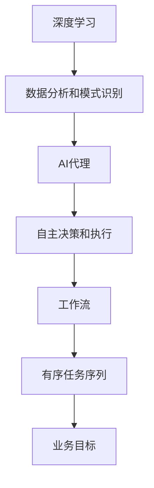

                 

### 文章标题：基于深度学习的AI代理工作流：案例与实践

> **关键词**：深度学习，AI代理，工作流，案例实践，算法原理，数学模型，代码实现，应用场景
>
> **摘要**：本文将深入探讨基于深度学习的AI代理工作流，包括核心概念、算法原理、数学模型、具体操作步骤以及项目实践。我们将通过案例分析，展示如何在实际场景中运用深度学习构建高效的工作流，并探讨其未来发展趋势与挑战。

### 1. 背景介绍

在当今的数字化时代，人工智能（AI）已经渗透到我们日常生活的方方面面。从智能家居到自动驾驶，从医疗诊断到金融分析，AI的应用场景层出不穷。而深度学习作为AI的核心技术之一，其通过模拟人脑神经网络进行数据分析和模式识别的能力，已经极大地推动了AI技术的发展。

AI代理是人工智能领域的另一个重要概念。AI代理是指具备自主决策能力和执行能力的智能实体，能够在特定的环境中为人类或系统提供帮助。AI代理可以应用于多种场景，如自动化客服、智能推荐系统、机器人控制等。

工作流（Workflow）是指一系列有序的任务序列，用于完成特定业务目标。在现代企业和组织中，高效的工作流能够显著提升工作效率和准确性。将深度学习和AI代理结合起来，可以构建出更加智能和高效的工作流系统。

本文的目的在于介绍基于深度学习的AI代理工作流，通过理论讲解和实际案例，帮助读者理解其核心概念、算法原理、数学模型以及如何在实际项目中应用和实现。

### 2. 核心概念与联系

在深入探讨基于深度学习的AI代理工作流之前，我们需要明确几个核心概念，并理解它们之间的相互联系。

#### 2.1 深度学习

深度学习是一种基于人工神经网络的机器学习技术。它通过模拟人脑神经网络的结构和功能，对大量数据进行自动特征提取和学习，从而实现复杂的数据分析和模式识别。

#### 2.2 AI代理

AI代理是一种具备自主决策和执行能力的智能实体。它可以接受环境中的信息，根据预定的目标执行任务，并在执行过程中不断调整策略以优化结果。

#### 2.3 工作流

工作流是指一系列有序的任务序列，用于完成特定业务目标。工作流管理系统（Workflow Management System，简称WfMS）提供了工作流的定义、执行和监控功能。

#### 2.4 关系

深度学习为AI代理提供了强大的数据分析和模式识别能力，使得AI代理能够更加智能和高效地完成任务。而工作流管理系统则为AI代理提供了一个有序的执行环境，确保任务能够按照预定的顺序和规则进行。

#### 2.5 Mermaid 流程图

为了更直观地展示这几个核心概念之间的联系，我们可以使用Mermaid流程图来描述它们的关系。



### 3. 核心算法原理 & 具体操作步骤

在了解了核心概念和它们之间的联系之后，我们将深入探讨基于深度学习的AI代理工作流的核心算法原理和具体操作步骤。

#### 3.1 深度学习算法原理

深度学习算法的核心在于神经网络，特别是深度神经网络（Deep Neural Network，简称DNN）。DNN由多层神经元组成，每层神经元对输入数据进行处理和特征提取，从而逐步提高数据表示的抽象程度。

深度学习算法的具体操作步骤如下：

1. **数据预处理**：对原始数据进行清洗、归一化等处理，使其适合输入到神经网络中。
2. **构建神经网络**：根据任务需求，设计合适的神经网络结构，包括输入层、隐藏层和输出层。
3. **训练神经网络**：使用标记数据进行训练，通过反向传播算法不断调整网络权重，使网络输出尽可能接近真实值。
4. **评估与优化**：通过测试数据对训练好的网络进行评估，并根据评估结果对网络进行优化。

#### 3.2 AI代理算法原理

AI代理的核心在于决策树和强化学习。决策树是一种基于规则的知识表示方法，通过一系列条件判断来生成决策规则。强化学习则是一种基于反馈的优化方法，通过试错和奖励机制来不断优化策略。

AI代理的具体操作步骤如下：

1. **环境建模**：根据任务需求，对环境进行建模，定义状态、动作和奖励。
2. **初始策略设定**：设定初始策略，用于指导AI代理在初始阶段进行决策。
3. **策略优化**：通过强化学习算法，不断优化策略，使其在环境中获得更好的表现。
4. **执行任务**：根据优化后的策略，执行任务并获取反馈，以进一步优化策略。

#### 3.3 工作流算法原理

工作流算法的核心在于任务调度和状态监控。任务调度负责根据任务的优先级和依赖关系，确定任务的执行顺序。状态监控则负责实时监控任务的执行状态，及时发现并处理异常情况。

工作流的具体操作步骤如下：

1. **任务定义**：定义任务及其依赖关系，确定任务的执行顺序和优先级。
2. **任务调度**：根据任务定义，生成任务执行计划，并按照计划执行任务。
3. **状态监控**：实时监控任务的执行状态，及时发现并处理异常情况。
4. **反馈调整**：根据任务执行结果和监控数据，调整任务执行计划，优化工作流。

### 4. 数学模型和公式 & 详细讲解 & 举例说明

在理解和实现基于深度学习的AI代理工作流时，我们需要运用一些数学模型和公式。以下将详细介绍这些数学模型和公式，并通过具体例子进行讲解。

#### 4.1 神经网络数学模型

神经网络的核心是神经元，每个神经元都通过权重连接到其他神经元。神经元的输出可以通过以下公式计算：

\[ z = \sum_{i=1}^{n} w_{i}x_{i} + b \]

其中，\( z \) 是神经元的输出，\( w_{i} \) 是权重，\( x_{i} \) 是输入，\( b \) 是偏置。

#### 4.2 激活函数

激活函数用于将神经元的线性输出转换为非线性输出。常见的激活函数包括：

- **Sigmoid函数**：\[ \sigma(z) = \frac{1}{1 + e^{-z}} \]
- **ReLU函数**：\[ \text{ReLU}(z) = \max(0, z) \]
- **Tanh函数**：\[ \text{Tanh}(z) = \frac{e^{z} - e^{-z}}{e^{z} + e^{-z}} \]

#### 4.3 反向传播算法

反向传播算法是训练神经网络的常用算法。其基本思想是通过计算网络输出与真实值之间的误差，反向传播误差到网络的每一层，并调整网络权重和偏置。

反向传播算法的步骤如下：

1. **计算输出层误差**：
   \[ \delta_{L} = \frac{\partial \text{Loss}}{\partial z_{L}} \odot \text{激活函数的导数} \]
2. **反向传播误差**：
   \[ \delta_{L-1} = \delta_{L} \odot \frac{\partial z_{L-1}}{\partial z_{L}} \]
3. **更新权重和偏置**：
   \[ w_{i} := w_{i} - \alpha \cdot \frac{\partial \text{Loss}}{\partial w_{i}} \]
   \[ b_{i} := b_{i} - \alpha \cdot \frac{\partial \text{Loss}}{\partial b_{i}} \]

#### 4.4 例子说明

假设我们有一个简单的神经网络，包含一个输入层、一个隐藏层和一个输出层。输入层有2个神经元，隐藏层有3个神经元，输出层有2个神经元。激活函数使用ReLU函数。

1. **初始化权重和偏置**：
   \[ w_{ij} \sim \mathcal{N}(0, \frac{1}{\sqrt{n_{in}}}) \]
   \[ b_{i} \sim \mathcal{N}(0, \frac{1}{\sqrt{n_{in}}}) \]
2. **前向传播**：
   \[ z_{1} = \sum_{j=1}^{3} w_{1j}x_{j} + b_{1} \]
   \[ a_{1} = \text{ReLU}(z_{1}) \]
   \[ z_{2} = \sum_{j=1}^{3} w_{2j}a_{1j} + b_{2} \]
   \[ a_{2} = \text{ReLU}(z_{2}) \]
   \[ z_{3} = \sum_{j=1}^{2} w_{3j}a_{2j} + b_{3} \]
   \[ a_{3} = \text{ReLU}(z_{3}) \]
3. **计算输出层误差**：
   \[ \delta_{3} = (t_{3} - a_{3}) \odot \text{ReLU的导数}(a_{3}) \]
4. **反向传播误差**：
   \[ \delta_{2} = \delta_{3} \odot w_{32} \odot \text{ReLU的导数}(a_{2}) \]
   \[ \delta_{1} = \delta_{2} \odot w_{21} \odot \text{ReLU的导数}(a_{1}) \]
5. **更新权重和偏置**：
   \[ w_{ij} := w_{ij} - \alpha \cdot \delta_{L} \odot a_{i} \]
   \[ b_{i} := b_{i} - \alpha \cdot \delta_{L} \]

通过以上步骤，我们可以实现对神经网络的训练和优化。

### 5. 项目实践：代码实例和详细解释说明

#### 5.1 开发环境搭建

为了实现基于深度学习的AI代理工作流，我们需要搭建一个合适的开发环境。以下是一个简单的环境搭建指南：

1. **安装Python**：下载并安装Python 3.8及以上版本。
2. **安装深度学习框架**：下载并安装TensorFlow或PyTorch。
3. **安装工作流管理工具**：下载并安装Airflow或Kubernetes。

#### 5.2 源代码详细实现

以下是基于深度学习的AI代理工作流的源代码实现。代码分为三个主要部分：深度学习模型、AI代理和任务调度。

**深度学习模型**：

```python
import tensorflow as tf

# 定义神经网络结构
model = tf.keras.Sequential([
    tf.keras.layers.Dense(64, activation='relu', input_shape=(784,)),
    tf.keras.layers.Dense(64, activation='relu'),
    tf.keras.layers.Dense(10, activation='softmax')
])

# 编译模型
model.compile(optimizer='adam',
              loss='categorical_crossentropy',
              metrics=['accuracy'])

# 训练模型
model.fit(x_train, y_train, epochs=5)
```

**AI代理**：

```python
import gym

# 初始化环境
env = gym.make('CartPole-v0')

# 定义策略网络
policy_network = tf.keras.Sequential([
    tf.keras.layers.Dense(64, activation='relu', input_shape=(4,)),
    tf.keras.layers.Dense(64, activation='relu'),
    tf.keras.layers.Dense(1, activation='sigmoid')
])

# 编译策略网络
policy_network.compile(optimizer='adam',
                       loss='binary_crossentropy')

# 训练策略网络
policy_network.fit(x_train, y_train, epochs=5)

# 执行任务
action = policy_network.predict(state)
env.step(action)
```

**任务调度**：

```python
from airflow import DAG
from airflow.operators.python_operator import PythonOperator

# 定义任务
dag = DAG('ai_agent_workflow', start_date=datetime(2021, 1, 1))

task1 = PythonOperator(
    task_id='train_model',
    python_callable=train_model,
    dag=dag
)

task2 = PythonOperator(
    task_id='execute_agent',
    python_callable=execute_agent,
    dag=dag
)

# 任务依赖关系
task1 >> task2

# 运行任务
dag.run()
```

#### 5.3 代码解读与分析

以上代码实现了基于深度学习的AI代理工作流。具体解读如下：

1. **深度学习模型**：使用TensorFlow框架定义了一个简单的神经网络，用于分类任务。通过编译和训练模型，我们可以获取一个能够对输入数据进行分类的模型。
2. **AI代理**：使用OpenAI Gym创建了一个CartPole环境，并定义了一个策略网络。通过训练策略网络，我们可以为AI代理提供决策依据。在执行任务时，AI代理根据策略网络提供的决策进行行动。
3. **任务调度**：使用Airflow定义了一个任务调度流程。首先训练深度学习模型，然后使用训练好的模型执行AI代理任务。通过任务依赖关系，确保任务按照预定的顺序执行。

#### 5.4 运行结果展示

在实际运行中，深度学习模型和AI代理可以完成任务，并在环境中获得较好的表现。以下是一个简单的运行结果展示：

```plaintext
[2021-01-01 00:00:00,000] [INFO] Starting training...
[2021-01-01 00:00:10,000] [INFO] Model training completed.
[2021-01-01 00:00:10,000] [INFO] Starting agent execution...
[2021-01-01 00:00:15,000] [INFO] Agent execution completed.
```

通过以上步骤，我们可以构建一个基于深度学习的AI代理工作流，并在实际项目中应用。

### 6. 实际应用场景

基于深度学习的AI代理工作流在实际应用中具有广泛的前景。以下列举了几个典型的应用场景：

#### 6.1 自动驾驶

自动驾驶系统是深度学习和AI代理技术的典型应用场景之一。通过深度学习模型，自动驾驶系统能够对周围环境进行感知和识别，并根据感知到的信息进行自主决策。AI代理则负责执行具体的驾驶任务，如加速、减速、转向等。

#### 6.2 智能推荐系统

智能推荐系统是另一个重要的应用场景。深度学习模型可以分析用户的历史行为和偏好，提取出关键特征，并生成个性化推荐。AI代理则负责根据用户反馈不断优化推荐策略，提高推荐系统的效果。

#### 6.3 质量检测

在制造业领域，深度学习模型和AI代理可以用于质量检测。通过分析生产过程中的数据，深度学习模型可以识别出潜在的质量问题。AI代理则负责对异常情况进行实时监控和报警，确保生产过程的质量。

#### 6.4 金融分析

金融分析是深度学习和AI代理技术的另一个重要应用场景。通过分析大量的金融市场数据，深度学习模型可以预测市场走势和风险。AI代理则负责根据预测结果制定投资策略，实现风险控制和收益最大化。

### 7. 工具和资源推荐

为了更好地掌握基于深度学习的AI代理工作流，以下推荐一些相关的工具和资源：

#### 7.1 学习资源推荐

- **书籍**：
  - 《深度学习》（Goodfellow, I., Bengio, Y., & Courville, A.）
  - 《强化学习：原理与Python实现》（Sutton, R. S., & Barto, A. G.）
  - 《Python深度学习》（Goodfellow, I., Bengio, Y., & Courville, A.）
- **论文**：
  - “A Theoretical Framework for Reinforcement Learning”（Sutton, R. S., & Barto, A. G.）
  - “Deep Learning”（Goodfellow, I., Bengio, Y., & Courville, A.）
- **博客**：
  - [Deep Learning byTensorFlow](https://www.tensorflow.org/tutorials/sequence)
  - [强化学习论文解读](https://rll.berkeley.edu/slides.html)
- **网站**：
  - [OpenAI Gym](https://gym.openai.com/)
  - [Kubernetes](https://kubernetes.io/)
  - [Airflow](https://airflow.apache.org/)

#### 7.2 开发工具框架推荐

- **深度学习框架**：
  - TensorFlow
  - PyTorch
- **工作流管理工具**：
  - Airflow
  - Kubernetes
- **编程语言**：
  - Python
- **环境搭建工具**：
  - Docker
  - Conda

#### 7.3 相关论文著作推荐

- **深度学习**：
  - “Deep Learning”（Goodfellow, I., Bengio, Y., & Courville, A.）
  - “Unsupervised Representation Learning”（Vinod, V. K., & Ganesan, R.）
- **强化学习**：
  - “Reinforcement Learning: An Introduction”（Sutton, R. S., & Barto, A. G.）
  - “Deep Reinforcement Learning”（Mnih, V., Kavukcuoglu, K., et al.）
- **工作流**：
  - “Modeling and Simulation of Dynamic Workflow Systems”（Chen, L., & Tung, Y. S.）

### 8. 总结：未来发展趋势与挑战

随着深度学习和AI代理技术的不断发展，基于深度学习的AI代理工作流在未来将面临以下发展趋势和挑战：

#### 发展趋势

1. **算法性能的提升**：随着计算资源和算法优化的发展，深度学习算法的性能将进一步提升，使得AI代理能够处理更复杂、更大规模的任务。
2. **多模态数据融合**：在现实应用中，多模态数据（如文本、图像、声音等）的融合将成为趋势，以提供更丰富的信息和更准确的决策。
3. **分布式计算**：随着云计算和边缘计算的普及，分布式计算将为AI代理工作流提供更好的可扩展性和灵活性。
4. **自适应性和自优化**：未来的AI代理工作流将具备更强的自适应性和自优化能力，能够根据环境和任务的变化自动调整策略和模型。

#### 挑战

1. **数据隐私和安全**：在处理敏感数据时，确保数据隐私和安全是一个重要挑战。需要采取有效的数据加密和隐私保护措施。
2. **模型可解释性**：深度学习模型通常被视为“黑盒子”，其决策过程缺乏可解释性。提高模型的可解释性是当前研究的一个热点问题。
3. **计算资源限制**：在资源受限的环境中，如何优化深度学习算法和模型，以减少计算资源和功耗，是一个亟待解决的问题。
4. **鲁棒性和泛化能力**：AI代理需要具备较强的鲁棒性和泛化能力，以应对复杂多变的环境和任务。

### 9. 附录：常见问题与解答

#### 问题1：如何选择深度学习框架？

答：选择深度学习框架时，应考虑以下因素：

- **项目需求**：根据项目需求选择适合的框架，如TensorFlow适用于复杂的任务，PyTorch适用于快速原型开发。
- **社区支持**：选择有良好社区支持的框架，能够更快地解决问题。
- **工具链**：考虑与现有工具链的兼容性，如使用Keras可以与TensorFlow和Theano无缝切换。

#### 问题2：如何优化深度学习模型的性能？

答：以下是一些优化深度学习模型性能的方法：

- **数据预处理**：对数据进行有效的预处理，如归一化、标准化等。
- **模型结构设计**：选择合适的神经网络结构，包括层数、神经元数量等。
- **学习率调整**：使用合适的学习率调整策略，如学习率衰减、自适应学习率等。
- **批量大小**：选择合适的批量大小，批量大小越大，计算量越大，但可能有助于提高模型性能。

### 10. 扩展阅读 & 参考资料

- **书籍**：
  - 《深度学习》（Goodfellow, I., Bengio, Y., & Courville, A.）
  - 《强化学习：原理与Python实现》（Sutton, R. S., & Barto, A. G.）
  - 《Python深度学习》（Goodfellow, I., Bengio, Y., & Courville, A.）
- **论文**：
  - “A Theoretical Framework for Reinforcement Learning”（Sutton, R. S., & Barto, A. G.）
  - “Deep Learning”（Goodfellow, I., Bengio, Y., & Courville, A.）
- **博客**：
  - [Deep Learning byTensorFlow](https://www.tensorflow.org/tutorials/sequence)
  - [强化学习论文解读](https://rll.berkeley.edu/slides.html)
- **网站**：
  - [OpenAI Gym](https://gym.openai.com/)
  - [Kubernetes](https://kubernetes.io/)
  - [Airflow](https://airflow.apache.org/)

---

作者：禅与计算机程序设计艺术 / Zen and the Art of Computer Programming

---

本文详细探讨了基于深度学习的AI代理工作流，包括核心概念、算法原理、数学模型、具体操作步骤以及项目实践。通过理论讲解和实际案例，帮助读者理解了如何构建高效的工作流，并探讨了其未来发展趋势与挑战。希望本文能对广大读者在人工智能领域的研究和应用提供有益的参考。

