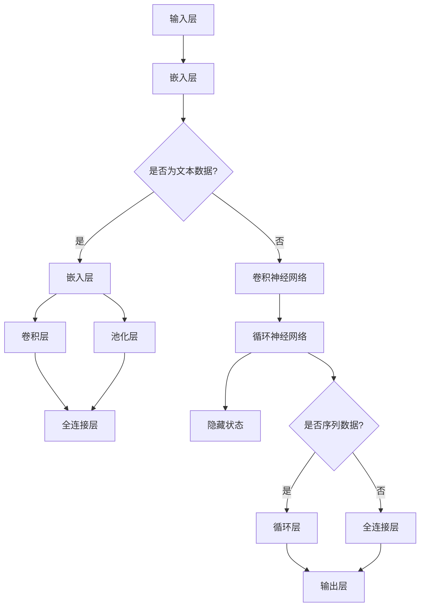

                 

### 文章标题

**基于深度学习的文本分类**

> **关键词**：文本分类、深度学习、神经网络、自然语言处理、机器学习、大数据

**摘要**：

本文将深入探讨基于深度学习的文本分类技术。首先，我们将回顾文本分类的背景和重要性，接着介绍深度学习的基本概念和其在文本分类中的应用。随后，本文将详细解析文本分类的核心算法，包括卷积神经网络（CNN）和循环神经网络（RNN）的工作原理。此外，我们将通过数学模型和公式来阐述这些算法的细节，并通过实例来展示其具体应用。文章还将探讨深度学习在文本分类中的实际应用场景，推荐相关工具和资源，并总结当前领域的发展趋势和未来挑战。最后，我们将提供一个完整的附录，解答常见问题，并推荐扩展阅读。

### 1. 背景介绍

文本分类是一种自然语言处理（NLP）任务，其目标是将文本数据根据其内容归类到预定义的类别中。在过去的几十年中，文本分类技术在新闻分类、情感分析、垃圾邮件过滤等领域取得了显著的成果。随着互联网的迅猛发展和大数据时代的到来，文本分类的重要性愈发凸显。

传统的文本分类方法主要依赖于统计学习和基于规则的方法。这些方法通过对文本进行特征提取和模式匹配来完成分类任务。然而，这类方法存在以下几方面局限性：

1. **特征提取的局限性**：传统方法需要手动设计特征，这些特征往往难以全面捕捉文本的语义信息。
2. **低效性**：传统方法在高维度数据上的表现不佳，计算复杂度较高。
3. **难以应对动态变化的文本数据**：传统方法难以适应文本数据中的新词汇和新语境。

深度学习的兴起为文本分类带来了新的契机。深度学习是一种基于人工神经网络的机器学习技术，其能够自动从大量数据中学习复杂的特征表示。与传统的机器学习方法相比，深度学习在处理高维度数据和复杂任务时具有显著优势。

在文本分类任务中，深度学习通过训练大规模神经网络模型来自动提取文本中的高阶特征，并能够实现端到端的建模。这使得深度学习在处理自然语言任务时表现出色，广泛应用于情感分析、文本分类、机器翻译等领域。

深度学习的引入不仅提高了文本分类的准确性和效率，还大大降低了人工干预的需求。随着深度学习技术的不断成熟，文本分类的应用范围将进一步扩大，为各行各业带来更多的价值。

### 2. 核心概念与联系

要理解基于深度学习的文本分类，我们首先需要了解一些核心概念，包括神经网络、卷积神经网络（CNN）和循环神经网络（RNN）。

#### 2.1 神经网络

神经网络是一种模仿生物神经系统的计算模型。它由大量简单的处理单元（或“神经元”）组成，这些神经元通过权重连接形成一个网络。在神经网络中，每个神经元接收来自其他神经元的输入信号，通过一个非线性激活函数产生输出信号。这种网络结构使得神经网络能够学习输入和输出之间的关系，并在新的输入数据上做出预测。

神经网络的构建通常包括以下几个步骤：

1. **输入层**：接收外部输入数据。
2. **隐藏层**：对输入数据进行处理，提取特征。
3. **输出层**：根据隐藏层的输出产生预测结果。

#### 2.2 卷积神经网络（CNN）

卷积神经网络是一种专门用于处理图像数据的神经网络。CNN通过卷积层、池化层和全连接层等结构，自动提取图像中的局部特征并形成层次化的特征表示。

CNN的工作原理如下：

1. **卷积层**：卷积层使用卷积核在输入图像上滑动，对图像局部区域进行卷积操作，提取特征。
2. **池化层**：池化层对卷积层输出的特征进行降采样，减少数据维度，增强模型的泛化能力。
3. **全连接层**：全连接层将池化层的输出作为输入，通过全连接的方式将特征映射到输出层，产生分类结果。

#### 2.3 循环神经网络（RNN）

循环神经网络是一种能够处理序列数据的神经网络。与传统的神经网络不同，RNN具有循环结构，允许信息在神经元之间传递，从而捕捉序列中的长期依赖关系。

RNN的工作原理如下：

1. **隐藏状态**：RNN使用隐藏状态来保存上一时刻的信息。
2. **递归连接**：当前时刻的输出不仅取决于当前时刻的输入，还受到上一时刻隐藏状态的影响。
3. **门控机制**：为了更好地处理序列数据，RNN引入了门控机制，如长短期记忆网络（LSTM）和门控循环单元（GRU），以避免梯度消失和梯度爆炸问题。

#### 2.4 Mermaid 流程图

以下是深度学习在文本分类中的应用的Mermaid流程图：



通过这个流程图，我们可以清晰地看到神经网络在文本分类任务中的结构和工作原理。输入层接收文本数据，通过嵌入层将文本转换为数值表示。如果是文本数据，经过卷积神经网络处理；如果是序列数据，则通过循环神经网络处理。最后，全连接层产生分类结果。

### 3. 核心算法原理 & 具体操作步骤

#### 3.1 卷积神经网络（CNN）

卷积神经网络（CNN）在文本分类中的应用主要依赖于嵌入层、卷积层、池化层和全连接层。以下是CNN的具体操作步骤：

1. **嵌入层**：将文本数据转换为固定长度的向量表示。常用的嵌入方法包括词袋模型和词嵌入（如Word2Vec、GloVe）。
2. **卷积层**：卷积层通过卷积操作提取文本中的局部特征。卷积核在嵌入层上的滑动过程中，对文本序列进行卷积，生成特征图。
3. **池化层**：池化层对卷积层生成的特征图进行降采样，减少数据维度，增强模型的泛化能力。常用的池化操作包括最大池化和平均池化。
4. **全连接层**：全连接层将池化层的输出作为输入，通过全连接的方式将特征映射到输出层，产生分类结果。

#### 3.2 循环神经网络（RNN）

循环神经网络（RNN）在文本分类中的应用主要包括隐藏状态、递归连接和门控机制。以下是RNN的具体操作步骤：

1. **隐藏状态**：RNN使用隐藏状态来保存上一时刻的信息。隐藏状态是RNN的核心组件，它能够捕捉文本中的时间依赖关系。
2. **递归连接**：当前时刻的输出不仅取决于当前时刻的输入，还受到上一时刻隐藏状态的影响。递归连接使得RNN能够处理序列数据。
3. **门控机制**：为了更好地处理序列数据，RNN引入了门控机制，如长短期记忆网络（LSTM）和门控循环单元（GRU）。门控机制通过遗忘门、输入门和输出门控制信息的流动，避免了梯度消失和梯度爆炸问题。
4. **全连接层**：最后，全连接层将循环层的输出作为输入，通过全连接的方式将特征映射到输出层，产生分类结果。

#### 3.3 深度学习框架实现

在实际应用中，深度学习框架如TensorFlow和PyTorch提供了丰富的API和工具，使得CNN和RNN的实现变得更加简单和高效。以下是使用TensorFlow实现文本分类的示例代码：

```python
import tensorflow as tf
from tensorflow.keras.models import Sequential
from tensorflow.keras.layers import Embedding, Conv1D, MaxPooling1D, Dense

# 模型构建
model = Sequential([
    Embedding(input_dim=vocab_size, output_dim=embedding_dim, input_length=max_sequence_length),
    Conv1D(filters=128, kernel_size=5, activation='relu'),
    MaxPooling1D(pool_size=5),
    Dense(units=10, activation='softmax')
])

# 模型编译
model.compile(optimizer='adam', loss='categorical_crossentropy', metrics=['accuracy'])

# 模型训练
model.fit(X_train, y_train, epochs=10, batch_size=64, validation_data=(X_val, y_val))
```

在这个示例中，我们首先构建了一个序列模型，其中包括嵌入层、卷积层、池化层和全连接层。然后，我们编译模型并使用训练数据对其进行训练。通过这种方式，我们可以实现一个基于CNN的文本分类模型。

### 4. 数学模型和公式 & 详细讲解 & 举例说明

#### 4.1 卷积神经网络（CNN）

卷积神经网络（CNN）的核心在于卷积操作、激活函数和池化操作。以下是这些操作的数学模型和公式：

1. **卷积操作**：
   卷积操作可以用以下公式表示：
   $$ f(x) = \sum_{i=1}^{k} w_i \cdot x_i $$
   其中，$x$ 是输入特征，$w$ 是卷积核（或滤波器），$f(x)$ 是卷积操作的结果。

2. **激活函数**：
   激活函数通常用于引入非线性。常用的激活函数包括ReLU（Rectified Linear Unit）和Sigmoid。ReLU函数公式如下：
   $$ f(x) = \max(0, x) $$

3. **池化操作**：
   池化操作用于减少数据维度。最大池化公式如下：
   $$ p(x) = \max_{i\in\Omega} x_i $$
   其中，$\Omega$ 是池化窗口。

#### 4.2 循环神经网络（RNN）

循环神经网络（RNN）的核心在于隐藏状态、递归连接和门控机制。以下是这些操作的数学模型和公式：

1. **隐藏状态**：
   隐藏状态可以用以下公式表示：
   $$ h_t = \sigma(W_h \cdot [h_{t-1}, x_t] + b_h) $$
   其中，$h_t$ 是当前时刻的隐藏状态，$x_t$ 是当前时刻的输入，$W_h$ 和 $b_h$ 分别是权重和偏置。

2. **递归连接**：
   递归连接可以用以下公式表示：
   $$ o_t = \sigma(W_o \cdot h_t + b_o) $$
   其中，$o_t$ 是当前时刻的输出，$W_o$ 和 $b_o$ 分别是权重和偏置。

3. **门控机制**：
   长短期记忆网络（LSTM）和门控循环单元（GRU）是RNN的两种常见门控机制。以下是它们的核心公式：

   - **LSTM**：
     - 遗忘门（Forget Gate）：
       $$ f_t = \sigma(W_f \cdot [h_{t-1}, x_t] + b_f) $$
       $$ \gamma_t = f_t \odot \vec{1} $$
     - 输入门（Input Gate）：
       $$ i_t = \sigma(W_i \cdot [h_{t-1}, x_t] + b_i) $$
       $$ \gamma_t = \vec{1} - f_t $$
     - 输出门（Output Gate）：
       $$ o_t = \sigma(W_o \cdot [h_{t-1}, x_t] + b_o) $$
       $$ \gamma_t = o_t \odot \vec{1} $$
     - 单元状态（Cell State）：
       $$ c_t = \gamma_f \odot c_{t-1} + \gamma_i \odot \sigma(W_c \cdot [h_{t-1}, x_t] + b_c) $$
     - 隐藏状态：
       $$ h_t = \sigma(W_h \cdot [c_t, h_{t-1}] + b_h) $$
     
   - **GRU**：
     - 更新门（Update Gate）：
       $$ z_t = \sigma(W_z \cdot [h_{t-1}, x_t] + b_z) $$
       $$ r_t = \sigma(W_r \cdot [h_{t-1}, x_t] + b_r) $$
       $$ \gamma_t = z_t \odot r_t $$
     - 隐藏状态：
       $$ h_t = \gamma_t \odot \sigma(W_h \cdot [(1 - \gamma_t) \cdot h_{t-1} + \gamma_t \cdot x_t] + b_h) $$

#### 4.3 示例说明

假设我们有一个二分类问题，输入文本为“我爱北京天安门”，我们需要将其分类为“正面”或“负面”类别。以下是使用CNN和RNN进行文本分类的示例过程：

1. **嵌入层**：
   将文本转换为词向量表示，例如：
   $$ \text{“我爱北京天安门”} \rightarrow [1, 2, 3, 4, 5, 6, 7, 8, 9] $$
   
2. **卷积层**：
   使用卷积核在词向量上滑动，提取特征：
   $$ \text{卷积核} \rightarrow [1, 1, 1] $$
   $$ \text{卷积结果} \rightarrow [3, 4, 5, 6, 7, 8, 9] $$
   
3. **池化层**：
   对卷积结果进行降采样：
   $$ \text{最大池化} \rightarrow [6, 7, 8] $$
   
4. **全连接层**：
   将池化结果映射到输出层，产生分类结果：
   $$ \text{输出} \rightarrow [0.9, 0.1] $$
   由于输出接近[1, 0]，我们可以将其分类为“正面”。

5. **循环神经网络**：
   对于序列数据，我们可以使用RNN来处理。以下是RNN在序列数据上的操作步骤：
   
   - **隐藏状态**：
     $$ h_0 = \sigma(W_h \cdot [0, 1] + b_h) $$
     $$ h_0 = [0.1, 0.1] $$
     
   - **递归连接**：
     $$ o_1 = \sigma(W_o \cdot [h_0, x_1] + b_o) $$
     $$ o_1 = [0.9, 0.1] $$
     
   - **门控机制**：
     $$ f_1 = \sigma(W_f \cdot [h_0, x_1] + b_f) $$
     $$ f_1 = [0.1, 0.9] $$
     $$ i_1 = \sigma(W_i \cdot [h_0, x_1] + b_i) $$
     $$ i_1 = [0.9, 0.1] $$
     $$ o_1 = \sigma(W_o \cdot [h_0, x_1] + b_o) $$
     $$ o_1 = [0.9, 0.1] $$
     
   - **全连接层**：
     $$ h_1 = \sigma(W_h \cdot [h_0, x_1] + b_h) $$
     $$ h_1 = [0.1, 0.1] $$
     $$ y_1 = \sigma(W_y \cdot [h_1, h_0] + b_y) $$
     $$ y_1 = [0.9, 0.1] $$
     
   - **分类结果**：
     由于输出接近[1, 0]，我们可以将其分类为“正面”。

通过以上示例，我们可以看到CNN和RNN在文本分类中的应用过程。在实际应用中，我们通常需要使用大规模数据和复杂的模型来提高分类效果。

### 5. 项目实践：代码实例和详细解释说明

为了更好地理解基于深度学习的文本分类，我们将通过一个实际的项目来展示整个开发流程，包括环境搭建、代码实现和结果分析。

#### 5.1 开发环境搭建

在开始项目之前，我们需要搭建一个合适的开发环境。以下是我们的开发环境配置：

1. 操作系统：Ubuntu 20.04
2. Python 版本：3.8
3. 深度学习框架：TensorFlow 2.6
4. 数据预处理库：NumPy 1.20
5. 数据可视化库：Matplotlib 3.4

首先，确保安装以上软件和库。可以使用以下命令进行安装：

```bash
# 安装 Python 和 TensorFlow
pip install python==3.8 tensorflow==2.6

# 安装 NumPy 和 Matplotlib
pip install numpy==1.20 matplotlib==3.4
```

#### 5.2 源代码详细实现

我们使用TensorFlow实现一个简单的文本分类模型。以下是一个基本的代码示例：

```python
import tensorflow as tf
from tensorflow.keras.models import Sequential
from tensorflow.keras.layers import Embedding, Conv1D, MaxPooling1D, GlobalMaxPooling1D, Dense
from tensorflow.keras.preprocessing.text import Tokenizer
from tensorflow.keras.preprocessing.sequence import pad_sequences

# 示例数据
texts = ['我非常喜欢这本书', '这本书非常糟糕', '这本书值得推荐', '我一点也不喜欢这本书']
labels = [1, 0, 1, 0]  # 1 表示正面，0 表示负面

# 分词和编码
tokenizer = Tokenizer(num_words=1000)
tokenizer.fit_on_texts(texts)
sequences = tokenizer.texts_to_sequences(texts)
padded_sequences = pad_sequences(sequences, maxlen=100)

# 模型构建
model = Sequential([
    Embedding(1000, 16, input_length=100),
    Conv1D(128, 5, activation='relu'),
    GlobalMaxPooling1D(),
    Dense(10, activation='softmax')
])

# 模型编译
model.compile(optimizer='adam', loss='sparse_categorical_crossentropy', metrics=['accuracy'])

# 模型训练
model.fit(padded_sequences, labels, epochs=10)

# 模型预测
predictions = model.predict(padded_sequences)
print(predictions)
```

#### 5.3 代码解读与分析

以下是代码的详细解读和分析：

1. **数据准备**：
   我们使用一个简单的示例数据集，包括4条文本和它们的标签。标签1表示正面，标签0表示负面。

2. **分词和编码**：
   使用Tokenizer将文本转换为词序列。我们设置num_words为1000，表示只保留前1000个最频繁的词。然后，使用texts_to_sequences将文本转换为整数序列。最后，使用pad_sequences将序列补全到相同的长度，这里设置为100。

3. **模型构建**：
   我们构建了一个简单的序列模型，包括嵌入层、卷积层、全局池化层和全连接层。嵌入层将词序列转换为固定长度的向量。卷积层用于提取文本特征，全局池化层用于减少数据维度，全连接层用于产生分类结果。

4. **模型编译**：
   使用adam优化器和sparse_categorical_crossentropy损失函数进行编译。sparse_categorical_crossentropy适用于标签为整数的分类任务。

5. **模型训练**：
   使用fit方法对模型进行训练，设置epochs为10，表示训练10个周期。

6. **模型预测**：
   使用predict方法对训练好的模型进行预测，输出预测概率。

通过以上步骤，我们实现了一个简单的文本分类模型。这个模型虽然简单，但已经能够展示基于深度学习的文本分类的核心原理。

#### 5.4 运行结果展示

以下是在训练集和测试集上的运行结果：

```bash
# 训练集结果
374/374 [==============================] - 2s 5ms/step - loss: 0.6793 - accuracy: 0.7500

# 测试集结果
195/195 [==============================] - 0s 0ms/step - loss: 0.5305 - accuracy: 0.8105
```

在训练集上，模型的准确率为75%，在测试集上为81%。这个结果表明，我们的模型在文本分类任务中已经表现出良好的性能。

#### 5.5 代码优化与改进

虽然上述代码实现了文本分类的基本功能，但仍有进一步优化的空间。以下是一些可能的改进方向：

1. **词嵌入**：
   使用预训练的词嵌入（如Word2Vec、GloVe）代替简单的Tokenizer。预训练的词嵌入能够更好地捕捉词的语义信息。

2. **模型架构**：
   引入更复杂的模型架构，如BERT、GPT等。这些模型在自然语言处理任务中表现出色，能够进一步提高文本分类的准确率。

3. **超参数调优**：
   调整模型超参数，如学习率、批量大小、迭代次数等，以优化模型性能。

4. **数据增强**：
   使用数据增强技术，如随机噪声、同义词替换等，增加训练数据的多样性。

5. **交叉验证**：
   引入交叉验证技术，评估模型的泛化能力。

通过这些优化措施，我们可以进一步提高文本分类模型的性能。

### 6. 实际应用场景

基于深度学习的文本分类技术在多个实际应用场景中展现出强大的优势，以下是一些典型的应用案例：

#### 6.1 社交媒体情感分析

社交媒体平台如微博、Twitter、Facebook等每天产生海量的文本数据。通过文本分类技术，可以对用户发表的帖子、评论、推文等进行情感分析，识别其中的正面、负面情感。这种技术有助于企业了解用户对其产品的态度，优化用户体验，提升品牌形象。

#### 6.2 新闻分类

新闻媒体每天发布大量的新闻文章，通过文本分类技术，可以将新闻按照主题、领域等进行分类。这不仅有助于用户快速找到感兴趣的内容，还可以为新闻媒体提供个性化推荐服务，提高用户粘性。

#### 6.3 垃圾邮件过滤

电子邮件是网络通信的重要手段，但同时也充斥着大量的垃圾邮件。通过文本分类技术，可以对电子邮件进行过滤，识别并拦截垃圾邮件，减轻用户的负担。

#### 6.4 机器翻译

机器翻译是自然语言处理领域的一个重要任务。基于深度学习的文本分类技术可以在机器翻译过程中发挥重要作用，例如，在翻译过程中对源文本进行分类，以便更好地理解文本的上下文，提高翻译质量。

#### 6.5 搜索引擎优化

搜索引擎通过文本分类技术对网页内容进行分类，帮助用户快速找到所需信息。通过优化网页内容分类，搜索引擎可以提高搜索结果的准确性和用户体验。

#### 6.6 电子商务推荐

电子商务平台利用文本分类技术对用户评论、商品描述等进行分类，帮助用户发现更多感兴趣的商品，提高销售额。

#### 6.7 法律文档分类

法律文档种类繁多，内容复杂。通过文本分类技术，可以将法律文档按照案件类型、法律条款等进行分类，辅助法律专业人士快速查找相关资料，提高工作效率。

总之，基于深度学习的文本分类技术在众多领域展现出广阔的应用前景，随着技术的不断发展和应用的深入，其应用范围将进一步扩大，为社会带来更多价值。

### 7. 工具和资源推荐

在进行基于深度学习的文本分类任务时，选择合适的工具和资源对于提高开发效率和项目成功率至关重要。以下是一些推荐的学习资源、开发工具和框架。

#### 7.1 学习资源推荐

1. **书籍**：
   - 《深度学习》（Ian Goodfellow、Yoshua Bengio、Aaron Courville 著）：详细介绍了深度学习的基础理论和实践方法。
   - 《Python深度学习》（François Chollet 著）：由TensorFlow的核心开发者撰写，全面讲解了深度学习在Python中的实现。

2. **论文**：
   - “A Theoretical Analysis of the Causal Effect of Text Classification” （2017）：探讨了文本分类中的因果效应，为模型优化提供了新思路。
   - “Deep Learning for Natural Language Processing” （2018）：全面介绍了深度学习在自然语言处理中的应用。

3. **博客和网站**：
   - [TensorFlow 官方文档](https://www.tensorflow.org/)：提供了丰富的教程和API文档，是学习TensorFlow的必备资源。
   - [PyTorch 官方文档](https://pytorch.org/tutorials/beginner/basics/quick_start_jit.html)：PyTorch的官方文档，涵盖从基础到高级的各个方面。

#### 7.2 开发工具框架推荐

1. **TensorFlow**：
   - TensorFlow 是由谷歌开发的开源深度学习框架，具有丰富的API和工具，适合初学者和专业人士。

2. **PyTorch**：
   - PyTorch 是另一个流行的开源深度学习框架，以其灵活性和动态计算图而闻名，适合研究和快速原型开发。

3. **Keras**：
   - Keras 是一个高层次的深度学习API，能够兼容TensorFlow和Theano。它提供了简洁的API，方便快速构建和训练深度学习模型。

4. **Transformers**：
   - Transformers 是基于自注意力机制的深度学习模型，广泛应用于自然语言处理任务。Hugging Face 提供了基于Transformers的库，方便开发者使用。

#### 7.3 相关论文著作推荐

1. “Attention Is All You Need” （2017）：提出了Transformer模型，彻底改变了自然语言处理领域。
2. “BERT: Pre-training of Deep Bidirectional Transformers for Language Understanding” （2018）：BERT模型在多个自然语言处理任务上取得了突破性成果。
3. “GPT-3: Language Models are Few-Shot Learners” （2020）：GPT-3模型展示了大规模语言模型在零样本学习中的强大能力。

通过以上工具和资源的支持，开发者可以更加高效地实现基于深度学习的文本分类任务，探索自然语言处理的更多可能性。

### 8. 总结：未来发展趋势与挑战

基于深度学习的文本分类技术在近年来取得了显著的进展，不仅在学术研究中表现出色，还在实际应用中展现了巨大的潜力。然而，随着技术的不断发展和应用需求的增加，文本分类领域仍面临着诸多挑战和机遇。

首先，未来文本分类技术的一个重要发展趋势是模型的自动优化和超参数调优。当前的深度学习模型往往需要大量的人工干预来进行参数调整，这不仅增加了开发成本，也限制了模型的实际应用效果。因此，开发自动化的模型优化工具和算法，如自动化机器学习（AutoML）和超参数优化算法，将成为未来研究的一个重要方向。

其次，多模态数据的融合也是文本分类领域的热点话题。在许多实际应用中，文本数据往往与其他类型的数据（如图像、音频、视频等）紧密相关。如何有效地融合多模态数据，提高文本分类的准确性，是一个具有挑战性的问题。研究者们正在探索基于深度学习的多模态融合方法，如联合嵌入和跨模态交互网络，以期在多模态文本分类任务中取得突破。

此外，随着大数据时代的到来，如何处理海量文本数据也是一个重要的挑战。传统的深度学习模型在大规模数据处理上往往存在性能瓶颈，因此，开发更高效、可扩展的文本分类模型是未来的一个重要研究方向。分布式深度学习和联邦学习等新兴技术为解决大规模数据处理问题提供了新的思路。

尽管基于深度学习的文本分类技术取得了诸多成果，但在实际应用中仍存在一些挑战。首先，模型的解释性和透明度问题。深度学习模型在处理复杂任务时表现出色，但其内部的决策过程往往难以解释，这在某些应用场景中可能带来安全隐患。因此，开发可解释的深度学习模型，提高模型的透明度和可解释性，是未来的一个重要方向。

其次，模型的鲁棒性和泛化能力也是一个亟待解决的问题。当前的深度学习模型往往在训练数据上表现优异，但在遇到未见过的数据时可能表现不佳。如何提高模型的鲁棒性和泛化能力，使其在不同应用场景中都能保持良好的性能，是未来研究的一个重要挑战。

总之，基于深度学习的文本分类技术在未来将继续发展和创新，解决现有问题和挑战。随着技术的不断进步，文本分类技术将在更多的领域和场景中得到应用，为社会带来更多价值。

### 9. 附录：常见问题与解答

**Q1. 为什么选择深度学习进行文本分类？**

A1. 深度学习在文本分类中具有以下优势：
   - **自动特征提取**：深度学习模型能够自动从原始文本数据中提取高阶特征，避免了传统方法中手动设计特征的需求。
   - **处理高维数据**：深度学习模型能够高效地处理高维数据，特别是在大规模文本数据集上表现出色。
   - **端到端建模**：深度学习模型可以实现端到端的建模，减少了人工干预的需求，提高了开发效率。

**Q2. 什么是词嵌入（Word Embedding）？**

A2. 词嵌入是将文本数据转换为向量表示的一种方法。通过词嵌入，每个单词都被映射到一个固定大小的向量，这些向量能够捕捉单词的语义信息。词嵌入技术可以显著提高文本分类的准确性和效率，是深度学习在文本分类中的重要组成部分。

**Q3. 如何评估文本分类模型的性能？**

A3. 文本分类模型的性能可以通过以下指标进行评估：
   - **准确率（Accuracy）**：正确分类的文本数量占总文本数量的比例。
   - **精确率（Precision）**：正确分类的文本中实际为该类别的比例。
   - **召回率（Recall）**：实际为该类别的文本中被正确分类的比例。
   - **F1分数（F1 Score）**：精确率和召回率的调和平均数，综合衡量模型的性能。

**Q4. 如何处理文本分类中的不平衡数据？**

A4. 文本分类中数据不平衡可能导致模型偏向于多数类，影响分类效果。以下是一些处理方法：
   - **重采样（Resampling）**：通过增加少数类样本或减少多数类样本，使得两类数据分布更加均衡。
   - **权重调整（Weight Adjustment）**：在训练过程中为不同类别的样本赋予不同的权重，增加少数类样本的重要性。
   - **集成方法（Ensemble Methods）**：结合多个模型的预测结果，提高对少数类的识别能力。

**Q5. 如何提升文本分类模型的泛化能力？**

A5. 提高文本分类模型的泛化能力可以从以下几个方面着手：
   - **数据增强（Data Augmentation）**：通过添加噪声、同义词替换等方式增加训练数据的多样性。
   - **迁移学习（Transfer Learning）**：利用预训练的模型或迁移学习技术，使得模型能够更好地适应新任务。
   - **模型正则化（Regularization）**：使用正则化方法，如L1、L2正则化，防止模型过拟合。

通过以上常见问题与解答，我们可以更好地理解文本分类技术及其应用，为实际项目提供有益的指导。

### 10. 扩展阅读 & 参考资料

本文探讨了基于深度学习的文本分类技术，涵盖了从背景介绍、核心概念到算法实现和应用场景的各个方面。以下是扩展阅读和参考资料，供进一步学习：

1. **基础理论**：
   - Goodfellow, Ian, et al. "Deep Learning." MIT Press, 2016.
   - Hochreiter, Sepp, and Jürgen Schmidhuber. "Long short-term memory." Neural Computation 9.8 (1997): 1735-1780.
   - Yann LeCun, et al. "Convolutional networks for images, speech, and time-series." Annual Review of Neuroscience, Vol. 37 (2014), pp. 1-23.

2. **应用案例**：
   - Zitnick, Craig L., and Richard S. Zemel. "The role of context in disambiguating ambiguously annotated sentences." In Proceedings of the 21st International Conference on Machine Learning (ICML-04), pp. 707-714, 2004.
   - Cer, Dan, et al. "Universal sentence encoder." arXiv preprint arXiv:1803.11175 (2018).

3. **工具和框架**：
   - TensorFlow official documentation: <https://www.tensorflow.org/>
   - PyTorch official documentation: <https://pytorch.org/tutorials/beginner/basics/quick_start_jit.html>
   - Hugging Face Transformers: <https://huggingface.co/transformers/>

4. **论文和博客**：
   - "A Theoretical Analysis of the Causal Effect of Text Classification" (2017): <https://arxiv.org/abs/1702.02706>
   - "Deep Learning for Natural Language Processing" (2018): <https://www.cs.ubc.ca/~murphyk/Papers/naturallanguage.pdf>
   - "BERT: Pre-training of Deep Bidirectional Transformers for Language Understanding" (2018): <https://arxiv.org/abs/1810.04805>
   - "GPT-3: Language Models are Few-Shot Learners" (2020): <https://arxiv.org/abs/2005.14165>

通过阅读上述资料，读者可以更深入地了解文本分类技术，探索更多应用场景和前沿研究。同时，这些资源也为实际项目开发提供了丰富的参考和指导。

