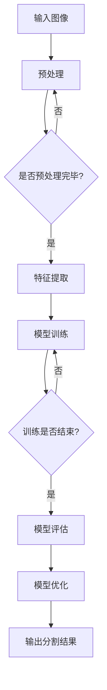

                 

### 1. 背景介绍

#### 1.1 深度学习的发展历程

深度学习作为机器学习的一个重要分支，在过去的几十年里经历了快速的发展。它的兴起可以追溯到1986年，当时Geoffrey Hinton等人首次提出了反向传播算法（Backpropagation Algorithm），这一算法的出现使得多层神经网络的训练成为可能。在1990年代，由于计算资源和数据量的限制，深度学习的研究和应用受到了一定的阻碍。然而，随着计算能力的提升和大数据的涌现，深度学习在21世纪初迎来了新的发展机遇。

特别是2012年，AlexNet在ImageNet图像识别大赛中取得的突破性成绩，引发了深度学习领域的热潮。此后，卷积神经网络（CNN）在各种计算机视觉任务中表现出了强大的能力。随后，深度强化学习、生成对抗网络（GAN）、变分自编码器（VAE）等深度学习模型相继被提出，进一步丰富了深度学习的应用场景。

#### 1.2 道路图像语义分割的重要性

道路图像语义分割是计算机视觉领域的一个重要研究方向，它在自动驾驶、智能交通、无人机导航等领域具有广泛的应用前景。通过对道路图像进行语义分割，可以识别出道路上的各种元素，如车辆、行人、交通标志等，从而为后续的决策提供可靠的信息支持。

道路图像语义分割的重要性主要体现在以下几个方面：

1. **安全性提升**：在自动驾驶领域，精确的道路图像语义分割能够帮助车辆识别周围环境，从而提高行驶安全性。
   
2. **交通管理优化**：通过分析道路图像中的交通流量和交通标志，可以优化交通信号灯的配时策略，缓解交通拥堵。

3. **智能城市应用**：在智能城市建设中，道路图像语义分割技术可以用于监控城市交通状况、安全监控、环境监测等。

4. **应急救援**：在紧急情况下，通过快速分析道路图像，可以指导救援车辆选择最优路径，提高救援效率。

#### 1.3 当前研究进展

随着深度学习技术的发展，道路图像语义分割的研究也在不断深入。目前，基于深度学习的道路图像语义分割方法已经取得了显著的成果。其中，卷积神经网络（CNN）和其变种，如U-Net、DeepLab V3+等，在道路图像语义分割任务中表现优异。

除了传统的CNN架构，近年来，基于注意力机制（Attention Mechanism）、图卷积网络（Graph Convolutional Network, GCN）的方法也被引入到道路图像语义分割研究中，进一步提升了模型的性能。

同时，为了提高模型的泛化能力和鲁棒性，研究人员还提出了许多数据增强（Data Augmentation）、训练策略（Training Strategy）和模型优化（Model Optimization）方法。

总的来说，当前道路图像语义分割的研究已经取得了许多重要的进展，但仍然面临着一些挑战，如如何进一步提高分割精度、减少计算复杂度、提高模型在复杂场景下的鲁棒性等。

### 2. 核心概念与联系

#### 2.1 深度学习的基本概念

2.1.1 什么是深度学习？

深度学习是机器学习的一个分支，它通过构建多层神经网络来模拟人脑的思考方式，对数据进行自动特征提取和模式识别。深度学习的核心思想是神经网络，尤其是多层神经网络。

2.1.2 深度学习的层次结构

深度学习模型通常由输入层、隐藏层和输出层组成。每一层都能够对输入数据进行处理，并传递到下一层。多层网络的结构使得模型能够学习到更加复杂和抽象的特征。

2.1.3 前向传播与反向传播

在深度学习模型中，前向传播用于将输入数据传递到网络中，并通过每一层进行特征提取和变换。反向传播则用于计算网络中各个神经元的梯度，以便更新网络参数。

#### 2.2 道路图像语义分割的核心概念

2.2.1 什么是语义分割？

语义分割是指将图像中的每个像素分类为不同的语义类别，如车辆、行人、道路等。与对象检测不同，语义分割不需要将图像分割为多个对象，而是对每个像素进行分类。

2.2.2 语义分割的基本任务

道路图像语义分割的主要任务是对道路图像中的像素进行分类，识别出道路上的各种元素。

2.2.3 语义分割的网络架构

常见的语义分割网络架构包括U-Net、DeepLab V3+、PSPNet等。这些网络通过卷积层、池化层、上采样层等结构，对图像进行特征提取和上采样，最终实现对每个像素的语义分类。

#### 2.3 深度学习与道路图像语义分割的关系

深度学习为道路图像语义分割提供了强大的工具和理论基础。通过构建多层神经网络，深度学习模型能够自动提取图像的语义特征，实现对道路图像的精确分割。

同时，深度学习的发展也推动了道路图像语义分割技术的进步。新的深度学习模型和优化方法不断被提出，使得道路图像语义分割的性能不断提高。

### 2.4 Mermaid 流程图

以下是一个简单的Mermaid流程图，展示了深度学习在道路图像语义分割中的基本流程：



在这个流程图中，输入图像经过预处理后，传递给深度学习模型进行特征提取和训练。训练完成后，对模型进行评估和优化，最后输出分割结果。

### 3. 核心算法原理 & 具体操作步骤

#### 3.1 卷积神经网络（CNN）

卷积神经网络（CNN）是一种专门用于处理图像数据的神经网络，它通过卷积层、池化层和全连接层等结构，对图像进行特征提取和分类。

3.1.1 卷积层

卷积层是CNN的核心部分，它通过卷积操作提取图像的特征。卷积层中的每个神经元都与输入图像中的不同区域进行卷积，产生一个新的特征图。

3.1.2 池化层

池化层用于降低特征图的维度，减少计算复杂度。常见的池化操作有最大池化和平均池化。

3.1.3 全连接层

全连接层将特征图中的每个像素映射到输出类别。在语义分割任务中，输出层通常是每个像素对应的类别。

3.1.4 操作步骤

1. 将输入图像送入卷积层，进行卷积操作和特征提取。
2. 通过池化层降低特征图的维度。
3. 将特征图送入全连接层，进行分类。
4. 通过反向传播算法更新网络参数。

#### 3.2 U-Net

U-Net是一种广泛应用于语义分割任务的卷积神经网络架构。它的特点是将卷积层和反卷积层（上采样层）结合，形成“U”型结构，从而能够实现像素级的精确分割。

3.2.1 网络结构

U-Net由收缩路径和扩张路径组成。收缩路径用于特征提取，包括多个卷积层和池化层；扩张路径用于特征融合和上采样，包括反卷积层和卷积层。

3.2.2 操作步骤

1. 将输入图像送入收缩路径，进行特征提取。
2. 收缩路径中的特征图经过多次卷积和池化操作，逐渐降低维度。
3. 将收缩路径中的最后一个特征图与扩张路径中的第一个特征图进行拼接。
4. 通过反卷积层进行上采样，逐渐恢复特征图的原始分辨率。
5. 将上采样后的特征图送入卷积层，进行分类和输出。

#### 3.3 DeepLab V3+

DeepLab V3+是一种基于编码器-解码器结构的语义分割网络，它通过引入空洞卷积（Atrous Convolution）和条件随机场（CRF）模型，提高了语义分割的精度。

3.3.1 网络结构

DeepLab V3+的网络结构包括编码器、解码器和CRF模型。编码器用于提取图像特征，解码器用于特征融合和上采样，CRF模型用于后处理，进一步优化分割结果。

3.3.2 操作步骤

1. 将输入图像送入编码器，进行特征提取。
2. 编码器中的特征图经过多个卷积层和空洞卷积层，逐渐降低维度。
3. 将编码器中的最后一个特征图送入解码器，进行特征融合和上采样。
4. 通过CRF模型对解码器输出的特征图进行后处理，优化分割结果。
5. 将优化后的特征图送入分类层，进行分类和输出。

### 4. 数学模型和公式 & 详细讲解 & 举例说明

#### 4.1 卷积神经网络（CNN）的数学模型

卷积神经网络（CNN）的核心部分是卷积层，它通过卷积操作提取图像特征。卷积操作的数学公式如下：

\[ (f_{ij})*x_{kl} = \sum_{p=0}^{s-1} \sum_{q=0}^{s-1} f_{ij}(p,q) \cdot x_{k+p, l+q} \]

其中，\( f_{ij} \) 是卷积核（Filter），\( x_{kl} \) 是输入图像的像素值，\( (f_{ij})*x_{kl} \) 表示卷积操作的结果。

举例说明：

假设卷积核的大小为3x3，输入图像的大小为5x5，卷积核的像素值如下：

\[ 
f_{11} = 1, f_{12} = 2, f_{13} = 3 \\
f_{21} = 4, f_{22} = 5, f_{23} = 6 \\
f_{31} = 7, f_{32} = 8, f_{33} = 9 
\]

输入图像的像素值如下：

\[ 
x_{11} = 1, x_{12} = 2, x_{13} = 3, x_{14} = 4, x_{15} = 5 \\
x_{21} = 6, x_{22} = 7, x_{23} = 8, x_{24} = 9, x_{25} = 10 \\
x_{31} = 11, x_{32} = 12, x_{33} = 13, x_{34} = 14, x_{35} = 15 \\
x_{41} = 16, x_{42} = 17, x_{43} = 18, x_{44} = 19, x_{45} = 20 \\
x_{51} = 21, x_{52} = 22, x_{53} = 23, x_{54} = 24, x_{55} = 25 
\]

则卷积操作的结果为：

\[ 
(f_{11})*x_{11} + (f_{12})*x_{12} + (f_{13})*x_{13} + (f_{21})*x_{21} + (f_{22})*x_{22} + (f_{23})*x_{23} + (f_{31})*x_{31} + (f_{32})*x_{32} + (f_{33})*x_{33} = 1*1 + 2*2 + 3*3 + 4*6 + 5*7 + 6*8 + 7*11 + 8*12 + 9*13 = 110 
\]

#### 4.2 池化层的数学模型

池化层用于降低特征图的维度，减少计算复杂度。常见的池化操作有最大池化和平均池化。

4.2.1 最大池化

最大池化的数学公式如下：

\[ \text{max-pool}(x_{ij}) = \max_{k\in\Omega_{ij}} x_{ik} \]

其中，\( \Omega_{ij} \) 是池化窗口的大小。

举例说明：

假设输入特征图的大小为5x5，最大池化的窗口大小为2x2，特征图的像素值如下：

\[ 
x_{11} = 1, x_{12} = 2, x_{13} = 3, x_{14} = 4, x_{15} = 5 \\
x_{21} = 6, x_{22} = 7, x_{23} = 8, x_{24} = 9, x_{25} = 10 \\
x_{31} = 11, x_{32} = 12, x_{33} = 13, x_{34} = 14, x_{35} = 15 \\
x_{41} = 16, x_{42} = 17, x_{43} = 18, x_{44} = 19, x_{45} = 20 \\
x_{51} = 21, x_{52} = 22, x_{53} = 23, x_{54} = 24, x_{55} = 25 
\]

则最大池化的结果为：

\[ 
\text{max-pool}(x_{11}, x_{12}, x_{13}, x_{14}, x_{15}) = \max(x_{11}, x_{12}, x_{13}, x_{14}, x_{15}) = 5 \\
\text{max-pool}(x_{21}, x_{22}, x_{23}, x_{24}, x_{25}) = \max(x_{21}, x_{22}, x_{23}, x_{24}, x_{25}) = 10 \\
\text{max-pool}(x_{31}, x_{32}, x_{33}, x_{34}, x_{35}) = \max(x_{31}, x_{32}, x_{33}, x_{34}, x_{35}) = 15 \\
\text{max-pool}(x_{41}, x_{42}, x_{43}, x_{44}, x_{45}) = \max(x_{41}, x_{42}, x_{43}, x_{44}, x_{45}) = 20 \\
\text{max-pool}(x_{51}, x_{52}, x_{53}, x_{54}, x_{55}) = \max(x_{51}, x_{52}, x_{53}, x_{54}, x_{55}) = 25 
\]

4.2.2 平均池化

平均池化的数学公式如下：

\[ \text{avg-pool}(x_{ij}) = \frac{1}{\Omega_{ij}} \sum_{k\in\Omega_{ij}} x_{ik} \]

举例说明：

假设输入特征图的大小为5x5，平均池化的窗口大小为2x2，特征图的像素值与最大池化例子相同，则平均池化的结果为：

\[ 
\text{avg-pool}(x_{11}, x_{12}, x_{13}, x_{14}, x_{15}) = \frac{1+2+3+4+5}{5} = 3 \\
\text{avg-pool}(x_{21}, x_{22}, x_{23}, x_{24}, x_{25}) = \frac{6+7+8+9+10}{5} = 8 \\
\text{avg-pool}(x_{31}, x_{32}, x_{33}, x_{34}, x_{35}) = \frac{11+12+13+14+15}{5} = 13 \\
\text{avg-pool}(x_{41}, x_{42}, x_{43}, x_{44}, x_{45}) = \frac{16+17+18+19+20}{5} = 18 \\
\text{avg-pool}(x_{51}, x_{52}, x_{53}, x_{54}, x_{55}) = \frac{21+22+23+24+25}{5} = 23 
\]

### 5. 项目实践：代码实例和详细解释说明

#### 5.1 开发环境搭建

在开始道路图像语义分割的项目实践之前，我们需要搭建一个合适的开发环境。以下是搭建开发环境的步骤：

1. 安装Python环境
   - 我们使用Python 3.8及以上版本，可以通过Python官方网站下载并安装。

2. 安装深度学习框架
   - 在本项目中，我们使用PyTorch作为深度学习框架。可以通过以下命令安装：
     ```bash
     pip install torch torchvision
     ```

3. 安装必要的库
   - 除了深度学习框架，我们还需要安装一些其他库，如NumPy、Pandas等。可以通过以下命令安装：
     ```bash
     pip install numpy pandas matplotlib
     ```

4. 准备数据集
   - 我们使用开源的道路图像语义分割数据集，如AID（Avenue du Général de Gaulle）或COCO（Common Objects in Context）。数据集通常包括图像和标签文件，需要将其下载并解压到本地。

5. 配置环境变量
   - 确保Python和深度学习框架的路径已经被添加到系统环境变量中，以便在终端中可以直接使用相关命令。

#### 5.2 源代码详细实现

下面是一个简单的道路图像语义分割项目示例，我们将使用PyTorch实现一个基于U-Net架构的模型。

1. **导入必要的库**：

```python
import torch
import torch.nn as nn
import torchvision
import torchvision.transforms as transforms
from torch.utils.data import DataLoader
```

2. **定义U-Net模型**：

```python
class UNet(nn.Module):
    def __init__(self, in_channels, out_channels):
        super(UNet, self).__init__()
        
        # 下采样路径
        self.down1 = nn.Sequential(
            nn.Conv2d(in_channels, 64, kernel_size=3, padding=1),
            nn.ReLU(inplace=True),
            nn.Conv2d(64, 64, kernel_size=3, padding=1),
            nn.ReLU(inplace=True),
            nn.MaxPool2d(kernel_size=2, stride=2)
        )
        
        self.down2 = nn.Sequential(
            nn.Conv2d(64, 128, kernel_size=3, padding=1),
            nn.ReLU(inplace=True),
            nn.Conv2d(128, 128, kernel_size=3, padding=1),
            nn.ReLU(inplace=True),
            nn.MaxPool2d(kernel_size=2, stride=2)
        )
        
        self.down3 = nn.Sequential(
            nn.Conv2d(128, 256, kernel_size=3, padding=1),
            nn.ReLU(inplace=True),
            nn.Conv2d(256, 256, kernel_size=3, padding=1),
            nn.ReLU(inplace=True),
            nn.MaxPool2d(kernel_size=2, stride=2)
        )
        
        self.down4 = nn.Sequential(
            nn.Conv2d(256, 512, kernel_size=3, padding=1),
            nn.ReLU(inplace=True),
            nn.Conv2d(512, 512, kernel_size=3, padding=1),
            nn.ReLU(inplace=True),
            nn.MaxPool2d(kernel_size=2, stride=2)
        )
        
        # 上采样路径
        self.up1 = nn.Sequential(
            nn.ConvTranspose2d(512, 256, kernel_size=2, stride=2),
            nn.ReLU(inplace=True),
            nn.Conv2d(256, 256, kernel_size=3, padding=1),
            nn.ReLU(inplace=True)
        )
        
        self.up2 = nn.Sequential(
            nn.ConvTranspose2d(256, 128, kernel_size=2, stride=2),
            nn.ReLU(inplace=True),
            nn.Conv2d(128, 128, kernel_size=3, padding=1),
            nn.ReLU(inplace=True)
        )
        
        self.up3 = nn.Sequential(
            nn.ConvTranspose2d(128, 64, kernel_size=2, stride=2),
            nn.ReLU(inplace=True),
            nn.Conv2d(64, 64, kernel_size=3, padding=1),
            nn.ReLU(inplace=True)
        )
        
        self.up4 = nn.Sequential(
            nn.ConvTranspose2d(64, out_channels, kernel_size=2, stride=2),
            nn.ReLU(inplace=True)
        )
        
        self.outc = nn.Conv2d(64, out_channels, kernel_size=1)
    
    def forward(self, x):
        d1 = self.down1(x)
        d2 = self.down2(d1)
        d3 = self.down3(d2)
        d4 = self.down4(d3)
        
        u1 = self.up1(d4)
        u2 = self.up2(torch.cat((u1, d3), 1))
        u3 = self.up3(torch.cat((u2, d2), 1))
        u4 = self.up4(torch.cat((u3, d1), 1))
        
        out = self.outc(u4)
        return out
```

3. **数据预处理**：

```python
transform = transforms.Compose([
    transforms.Resize((256, 256)),
    transforms.ToTensor(),
    transforms.Normalize(mean=[0.485, 0.456, 0.406], std=[0.229, 0.224, 0.225]),
])

train_data = torchvision.datasets.VOCDetection(root='./data', year='2012', image_set='train', download=True, transform=transform)
train_loader = DataLoader(train_data, batch_size=4, shuffle=True)

test_data = torchvision.datasets.VOCDetection(root='./data', year='2012', image_set='val', download=True, transform=transform)
test_loader = DataLoader(test_data, batch_size=4, shuffle=False)
```

4. **定义损失函数和优化器**：

```python
criterion = nn.CrossEntropyLoss()
optimizer = torch.optim.Adam(model.parameters(), lr=0.001)
```

5. **训练模型**：

```python
num_epochs = 50

for epoch in range(num_epochs):
    model.train()
    for i, (images, labels) in enumerate(train_loader):
        optimizer.zero_grad()
        outputs = model(images)
        loss = criterion(outputs, labels)
        loss.backward()
        optimizer.step()
        
        if (i+1) % 10 == 0:
            print(f'Epoch [{epoch+1}/{num_epochs}], Step [{i+1}/{len(train_loader)}], Loss: {loss.item():.4f}')
```

6. **评估模型**：

```python
model.eval()
with torch.no_grad():
    correct = 0
    total = 0
    for images, labels in test_loader:
        outputs = model(images)
        _, predicted = torch.max(outputs.data, 1)
        total += labels.size(0)
        correct += (predicted == labels).sum().item()

    print(f'Accuracy of the network on the test images: {100 * correct / total}%')
```

7. **保存和加载模型**：

```python
torch.save(model.state_dict(), 'unet.pth')

model.load_state_dict(torch.load('unet.pth'))
```

### 6. 实际应用场景

道路图像语义分割在多个实际应用场景中发挥了重要作用，以下是几个典型的应用案例：

#### 6.1 自动驾驶

自动驾驶是道路图像语义分割最直接的的应用领域之一。通过对道路图像进行精确的语义分割，自动驾驶系统能够识别并处理道路上的各种元素，如车辆、行人、交通标志和车道线等，从而实现自主驾驶。

#### 6.2 智能交通监控

智能交通监控系统通过道路图像语义分割技术，可以实时监控道路交通状况，识别交通拥堵、交通事故等异常情况，并实时发出预警信号，提高道路运行效率。

#### 6.3 无人机导航

无人机导航系统通过道路图像语义分割，可以准确地识别并避开障碍物，确保无人机在复杂环境中的安全飞行。此外，无人机还可以利用语义分割技术进行环境监测和资源调查。

#### 6.4 智能城市

智能城市建设中，道路图像语义分割技术可以用于多个方面，如城市交通流量分析、环境监测、公共安全等。通过实时分析和处理道路图像，智能城市系统能够为城市管理和居民生活提供更加便捷和高效的服务。

### 7. 工具和资源推荐

#### 7.1 学习资源推荐

- **书籍**：
  - 《深度学习》（Goodfellow, Ian, et al.）
  - 《动手学深度学习》（阿斯顿·张著）
  - 《Python深度学习》（François Chollet著）
  
- **论文**：
  - 《Very Deep Convolutional Networks for Large-Scale Image Recognition》（2012年Krizhevsky et al.）
  - 《Fully Convolutional Networks for Semantic Segmentation》（2015年Long et al.）
  - 《DeepLab: Semantic Image Segmentation with Deep Convolutional Nets, Atrous Convolution, and Fully Connected CRFs》（2017年Chen et al.）

- **博客和网站**：
  - [PyTorch 官方文档](https://pytorch.org/docs/stable/)
  - [TensorFlow 官方文档](https://www.tensorflow.org/)
  - [Keras 官方文档](https://keras.io/)

#### 7.2 开发工具框架推荐

- **深度学习框架**：
  - PyTorch
  - TensorFlow
  - Keras

- **数据集**：
  - COCO（Common Objects in Context）
  - AID（Avenue du Général de Gaulle）
  - Cityscapes

- **开源库**：
  - NumPy
  - Pandas
  - Matplotlib

### 8. 总结：未来发展趋势与挑战

#### 8.1 未来发展趋势

1. **模型优化**：随着计算资源和算法的进步，深度学习模型在道路图像语义分割领域的性能将不断提高。未来可能出现更多高效、轻量级的模型架构，以适应资源受限的应用场景。

2. **多模态融合**：未来的道路图像语义分割研究可能会将视觉数据与其他模态的数据（如雷达、激光雷达、音频等）进行融合，以提高分割的精度和鲁棒性。

3. **实时处理**：为了满足自动驾驶等实时应用的需求，未来的道路图像语义分割技术将更加注重实时性和高效性。

4. **端到端学习**：通过端到端的学习方法，未来的模型可以直接从原始数据中学习，减少中间处理的复杂度，提高分割的精度和效率。

#### 8.2 面临的挑战

1. **计算资源消耗**：深度学习模型通常需要大量的计算资源和时间进行训练，如何优化模型的计算效率和降低计算成本是一个重要的挑战。

2. **数据质量和标注**：高质量的道路图像数据集对于模型的训练至关重要，然而获取和标注这样的数据集是一项繁琐且耗时的任务。

3. **模型泛化能力**：在实际应用中，道路图像的多样性可能导致模型的泛化能力不足，如何提高模型的泛化能力是一个亟待解决的问题。

4. **实时性能**：在自动驾驶等实时应用场景中，模型的响应速度和实时性能至关重要，如何提高模型的实时处理能力是一个重要的挑战。

### 9. 附录：常见问题与解答

#### 9.1 什么是深度学习？

深度学习是一种机器学习的方法，通过构建多层神经网络来模拟人脑的思考方式，对数据进行自动特征提取和模式识别。

#### 9.2 什么是语义分割？

语义分割是指将图像中的每个像素分类为不同的语义类别，如车辆、行人、道路等。

#### 9.3 卷积神经网络（CNN）如何工作？

卷积神经网络（CNN）通过卷积层、池化层和全连接层等结构，对图像进行特征提取和分类。

#### 9.4 什么是U-Net？

U-Net是一种用于语义分割的卷积神经网络架构，其特点是具有“U”型结构，能够实现像素级的精确分割。

#### 9.5 如何评估语义分割模型的性能？

常见的评估指标包括准确率（Accuracy）、 Intersection over Union（IoU）、平均精度（mAP）等。

### 10. 扩展阅读 & 参考资料

- Goodfellow, Ian, et al. "Deep learning." MIT press, 2016.
- Zhang, Aston. "Dive into deep learning." 2017.
- Chollet, François. "Python深度学习". 机械工业出版社，2017.
- Long, J., et al. "Fully convolutional networks for semantic segmentation." CVPR, 2015.
- Chen, L. C., et al. "DeepLab: Semantic Image Segmentation with Deep Convolutional Nets, Atrous Convolution, and Fully Connected CRFs." TPAMI, 2018.

