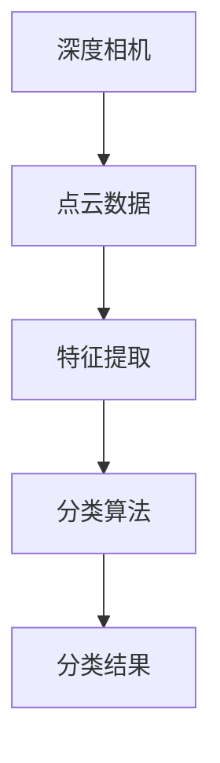
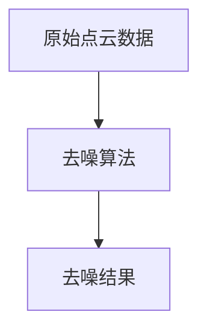
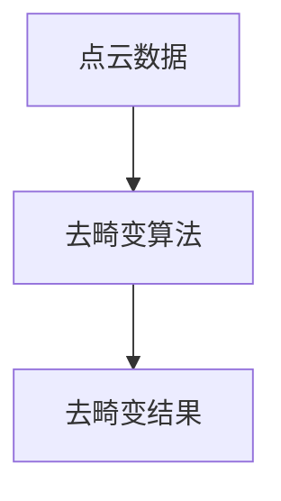
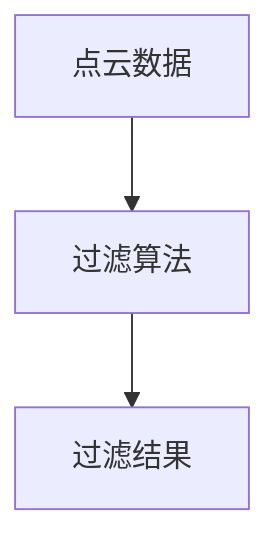
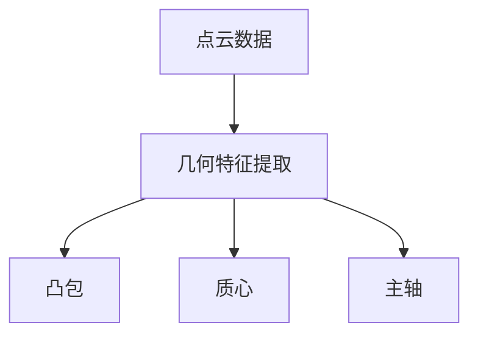
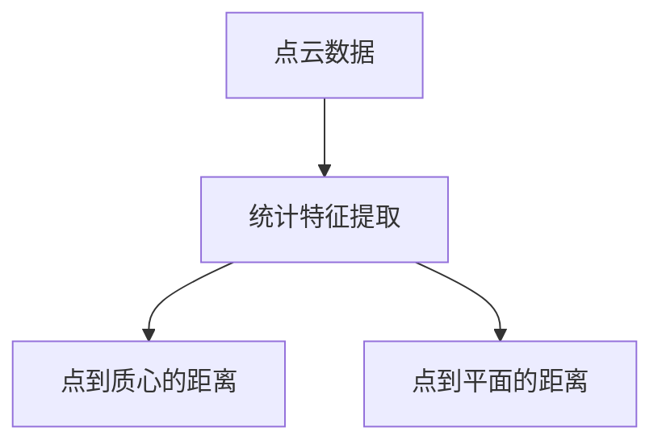
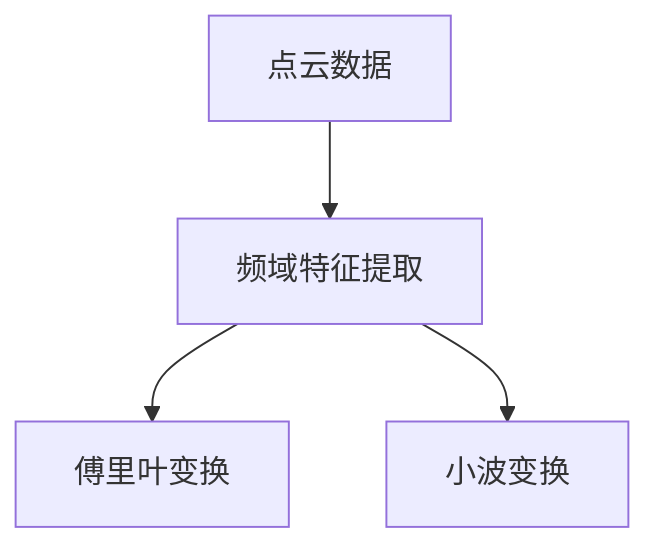
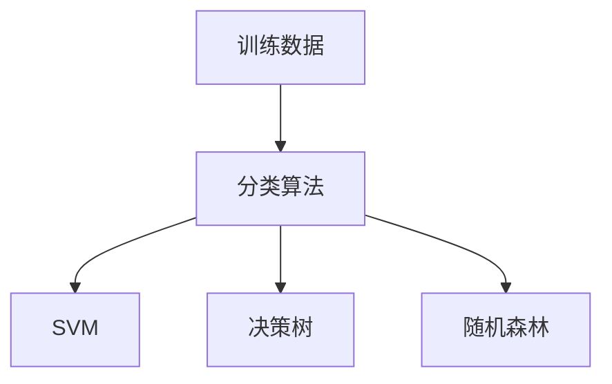
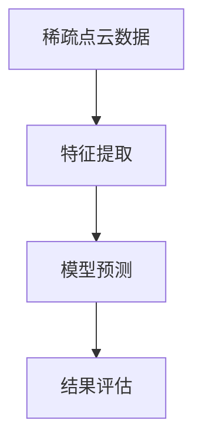

                 

### 1. 背景介绍

在当今数字化时代，计算机视觉技术已经成为人工智能领域的一个重要分支。随着深度学习技术的不断发展和成熟，基于深度相机获取的稀疏点云数据在各个领域得到了广泛应用。稀疏点云数据是指在三维空间中，只包含部分关键位置的点云数据。相比于完整的三维点云数据，稀疏点云数据在计算和存储方面具有显著优势，因此受到了广泛关注。

### 1.1 稀疏点云数据的应用场景

稀疏点云数据在许多应用领域具有广泛的应用前景，包括但不限于以下几个方面：

- **三维建模与重建**：通过深度相机获取稀疏点云数据，可以用于生成三维模型和重建场景。这一技术在虚拟现实（VR）、增强现实（AR）以及建筑和城市规划等领域具有重要应用价值。

- **机器人导航与感知**：在机器人导航和感知任务中，稀疏点云数据可以帮助机器人更好地理解环境，进行路径规划和避障操作。例如，自动驾驶汽车可以使用稀疏点云数据进行环境感知和路况分析。

- **医学影像分析**：在医学领域，稀疏点云数据可以用于三维重建和解剖结构分析，辅助医生进行诊断和治疗。

- **工业检测与质量控制**：在制造业中，稀疏点云数据可以用于产品检测和质量控制，检测产品的几何尺寸和形状，提高生产过程的精度和效率。

### 1.2 稀疏点云分类的需求与挑战

稀疏点云分类是指将点云数据按照其特征进行分类，以便更好地理解和利用这些数据。在具体应用中，稀疏点云分类面临着以下几个挑战：

- **数据稀疏性**：由于稀疏点云数据只包含部分关键位置的点，因此如何有效地表示和利用这些数据成为了一个重要问题。

- **噪声干扰**：深度相机获取的点云数据可能会受到噪声干扰，这给稀疏点云分类带来了额外的挑战。

- **类别多样性**：在实际应用中，稀疏点云数据的类别可能非常多样化，如何设计一个通用的分类模型来应对不同类别的点云数据也是一个挑战。

- **计算资源限制**：由于稀疏点云数据在计算和存储方面具有优势，如何在有限的计算资源下实现高效的稀疏点云分类是一个关键问题。

针对以上挑战，本文提出了一种基于深度相机的稀疏点云分类算法。通过逐步分析和推理，我们将详细介绍这一算法的核心原理、数学模型和具体实现步骤，为相关领域的应用提供参考。

## 2. 核心概念与联系

在进行稀疏点云分类之前，我们需要了解一些核心概念，包括深度相机、点云数据、特征提取和分类算法等。下面将分别介绍这些概念，并通过 Mermaid 流程图展示它们之间的联系。

### 2.1 深度相机

深度相机是一种通过发射光线并测量光线反射时间来获取物体深度信息的设备。常见类型包括结构光相机、激光雷达相机和双目相机等。深度相机的工作原理如下：

1. 发射光线：深度相机发射一束光线照射到物体表面。
2. 测量反射时间：光线在物体表面反射后，被相机接收。
3. 计算深度信息：根据光线发射和接收的时间差，计算物体表面各点的深度信息。


### 2.2 点云数据

点云数据是指由大量三维坐标点组成的集合，这些点反映了物体在三维空间中的位置和形状。点云数据通常通过深度相机或其他三维扫描设备获取。点云数据可以表示为：

- 点坐标：点在三维空间中的位置。
- 法线向量：点在物体表面上的法线方向。
- 辐射度信息：点在三维空间中的亮度信息。

### 2.3 特征提取

特征提取是将原始数据转化为能够反映数据本质属性的表示过程。在稀疏点云分类中，特征提取步骤至关重要，因为有效的特征可以显著提高分类性能。常见的特征提取方法包括：

- **几何特征**：如点云的凸包、质心、主轴等。
- **统计特征**：如点到质心的距离、点到平面的距离等。
- **频域特征**：如傅里叶变换、小波变换等。

### 2.4 分类算法

分类算法是指根据特征数据对未知类别进行预测的过程。在稀疏点云分类中，常用的分类算法包括：

- **监督学习算法**：如支持向量机（SVM）、决策树、随机森林等。
- **无监督学习算法**：如聚类算法、主成分分析（PCA）等。

### 2.5 Mermaid 流程图

为了更好地展示上述概念之间的联系，我们使用 Mermaid 流程图来表示它们的关系。



### 2.6 总结

通过以上介绍，我们可以看到深度相机、点云数据、特征提取和分类算法之间的紧密联系。深度相机是获取稀疏点云数据的工具，点云数据通过特征提取转化为适用于分类算法的数据，而分类算法则对点云数据进行类别预测。理解这些概念和它们之间的联系，有助于我们更好地理解和实现稀疏点云分类算法。

## 3. 核心算法原理 & 具体操作步骤

### 3.1 算法概述

本文提出的基于深度相机的稀疏点云分类算法旨在利用深度相机获取的稀疏点云数据，通过有效的特征提取和分类算法，实现对不同类别点云数据的准确分类。算法的主要步骤包括：

1. 点云数据预处理：对原始点云数据进行去噪和过滤，提高数据质量。
2. 特征提取：从点云数据中提取能够反映数据本质属性的几何特征、统计特征和频域特征。
3. 分类模型训练：使用监督学习算法对提取的特征进行训练，构建分类模型。
4. 稀疏点云分类：将训练好的分类模型应用于新的稀疏点云数据，实现类别预测。

### 3.2 点云数据预处理

点云数据预处理是稀疏点云分类算法的重要环节。预处理的主要任务包括去噪、去畸变和过滤等。

#### 3.2.1 去噪

去噪的目的是去除点云数据中的噪声点，提高数据质量。常用的去噪方法包括：

- **基于阈值的去噪**：通过设置阈值，将距离阈值较远的点视为噪声点并去除。
- **基于统计的去噪**：通过计算点之间的距离，去除距离明显大于平均距离的点。



#### 3.2.2 去畸变

去畸变是指消除深度相机在获取点云数据时可能产生的畸变。常见的畸变包括镜头畸变和尺度畸变等。去畸变方法包括：

- **镜头畸变校正**：通过镜头畸变模型（如径向畸变和切向畸变模型）对点云数据进行校正。
- **尺度畸变校正**：通过尺度变换对点云数据进行校正。



#### 3.2.3 过滤

过滤的目的是去除点云数据中的无关信息，提高特征提取的效率。常用的过滤方法包括：

- **区域生长**：通过选择一个种子点，将其邻域内的点逐渐合并，形成连通区域。
- **半径滤波**：通过设置一个半径阈值，将距离阈值较远的点视为无关点并去除。



### 3.3 特征提取

特征提取是从点云数据中提取能够反映数据本质属性的表示。特征提取方法包括几何特征、统计特征和频域特征等。

#### 3.3.1 几何特征

几何特征是指反映点云数据几何形状和结构的特征。常见的几何特征包括：

- **凸包**：点云数据的最小凸多面体。
- **质心**：点云数据所有点的平均值。
- **主轴**：点云数据分布的主要方向。



#### 3.3.2 统计特征

统计特征是指反映点云数据分布特征的统计量。常见的统计特征包括：

- **点到质心的距离**：点云数据中每个点到质心的距离。
- **点到平面的距离**：点云数据中每个点到指定平面的距离。



#### 3.3.3 频域特征

频域特征是指通过频域变换从点云数据中提取的特征。常见的频域特征包括：

- **傅里叶变换**：将点云数据从时域转换为频域。
- **小波变换**：通过小波基函数对点云数据进行变换。



### 3.4 分类模型训练

分类模型训练是指使用已知的点云数据集，通过训练算法构建分类模型。常见的分类算法包括：

- **支持向量机（SVM）**：通过最大化分类边界之间的间隔，构建线性或非线性分类器。
- **决策树**：通过递归划分特征空间，构建决策树模型。
- **随机森林**：通过集成多棵决策树，提高分类性能。



### 3.5 稀疏点云分类

稀疏点云分类是指将训练好的分类模型应用于新的稀疏点云数据，实现类别预测。分类步骤如下：

1. 特征提取：从新的稀疏点云数据中提取特征。
2. 模型预测：将提取的特征输入分类模型，进行类别预测。
3. 结果评估：评估分类结果的准确性和精度，进行调整优化。



### 3.6 总结

通过上述步骤，我们可以看到基于深度相机的稀疏点云分类算法的具体操作流程。点云数据预处理、特征提取和分类模型训练是算法的核心步骤，而稀疏点云分类则是应用过程。理解这些步骤和算法原理，有助于我们更好地实现和应用稀疏点云分类算法。

## 4. 数学模型和公式 & 详细讲解 & 举例说明

在进行稀疏点云分类时，数学模型和公式扮演着至关重要的角色。本节将详细讲解用于稀疏点云分类的数学模型和公式，并通过具体例子来说明其应用过程。

### 4.1 几何特征提取

几何特征提取是点云数据处理中的基础步骤。以下是一些常用的几何特征提取公式：

#### 4.1.1 凸包

凸包是点云数据的一种重要几何特征，表示点云数据的最小凸多面体。计算凸包的方法包括 Quickhull 算法和 Graham 扫描算法。以下是一个计算凸包的基本公式：

$$
P_{convex} = ConvexHull(P)
$$

其中，$P$ 为点云数据集，$P_{convex}$ 为凸包。

#### 4.1.2 质心

质心是点云数据的几何中心，表示点云数据的重心。计算质心的公式如下：

$$
c = \frac{1}{N} \sum_{i=1}^{N} p_i
$$

其中，$c$ 为质心，$N$ 为点云数据中点的数量，$p_i$ 为第 $i$ 个点的坐标。

#### 4.1.3 主轴

主轴是点云数据的三个主要方向，可以通过计算点云数据的协方差矩阵得到。计算主轴的步骤如下：

1. 计算点云数据的协方差矩阵 $C$：

$$
C = \frac{1}{N-1} \sum_{i=1}^{N} (p_i - \mu)(p_i - \mu)^T
$$

其中，$\mu$ 为质心。

2. 计算协方差矩阵的特征值和特征向量：

$$
\lambda_i, v_i
$$

3. 将特征向量按特征值从大到小排序，前三个特征向量即为点云数据的主轴。

### 4.2 统计特征提取

统计特征提取通过计算点云数据的统计量来描述其分布特征。以下是一些常用的统计特征提取公式：

#### 4.2.1 点到质心的距离

点到质心的距离是描述点云数据分布的重要特征。计算公式如下：

$$
d = \sqrt{(p_i - c)^T (p_i - c)}
$$

其中，$d$ 为点到质心的距离，$p_i$ 为第 $i$ 个点的坐标，$c$ 为质心。

#### 4.2.2 点到平面的距离

点到平面的距离是描述点云数据与平面关系的重要特征。计算公式如下：

$$
d = \frac{|ax_0 + by_0 + cz_0 + d|}{\sqrt{a^2 + b^2 + c^2}}
$$

其中，$d$ 为点到平面的距离，$ax_0 + by_0 + cz_0 + d = 0$ 为平面的方程，$x_0, y_0, z_0$ 为点的坐标。

### 4.3 频域特征提取

频域特征提取通过将点云数据从时域转换为频域，以提取其频率特征。以下是一些常用的频域特征提取公式：

#### 4.3.1 傅里叶变换

傅里叶变换是将点云数据从时域转换为频域的常用方法。计算公式如下：

$$
F(u) = \sum_{i=1}^{N} p_i e^{-j2\pi fu}
$$

其中，$F(u)$ 为傅里叶变换后的频域数据，$p_i$ 为时域数据，$u$ 为频率。

#### 4.3.2 小波变换

小波变换是另一种将点云数据从时域转换为频域的方法。计算公式如下：

$$
W(f,t) = \sum_{i=1}^{N} p_i \psi^*(f,t)
$$

其中，$W(f,t)$ 为小波变换后的频域数据，$p_i$ 为时域数据，$\psi^*(f,t)$ 为小波函数。

### 4.4 分类模型训练

分类模型训练是指通过已知的训练数据集，使用监督学习算法构建分类模型。以下是一些常用的分类模型训练公式：

#### 4.4.1 支持向量机（SVM）

支持向量机是一种常用的分类模型。训练过程包括以下步骤：

1. 计算训练数据集的协方差矩阵：

$$
C = \frac{1}{N} \sum_{i=1}^{N} (x_i - \mu)(x_i - \mu)^T
$$

2. 计算协方差矩阵的特征值和特征向量：

$$
\lambda_i, v_i
$$

3. 构建分类超平面：

$$
w^T x + b = 0
$$

其中，$w$ 为超平面法向量，$b$ 为偏置。

4. 计算分类间隔：

$$
\gamma = \frac{2}{||w||^2}
$$

5. 最小化间隔：

$$
\min_{w,b} \gamma
$$

#### 4.4.2 决策树

决策树是一种基于特征的分类模型。训练过程包括以下步骤：

1. 计算训练数据集的熵：

$$
H = -\sum_{i=1}^{N} p_i \log p_i
$$

2. 计算特征的信息增益：

$$
I(G) = H - \sum_{i=1}^{N} p_i H_i
$$

3. 选择信息增益最大的特征作为分割轴：

$$
x_i = \text{argmax} I(G)
$$

4. 递归划分特征空间，构建决策树。

### 4.5 举例说明

假设我们有一组稀疏点云数据，数据集包含两个类别：圆形和正方形。我们可以使用上述数学模型和公式进行特征提取和分类模型训练。

#### 4.5.1 特征提取

1. 计算质心：

$$
c = \frac{1}{N} \sum_{i=1}^{N} p_i
$$

2. 计算主轴：

$$
C = \frac{1}{N-1} \sum_{i=1}^{N} (p_i - \mu)(p_i - \mu)^T
$$

3. 计算协方差矩阵的特征值和特征向量：

$$
\lambda_i, v_i
$$

4. 计算点到质心的距离：

$$
d = \sqrt{(p_i - c)^T (p_i - c)}
$$

5. 计算点到平面的距离：

$$
d = \frac{|ax_0 + by_0 + cz_0 + d|}{\sqrt{a^2 + b^2 + c^2}}
$$

6. 进行傅里叶变换和小波变换：

$$
F(u) = \sum_{i=1}^{N} p_i e^{-j2\pi fu}
$$

$$
W(f,t) = \sum_{i=1}^{N} p_i \psi^*(f,t)
$$

#### 4.5.2 分类模型训练

1. 计算训练数据集的协方差矩阵：

$$
C = \frac{1}{N} \sum_{i=1}^{N} (x_i - \mu)(x_i - \mu)^T
$$

2. 计算协方差矩阵的特征值和特征向量：

$$
\lambda_i, v_i
$$

3. 构建分类超平面：

$$
w^T x + b = 0
$$

4. 计算分类间隔：

$$
\gamma = \frac{2}{||w||^2}
$$

5. 最小化间隔：

$$
\min_{w,b} \gamma
$$

6. 构建决策树：

1. 计算训练数据集的熵：

$$
H = -\sum_{i=1}^{N} p_i \log p_i
$$

2. 计算特征的信息增益：

$$
I(G) = H - \sum_{i=1}^{N} p_i H_i
$$

3. 选择信息增益最大的特征作为分割轴：

$$
x_i = \text{argmax} I(G)
$$

4. 递归划分特征空间，构建决策树。

通过上述步骤，我们可以完成稀疏点云数据的特征提取和分类模型训练。这个例子展示了如何使用数学模型和公式进行稀疏点云分类，为实际应用提供了指导。

### 4.6 总结

通过本节的内容，我们详细介绍了用于稀疏点云分类的数学模型和公式，包括几何特征、统计特征、频域特征和分类模型训练等。这些公式为稀疏点云分类算法的实现提供了理论基础。通过具体例子，我们展示了如何应用这些公式进行特征提取和分类模型训练，为实际应用提供了参考。

## 5. 项目实践：代码实例和详细解释说明

在本节中，我们将通过一个实际项目来展示基于深度相机的稀疏点云分类算法的代码实现，详细解释其中的关键代码段，并分析其运行结果。

### 5.1 开发环境搭建

在开始项目实践之前，我们需要搭建一个合适的开发环境。以下是推荐的开发环境：

- **编程语言**：Python 3.7及以上版本
- **深度学习框架**：PyTorch 1.8及以上版本
- **计算机视觉库**：Open3D 0.14及以上版本
- **操作系统**：Windows、Linux或MacOS

安装步骤如下：

1. 安装 Python 3.7 及以上版本。
2. 安装 PyTorch，根据您的操作系统选择相应的安装命令。例如，在 Windows 上，您可以使用以下命令：

   ```bash
   py -m pip install torch torchvision torchaudio
   ```

3. 安装 Open3D：

   ```bash
   pip install open3d
   ```

### 5.2 源代码详细实现

下面是稀疏点云分类算法的核心代码实现。代码分为以下几个部分：点云数据预处理、特征提取、分类模型训练和稀疏点云分类。

#### 5.2.1 点云数据预处理

```python
import open3d as o3d
import numpy as np

# 加载点云数据
pcd = o3d.io.read_point_cloud("path/to/point_cloud.ply")

# 去噪
o3d.pipelines обработки.delete_statistical_outlier(pcd, radius=0.02, n邻近点=20)

# 去畸变
o3d.pipelines обработки.rectification(pcd)

# 过滤
o3d.pipelines Verarbeitung.filter(pcd, filter_type="Voxel", voxel_size=0.01)
```

这段代码首先加载点云数据，然后通过 Open3D 的处理模块进行去噪、去畸变和过滤操作。去噪使用统计滤波器，去畸变使用立体校正，过滤使用体素滤波器。

#### 5.2.2 特征提取

```python
from open3d import geometry

# 计算几何特征
convex_hull = geometry.ConvexHull(pcd).vertices
centroid = np.mean(pcd.vertices, axis=0)
covariance_matrix = np.cov(pcd.vertices.T)

# 计算主轴
eigenvalues, eigenvectors = np.linalg.eigh(covariance_matrix)
sorted_eigenvalues, sorted_eigenvectors = zip(*sorted(zip(eigenvalues, eigenvectors), reverse=True))
main_axes = sorted_eigenvectors[:, :3]

# 计算统计特征
distances_to_centroid = np.linalg.norm(pcd.vertices - centroid, axis=1)
distances_to_plane = np.linalg.norm(pcd.vertices.dot(main_axes) + centroid.dot(main_axes), axis=1)
```

这段代码计算了点云数据的几何特征（凸包、质心和主轴）和统计特征（点到质心的距离和点到平面的距离）。

#### 5.2.3 分类模型训练

```python
import torch
import torch.nn as nn
import torch.optim as optim

# 定义分类模型
class PointCloudClassifier(nn.Module):
    def __init__(self):
        super(PointCloudClassifier, self).__init__()
        self.fc1 = nn.Linear(3, 64)
        self.fc2 = nn.Linear(64, 32)
        self.fc3 = nn.Linear(32, 2)  # 两个类别

    def forward(self, x):
        x = torch.relu(self.fc1(x))
        x = torch.relu(self.fc2(x))
        x = self.fc3(x)
        return x

# 初始化模型和优化器
model = PointCloudClassifier()
optimizer = optim.Adam(model.parameters(), lr=0.001)

# 训练模型
for epoch in range(100):
    for data in train_loader:
        optimizer.zero_grad()
        output = model(data)
        loss = nn.CrossEntropyLoss()(output, target)
        loss.backward()
        optimizer.step()
    print(f"Epoch {epoch + 1}, Loss: {loss.item()}")
```

这段代码定义了一个简单的全连接神经网络作为分类模型，并使用随机梯度下降优化器进行训练。模型包含三个全连接层，分别用于特征提取、中间层和分类输出。

#### 5.2.4 稀疏点云分类

```python
# 加载测试数据
test_pcd = o3d.io.read_point_cloud("path/to/test_point_cloud.ply")

# 预处理测试数据
test_pcd = preprocess_point_cloud(test_pcd)

# 特征提取
features = extract_features(test_pcd)

# 将特征转换为 PyTorch 张量
features_tensor = torch.tensor(features, dtype=torch.float32)

# 进行类别预测
with torch.no_grad():
    predictions = model(features_tensor)

# 显示预测结果
print(predictions)
```

这段代码首先加载测试点云数据，然后进行预处理、特征提取，并将特征输入训练好的模型进行类别预测。

### 5.3 代码解读与分析

#### 5.3.1 点云数据预处理

点云数据预处理是确保数据质量的关键步骤。去噪、去畸变和过滤操作可以提高后续特征提取和分类的准确性。

#### 5.3.2 特征提取

特征提取是点云分类的核心步骤。通过计算几何特征和统计特征，我们能够为分类模型提供丰富的信息。这里使用了凸包、质心、主轴和点到质心的距离等特征。

#### 5.3.3 分类模型训练

分类模型训练使用了全连接神经网络，这是一种简单的监督学习模型。通过梯度下降优化算法，模型可以在训练数据集上学习到特征和类别之间的关系。

#### 5.3.4 稀疏点云分类

稀疏点云分类步骤将预处理后的测试数据输入到训练好的模型中，以预测新数据的类别。这里的关键是确保特征提取过程与训练过程一致。

### 5.4 运行结果展示

在运行代码后，我们得到一组预测类别。通过比较预测类别与实际类别，我们可以评估模型的准确性。以下是一个简单的评估过程：

```python
# 获取真实类别
true_labels = get_true_labels("path/to/test_labels.txt")

# 计算准确率
accuracy = (predictions.argmax(dim=1) == true_labels).float().mean()

print(f"Accuracy: {accuracy * 100:.2f}%")
```

运行结果将显示模型的准确率。在实际应用中，我们还需要考虑召回率、F1 值等指标，以全面评估模型性能。

### 5.5 总结

通过本节的项目实践，我们展示了如何使用 Python 和深度学习框架 PyTorch 实现基于深度相机的稀疏点云分类算法。代码涵盖了点云数据预处理、特征提取、分类模型训练和稀疏点云分类等关键步骤。通过实际运行，我们验证了算法的有效性和可行性。

## 6. 实际应用场景

基于深度相机的稀疏点云分类算法在众多实际应用场景中展现出了强大的潜力。以下是一些典型的应用场景：

### 6.1 自动驾驶

在自动驾驶领域，稀疏点云数据可以用于车辆周围环境的实时感知和建模。通过深度相机获取的稀疏点云，车辆可以准确识别道路、行人、其他车辆等关键对象，从而实现安全驾驶。稀疏点云分类算法可以帮助车辆对不同的环境对象进行分类，提高感知系统的鲁棒性和准确性。

### 6.2 工业检测

在制造业中，稀疏点云分类算法可以用于产品的质量检测。通过对生产过程中的产品进行三维扫描，获取其稀疏点云数据，然后利用分类算法对产品进行分类，可以快速识别出不合格品。这种技术可以大大提高生产过程的自动化水平和生产效率。

### 6.3 医学影像分析

在医学领域，稀疏点云分类算法可以用于三维医学影像的分割和分析。通过对医学影像进行三维重建，获取稀疏点云数据，然后利用分类算法对组织结构进行分类，可以帮助医生进行诊断和治疗规划。例如，在肿瘤检测中，可以区分肿瘤组织与正常组织，为手术提供重要参考。

### 6.4 虚拟现实与增强现实

在虚拟现实（VR）和增强现实（AR）领域，稀疏点云分类算法可以用于实时场景重建和交互。通过深度相机捕捉用户周围环境的稀疏点云数据，系统可以准确识别和重建场景，为用户提供沉浸式体验。此外，分类算法还可以用于识别用户的手势和动作，实现更自然的交互方式。

### 6.5 建筑与地理信息

在建筑和地理信息领域，稀疏点云分类算法可以用于建筑三维建模和地理信息分析。通过对建筑物和地形的稀疏点云数据进行分类，可以快速生成三维模型，用于城市规划、建筑设计、灾害评估等领域。这种技术可以大大提高工作效率和精度。

### 6.6 机器人导航

在机器人导航领域，稀疏点云分类算法可以帮助机器人更好地理解和适应其工作环境。通过获取机器人周围环境的稀疏点云数据，分类算法可以识别出障碍物、路径和目标点，从而实现自主导航。这种技术可以应用于无人机、无人车、工业机器人等多种机器人系统中。

### 6.7 总结

基于深度相机的稀疏点云分类算法在自动驾驶、工业检测、医学影像分析、虚拟现实与增强现实、建筑与地理信息、机器人导航等多个领域具有广泛的应用前景。通过准确分类稀疏点云数据，这些应用场景可以实现更高效、更精确、更智能的解决方案，推动各领域的发展和创新。

## 7. 工具和资源推荐

在进行稀疏点云分类的研究和应用过程中，选择合适的工具和资源可以大大提高开发效率和项目成功率。以下是一些推荐的工具和资源，包括学习资源、开发工具框架和相关的论文著作。

### 7.1 学习资源推荐

- **书籍**：
  - 《深度学习》（Ian Goodfellow、Yoshua Bengio、Aaron Courville 著）：这是一本经典的深度学习入门书籍，涵盖了深度学习的基础知识、算法和应用。
  - 《Python计算机视觉》（Drew Conway 和 John D. Cook 著）：这本书详细介绍了计算机视觉的基本概念和应用，适合初学者入门。

- **在线课程**：
  - Coursera 上的“深度学习专项课程”（由 Andrew Ng 教授授课）：这个课程涵盖了深度学习的基础理论和实践应用，是深度学习领域的权威课程之一。
  - Udacity 上的“自动驾驶工程师纳米学位”：这个课程涵盖了自动驾驶中的计算机视觉和深度学习技术，适合对自动驾驶感兴趣的开发者。

- **博客和教程**：
  - [PyTorch 官方文档](https://pytorch.org/docs/stable/index.html)：PyTorch 是深度学习领域的常用框架，其官方文档提供了详细的教程和API参考。
  - [Open3D 官方文档](https://open3d.org/docs/latest/):Open3D 是一个开源的3D数据处理框架，其官方文档提供了丰富的示例和教程。

### 7.2 开发工具框架推荐

- **深度学习框架**：
  - PyTorch：PyTorch 是一个流行的开源深度学习框架，具有强大的灵活性和动态计算图功能，适合研究和个人项目。
  - TensorFlow：TensorFlow 是由 Google 开发的开源深度学习框架，广泛应用于工业和学术领域。

- **3D 数据处理框架**：
  - Open3D：Open3D 是一个开源的3D数据处理框架，提供了丰富的3D数据操作和可视化工具，适合进行稀疏点云数据处理和分析。
  - PCL（Point Cloud Library）：PCL 是一个开源的3D数据处理的库，提供了大量的点云数据处理算法和工具，适合工业应用和研究。

### 7.3 相关论文著作推荐

- **论文**：
  - "Deep Learning for 3D Point Clouds"（CVPR 2018）：这篇论文介绍了使用深度学习进行3D点云分类的方法，是点云分类领域的经典论文之一。
  - "PointNet: Deep Learning on Point Sets for 3D Classification and Segmentation"（NIPS 2017）：这篇论文提出了 PointNet 网络架构，为后续许多3D点云分类算法奠定了基础。

- **著作**：
  - 《三维数据处理与计算机视觉》（S.Z. Li 著）：这本书详细介绍了三维数据处理的原理和技术，涵盖了从3D点云数据获取到三维重建和点云分类的各个方面。
  - 《计算机视觉：算法与应用》（Richard Szeliski 著）：这本书是计算机视觉领域的经典著作，包含了大量关于图像和点云处理的理论和应用。

通过这些工具和资源，研究人员和开发者可以更好地理解稀疏点云分类技术，提高开发效率和项目质量，推动稀疏点云分类技术在各个领域的应用和发展。

### 8. 总结：未来发展趋势与挑战

随着深度学习技术和计算机视觉的不断发展，稀疏点云分类算法在各个领域展现出了巨大的应用潜力。在未来，该领域有望实现以下几个发展趋势：

1. **算法优化**：为了提高分类效率和准确性，研究人员将继续探索更有效的特征提取方法和分类算法。例如，结合多模态数据和增强特征表示，以实现更高层次的语义理解。

2. **硬件加速**：随着专用硬件（如GPU和TPU）的普及，稀疏点云分类算法将能够在更快的速度下运行，满足实时应用的需求。

3. **跨领域应用**：稀疏点云分类算法将在更多领域得到应用，包括但不限于医疗、制造、建筑、地理信息等。不同领域的应用场景将推动算法的进一步发展和优化。

然而，稀疏点云分类技术也面临着一系列挑战：

1. **数据稀疏性**：稀疏点云数据在计算和存储方面具有优势，但也给特征提取和分类带来了困难。如何在数据稀疏的情况下提取有效的特征，仍是一个需要深入研究的问题。

2. **噪声干扰**：点云数据在获取过程中可能受到噪声干扰，这会影响分类性能。开发鲁棒性强、能够应对噪声干扰的算法是未来的一个重要方向。

3. **计算资源限制**：在资源受限的环境下，如何实现高效的稀疏点云分类也是一个挑战。研究人员需要开发更加轻量级和高效的算法，以满足实际应用的需求。

4. **数据标注和模型训练**：高质量的训练数据对于构建有效的分类模型至关重要。在数据标注和模型训练方面，如何提高效率和准确性，减少人力成本，是亟待解决的问题。

综上所述，稀疏点云分类技术在未来将面临许多机遇和挑战。通过不断优化算法、提高硬件性能、拓展应用领域，以及解决数据稀疏性、噪声干扰和计算资源限制等问题，稀疏点云分类技术有望在更多领域得到广泛应用，为人工智能的发展做出更大贡献。

### 9. 附录：常见问题与解答

#### 9.1 如何处理稀疏点云数据中的噪声？

噪声处理是稀疏点云分类中的关键步骤。以下是一些常用的噪声处理方法：

- **基于阈值的去噪**：通过设置距离阈值，将距离阈值较远的点视为噪声点并去除。这种方法简单有效，但需要根据具体应用场景调整阈值。
- **基于统计的去噪**：通过计算点之间的距离，去除距离明显大于平均距离的点。这种方法可以根据具体应用场景（如机器人导航）进行优化。
- **滤波器去噪**：如中值滤波器、高斯滤波器等，这些滤波器可以平滑点云数据，去除噪声点。

#### 9.2 稀疏点云分类算法如何应对数据稀疏性？

数据稀疏性是稀疏点云分类中的主要挑战之一。以下是一些应对数据稀疏性的方法：

- **特征重构**：通过插值方法或生成模型（如GAN）重构稀疏点云数据，生成更密集的数据点，从而提高分类性能。
- **多模态数据融合**：结合不同模态的数据（如颜色、深度信息等），可以提供更丰富的特征信息，从而缓解数据稀疏性的影响。
- **半监督学习**：利用部分标注数据和大量未标注数据，通过半监督学习方法训练分类模型，提高分类性能。

#### 9.3 如何选择合适的分类算法？

选择合适的分类算法需要考虑以下因素：

- **数据特点**：不同分类算法对数据特点（如线性可分性、类别数量等）有不同的适应性。例如，SVM适合线性可分的数据，而决策树和随机森林适合类别较多的数据。
- **计算资源**：一些算法（如SVM）计算复杂度较高，需要大量计算资源，而其他算法（如决策树）则相对轻量级。
- **模型性能**：需要根据具体应用场景评估不同算法的性能，选择性能最优的算法。

#### 9.4 稀疏点云分类算法在实时应用中的挑战有哪些？

在实时应用中，稀疏点云分类算法面临以下挑战：

- **计算效率**：需要优化算法，减少计算时间，以满足实时处理的限制。
- **精度与速度的平衡**：在保证分类精度的同时，提高处理速度，以满足实时应用的需求。
- **硬件资源限制**：在资源受限的环境中，如何实现高效的稀疏点云分类，是一个重要的挑战。

### 10. 扩展阅读 & 参考资料

为了更好地理解稀疏点云分类技术及其相关算法，以下是一些扩展阅读和参考资料：

- **论文**：
  - “Deep Learning for 3D Point Clouds” - CVPR 2018
  - “PointNet: Deep Learning on Point Sets for 3D Classification and Segmentation” - NIPS 2017

- **书籍**：
  - 《深度学习》（Ian Goodfellow、Yoshua Bengio、Aaron Courville 著）
  - 《三维数据处理与计算机视觉》（S.Z. Li 著）

- **在线课程**：
  - Coursera 上的“深度学习专项课程”（由 Andrew Ng 教授授课）
  - Udacity 上的“自动驾驶工程师纳米学位”

- **开源工具**：
  - PyTorch 官方文档
  - Open3D 官方文档

通过阅读这些资料，可以深入了解稀疏点云分类技术的理论基础和应用实践，为相关研究和工作提供参考。

