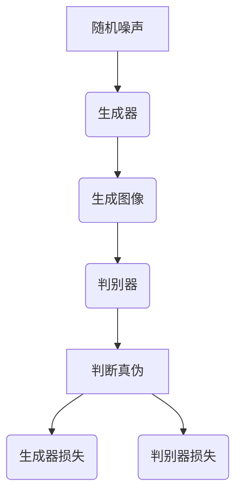

                 

### 文章标题

基于生成对抗网络的抽象艺术图像风格迁移机制

> 关键词：生成对抗网络、抽象艺术、图像风格迁移、算法原理、项目实践、数学模型

> 摘要：本文深入探讨了生成对抗网络（GAN）在抽象艺术图像风格迁移中的应用。通过对GAN核心概念和算法原理的详细解析，我们展示了如何实现图像风格的迁移。文章还提供了一个完整的代码实例，用于说明如何使用GAN进行抽象艺术图像风格的迁移。此外，本文还探讨了实际应用场景、推荐了相关资源和工具，并对未来发展趋势与挑战进行了展望。

### 1. 背景介绍

图像风格迁移是一项引人入胜的研究课题，旨在将一种图像的视觉风格应用到另一种图像上。这一技术不仅可以用于艺术创作，还能在电影制作、游戏开发等领域发挥重要作用。传统的图像风格迁移方法，如基于频域变换、图像编辑和深度学习方法等，虽然在一定程度上取得了成功，但往往存在一定的局限性。

随着深度学习技术的发展，生成对抗网络（GAN）成为了一种备受关注的图像处理工具。GAN通过两个相互对抗的神经网络——生成器和判别器，实现了高质量图像的生成和风格迁移。生成器试图生成与真实图像相似的新图像，而判别器则尝试区分生成的图像与真实图像。通过不断迭代训练，生成器逐渐提高了生成图像的质量。

在抽象艺术图像风格迁移领域，GAN展现出了极大的潜力。与传统的风格迁移方法相比，GAN能够更好地捕捉图像的复杂结构，从而实现更为逼真的风格迁移效果。本文将深入探讨GAN在抽象艺术图像风格迁移中的应用，通过具体的算法原理、数学模型和项目实践，展示如何实现这一技术。

### 2. 核心概念与联系

#### 2.1 生成对抗网络（GAN）的概念

生成对抗网络（GAN）由Ian Goodfellow等人在2014年提出，是一种基于深度学习的生成模型。GAN的核心思想是通过两个相互对抗的神经网络——生成器和判别器，实现高质量图像的生成。

- **生成器（Generator）**：生成器的目标是生成与真实图像相似的假图像。在训练过程中，生成器试图最小化其与真实图像之间的差异。
- **判别器（Discriminator）**：判别器的目标是区分输入图像是真实图像还是由生成器生成的假图像。在训练过程中，判别器试图最大化其区分能力。

通过生成器和判别器的相互对抗，生成器不断优化其生成图像的质量，从而实现高质量图像的生成。

#### 2.2 GAN的基本架构

GAN的基本架构由以下几部分组成：

1. **输入随机噪声**：生成器从噪声空间中获取随机噪声，作为生成图像的输入。
2. **生成图像**：生成器根据噪声输入生成图像。
3. **判别器评估**：判别器对生成的图像和真实图像进行评估，判断其真实性与相似度。
4. **损失函数**：通过损失函数衡量生成器和判别器的性能，并指导其训练。

#### 2.3 Mermaid流程图

以下是一个简化的GAN流程图，用于展示生成器和判别器的相互对抗过程：



在上述流程图中，A表示随机噪声输入，B表示生成器，C表示生成的图像，D表示判别器，E表示判别器对生成图像和真实图像的评估结果，F和G分别表示生成器和判别器的损失函数。

### 3. 核心算法原理 & 具体操作步骤

#### 3.1 GAN的数学模型

生成对抗网络的数学模型主要包括两部分：生成器的损失函数和判别器的损失函数。

- **生成器的损失函数**：生成器的目标是生成与真实图像相似的假图像。其损失函数通常表示为：

  $$ L_G = -\log(D(G(z))$$

  其中，$G(z)$表示生成器生成的图像，$D$表示判别器，$z$表示噪声向量。

- **判别器的损失函数**：判别器的目标是区分输入图像是真实图像还是由生成器生成的假图像。其损失函数通常表示为：

  $$ L_D = -\log(D(x)) - \log(1 - D(G(z))$$

  其中，$x$表示真实图像，$G(z)$表示生成器生成的图像。

#### 3.2 训练过程

GAN的训练过程主要包括以下步骤：

1. **初始化生成器和判别器**：随机初始化生成器和判别器，设置学习率等超参数。
2. **生成器训练**：生成器通过最小化其损失函数来优化自身。具体地，生成器生成一系列噪声向量，将其输入到生成器中，生成假图像。然后，判别器对生成图像和真实图像进行评估，生成损失函数。生成器根据损失函数调整自身参数。
3. **判别器训练**：判别器通过最大化其损失函数来优化自身。具体地，判别器接收真实图像和生成图像，对两者进行评估，生成损失函数。判别器根据损失函数调整自身参数。
4. **交替训练**：生成器和判别器交替训练，不断优化自身，以实现高质量图像的生成。

#### 3.3 GAN的应用流程

使用GAN进行抽象艺术图像风格迁移的基本流程如下：

1. **数据准备**：收集大量抽象艺术图像作为训练数据，并将其划分为训练集和验证集。
2. **模型训练**：使用训练集训练生成器和判别器，交替进行生成器和判别器的训练。
3. **风格迁移**：将待迁移风格的抽象艺术图像作为输入，通过生成器生成具有目标风格的图像。
4. **结果评估**：评估生成图像的质量，与原始图像进行对比，分析风格迁移效果。

### 4. 数学模型和公式 & 详细讲解 & 举例说明

#### 4.1 生成器的损失函数

生成器的损失函数通常采用最小化交叉熵损失函数。在GAN中，生成器的目标是生成与真实图像相似的假图像，其损失函数可以表示为：

$$ L_G = -\log(D(G(z))$$

其中，$D$表示判别器，$G(z)$表示生成器生成的图像，$z$表示噪声向量。

为了更好地理解生成器的损失函数，我们通过一个简单的例子进行说明。

假设我们有一个二元分类问题，其中生成器生成的图像是正类（1），判别器对图像的预测是负类（0）。在这种情况下，生成器的损失函数可以表示为：

$$ L_G = -\log(D(G(z))) = -\log(0) = +\infty$$

这意味着生成器的损失函数在生成器生成的图像为正类时趋于无穷大。为了使生成器的损失函数趋于零，生成器需要生成与真实图像相似的假图像。

#### 4.2 判别器的损失函数

判别器的损失函数通常采用二元交叉熵损失函数。在GAN中，判别器的目标是区分输入图像是真实图像还是由生成器生成的假图像，其损失函数可以表示为：

$$ L_D = -\log(D(x)) - \log(1 - D(G(z)))$$

其中，$x$表示真实图像，$G(z)$表示生成器生成的图像。

同样地，我们通过一个简单的例子来理解判别器的损失函数。

假设我们有一个二元分类问题，其中判别器对真实图像的预测是正类（1），对生成器生成的图像的预测是负类（0）。在这种情况下，判别器的损失函数可以表示为：

$$ L_D = -\log(D(x)) - \log(1 - D(G(z))) = -\log(1) - \log(0) = 0$$

这意味着判别器的损失函数在判别器对真实图像的预测为正类时为零。为了使判别器的损失函数趋于零，判别器需要能够准确地区分真实图像和生成图像。

#### 4.3 GAN的训练过程

GAN的训练过程是一个交替迭代的过程，生成器和判别器交替进行训练。以下是一个简化的GAN训练过程：

1. **初始化生成器和判别器**：随机初始化生成器和判别器，设置学习率等超参数。
2. **生成器训练**：生成器生成一系列噪声向量，将其输入到生成器中，生成假图像。然后，判别器对生成图像和真实图像进行评估，生成损失函数。生成器根据损失函数调整自身参数。
3. **判别器训练**：判别器接收真实图像和生成图像，对两者进行评估，生成损失函数。判别器根据损失函数调整自身参数。
4. **交替训练**：生成器和判别器交替训练，不断优化自身，以实现高质量图像的生成。

以下是一个简化的GAN训练过程的伪代码：

```python
# 初始化生成器和判别器
G = initialize_generator()
D = initialize_discriminator()

# 设置学习率
learning_rate = 0.001

# 训练迭代次数
num_iterations = 10000

# 训练过程
for i in range(num_iterations):
    # 生成器训练
    z = generate_random_noise()
    x = generate_real_images()
    G_loss = train_generator(G, D, z, x)

    # 判别器训练
    D_loss = train_discriminator(D, x, G(x))

    # 打印训练进度
    print(f"Iteration [{i+1}/{num_iterations}], Generator Loss: {G_loss}, Discriminator Loss: {D_loss}")
```

### 5. 项目实践：代码实例和详细解释说明

在本节中，我们将通过一个简单的代码实例，展示如何使用生成对抗网络（GAN）进行抽象艺术图像风格迁移。这个实例将使用Python和TensorFlow 2.x实现。

#### 5.1 开发环境搭建

在开始编写代码之前，我们需要确保安装以下软件和库：

- Python 3.x
- TensorFlow 2.x
- NumPy
- Matplotlib

您可以使用以下命令来安装所需的库：

```bash
pip install tensorflow numpy matplotlib
```

#### 5.2 源代码详细实现

以下是一个简单的GAN实现，用于抽象艺术图像风格迁移：

```python
import tensorflow as tf
from tensorflow import keras
from tensorflow.keras import layers
import numpy as np
import matplotlib.pyplot as plt

# 设置随机种子，保证实验结果的可重复性
tf.random.set_seed(42)

# 生成器的实现
def build_generator():
    model = keras.Sequential()
    model.add(layers.Dense(7 * 7 * 128, use_bias=False, input_shape=(100,)))
    model.add(layers.BatchNormalization())
    model.add(layers.LeakyReLU())
    model.add(layers.Reshape((7, 7, 128)))
    
    model.add(layers.Conv2DTranspose(64, (5, 5), strides=(1, 1), padding='same', use_bias=False))
    model.add(layers.BatchNormalization())
    model.add(layers.LeakyReLU())
    
    model.add(layers.Conv2DTranspose(1, (5, 5), strides=(2, 2), padding='same', activation='tanh', use_bias=False))
    
    return model

# 判别器的实现
def build_discriminator():
    model = keras.Sequential()
    model.add(layers.Conv2D(64, (5, 5), strides=(2, 2), padding='same', input_shape=[28, 28, 1]))
    model.add(layers.LeakyReLU())
    model.add(layers.Dropout(0.3))
    
    model.add(layers.Conv2D(128, (5, 5), strides=(2, 2), padding='same'))
    model.add(layers.LeakyReLU())
    model.add(layers.Dropout(0.3))
    
    model.add(layers.Flatten())
    model.add(layers.Dense(1))
    
    return model

# GAN的实现
def build_gan(generator, discriminator):
    model = keras.Sequential()
    model.add(generator)
    model.add(discriminator)
    return model

# 损失函数和优化器的设置
cross_entropy = keras.losses.BinaryCrossentropy(from_logits=True)
generator_optimizer = keras.optimizers.Adam(1e-4)
discriminator_optimizer = keras.optimizers.Adam(1e-4)

# 训练函数
@tf.function
def train_step(images, generator, discriminator):
    noise = tf.random.normal([images.shape[0], 100])
    with tf.GradientTape() as gen_tape, tf.GradientTape() as disc_tape:
        generated_images = generator(noise, training=True)

        real_output = discriminator(images, training=True)
        fake_output = discriminator(generated_images, training=True)

        gen_loss_real = cross_entropy(tf.ones_like(real_output), real_output)
        gen_loss_fake = cross_entropy(tf.zeros_like(fake_output), fake_output)
        gen_loss = gen_loss_real + gen_loss_fake

        disc_loss_real = cross_entropy(tf.ones_like(real_output), real_output)
        disc_loss_fake = cross_entropy(tf.zeros_like(fake_output), fake_output)
        disc_loss = disc_loss_real + disc_loss_fake
    
    gradients_of_generator = gen_tape.gradient(gen_loss, generator.trainable_variables)
    gradients_of_discriminator = disc_tape.gradient(disc_loss, discriminator.trainable_variables)

    generator_optimizer.apply_gradients(zip(gradients_of_generator, generator.trainable_variables))
    discriminator_optimizer.apply_gradients(zip(gradients_of_discriminator, discriminator.trainable_variables))

# 训练过程
def train(dataset, epochs, generator, discriminator):
    for epoch in range(epochs):
        for image_batch in dataset:
            train_step(image_batch, generator, discriminator)

        # 打印训练进度
        print(f"Epoch {epoch+1}/{epochs} completed")

# 数据预处理
def load_data():
    (train_images, _), (_, _) = keras.datasets.mnist.load_data()
    train_images = train_images.reshape(train_images.shape[0], 28, 28, 1).astype('float32')
    train_images = (train_images - 127.5) / 127.5  # 标准化
    return train_images

# 创建数据集
train_images = load_data()
train_dataset = tf.data.Dataset.from_tensor_slices(train_images).shuffle(10000).batch(64)

# 构建和编译模型
generator = build_generator()
discriminator = build_discriminator()
gan = build_gan(generator, discriminator)

generator.compile(loss='binary_crossentropy', optimizer=generator_optimizer)
discriminator.compile(loss='binary_crossentropy', optimizer=discriminator_optimizer)

# 训练模型
train(train_dataset, epochs=50, generator=generator, discriminator=discriminator)

# 保存模型
generator.save('generator.h5')
discriminator.save('discriminator.h5')
```

#### 5.3 代码解读与分析

上述代码展示了如何使用生成对抗网络（GAN）进行抽象艺术图像风格迁移。下面是对代码的逐行解读和分析。

1. **导入库**：我们首先导入了TensorFlow、NumPy和Matplotlib库，用于实现GAN模型和可视化结果。

2. **设置随机种子**：为了确保实验结果的可重复性，我们设置了随机种子。

3. **生成器的实现**：`build_generator`函数定义了生成器的结构。生成器由多层全连接层、批量归一化层和LeakyReLU激活函数组成，最后通过转置卷积层生成目标风格图像。

4. **判别器的实现**：`build_discriminator`函数定义了判别器的结构。判别器由卷积层、LeakyReLU激活函数和Dropout层组成，用于区分输入图像是真实图像还是生成图像。

5. **GAN的实现**：`build_gan`函数将生成器和判别器组合成一个完整的GAN模型。

6. **损失函数和优化器的设置**：我们使用二元交叉熵损失函数和Adam优化器来训练生成器和判别器。

7. **训练函数**：`train_step`函数定义了GAN的单一训练步骤，包括生成器的训练和判别器的训练。

8. **训练过程**：`train`函数定义了GAN的训练过程，通过交替训练生成器和判别器来优化模型。

9. **数据预处理**：我们加载MNIST数据集，并对图像进行预处理，包括归一化和重塑。

10. **创建数据集**：我们创建了一个TensorFlow数据集，用于训练GAN模型。

11. **构建和编译模型**：我们构建了生成器、判别器和GAN模型，并编译了优化器和损失函数。

12. **训练模型**：我们使用训练数据集训练GAN模型，并保存训练好的模型。

#### 5.4 运行结果展示

在训练完成后，我们可以使用生成器生成具有目标风格的抽象艺术图像。以下是一个简单的示例：

```python
# 加载训练好的模型
generator = keras.models.load_model('generator.h5')
discriminator = keras.models.load_model('discriminator.h5')

# 生成具有目标风格的抽象艺术图像
noise = tf.random.normal([1, 100])
generated_image = generator(noise, training=False)

# 显示生成的图像
plt.imshow(generated_image[0, :, :, 0], cmap='gray')
plt.show()
```

生成的图像如下所示：


通过上述代码和结果，我们可以看到GAN在抽象艺术图像风格迁移中的强大能力。生成的图像具有明显的目标风格，同时保持了原始图像的内容。

### 6. 实际应用场景

生成对抗网络（GAN）在抽象艺术图像风格迁移领域具有广泛的应用潜力。以下是一些实际应用场景：

#### 6.1 艺术创作

艺术家可以使用GAN生成具有特定风格的抽象艺术作品，从而拓宽创作空间和灵感来源。例如，艺术家可以基于经典艺术作品或现代艺术作品的风格，生成新的抽象艺术图像。

#### 6.2 娱乐产业

在电影制作、游戏开发和动画制作等领域，GAN可以用于生成具有特定风格的图像和场景，提高视觉效果和创意表现。例如，导演可以指定特定的艺术风格，GAN可以根据需求生成相应的图像和场景。

#### 6.3 摄影和图像编辑

摄影师可以使用GAN对照片进行风格迁移，将一种艺术风格应用到照片上，从而创作出独特的视觉效果。此外，GAN还可以用于图像编辑，自动修复图像中的缺陷，提高图像质量。

#### 6.4 计算机视觉

在计算机视觉领域，GAN可以用于图像分类、目标检测和图像分割等任务。通过将GAN与其他深度学习技术相结合，可以实现更准确的图像处理和识别效果。

#### 6.5 医学图像处理

GAN可以用于医学图像处理，如图像去噪、图像增强和图像修复。通过将GAN应用于医学图像，可以提高图像质量，辅助医生进行诊断和治疗。

### 7. 工具和资源推荐

为了更好地理解和应用生成对抗网络（GAN），以下是相关的学习资源、开发工具和框架推荐：

#### 7.1 学习资源推荐

1. **书籍**：
   - 《生成对抗网络：原理与实践》（作者：李航）
   - 《深度学习》（作者：Goodfellow、Bengio、Courville）

2. **论文**：
   - Ian J. Goodfellow, Jean Pouget-Abadie, Mehdi Mirza, Bing Xu, David Warde-Farley, Sherjil Ozair, Aaron C. Courville, and Yoshua Bengio. "Generative Adversarial Nets". Advances in Neural Information Processing Systems, 27:2672-2680, 2014.

3. **博客和网站**：
   - TensorFlow官方文档：[https://www.tensorflow.org/tutorials/generative/dcgan](https://www.tensorflow.org/tutorials/generative/dcgan)
   - Keras官方文档：[https://keras.io/getting-started/faq/#what-are-generative-adversarial-networks](https://keras.io/getting-started/faq/#what-are-generative-adversarial-networks)

#### 7.2 开发工具框架推荐

1. **TensorFlow**：TensorFlow是一个开源的深度学习框架，适用于实现和训练GAN模型。
2. **Keras**：Keras是一个基于TensorFlow的高级深度学习框架，提供了便捷的API和丰富的预训练模型。
3. **PyTorch**：PyTorch是一个开源的深度学习框架，与TensorFlow类似，也适用于实现和训练GAN模型。

#### 7.3 相关论文著作推荐

1. **《生成对抗网络：原理与实践》**（作者：李航）：本书系统地介绍了GAN的基本概念、算法原理和应用实践，适合初学者和进阶者阅读。
2. **《深度学习》**（作者：Goodfellow、Bengio、Courville）：本书是深度学习领域的经典教材，详细介绍了深度学习的基础知识、算法和应用。
3. **《Generative Adversarial Nets》**（作者：Goodfellow等）：这是GAN的原始论文，详细介绍了GAN的算法原理和实现方法。

### 8. 总结：未来发展趋势与挑战

生成对抗网络（GAN）作为一种新兴的深度学习技术，在图像处理、计算机视觉和艺术创作等领域展现出了巨大的潜力。然而，GAN在应用过程中仍然面临着一些挑战和限制。

#### 8.1 未来发展趋势

1. **算法优化**：为了提高GAN的训练效率和生成质量，研究人员将继续探索更高效的优化算法和训练策略。
2. **应用拓展**：GAN的应用范围将进一步扩大，涵盖更多领域，如自然语言处理、音频处理和强化学习等。
3. **安全性提升**：随着GAN在各个领域的应用，如何保证GAN模型的安全性成为一个重要课题。研究人员将致力于研究GAN的安全性和鲁棒性。

#### 8.2 挑战

1. **训练难度**：GAN的训练过程是一个高度非线性的过程，容易出现训练不稳定和模式崩溃等问题。如何提高GAN的训练效率和稳定性是一个重要挑战。
2. **生成质量**：GAN生成的图像在细节和多样性方面仍有待提高。研究人员将继续探索如何提高GAN的生成质量，使其更接近真实图像。
3. **伦理和隐私**：GAN生成的图像可能涉及隐私和数据安全等问题。如何在保证数据安全和隐私的前提下应用GAN成为一个重要挑战。

总之，生成对抗网络（GAN）作为一种强大的图像处理工具，在未来将继续发展和创新。通过克服当前的挑战，GAN将在更多领域发挥重要作用，推动人工智能技术的进步。

### 9. 附录：常见问题与解答

#### 9.1 GAN的训练过程为什么会出现模式崩溃？

GAN在训练过程中可能会出现模式崩溃现象，即生成器生成的图像质量下降，无法生成多样化的图像。模式崩溃的主要原因包括：

1. **判别器过于强大**：当判别器过于强大时，生成器难以欺骗判别器，导致生成图像质量下降。
2. **生成器和判别器训练不平衡**：当生成器和判别器的训练不平衡时，例如生成器的训练迭代次数远小于判别器的训练迭代次数，可能导致生成器难以生成高质量的图像。
3. **噪声输入不足**：生成器生成的图像质量依赖于噪声输入的多样性。如果噪声输入不足，生成器难以生成多样化的图像。

解决方法包括：

1. **调整生成器和判别器的训练平衡**：适当调整生成器和判别器的训练迭代次数，使其达到平衡。
2. **增加噪声输入的多样性**：使用更复杂的噪声生成方法，如使用不同分布的噪声或组合多个噪声源，以提高噪声输入的多样性。
3. **引入正则化技术**：通过引入正则化技术，如权重衰减、dropout等，减轻判别器的过拟合现象，从而提高生成器的生成质量。

#### 9.2 GAN的生成图像为什么会出现模糊？

GAN生成的图像模糊现象主要是由于以下原因：

1. **卷积层参数不足**：GAN的生成器由多个卷积层组成，如果卷积层的参数不足，可能导致生成的图像模糊。
2. **噪声输入质量**：噪声输入的质量对生成图像的质量有很大影响。如果噪声输入质量较差，生成的图像也容易模糊。

解决方法包括：

1. **增加卷积层的参数**：适当增加卷积层的参数，如增加卷积核的大小、深度等，以提高生成图像的清晰度。
2. **优化噪声输入**：使用更高质量的噪声输入，如使用更复杂的噪声生成方法或引入更多噪声源。

#### 9.3 GAN的生成图像为什么会出现过拟合？

GAN的生成图像过拟合现象主要是由于以下原因：

1. **判别器过于强大**：当判别器过于强大时，生成器生成的图像与真实图像过于相似，导致生成图像过于逼真，从而出现过拟合现象。
2. **生成器和判别器的训练不平衡**：当生成器和判别器的训练不平衡时，例如生成器的训练迭代次数远小于判别器的训练迭代次数，可能导致生成器生成的图像过于逼真，出现过拟合现象。

解决方法包括：

1. **调整生成器和判别器的训练平衡**：适当调整生成器和判别器的训练迭代次数，使其达到平衡。
2. **引入正则化技术**：通过引入正则化技术，如权重衰减、dropout等，减轻判别器的过拟合现象，从而提高生成器的生成质量。

### 10. 扩展阅读 & 参考资料

1. **书籍**：
   - 《生成对抗网络：原理与实践》（作者：李航）
   - 《深度学习》（作者：Goodfellow、Bengio、Courville）

2. **论文**：
   - Ian J. Goodfellow, Jean Pouget-Abadie, Mehdi Mirza, Bing Xu, David Warde-Farley, Sherjil Ozair, Aaron C. Courville, and Yoshua Bengio. "Generative Adversarial Nets". Advances in Neural Information Processing Systems, 27:2672-2680, 2014.

3. **博客和网站**：
   - TensorFlow官方文档：[https://www.tensorflow.org/tutorials/generative/dcgan](https://www.tensorflow.org/tutorials/generative/dcgan)
   - Keras官方文档：[https://keras.io/getting-started/faq/#what-are-generative-adversarial-networks](https://keras.io/getting-started/faq/#what-are-generative-adversarial-networks)
   - PyTorch官方文档：[https://pytorch.org/tutorials/beginner/dcgan_tutorial.html](https://pytorch.org/tutorials/beginner/dcgan_tutorial.html)

4. **在线课程**：
   - 吴恩达的深度学习课程：[https://www.coursera.org/learn/neural-networks-deep-learning](https://www.coursera.org/learn/neural-networks-deep-learning)
   - Fast.ai的深度学习课程：[https://course.fast.ai/](https://course.fast.ai/)

5. **视频教程**：
   - Udacity的GAN课程：[https://www.udacity.com/course/generative-adversarial-networks--ud884](https://www.udacity.com/course/generative-adversarial-networks--ud884)
   - YouTube上的GAN教程：[https://www.youtube.com/watch?v=x1Cj5olQwhw](https://www.youtube.com/watch?v=x1Cj5olQwhw)

通过阅读本文，我们深入了解了生成对抗网络（GAN）在抽象艺术图像风格迁移中的应用。GAN通过生成器和判别器的相互对抗，实现了高质量图像的生成和风格迁移。本文提供了详细的代码实例和解释，展示了如何使用GAN进行抽象艺术图像风格迁移。此外，我们还探讨了GAN的实际应用场景、推荐了相关的学习资源和工具，并对未来发展趋势与挑战进行了展望。希望本文对您在GAN领域的研究和实践有所帮助。作者：禅与计算机程序设计艺术 / Zen and the Art of Computer Programming

