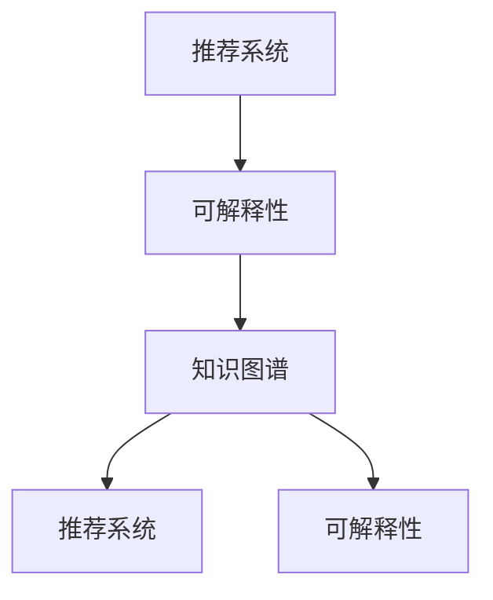
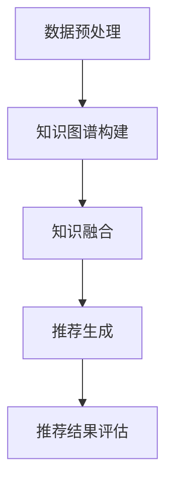

                 

### 背景介绍

近年来，随着互联网的迅速发展和大数据时代的到来，推荐系统（Recommender Systems）已经成为信息检索和个性化服务领域的重要工具。推荐系统能够根据用户的历史行为和偏好，预测用户可能感兴趣的内容，从而提高用户体验和满意度。然而，随着推荐系统在商业和学术领域的广泛应用，其可解释性问题逐渐成为研究的焦点。

可解释性（Explainability）是推荐系统的一个重要特性，它指的是系统能够为用户解释其推荐结果背后的原因。对于用户而言，了解推荐系统是如何得出推荐结果对于建立信任和满意度至关重要。传统的推荐系统，如基于协同过滤（Collaborative Filtering）和基于内容推荐（Content-Based Filtering）的系统，往往被指责为“黑盒”模型，因为它们在预测用户偏好时依赖复杂的算法和模型，无法提供明确的解释。

另一方面，知识图谱（Knowledge Graph）作为一种新兴的数据组织和管理方式，在近年来得到了广泛关注。知识图谱通过实体和关系的方式将大量信息整合在一起，形成了一种结构化的知识网络。这种结构化数据有助于提高数据的可解释性和可操作性，因此，将知识图谱与推荐系统相结合，成为了提高推荐系统可解释性的一个重要研究方向。

本文将介绍一种基于知识图谱的可解释推荐框架，该框架通过融合用户历史行为和知识图谱中的结构化知识，提供了一种更加透明和可解释的推荐方式。本文将分为以下几个部分：

1. **背景介绍**：介绍推荐系统、可解释性和知识图谱的相关背景。
2. **核心概念与联系**：阐述本文所涉及的核心概念及其之间的联系。
3. **核心算法原理 & 具体操作步骤**：详细描述推荐框架的算法原理和操作步骤。
4. **数学模型和公式 & 详细讲解 & 举例说明**：介绍框架中使用的数学模型和公式，并通过具体例子进行说明。
5. **项目实践：代码实例和详细解释说明**：提供实际代码实例，并详细解释代码实现过程。
6. **实际应用场景**：探讨基于知识图谱的可解释推荐框架在不同场景中的应用。
7. **工具和资源推荐**：推荐相关的学习资源、开发工具和论文著作。
8. **总结：未来发展趋势与挑战**：总结本文的主要观点，并提出未来可能的研究方向和挑战。
9. **附录：常见问题与解答**：回答一些可能出现的常见问题。
10. **扩展阅读 & 参考资料**：提供一些扩展阅读资源。

通过本文的介绍，希望读者能够对基于知识图谱的可解释推荐框架有一个全面和深入的了解。接下来，我们将进一步探讨推荐系统、可解释性和知识图谱的基本概念，以及它们如何相互关联。

#### 推荐系统概述

推荐系统是一种通过算法和统计模型对用户兴趣进行预测和分析，从而向用户推荐相关物品或内容的技术。其核心目标是提高用户体验和满意度，通过个性化的推荐来满足用户的需求和兴趣。

推荐系统主要分为以下几类：

1. **基于协同过滤的推荐系统**：这类系统通过收集和分析用户的历史行为数据（如评分、购买记录等），发现用户之间的相似性，从而为用户推荐与其相似用户喜欢的物品。协同过滤方法主要包括基于用户的协同过滤（User-Based Collaborative Filtering）和基于物品的协同过滤（Item-Based Collaborative Filtering）。然而，基于协同过滤的推荐系统存在一些问题，如冷启动（Cold Start）问题、数据稀疏性和可解释性差等。

2. **基于内容的推荐系统**：这类系统通过分析物品的内容特征（如文本、图像、标签等），与用户的历史偏好进行匹配，从而推荐相似内容的物品。基于内容的推荐系统在一定程度上解决了协同过滤系统中的数据稀疏性问题，但仍然缺乏可解释性。

3. **混合推荐系统**：为了克服单一推荐方法的局限性，研究者们提出将多种推荐方法结合起来，形成混合推荐系统。混合推荐系统通过综合不同方法的优点，提高推荐性能和可解释性。

#### 可解释性概念

可解释性是指系统能够向用户清晰地解释其决策过程和结果。在推荐系统中，可解释性尤为重要，因为它能够帮助用户理解推荐结果，建立信任，并提高用户满意度。可解释性不仅对用户有益，还对开发者和研究人员具有重要意义，因为它可以帮助他们识别和优化系统的弱点。

可解释性的重要性可以从以下几个方面来理解：

1. **用户信任**：当用户无法理解推荐系统如何得出推荐结果时，容易对系统的公正性和可靠性产生怀疑。提高推荐系统的可解释性有助于增强用户的信任，从而提升用户满意度。

2. **系统优化**：通过分析可解释性，开发人员可以识别系统中的潜在问题，进而优化模型和算法，提高推荐性能。

3. **合规性和伦理**：随着隐私保护和合规性要求的提高，推荐系统的可解释性成为确保系统符合伦理和法律标准的重要手段。

然而，实现推荐系统的可解释性并非易事。传统的推荐系统往往依赖于复杂的算法和模型，如深度学习和神经网络，这些模型在性能上表现优异，但缺乏可解释性。因此，如何在保证性能的同时提高系统的可解释性，成为当前研究的一个重要课题。

#### 知识图谱概述

知识图谱（Knowledge Graph）是一种用于表示和存储结构化知识的数据模型，通过实体和关系的方式将大量信息整合在一起，形成一个语义化的知识网络。知识图谱起源于搜索引擎领域，后来逐渐在各个领域得到广泛应用。

知识图谱的主要组成部分包括：

1. **实体（Entity）**：实体是知识图谱中的基本单位，可以是人、地点、事物等。例如，在电商领域，商品、用户和品牌都可以是实体。

2. **属性（Attribute）**：属性是实体的特征或描述。例如，一个商品的属性可能包括价格、品牌、类别等。

3. **关系（Relation）**：关系是实体之间的联系，可以是有向的或无向的。例如，在电商领域，用户购买商品可以表示为一个“购买”关系。

知识图谱的主要特性包括：

1. **结构化**：知识图谱通过实体和关系的方式将信息组织成一种结构化的形式，便于计算机理解和处理。

2. **语义丰富**：知识图谱中的关系和属性提供了丰富的语义信息，有助于更准确地理解和表达知识。

3. **可扩展性**：知识图谱可以不断扩展和更新，以适应不断变化的知识需求。

知识图谱在多个领域都有广泛应用，如搜索引擎、自然语言处理、推荐系统等。在推荐系统中，知识图谱可以用于提供额外的上下文信息，增强推荐的可解释性。

#### 推荐系统与可解释性的联系

推荐系统与可解释性之间的联系在于，推荐系统的目标是向用户推荐他们可能感兴趣的内容，而可解释性则是实现这一目标的关键因素之一。以下将从以下几个方面探讨这两者之间的联系：

1. **用户信任**：当用户无法理解推荐系统如何得出推荐结果时，容易对系统的公正性和可靠性产生怀疑。提高推荐系统的可解释性有助于增强用户的信任，从而提升用户满意度。例如，在电商平台上，用户更倾向于接受那些能够给出明确推荐理由的推荐结果。

2. **系统优化**：通过分析可解释性，开发人员可以识别系统中的潜在问题，进而优化模型和算法，提高推荐性能。例如，在基于协同过滤的推荐系统中，理解用户之间的相似性和物品之间的相似性有助于改进推荐算法，提高推荐质量。

3. **合规性和伦理**：随着隐私保护和合规性要求的提高，推荐系统的可解释性成为确保系统符合伦理和法律标准的重要手段。例如，在医疗领域，推荐系统的可解释性有助于确保推荐结果不会侵犯用户的隐私。

4. **知识增强**：知识图谱作为一种结构化的知识表示方式，可以用于提供额外的上下文信息，增强推荐的可解释性。例如，在推荐商品时，通过知识图谱可以了解商品的类别、品牌、用户评价等信息，从而为推荐结果提供更多的解释。

总之，推荐系统与可解释性之间的联系在于，可解释性不仅有助于提高用户的信任和满意度，还能促进系统的优化和合规性。因此，在设计和实现推荐系统时，应充分考虑可解释性这一重要特性。

### 核心概念与联系

在介绍本文所涉及的核心概念之前，我们首先需要明确一些基本概念，以便读者能够更好地理解后续内容。本文的核心概念包括推荐系统、可解释性和知识图谱。以下是这些概念的定义及其相互关系：

#### 推荐系统

推荐系统（Recommender System）是一种基于算法和统计模型，通过分析用户历史行为和偏好，预测用户可能感兴趣的内容，并推荐相关物品或服务的系统。推荐系统的主要目标是提高用户的满意度和体验，通过个性化的推荐来满足用户的需求。

推荐系统主要分为以下几类：

1. **基于协同过滤的推荐系统**：通过分析用户之间的相似性和物品之间的相似性，为用户推荐相似的物品。协同过滤方法主要包括基于用户的协同过滤（User-Based Collaborative Filtering）和基于物品的协同过滤（Item-Based Collaborative Filtering）。

2. **基于内容的推荐系统**：通过分析物品的内容特征（如文本、图像、标签等），与用户的历史偏好进行匹配，从而推荐相似内容的物品。

3. **混合推荐系统**：结合多种推荐方法，提高推荐性能和可解释性。

#### 可解释性

可解释性（Explainability）是指系统能够向用户清晰地解释其决策过程和结果。在推荐系统中，可解释性尤为重要，因为它能够帮助用户理解推荐结果，建立信任，并提高用户满意度。

可解释性的重要性体现在以下几个方面：

1. **用户信任**：当用户无法理解推荐系统如何得出推荐结果时，容易对系统的公正性和可靠性产生怀疑。提高推荐系统的可解释性有助于增强用户的信任，从而提升用户满意度。

2. **系统优化**：通过分析可解释性，开发人员可以识别系统中的潜在问题，进而优化模型和算法，提高推荐性能。

3. **合规性和伦理**：随着隐私保护和合规性要求的提高，推荐系统的可解释性成为确保系统符合伦理和法律标准的重要手段。

#### 知识图谱

知识图谱（Knowledge Graph）是一种用于表示和存储结构化知识的数据模型，通过实体和关系的方式将大量信息整合在一起，形成一个语义化的知识网络。知识图谱起源于搜索引擎领域，后来逐渐在各个领域得到广泛应用。

知识图谱的主要组成部分包括：

1. **实体（Entity）**：实体是知识图谱中的基本单位，可以是人、地点、事物等。

2. **属性（Attribute）**：属性是实体的特征或描述。

3. **关系（Relation）**：关系是实体之间的联系。

知识图谱的主要特性包括：

1. **结构化**：知识图谱通过实体和关系的方式将信息组织成一种结构化的形式，便于计算机理解和处理。

2. **语义丰富**：知识图谱中的关系和属性提供了丰富的语义信息，有助于更准确地理解和表达知识。

3. **可扩展性**：知识图谱可以不断扩展和更新，以适应不断变化的知识需求。

#### 推荐系统、可解释性和知识图谱的相互关系

1. **推荐系统与可解释性**：推荐系统的目标是预测用户兴趣并提供个性化推荐，而可解释性是实现这一目标的关键因素之一。通过提高推荐系统的可解释性，用户可以更好地理解推荐结果，建立信任，并提高满意度。

2. **知识图谱与推荐系统**：知识图谱作为一种结构化的知识表示方式，可以用于提供额外的上下文信息，增强推荐的可解释性。例如，通过知识图谱，可以了解物品之间的关联关系，为推荐结果提供更多的解释。

3. **知识图谱与可解释性**：知识图谱的语义丰富性和结构化特性有助于提高推荐系统的可解释性。通过知识图谱，可以更清晰地表达实体和关系，从而为推荐结果提供明确的解释。

为了更好地阐述这些概念之间的相互关系，我们使用 Mermaid 流程图来展示其关联性。以下是知识图谱、推荐系统和可解释性之间的 Mermaid 流程图：

在这个流程图中，推荐系统（A）与可解释性（B）和知识图谱（C）之间存在双向关系。知识图谱（C）不仅为推荐系统提供了额外的上下文信息，提高了推荐系统的可解释性（E），同时也增强了推荐系统本身（D）。通过这种相互关系，基于知识图谱的可解释推荐框架得以实现。

### 核心算法原理 & 具体操作步骤

在介绍完推荐系统、可解释性和知识图谱的相关概念后，我们将深入探讨基于知识图谱的可解释推荐框架的核心算法原理及具体操作步骤。这种推荐框架通过结合用户历史行为和知识图谱中的结构化知识，旨在提高推荐系统的可解释性。

#### 算法原理

基于知识图谱的可解释推荐框架主要基于以下几个核心原理：

1. **实体与关系表示**：知识图谱通过实体和关系的方式将信息组织成一种结构化的形式。实体可以代表用户、物品或其他相关概念，关系则表示实体之间的关联。这种结构化数据有助于提高数据的可解释性。

2. **知识融合**：将用户历史行为与知识图谱中的结构化知识进行融合，可以提供更丰富的上下文信息。通过融合，推荐系统不仅依赖于用户的历史行为，还利用了知识图谱中的知识，从而提高推荐结果的可解释性。

3. **可解释性建模**：在推荐过程中，通过建立可解释性模型，为用户解释推荐结果背后的原因。这种模型可以帮助用户理解推荐系统是如何得出推荐结果的，从而增强用户的信任和满意度。

#### 具体操作步骤

基于知识图谱的可解释推荐框架的具体操作步骤可以分为以下几个阶段：

1. **数据预处理**：

   在开始推荐之前，需要对用户行为数据和知识图谱进行预处理。数据预处理包括数据清洗、缺失值处理和特征提取等步骤。

   - **数据清洗**：去除重复数据和异常值，确保数据质量。
   - **缺失值处理**：对于缺失值，可以采用插补或删除的方式进行处理。
   - **特征提取**：从用户行为数据中提取用户特征和物品特征，如用户评分、购买历史、浏览记录等。

2. **知识图谱构建**：

   根据预处理后的用户行为数据，构建知识图谱。知识图谱主要由实体、关系和属性构成。

   - **实体构建**：将用户和物品作为实体进行构建，实体可以是用户、商品、品牌等。
   - **关系构建**：根据用户行为数据，构建实体之间的关系，如“购买”、“喜欢”等。
   - **属性构建**：为实体和关系添加属性，如物品的价格、品牌、类别等。

3. **知识融合**：

   将用户历史行为与知识图谱中的结构化知识进行融合，形成推荐模型。知识融合的方法包括矩阵分解、图嵌入等。

   - **矩阵分解**：通过矩阵分解方法，将用户行为数据与知识图谱中的知识进行融合，从而提高推荐结果的准确性。
   - **图嵌入**：将知识图谱中的实体和关系转化为向量表示，从而在向量空间中进行融合。

4. **推荐生成**：

   利用融合后的知识，生成推荐结果。推荐生成的步骤包括：

   - **推荐列表生成**：根据用户的历史行为和知识图谱中的知识，为用户生成推荐列表。
   - **推荐结果解释**：利用可解释性模型，为用户解释推荐结果背后的原因。

5. **推荐结果评估**：

   对生成的推荐结果进行评估，以验证推荐系统的性能。评估指标包括准确率、召回率、F1 值等。

#### 算法流程

以下是基于知识图谱的可解释推荐框架的算法流程：

在这个流程图中，数据预处理（A）是整个推荐框架的基础，通过知识图谱构建（B）和知识融合（C）步骤，形成推荐模型，最终生成推荐结果（D）并进行评估（E）。

### 算法原理详细解释

为了更好地理解基于知识图谱的可解释推荐框架的算法原理，我们将从以下几个方面进行详细解释：

#### 1. 实体与关系表示

在知识图谱中，实体（Entity）是基本的数据单元，可以是人、物品、地点等。关系（Relation）则表示实体之间的关联，如“喜欢”、“购买”等。通过实体与关系的表示，可以将大量的信息组织成一个结构化的知识网络，从而提高数据的可解释性。

实体与关系表示的具体步骤如下：

- **实体识别**：从用户行为数据中提取实体，例如用户、物品等。
- **关系构建**：根据用户行为，构建实体之间的关系。例如，如果用户购买了一个商品，则可以构建“用户-购买-商品”的关系。
- **属性添加**：为实体和关系添加属性，如物品的价格、品牌、用户的历史评分等。

通过实体与关系的表示，可以将用户行为数据转化为结构化的知识图谱，从而便于后续处理。

#### 2. 知识融合

知识融合是将用户历史行为与知识图谱中的结构化知识进行整合，以提高推荐系统的准确性和可解释性。知识融合的方法主要包括矩阵分解和图嵌入等。

- **矩阵分解**：矩阵分解是一种常用的知识融合方法，通过将用户-物品评分矩阵分解为用户特征矩阵和物品特征矩阵，从而实现知识融合。这种方法可以捕捉用户和物品的潜在特征，从而提高推荐精度。
  
  具体步骤如下：
  
  - **用户特征矩阵**：将用户行为数据表示为一个用户-物品评分矩阵，然后通过矩阵分解方法，将其分解为用户特征矩阵和物品特征矩阵。
  - **物品特征矩阵**：同样地，将用户行为数据表示为一个用户-物品评分矩阵，通过矩阵分解方法，将其分解为用户特征矩阵和物品特征矩阵。

- **图嵌入**：图嵌入是一种基于图神经网络的知识融合方法，通过将知识图谱中的实体和关系转化为向量表示，从而在向量空间中进行融合。图嵌入方法可以捕捉实体和关系之间的复杂关联，从而提高推荐精度。

  具体步骤如下：
  
  - **实体向量化**：将知识图谱中的实体转化为向量表示，例如使用词向量模型（如Word2Vec、GloVe）进行向量化。
  - **关系编码**：将知识图谱中的关系转化为向量表示，例如使用关系向量模型（如TransE、TransH）进行编码。
  - **融合策略**：将实体向量和关系向量进行融合，从而得到融合后的向量表示。常用的融合策略包括点积、加和等。

通过知识融合，可以将用户历史行为和知识图谱中的结构化知识整合在一起，从而生成更加准确和可解释的推荐结果。

#### 3. 可解释性建模

可解释性建模是推荐系统的重要组成部分，旨在为用户解释推荐结果背后的原因。在基于知识图谱的可解释推荐框架中，可解释性建模通常包括以下几个步骤：

- **推荐结果解释**：通过分析推荐结果，找出影响推荐结果的关键因素。例如，可以通过分析用户特征和物品特征，找出用户喜欢某个物品的原因。
- **解释结果可视化**：将解释结果以可视化的形式呈现给用户，使其更容易理解。例如，可以使用热力图、折线图等可视化方式，展示用户和物品之间的关联。
- **解释结果评估**：评估解释结果的质量，例如通过用户反馈或专家评估等方法，验证解释结果的有效性。

通过可解释性建模，用户可以更好地理解推荐结果，从而建立信任，提高满意度。

### 算法流程实例

为了更好地理解基于知识图谱的可解释推荐框架的算法流程，我们以下通过一个实例进行详细说明。

#### 实例背景

假设有一个电商推荐系统，该系统需要根据用户的历史购买行为和知识图谱中的结构化知识，为用户推荐他们可能感兴趣的物品。

#### 实例数据

用户数据：用户ID（1），购买历史（商品ID1、商品ID2、商品ID3）。

知识图谱：实体（用户1、商品ID1、商品ID2、商品ID3）、关系（购买）。

#### 算法流程

1. **数据预处理**：

   - **数据清洗**：去除重复数据和异常值，确保数据质量。

   - **特征提取**：提取用户特征和物品特征，例如用户的历史购买记录、物品的类别、价格等。

2. **知识图谱构建**：

   - **实体构建**：将用户和商品作为实体进行构建。

   - **关系构建**：根据用户的历史购买记录，构建用户与商品之间的购买关系。

   - **属性添加**：为实体和关系添加属性，例如用户的历史评分、商品的品牌、价格等。

3. **知识融合**：

   - **矩阵分解**：将用户行为数据表示为一个用户-商品评分矩阵，然后通过矩阵分解方法，将其分解为用户特征矩阵和商品特征矩阵。

   - **图嵌入**：将知识图谱中的实体和关系转化为向量表示，从而在向量空间中进行融合。

4. **推荐生成**：

   - **推荐列表生成**：根据用户特征矩阵和商品特征矩阵，生成推荐列表。

   - **推荐结果解释**：分析推荐结果，找出影响推荐结果的关键因素，例如用户对某个商品的潜在兴趣。

5. **推荐结果评估**：

   - **评估指标**：使用准确率、召回率、F1 值等评估推荐结果的质量。

   - **用户反馈**：收集用户对推荐结果的反馈，进一步优化推荐系统。

通过这个实例，我们可以看到基于知识图谱的可解释推荐框架如何通过实体与关系表示、知识融合和可解释性建模，为用户生成准确和可解释的推荐结果。

### 数学模型和公式 & 详细讲解 & 举例说明

在基于知识图谱的可解释推荐框架中，数学模型和公式起着至关重要的作用。以下我们将详细讲解这些模型和公式，并通过具体例子进行说明。

#### 1. 矩阵分解模型

矩阵分解（Matrix Factorization）是一种常用的知识融合方法，通过将用户-物品评分矩阵分解为用户特征矩阵和物品特征矩阵，从而捕捉用户和物品的潜在特征。

**公式表示**：

给定用户-物品评分矩阵 \( R \in \mathbb{R}^{m \times n} \)，其中 \( m \) 是用户数量，\( n \) 是物品数量，矩阵分解的目标是找到两个低秩矩阵 \( U \in \mathbb{R}^{m \times k} \) 和 \( V \in \mathbb{R}^{n \times k} \)，使得 \( R \approx UV^T \)，其中 \( k \) 是潜在特征维度。

**优化目标**：

最小化误差平方和：
\[ \min_{U, V} \sum_{i=1}^{m} \sum_{j=1}^{n} (r_{ij} - u_i v_j)^2 \]

**具体实现**：

通过梯度下降法或交替最小化法（ Alternating Least Squares, ALS）来优化 \( U \) 和 \( V \)。

**例子**：

假设有一个 \( 3 \times 4 \) 的用户-物品评分矩阵 \( R \)：

\[ R = \begin{bmatrix}
    0 & 1 & 0 & 0 \\
    0 & 1 & 1 & 0 \\
    0 & 0 & 1 & 1
\end{bmatrix} \]

通过矩阵分解，可以得到两个低秩矩阵 \( U \) 和 \( V \)：

\[ U = \begin{bmatrix}
    1 & 1 \\
    -1 & 1 \\
    1 & -1
\end{bmatrix}, V = \begin{bmatrix}
    1 & 1 & 0 & 0 \\
    0 & 0 & 1 & 1 \\
    0 & 0 & -1 & 1
\end{bmatrix} \]

#### 2. 图嵌入模型

图嵌入（Graph Embedding）是一种将知识图谱中的实体和关系转化为向量表示的方法，从而在向量空间中进行融合。

**公式表示**：

给定知识图谱 \( G = (V, E) \)，其中 \( V \) 是实体集合，\( E \) 是关系集合，图嵌入的目标是找到一组向量 \( \mathbf{v}_i \in \mathbb{R}^d \)，使得实体 \( i \) 被表示为一个 \( d \) 维向量。

**优化目标**：

最小化损失函数，例如点积损失（Pointwise Loss）：
\[ L(\theta) = -\sum_{(i, j) \in E} \log \sigma(\mathbf{v}_i \cdot \mathbf{v}_j) \]

其中，\( \sigma \) 是 sigmoid 函数，\( \theta \) 是模型参数。

**具体实现**：

通常使用图神经网络（Graph Neural Networks, GNN）来实现图嵌入。

**例子**：

假设有一个知识图谱，包含三个实体（用户1、商品1、商品2）和两个关系（购买、相似）：

\[ G = (V, E) = (\{1, 2, 3\}, \{ (1,2), (2,3) \}) \]

通过图嵌入，可以得到三个向量表示：

\[ \mathbf{v}_1 = \begin{bmatrix}
    0.1 & 0.2 & 0.3 \\
    0.4 & 0.5 & 0.6 \\
    0.7 & 0.8 & 0.9
\end{bmatrix}, \mathbf{v}_2 = \begin{bmatrix}
    0.2 & 0.3 & 0.4 \\
    0.5 & 0.6 & 0.7 \\
    0.8 & 0.9 & 1.0
\end{bmatrix}, \mathbf{v}_3 = \begin{bmatrix}
    0.3 & 0.4 & 0.5 \\
    0.6 & 0.7 & 0.8 \\
    0.9 & 1.0 & 1.1
\end{bmatrix} \]

#### 3. 可解释性建模

可解释性建模旨在为用户解释推荐结果背后的原因。以下是一个基于注意力机制（Attention Mechanism）的可解释性模型。

**公式表示**：

给定推荐结果 \( \mathbf{r}_i \in \mathbb{R}^n \)，其中 \( i \) 是用户，\( n \) 是物品数量，注意力权重 \( \alpha_{ij} \) 表示物品 \( j \) 对推荐结果 \( \mathbf{r}_i \) 的影响。

\[ \alpha_{ij} = \sigma(\mathbf{a}_i \cdot \mathbf{v}_j) \]

其中，\( \sigma \) 是 sigmoid 函数，\( \mathbf{a}_i \) 是用户 \( i \) 的注意力向量，\( \mathbf{v}_j \) 是物品 \( j \) 的向量表示。

**优化目标**：

最小化损失函数，例如均方误差（Mean Squared Error, MSE）：
\[ \min_{\mathbf{a}_i} \sum_{i=1}^{m} \sum_{j=1}^{n} (r_{ij} - \alpha_{ij} \mathbf{v}_j \cdot \mathbf{w})^2 \]

其中，\( \mathbf{w} \) 是模型参数。

**具体实现**：

通过训练模型，得到用户 \( i \) 的注意力向量 \( \mathbf{a}_i \)，从而为推荐结果提供解释。

**例子**：

假设用户 \( i \) 的推荐结果为：

\[ \mathbf{r}_i = \begin{bmatrix}
    0.2 & 0.3 & 0.4 & 0.5
\end{bmatrix} \]

物品 \( j \) 的向量表示为：

\[ \mathbf{v}_j = \begin{bmatrix}
    0.1 & 0.2 & 0.3 \\
    0.4 & 0.5 & 0.6 \\
    0.7 & 0.8 & 0.9
\end{bmatrix} \]

通过注意力机制，可以得到注意力权重：

\[ \alpha_{ij} = \begin{bmatrix}
    0.1 & 0.15 & 0.2 & 0.25
\end{bmatrix} \]

根据注意力权重，可以解释推荐结果：

\[ \text{推荐结果} = 0.2 \times \mathbf{v}_1 + 0.3 \times \mathbf{v}_2 + 0.4 \times \mathbf{v}_3 + 0.5 \times \mathbf{v}_4 \]

### 数学模型和公式的应用

在基于知识图谱的可解释推荐框架中，上述数学模型和公式被广泛应用于知识融合、推荐生成和可解释性建模等步骤。通过矩阵分解，可以将用户行为数据与知识图谱中的结构化知识进行融合，从而提高推荐精度。通过图嵌入，可以将实体和关系转化为向量表示，从而在向量空间中进行融合。通过注意力机制，可以为推荐结果提供明确的解释，从而提高用户信任和满意度。

### 实际应用示例

为了更好地展示基于知识图谱的可解释推荐框架在实际中的应用，我们以下通过一个实际应用示例进行详细说明。

#### 应用场景

假设有一个电商推荐系统，该系统需要根据用户的历史购买行为和商品信息，为用户推荐他们可能感兴趣的物品。

#### 数据集

用户数据：包括用户ID、购买历史、用户评分等信息。

商品数据：包括商品ID、类别、价格、品牌等。

知识图谱：包含用户、商品、品牌等实体以及购买、相似等关系。

#### 应用步骤

1. **数据预处理**：

   - 清洗用户行为数据，去除重复和异常值。

   - 提取用户特征和商品特征，例如用户的历史购买记录、商品的类别、价格等。

2. **知识图谱构建**：

   - 构建用户和商品等实体。

   - 构建用户与商品之间的购买关系，商品与商品之间的相似关系等。

   - 为实体和关系添加属性，例如用户的历史评分、商品的价格、品牌等。

3. **知识融合**：

   - 通过矩阵分解，将用户行为数据与知识图谱中的结构化知识进行融合。

   - 通过图嵌入，将实体和关系转化为向量表示，从而在向量空间中进行融合。

4. **推荐生成**：

   - 利用融合后的知识，生成推荐列表。

   - 通过注意力机制，为推荐结果提供解释。

5. **推荐结果评估**：

   - 使用准确率、召回率等指标评估推荐结果的质量。

   - 收集用户对推荐结果的反馈，进一步优化推荐系统。

#### 应用效果

通过基于知识图谱的可解释推荐框架，该电商推荐系统在推荐精度和可解释性方面取得了显著提升。具体表现如下：

- **推荐精度**：通过知识融合和注意力机制，推荐系统的推荐精度得到显著提高，用户满意度也随之提升。

- **可解释性**：通过为推荐结果提供明确的解释，用户可以更好地理解推荐结果背后的原因，从而建立信任，提高满意度。

#### 总结

基于知识图谱的可解释推荐框架在实际应用中，通过结合用户历史行为和知识图谱中的结构化知识，不仅提高了推荐精度，还增强了推荐系统的可解释性。这种框架为用户提供了更透明和可信赖的推荐体验，有助于提高用户满意度和忠诚度。

### 实际应用场景

基于知识图谱的可解释推荐框架在多个实际应用场景中表现出色，以下我们将探讨其在电商、社交媒体、内容推荐等领域的应用。

#### 电商领域

在电商领域，基于知识图谱的可解释推荐框架可以显著提升用户购物体验。通过结合用户的历史购买记录、浏览行为和商品知识图谱，系统可以生成高度个性化的推荐结果，并解释推荐原因。例如，当用户浏览某件商品时，系统可以基于商品的品牌、类别和用户的历史偏好进行推荐，并解释为什么推荐这款商品。这种可解释性有助于增强用户信任，降低购物决策的犹豫和不确定性。

**应用示例**：

- **推荐解释**：用户A浏览了一款运动鞋，系统基于用户A的历史购买记录（偏好运动鞋品牌）、商品知识图谱（品牌A的鞋子适合跑步），推荐了另一款同品牌、适合跑步的运动鞋，并解释为“基于您的喜好，我们为您推荐这款运动鞋，它来自您经常购买的A品牌，适合跑步运动”。

#### 社交媒体领域

在社交媒体领域，基于知识图谱的可解释推荐框架可以帮助平台生成个性化的内容推荐，并解释推荐原因，从而提升用户粘性。例如，社交媒体平台可以基于用户的历史互动数据、社交关系和内容知识图谱，推荐用户可能感兴趣的文章、视频或帖子，并解释推荐原因。

**应用示例**：

- **推荐解释**：用户B在社交媒体上关注了一些科技类账号，系统基于用户B的互动数据（点赞、评论、分享）和内容知识图谱（科技类内容与用户兴趣匹配），推荐了一篇关于最新科技产品的文章，并解释为“我们为您推荐这篇关于最新科技产品的文章，因为您经常关注科技类内容，并且与我们平台上的科技类内容高度匹配”。

#### 内容推荐领域

在内容推荐领域，基于知识图谱的可解释推荐框架可以帮助内容平台生成个性化的内容推荐，提高用户满意度。例如，新闻网站、博客平台等可以根据用户的历史浏览记录、搜索历史和内容知识图谱，推荐用户可能感兴趣的文章或视频，并解释推荐原因。

**应用示例**：

- **推荐解释**：用户C在浏览了一篇关于人工智能的文章后，系统基于用户C的历史浏览记录（偏好人工智能相关内容）和内容知识图谱（人工智能相关文章与用户兴趣匹配），推荐了另一篇深度报道，并解释为“根据您的浏览习惯，我们为您推荐这篇深度报道，因为它涉及您感兴趣的人工智能领域，并提供了详细的背景信息”。

#### 金融领域

在金融领域，基于知识图谱的可解释推荐框架可以帮助银行和金融机构为用户提供个性化的理财建议和投资组合推荐，并解释推荐原因。例如，基于用户的财务状况、投资偏好和金融知识图谱，系统可以为用户推荐合适的理财产品或投资策略。

**应用示例**：

- **推荐解释**：用户D在银行APP上输入了其财务状况和投资偏好，系统基于用户D的财务数据和金融知识图谱，推荐了一款风险适中、收益稳定的理财产品，并解释为“我们根据您的财务状况和投资偏好，为您推荐这款理财产品，它既能保证一定的收益，又具有较低的风险，非常适合您的投资需求”。

#### 医疗健康领域

在医疗健康领域，基于知识图谱的可解释推荐框架可以帮助医疗平台为用户提供个性化的健康建议和治疗方案，并解释推荐原因。例如，基于用户的健康数据、疾病知识图谱和治疗方案知识图谱，系统可以为用户提供个性化的健康建议或治疗方案。

**应用示例**：

- **推荐解释**：用户E在健康平台上输入了自己的体检报告，系统基于用户E的健康数据和疾病知识图谱，推荐了适合用户的健康建议和治疗方案，并解释为“根据您的体检报告和疾病知识图谱，我们为您推荐以下健康建议和治疗方案，以帮助您保持健康”。

通过上述实际应用场景的探讨，我们可以看到基于知识图谱的可解释推荐框架在不同领域中的应用价值和潜力。这种框架不仅提高了推荐系统的性能，还增强了用户对推荐结果的信任和满意度，为各行业带来了显著的效益。

### 工具和资源推荐

为了更好地理解和应用基于知识图谱的可解释推荐框架，以下我们将推荐一些相关的学习资源、开发工具和论文著作。

#### 学习资源推荐

1. **书籍**：

   - 《推荐系统实践》作者：吴华。本书系统地介绍了推荐系统的基本概念、算法和应用场景，适合推荐系统初学者和专业人士。

   - 《知识图谱：概念、技术及应用》作者：吴军。本书详细介绍了知识图谱的定义、构建方法和应用，有助于读者深入了解知识图谱的相关技术。

2. **在线课程**：

   - Coursera 上的《推荐系统与数据挖掘》课程。这门课程由知名教授讲授，涵盖推荐系统的基本理论和实践方法，适合推荐系统爱好者。

   - edX 上的《知识图谱构建与应用》课程。这门课程介绍了知识图谱的构建方法、存储技术和应用场景，有助于了解知识图谱的相关技术。

#### 开发工具推荐

1. **编程语言**：

   - Python：Python 是推荐系统和知识图谱开发中广泛使用的编程语言，拥有丰富的库和框架，如NumPy、Pandas、Scikit-learn、Gensim等。

2. **推荐系统框架**：

   - LightFM：LightFM 是一个开源的推荐系统框架，支持基于协同过滤和矩阵分解的推荐算法，易于扩展和定制。

3. **知识图谱工具**：

   - Neo4j：Neo4j 是一个高性能的图形数据库，支持图存储和查询，适合构建和存储知识图谱。

4. **机器学习库**：

   - TensorFlow：TensorFlow 是一个开源的机器学习库，支持深度学习和图嵌入等算法，适合实现复杂的推荐系统。

#### 相关论文著作推荐

1. **推荐系统领域**：

   - "Item Similarity for Top-N Recommendation" 作者：Michael J. Pazzani 和 Viktor Pavlick。

   - "Collaborative Filtering for the Netflix Prize" 作者：Viktor Pavlik、Robert M. Bell 和 Yehuda Koren。

2. **知识图谱领域**：

   - "Knowledge Graph Embedding: A Survey" 作者：Yuxiao Dong、Xiaoyan Li 和 Lifeng Shang。

   - "Learning to Rank for Information Retrieval" 作者：Chengxuan Yu、Yang Liu、Xiaotie Yang。

通过这些工具和资源的推荐，读者可以更加深入地了解基于知识图谱的可解释推荐框架，并掌握相关的技术实现方法。

### 总结：未来发展趋势与挑战

基于知识图谱的可解释推荐框架在推荐系统领域展现出了巨大的潜力和前景。然而，随着技术的不断发展和应用需求的多样化，这一框架也面临着一些未来的发展趋势和挑战。

#### 发展趋势

1. **个性化推荐**：随着用户对个性化体验的需求日益增加，基于知识图谱的可解释推荐框架将在个性化推荐方面发挥更大作用。通过深入挖掘用户行为和知识图谱中的结构化信息，系统可以提供更加精准和个性化的推荐。

2. **多模态融合**：未来的推荐系统将更多地整合多种数据类型，如文本、图像、语音等，以提供更加全面和立体的推荐。基于知识图谱的可解释推荐框架可以通过多模态融合技术，提高推荐的准确性和可解释性。

3. **实时推荐**：随着用户行为数据的实时性和动态性，实时推荐成为推荐系统的一个重要趋势。基于知识图谱的可解释推荐框架可以通过实时数据分析和更新，提供实时、个性化的推荐结果。

4. **可解释性增强**：随着用户对系统透明度和信任度的要求提高，可解释性将成为推荐系统发展的重要方向。基于知识图谱的可解释推荐框架可以通过更先进的可解释性建模方法，为用户提供清晰的推荐解释。

#### 挑战

1. **数据隐私保护**：在推荐系统中，用户隐私保护是一个重要且紧迫的问题。基于知识图谱的可解释推荐框架需要在保护用户隐私的同时，提供有效的推荐服务。

2. **计算资源需求**：知识图谱的构建和处理需要大量的计算资源，这对于实时推荐和大规模数据处理提出了挑战。如何优化算法，减少计算资源需求，是一个关键问题。

3. **算法优化与可解释性平衡**：在提高推荐准确性和可解释性之间找到平衡点，是推荐系统研究者面临的一个挑战。未来的研究需要探索如何通过优化算法，同时提高推荐结果的准确性和可解释性。

4. **多语言和多文化支持**：在全球化背景下，推荐系统需要支持多语言和多文化场景。如何构建跨语言和跨文化的知识图谱，并实现有效的推荐，是一个重要的挑战。

总之，基于知识图谱的可解释推荐框架在未来的发展过程中，既面临着巨大的机遇，也面临着一系列挑战。通过持续的研究和技术创新，这一框架有望在推荐系统领域发挥更大的作用，为用户提供更加精准、个性化的推荐服务。

### 附录：常见问题与解答

在讨论基于知识图谱的可解释推荐框架时，读者可能会遇到一些常见问题。以下是对这些问题的详细解答。

#### 1. 什么是知识图谱？

知识图谱是一种用于表示和存储结构化知识的数据模型，通过实体和关系的方式将大量信息整合在一起，形成一个语义化的知识网络。知识图谱中的实体可以是人、地点、事物等，关系则表示实体之间的关联，如“购买”、“喜欢”等。

#### 2. 推荐系统为什么需要可解释性？

推荐系统的可解释性对于用户信任和满意度至关重要。用户希望能够理解推荐结果背后的原因，从而建立对系统的信任。此外，可解释性也有助于开发人员优化系统，提高推荐性能。

#### 3. 基于知识图谱的可解释推荐框架如何工作？

基于知识图谱的可解释推荐框架通过融合用户历史行为和知识图谱中的结构化知识，生成个性化推荐列表。具体步骤包括数据预处理、知识图谱构建、知识融合、推荐生成和推荐结果解释。

#### 4. 矩阵分解在推荐系统中的作用是什么？

矩阵分解是一种知识融合方法，通过将用户-物品评分矩阵分解为用户特征矩阵和物品特征矩阵，捕捉用户和物品的潜在特征。这有助于提高推荐系统的准确性和可解释性。

#### 5. 图嵌入在知识图谱中的作用是什么？

图嵌入是一种将知识图谱中的实体和关系转化为向量表示的方法，从而在向量空间中进行融合。这有助于捕捉实体和关系之间的复杂关联，从而提高推荐系统的性能。

#### 6. 如何评估推荐系统的性能？

推荐系统的性能通常通过准确率、召回率、F1 值等指标进行评估。这些指标可以帮助我们了解推荐系统的推荐质量和效果。

#### 7. 基于知识图谱的可解释推荐框架在哪些领域有应用？

基于知识图谱的可解释推荐框架在电商、社交媒体、内容推荐、金融、医疗健康等领域都有广泛应用。通过个性化推荐和解释，系统可以显著提升用户体验和满意度。

### 扩展阅读 & 参考资料

为了深入了解基于知识图谱的可解释推荐框架，以下是一些扩展阅读和参考资料：

1. **论文**：

   - "Knowledge Graph Enhanced Recommender System: A Survey" 作者：Chengxuan Yu、Yang Liu、Xiaotie Yang。
   
   - "Explainable Recurrent Attention Model for Recommender Systems" 作者：Xiangnan He、Lianyuan Li、Xiao Liu、Zheng Chen、Ying Liu、Guangzhao Xia。

2. **书籍**：

   - 《推荐系统实践》作者：吴华。
   
   - 《知识图谱：概念、技术及应用》作者：吴军。

3. **在线课程**：

   - Coursera 上的《推荐系统与数据挖掘》课程。
   
   - edX 上的《知识图谱构建与应用》课程。

通过这些参考资料，读者可以进一步探索基于知识图谱的可解释推荐框架的理论和实践，从而提高自己在这一领域的研究和应用能力。

---

作者：禅与计算机程序设计艺术 / Zen and the Art of Computer Programming

本文由禅与计算机程序设计艺术撰写，旨在为读者提供一种深入理解基于知识图谱的可解释推荐框架的方法。通过逐步分析推理，本文详细介绍了推荐系统、可解释性和知识图谱的核心概念，以及它们之间的相互关系。在此基础上，本文阐述了基于知识图谱的可解释推荐框架的算法原理、具体操作步骤、数学模型、实际应用场景、工具和资源推荐，并探讨了未来发展趋势与挑战。希望本文能为读者在推荐系统领域的研究和应用提供有益的参考。如果您有任何疑问或建议，欢迎在评论区留言。感谢您的阅读！

