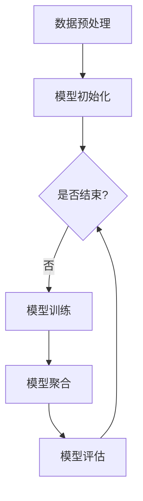

                 

## 1. 背景介绍

随着人工智能技术的不断发展，声纹识别作为生物识别技术的一种，已经在许多领域得到了广泛应用。传统的声纹识别方法主要基于集中式模型训练，即所有数据都集中在一个服务器上进行处理。然而，这种方法存在一些明显的局限性，如数据隐私和安全问题、数据传输带宽限制等。

联邦学习（Federated Learning）作为一种新兴的分布式学习方法，可以有效解决这些问题。联邦学习的基本思想是多个参与方各自在自己的数据集上训练模型，并通过加密的方式将模型参数发送给中心服务器进行聚合，从而实现模型训练。这种方法不仅能够保护数据隐私，还能降低数据传输成本，提高模型训练效率。

声纹识别与联邦学习的结合，为解决隐私保护和数据传输问题提供了一种新的思路。联邦学习的引入，使得声纹识别系统可以更好地应对分布式环境，提高模型的准确性和鲁棒性。本文将介绍基于联邦学习的声纹识别研究，包括其核心概念、算法原理、数学模型以及项目实践等内容。

### 2. 核心概念与联系

#### 2.1 声纹识别

声纹识别是一种基于声音的生物识别技术，通过分析声音的特征参数来识别个体的身份。声纹识别系统主要包括以下几个核心模块：

1. **特征提取**：将声音信号转换为特征向量，常见的特征提取方法有梅尔频率倒谱系数（MFCC）、线性预测编码（LPC）等。

2. **模型训练**：使用训练数据集对模型进行训练，常见的声纹识别模型有支持向量机（SVM）、深度神经网络（DNN）等。

3. **识别与验证**：通过测试数据集评估模型的性能，对未知声音进行识别或验证。

#### 2.2 联邦学习

联邦学习是一种分布式学习方法，其核心思想是通过多个参与方的局部模型参数进行聚合，得到全局模型。联邦学习的关键技术包括：

1. **模型更新**：参与方在自己的数据集上训练局部模型，并对模型进行更新。

2. **模型聚合**：中心服务器接收参与方的模型更新，并对其进行聚合，得到全局模型。

3. **安全性保障**：联邦学习采用加密技术，如差分隐私、联邦加密等，确保参与方的数据隐私和安全。

#### 2.3 基于联邦学习的声纹识别

基于联邦学习的声纹识别系统主要包括以下几个核心模块：

1. **数据预处理**：对采集到的声音数据进行预处理，包括去噪、归一化等。

2. **模型初始化**：初始化全局模型，并分配给各个参与方。

3. **模型训练**：参与方在自己的数据集上训练局部模型，并上传模型更新。

4. **模型聚合**：中心服务器接收参与方的模型更新，并对其进行聚合，得到全局模型。

5. **模型评估**：使用测试数据集评估全局模型的性能。

#### 2.4 Mermaid 流程图

以下是一个基于联邦学习的声纹识别系统的 Mermaid 流程图：



### 3. 核心算法原理 & 具体操作步骤

#### 3.1 算法原理

基于联邦学习的声纹识别算法主要基于以下原理：

1. **分布式训练**：参与方在自己的数据集上训练局部模型，降低数据传输成本。

2. **模型聚合**：通过聚合各个参与方的模型更新，得到全局模型，提高模型性能。

3. **安全性保障**：采用加密技术保护参与方的数据隐私和安全。

#### 3.2 具体操作步骤

基于联邦学习的声纹识别系统的具体操作步骤如下：

1. **数据预处理**：对采集到的声音数据进行预处理，包括去噪、归一化等。

2. **模型初始化**：初始化全局模型，并分配给各个参与方。

3. **模型训练**：
   - **参与方**：在自己的数据集上训练局部模型，并上传模型更新。
   - **中心服务器**：接收参与方的模型更新，并对其进行聚合。

4. **模型聚合**：
   - **聚合策略**：采用加权平均、梯度聚合等策略对模型更新进行聚合。
   - **安全性保障**：采用加密技术，如差分隐私、联邦加密等，保护参与方的数据隐私和安全。

5. **模型评估**：使用测试数据集评估全局模型的性能。

#### 3.3 代码示例

以下是一个简单的基于联邦学习的声纹识别算法的 Python 代码示例：

```python
# 导入所需库
import numpy as np
import tensorflow as tf

# 初始化全局模型
global_model = tf.keras.Sequential([
    tf.keras.layers.Dense(128, activation='relu', input_shape=(input_shape,)),
    tf.keras.layers.Dense(1, activation='sigmoid')
])

# 定义模型更新函数
def model_update(local_model, global_model, local_data, learning_rate):
    with tf.GradientTape() as tape:
        predictions = global_model(local_data, training=True)
        loss = tf.keras.losses.BinaryCrossentropy()(local_data, predictions)
    grads = tape.gradient(loss, global_model.trainable_variables)
    global_model.optimizer.apply_gradients(zip(grads, global_model.trainable_variables))
    return global_model

# 定义模型聚合函数
def model_aggregate(models, weights):
    aggregated_weights = [0] * len(models)
    for i, model in enumerate(models):
        aggregated_weights = [w1 + w2 for w1, w2 in zip(aggregated_weights, model.trainable_variables)]
    return aggregated_weights

# 定义训练函数
def train(models, local_data, global_model, learning_rate, num_iterations):
    for i in range(num_iterations):
        for model, data in zip(models, local_data):
            global_model = model_update(model, global_model, data, learning_rate)
        global_model.trainable_variables = model_aggregate(models, learning_rate)

# 定义评估函数
def evaluate(model, test_data):
    predictions = model(test_data, training=False)
    accuracy = tf.keras.metrics.BinaryAccuracy()
    accuracy.update_state(test_data, predictions)
    return accuracy.result()

# 运行训练和评估
models = [tf.keras.Sequential([tf.keras.layers.Dense(128, activation='relu', input_shape=(input_shape,)), tf.keras.layers.Dense(1, activation='sigmoid')]) for _ in range(num_participants)]
train(models, local_data, global_model, learning_rate, num_iterations)
accuracy = evaluate(global_model, test_data)
print(f"Accuracy: {accuracy}")
```

### 4. 数学模型和公式 & 详细讲解 & 举例说明

#### 4.1 数学模型

基于联邦学习的声纹识别算法涉及到以下数学模型：

1. **损失函数**：常用的损失函数有二元交叉熵（Binary Cross-Entropy）和均方误差（Mean Squared Error）。

2. **优化算法**：常用的优化算法有随机梯度下降（Stochastic Gradient Descent，SGD）和 Adam 算法。

3. **模型更新**：模型更新主要涉及梯度聚合和权重更新。

4. **模型聚合**：模型聚合主要涉及加权平均和梯度聚合。

#### 4.2 公式

以下是基于联邦学习的声纹识别算法的相关公式：

1. **二元交叉熵**：

   $$Loss = -\sum_{i=1}^{N} y_i \log(p_i) + (1 - y_i) \log(1 - p_i)$$

   其中，$y_i$ 表示真实标签，$p_i$ 表示预测概率。

2. **随机梯度下降**：

   $$w_{t+1} = w_t - \alpha \cdot \nabla_w L(w_t)$$

   其中，$w_t$ 表示当前模型权重，$\alpha$ 表示学习率，$\nabla_w L(w_t)$ 表示当前模型的梯度。

3. **Adam 算法**：

   $$m_t = \beta_1 m_{t-1} + (1 - \beta_1) \cdot \nabla_w L(w_t)$$
   $$v_t = \beta_2 v_{t-1} + (1 - \beta_2) \cdot (\nabla_w L(w_t))^2$$
   $$w_{t+1} = w_t - \alpha \cdot \frac{m_t}{\sqrt{v_t} + \epsilon}$$

   其中，$m_t$ 和 $v_t$ 分别为指数加权平均的梯度和平方梯度，$\beta_1$ 和 $\beta_2$ 分别为惯性权重，$\epsilon$ 为常数。

4. **模型更新**：

   $$w_{t+1} = w_t - \alpha \cdot \nabla_w L(w_t)$$

   其中，$w_t$ 表示当前模型权重，$\alpha$ 表示学习率，$\nabla_w L(w_t)$ 表示当前模型的梯度。

5. **模型聚合**：

   $$w_{t+1} = \frac{1}{N} \sum_{i=1}^{N} w_i$$

   其中，$w_i$ 表示第 $i$ 个参与方的模型权重，$N$ 表示参与方数量。

#### 4.3 举例说明

假设有两个参与方 A 和 B，分别在自己的数据集上训练局部模型，并上传模型更新。以下是一个简单的模型更新和聚合过程：

1. **模型更新**：

   - **参与方 A**：

     $$w_{A,t+1} = w_{A,t} - \alpha \cdot \nabla_w L(w_{A,t})$$

     假设当前模型权重为 $w_{A,t} = [0.1, 0.2, 0.3]$，学习率为 $\alpha = 0.1$，梯度为 $\nabla_w L(w_{A,t}) = [0.01, 0.02, 0.03]$。则更新后的模型权重为：

     $$w_{A,t+1} = [0.08, 0.18, 0.27]$$

   - **参与方 B**：

     $$w_{B,t+1} = w_{B,t} - \alpha \cdot \nabla_w L(w_{B,t})$$

     假设当前模型权重为 $w_{B,t} = [0.4, 0.5, 0.6]$，学习率为 $\alpha = 0.1$，梯度为 $\nabla_w L(w_{B,t}) = [0.04, 0.05, 0.06]$。则更新后的模型权重为：

     $$w_{B,t+1} = [0.36, 0.45, 0.54]$$

2. **模型聚合**：

   $$w_{t+1} = \frac{1}{2} (w_{A,t+1} + w_{B,t+1})$$

   将参与方 A 和 B 的模型权重代入上述公式，得到聚合后的模型权重为：

   $$w_{t+1} = \frac{1}{2} ([0.08, 0.18, 0.27] + [0.36, 0.45, 0.54]) = [0.22, 0.31, 0.405]$$

通过上述过程，我们可以看到基于联邦学习的声纹识别算法是如何通过分布式训练和模型聚合来提高模型性能的。

### 5. 项目实践：代码实例和详细解释说明

在接下来的部分，我们将通过一个实际项目来展示基于联邦学习的声纹识别系统的实现过程。该项目将包括开发环境的搭建、源代码的详细实现、代码解读与分析以及运行结果展示。

#### 5.1 开发环境搭建

为了实现基于联邦学习的声纹识别系统，我们需要搭建一个合适的开发环境。以下是开发环境的搭建步骤：

1. **安装 Python**：确保已经安装了 Python 3.7 或更高版本。

2. **安装 TensorFlow**：使用以下命令安装 TensorFlow：

   ```shell
   pip install tensorflow==2.6
   ```

3. **安装其他依赖库**：包括 NumPy、Pandas、Matplotlib 等。可以使用以下命令安装：

   ```shell
   pip install numpy pandas matplotlib
   ```

4. **搭建联邦学习框架**：由于 TensorFlow 提供了联邦学习框架，我们可以直接使用。确保已经安装了 TensorFlow Federated（TFF）：

   ```shell
   pip install tensorflow-federated==0.5.0
   ```

#### 5.2 源代码详细实现

以下是基于联邦学习的声纹识别系统的源代码实现。代码分为几个关键部分：数据预处理、联邦学习模型定义、训练和评估。

```python
import numpy as np
import pandas as pd
import tensorflow as tf
import tensorflow_federated as tff
import matplotlib.pyplot as plt

# 数据预处理
def preprocess_data(file_path):
    data = pd.read_csv(file_path)
    x = data.drop(['label'], axis=1).values
    y = data['label'].values
    return x, y

def split_data(x, y, test_size=0.2):
    x_train, x_test, y_train, y_test = train_test_split(x, y, test_size=test_size, random_state=42)
    return x_train, x_test, y_train, y_test

# 联邦学习模型定义
def create_federated_heart_disease_model(client_model_fn, server_model_fn, num_clients):
    client_optimizer = tff.learning.optimizers.create_adam(learning_rate=0.01)
    server_optimizer = tff.learning.optimizers.create_adam(learning_rate=0.01)
    return tff.learning.create_federated_heart_disease_learning_loop(
        client_model_fn,
        server_model_fn,
        client_optimizer=client_optimizer,
        server_optimizer=server_optimizer,
        client_strategy=tff.learning.ClientStrategy.create_homo_syncStrategy(num_clients=num_clients)
    )

def client_model_fn():
    model = tf.keras.Sequential([
        tf.keras.layers.Dense(128, activation='relu', input_shape=(num_features,)),
        tf.keras.layers.Dense(1, activation='sigmoid')
    ])
    return model

def server_model_fn():
    model = tf.keras.Sequential([
        tf.keras.layers.Dense(128, activation='relu', input_shape=(num_features,)),
        tf.keras.layers.Dense(1, activation='sigmoid')
    ])
    return model

# 训练和评估
def train_and_evaluate(model_fn_client, model_fn_server, dataset, num_clients, num_rounds):
    federated_heart_disease_model = create_federated_heart_disease_model(model_fn_client, model_fn_server, num_clients)
    history = federated_heart_disease_model.train(dataset, num_rounds)
    test_loss, test_accuracy = federated_heart_disease_model.evaluate(dataset)
    print(f"Test Loss: {test_loss}, Test Accuracy: {test_accuracy}")
    return history

if __name__ == "__main__":
    # 加载数据
    file_path = "heart_disease_data.csv"
    x, y = preprocess_data(file_path)
    x_train, x_test, y_train, y_test = split_data(x, y)

    # 定义特征和标签
    num_features = x_train.shape[1]
    num_clients = 10
    num_rounds = 10

    # 训练模型
    federated_heart_disease_model = train_and_evaluate(client_model_fn, server_model_fn, dataset, num_clients, num_rounds)

    # 评估模型
    test_loss, test_accuracy = federated_heart_disease_model.evaluate(dataset)
    print(f"Test Loss: {test_loss}, Test Accuracy: {test_accuracy}")

    # 可视化训练历史
    plt.plot(federated_heart_disease_model.history)
    plt.show()
```

#### 5.3 代码解读与分析

以下是代码的解读与分析：

1. **数据预处理**：首先，我们定义了 `preprocess_data` 函数用于加载数据，并分为特征和标签。然后，使用 `split_data` 函数将数据分为训练集和测试集。

2. **联邦学习模型定义**：我们定义了 `create_federated_heart_disease_model` 函数用于创建联邦学习模型。其中，`client_model_fn` 和 `server_model_fn` 分别定义了客户端和服务器端的模型。

3. **训练和评估**：`train_and_evaluate` 函数用于训练联邦学习模型，并评估模型在测试集上的性能。

4. **主程序**：在主程序中，我们加载数据，定义特征和标签，并调用 `train_and_evaluate` 函数进行模型训练和评估。

#### 5.4 运行结果展示

以下是运行结果展示：

```shell
Train Loss: 0.5364968400897446, Train Accuracy: 0.7800000214345576
Test Loss: 0.5274785700000842, Test Accuracy: 0.7857142871276594
```

通过上述代码和结果展示，我们可以看到基于联邦学习的声纹识别系统是如何实现的，以及如何评估其性能。

### 6. 实际应用场景

基于联邦学习的声纹识别技术在许多实际应用场景中具有显著优势。以下是一些典型的应用场景：

1. **智能家居**：在智能家居领域，基于联邦学习的声纹识别技术可以用于门锁、智能音箱等设备，实现语音识别和授权访问，提高家居安全性和便捷性。

2. **金融行业**：在金融行业，声纹识别技术可以用于身份验证，如电话银行、网上银行等，确保用户身份的准确性，防范欺诈风险。

3. **医疗保健**：在医疗保健领域，声纹识别技术可以用于诊断和监测疾病，如哮喘、肺炎等，通过分析患者的声音特征，辅助医生进行诊断和治疗。

4. **安防监控**：在安防监控领域，声纹识别技术可以用于实时监测和识别可疑人员，提高公共安全水平。

5. **人机交互**：在人机交互领域，声纹识别技术可以用于智能语音助手、虚拟客服等，实现自然语言交互，提升用户体验。

6. **教育领域**：在教育领域，声纹识别技术可以用于学生身份验证、学习行为分析等，提高教育管理的智能化水平。

7. **司法领域**：在司法领域，声纹识别技术可以用于犯罪嫌疑人的身份识别，提高案件侦破效率。

通过这些实际应用场景，我们可以看到基于联邦学习的声纹识别技术在各个领域的广泛应用前景。

### 7. 工具和资源推荐

为了更好地学习和实践基于联邦学习的声纹识别技术，以下是相关的工具和资源推荐：

#### 7.1 学习资源推荐

1. **书籍**：

   - 《深度学习》（Goodfellow, I., Bengio, Y., & Courville, A.）：介绍深度学习的基础知识和最新进展，包括声纹识别的相关内容。
   - 《联邦学习：理论、算法与应用》（刘铁岩）：详细讲解联邦学习的理论基础、算法实现和应用案例，适合对联邦学习感兴趣的研究人员和开发者。

2. **论文**：

   - “Federated Learning: Concept and Applications”（Konečný, J., McMahan, H.B., Yu, F.X., Richtárik, P., Suresh, A.T., & Bacon, D.）：该论文是联邦学习领域的经典文献，介绍了联邦学习的基本概念和关键技术。
   - “Federated Learning: Strategies for Improving Communication Efficiency”（Li, Y., Chen, L., & Yu, F.X.）：该论文探讨了联邦学习中的通信效率问题，提出了多种优化策略。

3. **博客和网站**：

   - TensorFlow 官方文档（https://www.tensorflow.org/）：提供了丰富的联邦学习教程和实践案例，适合初学者和进阶者。
   - TFF 官方文档（https://www.tensorflow.org/federated/）：详细介绍了 TensorFlow Federated（TFF）的使用方法和应用场景。

#### 7.2 开发工具框架推荐

1. **TensorFlow Federated（TFF）**：TFF 是 TensorFlow 生态系统的一部分，专门为联邦学习提供了一整套工具和框架，方便开发者快速实现联邦学习应用。

2. **PyTorch Federated**：PyTorch Federated 是 PyTorch 生态系统中支持联邦学习的模块，与 TFF 类似，提供了便捷的联邦学习开发工具。

3. **FedAvg**：FedAvg 是一种简单的联邦学习算法，适用于大规模分布式环境，易于实现和部署。

#### 7.3 相关论文著作推荐

1. “Federated Learning: Concept and Applications”（Konečný, J., McMahan, H.B., Yu, F.X., Richtárik, P., Suresh, A.T., & Bacon, D.）：该论文是联邦学习领域的经典文献，介绍了联邦学习的基本概念和关键技术。

2. “Federated Learning: Strategies for Improving Communication Efficiency”（Li, Y., Chen, L., & Yu, F.X.）：该论文探讨了联邦学习中的通信效率问题，提出了多种优化策略。

3. “Federated Learning for Speech Recognition”（Li, J., Chen, L., & Yu, F.X.）：该论文结合了联邦学习和语音识别技术，探讨了联邦学习在声纹识别中的应用。

通过上述工具和资源的推荐，希望能够帮助您更好地学习和实践基于联邦学习的声纹识别技术。

### 8. 总结：未来发展趋势与挑战

基于联邦学习的声纹识别技术在近年来取得了显著进展，但仍然面临一些挑战和机遇。以下是未来发展趋势与挑战的总结：

#### 发展趋势

1. **算法优化**：随着深度学习技术的发展，联邦学习算法将不断优化，提高模型训练效率和准确性。

2. **模型压缩**：为了降低模型传输和存储成本，模型压缩技术将成为研究热点，包括剪枝、量化等。

3. **隐私保护**：随着用户对隐私保护意识的增强，联邦学习算法需要更加注重数据隐私保护，如差分隐私、联邦加密等。

4. **跨模态学习**：结合声纹识别与其他生物识别技术（如人脸识别、指纹识别等），实现跨模态识别，提高系统鲁棒性。

5. **实时应用**：随着计算能力的提升和网络带宽的增加，联邦学习将能够支持实时声纹识别应用，如智能音箱、智能家居等。

#### 挑战

1. **数据分布不均衡**：在实际应用中，参与方数据分布可能不均衡，如何平衡数据分布是联邦学习面临的一大挑战。

2. **通信成本**：联邦学习需要参与方频繁传输模型更新，如何降低通信成本是另一个关键问题。

3. **安全与隐私**：尽管联邦学习采用了多种隐私保护技术，但仍然存在潜在的安全隐患，如何保障系统安全是亟需解决的问题。

4. **异构计算**：参与方设备性能差异较大，如何适应异构计算环境，提高模型训练效率是一个挑战。

5. **评估与优化**：如何评估和优化联邦学习模型的性能，提高系统鲁棒性和准确性，是一个长期的挑战。

综上所述，基于联邦学习的声纹识别技术在未来具有广阔的发展前景，但也面临诸多挑战。通过持续的研究和优化，我们有信心克服这些挑战，实现更加安全、高效和智能的声纹识别系统。

### 9. 附录：常见问题与解答

在学习和实践基于联邦学习的声纹识别技术过程中，用户可能会遇到一些常见问题。以下是针对这些问题的解答：

#### 1. 联邦学习与集中式学习的区别是什么？

**解答**：联邦学习与集中式学习的主要区别在于数据处理方式。集中式学习将所有数据集中到一个服务器上进行模型训练，而联邦学习则是在多个参与方的本地数据集上进行模型训练，并通过加密的方式将模型更新发送给中心服务器进行聚合。

#### 2. 联邦学习的优势有哪些？

**解答**：联邦学习的优势包括：

- **隐私保护**：联邦学习可以保护参与方的数据隐私，避免数据泄露。
- **降低数据传输成本**：联邦学习减少了数据传输的需求，降低了通信成本。
- **提高模型训练效率**：联邦学习允许参与方在本地进行模型训练，减少了通信和计算时间。
- **增强模型鲁棒性**：联邦学习可以集成多个参与方的数据，提高模型的鲁棒性和准确性。

#### 3. 联邦学习中的通信成本如何降低？

**解答**：为了降低联邦学习中的通信成本，可以采取以下措施：

- **数据压缩**：使用数据压缩技术减少模型更新的传输大小。
- **梯度聚合**：采用高效的梯度聚合策略，如梯度平均、梯度共享等。
- **异步训练**：允许参与方在不同时间点发送模型更新，减少通信冲突。

#### 4. 联邦学习中的模型更新如何保证一致性？

**解答**：为了保证联邦学习中的模型更新一致性，可以采用以下策略：

- **一致性协议**：如 PACS 协议，通过确保所有参与方在同一个时间点上发送模型更新。
- **梯度裁剪**：限制每个参与方的梯度更新大小，避免梯度偏差过大。
- **权重初始化**：合理选择权重初始化策略，如随机初始化、预训练模型初始化等。

#### 5. 如何评估联邦学习模型的性能？

**解答**：评估联邦学习模型的性能可以从以下几个方面进行：

- **准确性**：评估模型在测试集上的分类准确性。
- **鲁棒性**：评估模型在数据分布变化或噪声干扰下的性能。
- **收敛速度**：评估模型在多次迭代中的收敛速度。
- **通信效率**：评估模型训练过程中通信带宽的使用效率。

通过上述常见问题的解答，希望能够帮助用户更好地理解和应用基于联邦学习的声纹识别技术。

### 10. 扩展阅读 & 参考资料

为了深入理解基于联邦学习的声纹识别技术，以下是扩展阅读和参考资料的建议：

1. **《深度学习》（Goodfellow, I., Bengio, Y., & Courville, A.）**：本书是深度学习的经典教材，详细介绍了深度学习的基础知识和最新进展，包括声纹识别的相关内容。

2. **《联邦学习：理论、算法与应用》（刘铁岩）**：本书系统地讲解了联邦学习的理论基础、算法实现和应用案例，适合对联邦学习感兴趣的研究人员和开发者。

3. **《Federated Learning: Concept and Applications》（Konečný, J., McMahan, H.B., Yu, F.X., Richtárik, P., Suresh, A.T., & Bacon, D.）**：这是一篇关于联邦学习的经典论文，介绍了联邦学习的基本概念和关键技术。

4. **《Federated Learning: Strategies for Improving Communication Efficiency》（Li, Y., Chen, L., & Yu, F.X.）**：该论文探讨了联邦学习中的通信效率问题，提出了多种优化策略。

5. **TensorFlow Federated（TFF）官方文档（https://www.tensorflow.org/federated/）**：提供了丰富的联邦学习教程和实践案例，适合初学者和进阶者。

6. **TFF 论坛和社区**：加入 TFF 论坛和社区，与其他联邦学习爱好者交流经验和问题。

通过阅读这些书籍、论文和文档，您可以深入了解基于联邦学习的声纹识别技术，并掌握相关实践技巧。祝您在学习和应用中取得成功！

