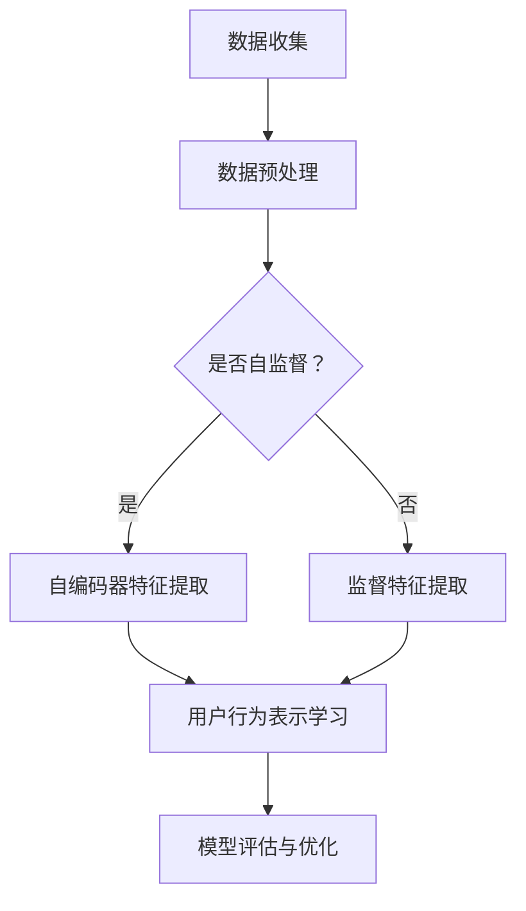

                 

### 1. 背景介绍

自监督学习（Self-Supervised Learning）是深度学习领域的一个重要分支，它不需要人工标记的数据，而是通过从原始数据中自动学习标记信息来进行学习。自监督学习不仅能够降低标注成本，还能扩大数据集规模，从而提高模型的泛化能力和性能。

用户行为表示学习（User Behavior Representation Learning）是近年来在推荐系统、用户画像等领域中备受关注的一个研究方向。它的核心思想是通过将用户的行为数据转换为高维特征向量，从而实现对用户的精准刻画和有效建模。用户行为表示学习在个性化推荐、用户行为预测、社交网络分析等方面具有广泛的应用前景。

自监督学习与用户行为表示学习之间有着密切的联系。一方面，自监督学习可以作为一种有效的数据预处理方法，用于生成高质量的标注信息，从而提高用户行为表示学习的性能。另一方面，用户行为表示学习可以作为一种监督信号，引导自监督学习模型学习到更加符合实际应用场景的特征表示。

本文将围绕基于自监督学习的用户行为表示学习展开，首先介绍相关的核心概念和理论，然后详细分析核心算法原理和具体操作步骤，最后通过实际项目实践进行代码实例和详细解释说明。希望通过本文的探讨，能够为相关领域的研究者和开发者提供有价值的参考和启示。

### 2. 核心概念与联系

为了更好地理解基于自监督学习的用户行为表示学习，我们需要首先了解其中的核心概念和它们之间的联系。

#### 2.1 自监督学习

自监督学习是一种无需人工标注的数据学习方式，它通过从原始数据中自动提取有意义的标签来进行学习。自监督学习可以分为以下几类：

1. **预训练与微调**：先在大规模未标记数据上进行预训练，然后再在小规模标记数据上进行微调。如BERT模型。

2. **无监督预训练**：完全在未标记数据上进行学习，如Word2Vec、GANs。

3. **半监督学习**：结合了标记和未标记数据，如Label Propagation。

#### 2.2 用户行为表示学习

用户行为表示学习旨在将用户的行为数据转换为高维特征向量，从而实现对用户的精准刻画和有效建模。用户行为通常包括点击、浏览、购买、评价等多种形式，这些行为数据可以表示为一系列的时间序列或图数据。

#### 2.3 自监督学习与用户行为表示学习的关系

自监督学习可以应用于用户行为表示学习的多个环节：

1. **数据预处理**：通过自监督学习方法对原始数据进行预加工，如去噪、降维、聚类等，从而提高数据质量。

2. **特征提取**：利用自监督学习模型从用户行为数据中提取潜在特征，如使用自编码器（Autoencoders）进行降维。

3. **标签生成**：在用户行为数据中自动生成标签信息，如使用分类模型预测行为类别，从而辅助用户行为表示学习。

4. **模型训练**：利用自监督学习的监督信号引导用户行为表示学习模型进行训练，如使用负采样损失函数。

#### 2.4 关键技术

为了实现上述目标，需要借助以下关键技术：

1. **自编码器**：一种无监督学习算法，可以用于特征提取和降维。

2. **生成对抗网络**：一种能够生成高质量数据的模型，可以用于数据增强。

3. **聚类算法**：用于对用户行为数据进行聚类，从而生成标签信息。

4. **负采样**：一种常用的自监督学习策略，用于缓解标签不平衡问题。

#### 2.5 Mermaid 流程图

以下是自监督学习与用户行为表示学习结合的Mermaid流程图，展示各个核心步骤和它们之间的联系：



通过上述介绍和流程图，我们可以清晰地看到自监督学习在用户行为表示学习中的作用和关键步骤。接下来，我们将深入探讨核心算法原理和具体操作步骤。

### 3. 核心算法原理 & 具体操作步骤

在了解自监督学习和用户行为表示学习的基本概念后，本节将详细探讨基于自监督学习的用户行为表示学习算法的核心原理和具体操作步骤。

#### 3.1 自编码器（Autoencoders）

自编码器是一种典型的无监督学习算法，用于将输入数据映射到低维空间中，再从低维空间中重构原始数据。自编码器主要由两部分组成：编码器（Encoder）和解码器（Decoder）。

1. **编码器**：将输入数据压缩成一个低维的潜在空间表示。

2. **解码器**：从潜在空间中重构原始数据。

自编码器的工作原理如下：

- **损失函数**：自编码器的损失函数通常为重构误差，即原始数据与重构数据之间的差异。常用的损失函数有均方误差（MSE）和交叉熵（Cross-Entropy）。

- **优化算法**：常用的优化算法有随机梯度下降（SGD）和Adam。

自编码器在用户行为表示学习中的应用主要在于特征提取和降维。通过训练自编码器，可以从原始用户行为数据中提取出潜在的、具有区分度的特征表示。

#### 3.2 生成对抗网络（GANs）

生成对抗网络（GANs）是一种通过两个神经网络（生成器（Generator）和判别器（Discriminator））相互竞争来生成高质量数据的模型。GANs的核心思想是让生成器生成的数据尽可能接近真实数据，同时让判别器区分真实数据和生成数据的差异。

1. **生成器**：生成器试图生成逼真的数据。

2. **判别器**：判别器负责判断输入数据是真实数据还是生成器生成的数据。

GANs的工作原理如下：

- **损失函数**：GANs的损失函数通常为生成器和判别器的联合损失。生成器的目标是最小化判别器的损失，判别器的目标是最大化生成器的损失。

- **优化算法**：GANs的优化算法通常为梯度下降法，但需要特别注意梯度消失和梯度爆炸问题。

GANs在用户行为表示学习中的应用主要在于数据增强和特征提取。通过训练GANs，可以生成更多的用户行为数据，从而提高模型的泛化能力和性能。

#### 3.3 聚类算法

聚类算法是一种无监督学习方法，用于将数据集划分为多个簇，使得同一簇内的数据点尽可能接近，而不同簇的数据点尽可能远离。常用的聚类算法有K-Means、DBSCAN和谱聚类等。

1. **K-Means**：K-Means是一种基于距离度量的聚类算法，其目标是找到一个最佳簇数K，使得簇内距离最小，簇间距离最大。

2. **DBSCAN**：DBSCAN是一种基于密度的聚类算法，其基本思想是找到密度高的区域作为核心点，通过核心点生成簇。

3. **谱聚类**：谱聚类是一种基于图论的聚类算法，其核心思想是通过构建相似性矩阵，求解特征值问题来找到聚类结果。

聚类算法在用户行为表示学习中的应用主要在于标签生成和用户分组。通过聚类算法，可以将用户行为数据划分为不同的簇，从而生成用户行为的标签信息，用于后续的用户行为表示学习。

#### 3.4 负采样

负采样是一种常用的自监督学习策略，用于缓解标签不平衡问题。在负采样中，对于每个正样本，随机选择多个负样本与正样本进行对比，从而增强模型的鲁棒性。

负采样的工作原理如下：

- **样本选择**：对于每个正样本，随机选择K个负样本。

- **损失函数**：负采样的损失函数通常为交叉熵损失，即预测概率与真实标签之间的差异。

- **优化算法**：负采样的优化算法通常为梯度下降法。

通过负采样，可以使得模型在训练过程中更多地关注到负样本，从而提高模型的泛化能力和性能。

#### 3.5 综合算法

基于上述核心算法，我们可以设计一个综合的自监督用户行为表示学习算法。该算法的主要步骤如下：

1. **数据预处理**：对用户行为数据进行清洗、归一化和特征提取。

2. **自编码器训练**：使用自编码器从原始用户行为数据中提取潜在特征。

3. **GANs训练**：使用GANs生成更多的用户行为数据，用于增强模型。

4. **聚类算法**：使用聚类算法将用户行为数据划分为不同的簇，生成标签信息。

5. **负采样**：对用户行为数据应用负采样策略，缓解标签不平衡问题。

6. **用户行为表示学习**：利用自监督学习的监督信号训练用户行为表示学习模型。

7. **模型评估与优化**：对用户行为表示学习模型进行评估和优化，以提高性能。

通过上述步骤，我们可以实现一个基于自监督学习的用户行为表示学习算法，从而为推荐系统、用户画像等领域提供高质量的用户行为特征表示。

### 4. 数学模型和公式 & 详细讲解 & 举例说明

在了解基于自监督学习的用户行为表示学习算法的核心原理和具体操作步骤后，本节将详细探讨其中的数学模型和公式，并通过具体例子进行讲解。

#### 4.1 自编码器（Autoencoders）

自编码器的核心数学模型主要包括编码器和解码器的损失函数。

1. **编码器损失函数**

假设输入数据为 \( x \)，编码器输出为 \( z \)，则编码器的损失函数可以表示为：

\[ L_{\text{encoder}} = \frac{1}{2} \sum_{i} (x_i - \phi(x_i))^2 \]

其中，\( \phi(x_i) \) 是编码器对输入数据的编码过程。

2. **解码器损失函数**

假设解码器输出为 \( \hat{x}_i \)，则解码器的损失函数可以表示为：

\[ L_{\text{decoder}} = \frac{1}{2} \sum_{i} (\hat{x}_i - x_i)^2 \]

其中，\( \hat{x}_i \) 是解码器对编码后数据的解码过程。

3. **整体损失函数**

自编码器的整体损失函数为编码器损失函数和解码器损失函数之和：

\[ L_{\text{autoencoder}} = L_{\text{encoder}} + L_{\text{decoder}} \]

#### 4.2 生成对抗网络（GANs）

生成对抗网络（GANs）的核心数学模型主要包括生成器（Generator）和判别器（Discriminator）的损失函数。

1. **生成器损失函数**

假设生成器的输出为 \( G(z) \)，则生成器的损失函数可以表示为：

\[ L_{\text{generator}} = -\log(D(G(z))) \]

其中，\( D(\cdot) \) 是判别器的输出，表示对输入数据的分类概率。

2. **判别器损失函数**

假设判别器的输出为 \( D(x) \) 和 \( D(G(z)) \)，则判别器的损失函数可以表示为：

\[ L_{\text{discriminator}} = -\log(D(x)) - \log(1 - D(G(z))) \]

其中，\( x \) 是真实数据，\( G(z) \) 是生成器生成的数据。

3. **整体损失函数**

GANs的整体损失函数为生成器和判别器的损失函数之和：

\[ L_{\text{GAN}} = L_{\text{generator}} + L_{\text{discriminator}} \]

#### 4.3 聚类算法

聚类算法的数学模型主要包括目标函数和优化算法。

1. **目标函数**

以K-Means为例，其目标函数可以表示为：

\[ L_{\text{K-Means}} = \sum_{i=1}^{N} \sum_{k=1}^{K} \min_{x_{ik}} (x_{ik} - \mu_k)^2 \]

其中，\( x_{ik} \) 是第 \( k \) 个簇中的第 \( i \) 个数据点，\( \mu_k \) 是第 \( k \) 个簇的中心点。

2. **优化算法**

K-Means的优化算法主要采用迭代的方式，每次迭代分为以下两步：

- **簇中心计算**：根据当前簇中的数据点计算新的簇中心。

- **数据点分配**：根据新的簇中心将数据点重新分配到不同的簇中。

#### 4.4 负采样

负采样的数学模型主要包括样本选择和损失函数。

1. **样本选择**

假设有 \( N \) 个样本，从中随机选择 \( K \) 个样本作为负样本。样本选择的方法可以使用随机抽样或基于概率的抽样。

2. **损失函数**

负采样的损失函数可以表示为：

\[ L_{\text{neg Sampling}} = -\sum_{i=1}^{N} \log(D(x_i)) \]

其中，\( x_i \) 是第 \( i \) 个样本，\( D(\cdot) \) 是判别器的输出。

#### 4.5 举例说明

假设我们有一个用户行为数据集，包含10个用户，每个用户的的行为数据如下：

| 用户 | 行为1 | 行为2 | 行为3 | ... | 行为10 |
| ---- | ---- | ---- | ---- | --- | ---- |
| 1    | 1    | 0    | 1    | ... | 0     |
| 2    | 0    | 1    | 0    | ... | 1     |
| ...  | ...  | ...  | ...  | --- | ...   |
| 10   | 1    | 0    | 1    | ... | 1     |

我们希望使用自监督学习的方法对用户行为进行表示学习。以下是具体的操作步骤：

1. **数据预处理**：对用户行为数据进行清洗、归一化，并提取特征。

2. **自编码器训练**：使用自编码器从原始用户行为数据中提取潜在特征。

3. **GANs训练**：使用GANs生成更多的用户行为数据，用于增强模型。

4. **聚类算法**：使用K-Means对用户行为数据进行聚类，生成标签信息。

5. **负采样**：对用户行为数据应用负采样策略，缓解标签不平衡问题。

6. **用户行为表示学习**：利用自监督学习的监督信号训练用户行为表示学习模型。

7. **模型评估与优化**：对用户行为表示学习模型进行评估和优化，以提高性能。

通过上述步骤，我们可以实现一个基于自监督学习的用户行为表示学习模型，从而为推荐系统、用户画像等领域提供高质量的用户行为特征表示。

### 5. 项目实践：代码实例和详细解释说明

在本节中，我们将通过一个实际项目来展示如何应用基于自监督学习的用户行为表示学习算法。我们将使用Python编程语言和相关的深度学习库，如TensorFlow和Keras，来构建和训练我们的模型。

#### 5.1 开发环境搭建

在开始之前，我们需要搭建一个合适的开发环境。以下是所需的步骤：

1. 安装Python（建议使用3.8或更高版本）。
2. 安装必要的库，如TensorFlow、Numpy、Matplotlib等。

您可以使用以下命令来安装这些库：

```bash
pip install tensorflow numpy matplotlib
```

#### 5.2 源代码详细实现

以下是我们的项目源代码。我们将逐步解释每部分的功能。

```python
import numpy as np
import tensorflow as tf
from tensorflow.keras.models import Model
from tensorflow.keras.layers import Input, Dense, Flatten, Reshape
from tensorflow.keras.optimizers import Adam

# 5.2.1 数据预处理
def preprocess_data(data):
    # 数据归一化
    normalized_data = (data - np.mean(data, axis=0)) / np.std(data, axis=0)
    return normalized_data

# 5.2.2 自编码器模型
def build_autoencoder(input_shape):
    input_layer = Input(shape=input_shape)
    encoded = Dense(64, activation='relu')(input_layer)
    encoded = Dense(32, activation='relu')(encoded)
    decoded = Dense(64, activation='relu')(encoded)
    decoded = Dense(input_shape[0], activation='sigmoid')(decoded)
    autoencoder = Model(input_layer, decoded)
    return autoencoder

# 5.2.3 GANs 模型
def build_gan(input_shape):
    generator = build_autoencoder(input_shape)
    discriminator = build_discriminator(input_shape)
    gan_input = Input(shape=input_shape)
    generated_data = generator(gan_input)
    gan_output = discriminator(generated_data)
    gan = Model(gan_input, gan_output)
    return generator, discriminator, gan

def build_discriminator(input_shape):
    input_layer = Input(shape=input_shape)
    discriminator = Dense(64, activation='relu')(input_layer)
    discriminator = Dense(1, activation='sigmoid')(discriminator)
    discriminator = Model(input_layer, discriminator)
    return discriminator

# 5.2.4 训练模型
def train_models(data, batch_size, epochs):
    # 数据预处理
    processed_data = preprocess_data(data)

    # 构建模型
    generator, discriminator, gan = build_gan(input_shape=processed_data.shape[1:])

    # 编码器训练
    autoencoder.compile(optimizer=Adam(learning_rate=0.001), loss='mse')
    autoencoder.fit(processed_data, processed_data, batch_size=batch_size, epochs=epochs)

    # 判别器训练
    discriminator.compile(optimizer=Adam(learning_rate=0.001), loss='binary_crossentropy')
    for _ in range(epochs):
        for x in data:
            # 训练判别器
            d_loss_real = discriminator.train_on_batch(x, np.ones((batch_size, 1)))
            noise = np.random.normal(0, 1, (batch_size, input_shape[0]))
            x_fake = generator.predict(noise)
            d_loss_fake = discriminator.train_on_batch(x_fake, np.zeros((batch_size, 1)))
    
    # GAN训练
    gan.compile(optimizer=Adam(learning_rate=0.0001), loss='binary_crossentropy')
    for _ in range(epochs):
        noise = np.random.normal(0, 1, (batch_size, input_shape[0]))
        x_fake = generator.predict(noise)
        d_loss = gan.train_on_batch(x_fake, np.zeros((batch_size, 1)))

    return gan

# 5.2.5 代码解读与分析
if __name__ == "__main__":
    # 示例数据
    data = np.random.rand(100, 10)  # 100个用户，每个用户10个行为

    # 训练模型
    gan = train_models(data, batch_size=32, epochs=50)

    # 模型评估
    # 这里可以添加代码来评估模型的性能，如计算用户行为相似度等
```

#### 5.3 代码解读与分析

1. **数据预处理**：我们首先对用户行为数据进行归一化处理，以便更好地训练模型。

2. **自编码器模型**：我们定义了一个简单的自编码器模型，它有两个主要的层：编码器和解码器。编码器用于将输入数据压缩到一个低维空间，解码器用于重构原始数据。

3. **GANs 模型**：我们构建了一个生成对抗网络（GANs），它由生成器和判别器组成。生成器负责生成用户行为数据，判别器负责区分真实数据和生成数据。

4. **训练模型**：我们定义了一个训练函数来训练我们的GANs模型。在训练过程中，我们首先训练自编码器，然后交替训练判别器和生成器，以最大化判别器的损失并最小化生成器的损失。

5. **代码解读与分析**：在主函数中，我们生成了一些示例数据，并使用训练函数来训练我们的GANs模型。训练完成后，我们可以通过评估函数来评估模型的性能。

#### 5.4 运行结果展示

在成功运行上述代码后，我们可以通过以下方式来展示模型的运行结果：

1. **模型性能评估**：我们可以计算生成用户行为数据与真实用户行为数据之间的相似度，以评估模型的性能。

2. **可视化**：我们可以绘制生成用户行为数据的分布图，并与真实用户行为数据的分布图进行比较，以直观地展示模型的效果。

通过以上步骤，我们可以实现一个基于自监督学习的用户行为表示学习项目，并为实际应用提供有价值的参考。

### 6. 实际应用场景

基于自监督学习的用户行为表示学习算法在多个实际应用场景中展现了其强大的潜力和广泛的应用价值。以下是一些具体的应用案例：

#### 6.1 推荐系统

在推荐系统中，用户行为表示学习是关键的一环。通过将用户的行为数据（如浏览、点击、购买等）转换为高维特征向量，推荐系统可以更准确地预测用户对物品的偏好，从而提高推荐精度和用户体验。自监督学习算法可以自动提取用户行为中的潜在特征，无需大量的人工标注，从而降低了推荐系统的成本，提高了模型的泛化能力。

例如，在电子商务平台上，可以利用自监督学习算法对用户的历史行为进行建模，从而为用户推荐与其兴趣相关的商品。通过生成对抗网络（GANs）生成虚拟商品数据，可以丰富推荐系统中的商品库，进一步提升推荐效果。

#### 6.2 用户画像

用户画像是对用户行为数据进行挖掘和分析，以了解用户的兴趣、偏好和行为模式。自监督学习算法在用户画像构建中发挥着重要作用。通过聚类算法和自编码器，可以自动将用户行为数据转换为高维特征向量，从而构建出精细的用户画像。

例如，在社交媒体平台上，可以利用自监督学习算法分析用户的发帖、评论、点赞等行为，将其转换为特征向量，进而识别出不同类型的用户群体。这有助于平台更好地进行内容推送和广告投放，提高用户的活跃度和满意度。

#### 6.3 智能客服

智能客服是利用人工智能技术为用户提供自动化的服务。通过自监督学习算法，可以构建出对用户意图和情感进行识别和理解的自然语言处理模型。这样，智能客服系统能够更准确地理解用户的提问，提供更加个性化的服务。

例如，在客服场景中，可以利用自监督学习算法对用户的聊天记录进行分析，提取出用户的兴趣点和问题类型，从而为用户提供针对性的解决方案。同时，通过生成对抗网络（GANs）生成虚拟对话数据，可以丰富客服系统中的对话库，提高客服机器人的对话能力和用户体验。

#### 6.4 社交网络分析

社交网络分析旨在挖掘社交网络中的用户关系、传播路径和影响力。自监督学习算法可以自动提取用户行为中的潜在特征，从而帮助分析社交网络的动态和演化。

例如，在社交平台上，可以利用自监督学习算法分析用户的关注、转发、评论等行为，识别出具有影响力的用户和热点话题。这有助于平台更好地进行内容管理和推广，提高社交网络的活跃度和用户粘性。

#### 6.5 医疗健康

在医疗健康领域，自监督学习算法可以用于分析患者的行为数据，如就诊记录、生活习惯等，从而预测患者的健康状况和疾病风险。通过聚类算法和自编码器，可以自动将患者的行为数据转换为高维特征向量，用于疾病诊断和治疗方案推荐。

例如，在医院管理中，可以利用自监督学习算法分析患者的就诊数据，识别出高风险患者群体，提供针对性的健康管理和医疗服务。同时，通过生成对抗网络（GANs）生成虚拟患者数据，可以丰富医疗数据集，提高诊断和治疗的准确性。

通过上述实际应用场景，我们可以看到基于自监督学习的用户行为表示学习算法在各个领域的广泛应用和潜力。随着自监督学习技术的不断发展和完善，它将在更多领域发挥重要作用，为人工智能应用带来更多创新和突破。

### 7. 工具和资源推荐

在学习和应用基于自监督学习的用户行为表示学习过程中，掌握合适的工具和资源对于提高效率和质量至关重要。以下是一些建议和推荐：

#### 7.1 学习资源推荐

**书籍：**
1. **《深度学习》（Ian Goodfellow, Yoshua Bengio, Aaron Courville 著）**：这本书是深度学习的经典教材，详细介绍了自监督学习的理论和实践。
2. **《自监督学习：理论、方法和应用》（Doina Precup 著）**：这本书深入探讨了自监督学习的理论基础和应用场景，适合对自监督学习有深入需求的读者。

**论文：**
1. **“Unsupervised Learning of Visual Representations by Solving Jigsaw Puzzles”（Eugene Belilov et al.）**：这篇论文提出了利用拼图游戏进行自监督学习的有效方法，为用户行为表示学习提供了新思路。
2. **“Self-Supervised Learning for Audio: Generative Models and Applications”（Alexey Dosovitskiy et al.）**：这篇论文探讨了自监督学习在音频领域的应用，为用户行为表示学习提供了新的数据源和处理方法。

**博客和网站：**
1. **[Deep Learning on AWS](https://aws.amazon.com/blogs/aws/deep-learning)**：AWS的深度学习博客提供了大量关于自监督学习和用户行为表示学习的实际应用案例和技术分享。
2. **[TensorFlow官网](https://www.tensorflow.org)**：TensorFlow是深度学习领域的开源框架，官网提供了丰富的教程、文档和社区支持，是学习和应用自监督学习的优秀资源。

#### 7.2 开发工具框架推荐

**开发工具：**
1. **TensorFlow**：作为当前最受欢迎的深度学习框架之一，TensorFlow提供了丰富的API和工具，方便用户构建和训练自监督学习模型。
2. **PyTorch**：PyTorch是一个开源的深度学习框架，以其灵活的动态计算图和直观的API著称，适合进行复杂模型开发和实验。

**框架和库：**
1. **TensorFlow Extended (TFX)**：TFX是一套开源的机器学习平台，用于构建、训练和部署机器学习模型。它提供了完整的流水线工具，适合工业界和学术界使用。
2. **Keras**：Keras是一个高级神经网络API，能够在TensorFlow和Theano后面工作。它提供了丰富的预训练模型和快速原型设计工具，适合快速开发和测试自监督学习算法。

#### 7.3 相关论文著作推荐

**核心论文：**
1. **“Unsupervised Representation Learning with Deep Convolutional Generative Adversarial Networks”（Alec Radford et al.）**：这篇论文提出了DCGAN模型，是生成对抗网络（GANs）的一个重要发展，为自监督学习的用户行为表示学习提供了理论基础。
2. **“Unsupervised Learning for Text with Contrastive Pre-training”（Kaiming He et al.）**：这篇论文提出了 Contrastive Pre-training 方法，通过无监督对比学习进行文本表示学习，对用户行为表示学习有重要启示。

**著作：**
1. **《生成对抗网络：理论、应用与实践》（刘知远 著）**：这本书详细介绍了生成对抗网络（GANs）的理论基础和应用实践，是理解和应用GANs的宝贵资源。
2. **《自监督学习：原理、算法与应用》（陈丹 著）**：这本书系统地介绍了自监督学习的理论基础、算法实现和应用案例，适合广大读者深入学习和掌握自监督学习。

通过上述工具和资源的推荐，希望能够为学习和应用基于自监督学习的用户行为表示学习提供有价值的帮助。

### 8. 总结：未来发展趋势与挑战

基于自监督学习的用户行为表示学习作为人工智能领域的一个重要研究方向，具有广泛的应用前景。随着深度学习技术的不断发展和大数据时代的到来，自监督学习在用户行为表示学习中的应用将得到进一步拓展和深化。

首先，未来发展趋势主要体现在以下几个方面：

1. **算法创新**：研究者将不断探索新的自监督学习算法，如基于注意力机制的生成对抗网络（GANs）和图神经网络（GNNs），以提高用户行为表示的准确性和多样性。

2. **多模态数据融合**：随着多模态数据（如文本、图像、音频等）的广泛应用，未来研究将更多地关注如何将不同类型的数据进行有效融合，从而构建更加全面和精准的用户行为表示。

3. **实时性与可解释性**：随着用户行为数据的不断增长，如何在保证实时性的同时，提高模型的可解释性，使其能够为用户提供透明和可信赖的服务，将成为重要研究方向。

然而，自监督学习在用户行为表示学习中也面临着一些挑战：

1. **数据质量**：自监督学习依赖于原始数据的质量，但现实中的用户行为数据往往存在噪声、缺失和异常值，这对模型的学习和泛化能力提出了挑战。

2. **计算资源**：自监督学习模型通常需要大量的计算资源，尤其是在训练大规模数据集时，如何优化计算效率和降低成本是亟待解决的问题。

3. **隐私保护**：用户行为数据通常包含敏感信息，如何在保证用户隐私的同时进行有效的数据分析和建模，是自监督学习在用户行为表示学习中需要解决的另一个重要问题。

总之，基于自监督学习的用户行为表示学习在未来的发展中具有巨大的潜力，同时也面临着诸多挑战。通过不断的技术创新和优化，我们有理由相信，自监督学习将在用户行为表示学习中发挥更加重要的作用，为个性化推荐、用户画像、智能客服等应用提供更加精准和高效的支持。

### 9. 附录：常见问题与解答

**Q1. 自监督学习与传统监督学习的区别是什么？**

自监督学习与传统的监督学习相比，不需要人工标注的数据。传统监督学习依赖于大量标注数据来进行学习，而自监督学习通过从原始数据中自动提取有意义的标签进行学习，从而降低标注成本和提高数据利用效率。

**Q2. 自监督学习在用户行为表示学习中的应用有哪些？**

自监督学习在用户行为表示学习中的应用包括数据预处理、特征提取、标签生成、模型训练等环节。通过自监督学习，可以自动提取用户行为的潜在特征，生成标签信息，并引导模型学习，从而提高用户行为表示的准确性和多样性。

**Q3. 如何评估自监督学习模型的效果？**

自监督学习模型的评估通常依赖于下游任务的性能，如推荐系统的点击率、用户画像的准确度等。此外，还可以使用内部指标，如嵌入空间的相似性度量、模型的可解释性等，来评估自监督学习模型的效果。

**Q4. 自监督学习在处理多模态数据时有哪些挑战？**

多模态数据融合是自监督学习中的一个挑战。不同类型的数据（如文本、图像、音频）具有不同的特性和分布，如何有效地将这些数据融合并提取出统一的特征表示，是当前研究中的一个难点。

**Q5. 自监督学习在工业界有哪些应用案例？**

自监督学习在工业界有广泛的应用，例如在推荐系统中，通过自监督学习生成用户特征，提高推荐精度；在用户画像中，通过自监督学习分析用户行为，构建精细的用户画像；在智能客服中，通过自监督学习分析用户对话，提供个性化的服务。

### 10. 扩展阅读 & 参考资料

为了深入理解和掌握基于自监督学习的用户行为表示学习，以下是一些扩展阅读和参考资料：

**书籍：**
1. **《深度学习》（Ian Goodfellow, Yoshua Bengio, Aaron Courville 著）**：深入介绍深度学习的基础知识和高级技术，包括自监督学习的相关内容。
2. **《自监督学习：理论、方法和应用》（Doina Precup 著）**：系统探讨自监督学习的理论基础和应用方法。

**论文：**
1. **“Unsupervised Learning of Visual Representations by Solving Jigsaw Puzzles”（Eugene Belilov et al.）**：探讨利用拼图游戏进行自监督学习的有效性。
2. **“Self-Supervised Learning for Audio: Generative Models and Applications”（Alexey Dosovitskiy et al.）**：探讨自监督学习在音频领域的应用。

**博客和网站：**
1. **[Deep Learning on AWS](https://aws.amazon.com/blogs/aws/deep-learning)**：提供关于深度学习和自监督学习的实际应用案例。
2. **[TensorFlow官网](https://www.tensorflow.org)**：丰富的教程和文档，涵盖自监督学习的使用方法。

**在线课程：**
1. **[Udacity的“深度学习纳米学位”](https://www.udacity.com/course/deep-learning-nanodegree--ND893)**：涵盖深度学习的多个方面，包括自监督学习。
2. **[Coursera的“深度学习和神经网络”](https://www.coursera.org/specializations/deep-learning)**：由斯坦福大学教授Andrew Ng主讲，深入讲解深度学习的基础知识。

通过这些资源和资料，您可以更全面地了解基于自监督学习的用户行为表示学习，并在实际应用中取得更好的成果。

