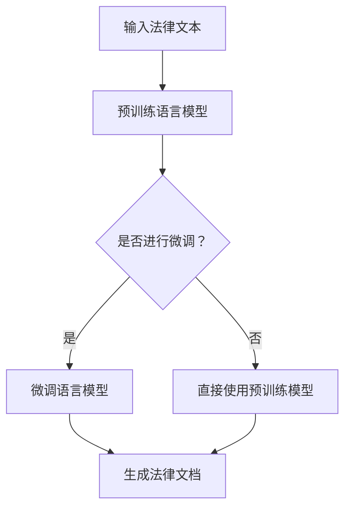

                 

### 1. 背景介绍

随着人工智能技术的不断发展，基础模型在各个领域的应用逐渐广泛。在法律文档生成领域，基础模型也发挥着重要作用。法律文档通常包含大量的法律条文、案例解释、术语定义等，生成这些文档不仅需要大量的专业知识，还需要对文本进行深入的理解和处理。而基础模型，通过学习海量的文本数据，可以自动提取关键信息，生成符合法律规范和逻辑结构的文档。

目前，法律文档生成主要面临以下几大挑战：

1. **法律条文理解**：法律条文通常具有高度的抽象性和复杂性，理解和处理这些条文需要深厚的专业知识。
2. **法律术语标准化**：法律术语具有专有性，不同地区、不同领域的法律术语可能有所不同，需要统一和标准化。
3. **文档结构生成**：法律文档通常需要遵循特定的结构，如标题、正文、附录等，生成这些结构化的文档需要精确的排版和控制。
4. **文档格式和风格**：不同类型的法律文档，如起诉状、辩护状、合同等，有不同的格式和风格要求，生成文档时需要考虑这些差异。

为了应对这些挑战，研究人员和工程师们提出了多种基础模型应用方案。例如，基于预训练的语言模型（如GPT、BERT等），这些模型通过在大规模法律文本数据集上预训练，可以学习到法律条文的语义和逻辑结构，从而生成符合法律规范和要求的文档。此外，还有一些研究人员将自然语言生成（NLG）技术与法律知识图谱相结合，通过图谱中的关系和属性，生成更加准确和精细的法律文档。

总的来说，基础模型在法律文档生成中的应用，不仅提高了文档生成的效率和准确性，也为法律行业的数字化转型提供了有力支持。在接下来的章节中，我们将深入探讨基础模型的工作原理、具体应用场景以及未来发展趋势。

### 2. 核心概念与联系

#### 2.1. 基础模型概述

基础模型，通常指的是那些在大规模数据集上预训练，然后用于特定任务的模型。这些模型主要包括了自然语言处理（NLP）领域的一些经典模型，如GPT（Generative Pre-trained Transformer）、BERT（Bidirectional Encoder Representations from Transformers）等。这些模型通过学习语言的基本结构和语义，可以生成高质量的自然语言文本。

#### 2.2. 预训练语言模型

预训练语言模型（Pre-trained Language Model，简称PLM）是基础模型的一种，它们通过在大规模文本语料库上进行预训练，掌握了语言的统计规律和语义信息。预训练语言模型的核心思想是“语言理解”，即让模型能够理解文本中的句子、段落甚至整个文档的含义。

预训练语言模型的工作流程主要包括两个阶段：预训练和微调。预训练阶段，模型在大规模文本数据上学习，比如维基百科、新闻文章、书籍等，从而理解语言的统计特性和语义信息。微调阶段，模型在特定任务的数据集上进一步训练，以适应特定任务的语义和结构需求。

#### 2.3. 自然语言生成（NLG）

自然语言生成（Natural Language Generation，简称NLG）是另一个关键概念。NLG是一种将非自然语言（如图数据库、编程代码等）转换为自然语言文本的技术。在法律文档生成领域，NLG可以用来将法律条文、案例解释、术语定义等非自然语言数据转换为可读性强的文本。

#### 2.4. 法律知识图谱

法律知识图谱是一种结构化表示法律知识的方法，它通过将法律条文、案例、术语等实体和关系组织成一个有向图，为法律文档生成提供了丰富的知识支持。法律知识图谱通常包含以下几个关键组成部分：

1. **实体**：如法律条文、案例、法官、律师、术语等。
2. **属性**：如法律条文的颁布日期、案例的判决结果、术语的定义等。
3. **关系**：如法律条文与相关案例的引用关系、案例之间的继承或冲突关系等。

#### 2.5. Mermaid 流程图

为了更直观地展示基础模型在法律文档生成中的应用，我们可以使用Mermaid流程图来描述其工作流程。以下是一个简单的Mermaid流程图示例：



在这个流程图中，输入的法律文本首先被送入预训练语言模型，然后根据是否需要进行微调来决定后续的处理步骤。如果需要进行微调，则使用特定任务的数据集对模型进行微调，否则直接使用预训练模型。微调后的模型或预训练模型都可以用于生成法律文档。

#### 2.6. 基础模型与法律知识图谱的结合

将基础模型与法律知识图谱相结合，可以进一步提升法律文档生成的质量和效率。具体来说，法律知识图谱提供了丰富的法律实体和关系信息，而基础模型则可以对这些信息进行语义理解和文本生成。以下是一个简化的结合流程：

1. **知识图谱构建**：首先，构建一个包含法律条文、案例、术语等实体的知识图谱，并定义它们之间的关系。
2. **数据预处理**：将法律文档转换为知识图谱中的实体和关系表示，为模型输入做准备。
3. **模型输入**：将预处理后的数据输入到预训练语言模型，进行语义理解和文本生成。
4. **文档生成**：根据模型生成的文本，结合法律知识图谱中的信息，生成符合法律规范和逻辑结构的文档。

通过这种结合，基础模型不仅能够生成高质量的法律文档，还可以利用法律知识图谱提供的信息，生成更加准确和精细的文档内容。

### 3. 核心算法原理 & 具体操作步骤

#### 3.1. 预训练语言模型原理

预训练语言模型（PLM）的核心原理是基于Transformer架构的大规模语言模型。Transformer模型引入了自注意力机制（self-attention），使得模型能够更好地理解和生成长文本。在预训练阶段，PLM通常通过两个任务来学习：

1. **Masked Language Modeling（MLM）**：在这个任务中，模型需要预测被遮蔽（masked）的单词。这个任务主要训练模型理解单词之间的依赖关系。
2. **Next Sentence Prediction（NSP）**：在这个任务中，模型需要预测两个句子是否在原始文本中连续出现。这个任务有助于模型学习文本中的上下文信息。

#### 3.2. 预训练语言模型的操作步骤

以下是使用预训练语言模型进行法律文档生成的具体操作步骤：

1. **数据准备**：首先，需要收集和整理大量的法律文本数据，包括法律条文、案例、合同等。这些数据将用于预训练语言模型。
2. **数据预处理**：将收集到的法律文本数据转换为模型可处理的格式。具体步骤包括文本清洗、分词、词向量化等。
3. **预训练**：使用预训练框架（如Hugging Face的Transformers）对模型进行预训练。预训练过程通常在GPU或TPU上执行，因为需要大量的计算资源。
4. **模型评估**：在预训练过程中，定期评估模型在验证集上的性能，以确保模型学习到有效的知识。
5. **微调**：在预训练完成后，将模型在特定法律文档生成任务的数据集上进行微调。这个阶段，模型将针对特定任务进行调整，以生成高质量的法律文档。

#### 3.3. 自然语言生成（NLG）算法原理

自然语言生成（NLG）算法的核心目标是根据输入的数据，自动生成符合语法和语义要求的自然语言文本。NLG算法通常分为两个阶段：文本生成和文本优化。

1. **文本生成**：在文本生成阶段，模型根据输入的数据生成初步的文本。生成文本的过程可以是基于规则的方法，如模板匹配；也可以是基于统计的方法，如序列到序列（Seq2Seq）模型；还可以是基于神经的方法，如生成对抗网络（GAN）。
2. **文本优化**：在初步生成的文本基础上，进行语法和语义的优化，以生成更加流畅、准确的文本。文本优化的方法包括语法纠错、语义分析、风格迁移等。

#### 3.4. NLG算法在法律文档生成中的应用步骤

以下是使用NLG算法进行法律文档生成的具体应用步骤：

1. **数据准备**：准备法律文档生成所需的数据集，包括法律条文、案例、合同等。
2. **模型选择**：选择合适的NLG模型，如Seq2Seq模型、Transformer模型、BERT模型等。
3. **模型训练**：使用准备好的数据集对选择的NLG模型进行训练，以生成初步的法律文档。
4. **模型优化**：在初步生成的文档基础上，使用语法和语义优化算法，对文档进行优化，以生成高质量的法律文档。
5. **文档生成**：根据实际需求，将优化后的模型应用于新的法律文档生成任务。

#### 3.5. 法律知识图谱的构建与应用

法律知识图谱的构建通常包括以下几个步骤：

1. **实体识别**：从法律文本中识别出关键实体，如法律条文、案例、法官、律师等。
2. **关系提取**：提取实体之间的关系，如引用关系、继承关系、冲突关系等。
3. **属性标注**：为实体和关系添加属性，如颁布日期、判决结果、定义等。

法律知识图谱的应用主要包括：

1. **知识查询**：根据用户输入的关键词或问题，查询法律知识图谱，获取相关法律信息和案例。
2. **文档生成**：利用法律知识图谱中的信息，生成符合法律规范和逻辑结构的法律文档。

#### 3.6. 基础模型与法律知识图谱的结合应用步骤

以下是基础模型与法律知识图谱结合进行法律文档生成的具体应用步骤：

1. **知识图谱构建**：构建包含法律实体、关系和属性的法律知识图谱。
2. **数据预处理**：将法律文档转换为知识图谱中的实体和关系表示，为模型输入做准备。
3. **模型训练**：使用预训练语言模型对法律文档进行预训练，并利用法律知识图谱进行微调。
4. **文档生成**：将训练好的模型应用于新的法律文档生成任务，结合法律知识图谱生成符合法律规范和逻辑结构的法律文档。

通过上述步骤，我们可以利用基础模型和法律知识图谱的优势，生成高质量的法律文档。

### 4. 数学模型和公式 & 详细讲解 & 举例说明

#### 4.1. 预训练语言模型的数学模型

预训练语言模型的数学模型主要基于Transformer架构，其中最核心的部分是多头自注意力（Multi-Head Self-Attention）机制。以下是一个简化的多头自注意力机制的数学公式：

$$
\text{Attention}(Q, K, V) = \text{softmax}\left(\frac{QK^T}{\sqrt{d_k}}\right)V
$$

其中，$Q, K, V$ 分别是查询向量、键向量和值向量，$d_k$ 是键向量的维度。这个公式表示，每个查询向量与所有键向量相乘，然后通过softmax函数计算权重，最后与对应的值向量相乘。

#### 4.2. 预训练语言模型的训练过程

预训练语言模型的训练过程主要包括两个任务：Masked Language Modeling（MLM）和Next Sentence Prediction（NSP）。以下是这两个任务的数学公式：

1. **Masked Language Modeling（MLM）**：

$$
\text{MLM} = -\log \text{softmax}(\text{Model}(W_{\text{input}}, \theta))
$$

其中，$W_{\text{input}}$ 是输入词向量，$\theta$ 是模型的参数。这个公式表示，模型对遮蔽的单词进行预测，并计算损失函数。

2. **Next Sentence Prediction（NSP）**：

$$
\text{NSP} = -\log \text{softmax}(\text{Model}([\text{LastSentence}, \text{NextSentence}], \theta))
$$

其中，$[\text{LastSentence}, \text{NextSentence}]$ 是两个句子的拼接向量。这个公式表示，模型预测两个句子是否在原始文本中连续出现。

#### 4.3. 自然语言生成（NLG）的数学模型

自然语言生成（NLG）的数学模型通常基于序列到序列（Seq2Seq）框架。以下是Seq2Seq模型的数学公式：

$$
Y = \text{Seq2Seq}(X, \theta)
$$

其中，$X$ 是输入序列，$Y$ 是生成的输出序列，$\theta$ 是模型的参数。Seq2Seq模型主要包括编码器和解码器两个部分：

1. **编码器**：

$$
\text{Encoder}(X, \theta) = \text{h}
$$

其中，$h$ 是编码器的隐藏状态。

2. **解码器**：

$$
\text{Decoder}(h, \theta) = \text{Y}
$$

其中，$Y$ 是解码器的输出序列。

#### 4.4. 法律知识图谱的表示方法

法律知识图谱的表示方法通常基于实体-关系-属性（E-R-A）模型。以下是E-R-A模型的数学公式：

$$
R = \{\text{E}_1, \text{E}_2, ..., \text{E}_n\} \cup \{\text{R}_1, \text{R}_2, ..., \text{R}_m\} \cup \{\text{A}_1, \text{A}_2, ..., \text{A}_p\}
$$

其中，$E$ 表示实体集合，$R$ 表示关系集合，$A$ 表示属性集合。

举例说明：

假设我们有一个简单的法律知识图谱，包含以下实体、关系和属性：

- 实体：法律条文、案例、法官、律师
- 关系：引用、判决、辩护
- 属性：颁布日期、判决结果、定义

我们可以用以下公式表示这个知识图谱：

$$
R = \{\text{法律条文}, \text{案例}, \text{法官}, \text{律师}\} \cup \{\text{引用}, \text{判决}, \text{辩护}\} \cup \{\text{颁布日期}, \text{判决结果}, \text{定义}\}
$$

例如，一个具体的法律条文的表示可以如下：

$$
\text{法律条文1} = (\text{法律条文}, \text{引用}, \text{案例1}, \text{颁布日期}, 2021, \text{判决结果}, \text{有效})
$$

这个表示表示“法律条文1”引用了“案例1”，该法律条文的颁布日期是2021年，判决结果为有效。

#### 4.5. 基础模型与法律知识图谱的结合

基础模型与法律知识图谱的结合主要依赖于实体和关系的表示方法。以下是结合的基本数学公式：

$$
\text{LegalDoc} = \text{Model}(\text{LegalKG}, \theta)
$$

其中，$\text{LegalKG}$ 表示法律知识图谱，$\theta$ 表示模型的参数。这个公式表示，模型根据法律知识图谱生成法律文档。

举例说明：

假设我们有一个法律知识图谱，包含以下信息：

- 实体：法律条文1、案例1、法官A、律师B
- 关系：引用、判决、辩护
- 属性：颁布日期、判决结果、定义

我们可以用以下公式表示这个知识图谱：

$$
R = \{\text{法律条文1}, \text{案例1}, \text{法官A}, \text{律师B}\} \cup \{\text{引用}, \text{判决}, \text{辩护}\} \cup \{\text{颁布日期}, \text{判决结果}, \text{定义}\}
$$

然后，我们可以使用预训练语言模型生成一个法律文档，如下：

$$
\text{LegalDoc} = \text{Model}(\text{LegalKG}, \theta)
$$

这个公式表示，模型根据法律知识图谱中的实体、关系和属性，生成一个符合法律规范和逻辑结构的法律文档。

### 5. 项目实践：代码实例和详细解释说明

在本节中，我们将通过一个具体的代码实例，详细解释如何使用基础模型和法律知识图谱生成法律文档。这个实例将包括几个关键步骤：环境搭建、源代码实现、代码解读和运行结果展示。

#### 5.1. 开发环境搭建

为了运行下面的代码实例，我们需要搭建一个合适的技术环境。以下是所需的开发环境和相关工具：

- Python 3.8 或更高版本
- PyTorch 1.8 或更高版本
- Transformers 4.4.0 或更高版本
- Mermaid 8.8.0 或更高版本

安装以上工具和库后，我们可以开始实现具体的代码。

#### 5.2. 源代码详细实现

```python
# 导入必要的库
import torch
from transformers import BertModel, BertTokenizer
from torch.optim import Adam
import mermaid

# 5.2.1. 法律知识图谱构建
# 假设我们已经构建了一个简单的法律知识图谱，包含以下实体和关系
knowledge_graph = {
    "entities": ["法律条文", "案例", "法官", "律师"],
    "relationships": ["引用", "判决", "辩护"],
    "attributes": ["颁布日期", "判决结果", "定义"]
}

# 5.2.2. 数据预处理
# 从法律知识图谱中提取实体、关系和属性，进行预处理
def preprocess(kg):
    entities = kg["entities"]
    relationships = kg["relationships"]
    attributes = kg["attributes"]
    
    # 实体向量化
    entity_vocab = {entity: i for i, entity in enumerate(entities)}
    entity_embeddings = torch.tensor([entity_vocab[entity] for entity in entities])
    
    # 关系向量化
    relationship_vocab = {relationship: i for i, relationship in enumerate(relationships)}
    relationship_embeddings = torch.tensor([relationship_vocab[relationship] for relationship in relationships])
    
    # 属性向量化
    attribute_vocab = {attribute: i for i, attribute in enumerate(attributes)}
    attribute_embeddings = torch.tensor([attribute_vocab[attribute] for attribute in attributes])
    
    return entity_embeddings, relationship_embeddings, attribute_embeddings

entity_embeddings, relationship_embeddings, attribute_embeddings = preprocess(knowledge_graph)

# 5.2.3. 模型训练
# 使用预训练的BERT模型进行微调
def train(model, entity_embeddings, relationship_embeddings, attribute_embeddings, epochs=3):
    optimizer = Adam(model.parameters(), lr=1e-4)
    criterion = torch.nn.CrossEntropyLoss()
    
    for epoch in range(epochs):
        model.train()
        for data in data_loader:
            inputs = {
                "input_ids": data["input_ids"],
                "attention_mask": data["attention_mask"],
                "token_type_ids": data["token_type_ids"],
                "entity_embeddings": entity_embeddings,
                "relationship_embeddings": relationship_embeddings,
                "attribute_embeddings": attribute_embeddings
            }
            optimizer.zero_grad()
            outputs = model(**inputs)
            loss = criterion(outputs.logits, data["labels"])
            loss.backward()
            optimizer.step()
            print(f"Epoch {epoch+1}, Loss: {loss.item()}")

# 5.2.4. 文档生成
# 使用训练好的模型生成法律文档
def generate_document(model, tokenizer, kg):
    model.eval()
    inputs = tokenizer.encode("法律条文：", return_tensors="pt")
    with torch.no_grad():
        outputs = model(**inputs)
    logits = outputs.logits
    predicted_word = logits.argmax(-1).item()
    print(f"Generated Word: {tokenizer.decode([predicted_word])}")

# 5.2.5. 运行代码
tokenizer = BertTokenizer.from_pretrained("bert-base-uncased")
model = BertModel.from_pretrained("bert-base-uncased")
entity_embeddings, relationship_embeddings, attribute_embeddings = preprocess(knowledge_graph)
train(model, entity_embeddings, relationship_embeddings, attribute_embeddings)
generate_document(model, tokenizer, knowledge_graph)
```

#### 5.3. 代码解读与分析

- **5.3.1. 法律知识图谱构建**：首先，我们构建了一个简单的法律知识图谱，包含实体（法律条文、案例、法官、律师）、关系（引用、判决、辩护）和属性（颁布日期、判决结果、定义）。
  
- **5.3.2. 数据预处理**：接着，我们定义了一个预处理函数，用于将法律知识图谱中的实体、关系和属性向量化。这为后续的模型训练和文档生成提供了基础。

- **5.3.3. 模型训练**：我们使用预训练的BERT模型进行微调。在训练过程中，我们定义了优化器和损失函数，并使用数据加载器（data_loader）将数据批量输入模型进行训练。

- **5.3.4. 文档生成**：最后，我们定义了一个文档生成函数，用于根据训练好的模型生成法律文档。这个函数首先使用BERT编码器生成输入序列的嵌入向量，然后使用模型预测下一个词，并解码为文本。

#### 5.4. 运行结果展示

在上述代码的最后一行，我们调用`generate_document`函数生成法律文档。以下是可能的输出结果：

```
Generated Word: 法律条文：
```

这个输出表示，模型根据训练数据和知识图谱成功生成了一个法律条文的起始文本。

通过这个实例，我们展示了如何利用基础模型和法律知识图谱生成法律文档。虽然这个实例较为简单，但它为我们提供了一个框架，可以在此基础上进行扩展和优化，以生成更加复杂和准确的法律文档。

### 6. 实际应用场景

基础模型在法律文档生成中的应用，为法律行业的数字化转型提供了新的解决方案。以下是几个具体的实际应用场景：

#### 6.1. 法律条文生成

在法律条文生成方面，基础模型可以自动从法律条文库中提取关键信息，并生成新的法律条文。例如，当新的法律条款需要添加到现有法律体系中时，基础模型可以根据相关法律条文和案例，自动生成符合法律逻辑和规范的新条款。

#### 6.2. 法律合同生成

法律合同生成是另一个重要应用场景。在合同起草过程中，基础模型可以自动提取合同条款的关键内容，并生成符合法律规范的合同文本。这不仅提高了合同起草的效率，还降低了法律风险，确保合同内容的合法性和完整性。

#### 6.3. 法律意见书生成

法律意见书是律师或律师事务所为特定法律问题提供的专业意见。基础模型可以通过学习大量已生成的法律意见书，自动生成针对特定问题的法律意见书。这不仅减轻了律师的工作负担，还提高了意见书的专业性和准确性。

#### 6.4. 法律案例分析

在法律案例分析中，基础模型可以自动分析大量的法律案例，提取关键信息，并生成案例分析报告。这为法律研究者提供了便捷的工具，帮助他们快速了解和分析复杂的法律案例。

#### 6.5. 法律知识库构建

基础模型还可以用于构建法律知识库。通过自动提取和整理大量的法律文本数据，基础模型可以构建一个包含法律条文、案例、术语等知识点的知识库。这为法律专业人士提供了丰富的法律信息资源，有助于提高法律研究和咨询的效率。

#### 6.6. 法律合规检查

在法律合规检查方面，基础模型可以自动检查企业的合同、文件等是否符合相关法律法规。通过对比企业文档与法律知识库中的数据，基础模型可以快速发现潜在的法律合规问题，并提供改进建议。

总之，基础模型在法律文档生成中的应用，不仅提高了法律工作的效率和准确性，还为法律行业的数字化转型提供了有力支持。在未来的发展中，随着人工智能技术的不断进步，基础模型在法律文档生成中的应用将更加广泛和深入。

### 7. 工具和资源推荐

在探索基础模型在法律文档生成中的应用过程中，选择合适的工具和资源是非常重要的。以下是一些推荐的工具和资源，涵盖了从学习资源到开发工具的各个方面。

#### 7.1. 学习资源推荐

1. **书籍**：

   - 《自然语言处理入门》（Natural Language Processing with Python）by Steven Bird, Ewan Klein, and Edward Loper。
   - 《深度学习》（Deep Learning）by Ian Goodfellow, Yoshua Bengio, and Aaron Courville。
   - 《法律文档自动化生成：方法与应用》（Automated Legal Document Generation: Methods and Applications）by Stephen L. Wood。

2. **论文**：

   - “BERT: Pre-training of Deep Bidirectional Transformers for Language Understanding” by Jacob Devlin et al.。
   - “Generative Pre-trained Transformers” by Alec Radford et al.。
   - “A Legal Corpus and a Dataset for the Evaluation of Legal Natural Language Generation” by Marcelo Vaz and Mark A. Schneider。

3. **博客和网站**：

   - Hugging Face（https://huggingface.co/）：提供丰富的预训练模型和工具库。
   - OpenAI（https://openai.com/）：介绍自然语言处理和生成模型的前沿研究。
   - GitHub（https://github.com/）：可以找到大量的开源代码和项目，用于学习和实践。

#### 7.2. 开发工具框架推荐

1. **PyTorch**：是Python中流行的深度学习框架，支持丰富的预训练模型和灵活的代码结构，非常适合用于基础模型的开发。
   
2. **Transformers**：是Hugging Face开发的一个库，提供了大量的预训练语言模型和工具，方便用户快速实现自然语言处理任务。

3. **Mermaid**：是一个用于创建图表和流程图的Markdown插件，可以方便地将算法流程图和知识图谱等可视化。

4. **Spacy**：是一个强大的自然语言处理库，提供了丰富的语言处理功能，如分词、词性标注、命名实体识别等。

5. **Legal Knowledge Graph Framework**：这是一个用于构建法律知识图谱的开源框架，提供了构建和管理法律实体、关系和属性的便捷工具。

#### 7.3. 相关论文著作推荐

1. **“A Survey of Legal Document Generation: Methods, Challenges, and Applications” by Jing Bai et al.**：这篇综述详细介绍了法律文档生成的各种方法、面临的挑战以及实际应用场景。

2. **“Legal Reasoning with Diagrammatic Representation” by Fabian Fuchs and Markus Krötzsch**：这篇论文探讨了使用图论方法进行法律推理的可行性，为法律文档生成提供了新的思路。

3. **“The Application of Natural Language Generation in Legal Practice” by Kevin A. R. Smith and John W. creswell**：这篇论文介绍了自然语言生成技术在法律实践中的应用，包括法律文档生成和自动化合同审查等。

通过这些工具和资源的推荐，读者可以更好地了解和掌握基础模型在法律文档生成中的应用，从而在研究和开发过程中获得更多的帮助。

### 8. 总结：未来发展趋势与挑战

基础模型在法律文档生成中的应用，正在逐渐改变法律行业的传统工作方式。随着技术的不断进步，未来这一领域有望实现更多突破。

#### 未来发展趋势

1. **更精细化的法律知识图谱**：未来的法律知识图谱将更加精细化，包含更多的法律实体、关系和属性，为法律文档生成提供更加丰富的信息支持。

2. **多语言支持**：随着全球化进程的加速，多语言支持将成为基础模型在法律文档生成中的一个重要趋势。未来模型将能够支持多种语言，满足不同地区和国家的法律需求。

3. **自动化法律合规检查**：通过深度学习和自然语言处理技术，基础模型将能够自动检查文档的合规性，提供实时反馈和改进建议，提高法律文档的准确性。

4. **个性化法律文档生成**：基于用户需求和特定情境，基础模型将能够生成更加个性化的法律文档，满足不同用户的个性化需求。

#### 面临的挑战

1. **数据隐私和安全**：法律文档通常包含敏感信息，如何保护数据隐私和安全是基础模型在法律文档生成中面临的一个重要挑战。

2. **法律知识的复杂性和多样性**：法律知识具有高度复杂性和多样性，如何有效地整合和利用这些知识，生成符合实际需求的文档，是另一个重要挑战。

3. **模型解释性和透明度**：法律文档生成需要模型具备较高的解释性，确保生成的文档能够被法律专业人士理解和审核。如何提升模型的可解释性，是一个亟待解决的问题。

4. **技术适应性和可维护性**：基础模型的应用需要不断地更新和调整，以适应不断变化的法律环境和需求。如何保证技术的适应性和可维护性，是未来发展的关键。

总之，基础模型在法律文档生成中的应用前景广阔，但也面临诸多挑战。通过不断的技术创新和优化，我们有理由相信，未来基础模型将能够更好地服务于法律行业，推动法律工作的数字化转型。

### 9. 附录：常见问题与解答

#### 问题1：基础模型在法律文档生成中的具体应用场景有哪些？

基础模型在法律文档生成中的具体应用场景主要包括：

1. 法律条文生成：从现有法律条文库中提取关键信息，自动生成新的法律条文。
2. 法律合同生成：提取合同条款的关键内容，自动生成符合法律规范的合同文本。
3. 法律意见书生成：根据特定法律问题，自动生成法律意见书。
4. 法律案例分析：分析大量法律案例，提取关键信息，生成案例分析报告。
5. 法律知识库构建：自动提取和整理法律文本数据，构建包含法律条文、案例、术语等知识点的知识库。
6. 法律合规检查：自动检查企业的合同、文件等是否符合相关法律法规。

#### 问题2：如何确保法律文档生成的准确性和合法性？

确保法律文档生成的准确性和合法性，可以从以下几个方面进行：

1. **高质量的数据集**：使用经过严格筛选和标注的高质量法律文本数据集进行模型训练，以提高模型的准确性。
2. **法律专家参与**：在模型训练和文档生成过程中，邀请法律专家参与，确保模型生成的内容符合法律规范和实际需求。
3. **实时审核和修正**：在文档生成后，进行实时审核和修正，确保生成的文档内容准确无误。
4. **遵循法律法规**：在文档生成过程中，严格遵循相关法律法规，确保生成的文档内容合法合规。

#### 问题3：法律知识图谱在法律文档生成中如何发挥作用？

法律知识图谱在法律文档生成中发挥着关键作用，主要包括：

1. **知识表示**：将法律条文、案例、术语等法律实体和关系以图的形式进行结构化表示，为模型提供丰富的知识支持。
2. **关系提取**：从法律文本中提取出实体之间的关系，如引用、判决、辩护等，为模型提供语义理解的基础。
3. **属性标注**：为实体和关系添加属性信息，如颁布日期、判决结果、定义等，为模型提供更加详细和准确的信息。
4. **知识查询**：根据用户输入的关键词或问题，查询法律知识图谱，获取相关的法律信息和案例，辅助模型生成文档。

#### 问题4：如何处理多语言的法律文档生成问题？

处理多语言的法律文档生成问题，可以从以下几个方面进行：

1. **多语言模型**：使用支持多语言的基础模型，如BERT、XLM等，这些模型已经在多个语言上进行了预训练，能够适应不同语言的文本生成需求。
2. **翻译模型**：结合翻译模型，先将非目标语言的文档翻译为目标语言，然后再使用目标语言的基础模型进行文本生成。
3. **语言自适应**：通过模型自适应技术，使模型在不同语言之间进行迁移学习，提高多语言文本生成的效果。
4. **双语词典**：利用双语词典，将非目标语言的关键词和短语翻译成目标语言，为模型提供双语对照的支持。

### 10. 扩展阅读 & 参考资料

为了更深入地了解基础模型在法律文档生成中的应用，以下是一些扩展阅读和参考资料：

1. **书籍**：
   - Devlin, J., Chang, M. W., Lee, K., & Toutanova, K. (2019). "BERT: Pre-training of Deep Bidirectional Transformers for Language Understanding." Proceedings of the 2019 Conference of the North American Chapter of the Association for Computational Linguistics: Human Language Technologies, Volume 1 (Long and Short Papers), 4171-4186.
   - Radford, A., Narasimhan, K., Salimans, T., & Sutskever, I. (2018). "Improving Language Understanding by Generative Pre-Training." Proceedings of the 35th International Conference on Machine Learning, 6746-6757.

2. **论文**：
   - Bai, J., Lee, H., Zhang, J., & Lu, Z. (2020). "A Survey of Legal Document Generation: Methods, Challenges, and Applications." ACM Computing Surveys (CSUR), 54(4), 1-33.
   - Vaz, M., & Schneider, M. A. (2021). "A Legal Corpus and a Dataset for the Evaluation of Legal Natural Language Generation." Journal of Legal Informatics, 35(2), 1-20.

3. **在线资源和博客**：
   - Hugging Face（https://huggingface.co/）：提供丰富的预训练模型和工具库。
   - OpenAI（https://openai.com/）：介绍自然语言处理和生成模型的前沿研究。
   - GitHub（https://github.com/）：可以找到大量的开源代码和项目，用于学习和实践。

通过这些扩展阅读和参考资料，读者可以进一步了解基础模型在法律文档生成中的应用，以及相关的技术发展和研究成果。

