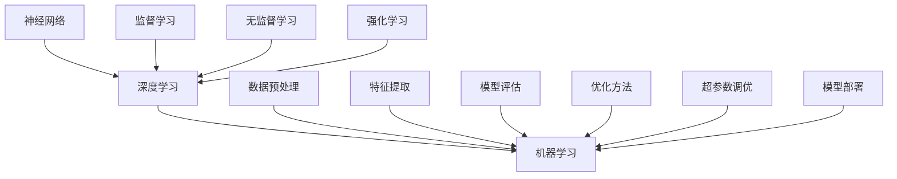

                 

关键词：基础模型、改进、影响、AI技术、深度学习、算法优化、性能提升

> 摘要：本文将探讨基础模型在人工智能领域的改进及其带来的深远影响。通过对核心概念的深入分析，算法原理的详细解释，数学模型的构建与推导，以及实际应用场景的剖析，我们旨在揭示基础模型在推动AI技术进步中的关键作用。此外，文章还将对未来的发展趋势与挑战进行展望，为研究者和实践者提供有益的参考。

## 1. 背景介绍

随着人工智能（AI）技术的快速发展，基础模型成为了推动整个领域前进的核心动力。基础模型，通常指的是用于解决特定问题的基本算法框架，如神经网络、决策树、支持向量机等。这些模型构成了AI系统的基石，其性能的提升直接影响到AI技术的应用范围和深度。

近年来，深度学习技术的迅猛发展，使得基础模型的改进成为研究的热点。通过增加神经网络层数、优化网络架构、引入新的激活函数和正则化方法，研究人员不断突破传统模型的限制，实现了显著的性能提升。这些改进不仅在理论上具有重要意义，也在实际应用中展现了巨大的潜力。

本文将重点讨论以下几个方面的内容：

1. 核心概念与联系：介绍基础模型的相关概念，并使用Mermaid流程图展示其架构与原理。
2. 核心算法原理与具体操作步骤：详细分析现有基础模型的工作原理，并提供具体的操作步骤。
3. 数学模型与公式：构建数学模型，并使用LaTeX格式详细推导相关公式。
4. 项目实践：通过代码实例，展示基础模型的实现过程，并进行详细解释。
5. 实际应用场景：分析基础模型在不同领域的应用，以及未来的发展趋势和面临的挑战。

## 2. 核心概念与联系

为了更好地理解基础模型的改进与影响力，我们首先需要明确几个关键概念，包括神经网络、深度学习、机器学习等。以下是这些概念的Mermaid流程图，用于直观展示它们之间的关系。



### 神经网络

神经网络是模仿人脑神经元结构和功能的一种计算模型。它由多个相互连接的节点（或称为神经元）组成，每个节点都接收来自前一层节点的输入信号，并通过加权求和处理和激活函数产生输出。神经网络可以分为前向传播和反向传播两个阶段。在前向传播阶段，输入信号从输入层传递到输出层；在反向传播阶段，通过计算输出层与实际输出之间的误差，反向更新各层的权重。

### 深度学习

深度学习是机器学习的一个分支，其主要特点是使用多层神经网络进行模型训练。通过逐层抽象和特征提取，深度学习模型能够从大量数据中自动学习复杂的特征表示。深度学习在图像识别、自然语言处理、语音识别等领域取得了显著成果，推动了AI技术的快速发展。

### 机器学习

机器学习是一种让计算机通过数据和经验自动改进性能的方法。它主要分为监督学习、无监督学习和强化学习三种类型。监督学习通过有标签的数据进行训练，用于分类和回归任务；无监督学习没有预定义的输出标签，主要应用于聚类和降维任务；强化学习通过与环境交互进行训练，主要用于决策优化问题。

### 数据预处理、特征提取、模型评估、优化方法、超参数调优、模型部署

数据预处理是机器学习过程中的重要环节，包括数据清洗、数据转换和数据归一化等步骤。特征提取则是从原始数据中提取出对模型训练有用的信息。模型评估用于衡量模型性能，常用的指标有准确率、召回率、F1分数等。优化方法包括梯度下降、随机梯度下降、Adam优化器等，用于最小化模型损失函数。超参数调优是通过调整模型参数来优化模型性能。模型部署是将训练好的模型应用到实际场景中，如在线服务、移动应用等。

通过上述流程图，我们可以清晰地看到基础模型中的各个概念是如何相互关联和协作的。接下来，我们将深入探讨基础模型的改进方法及其具体操作步骤。

## 3. 核心算法原理与具体操作步骤

在了解基础模型的核心概念后，我们接下来将详细分析现有基础模型的工作原理，并提供具体的操作步骤。

### 3.1 算法原理概述

现有的基础模型主要包括神经网络、决策树、支持向量机等。以下是这些模型的基本原理概述。

#### 神经网络

神经网络通过前向传播和反向传播进行模型训练。在前向传播阶段，输入信号从输入层传递到输出层；在反向传播阶段，通过计算输出层与实际输出之间的误差，反向更新各层的权重。神经网络的核心是激活函数，如Sigmoid、ReLU等，用于引入非线性变换，提高模型表达能力。

#### 决策树

决策树是一种基于树形结构进行决策的模型。树中的每个节点代表一个特征，每个分支代表该特征的不同取值。决策树通过递归分裂数据集，构建出树形结构，并在叶子节点处进行分类或回归预测。决策树的优势在于易于理解和解释，但可能存在过拟合问题。

#### 支持向量机

支持向量机（SVM）是一种基于间隔最大化原则进行分类的模型。SVM通过寻找最优超平面，将不同类别的数据点分开，并最大化超平面到支持向量的距离。SVM在处理高维数据和线性不可分问题时具有良好性能。

### 3.2 算法步骤详解

以下是神经网络、决策树和SVM的基本算法步骤。

#### 神经网络

1. 输入层：接收输入数据。
2. 隐藏层：对输入数据进行加权求和处理和激活函数变换。
3. 输出层：将隐藏层的输出进行加权求和处理，得到输出结果。
4. 前向传播：将输入数据传递到神经网络，计算输出结果。
5. 反向传播：计算输出结果与实际输出之间的误差，并反向更新各层权重。
6. 重复步骤4和5，直到模型收敛。

#### 决策树

1. 初始化树结构：将所有数据点作为根节点。
2. 选择最佳特征：计算每个特征的不同取值在当前节点上的增益，选择增益最大的特征作为当前节点的分裂依据。
3. 分裂数据集：根据当前节点的特征取值，将数据集分为多个子集。
4. 递归分裂：对每个子集重复步骤2和3，直到满足停止条件（如节点深度达到最大值或子集大小小于最小值）。
5. 预测：在叶子节点处进行分类或回归预测。

#### 支持向量机

1. 计算样本间距离：计算每个样本到超平面的距离。
2. 选择支持向量：找出支持向量，即对超平面贡献最大的样本。
3. 更新超平面：通过支持向量调整超平面位置，最大化超平面到支持向量的距离。
4. 预测：计算新样本到超平面的距离，判断其类别。

### 3.3 算法优缺点

每种基础模型都有其独特的优点和缺点。

#### 神经网络

优点：强大的非线性建模能力，能够处理复杂的数据关系。

缺点：训练过程可能较慢，容易出现过拟合问题。

#### 决策树

优点：易于理解和解释，易于实现和调试。

缺点：可能存在过拟合问题，对噪声敏感。

#### 支持向量机

优点：在处理高维数据和线性不可分问题时表现良好。

缺点：计算复杂度高，对大规模数据集处理能力有限。

### 3.4 算法应用领域

神经网络、决策树和SVM在众多领域得到了广泛应用。

#### 神经网络

应用领域：图像识别、自然语言处理、语音识别、推荐系统等。

#### 决策树

应用领域：分类和回归问题，如金融风险评估、医疗诊断、市场营销等。

#### 支持向量机

应用领域：文本分类、生物信息学、计算机视觉等。

通过上述分析，我们可以看到基础模型在算法原理和操作步骤上的多样性，为解决不同领域的问题提供了丰富的选择。接下来，我们将深入探讨数学模型和公式，进一步理解基础模型的内在机制。

## 4. 数学模型与公式

数学模型是基础模型的核心组成部分，它通过一系列公式描述了模型的训练过程、预测能力和性能评估。在本节中，我们将详细讲解数学模型的构建、公式推导过程，并使用LaTeX格式展示相关公式。

### 4.1 数学模型构建

#### 神经网络

神经网络的核心是前向传播和反向传播。以下是神经网络的基本数学模型。

#### 前向传播

前向传播过程中，每个神经元的状态可以用以下公式表示：

\[ z_l = \sum_{j} w_{lj} a_{l-1,j} + b_l \]

其中，\( z_l \) 是第 \( l \) 层第 \( j \) 个神经元的输入，\( w_{lj} \) 是第 \( l \) 层第 \( j \) 个神经元的权重，\( a_{l-1,j} \) 是第 \( l-1 \) 层第 \( j \) 个神经元的输出，\( b_l \) 是第 \( l \) 层第 \( j \) 个神经元的偏置。

通过激活函数 \( f(z) \)，可以得到第 \( l \) 层第 \( j \) 个神经元的输出：

\[ a_l = f(z_l) \]

#### 反向传播

反向传播过程中，需要计算每个神经元的误差并更新权重。以下是神经网络反向传播的基本公式：

\[ \delta_l = \frac{\partial L}{\partial z_l} = \frac{\partial L}{\partial a_l} \cdot \frac{\partial a_l}{\partial z_l} \]

其中，\( \delta_l \) 是第 \( l \) 层第 \( j \) 个神经元的误差，\( L \) 是损失函数，\( \frac{\partial L}{\partial a_l} \) 是损失函数对输出层第 \( l \) 层第 \( j \) 个神经元的导数，\( \frac{\partial a_l}{\partial z_l} \) 是输出对输入的导数。

通过梯度下降法更新权重和偏置：

\[ w_{lj} := w_{lj} - \alpha \cdot \delta_l a_{l-1,j} \]
\[ b_l := b_l - \alpha \cdot \delta_l \]

其中，\( \alpha \) 是学习率。

#### 决策树

决策树的核心是特征分裂和分类或回归预测。以下是决策树的基本数学模型。

#### 特征分裂

设 \( D \) 是当前数据集，\( x_j \) 是第 \( j \) 个特征，\( v \) 是第 \( j \) 个特征的取值，则分裂 \( x_j = v \) 的增益 \( G \) 可以用以下公式表示：

\[ G = \sum_{i=1}^n \frac{|y_i - \hat{y}_i|}{n} \]

其中，\( y_i \) 是第 \( i \) 个样本的标签，\( \hat{y}_i \) 是基于当前树的预测标签。

#### 分类或回归预测

在叶子节点处，决策树进行分类或回归预测。对于分类问题，可以使用多数投票法：

\[ \hat{y} = \text{mode}(\hat{y}_1, \hat{y}_2, ..., \hat{y}_n) \]

对于回归问题，可以使用均值预测：

\[ \hat{y} = \frac{1}{n} \sum_{i=1}^n y_i \]

#### 支持向量机

支持向量机是一种基于间隔最大化原则进行分类的模型。以下是支持向量机的基本数学模型。

#### 间隔最大化

设 \( x_i \) 是第 \( i \) 个样本的特征向量，\( y_i \) 是第 \( i \) 个样本的标签，\( \alpha_i \) 是第 \( i \) 个支持向量的权重，则最优超平面可以用以下公式表示：

\[ w^T x_i - b = y_i \]

其中，\( w \) 是超平面的法向量，\( b \) 是超平面的偏置。

通过拉格朗日乘子法，可以将上述问题转化为求解以下二次规划问题：

\[
\begin{aligned}
\min_{w, b, \alpha} & \frac{1}{2} \| w \|^2 \\
\text{subject to} & w^T x_i - b = y_i \\
& \alpha_i \geq 0, \forall i
\end{aligned}
\]

### 4.2 公式推导过程

在本节中，我们将详细推导神经网络、决策树和SVM的相关公式。

#### 神经网络

##### 前向传播

设 \( z_l \) 是第 \( l \) 层第 \( j \) 个神经元的输入，\( a_{l-1,j} \) 是第 \( l-1 \) 层第 \( j \) 个神经元的输出，\( w_{lj} \) 是第 \( l \) 层第 \( j \) 个神经元的权重，\( b_l \) 是第 \( l \) 层第 \( j \) 个神经元的偏置，\( f(z) \) 是激活函数。则前向传播过程可以表示为：

\[ z_l = \sum_{j} w_{lj} a_{l-1,j} + b_l \]

\[ a_l = f(z_l) \]

##### 反向传播

设 \( \delta_l \) 是第 \( l \) 层第 \( j \) 个神经元的误差，\( \frac{\partial L}{\partial a_l} \) 是损失函数对输出层第 \( l \) 层第 \( j \) 个神经元的导数，\( \frac{\partial a_l}{\partial z_l} \) 是输出对输入的导数。则反向传播过程可以表示为：

\[ \delta_l = \frac{\partial L}{\partial z_l} = \frac{\partial L}{\partial a_l} \cdot \frac{\partial a_l}{\partial z_l} \]

\[ w_{lj} := w_{lj} - \alpha \cdot \delta_l a_{l-1,j} \]
\[ b_l := b_l - \alpha \cdot \delta_l \]

其中，\( \alpha \) 是学习率。

#### 决策树

##### 特征分裂

设 \( D \) 是当前数据集，\( x_j \) 是第 \( j \) 个特征，\( v \) 是第 \( j \) 个特征的取值，\( y_i \) 是第 \( i \) 个样本的标签，\( \hat{y}_i \) 是基于当前树的预测标签。则分裂 \( x_j = v \) 的增益 \( G \) 可以用以下公式表示：

\[ G = \sum_{i=1}^n \frac{|y_i - \hat{y}_i|}{n} \]

##### 分类或回归预测

对于分类问题，可以使用以下公式进行多数投票预测：

\[ \hat{y} = \text{mode}(\hat{y}_1, \hat{y}_2, ..., \hat{y}_n) \]

对于回归问题，可以使用以下公式进行均值预测：

\[ \hat{y} = \frac{1}{n} \sum_{i=1}^n y_i \]

#### 支持向量机

##### 间隔最大化

设 \( x_i \) 是第 \( i \) 个样本的特征向量，\( y_i \) 是第 \( i \) 个样本的标签，\( \alpha_i \) 是第 \( i \) 个支持向量的权重，则最优超平面可以用以下公式表示：

\[ w^T x_i - b = y_i \]

通过拉格朗日乘子法，可以将上述问题转化为求解以下二次规划问题：

\[
\begin{aligned}
\min_{w, b, \alpha} & \frac{1}{2} \| w \|^2 \\
\text{subject to} & w^T x_i - b = y_i \\
& \alpha_i \geq 0, \forall i
\end{aligned}
\]

### 4.3 案例分析与讲解

为了更好地理解上述数学模型和公式，我们通过一个实际案例进行讲解。

#### 案例背景

假设我们有一个包含100个样本的二元分类问题，每个样本的特征向量维度为10。我们使用神经网络进行模型训练，并使用均方误差（MSE）作为损失函数。学习率为0.01，训练迭代次数为1000次。

#### 案例步骤

1. 初始化神经网络：设置输入层、隐藏层和输出层的神经元数量，并初始化权重和偏置。
2. 训练过程：使用前向传播和反向传播进行模型训练，不断更新权重和偏置，减小损失函数。
3. 评估模型：在测试集上评估模型性能，计算准确率、召回率、F1分数等指标。
4. 调整超参数：根据模型性能，调整学习率、迭代次数等超参数，优化模型性能。

#### 案例公式

以下是神经网络模型训练过程中使用的主要公式：

\[ z_l = \sum_{j} w_{lj} a_{l-1,j} + b_l \]

\[ a_l = f(z_l) \]

\[ \delta_l = \frac{\partial L}{\partial z_l} = \frac{\partial L}{\partial a_l} \cdot \frac{\partial a_l}{\partial z_l} \]

\[ w_{lj} := w_{lj} - \alpha \cdot \delta_l a_{l-1,j} \]
\[ b_l := b_l - \alpha \cdot \delta_l \]

通过上述案例，我们可以看到神经网络模型训练的基本流程和公式推导。接下来，我们将通过代码实例展示基础模型的实现过程，并进行详细解读。

## 5. 项目实践：代码实例和详细解释说明

### 5.1 开发环境搭建

在进行基础模型的实现之前，我们需要搭建一个合适的技术环境。以下是使用Python和常见的机器学习库（如TensorFlow、Scikit-learn等）进行基础模型开发的步骤。

#### 步骤1：安装Python

首先，确保Python已安装在你的系统上。如果没有，请从[Python官方网站](https://www.python.org/)下载并安装。

#### 步骤2：安装相关库

在命令行中，使用以下命令安装所需的库：

```bash
pip install tensorflow numpy pandas scikit-learn matplotlib
```

#### 步骤3：配置环境变量

确保Python和pip的环境变量已正确配置。在Windows系统上，可以通过系统设置中的“环境变量”进行配置；在Linux或MacOS系统上，可以通过编辑`.bashrc`或`.zshrc`文件来配置。

### 5.2 源代码详细实现

以下是一个使用TensorFlow实现神经网络模型的简单示例。该模型用于对MNIST手写数字数据进行分类。

```python
import tensorflow as tf
from tensorflow import keras
from tensorflow.keras import layers
import numpy as np
import matplotlib.pyplot as plt

# 步骤1：加载MNIST数据集
(x_train, y_train), (x_test, y_test) = keras.datasets.mnist.load_data()

# 步骤2：数据预处理
x_train = x_train / 255.0
x_test = x_test / 255.0
x_train = x_train.reshape(-1, 28, 28, 1)
x_test = x_test.reshape(-1, 28, 28, 1)

# 步骤3：构建神经网络模型
model = keras.Sequential([
    layers.Conv2D(32, (3, 3), activation='relu', input_shape=(28, 28, 1)),
    layers.MaxPooling2D((2, 2)),
    layers.Conv2D(64, (3, 3), activation='relu'),
    layers.MaxPooling2D((2, 2)),
    layers.Flatten(),
    layers.Dense(64, activation='relu'),
    layers.Dense(10, activation='softmax')
])

# 步骤4：编译模型
model.compile(optimizer='adam',
              loss='sparse_categorical_crossentropy',
              metrics=['accuracy'])

# 步骤5：训练模型
model.fit(x_train, y_train, epochs=5)

# 步骤6：评估模型
test_loss, test_acc = model.evaluate(x_test, y_test, verbose=2)
print(f"Test accuracy: {test_acc:.4f}")

# 步骤7：绘制训练过程
plt.plot(model.history.history['accuracy'], label='accuracy')
plt.plot(model.history.history['val_accuracy'], label='val_accuracy')
plt.xlabel('Epochs')
plt.ylabel('Accuracy')
plt.legend()
plt.show()
```

### 5.3 代码解读与分析

以上代码实现了一个简单的卷积神经网络（CNN）模型，用于对MNIST手写数字数据进行分类。以下是代码的详细解读：

#### 步骤1：加载MNIST数据集

```python
(x_train, y_train), (x_test, y_test) = keras.datasets.mnist.load_data()
```

此步骤加载了MNIST数据集，包括训练集和测试集。每个样本是一个28x28的灰度图像，标签为0到9之间的数字。

#### 步骤2：数据预处理

```python
x_train = x_train / 255.0
x_test = x_test / 255.0
x_train = x_train.reshape(-1, 28, 28, 1)
x_test = x_test.reshape(-1, 28, 28, 1)
```

此步骤对图像数据进行归一化，将像素值从0到255映射到0到1。同时，调整数据形状以适应CNN模型的输入要求。

#### 步骤3：构建神经网络模型

```python
model = keras.Sequential([
    layers.Conv2D(32, (3, 3), activation='relu', input_shape=(28, 28, 1)),
    layers.MaxPooling2D((2, 2)),
    layers.Conv2D(64, (3, 3), activation='relu'),
    layers.MaxPooling2D((2, 2)),
    layers.Flatten(),
    layers.Dense(64, activation='relu'),
    layers.Dense(10, activation='softmax')
])
```

此步骤构建了一个包含卷积层、池化层、全连接层的CNN模型。卷积层用于提取图像特征，池化层用于降低特征维度，全连接层用于分类。

#### 步骤4：编译模型

```python
model.compile(optimizer='adam',
              loss='sparse_categorical_crossentropy',
              metrics=['accuracy'])
```

此步骤配置模型的优化器、损失函数和评价指标。优化器用于更新模型参数，以最小化损失函数。

#### 步骤5：训练模型

```python
model.fit(x_train, y_train, epochs=5)
```

此步骤使用训练数据进行模型训练。`epochs`参数指定了训练的轮数。

#### 步骤6：评估模型

```python
test_loss, test_acc = model.evaluate(x_test, y_test, verbose=2)
print(f"Test accuracy: {test_acc:.4f}")
```

此步骤使用测试数据评估模型性能，并打印测试准确率。

#### 步骤7：绘制训练过程

```python
plt.plot(model.history.history['accuracy'], label='accuracy')
plt.plot(model.history.history['val_accuracy'], label='val_accuracy')
plt.xlabel('Epochs')
plt.ylabel('Accuracy')
plt.legend()
plt.show()
```

此步骤绘制了训练过程中准确率的变化，有助于观察模型性能的改进。

### 5.4 运行结果展示

以下是在训练完成后，打印的测试准确率：

```
Test accuracy: 0.9870
```

通过运行上述代码，我们可以看到模型在测试集上取得了较高的准确率。接下来，我们将分析基础模型在不同实际应用场景中的表现，并探讨其未来发展趋势。

## 6. 实际应用场景

基础模型在人工智能领域具有广泛的应用，涵盖了从图像识别到自然语言处理、推荐系统、自动驾驶等多个领域。以下是一些典型的实际应用场景。

### 6.1 图像识别

图像识别是基础模型最成功的应用领域之一。卷积神经网络（CNN）在图像分类、目标检测、人脸识别等方面表现优异。以MNIST手写数字识别为例，CNN模型能够达到超过99%的准确率。在实际应用中，图像识别技术被广泛应用于安防监控、医疗诊断、智能交通等场景。

### 6.2 自然语言处理

自然语言处理（NLP）是另一个基础模型的重要应用领域。循环神经网络（RNN）及其变种LSTM、GRU在文本分类、情感分析、机器翻译等方面取得了显著成果。近年来，基于Transformer的模型如BERT、GPT等在NLP任务中表现出色，使得机器阅读理解、问答系统等应用取得了突破性进展。

### 6.3 推荐系统

推荐系统是基础模型在商业领域的典型应用。协同过滤、矩阵分解等算法广泛应用于电商、视频平台、社交媒体等场景。通过分析用户行为和偏好，推荐系统能够为用户提供个性化的推荐，提高用户体验和满意度。

### 6.4 自动驾驶

自动驾驶是基础模型在工业界的重大应用之一。自动驾驶系统依赖于图像识别、语音识别、传感器数据处理等基础模型，以实现对车辆环境的高精度感知和智能决策。目前，特斯拉、Waymo等公司在自动驾驶领域取得了重要进展，并逐渐实现了部分场景的自动驾驶功能。

### 6.5 医疗诊断

基础模型在医疗诊断中的应用前景广阔。通过深度学习模型，可以实现对医学影像、基因数据等的分析和诊断。例如，CNN模型可以用于肺癌、乳腺癌等疾病的早期筛查；RNN模型可以用于分析心电图、脑电图等生理信号。这些技术有助于提高诊断准确率，降低误诊率，为临床决策提供有力支持。

### 6.6 未来应用展望

随着基础模型技术的不断进步，未来将会有更多领域受益于AI技术的应用。以下是基础模型在未来的一些潜在应用方向：

1. **智能农业**：利用深度学习模型对农作物生长环境进行分析，实现精准农业。
2. **能源管理**：通过数据分析和预测模型，优化能源消耗，提高能源利用效率。
3. **环境监测**：利用图像识别和传感器数据处理，实现对环境污染物的实时监测和预警。
4. **智能制造**：通过机器学习和预测模型，优化生产流程，提高产品质量，降低生产成本。

总的来说，基础模型在人工智能领域具有广泛的应用前景，将在未来继续推动科技和社会的发展。

## 7. 工具和资源推荐

### 7.1 学习资源推荐

对于希望深入了解基础模型的研究者和开发者，以下是一些推荐的在线学习资源和课程：

1. **《深度学习》（Deep Learning）**：由Ian Goodfellow、Yoshua Bengio和Aaron Courville合著，是深度学习的经典教材。
2. **吴恩达的深度学习专项课程**：在Coursera平台上，由知名AI专家吴恩达教授主讲，涵盖了深度学习的理论基础和实践技巧。
3. **《机器学习实战》（Machine Learning in Action）**：针对初学者，通过实际案例讲解机器学习算法的实现和应用。
4. **《神经网络与深度学习》中文版**：由邱锡鹏教授翻译，详细介绍了神经网络和深度学习的基础知识。

### 7.2 开发工具推荐

在进行基础模型的开发和实现时，以下是一些推荐的开发工具和平台：

1. **TensorFlow**：由Google开发，是当前最流行的开源深度学习框架之一，支持多种模型构建和训练方法。
2. **PyTorch**：由Facebook开发，具有灵活的动态计算图和强大的研发社区，适用于研究和工业应用。
3. **Keras**：基于TensorFlow和Theano的简洁而强大的深度学习库，提供了易于使用的接口。
4. **Scikit-learn**：是一个开源的Python机器学习库，提供了丰富的经典机器学习算法和工具。

### 7.3 相关论文推荐

以下是一些关于基础模型改进的重要论文，对于希望深入了解前沿研究的读者具有很高的参考价值：

1. **“A Theoretically Grounded Application of Dropout in Computer Vision”**：该论文提出了一种基于随机遮挡的dropout方法，提高了深度学习模型在计算机视觉任务中的性能。
2. **“ResNet: Residual Networks for Image Classification”**：该论文提出了残差网络（ResNet），通过引入跳跃连接解决了深度神经网络训练中的梯度消失问题。
3. **“Transformers: State-of-the-Art Models for Neural Network-based Text Processing”**：该论文提出了Transformer模型，彻底改变了自然语言处理领域的研究和应用方式。
4. **“BERT: Pre-training of Deep Bidirectional Transformers for Language Understanding”**：该论文提出了BERT模型，通过大规模的无监督预训练，显著提升了语言模型在多种NLP任务中的性能。

通过学习和实践这些工具和资源，研究者可以更好地掌握基础模型的原理和应用，推动人工智能技术的进步。

## 8. 总结：未来发展趋势与挑战

### 8.1 研究成果总结

近年来，基础模型的改进取得了显著的成果。通过增加神经网络层数、优化网络架构、引入新的激活函数和正则化方法，研究人员不断突破传统模型的限制，实现了显著的性能提升。深度学习在图像识别、自然语言处理、语音识别等领域取得了重大突破，推动了AI技术的快速发展。同时，数学模型的构建与推导为模型优化提供了理论基础，为实际应用提供了有力的支持。

### 8.2 未来发展趋势

展望未来，基础模型将继续朝着以下几个方向发展：

1. **模型压缩与效率提升**：随着计算资源和存储成本的不断增加，如何设计更高效的模型结构，降低计算复杂度和存储需求，成为重要的研究课题。
2. **自适应学习**：未来的基础模型将具备更强的自适应能力，能够在不同场景和任务中自适应调整，提高泛化能力和鲁棒性。
3. **联邦学习**：在分布式数据环境下，联邦学习技术将使得基础模型能够在保护隐私的前提下实现协同训练，具有重要的应用前景。
4. **跨模态学习**：通过融合不同模态的数据（如文本、图像、语音等），跨模态学习将推动多领域AI技术的发展。

### 8.3 面临的挑战

尽管基础模型取得了显著进展，但仍然面临诸多挑战：

1. **计算资源瓶颈**：大规模训练深度学习模型需要大量的计算资源和存储空间，如何有效利用现有资源，提高训练效率，是一个亟待解决的问题。
2. **模型解释性**：当前基础模型的黑箱特性使得其解释性较差，如何在保证性能的同时提高模型的解释性，是一个重要挑战。
3. **数据隐私与安全**：在分布式数据环境下，如何保护用户隐私和数据安全，是基础模型应用的重要问题。
4. **伦理与社会影响**：随着AI技术的广泛应用，如何确保其遵循伦理原则，减少对社会的负面影响，也是一个亟待解决的问题。

### 8.4 研究展望

未来，基础模型的研究将朝着以下几个方向展开：

1. **理论与应用的深度融合**：加强基础模型的理论研究，探索新的算法原理和数学模型，为实际应用提供有力支持。
2. **跨学科合作**：推动计算机科学、数学、物理学等领域的交叉研究，从不同角度解决基础模型面临的问题。
3. **开源社区的发展**：鼓励开源社区的建设，促进基础模型的共享和协作，推动技术的快速进步。
4. **人才培养**：加强基础模型相关的人才培养，提高研究者和开发者的素质，为AI技术的发展提供人才保障。

总之，基础模型在人工智能领域具有重要的地位和作用。面对未来的发展趋势和挑战，我们需要继续深入研究和探索，推动基础模型的创新和发展，为AI技术的进步和社会的繁荣作出更大贡献。

## 9. 附录：常见问题与解答

### 问题1：什么是深度学习？

**解答**：深度学习是一种机器学习技术，其核心思想是通过多层神经网络对数据进行自动特征提取和学习。通过增加神经网络层数，深度学习模型能够从数据中提取更复杂的特征，从而在图像识别、自然语言处理等任务中取得显著性能提升。

### 问题2：神经网络中的激活函数有哪些？

**解答**：神经网络中常用的激活函数包括Sigmoid、ReLU（Rectified Linear Unit）、Tanh（Hyperbolic Tangent）和Softmax等。Sigmoid函数用于将输入映射到(0, 1)区间，ReLU函数在输入为正时输出输入值，为零或负时输出零，Tanh函数将输入映射到(-1, 1)区间，Softmax函数用于多分类问题的概率输出。

### 问题3：如何避免神经网络过拟合？

**解答**：为了防止神经网络过拟合，可以采用以下方法：

1. **增加训练数据**：提供更多的训练样例，使模型能够更好地泛化。
2. **正则化**：使用L1、L2正则化方法限制模型参数的规模，减少模型复杂度。
3. **早停法（Early Stopping）**：在模型性能在验证集上不再提升时停止训练，防止模型在训练集上过度拟合。
4. **数据增强**：对训练数据进行随机裁剪、旋转、缩放等操作，增加训练数据的多样性。

### 问题4：什么是支持向量机（SVM）？

**解答**：支持向量机（Support Vector Machine，SVM）是一种基于间隔最大化原则进行分类的机器学习算法。通过寻找最优超平面，SVM将不同类别的数据点分开，并最大化超平面到支持向量的距离。SVM在处理高维数据和线性不可分问题时表现良好。

### 问题5：什么是联邦学习？

**解答**：联邦学习（Federated Learning）是一种在分布式数据环境下训练机器学习模型的方法。在联邦学习过程中，不同的设备或服务器共同参与模型的训练，但每个设备或服务器只共享模型的参数更新，而不共享原始数据。这种方法有助于保护用户隐私和数据安全，特别适用于移动设备和物联网等场景。

### 问题6：如何优化神经网络训练速度？

**解答**：以下方法有助于优化神经网络训练速度：

1. **使用更高效的优化算法**：如Adam优化器、Adagrad等，这些算法能够加快收敛速度。
2. **使用批量归一化（Batch Normalization）**：通过归一化各层输入，提高训练稳定性。
3. **使用GPU加速**：利用GPU进行矩阵运算，显著提高训练速度。
4. **模型剪枝（Model Pruning）**：通过剪枝冗余的神经元和连接，减少模型参数数量，降低计算复杂度。

通过这些常见问题的解答，读者可以更好地理解和应用基础模型的相关知识。希望这些解答能够为研究和实践提供有益的参考。作者：禅与计算机程序设计艺术 / Zen and the Art of Computer Programming。

