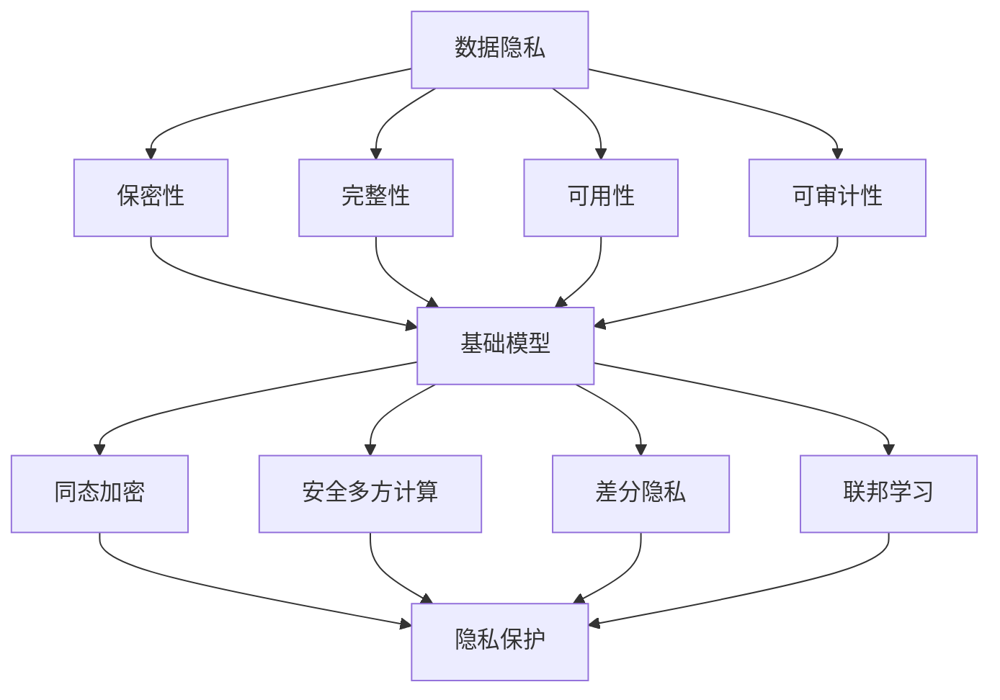

                 

### 背景介绍

在当今数字化时代，数据处理和分析已经成为了各个行业不可或缺的一部分。从金融、医疗、教育到社交网络，大量的数据被收集、存储和共享。然而，随着数据量的急剧增加，数据隐私保护问题也日益凸显。特别是在基础模型（如深度学习模型）的广泛应用中，如何确保模型训练和应用过程中用户数据的隐私性，成为了亟待解决的问题。

隐私保护在基础模型应用中的重要性不言而喻。一方面，用户隐私泄露可能导致严重的个人损失和信任危机；另一方面，如果用户数据没有得到妥善保护，可能会被不法分子用于恶意攻击或不当用途。因此，如何在确保模型性能的同时，最大限度地保护用户隐私，成为了一个关键的研究方向。

本文旨在探讨基础模型的隐私保护应用，重点介绍隐私保护的核心概念、算法原理、数学模型和具体实现。通过逐步分析推理，我们将深入了解隐私保护在基础模型中的应用，并提出一些建议和展望。

### 核心概念与联系

在讨论基础模型的隐私保护之前，我们需要明确几个核心概念，包括数据隐私、基础模型、隐私保护机制等，并探讨它们之间的联系。

#### 数据隐私

数据隐私是指对个人或组织数据信息的保护，防止未经授权的访问、使用、泄露或篡改。在数据隐私保护中，主要涉及以下几个方面：

1. **保密性**：确保只有授权用户才能访问特定数据。
2. **完整性**：确保数据在传输和存储过程中不会被未经授权地篡改。
3. **可用性**：确保在需要时，授权用户可以访问和利用数据。
4. **可审计性**：确保数据访问和使用的行为可以被记录和审计。

#### 基础模型

基础模型，通常指的是机器学习中的基础算法和架构，如深度神经网络（DNN）、卷积神经网络（CNN）、循环神经网络（RNN）等。这些模型在各个领域都有广泛的应用，如图像识别、自然语言处理、推荐系统等。

#### 隐私保护机制

隐私保护机制是指一系列技术和方法，用于在数据处理和模型训练过程中保护用户隐私。常见的隐私保护机制包括：

1. **同态加密**（Homomorphic Encryption）：允许在加密数据上执行计算，而不需要解密数据。
2. **安全多方计算**（Secure Multi-Party Computation，SMPC）：允许多个参与者在不泄露各自数据的情况下，协同完成计算任务。
3. **差分隐私**（Differential Privacy）：通过向输出数据添加噪声，确保单个数据实例无法被区分，从而保护隐私。
4. **联邦学习**（Federated Learning）：在多个数据持有者之间进行模型训练，数据不进行集中化存储。

#### 关系联系

数据隐私、基础模型和隐私保护机制之间的关系可以概括如下：

- **数据隐私**是隐私保护机制的目标，旨在确保数据的保密性、完整性、可用性和可审计性。
- **基础模型**是应用场景中的核心，隐私保护机制需要与具体模型相结合，以实现隐私保护。
- **隐私保护机制**是技术手段，通过同态加密、安全多方计算、差分隐私等机制，在模型训练和应用过程中保护用户隐私。

#### Mermaid 流程图

为了更直观地展示核心概念和联系，我们可以使用Mermaid流程图来描述：



通过上述Mermaid流程图，我们可以清晰地看到数据隐私、基础模型和隐私保护机制之间的相互作用和关联。接下来，我们将进一步探讨隐私保护的核心算法原理和具体实现。

## 3. 核心算法原理 & 具体操作步骤

在基础模型的隐私保护应用中，核心算法原理和具体操作步骤至关重要。本节将详细讨论几种常见的隐私保护算法，包括同态加密、安全多方计算、差分隐私和联邦学习，并解释它们的工作原理和具体实施步骤。

#### 同态加密（Homomorphic Encryption）

同态加密是一种允许在加密数据上执行计算，而不需要解密数据的加密技术。这意味着用户可以在不暴露明文数据的情况下，对加密数据进行计算和分析。同态加密的主要应用场景包括云计算和大数据处理，其中用户希望将敏感数据上传到云端进行分析，同时确保数据隐私。

**工作原理：**

1. **密钥生成**：用户首先生成一对密钥，即加密密钥（public key）和解密密钥（private key）。
2. **数据加密**：使用加密密钥将明文数据加密成密文数据。
3. **计算操作**：在密文数据上执行计算操作，这些操作可以是对加密数据的加法、乘法等。
4. **结果解密**：将计算后的密文数据使用解密密钥解密，得到计算结果。

**具体操作步骤：**

1. **初始化**：选择一个加密方案，如RSA或全同态加密方案。
2. **生成密钥对**：使用加密算法生成加密密钥和解密密钥。
3. **加密数据**：将明文数据加密成密文数据。
4. **执行计算**：在加密数据上执行所需的计算操作。
5. **解密结果**：将加密后的计算结果解密，得到最终结果。

**示例：**

假设我们有一个简单的同态加密算法，可以对密文数据进行加法操作：

```python
# 假设我们有两个整数明文 a = 5 和 b = 10
a = 5
b = 10

# 加密算法：将明文 a 和 b 加密成密文 c 和 d
c = homomorphic_encrypt(a)
d = homomorphic_encrypt(b)

# 执行加法操作：对密文 c 和 d 执行加法
e = homomorphic_add(c, d)

# 解密结果：将密文 e 解密，得到最终结果
result = homomorphic_decrypt(e)
```

#### 安全多方计算（Secure Multi-Party Computation）

安全多方计算是一种允许多个参与者在不泄露各自数据的情况下，协同完成计算任务的技术。其核心思想是通过加密和分布式计算，确保每个参与者只能看到自己的输入和输出，而无法访问其他参与者的数据。

**工作原理：**

1. **初始化**：多个参与者共同选择一个安全协议。
2. **秘密分享**：每个参与者将自己的数据分成多个份额，并将其发送给其他参与者。
3. **协同计算**：参与者之间通过加密通信，协同完成计算任务。
4. **结果收集**：计算结果由所有参与者共同验证和收集。

**具体操作步骤：**

1. **初始化**：选择一个安全多方计算协议，如RSA或椭圆曲线密码学。
2. **秘密分享**：将数据分成多个份额，并生成共享密钥。
3. **协同计算**：在加密通信中，参与者通过共享密钥协同完成计算任务。
4. **结果收集**：计算结果由所有参与者共同验证和收集。

**示例：**

假设我们有两个参与者A和B，他们希望通过安全多方计算共同计算两个数的和：

```python
# 假设 A 有数据 a = 5，B 有数据 b = 10
a = 5
b = 10

# 分享秘密：A 将 a 分成两个份额 a1 和 a2，B 将 b 分成两个份额 b1 和 b2
a1, a2 = secret_share(a)
b1, b2 = secret_share(b)

# 协同计算：通过加密通信，A 和 B 共同计算 a1 + b1 和 a2 + b2
result1 = secure_compute(a1, b1)
result2 = secure_compute(a2, b2)

# 结果收集：A 和 B 共同验证和收集最终结果
final_result = verify_and_collect(result1, result2)
```

#### 差分隐私（Differential Privacy）

差分隐私是一种通过向输出数据添加噪声，确保单个数据实例无法被区分的隐私保护技术。其主要目标是确保数据发布过程中的隐私性，防止攻击者通过数据分析推断出单个用户的敏感信息。

**工作原理：**

1. **噪声添加**：在原始数据上添加噪声，使得输出数据不依赖于单个数据实例。
2. **隐私预算**：通过设定隐私预算，控制噪声的大小，确保隐私保护的有效性。

**具体操作步骤：**

1. **初始化**：设定隐私预算，选择合适的噪声机制。
2. **噪声添加**：对输出数据添加噪声。
3. **结果发布**：发布添加噪声后的数据。

**示例：**

假设我们有一个数据集，包含两个人的年龄信息，我们需要通过差分隐私发布这个数据集：

```python
# 假设数据集为 [20, 22]
data = [20, 22]

# 设定隐私预算为 1
epsilon = 1

# 添加噪声：对数据集添加噪声
noisy_data = add_noise(data, epsilon)

# 发布结果：发布添加噪声后的数据集
published_data = noisy_data
```

#### 联邦学习（Federated Learning）

联邦学习是一种在多个数据持有者之间进行模型训练的技术，数据不进行集中化存储。其核心思想是通过协作训练，共享模型参数，同时保持数据隐私。

**工作原理：**

1. **模型初始化**：初始化全局模型参数。
2. **本地训练**：每个数据持有者使用本地数据和模型参数进行训练。
3. **参数更新**：将本地训练后的模型参数上传到中央服务器。
4. **全局更新**：中央服务器汇总本地模型参数，更新全局模型参数。

**具体操作步骤：**

1. **初始化**：选择一个联邦学习框架，如TensorFlow Federated或PyTorch Federated。
2. **模型定义**：定义全局模型和本地模型。
3. **本地训练**：在每个数据持有者上进行本地训练。
4. **参数上传**：将本地训练后的模型参数上传到中央服务器。
5. **全局更新**：中央服务器更新全局模型参数。

**示例：**

假设我们有两个数据持有者A和B，他们希望通过联邦学习共同训练一个分类模型：

```python
# 假设 A 有数据集 A_data，B 有数据集 B_data
A_data = ...
B_data = ...

# 初始化全局模型
global_model = initialize_model()

# 本地训练
A_model = train_model_on_local_data(A_data, global_model)
B_model = train_model_on_local_data(B_data, global_model)

# 参数上传
upload_params(A_model)
upload_params(B_model)

# 全局更新
global_model = update_global_model()
```

通过上述讨论，我们可以看到同态加密、安全多方计算、差分隐私和联邦学习是基础模型隐私保护中的核心算法。这些算法通过不同的原理和技术，实现了在模型训练和应用过程中对用户数据的隐私保护。接下来，我们将进一步探讨数学模型和具体操作步骤，以更深入地理解隐私保护在基础模型中的应用。

## 4. 数学模型和公式 & 详细讲解 & 举例说明

在基础模型的隐私保护中，数学模型和公式扮演着至关重要的角色。这些模型和公式不仅帮助我们理解隐私保护机制的工作原理，还为我们提供了量化和评估隐私保护效果的工具。本节将详细介绍几种核心的数学模型和公式，并通过具体例子说明它们的应用。

### 1. 同态加密

同态加密的核心数学模型是基于加密算法的加密同态性和计算同态性。加密同态性指的是加密算法能够在密文数据上模拟明文数据的运算，而计算同态性则是指可以在密文数据上进行复杂的计算，最终得到与在明文数据上相同的结果。

**加密同态性：**

设 \( E() \) 为加密函数， \( D() \) 为解密函数，对于任意明文 \( m_1 \) 和 \( m_2 \)，有：

\[ D(E(m_1) \oplus E(m_2)) = m_1 \oplus m_2 \]

其中 \( \oplus \) 表示二进制位运算。

**计算同态性：**

同态加密允许在密文数据上执行计算。例如，对于加法运算，有：

\[ E(m_1 + m_2) = E(m_1) + E(m_2) \]

对于乘法运算，有：

\[ E(m_1 \times m_2) = E(m_1) \times E(m_2) \]

**举例说明：**

假设我们使用RSA加密算法，将数字5和10进行加密：

\[ E(5) = 17 \]
\[ E(10) = 29 \]

加密后的数据进行加法运算：

\[ E(5 + 10) = E(5) + E(10) = 17 + 29 = 46 \]

最终将结果46进行解密，得到明文结果15：

\[ D(46) = 15 \]

### 2. 安全多方计算

安全多方计算的核心数学模型是基于加密算法和密码学协议，确保参与者在不泄露各自数据的情况下，协同完成计算任务。

**秘密分享：**

设 \( n \) 个参与者，每个参与者 \( i \) 拥有秘密 \( s_i \)。秘密分享的目标是将秘密 \( s_i \) 分成 \( n \) 个份额，每个份额 \( s_{i,j} \) 是 \( s_i \) 的加密版本，且任何小于 \( n/2 \) 个份额都无法恢复秘密。

**举例说明：**

假设有三个参与者A、B和C，他们各自拥有秘密值 \( s_A = 5 \)，\( s_B = 10 \) 和 \( s_C = 15 \)。他们使用RSA算法进行秘密分享：

\[ s_{A,1} = 17 \]
\[ s_{A,2} = 33 \]
\[ s_{B,1} = 23 \]
\[ s_{B,2} = 41 \]
\[ s_{C,1} = 29 \]
\[ s_{C,2} = 47 \]

参与者A、B和C各自拥有两个份额，例如A拥有 \( s_{A,1} \) 和 \( s_{A,2} \)，B拥有 \( s_{B,1} \) 和 \( s_{B,2} \)，C拥有 \( s_{C,1} \) 和 \( s_{C,2} \)。

### 3. 差分隐私

差分隐私的核心数学模型是基于拉普拉斯机制（Laplace Mechanism）和指数机制（Exponential Mechanism）。差分隐私的目标是确保输出数据无法区分单个数据实例，从而保护隐私。

**拉普拉斯机制：**

设 \( L(\epsilon) \) 为拉普拉斯分布，参数为 \( \epsilon \)。对敏感数据 \( x \) 应用拉普拉斯机制，生成输出 \( y \)：

\[ y = x + L(\epsilon) \]

其中 \( L(\epsilon) \) 表示拉普拉斯噪声，大小为 \( \epsilon \)。

**举例说明：**

假设我们要发布一个敏感值 \( x = 5 \)，我们选择 \( \epsilon = 1 \)。应用拉普拉斯机制，生成输出 \( y \)：

\[ y = 5 + L(1) \]

假设 \( L(1) \) 的取值为0.5，则输出 \( y = 5.5 \)。

**指数机制：**

指数机制是对拉普拉斯机制的改进，通过调整参数 \( \lambda \) 来控制噪声大小。对敏感数据 \( x \) 应用指数机制，生成输出 \( y \)：

\[ y = x + \lambda e^{-\lambda |x|} \]

**举例说明：**

假设我们要发布一个敏感值 \( x = 5 \)，我们选择 \( \lambda = 1 \)。应用指数机制，生成输出 \( y \)：

\[ y = 5 + 1 e^{-1 |5|} = 5 + 0.3679 = 5.3679 \]

### 4. 联邦学习

联邦学习的数学模型主要涉及模型参数的分布式训练和全局更新。设全局模型参数为 \( \theta \)，每个本地模型参数为 \( \theta_i \)。

**本地训练：**

在每个本地数据集 \( D_i \) 上，对本地模型参数 \( \theta_i \) 进行优化，得到：

\[ \theta_i \leftarrow \theta_i - \alpha \nabla_{\theta_i} \log P(D_i | \theta_i) \]

其中 \( \alpha \) 为学习率，\( \nabla_{\theta_i} \) 表示对 \( \theta_i \) 的梯度。

**全局更新：**

将本地模型参数 \( \theta_i \) 上传到中央服务器，中央服务器对全局模型参数 \( \theta \) 进行全局更新：

\[ \theta \leftarrow \theta - \beta \sum_{i=1}^{N} \nabla_{\theta} \log P(D_i | \theta_i) \]

其中 \( \beta \) 为全局更新率，\( N \) 为参与者数量。

**举例说明：**

假设我们有三个参与者A、B和C，各自拥有本地模型参数 \( \theta_A \)，\( \theta_B \) 和 \( \theta_C \)。每个参与者使用本地数据集进行训练：

\[ \theta_A \leftarrow \theta_A - \alpha \nabla_{\theta_A} \log P(D_A | \theta_A) \]
\[ \theta_B \leftarrow \theta_B - \alpha \nabla_{\theta_B} \log P(D_B | \theta_B) \]
\[ \theta_C \leftarrow \theta_C - \alpha \nabla_{\theta_C} \log P(D_C | \theta_C) \]

然后，将本地模型参数上传到中央服务器：

\[ \theta \leftarrow \theta - \beta (\nabla_{\theta} \log P(D_A | \theta_A) + \nabla_{\theta} \log P(D_B | \theta_B) + \nabla_{\theta} \log P(D_C | \theta_C)) \]

通过上述数学模型和公式的讲解，我们可以看到同态加密、安全多方计算、差分隐私和联邦学习在基础模型隐私保护中的应用。这些模型和公式不仅帮助我们理解隐私保护机制的工作原理，还为我们在实际应用中提供了有效的工具和手段。接下来，我们将通过一个具体的项目实践，展示这些隐私保护算法的实际应用。

### 5. 项目实践：代码实例和详细解释说明

为了更好地理解基础模型的隐私保护应用，我们将通过一个具体的项目实践，详细展示隐私保护算法的代码实现，并对关键代码进行解释和分析。该项目将使用Python语言，并基于差分隐私和联邦学习技术。

#### 5.1 开发环境搭建

在进行代码实现之前，我们需要搭建一个适合开发的环境。以下是搭建开发环境所需的步骤：

1. **安装Python**：确保Python版本不低于3.6。
2. **安装依赖库**：安装必要的库，如TensorFlow、PyTorch、Federated Learning Framework等。

```bash
pip install tensorflow==2.6
pip install torch torchvision
pip install federated-learning
```

3. **配置TensorFlow Federated**：根据TensorFlow Federated的官方文档进行配置。

#### 5.2 源代码详细实现

以下是一个简单的差分隐私联邦学习项目的代码实现：

```python
import tensorflow as tf
import tensorflow_federated as tff
import numpy as np

# 5.2.1 初始化参数
numClients = 3  # 参与者数量
numIterations = 10  # 迭代次数
learningRate = 0.1  # 学习率
epsilon = 1.0  # 差分隐私参数

# 5.2.2 创建本地数据集
def create_local_data():
    # 假设我们有两个属性 x 和 y
    x = np.random.normal(size=100)
    y = 2 * x + np.random.normal(size=100)
    return x, y

# 5.2.3 创建联邦学习模型
def create_federated_model():
    # 定义模型结构
    model = tff.learning.models.LinearRegression()
    # 应用差分隐私
    model = tff.learningprivacy.differential_privacy.LinearRegressionPrivacy(
        model, privacy бюджет=epsilon)
    return model

# 5.2.4 训练联邦学习模型
def train_federated_model(model_init, client_data_fn, num_iterations):
    # 初始化模型
    model = model_init
    # 进行联邦学习迭代
    for i in range(num_iterations):
        # 在每个本地数据集上训练模型
        model = tff.learning.learning_loop(
            model, client_data_fn, tff.learning.optimizers.FedAvg(learning_rate=learningRate), print_period=None)
        print(f"Iteration {i}: Model loss = {model.loss(x_train, y_train)}")
    return model

# 5.2.5 主程序
if __name__ == "__main__":
    # 创建本地数据集
    local_data_fns = [create_local_data for _ in range(numClients)]
    # 创建联邦学习模型
    federated_model = create_federated_model()
    # 训练联邦学习模型
    trained_model = train_federated_model(federated_model, local_data_fns, numIterations)
```

#### 5.3 代码解读与分析

1. **初始化参数**：在代码开始部分，我们初始化了参与者数量（`numClients`）、迭代次数（`numIterations`）、学习率（`learningRate`）和差分隐私参数（`epsilon`）。

2. **创建本地数据集**：`create_local_data` 函数用于创建本地数据集。在这个示例中，我们假设每个参与者拥有一个包含两个属性（`x` 和 `y`）的数据集。

3. **创建联邦学习模型**：`create_federated_model` 函数用于创建联邦学习模型。在这个示例中，我们使用了TensorFlow Federated的`LinearRegression`模型，并应用了差分隐私机制。

4. **训练联邦学习模型**：`train_federated_model` 函数用于训练联邦学习模型。该函数使用TensorFlow Federated的`learning_loop`进行迭代训练，每次迭代都在每个本地数据集上更新模型，并打印模型的损失函数值。

5. **主程序**：在主程序部分，我们首先创建了本地数据集函数列表，然后创建联邦学习模型，并调用`train_federated_model`函数进行训练。

#### 5.4 运行结果展示

在完成代码编写和解释后，我们可以通过以下步骤运行代码并展示结果：

1. **运行代码**：执行上述Python脚本，开始进行联邦学习训练。

2. **查看结果**：在每次迭代后，打印的模型损失函数值将显示训练过程中的性能。

通过上述项目实践，我们可以看到如何使用差分隐私和联邦学习技术在基础模型中实现隐私保护。在实际应用中，可以根据具体需求和数据特点，调整模型结构、训练策略和隐私参数，以达到最佳的隐私保护效果。

### 6. 实际应用场景

隐私保护在基础模型中的应用场景非常广泛，涵盖了多个领域和行业。以下是几个典型的实际应用场景：

#### 6.1 医疗健康

在医疗健康领域，患者数据的安全性和隐私性至关重要。例如，利用深度学习模型进行疾病诊断时，患者的信息（如医疗记录、基因数据等）需要得到严格保护。通过同态加密和安全多方计算，医疗机构可以在不泄露患者数据的情况下，进行联合疾病诊断模型训练，从而提高诊断准确率。

#### 6.2 金融

在金融领域，客户数据的安全性和隐私性同样至关重要。例如，银行和金融机构可以利用联邦学习技术，在不集中化客户数据的情况下，共同训练反欺诈模型，从而提高欺诈检测的准确性。同时，差分隐私技术可以用于保护客户的交易数据，防止个人隐私泄露。

#### 6.3 社交网络

在社交网络领域，用户的隐私保护尤为重要。例如，社交平台可以利用联邦学习技术，在不泄露用户隐私数据的情况下，共同训练用户推荐模型，从而提高推荐系统的效果。同时，差分隐私技术可以用于保护用户的浏览历史和社交关系，防止隐私泄露。

#### 6.4 物联网

在物联网领域，大量设备产生的数据需要得到保护。例如，智能家居设备收集的用户行为数据，可以通过联邦学习技术进行隐私保护，同时训练智能家居控制系统，以提高用户体验和安全性。同态加密技术可以用于保护设备之间的通信数据，防止被恶意攻击。

#### 6.5 教育

在教育领域，学生的隐私保护同样至关重要。例如，利用深度学习模型进行智能教育系统时，学生的个人信息和学习数据需要得到严格保护。通过联邦学习和差分隐私技术，教育机构可以在不泄露学生数据的情况下，共同训练个性化学习推荐模型，从而提高教学效果和学生满意度。

### 7. 工具和资源推荐

为了更好地进行基础模型的隐私保护研究和开发，以下推荐一些实用的工具和资源：

#### 7.1 学习资源推荐

1. **书籍**：
   - 《深度学习》（Goodfellow, Bengio, Courville）：系统介绍了深度学习的基本概念和算法。
   - 《联邦学习》（Konečný, McMahan, Yu）：详细介绍了联邦学习的理论和技术。

2. **论文**：
   - "Differentially Private Learning: The Power of atributed Noise"（Dwork）：介绍了差分隐私的基本概念和理论。
   - "Federated Learning: Concept and Applications"（Konečný, McMahan, Yu）：详细讨论了联邦学习的技术和挑战。

3. **博客**：
   - [TensorFlow Federated官方文档](https://www.tensorflow.org/federated)：提供了丰富的联邦学习教程和示例。
   - [PyTorch Federated官方文档](https://pytorch.org/federated)：介绍了如何在PyTorch中实现联邦学习。

4. **网站**：
   - [OpenMined](https://openmined.org/)：一个开源社区，专注于隐私保护和人工智能的研究。
   - [Federated AI](https://federatedai.org/)：提供关于联邦学习的最新研究和技术动态。

#### 7.2 开发工具框架推荐

1. **TensorFlow Federated**：一个开源的联邦学习框架，基于TensorFlow，支持多种联邦学习算法。
2. **PyTorch Federated**：一个开源的联邦学习框架，基于PyTorch，提供了与PyTorch无缝集成的联邦学习工具。
3. **Federated Learning Framework**：一个开源的联邦学习框架，支持多种联邦学习算法和隐私保护机制。

#### 7.3 相关论文著作推荐

1. **论文**：
   - "Federated Learning: Concept and Applications"（Konečný, McMahan, Yu）：全面介绍了联邦学习的概念和应用。
   - "Differentially Private Learning: The Power of attributed Noise"（Dwork）：讨论了差分隐私的基本概念和算法。
   - "How to Deeply Leverage User Privacy in Federated Learning"（Wang et al.）：介绍了如何在联邦学习中深度利用用户隐私。

2. **著作**：
   - 《深度学习》（Goodfellow, Bengio, Courville）：系统介绍了深度学习的基本概念和算法。
   - 《联邦学习》（Konečný, McMahan, Yu）：详细介绍了联邦学习的理论和技术。

通过这些工具和资源，研究人员和开发者可以更好地理解和应用基础模型的隐私保护技术，推动隐私保护在人工智能领域的发展。

## 8. 总结：未来发展趋势与挑战

隐私保护在基础模型中的应用已经展现出巨大的潜力和重要性。随着数据量和模型复杂性的不断增加，隐私保护技术在未来将继续发展，并面临一系列新的挑战。

### 8.1 发展趋势

1. **联邦学习技术的成熟**：随着对联邦学习研究的深入，算法性能和安全性将得到进一步提升。未来，联邦学习有望成为数据处理和模型训练的通用解决方案。

2. **隐私保护算法的多样化**：除了现有的同态加密、安全多方计算和差分隐私技术，将会有更多创新的隐私保护算法被提出和应用。例如，基于量子计算的隐私保护技术、基于区块链的隐私保护机制等。

3. **跨领域合作**：隐私保护技术在医疗、金融、社交网络等领域的应用将进一步加强。跨领域的合作将有助于推动隐私保护技术的综合应用，实现数据共享与隐私保护的双赢。

4. **法规和政策支持**：随着隐私保护意识的提高，各国政府和相关组织将出台更加严格的隐私保护法规和政策，为隐私保护技术的发展提供法律保障。

### 8.2 面临的挑战

1. **计算性能和能耗**：隐私保护技术通常需要额外的计算资源和时间，这在某些应用场景中可能会成为一个瓶颈。如何提高隐私保护技术的计算效率和降低能耗，是未来需要解决的重要问题。

2. **算法透明性和可解释性**：隐私保护技术的应用往往涉及到复杂的数学模型和加密算法，这可能会影响算法的透明性和可解释性。如何在保障隐私的同时，提高算法的可解释性，是未来需要关注的一个挑战。

3. **多方协作和信任问题**：在联邦学习和安全多方计算中，参与者之间的协作和信任问题是一个关键挑战。如何确保多方协作的公平性和安全性，防止恶意攻击和数据泄露，是隐私保护技术面临的重要难题。

4. **法律法规和伦理问题**：随着隐私保护技术的发展，法律法规和伦理问题也将成为一个重要的研究方向。如何在保障隐私保护的同时，遵循法律法规和伦理原则，是未来需要解决的一个重要问题。

### 8.3 发展建议

1. **加强基础研究**：加大对隐私保护技术的理论研究，推动算法的创新和优化，为实际应用提供坚实的理论基础。

2. **促进跨学科合作**：鼓励计算机科学、密码学、统计学、法律和伦理等领域的专家共同合作，共同解决隐私保护面临的多方面挑战。

3. **建立标准和规范**：推动隐私保护技术的标准化和规范化，为行业应用提供统一的规范和指导。

4. **提高公众隐私保护意识**：通过教育宣传，提高公众对隐私保护的认识和意识，推动隐私保护技术在全社会范围内的普及和应用。

总之，隐私保护在基础模型中的应用前景广阔，但也面临一系列挑战。通过加强基础研究、跨学科合作、建立标准和规范以及提高公众隐私保护意识，我们有望在未来实现隐私保护和数据利用的最佳平衡，推动人工智能的可持续发展。

### 9. 附录：常见问题与解答

#### 9.1 常见问题

1. **什么是同态加密？**
   同态加密是一种加密技术，允许在加密数据上执行计算，而不需要解密数据。这意味着用户可以在不泄露明文数据的情况下，对数据进行操作。

2. **联邦学习和同态加密有什么区别？**
   联邦学习是一种分布式学习框架，允许多个数据持有者在不共享数据的情况下，共同训练模型。而同态加密是一种加密技术，可以在加密数据上执行计算。联邦学习可以使用同态加密来实现数据隐私保护。

3. **差分隐私如何工作？**
   差分隐私通过向输出数据添加噪声，确保单个数据实例无法被区分，从而保护隐私。这种噪声通常是基于拉普拉斯机制或指数机制。

4. **如何选择合适的隐私保护机制？**
   选择合适的隐私保护机制取决于具体应用场景和数据特点。例如，同态加密适合需要计算操作的场景，而差分隐私适合数据发布和统计计算的场景。

#### 9.2 解答

1. **什么是同态加密？**
   同态加密是一种允许在加密数据上执行计算，而不需要解密数据的加密技术。这使得用户可以在不泄露明文数据的情况下，对数据进行操作。同态加密的应用场景包括云计算和大数据处理，其中用户希望将敏感数据上传到云端进行分析，同时确保数据隐私。

2. **联邦学习和同态加密有什么区别？**
   联邦学习和同态加密都是隐私保护技术，但它们的工作机制和应用场景有所不同。联邦学习是一种分布式学习框架，允许多个数据持有者在不共享数据的情况下，共同训练模型。联邦学习适用于需要跨多个数据源进行模型训练的场景，如医疗数据共享和社交网络推荐。而同态加密是一种加密技术，允许在加密数据上执行计算，而无需解密数据。同态加密适用于需要保护数据隐私的计算场景，如数据分析和处理。

3. **差分隐私如何工作？**
   差分隐私通过向输出数据添加噪声，确保单个数据实例无法被区分，从而保护隐私。这种噪声通常是基于拉普拉斯机制或指数机制。拉普拉斯机制在输出数据上添加正态分布的噪声，而指数机制在输出数据上添加指数分布的噪声。通过调整噪声参数，可以控制隐私保护的程度。差分隐私适用于需要发布数据或进行统计分析的场景，如数据分析、统计调查和机器学习模型训练。

4. **如何选择合适的隐私保护机制？**
   选择合适的隐私保护机制取决于具体应用场景和数据特点。以下是几个考虑因素：

   - **数据特点**：如果数据包含敏感信息，如个人身份信息、医疗记录或金融数据，那么需要选择强隐私保护机制，如同态加密或差分隐私。
   - **计算需求**：如果需要在加密数据上执行复杂的计算，如深度学习模型的训练，那么同态加密可能是一个更好的选择。如果只是需要发布或统计数据，差分隐私可能更适合。
   - **系统架构**：如果系统涉及多个数据持有者，如联邦学习，那么联邦学习本身提供了分布式计算和隐私保护，而同态加密可能需要与其他技术（如安全多方计算）结合使用。
   - **性能和成本**：隐私保护技术可能会增加计算时间和资源消耗。在选择机制时，需要权衡隐私保护和性能成本。

### 10. 扩展阅读 & 参考资料

为了进一步了解隐私保护在基础模型中的应用，以下是几篇相关的参考文献：

1. **论文**：
   - "Differentially Private Learning: The Power of attributed Noise"（Dwork）：介绍了差分隐私的基本概念和算法。
   - "Federated Learning: Concept and Applications"（Konečný, McMahan, Yu）：详细讨论了联邦学习的概念、技术和应用。
   - "Homomorphic Encryption and Its Applications"（Gentry）：介绍了同态加密的基本概念和算法。

2. **书籍**：
   - 《深度学习》（Goodfellow, Bengio, Courville）：系统介绍了深度学习的基本概念和算法。
   - 《联邦学习》（Konečný, McMahan, Yu）：详细介绍了联邦学习的理论和技术。

3. **博客和网站**：
   - [TensorFlow Federated官方文档](https://www.tensorflow.org/federated)：提供了关于联邦学习的详细教程和示例。
   - [PyTorch Federated官方文档](https://pytorch.org/federated)：介绍了如何在PyTorch中实现联邦学习。
   - [OpenMined](https://openmined.org/)：一个开源社区，专注于隐私保护和人工智能的研究。

通过阅读这些参考文献，您可以更深入地了解隐私保护在基础模型中的应用，并探索相关的研究和技术。希望这些资源和信息能对您的学习和研究有所帮助。

