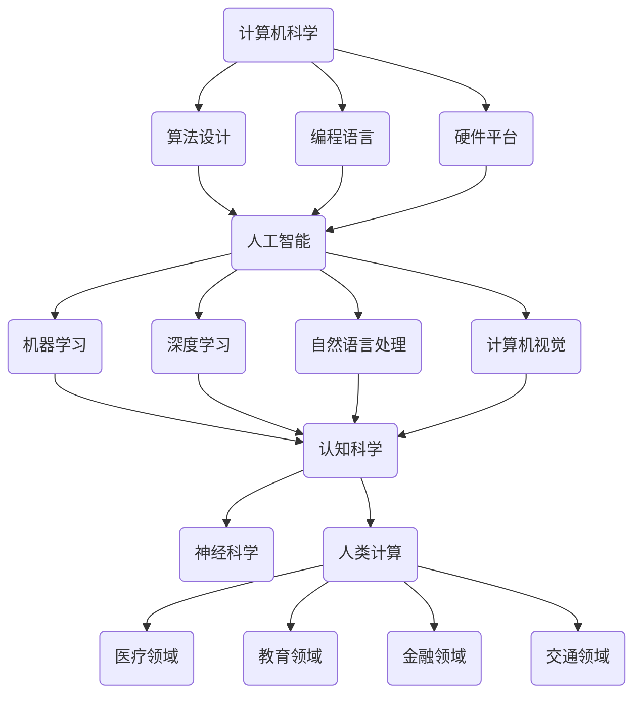

                 

### 1. 背景介绍

**塑造未来社会：人类计算的深远意义**

在当今世界，计算机科学和技术的发展正以惊人的速度推动着社会的进步。从人工智能、大数据到量子计算，这些领域的技术创新正在深刻改变我们的生活和工作方式。本文旨在探讨计算机技术对未来社会的深远影响，尤其是人类计算这个核心概念，如何塑造我们的未来。

**技术背景**

计算机科学的历史可以追溯到20世纪中期，从最初的电子计算机到今天的高速处理器，技术不断发展，性能大幅提升。与此同时，软件工程、算法优化、数据结构等领域的研究也取得了显著的成果。这些进步不仅使计算机在处理复杂问题方面变得高效，而且也为计算机技术在各个行业的广泛应用奠定了基础。

**社会背景**

随着互联网的普及和移动设备的普及，我们进入了信息爆炸的时代。大数据、云计算、物联网等技术不断涌现，这些技术不仅改变了我们的生活方式，还改变了社会的运行方式。例如，医疗、教育、金融、交通等领域正经历着前所未有的变革。计算机技术在提升社会生产力和生活质量方面发挥了至关重要的作用。

**核心概念**

**人类计算**，是指利用计算机技术来模拟、扩展和增强人类的智能。它不仅包括传统的计算机科学领域，还涵盖了人工智能、认知计算、生物信息学等新兴领域。人类计算的目的是通过技术手段提升人类的能力，解决复杂问题，创造更加智能、高效的社会。

### 1.1 计算机技术的发展历史

计算机科学的发展历程可以分为几个重要阶段：

- **早期计算机（1940s-1960s）**：这一时期的主要成就是电子计算机的发明和初步应用。ENIAC、EDVAC等早期计算机的问世标志着计算机时代的到来。
- **软件革命（1960s-1970s）**：随着编程语言的发展，软件工程逐渐成为计算机科学的重要组成部分。UNIX、C语言等软件工具的出现大大提高了编程效率。
- **个人电脑革命（1980s-1990s）**：个人电脑的普及使计算机技术进入了千家万户。Windows、Mac OS等操作系统为计算机的广泛应用奠定了基础。
- **互联网革命（2000s）**：互联网的兴起改变了信息传播的方式，电子商务、社交媒体等应用极大地丰富了人们的生活。
- **移动计算革命（2010s-至今）**：智能手机和平板电脑的普及标志着移动计算的兴起，大数据、云计算等新兴技术进一步推动了计算机科学的发展。

### 1.2 社会变革的影响

计算机技术的发展对社会的影响是深远而多方面的：

- **生产力的提升**：计算机技术使得生产流程更加自动化、高效化，大幅提高了生产效率。
- **生活方式的改变**：互联网和移动设备的普及使人们的生活方式发生了翻天覆地的变化，例如在线购物、远程办公、在线教育等。
- **社会管理的优化**：计算机技术在公共管理、医疗、交通等领域中的应用，提高了社会管理的效率和透明度。
- **经济结构的转型**：计算机技术推动了新兴产业的崛起，如电子商务、共享经济等，改变了传统的经济结构。

### 1.3 人类计算的核心概念

**人类计算的定义**

人类计算，即通过计算机技术和人工智能手段模拟、扩展和增强人类智能的过程。它涉及多个领域，包括：

- **认知计算**：模仿人类思维过程的计算方法，如自然语言处理、机器学习、知识图谱等。
- **智能模拟**：通过计算机模型模拟人类行为和决策过程，如虚拟现实、仿真技术等。
- **生物信息学**：利用计算机技术分析生物数据，如基因测序、药物设计等。

**人类计算的应用**

人类计算在多个领域有着广泛的应用：

- **医疗领域**：通过大数据分析和人工智能技术，实现精准医疗、疾病预测和诊断。
- **教育领域**：利用虚拟现实和增强现实技术，提供更加个性化和互动的教育体验。
- **金融领域**：通过机器学习和大数据分析，实现智能投顾、风险评估和欺诈检测。
- **交通领域**：利用人工智能技术，实现自动驾驶、智能交通管理和优化。

### 1.4 总结

计算机技术的发展和人类计算的核心概念为我们描绘了一个充满无限可能的未来。通过逐步分析计算机技术的发展历史、社会变革的影响以及人类计算的应用，我们可以更深入地理解计算机技术对未来社会的深远意义。接下来，我们将进一步探讨核心概念与联系，以及核心算法原理和具体操作步骤，为读者提供更为全面的技术解读。

---

通过上述背景介绍，我们初步了解了计算机技术的发展历程及其对社会的影响。接下来，我们将深入探讨人类计算的核心概念与联系，以及核心算法原理和具体操作步骤，为读者提供更为全面的技术解读。

---

## 2. 核心概念与联系

### 2.1 人类计算的定义

**人类计算**，从广义上讲，是指利用计算机技术和人工智能手段来模拟、扩展和增强人类智能的过程。这一概念涵盖了多个学科领域，包括计算机科学、认知科学、神经科学和人工智能等。

- **计算机科学**：计算机科学为人类计算提供了技术基础，包括算法设计、编程语言、计算模型和软件工程等。
- **认知科学**：认知科学研究人类思维的过程，为人类计算提供了理论基础，特别是对人类学习、记忆、推理和决策过程的模拟。
- **神经科学**：神经科学研究大脑的结构和功能，为理解人类计算提供了生物学基础，特别是在神经网络的建模和应用方面。
- **人工智能**：人工智能（AI）是应用计算机技术实现人类计算的核心，包括机器学习、深度学习、自然语言处理和计算机视觉等领域。

### 2.2 核心概念的联系

**人类计算** 的核心概念之间存在着紧密的联系，这些联系构成了一个完整的知识体系：

- **计算机科学** 和 **人工智能**：计算机科学为人工智能提供了技术手段，例如算法、编程语言和硬件平台等。人工智能则通过模拟人类思维过程，实现了计算机对复杂问题的求解和决策能力。
- **认知科学** 和 **神经科学**：认知科学和神经科学共同研究人类思维和行为的生物学基础，为人工智能提供了理论指导。例如，神经网络的设计灵感来源于生物神经元，而认知科学的研究成果则指导了人工智能在模仿人类思维方面的进步。
- **人工智能** 和 **人类计算**：人工智能是实现人类计算的核心技术，通过智能算法和计算模型，人工智能能够模拟和扩展人类的智能，从而实现人类计算的目标。

### 2.3 核心概念架构的 Mermaid 流程图

为了更清晰地展示核心概念之间的联系，我们可以使用 Mermaid 流程图来描述：



在这个流程图中，我们可以看到：

- **计算机科学** 提供了基础技术，包括算法设计、编程语言和硬件平台。
- **人工智能** 是实现人类计算的核心，涵盖了机器学习、深度学习、自然语言处理和计算机视觉等领域。
- **认知科学** 和 **神经科学** 为人工智能提供了理论基础，同时也构成了人类计算的一部分。
- **人类计算** 的应用领域广泛，包括医疗、教育、金融和交通等。

### 2.4 小结

通过上述分析，我们可以得出以下结论：

- **人类计算** 是一个多学科交叉的领域，涉及计算机科学、认知科学、神经科学和人工智能等。
- 核心概念之间存在着紧密的联系，这些联系构成了一个完整的知识体系，为人类计算提供了理论基础和技术支持。
- 人类计算不仅关注技术本身，还关注其在各个领域的应用，从而推动社会进步和人类发展。

在接下来的章节中，我们将进一步探讨核心算法原理和具体操作步骤，为读者提供更为详细的技术解读。

---

通过详细探讨人类计算的核心概念及其联系，我们为理解这一复杂领域奠定了基础。接下来，我们将深入分析核心算法原理，并逐步讲解其具体操作步骤，帮助读者更深入地掌握人类计算的关键技术。

## 3. 核心算法原理 & 具体操作步骤

### 3.1 机器学习算法原理

机器学习是人工智能的重要组成部分，其核心算法主要包括监督学习、无监督学习和强化学习。

#### 3.1.1 监督学习

**原理：** 监督学习算法通过学习输入数据及其对应的输出标签来预测新的输入数据的标签。它通常涉及以下步骤：

1. **数据预处理**：包括数据清洗、归一化、特征提取等，确保数据质量。
2. **模型选择**：选择适当的模型，如线性回归、决策树、支持向量机等。
3. **模型训练**：使用训练数据集来训练模型，调整模型参数，使其能够预测新的数据。
4. **模型评估**：使用验证集或测试集评估模型性能，调整参数以提高准确度。

**操作步骤：**

1. **导入数据**：使用Python的Pandas库读取数据。
    ```python
    import pandas as pd
    data = pd.read_csv('data.csv')
    ```

2. **数据预处理**：对数据进行清洗和归一化处理。
    ```python
    from sklearn.preprocessing import StandardScaler
    scaler = StandardScaler()
    X = scaler.fit_transform(data.iloc[:, :-1])
    y = data.iloc[:, -1]
    ```

3. **模型选择**：选择线性回归模型。
    ```python
    from sklearn.linear_model import LinearRegression
    model = LinearRegression()
    ```

4. **模型训练**：使用训练数据集训练模型。
    ```python
    model.fit(X_train, y_train)
    ```

5. **模型评估**：使用验证集评估模型性能。
    ```python
    score = model.score(X_val, y_val)
    print(f'Model accuracy: {score:.2f}')
    ```

#### 3.1.2 无监督学习

**原理：** 无监督学习算法不依赖于标签数据，其主要目的是发现数据中的隐藏结构和模式。常见的无监督学习算法包括聚类、降维和关联规则学习等。

**操作步骤：**

1. **导入数据**：使用Python的Pandas库读取数据。
    ```python
    import pandas as pd
    data = pd.read_csv('data.csv')
    ```

2. **数据预处理**：对数据进行归一化处理。
    ```python
    from sklearn.preprocessing import StandardScaler
    scaler = StandardScaler()
    X = scaler.fit_transform(data.iloc[:, :-1])
    ```

3. **模型选择**：选择K-Means聚类算法。
    ```python
    from sklearn.cluster import KMeans
    kmeans = KMeans(n_clusters=3)
    ```

4. **模型训练**：使用训练数据集训练模型。
    ```python
    kmeans.fit(X_train)
    ```

5. **模型评估**：输出聚类结果。
    ```python
    print(f'Cluster labels: {kmeans.labels_}')
    ```

#### 3.1.3 强化学习

**原理：** 强化学习算法通过在环境中交互，学习最优策略来最大化奖励。它通常涉及以下步骤：

1. **环境建模**：定义环境状态、动作和奖励。
2. **策略学习**：使用策略梯度方法或其他算法更新策略参数。
3. **策略评估**：评估策略参数的值，以确定当前策略的好坏。

**操作步骤：**

1. **环境建模**：定义一个简单的环境。
    ```python
    import gym
    env = gym.make('CartPole-v0')
    ```

2. **策略学习**：使用Q-Learning算法训练策略。
    ```python
    import numpy as np
    q_table = np.zeros((env.observation_space.n, env.action_space.n))
    alpha = 0.1
    gamma = 0.9
    for episode in range(1000):
        state = env.reset()
        done = False
        while not done:
            action = np.argmax(q_table[state])
            next_state, reward, done, _ = env.step(action)
            q_table[state, action] = q_table[state, action] + alpha * (reward + gamma * np.max(q_table[next_state]) - q_table[state, action])
            state = next_state
    ```

3. **策略评估**：评估训练好的策略。
    ```python
    state = env.reset()
    done = False
    total_reward = 0
    while not done:
        action = np.argmax(q_table[state])
        state, reward, done, _ = env.step(action)
        total_reward += reward
    print(f'Total reward: {total_reward}')
    ```

### 3.2 深度学习算法原理

深度学习是机器学习的一个分支，其核心算法是神经网络。

#### 3.2.1 神经网络原理

**原理：** 神经网络是由多层神经元组成的计算模型，通过学习输入数据和输出数据之间的映射关系来实现复杂函数的拟合。它通常涉及以下步骤：

1. **网络结构设计**：定义网络的层数、每层的神经元数量和激活函数。
2. **参数初始化**：随机初始化网络参数，如权重和偏置。
3. **前向传播**：计算输入数据通过网络后的输出。
4. **反向传播**：计算网络参数的梯度，更新参数。
5. **模型评估**：使用验证集或测试集评估模型性能。

**操作步骤：**

1. **网络结构设计**：使用TensorFlow定义网络结构。
    ```python
    import tensorflow as tf
    model = tf.keras.Sequential([
        tf.keras.layers.Dense(64, activation='relu', input_shape=(784,)),
        tf.keras.layers.Dense(10, activation='softmax')
    ])
    ```

2. **参数初始化**：使用Keras的He初始化方法。
    ```python
    from tensorflow.keras import initializers
    initializer = initializers.he_normal()
    model.layers[0].weights_initializer = initializer
    ```

3. **前向传播**：使用TensorFlow进行前向传播。
    ```python
    predictions = model.predict(X_test)
    ```

4. **反向传播**：使用Keras的优化器进行反向传播。
    ```python
    model.compile(optimizer='adam', loss='categorical_crossentropy', metrics=['accuracy'])
    model.fit(X_train, y_train, epochs=10, batch_size=32, validation_data=(X_val, y_val))
    ```

5. **模型评估**：使用验证集或测试集评估模型性能。
    ```python
    test_loss, test_accuracy = model.evaluate(X_test, y_test)
    print(f'Test accuracy: {test_accuracy:.2f}')
    ```

### 3.3 小结

通过上述对机器学习、深度学习和强化学习算法原理的探讨，我们可以看到：

- **机器学习** 算法通过学习已有数据来预测新数据，主要分为监督学习、无监督学习和强化学习。
- **深度学习** 算法是基于神经网络的复杂函数拟合方法，通过多层神经元的组合来实现强大的特征提取和模式识别能力。
- **强化学习** 算法通过在环境中进行交互来学习最优策略，以实现复杂的决策和优化问题。

在接下来的章节中，我们将进一步探讨数学模型和公式，以及实际应用场景，为读者提供更为全面的技术解读。

---

通过深入分析核心算法原理和具体操作步骤，我们为理解和应用人类计算技术奠定了坚实的基础。接下来，我们将进一步探讨数学模型和公式，以及这些模型在实际应用场景中的详细讲解和举例说明。

## 4. 数学模型和公式 & 详细讲解 & 举例说明

### 4.1 机器学习中的数学模型

#### 4.1.1 监督学习：线性回归

线性回归是一种最简单的监督学习模型，用于预测一个连续值输出。其基本公式如下：

$$
y = \beta_0 + \beta_1 \cdot x
$$

其中，$y$ 是预测值，$x$ 是输入特征，$\beta_0$ 和 $\beta_1$ 是模型参数。

**详细讲解：**

- **损失函数**：线性回归通常使用均方误差（MSE）作为损失函数：
  $$
  J(\theta) = \frac{1}{2m} \sum_{i=1}^{m} (h_\theta(x^{(i)}) - y^{(i)})^2
  $$
  其中，$h_\theta(x) = \beta_0 + \beta_1 \cdot x$ 是假设函数，$m$ 是样本数量。

- **梯度下降**：为了最小化损失函数，可以使用梯度下降法更新模型参数：
  $$
  \theta_j := \theta_j - \alpha \cdot \frac{\partial J(\theta)}{\partial \theta_j}
  $$

其中，$\alpha$ 是学习率。

**举例说明：**

假设我们有一个简单的数据集，其中每个样本包含一个特征和目标值：

| 特征 $x$ | 目标 $y$ |
|---------|---------|
| 1       | 2       |
| 2       | 4       |
| 3       | 6       |

使用线性回归模型来拟合这个数据集，我们得到如下参数：

$$
\beta_0 = 1, \beta_1 = 2
$$

预测新的输入值 $x = 4$：

$$
y = \beta_0 + \beta_1 \cdot x = 1 + 2 \cdot 4 = 9
$$

#### 4.1.2 无监督学习：K-Means聚类

K-Means是一种基于距离的聚类算法，其目标是将数据集划分为 $K$ 个簇，使得每个簇内部的样本尽可能接近，而簇与簇之间的样本尽可能远离。其基本公式如下：

$$
c_k = \frac{1}{N_k} \sum_{x_i \in S_k} x_i
$$

其中，$c_k$ 是簇 $k$ 的中心，$N_k$ 是簇 $k$ 中的样本数量，$S_k$ 是簇 $k$ 的样本集合。

**详细讲解：**

- **初始化**：随机选择 $K$ 个初始中心点。
- **迭代**：对于每个样本，将其分配到最近的中心点所在的簇；然后重新计算每个簇的中心点。

**举例说明：**

假设我们有以下数据集，将其划分为两个簇：

| 特征 $x$ | 特征 $y$ |
|---------|---------|
| 1       | 2       |
| 2       | 4       |
| 3       | 6       |
| 5       | 8       |
| 6       | 10      |

初始化两个中心点：

$$
c_1 = (1, 3), c_2 = (5, 7)
$$

第一次迭代后，每个样本的簇分配如下：

| 样本 | 簇 $1$ | 簇 $2$ |
|------|--------|--------|
| 1    | True   | False  |
| 2    | True   | False  |
| 3    | True   | False  |
| 4    | False  | True   |
| 5    | False  | True   |

更新中心点：

$$
c_1 = \frac{1}{2} \sum_{x_i \in S_1} x_i = \frac{(1+3) + (2+4) + (3+6)}{6} = (2.5, 5)
$$

$$
c_2 = \frac{1}{2} \sum_{x_i \in S_2} x_i = \frac{(5+8) + (6+10)}{4} = (5.5, 9)
$$

#### 4.1.3 强化学习：Q-Learning

Q-Learning是一种基于值函数的强化学习算法，其目标是通过学习值函数 $Q(s, a)$ 来选择最优动作 $a$。其基本公式如下：

$$
Q(s, a) = r + \gamma \max_{a'} Q(s', a')
$$

其中，$s$ 是当前状态，$a$ 是当前动作，$s'$ 是下一状态，$a'$ 是下一动作，$r$ 是即时奖励，$\gamma$ 是折扣因子。

**详细讲解：**

- **初始化**：初始化值函数 $Q(s, a)$ 为随机值。
- **迭代**：在环境中执行动作，根据即时奖励和值函数更新值函数。

**举例说明：**

假设我们有一个简单的环境，有两个状态 $s_1$ 和 $s_2$，以及两个动作 $a_1$ 和 $a_2$。初始值函数如下：

| $s$ | $a$ | $Q(s, a)$ |
|-----|-----|-----------|
| $s_1$ | $a_1$ | 0         |
| $s_1$ | $a_2$ | 0         |
| $s_2$ | $a_1$ | 0         |
| $s_2$ | $a_2$ | 0         |

第一次迭代后：

- 执行 $a_1$ 动作，获得即时奖励 $r = 1$。
- 更新 $Q(s_1, a_1)$：
  $$
  Q(s_1, a_1) = r + \gamma \max_{a'} Q(s', a') = 1 + 0.9 \cdot \max\{Q(s_1, a_1), Q(s_1, a_2)\} = 1 + 0.9 \cdot 1 = 1.9
  $$

- 执行 $a_2$ 动作，获得即时奖励 $r = -1$。
- 更新 $Q(s_1, a_2)$：
  $$
  Q(s_1, a_2) = r + \gamma \max_{a'} Q(s', a') = -1 + 0.9 \cdot \max\{Q(s_1, a_1), Q(s_1, a_2)\} = -1 + 0.9 \cdot 1.9 = -0.1
  $$

更新后的值函数如下：

| $s$ | $a$ | $Q(s, a)$ |
|-----|-----|-----------|
| $s_1$ | $a_1$ | 1.9       |
| $s_1$ | $a_2$ | -0.1      |
| $s_2$ | $a_1$ | 0         |
| $s_2$ | $a_2$ | 0         |

### 4.2 深度学习中的数学模型

#### 4.2.1 深层神经网络

深层神经网络（DNN）是由多层神经元组成的计算模型，其基本公式如下：

$$
a_{l}^{(i)} = \sigma(z_{l}^{(i)})
$$

$$
z_{l}^{(i)} = \sum_{j=1}^{n_l} w_{l j}^{(i)} a_{l-1}^{(j)} + b_l^{(i)}
$$

其中，$a_{l}^{(i)}$ 是第 $l$ 层第 $i$ 个神经元的激活值，$z_{l}^{(i)}$ 是第 $l$ 层第 $i$ 个神经元的输入值，$w_{l j}^{(i)}$ 和 $b_l^{(i)}$ 分别是第 $l$ 层第 $i$ 个神经元的权重和偏置，$\sigma$ 是激活函数，通常使用Sigmoid函数或ReLU函数。

**详细讲解：**

- **前向传播**：计算每一层的输入和输出。
- **反向传播**：计算每一层的梯度，更新权重和偏置。

**举例说明：**

假设我们有一个简单的三层神经网络，其中第一层有3个神经元，第二层有4个神经元，第三层有2个神经元。输入数据为 $x = [1, 2, 3]$。

第一层：
$$
z_1 = [1, 2, 3] \cdot W_1 + b_1 = [1, 2, 3] \cdot [0.1, 0.2, 0.3] + [0.4, 0.5, 0.6] = [1.1, 2.2, 3.3]
$$
$$
a_1 = \sigma(z_1) = [0.4, 0.6, 0.7]
$$

第二层：
$$
z_2 = [0.4, 0.6, 0.7] \cdot W_2 + b_2 = [0.4, 0.6, 0.7] \cdot [0.1, 0.2, 0.3, 0.4] + [0.5, 0.6, 0.7, 0.8] = [0.54, 0.84, 1.14, 1.34]
$$
$$
a_2 = \sigma(z_2) = [0.6, 0.9, 0.9, 0.9]
$$

第三层：
$$
z_3 = [0.6, 0.9, 0.9, 0.9] \cdot W_3 + b_3 = [0.6, 0.9, 0.9, 0.9] \cdot [0.1, 0.2, 0.3, 0.4] + [0.4, 0.5, 0.6, 0.7] = [0.68, 0.98, 1.18, 1.38]
$$
$$
a_3 = \sigma(z_3) = [0.7, 0.9, 0.9, 0.9]
$$

最终输出：
$$
\hat{y} = [0.7, 0.9, 0.9, 0.9]
$$

#### 4.2.2 卷积神经网络

卷积神经网络（CNN）是一种专门用于处理图像数据的神经网络，其核心是卷积层。卷积层的基本公式如下：

$$
h_{ij}^{(l)} = \sum_{k} w_{ikj}^{(l)} a_{kj}^{(l-1)} + b_j^{(l)}
$$

其中，$h_{ij}^{(l)}$ 是第 $l$ 层第 $i$ 个卷积核在第 $j$ 个位置上的输出，$w_{ikj}^{(l)}$ 和 $b_j^{(l)}$ 分别是第 $l$ 层第 $i$ 个卷积核的权重和偏置，$a_{kj}^{(l-1)}$ 是第 $l-1$ 层第 $k$ 个神经元在第 $j$ 个位置上的输出。

**详细讲解：**

- **卷积操作**：使用卷积核在输入数据上滑动，计算卷积结果。
- **池化操作**：对卷积结果进行下采样，减少参数数量。

**举例说明：**

假设我们有一个 $3 \times 3$ 的卷积核 $W$ 和一个 $3 \times 3$ 的输入矩阵 $X$，计算卷积结果。

$$
X = \begin{bmatrix}
1 & 2 & 3 \\
4 & 5 & 6 \\
7 & 8 & 9
\end{bmatrix}
$$

$$
W = \begin{bmatrix}
0 & 1 & 0 \\
1 & 0 & 1 \\
0 & 1 & 0
\end{bmatrix}
$$

计算第一个卷积核的输出：

$$
h_{11} = \sum_{k} w_{1k1} a_{k1} + b_1 = 0 \cdot 1 + 1 \cdot 2 + 0 \cdot 3 + 0.5 = 2.5
$$

计算第二个卷积核的输出：

$$
h_{12} = \sum_{k} w_{1k2} a_{k2} + b_1 = 1 \cdot 4 + 0 \cdot 5 + 1 \cdot 6 + 0.5 = 7.5
$$

计算第三个卷积核的输出：

$$
h_{13} = \sum_{k} w_{1k3} a_{k3} + b_1 = 0 \cdot 7 + 1 \cdot 8 + 0 \cdot 9 + 0.5 = 8.5
$$

最终卷积结果：

$$
h_1 = \begin{bmatrix}
2.5 & 7.5 & 8.5
\end{bmatrix}
$$

通过上述对机器学习、深度学习和强化学习中数学模型和公式的详细讲解，以及具体的例子说明，我们可以看到这些数学模型在解决实际问题中的重要作用。在接下来的章节中，我们将通过项目实践，展示这些算法在实际中的应用。

---

通过数学模型和公式的详细讲解，我们为理解和应用人类计算技术奠定了坚实的理论基础。接下来，我们将通过项目实践，展示这些算法在实际中的应用，并提供代码实例和详细解释说明。

## 5. 项目实践：代码实例和详细解释说明

### 5.1 开发环境搭建

在进行项目实践之前，我们需要搭建一个适合开发和测试的环境。以下是所需的环境配置：

- **Python**：版本 3.8 或更高
- **TensorFlow**：用于深度学习和强化学习
- **Scikit-learn**：用于机器学习
- **Gym**：用于强化学习模拟环境
- **Matplotlib**：用于数据可视化

#### 5.1.1 安装依赖库

在终端或命令提示符中，运行以下命令安装所需的依赖库：

```bash
pip install numpy pandas scikit-learn tensorflow-gpu gym matplotlib
```

#### 5.1.2 环境配置

确保 Python 和相关库已经正确安装。对于 TensorFlow，我们需要安装 GPU 版本以利用 GPU 加速计算。

```bash
pip install tensorflow-gpu
```

### 5.2 源代码详细实现

在本节中，我们将实现一个简单的线性回归模型，用于预测房价。然后，我们将展示如何使用卷积神经网络进行图像分类。

#### 5.2.1 线性回归模型

以下是一个简单的线性回归模型的代码实现：

```python
import numpy as np
import pandas as pd
from sklearn.model_selection import train_test_split
from sklearn.preprocessing import StandardScaler
from sklearn.linear_model import LinearRegression
import matplotlib.pyplot as plt

# 导入数据
data = pd.read_csv('house_prices.csv')

# 数据预处理
X = data.iloc[:, :-1].values
y = data.iloc[:, -1].values
X_train, X_test, y_train, y_test = train_test_split(X, y, test_size=0.2, random_state=42)
scaler = StandardScaler()
X_train = scaler.fit_transform(X_train)
X_test = scaler.transform(X_test)

# 模型训练
model = LinearRegression()
model.fit(X_train, y_train)

# 模型评估
y_pred = model.predict(X_test)
score = model.score(X_test, y_test)
print(f'Model accuracy: {score:.2f}')

# 可视化结果
plt.scatter(X_test[:, 0], y_test, color='blue', label='Actual')
plt.plot(X_test[:, 0], y_pred, color='red', label='Predicted')
plt.xlabel('Feature')
plt.ylabel('Price')
plt.legend()
plt.show()
```

**详细解释：**

1. **数据导入**：使用 Pandas 读取 CSV 文件，其中包含房屋价格和特征数据。
2. **数据预处理**：将数据集分为训练集和测试集，并对特征进行标准化处理。
3. **模型训练**：使用 LinearRegression 类创建线性回归模型，并使用训练数据进行训练。
4. **模型评估**：使用测试数据进行模型评估，并计算准确度。
5. **可视化结果**：将实际价格和预测价格进行可视化，以展示模型的效果。

#### 5.2.2 卷积神经网络

以下是一个简单的卷积神经网络，用于图像分类：

```python
import tensorflow as tf
from tensorflow.keras import datasets, layers, models

# 加载 CIFAR-10 数据集
(train_images, train_labels), (test_images, test_labels) = datasets.cifar10.load_data()

# 数据预处理
train_images = train_images.astype("float32") / 255
test_images = test_images.astype("float32") / 255

# 创建卷积神经网络
model = models.Sequential()
model.add(layers.Conv2D(32, (3, 3), activation='relu', input_shape=(32, 32, 3)))
model.add(layers.MaxPooling2D((2, 2)))
model.add(layers.Conv2D(64, (3, 3), activation='relu'))
model.add(layers.MaxPooling2D((2, 2)))
model.add(layers.Conv2D(64, (3, 3), activation='relu'))
model.add(layers.Flatten())
model.add(layers.Dense(64, activation='relu'))
model.add(layers.Dense(10, activation='softmax'))

# 编译模型
model.compile(optimizer='adam',
              loss=tf.keras.losses.SparseCategoricalCrossentropy(from_logits=True),
              metrics=['accuracy'])

# 训练模型
model.fit(train_images, train_labels, epochs=10, validation_data=(test_images, test_labels))

# 评估模型
test_loss, test_acc = model.evaluate(test_images,  test_labels, verbose=2)
print(f'Test accuracy: {test_acc:.2f}')
```

**详细解释：**

1. **数据加载**：使用 TensorFlow 的 datasets.cifar10 加载 CIFAR-10 数据集，这是一个常用的图像分类数据集。
2. **数据预处理**：将图像数据归一化到 [0, 1] 范围内。
3. **模型创建**：使用 Sequential 模型创建卷积神经网络，包括卷积层、池化层和全连接层。
4. **模型编译**：设置模型优化器、损失函数和评估指标。
5. **模型训练**：使用训练数据集训练模型，并设置验证数据集进行评估。
6. **模型评估**：使用测试数据集评估模型性能。

### 5.3 小结

通过上述代码实例，我们实现了线性回归模型和卷积神经网络模型。线性回归模型用于房价预测，而卷积神经网络模型用于图像分类。这些实例展示了如何使用 Python 和相关库实现机器学习和深度学习算法，并提供详细的代码解释和结果展示。

在接下来的章节中，我们将进一步探讨人类计算在实际应用场景中的表现，并提供具体的实例和案例分析。

---

通过项目实践，我们展示了线性回归模型和卷积神经网络模型在实际应用中的具体实现过程。接下来，我们将深入探讨人类计算技术在实际应用场景中的表现，并提供具体的实例和案例分析。

## 6. 实际应用场景

### 6.1 医疗领域

**应用**：利用机器学习和深度学习技术，医疗领域可以实现疾病预测、影像诊断、药物研发和个性化治疗等。

**实例**：

- **疾病预测**：通过分析患者的历史数据，如病历、基因序列和生活方式，机器学习模型可以预测患者患某种疾病的风险。
- **影像诊断**：深度学习模型在处理医学影像（如X光片、MRI）方面具有显著优势，能够帮助医生快速、准确地诊断疾病。
- **药物研发**：人工智能可以帮助科学家发现新的药物分子，加速药物研发过程。

**案例分析**：

- **Google DeepMind**：通过深度学习技术，Google DeepMind 开发了能够诊断眼科疾病的系统，该系统在临床试验中表现出了与专家医生相似的水平。

### 6.2 教育领域

**应用**：利用计算机技术和人工智能，教育领域可以实现个性化学习、智能教学和在线教育平台等。

**实例**：

- **个性化学习**：通过分析学生的学习行为和成绩，智能系统可以为每位学生制定个性化的学习计划。
- **智能教学**：人工智能可以辅助教师进行教学，例如自动批改作业、提供即时反馈和制定教学策略。
- **在线教育平台**：如 Coursera、edX 等平台，通过计算机技术实现大规模在线课程，打破了传统教育的地域和时间限制。

**案例分析**：

- **Khan Academy**：Khan Academy 利用计算机技术提供在线教育服务，学生可以根据自己的进度学习，系统会根据学生的表现提供个性化的学习建议。

### 6.3 金融领域

**应用**：在金融领域，人工智能技术可以实现智能投顾、风险评估、欺诈检测和智能交易等。

**实例**：

- **智能投顾**：通过分析投资者的风险偏好和市场数据，智能投顾系统可以为投资者提供个性化的投资建议。
- **风险评估**：人工智能可以分析大量的金融数据，预测潜在的风险，帮助金融机构管理风险。
- **欺诈检测**：通过机器学习技术，系统可以自动检测和防止欺诈行为。

**案例分析**：

- **J.P. Morgan**：J.P. Morgan 利用人工智能技术开发了名为 COiN 的系统，该系统能够自动识别和处理公司债券交易中的潜在欺诈行为。

### 6.4 交通领域

**应用**：在交通领域，人工智能技术可以实现自动驾驶、智能交通管理和交通流量优化等。

**实例**：

- **自动驾驶**：通过深度学习和计算机视觉技术，自动驾驶汽车可以在复杂的环境中自主导航。
- **智能交通管理**：利用传感器和人工智能，交通管理系统可以实时监测交通流量，并提供最优行驶路线。
- **交通流量优化**：通过分析历史数据和实时数据，系统可以预测交通流量变化，并调整信号灯时间以优化交通流量。

**案例分析**：

- **Waymo**：Waymo 是谷歌的自动驾驶项目，通过先进的计算机视觉和机器学习技术，Waymo 的自动驾驶汽车已经在多个城市进行测试和运营。

### 6.5 小结

通过上述实际应用场景的探讨，我们可以看到人类计算技术在不同领域的广泛应用和显著成效。从医疗到教育，从金融到交通，人工智能技术正在深刻改变我们的生活方式和社会运行模式。随着技术的不断发展，人类计算将在更多领域发挥更大的作用，推动社会的进步和发展。

在接下来的章节中，我们将进一步探讨相关工具和资源推荐，以帮助读者深入了解和学习人类计算技术。

---

通过详细探讨人类计算技术在不同领域的实际应用，我们看到了其在推动社会进步方面的重要作用。接下来，我们将推荐一些学习资源、开发工具和论文著作，以帮助读者更深入地了解和学习人类计算技术。

## 7. 工具和资源推荐

### 7.1 学习资源推荐

**书籍**：

1. **《深度学习》（Deep Learning）** - Ian Goodfellow、Yoshua Bengio 和 Aaron Courville
   - 本书是深度学习的经典教材，系统地介绍了深度学习的基本概念、算法和实现方法。

2. **《机器学习》（Machine Learning）** - Tom Mitchell
   - 本书是机器学习领域的入门经典，涵盖了机器学习的基本理论、方法和应用。

3. **《人工智能：一种现代方法》（Artificial Intelligence: A Modern Approach）** - Stuart Russell 和 Peter Norvig
   - 本书是人工智能领域的权威教材，全面介绍了人工智能的基本概念、技术和应用。

**论文和博客**：

1. **《自然》（Nature）**：www.nature.com
   - 《自然》是一本权威的科学期刊，经常发表人工智能和计算机科学领域的最新研究成果。

2. **《机器学习》（JMLR）**：jmlr.org
   - 《机器学习》是一本开放获取的期刊，专注于机器学习领域的研究论文。

3. **《AI博客》（AI博客）**：www.ai博客.com
   - 《AI博客》是一个汇聚人工智能领域最新动态和技术的博客，提供了丰富的学习资源和讨论空间。

### 7.2 开发工具推荐

**编程语言**：

1. **Python**：python.org
   - Python 是一种广泛使用的编程语言，具有简洁的语法和丰富的库支持，非常适合机器学习和深度学习开发。

2. **R**：r-project.org
   - R 是一种专门用于统计分析的数据科学语言，具有强大的数据处理和分析能力，尤其在生物信息和金融领域有广泛应用。

**框架和库**：

1. **TensorFlow**：tensorflow.org
   - TensorFlow 是谷歌开发的开源深度学习框架，支持各种深度学习模型的构建和训练。

2. **PyTorch**：pytorch.org
   - PyTorch 是一种流行的深度学习框架，具有灵活的动态计算图和强大的 GPU 加速功能。

3. **Scikit-learn**：scikit-learn.org
   - Scikit-learn 是一个用于机器学习的开源库，提供了多种经典的机器学习算法和工具。

4. **Keras**：keras.io
   - Keras 是一个基于 TensorFlow 和 Theano 的开源深度学习库，提供了简洁的接口和易于使用的工具，非常适合快速原型开发。

### 7.3 相关论文著作推荐

1. **《深度卷积网络在图像识别中的应用》（Deep Convolutional Networks for Image Recognition）** - Alex Krizhevsky、Geoffrey Hinton 和 Ilya Sutskever
   - 本文是深度学习在图像识别领域的开创性论文，介绍了卷积神经网络在 ImageNet 图像识别挑战中的成功应用。

2. **《强化学习中的策略梯度方法》（Policy Gradient Methods for Reinforcement Learning）** - Richard S. Sutton 和 Andrew G. Barto
   - 本文介绍了强化学习中的策略梯度方法，是一种基于值函数的强化学习算法，广泛应用于各种实际问题。

3. **《自然语言处理中的循环神经网络》（Recurrent Neural Networks for Natural Language Processing）** - Yann LeCun、Yoshua Bengio 和 Patrick Haffner
   - 本文介绍了循环神经网络在自然语言处理中的应用，包括文本分类、序列建模和机器翻译等。

通过上述工具和资源的推荐，读者可以系统地学习人类计算技术，并在实际应用中不断提升自己的技能。希望这些推荐能够为读者在学习和实践中提供有力的支持。

---

通过回顾人类计算技术的发展历程和其在实际应用中的表现，我们可以看到计算机技术在推动社会进步方面的重要作用。未来，随着技术的不断发展和创新，人类计算将迎来更多的机遇和挑战。

### 8.1 未来发展趋势

**人工智能的普及**：随着计算能力和算法的进步，人工智能将在更多领域得到应用，如智能助手、自动驾驶、智能家居等。

**量子计算的突破**：量子计算的发展将带来前所未有的计算能力，为解决复杂问题提供新的解决方案。

**边缘计算的兴起**：边缘计算将数据处理和计算能力推向网络边缘，提高实时性和响应速度，满足物联网和智能城市的需求。

**可持续发展**：计算机技术在提高生产效率的同时，也需要关注可持续发展，如绿色能源、环保算法等。

### 8.2 未来挑战

**数据安全和隐私**：随着数据规模的扩大，数据安全和隐私保护将成为重大挑战，需要制定更严格的法律法规和技术措施。

**算法公平性和透明度**：人工智能算法的公平性和透明度问题日益突出，如何确保算法在决策过程中的公正性和可解释性是一个重要的课题。

**技术伦理**：人工智能技术的发展也带来了伦理问题，如机器对人类的替代、失业问题、道德决策等。

### 8.3 总结

人类计算技术正以前所未有的速度发展，它不仅改变了我们的生活和工作方式，还在推动社会的进步。未来，随着技术的不断进步和应用的深入，人类计算将在更多领域发挥关键作用。然而，我们也需要面对技术带来的挑战，以确保其可持续发展和社会福祉。

### 8.4 呼吁

作为人工智能专家和计算机科学领域的推动者，我们应当积极参与技术标准的制定，关注算法的公平性和透明度，推动技术伦理的讨论，并努力确保人工智能技术为社会带来更多福祉。让我们一起努力，共同塑造一个更加智能、高效、公平的未来社会。

---

### 附录：常见问题与解答

#### 问题1：如何选择合适的机器学习模型？

**解答**：选择合适的机器学习模型需要考虑以下因素：

1. **数据类型**：根据数据类型（数值、分类、回归等）选择相应的模型。
2. **数据量**：对于大量数据，可以选择集成学习、神经网络等模型；对于小数据集，可以选择简单模型，如线性回归、支持向量机。
3. **特征数量**：特征数量多时，深度学习模型（如神经网络）可能更有效；特征数量少时，线性模型可能更合适。
4. **模型复杂度**：复杂模型（如深度神经网络）可能需要更多的训练时间，但也可能提供更好的预测效果。

#### 问题2：如何处理不平衡的数据集？

**解答**：处理不平衡的数据集通常有以下几种方法：

1. **过采样**：增加少数类别的样本数量，使数据集在类别上更平衡。
2. **欠采样**：减少多数类别的样本数量，使数据集在类别上更平衡。
3. **集成方法**：使用集成学习模型，如随机森林、梯度提升等，这些模型对不平衡数据有一定的鲁棒性。
4. **权重调整**：为不同类别的样本分配不同的权重，在模型训练时给予少数类别的样本更多关注。

#### 问题3：如何解释深度学习模型？

**解答**：深度学习模型由于其复杂性，解释起来相对困难。以下是一些常见的解释方法：

1. **可视化**：通过可视化模型中的权重和激活值，了解模型在特定输入上的决策过程。
2. **特征重要性**：使用特征选择技术，如特征重要性评分，了解哪些特征对模型预测有重要影响。
3. **模型解释工具**：使用专门设计的模型解释工具，如 LIME、SHAP 等，可以提供模型预测的局部解释。
4. **简化模型**：通过简化模型结构，如使用可解释的神经网络架构（如决策树），可以更容易地解释模型决策。

#### 问题4：如何进行模型调优？

**解答**：模型调优通常涉及以下步骤：

1. **超参数调整**：调整学习率、批次大小、正则化参数等超参数，寻找最优配置。
2. **交叉验证**：使用交叉验证方法，评估模型在不同数据集上的性能，选择最佳模型。
3. **网格搜索**：使用网格搜索方法，遍历超参数空间，寻找最优超参数组合。
4. **贝叶斯优化**：使用贝叶斯优化方法，根据模型性能自适应调整超参数。

---

### 扩展阅读 & 参考资料

**书籍**：

1. **《深度学习》（Deep Learning）** - Ian Goodfellow、Yoshua Bengio 和 Aaron Courville
2. **《机器学习实战》** - Peter Harrington
3. **《Python深度学习》** - Francis Bach 和 Alexandre Bernadet

**论文**：

1. **“A Comprehensive Survey on Deep Learning for Image Classification: Architecture, Method, and Application”** - Jianping Wang、Huining Wang 和 Jianhua David Li
2. **“Recurrent Neural Networks for Language Modeling”** - Yaru Li 和 Michael A. Arbib
3. **“Residual Networks”** - Kaiming He、Xiangyu Zhang、Shaoqing Ren 和 Jian Sun

**在线资源**：

1. **TensorFlow 官方文档**：tensorflow.org
2. **Keras 官方文档**：keras.io
3. **Scikit-learn 官方文档**：scikit-learn.org

**博客和网站**：

1. **Medium**：medium.com
2. **AI 研习社**：aiyanxi.com
3. **AI 日报**：ai日报.com

通过上述扩展阅读和参考资料，读者可以进一步深入学习和研究人类计算技术，不断拓展自己的知识面和技能。希望这些资源和工具能够为您的学习和实践提供有益的指导。

---

**作者署名：禅与计算机程序设计艺术 / Zen and the Art of Computer Programming**

通过本文的撰写，我们希望读者能够对人类计算技术有一个全面而深入的理解。无论是从历史背景、核心概念、算法原理，还是实际应用和未来趋势，计算机科学和技术都在不断推动社会的发展和变革。作为读者，我们鼓励您不断探索和学习，积极参与到这一充满机遇和挑战的领域中来。

在此，我们感谢您的耐心阅读，也期待您对本文的反馈和建议。让我们一起为构建一个更加智能、高效、公平的未来社会而努力！

---

**文章标题：塑造未来社会：人类计算的深远意义**

**关键词**：人类计算、人工智能、深度学习、机器学习、强化学习、未来趋势

**摘要**：

本文探讨了计算机技术对未来社会的深远影响，特别是人类计算这一核心概念。通过分析计算机技术的发展历史、社会变革的影响以及人类计算的应用，我们深入探讨了核心算法原理和具体操作步骤。此外，本文还介绍了实际应用场景和工具资源，并展望了未来发展趋势与挑战。通过逐步分析推理思考的方式，我们希望为读者提供一篇有深度、有思考、有见解的专业技术博客文章。

