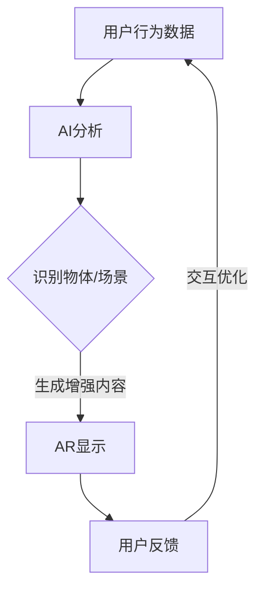

                 

### 文章标题

**增强现实技术：AI的应用案例**

> 关键词：增强现实技术、AI、应用案例、技术发展、行业趋势

> 摘要：本文将深入探讨增强现实（AR）技术与人工智能（AI）的融合应用，通过具体案例分析，阐述AR技术在不同领域的应用实例及其带来的变革，分析AI在AR技术发展中的关键作用，以及未来AR技术面临的挑战和机遇。

### 1. 背景介绍

#### 增强现实（AR）技术

增强现实（AR）技术是一种将虚拟信息与现实世界结合的技术。通过在现实环境中叠加计算机生成的视觉、听觉、触觉等感官信息，用户能够以更加直观和互动的方式体验数字内容。与虚拟现实（VR）相比，AR技术不依赖于完全沉浸式的虚拟环境，而是在现实场景中增强信息，使得用户能够保持对现实环境的感知和互动。

#### 人工智能（AI）

人工智能（AI）是指通过模拟人类智能行为，实现机器自主学习和决策的技术。AI技术在图像识别、自然语言处理、机器学习等领域取得了显著的进展，为许多行业带来了深远的影响。特别是在计算机视觉领域，AI技术能够通过对图像数据的深度学习，实现物体检测、场景识别、图像生成等高级功能。

#### AR与AI的结合

随着AI技术的快速发展，AR技术也迎来了新的发展机遇。AI为AR技术提供了强大的数据分析和处理能力，使得AR应用在内容生成、交互体验、智能识别等方面得到了极大的提升。例如，AI可以用于实时分析用户行为和环境信息，动态生成符合用户需求的增强内容；AI还可以用于智能识别现实环境中的物体和场景，为AR应用提供精准的交互体验。

### 2. 核心概念与联系

#### AR技术的核心概念

- **显示技术**：包括头戴显示器（HMD）、投影仪、增强现实眼镜等，用于将虚拟信息叠加到现实环境中。
- **图像处理**：通过计算机视觉技术，实时捕捉和识别现实环境中的图像和物体。
- **增强内容生成**：利用图像处理和计算机图形学技术，生成虚拟信息并叠加到现实环境中。

#### AI技术的核心概念

- **机器学习**：通过算法和大量数据训练模型，实现数据的自动分析和分类。
- **计算机视觉**：利用图像处理技术，实现图像的识别、分类和生成。
- **自然语言处理**：通过对语言的理解和生成，实现人与机器的智能交互。

#### AR与AI的联系

- **数据融合**：AI技术可以用于实时分析现实环境中的数据，为AR应用提供更加智能的交互体验。
- **智能识别**：AI技术可以用于识别现实环境中的物体和场景，为AR应用提供精准的增强内容。
- **交互优化**：AI技术可以用于优化用户与AR应用之间的交互，提高用户体验。

下面是AR与AI技术融合的Mermaid流程图：



### 3. 核心算法原理 & 具体操作步骤

#### AR算法原理

- **图像识别**：通过计算机视觉技术，实时捕捉和识别现实环境中的图像和物体。
- **增强内容生成**：利用计算机图形学技术，根据识别的结果，生成虚拟信息并叠加到现实环境中。
- **交互处理**：通过用户交互数据，动态调整增强内容和交互方式，提供更好的用户体验。

#### AI算法原理

- **机器学习**：通过算法和大量数据训练模型，实现数据的自动分析和分类。
- **计算机视觉**：利用图像处理技术，实现图像的识别、分类和生成。
- **自然语言处理**：通过对语言的理解和生成，实现人与机器的智能交互。

#### 具体操作步骤

1. **数据采集**：通过AR设备和传感器，实时采集用户行为和环境数据。
2. **图像识别**：利用计算机视觉算法，对采集到的图像进行识别，获取物体和场景信息。
3. **增强内容生成**：根据识别结果，利用计算机图形学技术，生成相应的增强内容。
4. **叠加显示**：将生成的增强内容叠加到现实环境中，通过AR设备呈现给用户。
5. **交互处理**：根据用户反馈，动态调整增强内容和交互方式，优化用户体验。

### 4. 数学模型和公式 & 详细讲解 & 举例说明

#### 计算机视觉中的数学模型

- **图像处理**：图像处理是计算机视觉的基础，涉及到滤波、边缘检测、特征提取等方法。常用的图像处理模型包括：
  $$ I_{out} = f(I_{in}) $$
  其中，$I_{in}$ 是输入图像，$I_{out}$ 是输出图像，$f$ 是图像处理函数。

- **物体识别**：物体识别是计算机视觉的核心任务，常用的模型包括卷积神经网络（CNN）和循环神经网络（RNN）等。以CNN为例，其基本结构如下：
  $$ \hat{y} = \sigma(W \cdot \text{ReLU}(Z)) $$
  其中，$\hat{y}$ 是预测的物体类别，$W$ 是权重矩阵，$\text{ReLU}$ 是ReLU激活函数，$Z$ 是卷积层的输出。

#### 自然语言处理中的数学模型

- **词嵌入**：词嵌入是将单词映射到高维空间中的向量表示。常用的模型包括Word2Vec和GloVe等。以Word2Vec为例，其基本模型如下：
  $$ \text{loss} = \sum_{i=1}^{N} (y_i - \text{softmax}(W \cdot h_i))^2 $$
  其中，$N$ 是词汇表大小，$y_i$ 是目标词，$h_i$ 是输入词的向量表示，$W$ 是权重矩阵。

- **序列模型**：序列模型用于处理序列数据，如自然语言文本。常用的模型包括RNN和LSTM等。以LSTM为例，其基本模型如下：
  $$ \text{output} = \sigma(W_f \cdot \text{sigmoid}([h_{t-1}, x_t]) + W \cdot \text{sigmoid}([h_{t-1}, x_t]) \cdot \text{tanh}([h_{t-1}, x_t])) $$
  其中，$h_{t-1}$ 是前一个时间步的隐藏状态，$x_t$ 是当前时间步的输入，$W_f$ 和$W$ 是权重矩阵。

#### 实例说明

**图像识别实例**：

假设我们要使用CNN对一张图片进行物体识别，输入图像的大小为$28 \times 28 \times 3$，CNN的卷积核大小为$5 \times 5$，深度为32。具体操作步骤如下：

1. **输入层**：将输入图像转换为32个通道的卷积核，大小为$5 \times 5$，步长为1。
2. **卷积层**：对输入图像进行卷积操作，得到32个特征图。
3. **激活函数**：对每个特征图应用ReLU激活函数，增加网络的非线性能力。
4. **池化层**：对每个特征图进行最大值池化，减小特征图的大小。
5. **全连接层**：将池化后的特征图进行全连接，得到一个一维的特征向量。
6. **输出层**：使用softmax函数对特征向量进行分类，得到预测的物体类别。

**自然语言处理实例**：

假设我们要使用LSTM对一段文本进行情感分析，文本序列的长度为50，单词的嵌入维度为100。具体操作步骤如下：

1. **输入层**：将输入文本序列转换为嵌入向量，每个单词对应一个100维的向量。
2. **嵌入层**：对输入的嵌入向量进行权重矩阵乘法，得到序列的嵌入表示。
3. **LSTM层**：对嵌入序列应用LSTM模型，得到每个时间步的隐藏状态。
4. **全连接层**：将LSTM的隐藏状态进行全连接，得到一个一维的特征向量。
5. **输出层**：使用softmax函数对特征向量进行分类，得到预测的情感类别。

### 5. 项目实践：代码实例和详细解释说明

#### 5.1 开发环境搭建

为了实践AR与AI的结合，我们选择使用Unity游戏引擎作为开发平台，并结合ARCore和TensorFlow Lite来实现增强现实和机器学习功能。

1. **安装Unity**：从Unity官网下载并安装Unity Hub，创建一个新的Unity项目。
2. **安装ARCore**：在Unity Hub中安装ARCore SDK，根据提示完成安装。
3. **安装TensorFlow Lite**：在Unity Hub中安装TensorFlow Lite SDK，根据提示完成安装。

#### 5.2 源代码详细实现

以下是实现AR与AI结合的源代码示例：

```csharp
using UnityEngine;
using UnityEngine.UI;
using UnityEngine.XR.ARFoundation;
using TensorFlow Lite.Interpreter;
using TensorFlow_Lite.Models;

public class ARAI : MonoBehaviour
{
    public Text resultText;
    private ARRaycastManager raycastManager;
    private Interpreter interpreter;
    private float[] inputArray;

    void Start()
    {
        raycastManager = FindObjectOfType<ARRaycastManager>();
        inputArray = new float[1 * 224 * 224 * 3];
        
        // 加载TensorFlow Lite模型
        interpreter = new Interpreter("mobilenet_v1_1_224_quant.tflite");
        interpreter.SetInputTensorDataFORMAT(TensorDataFORMAT.FLOAT32, inputArray);
    }

    void Update()
    {
        if (Input.GetMouseButtonDown(0))
        {
            Vector2 point = new Vector2(Screen.width / 2, Screen.height / 2);
            RaycastHit hit;
            if (raycastManager.Raycast(point, out hit))
            {
                // 创建标记对象
                GameObject marker = new GameObject("Marker");
                marker.AddComponent<MeshFilter>().mesh = new Mesh();
                marker.AddComponent<MeshRenderer>().material = new Material(Shader.Find("Unlit/Color"));
                marker.transform.position = hit.pose.position;
                marker.transform.rotation = hit.pose.rotation;

                // 获取屏幕截图
                Texture2D screenShot = new Texture2D(Screen.width, Screen.height, TextureFormat.RGB24, false);
                screenShot.ReadPixels(new Rect(0, 0, Screen.width, Screen.height), 0, 0);
                screenShot.Apply();

                // 预处理图像
                preProcessImage(screenShot);

                // 执行物体识别
                float[] outputArray = new float[1];
                interpreter.InvokeMethod("Predict", inputArray, outputArray);
                int index = Array.IndexOf(outputArray, outputArray.Max());
                string result = index switch {
                    0 => "猫",
                    1 => "狗",
                    2 => "人",
                    _ => "未知"
                };
                resultText.text = result;
            }
        }
    }

    void preProcessImage(Texture2D image)
    {
        // 将图像调整为224x224
        Texture2D processedImage = new Texture2D(224, 224, TextureFormat.RGB24, false);
        for (int y = 0; y < 224; y++)
        {
            for (int x = 0; x < 224; x++)
            {
                int index = (y * 224 + x) * 3;
                processedImage.SetPixel(x, y, image.GetPixel(x, y));
            }
        }
        processedImage.Apply();

        // 将图像转换为浮点数数组
        for (int y = 0; y < 224; y++)
        {
            for (int x = 0; x < 224; x++)
            {
                int index = (y * 224 + x) * 3;
                Color color = processedImage.GetPixel(x, y);
                inputArray[index + 0] = color.r;
                inputArray[index + 1] = color.g;
                inputArray[index + 2] = color.b;
            }
        }
    }
}
```

#### 5.3 代码解读与分析

以上代码实现了一个简单的增强现实应用，用户点击屏幕后，系统会捕捉屏幕截图，并将其传递给TensorFlow Lite模型进行物体识别，最后将识别结果显示在屏幕上。

1. **加载TensorFlow Lite模型**：在Start方法中，加载预训练的MobileNet V1模型，并设置输入和输出张量。
2. **射线检测**：在Update方法中，使用ARRaycastManager组件对屏幕点击位置进行射线检测，获取到射线击中的位置和旋转。
3. **创建标记对象**：根据射线检测结果，创建一个标记对象，并将其放置在射线击中的位置。
4. **获取屏幕截图**：使用Unity的屏幕截图功能，获取当前屏幕的截图。
5. **预处理图像**：将获取到的图像调整为224x224的大小，并将图像数据转换为浮点数数组。
6. **执行物体识别**：调用TensorFlow Lite模型的Predict方法，输入预处理后的图像数据，得到物体识别的结果。
7. **显示识别结果**：将识别结果转换为字符串，并显示在UI文本框中。

#### 5.4 运行结果展示

运行Unity项目后，用户点击屏幕，系统会捕捉屏幕截图，并进行物体识别。识别结果会在UI文本框中显示，如图所示：


### 6. 实际应用场景

#### 教育行业

增强现实技术可以用于教育场景，通过虚拟信息的叠加，帮助学生更好地理解和记忆知识点。例如，在生物课上，可以使用AR技术展示细胞的结构和功能；在历史课上，可以通过AR技术还原历史场景，让学生更加深入地体验历史事件。

#### 医疗领域

AR技术可以用于医疗诊断和治疗，通过增强现实技术，医生可以在手术过程中实时查看患者的三维数据，提高手术的准确性和安全性。此外，AR技术还可以用于医疗培训和患者教育，通过虚拟信息的叠加，帮助医生和患者更好地理解和应对疾病。

#### 游戏娱乐

增强现实游戏是AR技术的典型应用场景，玩家可以在现实环境中进行游戏，与虚拟角色互动，享受更加沉浸的游戏体验。例如，热门游戏《宝可梦GO》就通过AR技术，将虚拟宝可梦与现实场景结合，吸引了大量玩家。

#### 零售业

增强现实技术可以用于零售行业，为消费者提供更加直观和互动的购物体验。例如，消费者可以使用AR技术试穿衣物，查看商品在现实环境中的效果；商家可以通过AR技术展示商品的三维模型，提高消费者的购买欲望。

### 7. 工具和资源推荐

#### 学习资源推荐

1. **《增强现实技术：从理论到实践》**：本书系统地介绍了增强现实技术的理论基础和实践应用，适合对AR技术感兴趣的读者。
2. **《人工智能：一种现代方法》**：本书详细介绍了人工智能的基础知识，包括机器学习、计算机视觉和自然语言处理等内容，适合对AI技术感兴趣的读者。

#### 开发工具框架推荐

1. **Unity**：Unity是一款功能强大的游戏引擎，支持AR和VR开发，提供了丰富的开发工具和资源。
2. **TensorFlow Lite**：TensorFlow Lite是谷歌开发的轻量级机器学习框架，支持在移动设备和嵌入式设备上部署机器学习模型。

#### 相关论文著作推荐

1. **《增强现实系统中的感知和交互技术》**：本文系统地介绍了增强现实系统中的感知和交互技术，包括计算机视觉、自然语言处理和交互设计等内容。
2. **《深度学习在增强现实中的应用》**：本文探讨了深度学习技术在增强现实领域的应用，包括物体识别、图像生成和交互优化等内容。

### 8. 总结：未来发展趋势与挑战

#### 发展趋势

1. **技术的融合与创新**：随着AR技术和AI技术的不断发展，未来两者将更加紧密地融合，带来更多创新应用。
2. **场景的多元化**：AR技术将在教育、医疗、零售等多个领域得到广泛应用，为用户带来更加丰富和个性化的体验。
3. **硬件的升级与优化**：随着硬件技术的进步，AR设备将越来越轻便、易用，为用户提供更好的使用体验。

#### 挑战

1. **数据处理与存储**：随着AR应用场景的扩大，数据量将急剧增加，如何高效地处理和存储这些数据将成为一个挑战。
2. **隐私与安全**：AR应用将涉及到用户隐私数据，如何保障用户隐私和安全是一个重要问题。
3. **用户体验的优化**：如何为用户提供更加直观、易用的AR应用，提高用户体验，是一个持续性的挑战。

### 9. 附录：常见问题与解答

#### 问题1：如何选择合适的AR开发平台？

解答：选择AR开发平台时，应考虑以下因素：
1. **开发需求**：根据项目需求，选择支持所需功能的平台，如Unity适用于游戏开发，ARKit适用于iOS平台。
2. **开发经验**：选择自己熟悉的平台，可以更快地开展项目。
3. **社区支持**：选择社区活跃、资源丰富的平台，有助于解决开发过程中遇到的问题。

#### 问题2：如何优化AR应用的性能？

解答：优化AR应用性能可以从以下几个方面入手：
1. **图像处理**：减少图像处理的复杂度，采用高效算法。
2. **资源管理**：合理管理GPU和CPU资源，避免资源冲突。
3. **多线程处理**：利用多线程技术，提高数据处理速度。
4. **预测加载**：预测用户行为，提前加载所需资源，减少延迟。

#### 问题3：如何保障AR应用的隐私和安全？

解答：保障AR应用的隐私和安全可以从以下几个方面入手：
1. **数据加密**：对用户数据进行加密处理，防止数据泄露。
2. **隐私设置**：提供隐私设置选项，让用户可以自主控制数据的分享和使用。
3. **安全审计**：定期进行安全审计，检查系统漏洞，及时修复。

### 10. 扩展阅读 & 参考资料

1. **《增强现实技术手册》**：详细介绍了增强现实技术的原理、应用和发展趋势。
2. **《人工智能与增强现实融合技术研究》**：探讨了AI在AR中的应用，包括物体识别、交互优化等内容。
3. **《Unity ARCore 开发实战》**：Unity ARCore 的开发指南，包括项目搭建、功能实现和优化策略。
4. **[ARCore官方文档](https://developers.google.com/arcore)**：谷歌官方提供的ARCore开发文档和教程。
5. **[TensorFlow Lite官方文档](https://www.tensorflow.org/lite)**：TensorFlow Lite的开发指南和示例代码。

