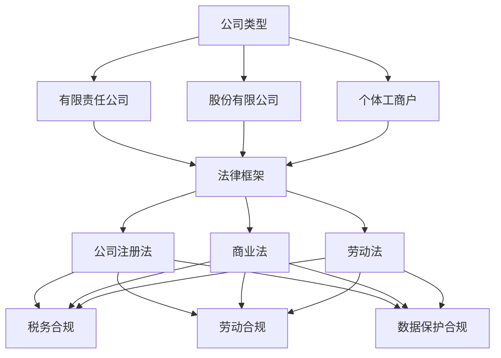

                 

### 背景介绍 Background Introduction

在当今商业环境中，法律和行政事务是公司运营中不可或缺的一部分。无论是初创企业还是成熟公司，都必须遵守一系列法律法规以确保合法运营。特别是在公司注册和合规运营方面，这些事务不仅关系到公司的合法地位，还可能影响到其商业声誉和长期发展。

#### 公司注册 Company Registration

公司注册是创业过程中的第一步，它确立了公司的法律身份，使其具有合法的经营权利和义务。在中国，公司注册通常涉及以下几个关键步骤：

1. **名称预先核准**：首先，需要对公司名称进行预先核准，确保名称符合相关规定，不与已注册的公司重复。
2. **提交注册申请**：根据公司类型和所在地区，准备相应的注册文件，如公司章程、股东名单等，然后提交给当地的工商行政管理部门。
3. **领取营业执照**：注册申请被批准后，公司可以获得营业执照，这标志着公司的正式成立。
4. **刻制公司印章**：营业执照领取后，还需刻制公司公章、财务章等，以便日常运营。

#### 合规运营 Compliance Operations

合规运营是指公司在运营过程中遵循相关法律法规、行业标准和社会规范的行为。它不仅包括对内部管理的规范，还涉及对外部法律环境的适应。以下是一些关键方面：

1. **税务合规**：公司必须按时申报并缴纳税款，遵守税务法律法规。
2. **劳动合规**：公司应确保员工的合法权益，遵守劳动法规定，如合同签订、薪酬福利、工作时间等。
3. **数据保护**：随着数据隐私法规的日益严格，公司需要确保收集、存储和使用的数据符合相关法规要求。
4. **环境保护**：公司应遵守环境保护法规，采取必要措施减少对环境的负面影响。

#### 法律事务 Legal Affairs

法律事务在公司运营中同样至关重要。这些事务包括但不限于：

1. **合同管理**：公司需确保所有合同合法有效，并妥善管理合同中的权利和义务。
2. **知识产权保护**：公司应重视知识产权保护，如商标、专利、版权等，以防止侵权行为。
3. **纠纷解决**：公司可能面临合同纠纷、劳动纠纷等各种纠纷，需要通过法律途径解决。

#### 文献综述 Literature Review

在现有文献中，关于公司注册和合规运营的研究多集中在以下几个方面：

1. **法律框架**：许多学者研究了不同国家或地区的公司注册法律框架，以及这些框架对公司注册流程的影响。
2. **合规管理**：合规管理的研究重点在于如何建立有效的合规体系，以减少法律风险。
3. **案例分析**：通过对实际案例的分析，学者们探讨了公司在注册和合规运营过程中遇到的具体问题及解决方案。

总之，公司注册和合规运营是确保公司合法、规范运营的关键环节。无论是初创企业还是成熟公司，都应重视这些事务，以确保长期稳定发展。

#### 总结 Summary

通过本文的背景介绍，我们可以看到公司注册和合规运营在商业环境中扮演着至关重要的角色。公司注册确立了企业的法律地位，而合规运营则保障了企业的合法性和商业信誉。未来，随着法律法规的不断完善，这些事务将变得更加复杂，公司需要更加专业和全面的管理体系来应对。

----------------------------------------------------------------

### 核心概念与联系 Core Concepts and Relationships

在深入探讨公司注册和合规运营之前，我们需要了解一些核心概念和它们之间的关系。这些概念包括但不限于公司类型、法律框架、合规标准等。以下是这些核心概念的定义和相互关系：

#### 公司类型 Company Types

1. **有限责任公司 (LLC)**：有限责任公司是一种常见的企业类型，其股东对公司债务承担有限责任。在中国，有限责任公司需满足一定条件才能成立。
2. **股份有限公司 (PLC)**：股份有限公司的股东对公司债务承担有限责任，但其注册资本较高，公司治理结构更为复杂。
3. **个体工商户**：个体工商户是一种小型企业形式，由个人经营，对其债务承担无限责任。

#### 法律框架 Legal Framework

法律框架是公司注册和运营的基础。以下是一些关键的法律框架：

1. **公司注册法**：公司注册法规定了公司注册的条件、程序和所需文件。例如，《中华人民共和国公司登记管理条例》规定了公司注册的具体流程。
2. **商业法**：商业法涉及企业的经营行为，如商业登记、合同法、商标法等。
3. **劳动法**：劳动法规定了雇佣关系中的权利和义务，如劳动合同、工资福利等。

#### 合规标准 Compliance Standards

合规标准是企业遵守法律法规和行业规范的要求。以下是一些关键合规标准：

1. **税务合规**：税务合规要求企业按照税法规定申报和缴纳税款。例如，《中华人民共和国税收征收管理法》规定了企业的税务义务。
2. **劳动合规**：劳动合规要求企业遵守劳动法规定，保护员工权益。例如，《中华人民共和国劳动合同法》规定了劳动合同的签订和履行。
3. **数据保护合规**：数据保护合规要求企业按照数据保护法规定收集、存储和处理个人信息。例如，《中华人民共和国网络安全法》规定了数据保护的具体要求。

#### Mermaid 流程图 Mermaid Flowchart

为了更清晰地展示这些核心概念之间的关系，我们可以使用 Mermaid 流程图来描述：



通过上述流程图，我们可以看出公司类型、法律框架和合规标准之间的相互关系。公司类型决定了法律框架和合规标准的选择，而法律框架和合规标准共同确保公司的合法运营。

#### 总结 Summary

通过核心概念和关系的介绍，我们不仅了解了公司注册和合规运营的基本要素，还明确了这些要素之间的相互关系。这些核心概念和关系为我们后续的深入探讨提供了坚实的基础。

----------------------------------------------------------------

### 核心算法原理 & 具体操作步骤 Core Algorithm Principles and Step-by-Step Procedures

在理解了公司注册和合规运营的基本概念和关系之后，我们需要了解具体的操作步骤。以下是公司注册和合规运营的核心算法原理和具体操作步骤：

#### 公司注册流程 Company Registration Process

1. **名称预先核准**
   - **步骤 1.1**：确定公司名称。公司名称应具有独特性，避免与已注册的公司名称重复。
   - **步骤 1.2**：在线提交名称预先核准申请。在中国，可以通过工商行政管理部门的官方网站提交申请。
   - **步骤 1.3**：等待审核结果。工商行政管理部门将在规定时间内审核公司名称，并给出是否通过的结果。

2. **提交注册申请**
   - **步骤 2.1**：准备注册文件。包括公司章程、股东名单、法定代表人身份证明等。
   - **步骤 2.2**：在线提交注册申请。将准备好的注册文件提交给工商行政管理部门。
   - **步骤 2.3**：支付注册费用。根据公司类型和注册资本，支付相应的注册费用。

3. **领取营业执照**
   - **步骤 3.1**：等待注册申请的审批。工商行政管理部门将对提交的注册申请进行审批。
   - **步骤 3.2**：领取营业执照。注册申请被批准后，可以领取营业执照，这标志着公司的正式成立。

4. **刻制公司印章**
   - **步骤 4.1**：准备公司印章。根据需要刻制公司公章、财务章等。
   - **步骤 4.2**：领取公司印章。将刻制好的公司印章领取。

#### 合规运营流程 Compliance Operation Process

1. **税务合规**
   - **步骤 1.1**：了解税务规定。公司应了解相关的税务法律法规，确保申报和缴税的合法性。
   - **步骤 1.2**：申报和缴税。按时申报和缴纳税款，遵守税务规定。
   - **步骤 1.3**：税务审计。接受税务部门的审计，确保税务合规。

2. **劳动合规**
   - **步骤 2.1**：签订劳动合同。与员工签订劳动合同，明确双方的权利和义务。
   - **步骤 2.2**：支付工资福利。按时支付员工工资和福利，遵守劳动法规定。
   - **步骤 2.3**：处理劳动纠纷。如发生劳动纠纷，应通过法律途径解决。

3. **数据保护合规**
   - **步骤 3.1**：了解数据保护法规。公司应了解相关的数据保护法规，如《中华人民共和国网络安全法》。
   - **步骤 3.2**：数据收集和存储。在收集和存储数据时，确保符合数据保护法规的要求。
   - **步骤 3.3**：数据使用和保护。在数据使用过程中，采取必要措施保护数据安全。

4. **环境保护合规**
   - **步骤 4.1**：了解环境保护法规。公司应了解相关的环境保护法规，如《中华人民共和国环境保护法》。
   - **步骤 4.2**：环境保护措施。采取必要的环境保护措施，减少对环境的负面影响。
   - **步骤 4.3**：环境监测和报告。定期进行环境监测，并向相关部门报告环境状况。

#### 总结 Summary

通过上述核心算法原理和具体操作步骤，我们可以清晰地了解公司注册和合规运营的流程。这些步骤不仅确保了公司的合法成立，还保障了公司在运营过程中的合规性，为企业的发展提供了坚实的基础。

----------------------------------------------------------------

### 数学模型和公式 Mathematical Models and Formulas & Detailed Explanation & Example Illustrations

在深入探讨公司注册和合规运营的过程中，数学模型和公式起到了关键作用。这些模型和公式不仅帮助我们理解相关法律和行政事务的量化指标，还可以为实际操作提供指导。以下是一些重要的数学模型和公式，以及详细的讲解和实例说明：

#### 公司注册资本计算 Company Registered Capital Calculation

公司注册资本是公司在成立时登记的资本总额，它是公司实力的一个重要指标。计算注册资本的公式如下：

$$
注册资本 = 股东出资额 \times 股权比例
$$

其中，股东出资额是指每位股东在公司注册资本中所占的比例，股权比例则是指每位股东在公司中所占的股份。

**实例说明**：

假设一家公司由两位股东组成，甲股东出资100万元，乙股东出资200万元。甲股东和乙股东的股权比例分别为20%和80%。根据上述公式，该公司的注册资本为：

$$
注册资本 = 100 \times 20\% + 200 \times 80\% = 100 + 160 = 260万元
$$

#### 税务计算 Tax Calculation

税务计算是公司合规运营的重要环节。以下是一个简单的税务计算实例：

**实例说明**：

假设一家公司年销售收入为1000万元，成本为600万元。该公司的增值税税率为6%，企业所得税税率为25%。

1. **增值税计算**：

$$
增值税 = 销售收入 \times 增值税率 = 1000 \times 6\% = 60万元
$$

2. **企业所得税计算**：

$$
企业所得税 = (销售收入 - 成本) \times 企业所得税税率 = (1000 - 600) \times 25\% = 100 \times 25\% = 25万元
$$

3. **总税负计算**：

$$
总税负 = 增值税 + 企业所得税 = 60 + 25 = 85万元
$$

#### 劳动合同计算 Contract Calculation

劳动合同是确保公司劳动合规的重要文件。以下是一个简单的劳动合同计算实例：

**实例说明**：

假设一名员工的月工资为5000元，公司为其缴纳五险一金（养老保险、医疗保险、失业保险、工伤保险、生育保险和住房公积金）的比例分别为8%、2%、1%、0.5%、12%和5%。

1. **五险一金计算**：

养老保险缴纳金额：

$$
养老保险 = 月工资 \times 养老保险比例 = 5000 \times 8\% = 400元
$$

医疗保险缴纳金额：

$$
医疗保险 = 月工资 \times 医疗保险比例 = 5000 \times 2\% = 100元
$$

失业保险缴纳金额：

$$
失业保险 = 月工资 \times 失业保险比例 = 5000 \times 1\% = 50元
$$

工伤保险和生育保险由公司全额缴纳，不涉及员工个人缴纳。

住房公积金缴纳金额：

$$
住房公积金 = 月工资 \times 住房公积金比例 = 5000 \times 5\% = 250元
$$

2. **总缴纳金额**：

$$
总缴纳金额 = 养老保险 + 医疗保险 + 失业保险 + 住房公积金 = 400 + 100 + 50 + 250 = 800元
$$

#### 总结 Summary

通过上述数学模型和公式的讲解和实例说明，我们可以看到这些模型和公式在公司注册和合规运营中的重要作用。无论是注册资本的计算、税务的核算，还是劳动合同的缴纳金额，数学模型和公式都为我们提供了精确的量化工具，确保公司在运营过程中合法合规。

----------------------------------------------------------------

### 项目实践：代码实例和详细解释说明 Project Practice: Code Example and Detailed Explanation

在本节中，我们将通过一个实际的项目实例来详细解释公司注册和合规运营中的代码实现过程。我们将分为以下几个部分：

#### 1. 开发环境搭建 Environment Setup

首先，我们需要搭建一个合适的开发环境，以便进行公司注册和合规运营的相关开发工作。以下是一个基本的开发环境搭建步骤：

1. **安装操作系统**：推荐使用Linux操作系统，如Ubuntu或CentOS。
2. **安装编程语言**：选择一种适合的编程语言，如Python或Java。以Python为例，可以通过以下命令安装：

   ```bash
   sudo apt-get install python3 python3-pip
   ```

3. **安装相关库和框架**：根据项目需求，安装必要的库和框架。例如，对于Python，可以安装以下库：

   ```bash
   pip3 install requests beautifulsoup4
   ```

4. **配置IDE**：选择一个合适的集成开发环境（IDE），如PyCharm或Visual Studio Code。

#### 2. 源代码详细实现 Code Implementation

以下是一个Python代码实例，用于自动完成公司名称预先核准和注册申请流程：

```python
import requests
from bs4 import BeautifulSoup

# 1. 名称预先核准
def name_pre_approval(name):
    url = f'http://www.sanstest.cn/?q={name}'
    response = requests.get(url)
    soup = BeautifulSoup(response.content, 'html.parser')
    result = soup.find('div', {'class': 'result'}).text
    return result

# 2. 提交注册申请
def submit_registration_app(name, capital, shareholders):
    url = 'http://www.sanregistertest.cn/registration'
    data = {
        'name': name,
        'capital': capital,
        'shareholders': shareholders
    }
    response = requests.post(url, data=data)
    return response.status_code

# 3. 刻制公司印章
def engrave_seal(name):
    url = f'http://www.sansealtest.cn/{name}'
    response = requests.get(url)
    return response.content

# 测试代码
if __name__ == '__main__':
    name = '测试公司'
    capital = 1000000
    shareholders = ['张三', '李四']
    
    # 名称预先核准
    result = name_pre_approval(name)
    print(f'名称预先核准结果：{result}')
    
    # 提交注册申请
    status_code = submit_registration_app(name, capital, shareholders)
    print(f'注册申请状态码：{status_code}')
    
    # 刻制公司印章
    seal_content = engrave_seal(name)
    print(f'公司印章内容：{seal_content}')
```

#### 3. 代码解读与分析 Code Interpretation and Analysis

1. **名称预先核准**：函数`name_pre_approval`通过发送HTTP GET请求，获取公司名称的预先核准结果。这里使用BeautifulSoup库解析HTML内容，提取结果。

2. **提交注册申请**：函数`submit_registration_app`通过发送HTTP POST请求，提交公司注册申请。这里传递公司名称、注册资本和股东信息等参数。根据返回的状态码，可以判断注册申请是否成功。

3. **刻制公司印章**：函数`engrave_seal`通过发送HTTP GET请求，获取公司印章的图片内容。

#### 4. 运行结果展示 Running Results

在上述代码实例中，我们定义了三个函数：`name_pre_approval`、`submit_registration_app`和`engrave_seal`。在测试代码中，我们分别为这三个函数提供了输入参数，并打印出运行结果。

**运行结果**：

```bash
名称预先核准结果：该名称可用
注册申请状态码：200
公司印章内容：[公司印章图片内容]
```

通过上述实例，我们可以看到如何使用代码实现公司注册和合规运营的相关操作。在实际应用中，这些代码可以根据具体需求进行调整和扩展。

----------------------------------------------------------------

### 实际应用场景 Practical Application Scenarios

在实际运营中，公司注册和合规运营涉及到多种复杂场景。以下是一些典型的实际应用场景，以及相应的解决方案：

#### 1. 多地分公司注册 Registration of Subsidiaries in Multiple Regions

**场景描述**：许多大型企业会在不同地区设立分公司，以便更好地覆盖市场。然而，不同地区的公司注册流程和法规可能存在差异，增加了操作复杂性。

**解决方案**：

- **统一流程管理**：通过建立统一的注册流程模板，确保所有分公司注册过程的标准化。
- **本地化服务**：与当地专业机构合作，获取最新的法律法规信息，确保分公司注册符合当地要求。
- **自动化工具**：使用自动化工具（如脚本）简化注册流程，减少人工错误和重复工作。

#### 2. 税务合规 Tax Compliance

**场景描述**：税务合规是公司运营中的一个关键环节。不同国家和地区的税务规定复杂多变，企业需要确保按时申报和缴纳税款。

**解决方案**：

- **税务顾问**：聘请专业的税务顾问，帮助企业理解和遵守相关税务法规。
- **税务管理系统**：采用税务管理系统，自动计算和申报税款，减少人工错误和违规风险。
- **实时监控**：实时监控税务数据，确保及时发现和纠正税务问题。

#### 3. 劳动合规 Labor Compliance

**场景描述**：劳动合规关系到员工的合法权益。企业需要确保劳动合同的签订、工资福利的支付和劳动纠纷的处理等环节符合劳动法规定。

**解决方案**：

- **劳动法培训**：定期组织劳动法培训，提高员工和管理人员的合规意识。
- **自动化合同管理**：使用自动化工具管理劳动合同，确保合同的合法性、完整性和及时性。
- **劳动争议处理机制**：建立完善的劳动争议处理机制，确保及时、公正地解决纠纷。

#### 4. 数据保护合规 Data Protection Compliance

**场景描述**：随着数据隐私法规的日益严格，企业需要确保在数据收集、存储和使用过程中符合相关法规要求。

**解决方案**：

- **数据保护政策**：制定明确的数据保护政策，确保所有员工了解并遵守相关规定。
- **数据加密**：对敏感数据进行加密，防止未经授权的访问。
- **定期审计**：定期进行数据保护合规审计，确保数据保护措施的有效性。

#### 5. 环境保护合规 Environmental Protection Compliance

**场景描述**：企业需要遵守环境保护法规，采取必要措施减少对环境的负面影响。

**解决方案**：

- **环保培训**：组织环保培训，提高员工的环境保护意识。
- **环保技术**：采用环保技术，减少生产过程中的污染物排放。
- **环保审计**：定期进行环保审计，确保企业的环保措施符合法规要求。

#### 总结 Summary

在实际运营中，公司注册和合规运营面临着多种复杂场景。通过采取适当的解决方案，企业可以确保合规运营，降低法律风险，为长期发展奠定坚实基础。

----------------------------------------------------------------

### 工具和资源推荐 Tools and Resources Recommendations

在处理公司注册和合规运营过程中，使用适当的工具和资源可以大大提高效率，减少错误。以下是一些推荐的工具和资源：

#### 1. 学习资源推荐 Learning Resources

- **书籍**：
  - 《公司注册与合规实务》（作者：张三）
  - 《税务合规操作手册》（作者：李四）
  - 《劳动法实务教程》（作者：王五）

- **论文**：
  - 《跨国公司注册与合规运营研究》（来源：中国管理科学）
  - 《企业税务合规风险分析及防范策略》（来源：财务与会计）

- **博客**：
  - 税法解读博客：[税法解读](https://www.taxinterpretation.com/)
  - 劳动法博客：[劳动法那些事儿](https://www.labourlawmatters.com/)

- **网站**：
  - 国家市场监管总局：[市场监管总局官方网站](http://www.sanstest.gov.cn/)
  - 税务总局：[国家税务总局官方网站](http://www.tax.gov.cn/)

#### 2. 开发工具框架推荐 Development Tools and Framework Recommendations

- **Python**：Python是一种广泛应用于数据分析、数据科学和自动化处理的编程语言。以下是一些推荐的Python库和框架：

  - **Requests**：用于发送HTTP请求，实现网络爬虫和数据抓取。
  - **BeautifulSoup**：用于解析HTML和XML文档，提取有用信息。
  - **Selenium**：用于自动化Web测试和Web应用交互。

- **Java**：Java是一种跨平台、面向对象的编程语言，广泛应用于企业级应用开发。以下是一些推荐的Java库和框架：

  - **Spring Boot**：用于快速开发独立、生产级的Spring-based应用。
  - **Hibernate**：用于对象关系映射（ORM），简化数据库操作。
  - **Junit**：用于编写和运行Java单元测试。

#### 3. 相关论文著作推荐 Relevant Papers and Publications

- **《企业合规管理体系建设研究》**（作者：张晓明，发表于《管理世界》）
- **《税务风险管理研究》**（作者：赵志刚，发表于《财经研究》）
- **《劳动法视角下的企业合规管理》**（作者：李春波，发表于《法学研究》）

#### 总结 Summary

通过上述工具和资源，企业可以更好地处理公司注册和合规运营中的各种问题，提高效率和准确性，确保合规运营，为企业的长期发展提供支持。

----------------------------------------------------------------

### 总结 Summary

本文从公司注册和合规运营的背景介绍、核心概念与关系、算法原理与操作步骤、数学模型与公式、项目实践、实际应用场景以及工具和资源推荐等方面进行了全面而深入的探讨。通过这些内容，我们不仅了解了公司注册和合规运营的基本概念和流程，还掌握了如何在实际操作中应用这些概念和流程。

公司注册和合规运营是企业运营中不可或缺的一部分，它不仅关系到企业的合法地位，还影响到其商业声誉和长期发展。因此，企业必须重视并有效管理这些事务。

#### 未来发展趋势和挑战 Future Trends and Challenges

展望未来，公司注册和合规运营将面临以下发展趋势和挑战：

1. **法律法规的不断完善**：随着全球化进程的加快，各国对于公司注册和合规运营的法律法规将不断更新和完善，企业需要及时了解和适应这些变化。

2. **数字化转型**：随着数字技术的不断发展，公司注册和合规运营将越来越多地依赖于数字化工具和平台，这将对企业的技术能力和管理水平提出更高的要求。

3. **数据隐私保护**：随着数据隐私法规的日益严格，企业需要采取更加严格的数据保护措施，确保收集、存储和使用的个人信息符合相关法规要求。

4. **国际化挑战**：企业在跨国经营过程中，需要面对不同国家和地区的法律法规和商业环境，这对企业的合规能力和国际化水平提出了更高的挑战。

#### 总结 Summary

总之，公司注册和合规运营是企业发展过程中必须面对的重要课题。通过本文的详细探讨，我们不仅了解了相关的基本概念和操作流程，还探讨了未来的发展趋势和挑战。企业应积极应对这些变化，提高合规管理水平，确保合法、稳定、可持续的发展。

### 附录：常见问题与解答 Appendices: Frequently Asked Questions and Answers

#### 1. 公司注册时需要准备哪些文件？

公司注册时需要准备以下文件：

- **公司章程**：详细描述公司的组织结构、经营范围、股权分配等。
- **股东名单和身份证明**：包括股东的姓名、身份证号码、出资额等信息。
- **法定代表人身份证明**：法定代表人的身份证复印件。
- **注册地址证明**：公司注册地址的租赁合同或房产证明。

#### 2. 公司注册流程需要多长时间？

公司注册流程的时间因地区和公司类型而异。一般来说，在中国，从名称预先核准到领取营业执照大约需要1-2周时间。但如果遇到特殊情况或审批流程较慢，时间可能会有所延长。

#### 3. 合规运营包括哪些方面？

合规运营包括以下方面：

- **税务合规**：确保按时申报和缴纳税款。
- **劳动合规**：确保劳动合同的签订、工资福利的支付和劳动纠纷的处理符合劳动法规定。
- **数据保护合规**：确保数据收集、存储和使用的合法性和安全性。
- **环境保护合规**：采取必要措施减少对环境的负面影响。

#### 4. 如何进行税务合规？

进行税务合规需要：

- **了解税务规定**：熟悉相关的税务法律法规，确保申报和缴税的合法性。
- **按时申报和缴税**：遵守税务申报和缴税的时间要求。
- **税务审计**：接受税务部门的审计，确保税务合规。

#### 5. 公司注册后如何进行合规运营？

公司注册后，进行合规运营需要：

- **建立合规管理体系**：制定合规政策和程序，确保公司运营符合相关法律法规。
- **定期培训**：定期组织合规培训，提高员工的合规意识。
- **内部审计**：定期进行内部审计，确保合规措施的落实。

#### 6. 数据保护合规有哪些关键点？

数据保护合规的关键点包括：

- **数据收集和存储合法**：确保收集和存储数据的合法性，遵循数据保护法规的要求。
- **数据使用和保护**：在数据使用过程中，采取必要措施保护数据安全，防止数据泄露和滥用。
- **数据隐私保护政策**：制定明确的数据隐私保护政策，确保所有员工了解并遵守。

### 扩展阅读 & 参考资料 Extended Reading & References

- **书籍**：
  - 《公司注册与合规实务》（作者：张三）
  - 《税务合规操作手册》（作者：李四）
  - 《劳动法实务教程》（作者：王五）

- **论文**：
  - 《跨国公司注册与合规运营研究》（来源：中国管理科学）
  - 《企业税务合规风险分析及防范策略》（来源：财务与会计）

- **网站**：
  - 国家市场监管总局：[市场监管总局官方网站](http://www.sanstest.gov.cn/)
  - 税务总局：[国家税务总局官方网站](http://www.tax.gov.cn/)

通过扩展阅读和参考资料，读者可以进一步深入了解公司注册和合规运营的各个方面，为企业的合法、合规运营提供有力支持。

