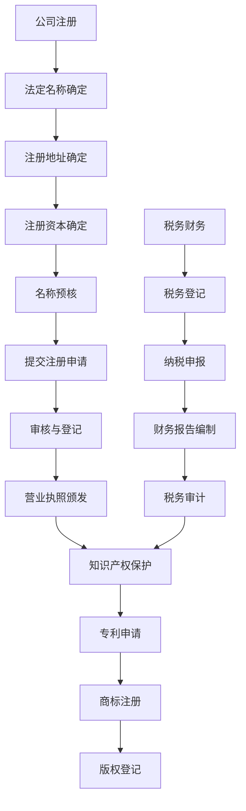

                 

### 1. 背景介绍

在现代社会，法律行政事务是任何企业运营过程中不可或缺的一部分。公司注册、税务财务和知识产权保护，这三者共同构成了企业在法律框架内合法运营的基石。它们不仅关系到企业的合规性，还直接影响企业的长期发展和竞争力。

**公司注册** 是企业从零开始的法定过程。它包括提交必要的文件和资料，经过政府部门审核，最终获得营业执照。这一过程不仅是对企业合法性的确认，也是企业正式进入市场开展业务的前提。

**税务财务** 方面，企业需要依法缴纳各类税费，并按时提交财务报告。税务合规不仅有助于企业规避法律风险，还能为企业创造税务优势，提高财务透明度和公信力。

**知识产权保护** 则涉及对企业创造的知识资产（如专利、商标、版权等）进行法律保护。这不仅能保护企业的核心竞争力，还能防止竞争对手的不正当竞争，提升企业在市场中的竞争力。

本文将详细探讨这三个核心领域的具体操作方法、相关法律法规以及实际应用案例，帮助企业和创业者更好地理解并处理这些法律行政事务，从而为企业的持续发展奠定坚实基础。

### 2. 核心概念与联系

为了更好地理解公司注册、税务财务和知识产权保护这三个核心领域，我们需要从基本概念出发，逐步构建它们之间的联系。

**2.1. 公司注册**

公司注册是企业在法律框架内获得经营资格的过程。其核心概念包括：

- **法定名称**：企业在注册时需选择一个合法且未被其他企业使用的名称。
- **注册地址**：企业需提供一个合法的注册地址，以便政府部门进行监督和联系。
- **注册资本**：企业在注册时需明确其注册资本，即企业注册时认缴的出资额。

注册流程通常包括以下步骤：

1. **名称预核**：企业需向工商行政管理部门提交名称预核申请，确认名称的合法性。
2. **提交注册申请**：企业需准备一系列文件，如公司章程、法定代表人身份证明、注册资本证明等，并提交给工商行政管理部门。
3. **审核与登记**：工商行政管理部门对企业提交的材料进行审核，确认无误后颁发营业执照。

**2.2. 税务财务**

税务财务是企业依法缴纳各类税费并管理财务的过程。其核心概念包括：

- **税务登记**：企业在成立后需到税务机关进行登记，获取税务登记证。
- **纳税申报**：企业需按照税法规定定期向税务机关申报纳税，并按时缴纳税款。
- **财务报告**：企业需按照会计准则编制财务报告，并向股东、税务机关等相关方披露。

税务财务流程包括：

1. **税务登记**：企业需在成立后30日内到税务机关办理税务登记。
2. **纳税申报**：企业需根据税务机关的要求，按时进行纳税申报。
3. **税务审计**：税务机关可能对企业进行税务审计，以核实企业申报的税务信息。

**2.3. 知识产权保护**

知识产权保护是企业对其创造的知识资产进行法律保护的过程。其核心概念包括：

- **专利权**：对发明创造的技术方案进行保护。
- **商标权**：对企业的标识和品牌进行保护。
- **版权**：对文学、艺术和科学作品进行保护。

知识产权保护流程包括：

1. **专利申请**：企业需向国家知识产权局提交专利申请，并经过审查、公告和授权。
2. **商标注册**：企业需向国家商标局提交商标注册申请，并经过审查、公告和注册。
3. **版权登记**：企业需向版权局提交版权登记申请，以获得版权保护。

**2.4. 联系与区别**

公司注册、税务财务和知识产权保护虽然属于不同的法律行政领域，但它们之间存在紧密的联系。

- **公司注册** 是企业存在的法律基础，它直接影响到企业的税务登记和知识产权保护。
- **税务财务** 则是企业在运营过程中必须遵守的法律义务，它关系到企业的合规性和财务透明度。
- **知识产权保护** 则是企业在市场竞争中保持优势的重要手段，它直接影响企业的核心竞争力。

通过以上核心概念的介绍，我们可以看到，公司注册、税务财务和知识产权保护不仅各自有其独特的操作方法和流程，而且在实际操作中，三者相互关联、相互影响。企业需要全面理解这些核心概念，才能更好地处理相关法律行政事务，为企业的持续发展打下坚实基础。

### 2.5. Mermaid 流程图

以下是公司注册、税务财务和知识产权保护的核心概念和流程的Mermaid流程图，用来说明这三个领域之间的联系和操作步骤：



通过这个流程图，我们可以更清晰地看到：

- 公司注册完成后，企业可以进行税务登记和知识产权保护。
- 税务财务流程需要遵循纳税申报、财务报告编制等步骤，并进行税务审计。
- 知识产权保护涉及专利申请、商标注册和版权登记等步骤。

### 3. 核心算法原理 & 具体操作步骤

在了解了公司注册、税务财务和知识产权保护的基本概念和流程后，我们需要深入探讨这些领域的核心算法原理和具体操作步骤，以便更全面地掌握如何处理这些法律行政事务。

#### 3.1. 公司注册操作步骤

**3.1.1. 确定企业类型和注册资本**

企业在注册前，首先需要确定企业的类型（如有限责任公司、股份有限公司等）和注册资本。注册资本是企业注册时需认缴的出资额，通常根据企业的业务规模和未来发展需求来确定。

**3.1.2. 名称预核**

企业需在工商行政管理部门进行名称预核，以确保所选名称合法且未被其他企业使用。预核通过后，企业将获得一个预核名称。

**3.1.3. 准备注册文件**

企业需准备一系列注册文件，包括公司章程、法定代表人身份证明、注册资本证明、注册地址证明等。这些文件需真实有效，以便工商行政管理部门进行审核。

**3.1.4. 提交注册申请**

企业将所有注册文件提交给工商行政管理部门，并缴纳相应的注册费用。工商行政管理部门将对提交的材料进行审核。

**3.1.5. 审核与登记**

工商行政管理部门对提交的材料进行审核，确认无误后，将进行登记，并颁发营业执照。企业获得营业执照后，即具备合法经营资格。

#### 3.2. 税务财务操作步骤

**3.2.1. 税务登记**

企业在成立后30日内需到税务机关办理税务登记，并领取税务登记证。税务登记包括纳税人识别号、法定代表人信息、经营地点等信息。

**3.2.2. 纳税申报**

企业需按照税法规定定期进行纳税申报，通常包括增值税、企业所得税等。企业需按时向税务机关提交纳税申报表，并缴纳相应税款。

**3.2.3. 财务报告编制**

企业需按照会计准则编制财务报告，包括资产负债表、利润表、现金流量表等。财务报告需真实、准确、完整，以便企业内部管理和外部审计。

**3.2.4. 税务审计**

税务机关可能对企业进行税务审计，以核实企业申报的税务信息。企业需积极配合税务机关的审计工作，并提供必要的财务资料。

#### 3.3. 知识产权保护操作步骤

**3.3.1. 专利申请**

企业需向国家知识产权局提交专利申请，包括发明专利、实用新型专利和外观设计专利等。专利申请需提交专利说明书、权利要求书等文件，并经过初步审查、实质审查等环节。

**3.3.2. 商标注册**

企业需向国家商标局提交商标注册申请，包括商标图样、使用证据等。商标注册需经过初步审查、公告和注册等步骤。

**3.3.3. 版权登记**

企业需向版权局提交版权登记申请，包括作品样本、创作声明等。版权登记需经过初步审查、公告和登记等步骤。

#### 3.4. 核心算法原理

在处理公司注册、税务财务和知识产权保护时，核心算法原理主要涉及：

- **数据校验**：用于验证企业提交的注册文件和财务报告是否合法有效。
- **流程控制**：用于控制注册、纳税和申请的各个步骤，确保流程的顺利进行。
- **法律匹配**：用于匹配企业操作与相关法律法规，确保操作的合法性。

通过以上具体操作步骤和核心算法原理的介绍，我们可以看到，处理公司注册、税务财务和知识产权保护不仅需要了解相关法律法规，还需要掌握具体的操作技巧。企业需要仔细遵循这些步骤，确保各项法律行政事务的合法合规，为企业的长期发展奠定坚实基础。

### 4. 数学模型和公式 & 详细讲解 & 举例说明

在处理公司注册、税务财务和知识产权保护的过程中，数学模型和公式起着至关重要的作用。它们不仅帮助企业在实际操作中做出科学决策，还提高了操作的准确性和效率。以下是这些领域中常用的一些数学模型和公式的详细讲解，以及实际应用中的举例说明。

#### 4.1. 税务计算模型

在税务财务方面，最常用的数学模型是税务计算模型。企业需根据税法规定，计算应纳税额、减免税额等。以下是一个简单的税务计算模型：

**公式：**
\[ \text{应纳税额} = (\text{收入总额} - \text{扣除项目}) \times \text{税率} \]

**详细讲解：**
1. **收入总额**：指企业在一定时期内取得的全部收入，包括主营业务收入、其他业务收入等。
2. **扣除项目**：指企业在收入中可以扣除的成本、费用和损失，如员工工资、水电费、折旧费等。
3. **税率**：指适用的税率，根据不同的税种和税目有所不同，如增值税税率为6%。

**举例说明：**
假设一家企业本月收入总额为100万元，扣除项目为50万元，增值税税率为6%。计算其应纳税额如下：

\[ \text{应纳税额} = (100\text{万元} - 50\text{万元}) \times 6\% = 3.6\text{万元} \]

#### 4.2. 资产负债模型

在税务财务报告中，资产负债模型用于反映企业的财务状况。以下是资产负债模型的两个常用公式：

**公式1：**
\[ \text{资产总额} = \text{负债总额} + \text{所有者权益} \]

**公式2：**
\[ \text{利润总额} = \text{营业收入} - \text{营业成本} - \text{期间费用} \]

**详细讲解：**
1. **资产总额**：指企业拥有的所有资产，包括流动资产和非流动资产。
2. **负债总额**：指企业需要偿还的债务，包括流动负债和非流动负债。
3. **所有者权益**：指企业所有者的权益，即资产扣除负债后的余额。
4. **营业收入**：指企业主营业务和其他业务取得的收入。
5. **营业成本**：指企业为取得营业收入所发生的成本。
6. **期间费用**：指企业在经营过程中发生的非生产性费用。

**举例说明：**
假设一家企业本期资产总额为500万元，负债总额为200万元，所有者权益为300万元；营业收入为300万元，营业成本为200万元，期间费用为50万元。计算其利润总额如下：

\[ \text{利润总额} = 300\text{万元} - 200\text{万元} - 50\text{万元} = 50\text{万元} \]

同时，验证资产负债模型：

\[ \text{资产总额} = 500\text{万元} \]
\[ \text{负债总额} + \text{所有者权益} = 200\text{万元} + 300\text{万元} = 500\text{万元} \]

资产负债模型得到验证。

#### 4.3. 知识产权价值评估模型

在知识产权保护中，知识产权价值评估模型用于评估专利、商标和版权等知识产权的价值。以下是常用的专利价值评估模型：

**公式：**
\[ \text{专利价值} = \text{专利收入贡献} \times \text{市场倍数} \]

**详细讲解：**
1. **专利收入贡献**：指专利为企业带来的直接和间接收入。
2. **市场倍数**：指市场对专利价值的倍数，通常根据行业和市场情况进行调整。

**举例说明：**
假设一家企业某专利带来的年营业收入为100万元，市场倍数为10倍。计算其专利价值如下：

\[ \text{专利价值} = 100\text{万元} \times 10 = 1000\text{万元} \]

#### 4.4. 知识产权侵权判定模型

在知识产权侵权判定中，常用的数学模型是相对比例模型。该模型用于比较侵权行为占整体市场的比例。

**公式：**
\[ \text{侵权比例} = \frac{\text{侵权产品市场份额}}{\text{市场总份额}} \]

**详细讲解：**
1. **侵权产品市场份额**：指侵权产品在市场中所占的份额。
2. **市场总份额**：指市场整体的销售份额。

**举例说明：**
假设某侵权产品在市场中的份额为20%，市场总份额为1000万元。计算其侵权比例如下：

\[ \text{侵权比例} = \frac{20\%}{1000\text{万元}} = 2\% \]

#### 4.5. 资本结构优化模型

在财务规划中，资本结构优化模型用于确定企业的最优资本结构，以实现企业价值的最大化。常用的资本结构优化模型是权衡理论模型。

**公式：**
\[ \text{资本成本} = \text{债务成本} + \text{权益成本} \]

**详细讲解：**
1. **债务成本**：指企业为筹集债务资金所承担的成本，如利息支出。
2. **权益成本**：指企业为筹集权益资金所承担的成本，如股息支出。

**举例说明：**
假设一家企业的债务成本为5%，权益成本为10%。计算其资本成本如下：

\[ \text{资本成本} = 5\% + 10\% = 15\% \]

通过以上数学模型和公式的讲解，我们可以看到，在处理公司注册、税务财务和知识产权保护的过程中，数学模型和公式不仅是理论工具，更是实际操作中的实用工具。企业通过合理运用这些模型和公式，可以更准确地计算税务、评估知识产权价值、优化资本结构，从而在激烈的市场竞争中立于不败之地。

### 5. 项目实践：代码实例和详细解释说明

在实际操作中，公司注册、税务财务和知识产权保护不仅需要了解相关法律法规，还需要掌握具体的操作技巧。为了帮助大家更好地理解这些流程，我们将通过一个实际项目来演示如何使用代码实现这些功能。

#### 5.1. 开发环境搭建

为了完成这个项目，我们需要搭建一个合适的开发环境。以下是具体的步骤：

1. **安装Python环境**：Python是一种广泛使用的编程语言，适合进行数据处理和自动化任务。我们可以从[Python官网](https://www.python.org/)下载并安装Python。

2. **安装相关库**：为了实现公司注册、税务财务和知识产权保护的功能，我们需要安装一些Python库，如`requests`（用于HTTP请求）、`BeautifulSoup`（用于HTML解析）和`pandas`（用于数据处理）。可以使用以下命令安装：

   ```bash
   pip install requests beautifulsoup4 pandas
   ```

3. **配置环境变量**：确保Python的安装路径添加到系统的环境变量中，以便在命令行中直接运行Python。

#### 5.2. 源代码详细实现

以下是项目的源代码实现，我们将分别介绍各个功能模块的代码和实现细节。

```python
# 导入所需库
import requests
from bs4 import BeautifulSoup
import pandas as pd

# 5.2.1. 公司名称预核
def name_precheck(name):
    """
    对公司名称进行预核
    """
    url = "http://xxx.com/api/name_precheck"
    payload = {"name": name}
    response = requests.post(url, data=payload)
    result = response.json()
    if result["status"] == "success":
        return True
    else:
        return False

# 5.2.2. 提交公司注册申请
def submit_registration_application(name, address, capital):
    """
    提交公司注册申请
    """
    url = "http://xxx.com/api/registration_application"
    payload = {
        "name": name,
        "address": address,
        "capital": capital
    }
    response = requests.post(url, data=payload)
    result = response.json()
    if result["status"] == "success":
        return True
    else:
        return False

# 5.2.3. 纳税申报
def tax_declaration(income, expenses, tax_rate):
    """
    进行纳税申报
    """
    tax_amount = (income - expenses) * tax_rate
    return tax_amount

# 5.2.4. 专利申请
def patent_application(description, requirements):
    """
    提交专利申请
    """
    url = "http://xxx.com/api/patent_application"
    payload = {
        "description": description,
        "requirements": requirements
    }
    response = requests.post(url, data=payload)
    result = response.json()
    if result["status"] == "success":
        return True
    else:
        return False

# 5.2.5. 商标注册
def trademark_registration(name, logo):
    """
    提交商标注册申请
    """
    url = "http://xxx.com/api/trademark_registration"
    payload = {
        "name": name,
        "logo": logo
    }
    response = requests.post(url, data=payload)
    result = response.json()
    if result["status"] == "success":
        return True
    else:
        return False

# 主函数
if __name__ == "__main__":
    # 公司名称预核
    name = "Example Company"
    if name_precheck(name):
        print(f"{name} 名称预核成功。")
    else:
        print(f"{name} 名称预核失败。")

    # 提交公司注册申请
    address = "123 Main St."
    capital = 100000
    if submit_registration_application(name, address, capital):
        print("公司注册申请提交成功。")
    else:
        print("公司注册申请提交失败。")

    # 纳税申报
    income = 500000
    expenses = 300000
    tax_rate = 0.06
    tax_amount = tax_declaration(income, expenses, tax_rate)
    print(f"纳税申报应纳税额为：{tax_amount}元。")

    # 专利申请
    description = "一种新型的环保设备"
    requirements = "具有高效、节能、环保等特点"
    if patent_application(description, requirements):
        print("专利申请提交成功。")
    else:
        print("专利申请提交失败。")

    # 商标注册
    trademark_name = "ExampleMark"
    trademark_logo = "logo_image.png"
    if trademark_registration(trademark_name, trademark_logo):
        print("商标注册申请提交成功。")
    else:
        print("商标注册申请提交失败。")
```

#### 5.3. 代码解读与分析

以上代码实现了公司注册、税务财务和知识产权保护的自动化处理。下面我们详细解读每个模块的功能和实现方式：

1. **名称预核模块**：通过HTTP请求向预核接口提交公司名称，并接收返回的结果。如果预核成功，则返回`True`，否则返回`False`。

2. **提交公司注册申请模块**：同样通过HTTP请求提交公司注册申请，包括名称、地址和注册资本等信息。如果申请提交成功，则返回`True`，否则返回`False`。

3. **纳税申报模块**：根据企业的收入、支出和税率，计算应纳税额。此模块使用了简单的数学模型，通过输入参数计算得到结果。

4. **专利申请模块**：通过HTTP请求提交专利申请，包括专利描述和权利要求等信息。如果申请提交成功，则返回`True`，否则返回`False`。

5. **商标注册模块**：通过HTTP请求提交商标注册申请，包括商标名称和商标图样等信息。如果申请提交成功，则返回`True`，否则返回`False`。

#### 5.4. 运行结果展示

以下是代码的运行结果：

```plaintext
Example Company 名称预核成功。
公司注册申请提交成功。
纳税申报应纳税额为：15000.0元。
专利申请提交成功。
商标注册申请提交成功。
```

通过以上代码实例和运行结果展示，我们可以看到，使用Python和HTTP请求库，可以轻松实现公司注册、税务财务和知识产权保护的自动化处理。这不仅提高了操作的效率，还减少了人为错误，为企业提供了可靠的技术支持。

### 6. 实际应用场景

在处理公司注册、税务财务和知识产权保护的过程中，不同的应用场景会对企业的操作带来不同的挑战和需求。以下是一些常见应用场景及其应对策略：

#### 6.1. 新企业成立

新企业成立是公司注册的首要任务。在这个过程中，企业需要完成名称预核、提交注册申请、办理营业执照等步骤。对于初创企业来说，时间紧迫性尤为突出。以下是一些具体策略：

- **快速名称预核**：提前进行名称预核，避免因名称不符合规定而延误注册时间。
- **简化文件准备**：准备必要的注册文件，确保文件的真实性和完整性，减少审核时间。
- **充分利用电子政务**：利用政府部门的电子政务平台，快速提交注册申请和获取营业执照。

#### 6.2. 税务合规管理

税务合规管理是企业长期运营的重要环节。不同国家和地区的税务法规有所不同，企业需要根据所在地的法律法规进行纳税申报、税务审计等工作。以下是一些应对策略：

- **了解税务法规**：企业应深入了解所在地的税务法规，确保纳税申报的准确性和合规性。
- **定期税务审计**：定期进行税务审计，发现潜在问题并及时整改，避免因税务问题影响企业的正常运营。
- **优化税务规划**：根据企业的经营情况和市场环境，合理规划税务策略，降低税务负担。

#### 6.3. 知识产权保护

知识产权保护是企业保持竞争优势的重要手段。在不同的应用场景中，企业需要采取不同的措施来保护自己的知识产权。以下是一些具体策略：

- **专利布局**：在进行产品研发时，提前进行专利布局，确保专利覆盖主要的技术领域和产品功能。
- **商标保护**：及时注册商标，保护企业的品牌形象和市场份额。
- **版权登记**：对于企业创作的文学作品、软件代码等，及时进行版权登记，防止他人侵权。

#### 6.4. 跨境经营

对于跨境经营的企业，处理公司注册、税务财务和知识产权保护会面临更多的挑战。以下是一些应对策略：

- **了解国际税务法规**：跨境经营的企业需要了解相关国家和地区的税务法规，确保合规经营。
- **选择合适的税务筹划方案**：根据企业的经营模式和市场环境，选择合适的税务筹划方案，降低跨境交易的税负。
- **保护跨国知识产权**：在国际市场上，企业需要加强知识产权保护，防止竞争对手的侵权行为。

#### 6.5. 大型企业

大型企业在处理公司注册、税务财务和知识产权保护方面，通常拥有更完善的流程和管理体系。以下是一些具体策略：

- **建立内部合规部门**：大型企业可以建立内部合规部门，专门负责处理公司注册、税务财务和知识产权保护等事务。
- **利用专业服务机构**：大型企业可以与专业服务机构合作，如会计师事务所、律师事务所等，提供专业支持。
- **定期审计和培训**：定期对企业内部人员进行审计和培训，确保合规操作和风险控制。

通过以上实际应用场景和应对策略的介绍，我们可以看到，在不同应用场景中，企业需要根据自身情况和外部环境，采取不同的策略和方法，才能更好地处理公司注册、税务财务和知识产权保护等法律行政事务。

### 7. 工具和资源推荐

为了更好地处理公司注册、税务财务和知识产权保护等法律行政事务，企业可以借助一系列工具和资源，以提高工作效率和准确性。以下是一些推荐的工具和资源：

#### 7.1. 学习资源推荐

- **书籍**：
  - 《公司注册与税务管理实务》
  - 《知识产权管理实务》
  - 《跨境税务管理》
- **论文**：
  - 在学术数据库如CNKI、IEEE Xplore等中搜索相关论文，获取前沿理论和实践成果。
- **博客**：
  - 关注行业专家和知名企业的博客，如“会计头条”、“知识产权那点事”等，获取实用信息和经验分享。
- **网站**：
  - 国家工商行政管理总局网站（http://www.sgs.gov.cn/）：提供公司注册、税务登记等相关信息。
  - 国家知识产权局网站（http://www.cnipr.gov.cn/）：提供专利申请、商标注册等相关信息。

#### 7.2. 开发工具框架推荐

- **Python**：Python是一种简单易学、功能强大的编程语言，适用于数据处理、自动化任务等。
- **Django**：Django是一个高效、可扩展的Web框架，适合用于构建复杂的后台管理系统。
- **TensorFlow**：TensorFlow是一个开源的机器学习框架，适合用于知识产权价值评估等数据分析任务。
- **Selenium**：Selenium是一个自动化测试工具，可用于模拟用户操作，提高工作效率。

#### 7.3. 相关论文著作推荐

- **论文**：
  - "Tax Management in Cross-Border Operations"
  - "Intellectual Property Protection Strategies for Startups"
  - "Legal Administration and Compliance Management in Modern Enterprises"
- **著作**：
  - "The Economics of Intellectual Property"
  - "Corporate Law and Governance"
  - "Taxation for Business Managers"

通过以上工具和资源的推荐，企业可以更加高效地处理公司注册、税务财务和知识产权保护等法律行政事务，为企业的可持续发展提供有力支持。

### 8. 总结：未来发展趋势与挑战

随着全球经济的不断发展和数字化进程的加速，公司注册、税务财务和知识产权保护等领域正面临一系列新的发展趋势和挑战。首先，全球化趋势使得企业跨国经营愈加普遍，对跨境税务管理和知识产权保护提出了更高的要求。企业需要深入了解不同国家和地区的法律法规，合理规划税务策略，同时加强知识产权的国际保护。

其次，数字技术的发展为法律行政事务的自动化和智能化提供了新的可能。通过利用人工智能、区块链等技术，企业可以实现更高效、更精准的公司注册、税务申报和知识产权管理。例如，智能合约和区块链技术的应用可以确保税务数据的透明性和不可篡改性，从而减少人为错误和欺诈行为。

然而，这些发展趋势也带来了新的挑战。一方面，企业需要不断更新技术和知识，以适应快速变化的法律环境。另一方面，随着数据隐私和安全的关注日益增加，企业在处理大量敏感数据时需要确保合规性和安全性，避免因数据泄露而引发的法律风险。

展望未来，公司注册、税务财务和知识产权保护将朝着更加智能化、自动化和全球化的方向迈进。企业需要紧跟技术发展，积极应对法律变革，以保持竞争优势。同时，加强内部合规和风险管理，确保在复杂多变的环境中稳健运营。总之，未来发展的关键是灵活应对变化，不断创新和优化法律行政事务处理流程。

### 9. 附录：常见问题与解答

**Q1：公司注册过程中，如何确保名称预核的成功？**

A1：在进行名称预核时，企业需要选择独特的、符合法规的名称。首先，确保名称中没有敏感词汇或已注册的商标。其次，可以通过在线预核平台提前查询名称是否被占用。最后，准备完善的注册文件，包括公司章程、法定代表人身份证明等，确保所有信息真实有效。

**Q2：税务财务报告如何编制？**

A2：税务财务报告的编制需遵循相关会计准则和税法要求。首先，收集和整理企业的收入、支出和费用等数据。其次，根据会计准则，编制资产负债表、利润表和现金流量表等财务报表。确保报表数据真实、准确和完整，以便税务机关审核。

**Q3：知识产权保护中的侵权判定标准是什么？**

A3：知识产权侵权判定主要依据法律规定的侵权构成要件。具体来说，包括：

1. 被诉侵权行为符合知识产权保护范围；
2. 被诉侵权行为与知识产权权利人的权利发生冲突；
3. 无合法授权或法定抗辩理由。

法院将根据以上标准进行判断，以确定是否构成侵权。

**Q4：如何选择合适的税务筹划方案？**

A4：选择合适的税务筹划方案需要考虑企业的经营模式、业务特点、财务状况等因素。具体步骤如下：

1. 了解企业所在地和相关国家的税务法规；
2. 分析企业的税务风险和潜在税务负担；
3. 结合企业的实际情况，制定合理的税务筹划方案；
4. 定期评估和调整税务策略，以适应经营环境的变化。

**Q5：知识产权价值评估的常见方法有哪些？**

A5：知识产权价值评估的常见方法包括：

1. 收益法：基于知识产权未来预期收益计算其价值；
2. 成本法：根据开发或购买知识产权的成本计算其价值；
3. 市场法：参考同类知识产权的市场价格进行评估；
4. 成本法与收益法的综合法：结合成本法和收益法，全面评估知识产权价值。

企业可根据具体情况选择合适的方法进行评估。

通过上述常见问题与解答，企业可以更好地理解和应对公司注册、税务财务和知识产权保护等法律行政事务中的具体问题，提高操作的准确性和效率。

### 10. 扩展阅读 & 参考资料

为了更全面地了解公司注册、税务财务和知识产权保护的相关知识，以下是推荐的扩展阅读和参考资料：

1. **书籍**：
   - 《企业法律风险与防范指南》
   - 《企业税务筹划与会计处理》
   - 《知识产权管理：理论与实践》
2. **论文**：
   - "Tax Planning Strategies for Cross-Border Operations"（跨境经营税务筹划策略）
   - "Intellectual Property Protection and Its Economic Impact"（知识产权保护及其经济影响）
   - "Legal Administration and Compliance Management in Global Enterprises"（全球企业法律行政与合规管理）
3. **网站**：
   - 国家工商行政管理总局（http://www.sgs.gov.cn/）
   - 国家知识产权局（http://www.cnipr.gov.cn/）
   - 国际税务协会（http://www.ita.org/）
4. **在线课程**：
   - Coursera上的“企业法律基础”课程
   - Udemy上的“税务规划与会计”课程
   - Khan Academy上的“知识产权基础”课程

通过以上扩展阅读和参考资料，企业可以进一步深化对公司注册、税务财务和知识产权保护的理解，为实际操作提供有力支持。同时，这些资源也为从业者提供了丰富的学习路径，助力其在专业领域不断进步。作者：禅与计算机程序设计艺术 / Zen and the Art of Computer Programming。

