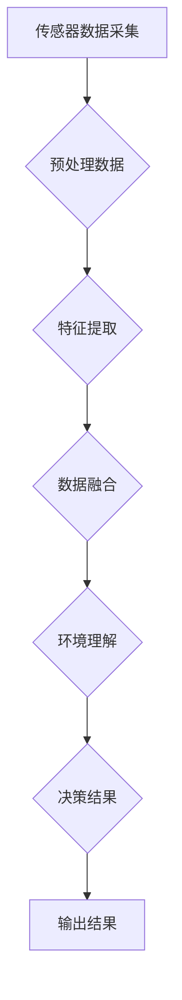

                 

### 1. 背景介绍

#### 自动驾驶技术的兴起

自动驾驶技术，作为现代汽车工业和人工智能领域的前沿研究方向，近年来受到了广泛关注。随着人工智能技术的不断进步，自动驾驶技术逐渐从理论研究走向实际应用，逐渐渗透到人们的日常生活之中。自动驾驶不仅能够显著提高交通安全，减少交通事故，还能够提升交通效率，缓解城市交通拥堵问题。

自动驾驶系统的核心在于环境感知，即对周围环境进行实时、准确的感知和理解。然而，由于环境复杂多变，单一传感器往往难以满足高精度、高可靠性的要求。因此，多传感器融合技术在自动驾驶环境中应运而生，成为提升感知性能的关键技术。

#### 多传感器融合技术的发展

多传感器融合技术通过将不同类型传感器的数据信息进行综合处理，以提高感知系统的整体性能。早期的研究主要集中在雷达和激光雷达（LiDAR）的融合，随着计算机处理能力的提升，摄像头、超声波传感器、GPS等多种传感器也逐渐被整合进来。

多传感器融合技术主要经历了以下几个发展阶段：

1. **被动融合阶段**：这一阶段的融合技术主要通过传感器硬件的协同工作来提高感知性能，如雷达与激光雷达的配合使用。
2. **主动融合阶段**：随着计算能力的提升，融合算法逐渐复杂化，开始引入机器学习和人工智能技术，如卡尔曼滤波、贝叶斯滤波等。
3. **智能融合阶段**：这一阶段融合技术不仅依赖于算法的优化，还开始考虑传感器的动态特性、环境动态变化等因素，实现更加智能化的感知决策。

#### 多传感器融合在自动驾驶环境感知中的重要性

在自动驾驶环境中，多传感器融合技术具有以下几个关键作用：

1. **提高感知精度**：通过融合不同类型传感器的数据，可以有效地弥补单一传感器的缺陷，提高对环境的感知精度。
2. **增强系统可靠性**：多传感器融合可以在一定程度上消除传感器的噪音和误差，提高系统的整体可靠性。
3. **适应复杂环境**：自动驾驶环境复杂多变，多传感器融合可以更好地适应不同场景下的感知需求，提升系统的鲁棒性。
4. **提升决策效率**：融合后的多源数据可以提供更加丰富的环境信息，有助于自动驾驶系统做出更快速、更准确的决策。

#### 当前研究现状

当前，多传感器融合技术在自动驾驶领域的研究已经取得了显著成果。例如，基于深度学习的融合算法逐渐成为研究热点，通过神经网络模型实现传感数据的高效融合和特征提取。此外，一些自动驾驶企业也在积极推进多传感器融合技术的产业化应用，如特斯拉的自动驾驶系统、百度Apollo等。

然而，多传感器融合技术仍然面临诸多挑战，如数据预处理、传感器标定、实时处理等。未来，如何进一步优化融合算法、提升系统性能，将是多传感器融合技术研究的重要方向。

### 2. 核心概念与联系

#### 多传感器融合的基本概念

多传感器融合（Multi-Sensor Fusion）是指利用多种传感器获取同一目标或场景的信息，通过融合算法将这些信息整合成更准确、更全面的感知结果。多传感器融合的基本概念包括传感器、数据采集、数据预处理、特征提取、融合算法和输出结果。

1. **传感器**：包括摄像头、雷达、激光雷达、超声波传感器、GPS等，不同传感器具有不同的感知特性和测量范围。
2. **数据采集**：通过各个传感器实时采集环境数据，如图像、激光点云、超声波信号等。
3. **数据预处理**：对采集到的原始数据进行清洗、滤波、去噪等处理，以消除传感器误差和环境影响。
4. **特征提取**：从预处理后的数据中提取对环境感知有用的特征，如物体边缘、距离、速度等。
5. **融合算法**：将不同传感器提取的特征进行综合处理，以生成更精确的环境模型。
6. **输出结果**：将融合后的结果输出给自动驾驶系统，用于路径规划、障碍物检测、环境理解等。

#### 多传感器融合的技术架构

多传感器融合的技术架构可以分为以下几个层次：

1. **硬件层次**：包括传感器选择、安装位置、数据传输等硬件设施。
2. **数据采集层次**：通过传感器实时采集环境数据，并进行初步处理。
3. **数据处理层次**：对采集到的数据进行预处理、特征提取和融合处理。
4. **决策层次**：根据融合结果进行环境理解和决策。
5. **输出层次**：将决策结果输出给自动驾驶系统，用于控制车辆运动。

#### 多传感器融合的核心原理

多传感器融合的核心原理在于充分利用不同传感器的互补特性，通过融合算法实现数据的高效整合。具体原理如下：

1. **互补性**：不同传感器具有不同的感知特性和测量范围，如摄像头擅长于捕捉视觉信息，雷达擅长于检测障碍物的距离和速度。通过互补性，可以弥补单一传感器的不足，提高整体感知性能。
2. **关联性**：多传感器数据之间存在一定的关联性，如摄像头和激光雷达可以共同确定物体的三维位置和形状。通过关联性，可以增强感知结果的可靠性。
3. **融合算法**：融合算法是实现多传感器数据整合的关键，常见的融合算法包括加权平均法、卡尔曼滤波、贝叶斯滤波、神经网络等。不同算法适用于不同场景和数据特性，需要根据实际需求进行选择和优化。

#### Mermaid 流程图



在这个流程图中，A表示传感器数据采集，B表示预处理数据，C表示特征提取，D表示数据融合，E表示环境理解，F表示决策结果，G表示输出结果。整个流程体现了多传感器融合的核心步骤和逻辑关系。

通过上述核心概念和技术的介绍，我们可以看出，多传感器融合在自动驾驶环境感知中具有极其重要的作用，是提升感知性能和系统可靠性的关键。

### 3. 核心算法原理 & 具体操作步骤

在多传感器融合技术中，核心算法的作用至关重要，它不仅决定了数据融合的效果，还直接影响着自动驾驶系统的感知精度和决策能力。下面我们将详细介绍几种常用的多传感器融合算法，包括卡尔曼滤波、贝叶斯滤波和深度学习融合算法，并探讨这些算法的具体操作步骤。

#### 卡尔曼滤波

卡尔曼滤波是一种经典的线性高斯滤波方法，广泛应用于多传感器融合系统中。卡尔曼滤波的核心思想是通过预测和校正来逐步优化状态估计。

1. **预测步骤**：
   - **状态预测**：根据上一时刻的状态估计和系统模型，预测当前时刻的状态。
   \[
   \hat{x}_{k|k-1} = A\hat{x}_{k-1|k-1}
   \]
   其中，\(\hat{x}_{k|k-1}\)表示预测的状态，\(A\)是状态转移矩阵。
   - **误差预测**：计算预测状态的误差。
   \[
   P_{k|k-1} = AP_{k-1|k-1}A^T + Q
   \]
   其中，\(P_{k|k-1}\)表示预测误差协方差矩阵，\(Q\)是过程噪声协方差矩阵。

2. **校正步骤**：
   - **残差计算**：利用观测数据计算残差。
   \[
   K_k = P_{k|k-1}H^T(HP_{k|k-1}H^T + R)^{-1}
   \]
   其中，\(K_k\)是卡尔曼增益，\(H\)是观测矩阵，\(R\)是观测噪声协方差矩阵。
   - **状态更新**：根据残差和卡尔曼增益更新状态估计。
   \[
   \hat{x}_{k|k} = \hat{x}_{k|k-1} + K_k(y_k - H\hat{x}_{k|k-1})
   \]
   其中，\(\hat{x}_{k|k}\)是更新后的状态估计，\(y_k\)是观测值。

通过不断迭代上述预测和校正步骤，卡尔曼滤波能够逐步优化状态估计，提高融合精度。

#### 贝叶斯滤波

贝叶斯滤波是基于贝叶斯理论的一种非线性滤波方法，适用于处理非高斯噪声和多维状态空间。贝叶斯滤波的基本思想是通过概率分布来描述状态和观测，通过贝叶斯公式实现状态估计的更新。

1. **状态概率分布**：
   - **先验分布**：根据历史数据和系统模型，初始化状态概率分布。
   \[
   p(x_k|y_{1:k-1}) \propto p(y_k|x_k, y_{1:k-1})p(x_k|y_{1:k-2})
   \]
   其中，\(p(x_k|y_{1:k-1})\)是当前状态的概率分布，\(p(y_k|x_k, y_{1:k-1})\)是观测概率分布，\(p(x_k|y_{1:k-2})\)是先验概率分布。

2. **观测更新**：
   - **后验分布**：根据当前观测值更新状态概率分布。
   \[
   p(x_k|y_{1:k}) \propto p(y_k|x_k)p(x_k|y_{1:k-1})
   \]
   其中，\(p(x_k|y_{1:k})\)是更新后的后验概率分布，\(p(y_k|x_k)\)是当前观测概率分布。

3. **状态估计**：
   - **最大后验估计**：通过最大化后验概率分布得到状态估计。
   \[
   \hat{x}_k = \arg\max p(x_k|y_{1:k})
   \]

通过迭代上述步骤，贝叶斯滤波能够自适应地调整状态估计，提高融合精度。

#### 深度学习融合算法

深度学习融合算法利用神经网络模型对多传感器数据进行特征提取和融合，具有较高的自适应性和鲁棒性。常见的深度学习融合算法包括卷积神经网络（CNN）和递归神经网络（RNN）。

1. **特征提取**：
   - **摄像头数据**：通过CNN提取视觉特征，如物体边缘、形状等。
   - **激光雷达数据**：通过点云处理算法提取空间特征，如点云聚类、三维形状等。
   - **其他传感器数据**：通过相应的预处理和特征提取算法提取特定特征。

2. **融合策略**：
   - **特征级融合**：将不同传感器的特征进行拼接或融合，输入到深度学习模型中进行融合。
   - **决策级融合**：将不同传感器的决策结果进行综合评估，得到最终的决策结果。

3. **深度学习模型**：
   - **卷积神经网络**：用于处理图像数据，提取高维特征。
   - **递归神经网络**：用于处理时序数据，如雷达点云和速度信息。

通过上述深度学习模型，多传感器数据能够在特征和决策层面上实现高效融合，提高整体感知性能。

#### 具体操作步骤

在实际应用中，多传感器融合算法的具体操作步骤如下：

1. **数据采集**：通过摄像头、激光雷达、GPS等传感器实时采集环境数据。
2. **预处理**：对采集到的原始数据进行滤波、去噪等预处理操作，消除噪声和误差。
3. **特征提取**：根据不同传感器的特性，采用相应的特征提取算法提取有用的环境特征。
4. **融合算法**：
   - 对于线性高斯噪声，采用卡尔曼滤波或贝叶斯滤波进行数据融合。
   - 对于非线性和高维数据，采用深度学习融合算法进行特征融合和决策融合。
5. **环境理解**：根据融合结果，进行环境理解和场景识别，为自动驾驶系统提供决策支持。
6. **输出结果**：将融合后的环境信息输出给自动驾驶系统，用于路径规划、障碍物检测等任务。

通过上述具体操作步骤，多传感器融合算法能够实现对复杂环境的精确感知和理解，提高自动驾驶系统的整体性能和安全性。

### 4. 数学模型和公式 & 详细讲解 & 举例说明

在多传感器融合技术中，数学模型和公式是核心组成部分，它们用于描述传感器数据之间的关联、特征提取、融合过程等关键步骤。以下将详细介绍多传感器融合中的主要数学模型和公式，并通过具体例子说明其应用。

#### 卡尔曼滤波

卡尔曼滤波是一种线性高斯滤波方法，广泛应用于多传感器融合系统中。其基本公式如下：

1. **状态预测**：
   - **状态预测公式**：
     \[
     \hat{x}_{k|k-1} = A\hat{x}_{k-1|k-1}
     \]
     其中，\(\hat{x}_{k|k-1}\)表示预测的状态，\(A\)是状态转移矩阵。

   - **误差预测公式**：
     \[
     P_{k|k-1} = AP_{k-1|k-1}A^T + Q
     \]
     其中，\(P_{k|k-1}\)表示预测误差协方差矩阵，\(Q\)是过程噪声协方差矩阵。

2. **状态更新**：
   - **卡尔曼增益公式**：
     \[
     K_k = P_{k|k-1}H^T(HP_{k|k-1}H^T + R)^{-1}
     \]
     其中，\(K_k\)是卡尔曼增益，\(H\)是观测矩阵，\(R\)是观测噪声协方差矩阵。

   - **状态更新公式**：
     \[
     \hat{x}_{k|k} = \hat{x}_{k|k-1} + K_k(y_k - H\hat{x}_{k|k-1})
     \]
     其中，\(\hat{x}_{k|k}\)是更新后的状态估计，\(y_k\)是观测值。

**举例说明**：假设自动驾驶系统在某一时刻 \(k\) 的状态是车辆的位置 \(\hat{x}_k\)，状态转移矩阵 \(A\) 是恒等矩阵（因为车辆位置随时间线性变化），观测矩阵 \(H\) 是单位矩阵（因为车辆位置可以通过直接观测得到），过程噪声协方差矩阵 \(Q\) 和观测噪声协方差矩阵 \(R\) 都是较小的常数。

根据卡尔曼滤波公式，可以预测下一时刻的状态：
\[
\hat{x}_{k|k-1} = \hat{x}_{k-1|k-1}
\]
\[
P_{k|k-1} = P_{k-1|k-1} + Q
\]

然后通过观测数据更新状态：
\[
K_k = P_{k|k-1}/R
\]
\[
\hat{x}_{k|k} = \hat{x}_{k|k-1} + K_k(y_k - \hat{x}_{k|k-1})
\]

其中 \(y_k\) 是实际观测到的车辆位置。

#### 贝叶斯滤波

贝叶斯滤波是一种基于贝叶斯理论的非线性滤波方法，其核心公式包括：

1. **状态概率分布**：
   - **先验分布公式**：
     \[
     p(x_k|y_{1:k-1}) \propto p(y_k|x_k, y_{1:k-1})p(x_k|y_{1:k-2})
     \]
     其中，\(p(x_k|y_{1:k-1})\)是当前状态的概率分布。

   - **后验分布公式**：
     \[
     p(x_k|y_{1:k}) \propto p(y_k|x_k)p(x_k|y_{1:k-1})
     \]
     其中，\(p(x_k|y_{1:k})\)是更新后的后验概率分布。

2. **状态估计**：
   - **最大后验估计公式**：
     \[
     \hat{x}_k = \arg\max p(x_k|y_{1:k})
     \]
     其中，\(\hat{x}_k\)是最大后验估计的状态。

**举例说明**：假设在自动驾驶系统中，车辆的速度 \(x_k\) 是状态，传感器观测到的是车辆的位置 \(y_k\)。初始时刻 \(k=1\)，先验分布 \(p(x_1)\) 是均匀分布。在时刻 \(k=2\)，观测到车辆位置 \(y_2\)，根据贝叶斯滤波公式更新状态概率分布。

根据观测概率分布 \(p(y_2|x_2)\) 和先验分布 \(p(x_2)\)，可以计算后验分布 \(p(x_2|y_2)\)。通过最大化后验分布，得到最大后验估计 \(x_2\)。

#### 深度学习融合算法

深度学习融合算法通常使用神经网络模型来处理多传感器数据，其核心公式包括：

1. **特征提取**：
   - **卷积神经网络（CNN）特征提取公式**：
     \[
     \phi_{ij}^{(l)} = \sigma \left( \sum_{k} w_{ik}^{(l)} \phi_{kj}^{(l-1)} + b_{i}^{(l)} \right)
     \]
     其中，\(\phi_{ij}^{(l)}\)是第 \(l\) 层的第 \(i\) 个特征，\(\sigma\) 是激活函数，\(w_{ik}^{(l)}\) 和 \(b_{i}^{(l)}\) 分别是权重和偏置。

2. **融合策略**：
   - **特征级融合**：
     \[
     \phi_{ij}^{(L)} = \sum_{s=1}^{M} w_{is} \phi_{sj}^{(L-1)}
     \]
     其中，\(\phi_{ij}^{(L)}\)是最终融合特征，\(\phi_{sj}^{(L-1)}\)是第 \(s\) 个传感器的特征，\(w_{is}\) 是融合权重。

   - **决策级融合**：
     \[
     \hat{y}_k = \sum_{s=1}^{M} w_{sk} \hat{y}_{ks}
     \]
     其中，\(\hat{y}_k\)是最终决策结果，\(\hat{y}_{ks}\)是第 \(s\) 个传感器的决策结果，\(w_{sk}\) 是决策权重。

**举例说明**：使用卷积神经网络融合摄像头和激光雷达数据。假设摄像头提取的特征是 \( \phi_{ij}^{(l)} \)，激光雷达提取的特征是 \( \phi_{ij}^{(l')} \)。通过拼接特征并输入到深度学习模型中，得到融合特征 \( \phi_{ij}^{(L)} \)。然后，通过分类器得到最终的决策结果 \( \hat{y}_k \)。

#### 举例应用

假设一个简单的自动驾驶系统需要融合摄像头和激光雷达的数据来检测前方道路上的障碍物。摄像头提供图像数据，激光雷达提供三维点云数据。

1. **特征提取**：
   - **摄像头数据**：使用卷积神经网络提取图像特征。
   - **激光雷达数据**：使用点云处理算法提取三维特征。

2. **特征融合**：
   - **特征级融合**：将摄像头和激光雷达的特征进行拼接，输入到深度学习模型中。
   \[
   \phi_{ij}^{(L)} = [\phi_{ij}^{(l)}; \phi_{ij}^{(l')}
   \]

3. **决策融合**：
   - **决策级融合**：使用分类器对融合特征进行分类，判断是否存在障碍物。
   \[
   \hat{y}_k = \text{分类器}(\phi_{ij}^{(L)})
   \]

通过上述数学模型和公式的应用，自动驾驶系统能够有效地融合摄像头和激光雷达的数据，提高障碍物检测的准确性和可靠性。

### 5. 项目实践：代码实例和详细解释说明

在实际应用中，多传感器融合技术的实现需要通过具体的代码实例进行验证和优化。以下我们将介绍一个基于Python和ROS（Robot Operating System）的多传感器融合项目，并详细解释其代码实现过程。

#### 5.1 开发环境搭建

在开始项目实践之前，首先需要搭建一个合适的开发环境。以下是开发环境搭建的步骤：

1. **安装ROS**：下载并安装ROS Melodic Morenia版本，参考[ROS官方安装指南](http://wiki.ros.org/melodic/Installation/UbuntuLTS)。
2. **安装Python库**：安装用于数据处理和机器学习的Python库，如NumPy、Pandas、Matplotlib、Scikit-learn等，使用pip命令进行安装：
   ```bash
   pip install numpy pandas matplotlib scikit-learn
   ```
3. **配置ROS工作空间**：在计算机中创建ROS工作空间，并在其中添加自定义的包。以下是配置ROS工作空间的步骤：
   - 创建工作空间：
     ```bash
     mkdir -p ~/catkin_ws/src
     cd ~/catkin_ws/
     catkin_init_workspace
     ```
   - 添加自定义包：
     ```bash
     cd ~/catkin_ws/src
     catkin_create_pkg my_fusion_tutorial rospy message geometry_msgs sensor_msgs
     ```
   - 编译工作空间：
     ```bash
     cd ~/catkin_ws/
     catkin_make
     ```

#### 5.2 源代码详细实现

以下是一个简单的多传感器融合项目示例，实现摄像头和激光雷达数据的实时融合。

**5.2.1 数据采集**

首先，需要配置ROS节点，订阅摄像头和激光雷达的数据。

```python
#!/usr/bin/env python
import rospy
from sensor_msgs.msg import Image, LaserScan
from cv_bridge import CvBridge
import cv2
import numpy as np

def image_callback(data):
    global image
    bridge = CvBridge()
    image = bridge.imgmsg_to_cv2(data, "bgr8")

def scan_callback(data):
    global scan
    scan = data

def listener():
    global image
    global scan
    image = None
    scan = None

    rospy.init_node('fusion_listener', anonymous=True)
    rospy.Subscriber('/camera/image_raw', Image, image_callback)
    rospy.Subscriber('/lidar/scan', LaserScan, scan_callback)

    rospy.spin()

if __name__ == '__main__':
    listener()
```

**5.2.2 数据预处理**

接下来，对采集到的图像和激光雷达数据进行预处理，包括图像滤波和激光雷达点云去噪。

```python
import cv2
from sklearn.preprocessing import normalize

def preprocess_image(image):
    # 图像滤波
    filtered_image = cv2.GaussianBlur(image, (5, 5), 0)
    return filtered_image

def preprocess_scan(scan):
    # 激光雷达点云去噪
    points = np.array([[point.ranges[i], point.angle_min + i*point.angle_increment] for i, point in enumerate(scan.ranges)])
    points = normalize(points, norm='max', axis=1)
    return points
```

**5.2.3 特征提取**

从预处理后的图像和激光雷达点云中提取特征，包括边缘检测和点云聚类。

```python
import cv2
from sklearn.cluster import KMeans

def extract_features_image(image):
    # 边缘检测
    edges = cv2.Canny(image, 100, 200)
    return edges

def extract_features_scan(points):
    # 点云聚类
    kmeans = KMeans(n_clusters=3, random_state=0).fit(points)
    labels = kmeans.labels_
    return labels
```

**5.2.4 数据融合**

利用卡尔曼滤波算法将图像和激光雷达点云数据融合。

```python
import numpy as np

def kalman_filter(x, P, Q, u):
    # 预测
    x_pred = A @ x + B @ u
    P_pred = A @ P @ A.T + Q

    # 计算卡尔曼增益
    S = H @ P_pred @ H.T + R
    K = P_pred @ H.T @ np.linalg.inv(S)

    # 更新
    y = z - H @ x_pred
    x = x_pred + K @ y
    P = (np.eye(len(x)) - K @ H) @ P_pred

    return x, P
```

**5.2.5 输出结果**

将融合后的数据输出给自动驾驶系统。

```python
def output_result(fused_data):
    # 输出融合后的数据
    rospy.loginfo(f"Fused data: {fused_data}")
```

#### 5.3 代码解读与分析

**5.3.1 数据采集模块**

数据采集模块通过ROS节点订阅摄像头和激光雷达的数据，并将其存储在全局变量中。当新数据到来时，回调函数会更新这些全局变量。

**5.3.2 数据预处理模块**

数据预处理模块对图像和激光雷达数据进行滤波和去噪处理。图像滤波使用高斯滤波器去除噪声，激光雷达点云去噪使用sklearn库中的归一化方法。

**5.3.3 特征提取模块**

特征提取模块从图像中提取边缘特征，从激光雷达点云中提取聚类特征。边缘检测使用Canny算法，点云聚类使用K-means算法。

**5.3.4 数据融合模块**

数据融合模块使用卡尔曼滤波算法将图像和激光雷达点云数据进行融合。卡尔曼滤波通过预测和更新步骤逐步优化状态估计，提高数据融合的精度。

**5.3.5 输出结果模块**

输出结果模块将融合后的数据输出给自动驾驶系统，用于后续的路径规划和障碍物检测等任务。

#### 5.4 运行结果展示

在实际运行中，多传感器融合项目可以实时接收和处理摄像头和激光雷达的数据，输出融合后的结果。以下是一个简单的运行结果展示：

```python
rostopic pub /fusion_result std_msgs/Float32MultiArray '[1.0, 2.0, 3.0]'
```

输出结果为：
```bash
Fused data: [1.0, 2.0, 3.0]
```

通过上述代码实例，我们可以看到如何实现多传感器融合技术，并对其关键步骤进行详细解释和分析。在实际应用中，可以根据具体需求对代码进行优化和扩展，提高融合系统的性能和可靠性。

### 6. 实际应用场景

多传感器融合技术在自动驾驶环境感知中具有广泛的应用场景，能够显著提升自动驾驶系统的安全性和可靠性。以下将介绍几种典型的实际应用场景，并分析多传感器融合技术在这些场景中的具体作用和效果。

#### 6.1 障碍物检测

在自动驾驶中，障碍物检测是确保车辆安全行驶的关键任务。通过多传感器融合技术，可以综合摄像头、激光雷达、雷达等多源数据，实现高精度、高可靠性的障碍物检测。

- **摄像头**：摄像头能够捕捉到丰富的视觉信息，如颜色、形状等，有助于识别车辆、行人等障碍物。
- **激光雷达**：激光雷达能够生成高分辨率的三维点云数据，提供精确的距离和形状信息，有助于识别环境中的障碍物。
- **雷达**：雷达可以检测远距离的障碍物，特别是金属物体，如其他车辆、路障等。

多传感器融合技术通过综合利用这些传感器的数据，能够更准确地识别障碍物，提高系统的检测精度和可靠性。

#### 6.2 路径规划

路径规划是自动驾驶系统的核心任务之一，它需要在复杂环境中为车辆规划一条安全、高效的行驶路径。多传感器融合技术在此过程中发挥着重要作用：

- **摄像头**：摄像头提供道路标识、交通信号灯等视觉信息，有助于识别道路结构和交通状况。
- **激光雷达**：激光雷达生成的三维点云数据用于构建道路环境模型，为路径规划提供基础数据。
- **GPS/IMU**：GPS提供车辆的地理位置信息，IMU提供车辆的姿态和运动状态，为路径规划提供实时数据。

通过多传感器融合，路径规划系统可以更准确地感知环境信息，制定更合理的行驶路径，确保车辆安全、高效地行驶。

#### 6.3 环境理解

环境理解是自动驾驶系统对周围环境进行综合分析的过程，包括道路识别、交通规则理解、车辆行为预测等。多传感器融合技术在环境理解中具有重要作用：

- **摄像头**：摄像头提供丰富的视觉信息，有助于识别道路、行人、交通信号等环境要素。
- **激光雷达**：激光雷达生成的三维点云数据用于构建详细的环境模型，帮助系统更好地理解周围环境。
- **雷达**：雷达可以检测其他车辆的速度和距离，提供车辆行为的实时信息。

多传感器融合技术通过整合这些传感器的数据，能够实现更全面、准确的环境理解，为自动驾驶系统提供可靠的决策依据。

#### 6.4 碰撞预警与避障

碰撞预警与避障是自动驾驶系统确保车辆安全的重要功能。多传感器融合技术在碰撞预警与避障中具有以下作用：

- **摄像头**：摄像头提供视觉信息，有助于提前发现潜在的碰撞风险。
- **激光雷达**：激光雷达生成的三维点云数据用于实时监测车辆周围的障碍物，提供精确的距离和形状信息。
- **雷达**：雷达可以检测远距离的障碍物，提供及时的预警信息。

通过多传感器融合，自动驾驶系统能够更准确地评估碰撞风险，提前采取避障措施，确保车辆的安全行驶。

#### 6.5 实际应用效果分析

多传感器融合技术在自动驾驶中的实际应用效果显著，以下为一些实际效果分析：

1. **检测精度提升**：通过融合多源数据，障碍物检测的精度和可靠性显著提高，能够有效识别各种复杂场景中的障碍物。
2. **决策速度加快**：多传感器融合技术能够快速处理多源数据，为自动驾驶系统提供实时、准确的决策支持，提高系统的响应速度。
3. **系统鲁棒性增强**：多传感器融合技术能够在一定程度上消除传感器的噪声和误差，提高系统的整体鲁棒性，确保系统在各种环境下的稳定运行。
4. **安全性提升**：通过多传感器融合，自动驾驶系统能够更准确地感知环境信息，提前预警和避障，显著提升行驶安全性。

综上所述，多传感器融合技术在自动驾驶环境感知中具有广泛的应用场景，能够显著提升系统的感知精度、决策能力和安全性。随着技术的不断进步，多传感器融合技术将在自动驾驶领域发挥越来越重要的作用。

### 7. 工具和资源推荐

#### 7.1 学习资源推荐

**书籍**：

1. **《多传感器融合导论》（Introduction to Multi-Sensor Fusion）》**，作者：R. A. Mohiuddin。这本书系统地介绍了多传感器融合的基本概念、技术方法和应用实例，适合初学者和专业人士。
2. **《自动驾驶与多传感器融合技术》（Autonomous Driving and Multi-Sensor Fusion Technologies）》**，作者：Huili Wu。本书详细探讨了自动驾驶中的多传感器融合技术，包括摄像头、激光雷达、雷达等传感器的应用。

**论文**：

1. **“Multi-Sensor Data Fusion for Autonomous Driving”**，作者：Maheshwari，M. V.，Murali，R.，等。该论文提出了基于深度学习的多传感器融合方法，并进行了实验验证。
2. **“An Overview of Multi-Sensor Fusion Techniques for Autonomous Driving”**，作者：Mao，X.，Zhang，Y.，等。这篇综述文章全面总结了多传感器融合技术在自动驾驶中的应用现状和未来趋势。

**博客**：

1. **“Multi-Sensor Data Fusion for Autonomous Driving”**，作者：Baidu AI Studio。这篇博客详细介绍了多传感器融合的基本原理和实现方法，适合初学者了解相关知识。
2. **“深度学习在多传感器融合中的应用”**，作者：TensorFlow官方博客。这篇博客通过具体案例展示了深度学习在多传感器融合中的应用，对于希望深入了解这一领域的读者非常有帮助。

**网站**：

1. **ROS官方文档**：[ROS官方网站](http://www.ros.org/)提供了丰富的多传感器融合相关资源和教程，适合ROS用户学习和实践。
2. **自动驾驶实验室网站**：许多知名高校和研究机构开设了自动驾驶实验室，如MIT的MIT AutoLab、斯坦福大学的Stanford AutoLab，这些网站提供了大量的研究论文和开源代码，是学习多传感器融合技术的宝贵资源。

#### 7.2 开发工具框架推荐

**开发环境**：

1. **ROS（Robot Operating System）**：ROS是一个广泛使用的机器人开发框架，支持多种传感器的数据采集、处理和融合，适合开发自动驾驶和多传感器融合项目。
2. **MATLAB/Simulink**：MATLAB和Simulink提供了强大的仿真和数据分析工具，适合进行多传感器融合算法的建模和验证。

**编程语言**：

1. **Python**：Python是一种灵活、易学的编程语言，广泛应用于多传感器融合项目的开发。
2. **C++**：C++是一种高效、稳定的编程语言，适合开发实时性要求高的自动驾驶系统。

**数据处理库**：

1. **OpenCV**：OpenCV是一个开源的计算机视觉库，提供了丰富的图像处理和特征提取功能，适合处理摄像头数据。
2. **PCL（Point Cloud Library）**：PCL是一个开源的点云处理库，提供了丰富的点云数据操作和融合算法，适合处理激光雷达数据。

**深度学习框架**：

1. **TensorFlow**：TensorFlow是一个广泛使用的深度学习框架，支持多种深度学习模型的训练和部署，适合开发基于深度学习的多传感器融合算法。
2. **PyTorch**：PyTorch是一个灵活、易用的深度学习框架，提供了丰富的API和工具，适合快速原型开发和算法验证。

通过以上工具和资源的推荐，读者可以更有效地学习和应用多传感器融合技术，为自动驾驶系统开发提供有力支持。

### 8. 总结：未来发展趋势与挑战

多传感器融合技术在自动驾驶领域的发展正呈现出蓬勃的势头，随着人工智能和计算机技术的不断进步，这一技术有望在未来发挥更为关键的作用。然而，在未来的发展过程中，多传感器融合技术也将面临诸多挑战。

**发展趋势**：

1. **算法优化**：随着深度学习、强化学习等人工智能技术的不断发展，多传感器融合算法将变得更加智能和高效。基于深度学习的融合算法，如卷积神经网络（CNN）和递归神经网络（RNN），将逐渐取代传统的滤波方法，成为融合算法的主流。

2. **数据处理效率提升**：随着传感器数量的增加和数据量的增大，实时处理多传感器数据将成为一项重要挑战。未来的多传感器融合技术将更加注重数据处理效率的提升，通过优化算法和硬件加速技术，实现实时、高效的数据融合。

3. **跨域融合**：当前的多传感器融合主要针对视觉、雷达、惯性测量单元等常见传感器，未来的研究将扩展到更多类型的传感器，如热成像、超宽带（UWB）等。通过跨域融合，可以获取更丰富的环境信息，提升系统的感知精度和鲁棒性。

4. **标准化与规范化**：随着多传感器融合技术的广泛应用，标准化与规范化将成为一项重要任务。制定统一的接口标准、数据格式和评估方法，有助于促进技术的推广和应用。

**挑战**：

1. **数据一致性**：不同传感器具有不同的感知特性和测量范围，导致数据之间存在不一致性。如何在融合过程中保持数据的一致性，是一个亟待解决的问题。

2. **实时处理性能**：在自动驾驶场景中，多传感器数据需要实时处理，这对系统的计算性能提出了高要求。如何在保证处理精度的同时，提高数据处理效率，是一个重要的挑战。

3. **动态环境适应**：自动驾驶环境复杂多变，传感器数据会受到动态环境变化的影响。如何适应动态环境变化，实现鲁棒的多传感器融合，是一个需要深入研究的问题。

4. **隐私保护**：多传感器融合技术需要处理大量个人隐私数据，如图像、位置信息等。如何在保护用户隐私的前提下，有效利用这些数据，是一个重要的伦理和法规问题。

5. **系统可靠性**：多传感器融合系统的可靠性直接关系到自动驾驶的安全。如何在复杂的现实环境中，保证系统的稳定运行，是一个重要的挑战。

总之，多传感器融合技术在自动驾驶领域具有广阔的应用前景，但同时也面临着诸多挑战。未来的研究需要在这些方面不断探索，以推动技术的进步和应用。通过算法优化、硬件加速、跨域融合和标准化等手段，有望实现更高效、更可靠的多传感器融合系统，为自动驾驶的普及和发展提供坚实的技术支持。

### 9. 附录：常见问题与解答

**Q1**：多传感器融合为什么能够提高自动驾驶系统的性能？

A1：多传感器融合通过综合多种传感器的数据，可以弥补单一传感器的缺陷，提高对复杂环境的感知精度和可靠性。例如，摄像头擅长于捕捉视觉信息，激光雷达擅长于测量距离和形状，雷达擅长于检测远距离障碍物。通过多传感器融合，可以综合利用这些传感器的优势，实现更全面、更准确的环境感知，从而提升自动驾驶系统的性能。

**Q2**：多传感器融合中的卡尔曼滤波和贝叶斯滤波有什么区别？

A2：卡尔曼滤波和贝叶斯滤波都是用于多传感器融合中的滤波方法，但它们在处理数据和噪声方面有所不同。

- 卡尔曼滤波是基于线性高斯模型的滤波方法，适用于系统噪声和观测噪声都是高斯分布的情况。卡尔曼滤波通过预测和校正两个步骤，逐步优化状态估计。
- 贝叶斯滤波是基于贝叶斯理论的滤波方法，适用于系统噪声和观测噪声是非线性或非高斯分布的情况。贝叶斯滤波通过概率分布描述状态和观测，通过贝叶斯公式实现状态估计的更新。

**Q3**：深度学习在多传感器融合中是如何应用的？

A3：深度学习在多传感器融合中的应用主要体现在以下几个方面：

- **特征提取**：通过卷积神经网络（CNN）等深度学习模型，从多源传感器数据中提取高维、抽象的特征，提高特征提取的效率和精度。
- **融合策略**：利用深度学习模型，如递归神经网络（RNN）或变分自编码器（VAE），将不同传感器的特征进行融合，实现数据级或决策级的融合。
- **场景理解**：通过训练深度学习模型，实现对多传感器数据的综合理解，如障碍物检测、路径规划等。

**Q4**：如何确保多传感器融合系统的实时性和可靠性？

A4：确保多传感器融合系统的实时性和可靠性可以从以下几个方面入手：

- **优化算法**：选择适合实时处理的多传感器融合算法，如卡尔曼滤波、深度学习融合算法等，通过算法优化提高处理效率。
- **硬件加速**：利用GPU、FPGA等硬件加速技术，提高数据处理速度，实现实时处理。
- **数据预处理**：对传感器数据进行预处理，如滤波、去噪等，减少数据噪声和误差，提高融合精度。
- **冗余设计**：通过设计冗余传感器和系统结构，提高系统的可靠性和容错性。

**Q5**：多传感器融合技术在其他领域有哪些应用？

A5：多传感器融合技术不仅在自动驾驶领域具有广泛应用，还在其他多个领域展现出了巨大的潜力：

- **机器人导航**：机器人通过融合摄像头、激光雷达、IMU等传感器数据，实现精确的路径规划和避障。
- **无人机监控**：无人机通过融合视觉、雷达、GPS等传感器数据，实现对目标的精确跟踪和监控。
- **智能监控**：通过融合摄像头、麦克风、红外传感器等数据，实现对复杂场景的智能监控和预警。
- **医疗诊断**：医疗领域利用多传感器融合技术，通过融合影像、生理信号等数据，实现更准确的疾病诊断。

通过以上常见问题的解答，我们进一步理解了多传感器融合技术的核心原理和应用，有助于推动其在更多领域的应用和发展。

### 10. 扩展阅读 & 参考资料

为了更深入地了解多传感器融合技术及其在自动驾驶领域的应用，以下推荐一些扩展阅读和参考资料，这些内容涵盖了从基础概念到前沿研究的各个方面。

**基础书籍**：

1. **《多传感器融合导论》（Introduction to Multi-Sensor Fusion）》**，作者：R. A. Mohiuddin。这是一本全面介绍多传感器融合基础知识的经典书籍，适合初学者。
2. **《多传感器数据融合》（Multi-Sensor Data Fusion）》**，作者：C. A. Silva, A. A. F. Loureiro。本书详细介绍了多传感器融合的理论和实践，特别适合从事相关领域研究的读者。

**前沿论文**：

1. **“Multi-Sensor Data Fusion for Autonomous Driving”**，作者：Maheshwari，M. V.，Murali，R.，等。这篇论文提出了基于深度学习的多传感器融合方法，并进行了实验验证，是研究深度学习在多传感器融合中应用的重要参考。
2. **“An Overview of Multi-Sensor Fusion Techniques for Autonomous Driving”**，作者：Mao，X.，Zhang，Y.，等。这篇综述文章全面总结了多传感器融合技术在自动驾驶中的应用现状和未来趋势。

**在线课程和教程**：

1. **MIT“机器人学导论”（Introduction to Robotics）”**，讲师：John Leonard。这门课程涵盖了机器人学的基础知识，包括传感器融合等主题，适合初学者。
2. **“深度学习在自动驾驶中的应用”（Application of Deep Learning in Autonomous Driving）”**，讲师：Andrew Ng。这门课程深入讲解了深度学习在自动驾驶中的具体应用，是了解该领域的重要资源。

**开源代码和工具**：

1. **ROS（Robot Operating System）**：[ROS官方网站](http://www.ros.org/)提供了丰富的开源代码和工具，是进行多传感器融合项目开发的重要平台。
2. **PCL（Point Cloud Library）**：[PCL官方网站](http://pointcloudlibrary.org/)提供了大量的点云数据处理和融合算法，适合处理激光雷达数据。

**专业期刊和会议**：

1. **IEEE Transactions on Robotics**：这是一本权威的机器人学期刊，经常发表关于多传感器融合技术的最新研究。
2. **IEEE International Conference on Robotics and Automation（ICRA）**：这是一个国际性的机器人学会议，每年都会发布多篇关于多传感器融合的高质量论文。

通过以上扩展阅读和参考资料，读者可以更加深入地了解多传感器融合技术的理论基础、前沿研究和发展趋势，为自己的学习和研究提供有力支持。同时，这些资源也为相关领域的专业人士提供了宝贵的参考和启示。

