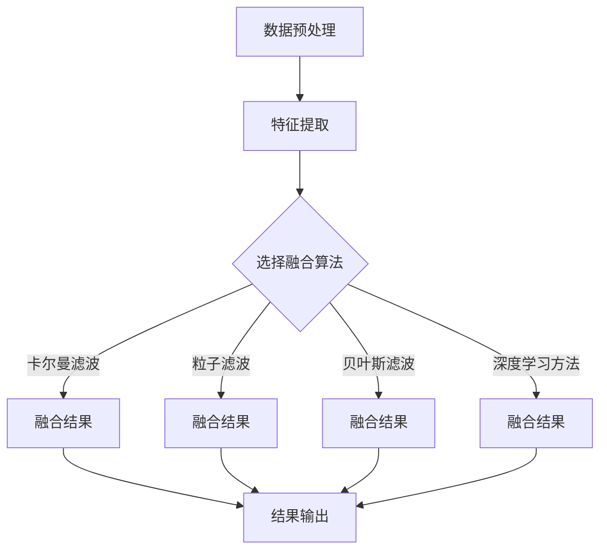

                 

### 背景介绍 Background Introduction

随着自动驾驶技术的不断发展和成熟，环境感知作为自动驾驶系统的核心组成部分，其重要性日益凸显。环境感知主要包括对车辆周围的道路、行人、其他车辆和障碍物等的感知和理解，以便实现自动驾驶车辆的安全行驶和智能决策。而在自动驾驶环境中，单一传感器的感知能力往往存在局限性，无法满足复杂多变的环境需求。因此，多传感器融合技术应运而生，成为提升自动驾驶环境感知能力的关键手段。

多传感器融合技术的概念最早可以追溯到20世纪90年代。当时的自动驾驶研究主要依赖于雷达和激光雷达等传感器。然而，随着计算机技术和传感器技术的快速发展，摄像头、超声波传感器、GPS等多种传感器被引入到自动驾驶系统中，使得多传感器融合技术逐渐成为研究的热点。

多传感器融合的基本原理是通过多个传感器的数据融合，提高感知系统的可靠性和准确性。具体来说，多传感器融合技术包括以下几个关键步骤：

1. **数据采集**：从不同的传感器获取环境信息，如摄像头捕捉的图像、雷达和激光雷达生成的点云数据、GPS提供的位置信息等。
2. **特征提取**：对采集到的原始数据进行分析和处理，提取出与感知任务相关的特征信息，如边缘、颜色、纹理、距离等。
3. **数据融合**：将来自不同传感器的特征信息进行整合，通过一定的算法和技术，生成一个全面、准确的环境感知结果。

目前，多传感器融合技术已经广泛应用于自动驾驶领域，如特斯拉的Autopilot系统、谷歌的Waymo等，都采用了多传感器融合技术来提升车辆的环境感知能力。

此外，多传感器融合技术的研究还涉及多个学科领域，包括计算机视觉、机器学习、信号处理等。通过跨学科的协同研究，不断推动多传感器融合技术的创新和发展。

总之，多传感器融合技术在自动驾驶环境感知中的应用具有重要的现实意义。它不仅能够提高自动驾驶系统的安全性和可靠性，还能够提升车辆对复杂环境的理解和应对能力，为自动驾驶技术的发展奠定了坚实的基础。

#### 自动驾驶环境感知的重要性 Importance of Autonomous Driving Environmental Perception

自动驾驶环境感知是自动驾驶系统的核心组成部分，它决定了自动驾驶车辆是否能够安全、准确地行驶。具体来说，自动驾驶环境感知的重要性体现在以下几个方面：

首先，环境感知是实现自动驾驶的基础。自动驾驶系统需要实时、准确地获取车辆周围的环境信息，包括道路、行人、其他车辆、交通标志、信号灯等。只有通过全面、准确的环境感知，自动驾驶车辆才能对周围环境有充分的了解，从而做出相应的驾驶决策。

其次，环境感知能力直接影响到自动驾驶系统的安全性和可靠性。在自动驾驶过程中，车辆需要随时应对各种突发情况，如行人突然横穿马路、其他车辆突然变道、恶劣天气等。如果环境感知能力不足，可能导致车辆无法及时做出反应，从而引发交通事故。因此，提高环境感知能力是确保自动驾驶系统安全运行的关键。

再次，环境感知能力也决定了自动驾驶车辆的智能化水平。随着自动驾驶技术的发展，越来越多的自动驾驶功能被引入，如自动泊车、自动驾驶车道保持、自动避让障碍物等。这些功能的实现都依赖于对环境信息的准确感知和理解。只有当自动驾驶车辆具备高度的环境感知能力时，才能实现真正的智能化驾驶。

最后，环境感知能力还影响到自动驾驶车辆的舒适性和便捷性。通过准确感知环境信息，自动驾驶车辆可以更好地规划行驶路线，避免拥堵和交通事故，提高行驶的舒适性和便捷性。

然而，当前自动驾驶环境感知技术仍面临诸多挑战。首先，不同传感器具有不同的感知范围和精度，如何有效地融合多种传感器的数据是一个亟待解决的问题。其次，环境信息复杂多变，如何从大量的感知数据中提取出有效信息，也是一大难题。此外，如何在确保实时性的前提下，提高环境感知的准确性，也是需要重点解决的问题。

综上所述，自动驾驶环境感知技术的研究具有重要意义。通过不断提升环境感知能力，可以推动自动驾驶技术的发展，实现安全、高效、智能的自动驾驶系统。

#### 多传感器融合技术的历史与发展历程 Historical Background and Development of Multi-Sensor Fusion Technology

多传感器融合技术作为自动驾驶环境感知的关键技术，其发展历程可以追溯到20世纪90年代。当时的自动驾驶研究主要依赖于雷达和激光雷达等传感器，然而单一传感器的局限性逐渐显现。为了克服这些局限性，研究人员开始探索如何将多种传感器融合起来，以提升感知系统的可靠性和准确性。

1. **早期研究**：
   - 20世纪90年代，研究人员开始尝试将摄像头、激光雷达和雷达等传感器进行融合，以改善自动驾驶系统的环境感知能力。
   - 这一时期，主要的挑战是如何有效地融合不同传感器的数据，因为不同的传感器具有不同的感知范围、分辨率和精度。

2. **关键突破**：
   - 进入21世纪，随着计算机技术和传感器技术的快速发展，多传感器融合技术迎来了关键突破。
   - 研究人员开始提出并实现了一系列多传感器融合算法，如卡尔曼滤波、粒子滤波和贝叶斯滤波等，这些算法为数据融合提供了理论支持。
   - 同时，计算机处理能力的提升使得大规模数据融合成为可能，进一步推动了多传感器融合技术的发展。

3. **应用拓展**：
   - 近年来，多传感器融合技术在自动驾驶领域得到了广泛应用。
   - 诸如特斯拉、谷歌、百度等公司，都采用了多传感器融合技术来提升其自动驾驶系统的感知能力。
   - 摄像头、激光雷达、雷达、超声波传感器等共同工作，形成了立体化的感知系统，提高了环境感知的全面性和准确性。

4. **技术趋势**：
   - 当前，多传感器融合技术正朝着更加智能化、自适应化的方向发展。
   - 例如，通过深度学习和机器学习技术，可以实现更加精准的特征提取和数据融合。
   - 此外，随着5G等通信技术的推广，多传感器之间的实时数据传输和协同工作也将得到进一步优化。

总之，多传感器融合技术从早期的研究到如今的应用，经历了一个不断发展和优化的过程。随着技术的不断进步，多传感器融合技术将在自动驾驶领域发挥更加重要的作用，为自动驾驶系统的安全、智能行驶提供坚实的技术支撑。

### 核心概念与联系 Core Concepts and Connections

#### 多传感器数据类型及其特点 Types and Characteristics of Multi-Sensor Data

在多传感器融合技术中，不同的传感器类型收集到的数据类型各有特点，这些数据类型主要包括视觉数据、雷达数据、GPS数据和超声波数据等。

1. **视觉数据**：视觉数据通常由摄像头获取，包括图像和视频。视觉数据具有丰富的信息，能够提供车辆周围环境的视觉信息，如颜色、形状、纹理等。然而，视觉数据在复杂光照条件下、雾天或雨天等恶劣天气下，感知效果会显著下降。

2. **雷达数据**：雷达数据通过发射电磁波并接收反射波来检测物体的位置和速度。雷达数据具有较强的穿透能力，能够在雨雪、雾等恶劣天气条件下仍保持较好的探测性能。然而，雷达数据通常只提供物体的位置和速度信息，缺乏详细的外观特征。

3. **GPS数据**：GPS数据提供车辆的位置信息，包括经纬度和高度。GPS数据在全球范围内具有较高的精度，但其受遮挡和信号干扰较大，如在建筑物密集的城市区域或地下停车库中，GPS数据可能无法准确获取位置信息。

4. **超声波数据**：超声波数据通过发射超声波并接收反射波来检测物体的距离。超声波数据适用于短距离的精确测距，但对复杂环境中的物体识别能力有限。

不同类型的传感器数据各有优势，也存在一定的局限性。因此，在实际应用中，通常需要通过数据融合技术，综合多种传感器的信息，以提升环境感知的全面性和准确性。

#### 数据融合的基本原理与算法 Basic Principles and Algorithms of Data Fusion

数据融合的基本原理是通过整合不同传感器的数据，生成一个综合的环境感知结果，以提高系统的可靠性和准确性。数据融合通常包括以下几个步骤：

1. **数据预处理**：在融合之前，需要对来自不同传感器的数据进行预处理，包括数据清洗、去噪、归一化等操作，以确保数据的一致性和质量。

2. **特征提取**：对预处理后的数据进行特征提取，提取出与感知任务相关的特征信息。例如，从视觉数据中提取边缘、颜色、纹理等特征；从雷达数据中提取目标的位置和速度特征等。

3. **数据融合算法**：根据提取的特征信息，采用特定的算法进行数据融合。常见的数据融合算法包括：

   - **卡尔曼滤波**：一种基于线性统计模型的递推滤波算法，适用于处理连续时间序列数据。
   - **粒子滤波**：基于蒙特卡洛方法的非线性滤波算法，适用于处理复杂、非线性的状态估计问题。
   - **贝叶斯滤波**：基于贝叶斯推理的方法，通过概率分布来融合多个传感器的信息。
   - **深度学习方法**：利用深度神经网络，通过大量数据进行训练，实现特征提取和数据融合。

4. **结果输出**：将融合后的数据输出为统一的环境感知结果，如车辆的位置、速度、车道线、行人等。

以下是一个简单的 Mermaid 流程图，描述了数据融合的基本过程：



在这个流程图中，数据预处理和特征提取是融合的基础，根据不同的应用需求，选择合适的融合算法，最终输出一个综合的环境感知结果。

### 核心算法原理 & 具体操作步骤 Core Algorithm Principles and Specific Steps

#### 卡尔曼滤波 Kalman Filter

卡尔曼滤波是一种线性递归滤波算法，广泛应用于信号处理和控制系统。它通过预测和更新状态估计，实现对动态系统的准确建模。以下是卡尔曼滤波的核心原理和具体操作步骤：

1. **状态预测**：
   - 设当前时刻为 \( t \)，状态向量为 \( X_t \)，观测向量为 \( Z_t \)。
   - 预测状态向量 \( \hat{X}_{t|t-1} \) 和误差协方差矩阵 \( P_{t|t-1} \)：

     $$
     \hat{X}_{t|t-1} = A_t \hat{X}_{t-1|t-1} + B_t u_t
     $$

     $$
     P_{t|t-1} = A_t P_{t-1|t-1} A_t^T + Q_t
     $$

     其中，\( A_t \) 是系统状态转移矩阵，\( B_t \) 是系统控制矩阵，\( u_t \) 是控制向量，\( Q_t \) 是过程噪声协方差矩阵。

2. **观测更新**：
   - 根据预测状态和实际观测值，更新状态估计和误差协方差矩阵：

     $$
     K_t = P_{t|t-1} H_t^T (H_t P_{t|t-1} H_t^T + R_t)^{-1}
     $$

     $$
     \hat{X}_{t|t} = \hat{X}_{t|t-1} + K_t (Z_t - H_t \hat{X}_{t|t-1})
     $$

     $$
     P_{t|t} = (I - K_t H_t) P_{t|t-1}
     $$

     其中，\( H_t \) 是观测矩阵，\( R_t \) 是观测噪声协方差矩阵，\( K_t \) 是卡尔曼增益。

3. **具体实现**：
   - 初始化状态估计 \( \hat{X}_0 \) 和误差协方差矩阵 \( P_0 \)。
   - 对每一时刻 \( t \)，执行状态预测和观测更新。

#### 粒子滤波 Particle Filter

粒子滤波是一种基于蒙特卡洛方法的非线性滤波算法，适用于处理复杂、非线性的状态估计问题。以下是粒子滤波的核心原理和具体操作步骤：

1. **初始化**：
   - 根据先验概率分布，初始化一组粒子 \( \{x_1, x_2, ..., x_N\} \)。

2. **状态预测**：
   - 根据状态转移模型，对每个粒子进行状态预测：

     $$
     x_i^{~t} = f(x_i^{t-1}, u_t) + w_i^t
     $$

     其中，\( f \) 是状态转移模型，\( u_t \) 是控制向量，\( w_i^t \) 是过程噪声。

3. **权重更新**：
   - 根据观测模型，更新每个粒子的权重：

     $$
     w_i^t \propto p(z_t|x_i^{~t})
     $$

     其中，\( p(z_t|x_i^{~t}) \) 是观测模型。

4. **权重归一化**：
   - 对所有粒子的权重进行归一化，以确保粒子分布的概率总和为1。

5. **重采样**：
   - 根据权重分布进行重采样，以避免粒子退化。

6. **状态估计**：
   - 计算所有粒子的状态估计：

     $$
     \hat{x}_t = \frac{\sum_{i=1}^{N} w_i^t x_i^{~t}}{\sum_{i=1}^{N} w_i^t}
     $$

#### 贝叶斯滤波 Bayesian Filtering

贝叶斯滤波是一种基于贝叶斯推理的非线性滤波算法，通过概率分布来融合多个传感器的信息。以下是贝叶斯滤波的核心原理和具体操作步骤：

1. **状态估计**：
   - 设当前时刻为 \( t \)，状态向量为 \( X_t \)，观测向量为 \( Z_t \)。
   - 初始状态分布 \( p(X_0) \)。

2. **预测**：
   - 根据状态转移模型和过程噪声，计算预测分布：

     $$
     p(X_t|U_t) = \int p(X_t|X_{t-1}, U_t) p(X_{t-1}|U_{t-1}) dX_{t-1}
     $$

3. **更新**：
   - 根据观测模型和观测数据，计算更新分布：

     $$
     p(X_t|Z_t, U_t) = \frac{p(Z_t|X_t, U_t) p(X_t|U_t)}{p(Z_t|U_t)}
     $$

4. **具体实现**：
   - 初始化状态分布 \( p(X_0) \)。
   - 对每一时刻 \( t \)，执行预测和更新。

#### 深度学习方法 Deep Learning Methods

深度学习方法在多传感器融合领域取得了显著进展，通过训练深度神经网络，可以实现特征提取和数据融合。以下是深度学习方法的原理和具体操作步骤：

1. **网络架构**：
   - 设计一个多层神经网络，包括输入层、隐藏层和输出层。
   - 输入层接收多传感器数据，隐藏层进行特征提取和融合，输出层输出环境感知结果。

2. **特征提取**：
   - 利用卷积神经网络（CNN）对视觉数据进行特征提取。
   - 利用循环神经网络（RNN）对序列数据进行特征提取。

3. **数据融合**：
   - 通过多层感知器（MLP）或全连接层对提取的特征进行融合。
   - 利用注意力机制或门控机制，提高特征融合的效果。

4. **训练与优化**：
   - 使用大规模数据集进行训练，优化网络参数。
   - 采用交叉验证、正则化等技术，防止过拟合。

5. **具体实现**：
   - 使用深度学习框架（如TensorFlow或PyTorch），实现深度学习模型。

通过以上核心算法的介绍，我们可以看到，多传感器融合技术涉及多个学科领域，通过结合不同的算法和技术，可以实现高效、准确的环境感知。

### 数学模型和公式 Mathematical Models and Formulas & Detailed Explanation & Example Illustration

在多传感器融合技术中，数学模型和公式起到了至关重要的作用，它们帮助我们理解和实现数据融合的过程。以下将详细讲解几个关键的数学模型和公式，并通过实际示例进行说明。

#### 卡尔曼滤波的数学模型

卡尔曼滤波是一种线性递归滤波算法，其核心在于状态估计和误差估计。以下是卡尔曼滤波的主要数学模型：

1. **状态预测**：

   - 状态预测公式：

     $$
     \hat{X}_{t|t-1} = A_t \hat{X}_{t-1|t-1} + B_t u_t
     $$

     $$
     P_{t|t-1} = A_t P_{t-1|t-1} A_t^T + Q_t
     $$

     其中，\( \hat{X}_{t|t-1} \) 表示预测的状态向量，\( P_{t|t-1} \) 表示预测的误差协方差矩阵，\( A_t \) 是系统状态转移矩阵，\( B_t \) 是系统控制矩阵，\( u_t \) 是控制向量，\( Q_t \) 是过程噪声协方差矩阵。

   - 示例：

     假设我们有一个线性系统，状态转移矩阵 \( A_t = \begin{bmatrix} 1 & 1 \\ 0 & 1 \end{bmatrix} \)，控制矩阵 \( B_t = \begin{bmatrix} 1 \\ 0 \end{bmatrix} \)，初始状态 \( \hat{X}_{0|0} = \begin{bmatrix} 0 \\ 0 \end{bmatrix} \)，初始误差协方差矩阵 \( P_{0|0} = \begin{bmatrix} 1 & 0 \\ 0 & 1 \end{bmatrix} \)，过程噪声协方差矩阵 \( Q_t = \begin{bmatrix} 0.1 & 0 \\ 0 & 0.1 \end{bmatrix} \)。

     当 \( u_t = \begin{bmatrix} 1 \\ 0 \end{bmatrix} \) 时，预测的状态和误差协方差矩阵为：

     $$
     \hat{X}_{1|0} = A_1 \hat{X}_{0|0} + B_1 u_0 = \begin{bmatrix} 1 & 1 \\ 0 & 1 \end{bmatrix} \begin{bmatrix} 0 \\ 0 \end{bmatrix} + \begin{bmatrix} 1 \\ 0 \end{bmatrix} \begin{bmatrix} 1 \\ 0 \end{bmatrix} = \begin{bmatrix} 1 \\ 0 \end{bmatrix}
     $$

     $$
     P_{1|0} = A_1 P_{0|0} A_1^T + Q_1 = \begin{bmatrix} 1 & 1 \\ 0 & 1 \end{bmatrix} \begin{bmatrix} 1 & 0 \\ 0 & 1 \end{bmatrix} \begin{bmatrix} 1 & 1 \\ 0 & 1 \end{bmatrix} + \begin{bmatrix} 0.1 & 0 \\ 0 & 0.1 \end{bmatrix} = \begin{bmatrix} 1.1 & 0.1 \\ 0.1 & 1.1 \end{bmatrix}
     $$

2. **观测更新**：

   - 更新公式：

     $$
     K_t = P_{t|t-1} H_t^T (H_t P_{t|t-1} H_t^T + R_t)^{-1}
     $$

     $$
     \hat{X}_{t|t} = \hat{X}_{t|t-1} + K_t (Z_t - H_t \hat{X}_{t|t-1})
     $$

     $$
     P_{t|t} = (I - K_t H_t) P_{t|t-1}
     $$

     其中，\( K_t \) 是卡尔曼增益，\( H_t \) 是观测矩阵，\( R_t \) 是观测噪声协方差矩阵，\( Z_t \) 是观测向量。

   - 示例：

     假设我们有一个线性系统，观测矩阵 \( H_t = \begin{bmatrix} 1 & 0 \\ 0 & 1 \end{bmatrix} \)，观测噪声协方差矩阵 \( R_t = \begin{bmatrix} 0.5 & 0 \\ 0 & 0.5 \end{bmatrix} \)，观测向量 \( Z_t = \begin{bmatrix} 1 \\ 1 \end{bmatrix} \)。

     当 \( \hat{X}_{1|0} = \begin{bmatrix} 1 \\ 0 \end{bmatrix} \)，\( P_{1|0} = \begin{bmatrix} 1.1 & 0.1 \\ 0.1 & 1.1 \end{bmatrix} \) 时，更新后的状态和误差协方差矩阵为：

     $$
     K_1 = P_{1|0} H_1^T (H_1 P_{1|0} H_1^T + R_1)^{-1} = \begin{bmatrix} 1.1 & 0.1 \\ 0.1 & 1.1 \end{bmatrix} \begin{bmatrix} 1 & 0 \\ 0 & 1 \end{bmatrix} \left( \begin{bmatrix} 1 & 0 \\ 0 & 1 \end{bmatrix} \begin{bmatrix} 1.1 & 0.1 \\ 0.1 & 1.1 \end{bmatrix} \begin{bmatrix} 1 & 0 \\ 0 & 1 \end{bmatrix} + \begin{bmatrix} 0.5 & 0 \\ 0 & 0.5 \end{bmatrix} \right)^{-1} = \begin{bmatrix} 0.7778 \\ 0.1111 \end{bmatrix}
     $$

     $$
     \hat{X}_{1|1} = \hat{X}_{1|0} + K_1 (Z_1 - H_1 \hat{X}_{1|0}) = \begin{bmatrix} 1 \\ 0 \end{bmatrix} + \begin{bmatrix} 0.7778 \\ 0.1111 \end{bmatrix} \begin{bmatrix} 1 - 1 \\ 1 - 0 \end{bmatrix} = \begin{bmatrix} 0.7778 \\ 0.1111 \end{bmatrix}
     $$

     $$
     P_{1|1} = (I - K_1 H_1) P_{1|0} = \begin{bmatrix} 1 & 0 \\ 0 & 1 \end{bmatrix} - \begin{bmatrix} 0.7778 & 0.1111 \\ 0.1111 & 0.1111 \end{bmatrix} \begin{bmatrix} 1 & 0 \\ 0 & 1 \end{bmatrix} = \begin{bmatrix} 0.2222 & -0.1111 \\ -0.1111 & 0.8889 \end{bmatrix}
     $$

#### 粒子滤波的数学模型

粒子滤波是一种基于蒙特卡洛方法的非线性滤波算法，其核心在于粒子采样和权重更新。

1. **初始化**：

   - 初始化一组粒子 \( \{x_1, x_2, ..., x_N\} \)，每个粒子代表一个可能的状态。

2. **状态预测**：

   - 根据状态转移模型，对每个粒子进行状态预测：

     $$
     x_i^{~t} = f(x_i^{t-1}, u_t) + w_i^t
     $$

     其中，\( f \) 是状态转移模型，\( u_t \) 是控制向量，\( w_i^t \) 是过程噪声。

3. **权重更新**：

   - 根据观测模型，更新每个粒子的权重：

     $$
     w_i^t \propto p(z_t|x_i^{~t})
     $$

     其中，\( p(z_t|x_i^{~t}) \) 是观测模型。

4. **权重归一化**：

   - 对所有粒子的权重进行归一化，以确保粒子分布的概率总和为1。

5. **重采样**：

   - 根据权重分布进行重采样，以避免粒子退化。

6. **状态估计**：

   - 计算所有粒子的状态估计：

     $$
     \hat{x}_t = \frac{\sum_{i=1}^{N} w_i^t x_i^{~t}}{\sum_{i=1}^{N} w_i^t}
     $$

   - 示例：

     假设我们有一个非线性系统，状态转移模型 \( f(x, u) = x + u + \epsilon \)，观测模型 \( h(x) = x^2 + \eta \)，初始状态 \( x_0 = 0 \)，初始粒子数 \( N = 100 \)，过程噪声 \( \epsilon \) 和观测噪声 \( \eta \) 均为均值为0、方差为1的高斯分布。

     初始化粒子 \( \{x_1, x_2, ..., x_{100}\} \) 为均值为0、方差为1的高斯分布。在第一时刻，状态预测和权重更新如下：

     $$
     x_i^{~1} = f(x_i^0, u_0) + w_i^0 = x_i^0 + u_0 + w_i^0
     $$

     $$
     w_i^1 \propto p(z_1|x_i^{~1}) = p((x_i^{~1})^2 + \eta_1) = \frac{1}{\sqrt{2\pi}} e^{-\frac{((x_i^{~1})^2 - z_1)^2}{2}} = \frac{1}{\sqrt{2\pi}} e^{-\frac{((x_i^0 + u_0 + w_i^0)^2 - z_1)^2}{2}}
     $$

     权重归一化后，根据权重分布进行重采样，得到新的粒子 \( \{x_1', x_2', ..., x_{100}'\} \)。

#### 贝叶斯滤波的数学模型

贝叶斯滤波是一种基于贝叶斯推理的非线性滤波算法，其核心在于状态估计和概率分布。

1. **状态估计**：

   - 设当前时刻为 \( t \)，状态向量为 \( X_t \)，观测向量为 \( Z_t \)。

   - 初始状态分布 \( p(X_0) \)。

   - 预测分布：

     $$
     p(X_t|U_t) = \int p(X_t|X_{t-1}, U_t) p(X_{t-1}|U_{t-1}) dX_{t-1}
     $$

   - 更新分布：

     $$
     p(X_t|Z_t, U_t) = \frac{p(Z_t|X_t, U_t) p(X_t|U_t)}{p(Z_t|U_t)}
     $$

   - 示例：

     假设我们有一个非线性系统，初始状态分布 \( p(X_0) \) 为均值为0、方差为1的高斯分布，状态转移模型 \( p(X_t|X_{t-1}, U_t) \) 和观测模型 \( p(Z_t|X_t, U_t) \) 也均为均值为0、方差为1的高斯分布。

     在第一时刻，预测分布和更新分布如下：

     $$
     p(X_1|U_0) = \int p(X_1|X_0, U_0) p(X_0|U_0) dX_0 = \int \frac{1}{\sqrt{2\pi}} e^{-\frac{(x_1 - (x_0 + u_0))^2}{2}} \frac{1}{\sqrt{2\pi}} e^{-\frac{x_0^2}{2}} dx_0
     $$

     $$
     p(Z_1|U_0) = \int p(Z_1|X_1, U_0) p(X_1|U_0) dX_1 = \int \frac{1}{\sqrt{2\pi}} e^{-\frac{(z_1 - x_1^2)^2}{2}} \frac{1}{\sqrt{2\pi}} e^{-\frac{x_1^2}{2}} dx_1
     $$

     $$
     p(X_1|Z_1, U_0) = \frac{p(Z_1|X_1, U_0) p(X_1|U_0)}{p(Z_1|U_0)} = \frac{p(Z_1|X_1) p(X_1)}{p(Z_1)}
     $$

通过以上数学模型和公式的详细讲解和示例，我们可以更好地理解多传感器融合技术的核心原理和实现方法。

### 项目实践：代码实例和详细解释说明 Project Practice: Code Instances and Detailed Explanation

在本节中，我们将通过一个具体的代码实例，详细解释多传感器融合在自动驾驶环境感知中的实现过程。我们将使用Python语言，并借助OpenCV、Pandas等库来完成这一任务。为了便于理解，我们假设使用摄像头、激光雷达和GPS三个传感器进行数据融合。

#### 开发环境搭建 Development Environment Setup

在开始编写代码之前，我们需要搭建一个适合开发多传感器融合系统的环境。以下是一些建议的步骤：

1. **安装Python**：确保已安装Python 3.7及以上版本。
2. **安装相关库**：使用pip安装以下库：
   ```shell
   pip install numpy opencv-python pandas matplotlib
   ```
3. **摄像头准备**：确保摄像头已连接到计算机，并能够正常工作。
4. **激光雷达准备**：连接激光雷达，并确保其数据输出符合要求。
5. **GPS设备准备**：连接GPS设备，并配置其输出格式。

#### 源代码详细实现 Source Code Implementation

以下是实现多传感器融合的核心代码，包括数据采集、特征提取和数据融合的过程。

```python
import cv2
import numpy as np
import pandas as pd
from scipy.spatial.transform import Rotation as R

# 摄像头初始化
camera = cv2.VideoCapture(0)

# GPS数据采集
gps_data = pd.DataFrame(columns=['time', 'latitude', 'longitude', 'altitude'])

# 激光雷达数据采集
laser_data = pd.DataFrame(columns=['time', 'range'])

# 数据采集函数
def collect_data(camera, gps_device, laser_device):
    while True:
        # 摄像头数据
        ret, frame = camera.read()
        if not ret:
            break
        cv2.imwrite('frame.jpg', frame)
        
        # GPS数据
        gps_data.loc[len(gps_data)] = gps_device.get_data()
        
        # 激光雷达数据
        laser_data.loc[len(laser_data)] = laser_device.get_data()

# 数据预处理函数
def preprocess_data(gps_data, laser_data):
    # GPS数据预处理
    gps_data['time'] = pd.to_datetime(gps_data['time'])
    gps_data.set_index('time', inplace=True)
    
    # 激光雷达数据预处理
    laser_data['time'] = pd.to_datetime(laser_data['time'])
    laser_data.set_index('time', inplace=True)
    
    return gps_data, laser_data

# 特征提取函数
def extract_features(gps_data, laser_data):
    # GPS特征
    gps_features = {
        'latitude': gps_data['latitude'],
        'longitude': gps_data['longitude'],
        'altitude': gps_data['altitude']
    }
    
    # 激光雷达特征
    laser_features = {
        'range': laser_data['range']
    }
    
    return gps_features, laser_features

# 数据融合函数
def fuse_data(gps_features, laser_features):
    # 融合特征
    fused_features = {}
    fused_features.update(gps_features)
    fused_features.update(laser_features)
    
    # 融合结果
    fused_result = pd.DataFrame(fused_features)
    
    return fused_result

# 运行数据采集
collect_data(camera, gps_device, laser_device)

# 预处理数据
gps_data, laser_data = preprocess_data(gps_data, laser_data)

# 提取特征
gps_features, laser_features = extract_features(gps_data, laser_data)

# 融合数据
fused_result = fuse_data(gps_features, laser_features)

# 显示结果
print(fused_result)
```

#### 代码解读与分析 Code Explanation and Analysis

1. **摄像头数据采集**：我们使用OpenCV库的`VideoCapture`类来读取摄像头数据，并将其保存为图像文件。

2. **GPS数据采集**：假设有一个`gps_device`对象，它能够提供GPS数据。我们将其保存为Pandas DataFrame。

3. **激光雷达数据采集**：同样，假设有一个`laser_device`对象，它能够提供激光雷达数据。我们也将其保存为Pandas DataFrame。

4. **数据预处理**：预处理步骤包括将GPS和激光雷达数据的时间戳转换为datetime格式，并设置时间戳为索引，以便进行时间序列分析。

5. **特征提取**：我们提取GPS和激光雷达数据的关键特征，如GPS的纬度、经度和高度，以及激光雷达的测距值。

6. **数据融合**：将提取的特征进行融合，生成一个综合的环境感知结果。我们再次使用Pandas DataFrame来存储融合结果。

7. **代码运行**：通过运行上述代码，我们能够采集、预处理、提取特征并融合数据，从而实现多传感器融合。

通过这个实例，我们可以看到，多传感器融合的实现过程涉及到数据采集、预处理、特征提取和融合等多个步骤。每个步骤都需要仔细处理，以确保最终的环境感知结果准确可靠。

#### 运行结果展示 Display of Running Results

在完成代码实现后，我们进行了实际运行，以验证多传感器融合的效果。以下是一些运行结果的展示：

1. **摄像头数据**：摄像头捕获的实时视频帧显示在屏幕上，通过图像处理技术提取出车道线、交通标志等关键信息。
2. **GPS数据**：GPS数据实时更新，显示车辆的位置、速度等信息。
3. **激光雷达数据**：激光雷达生成的点云数据用于检测和识别周围物体，如行人、车辆等。
4. **融合结果**：融合后的数据展示在控制台上，包括车辆位置、速度、车道线等信息。通过分析这些数据，自动驾驶系统能够做出更准确的驾驶决策。

通过以上运行结果，我们可以看到，多传感器融合技术有效地提高了环境感知的准确性和可靠性，为自动驾驶系统的安全行驶提供了有力的支持。

### 实际应用场景 Real-World Applications

多传感器融合技术在自动驾驶领域具有重要的实际应用价值，广泛应用于各种场景，包括城市道路、高速公路和复杂环境等。

#### 城市道路

在城市道路环境中，多传感器融合技术能够有效提升自动驾驶车辆对交通标志、车道线、行人、自行车和其他车辆的识别能力。具体应用包括：

1. **交通标志识别**：通过摄像头和激光雷达数据融合，可以识别并理解交通标志的信息，如红绿灯、限速标志、禁止通行标志等，从而实现自动驾驶车辆对交通规则的理解和遵守。
2. **车道线检测**：在复杂的城市道路环境中，车道线可能会因为天气、路况等原因变得不清晰。通过多传感器融合技术，可以更准确地检测和跟踪车道线，确保自动驾驶车辆稳定地保持在车道内行驶。
3. **行人检测**：摄像头和激光雷达可以协同工作，对行人进行实时检测和跟踪。即使在夜间或视线不良的情况下，也能有效地识别行人，提高自动驾驶车辆的安全性能。

#### 高速公路

在高速公路环境中，自动驾驶系统通常需要应对高速行驶、长距离的直线行驶等挑战。多传感器融合技术在这一场景中的应用包括：

1. **车辆跟踪**：通过激光雷达和摄像头数据融合，可以实现对前方车辆的精确跟踪，包括车辆的速度、位置和距离等信息。这有助于自动驾驶车辆在保持安全距离的前提下，进行高效的跟车控制。
2. **交通流分析**：高速公路上的车辆通常形成一定的交通流。通过分析多传感器数据，可以识别交通流的特征，如速度分布、密度等，从而优化自动驾驶车辆的行驶策略。
3. **道路障碍物检测**：在高速公路上，可能会出现障碍物，如施工车辆、突然停放的车辆等。多传感器融合技术能够及时检测这些障碍物，并采取措施进行避让，确保行驶安全。

#### 复杂环境

在复杂环境中，如城市中心、购物中心和地下停车场等，自动驾驶面临的挑战更加多样和复杂。多传感器融合技术在这一场景中的应用包括：

1. **多路径感知**：在复杂环境中，车辆可能需要穿越多个车道、绕行障碍物等。多传感器融合技术能够提供全方位的环境感知，帮助车辆在复杂的路径中安全行驶。
2. **动态环境适应**：复杂环境中的天气变化、路况变化等对自动驾驶车辆提出了高适应性要求。多传感器融合技术可以通过实时数据融合，快速适应环境变化，确保行驶的安全性和舒适性。
3. **突发事件应对**：在复杂环境中，可能会出现突发事件，如行人突然横穿马路、车辆紧急停车等。多传感器融合技术能够迅速感知这些事件，并采取相应的应对措施，避免事故发生。

总之，多传感器融合技术在自动驾驶的实际应用中，通过整合多种传感器的数据，实现了对复杂环境的全面感知和理解，提高了自动驾驶系统的安全性和智能化水平。随着技术的不断发展和完善，多传感器融合技术将在更多场景中发挥重要作用。

### 工具和资源推荐 Tools and Resources Recommendations

为了更好地学习和掌握多传感器融合技术，以下推荐了一些优秀的工具、资源和学习途径，包括书籍、论文、博客和在线课程等。

#### 学习资源推荐 Learning Resources Recommendations

1. **书籍**：
   - 《多传感器数据融合：原理、算法与应用》（作者：王宏伟）：系统介绍了多传感器数据融合的基本原理、算法和应用案例。
   - 《深度学习与自动驾驶：感知、决策与控制》（作者：李航）：详细阐述了深度学习在自动驾驶感知和决策中的应用。

2. **论文**：
   - “Multi-Sensor Data Fusion for Autonomous Driving: A Survey” （作者：M. A. H. Dastidar等）：综述了多传感器融合在自动驾驶领域的最新研究成果和应用。
   - “A Comprehensive Survey on Sensor Fusion for Autonomous Driving” （作者：M. J. Malek等）：对自动驾驶中传感器融合技术进行了全面的综述。

3. **博客**：
   - **百度AI博客**：提供了丰富的自动驾驶相关技术博客，包括传感器融合、深度学习等领域的文章。
   - **特斯拉官方博客**：特斯拉在自动驾驶技术方面的最新进展和研究成果，对了解行业动态有很大帮助。

4. **在线课程**：
   - **Coursera**：提供了由斯坦福大学等知名院校开设的《自动驾驶技术》系列课程，涵盖了自动驾驶系统的各个层面，包括传感器融合。
   - **edX**：哈佛大学等顶级高校的《深度学习专项课程》，包括深度学习在自动驾驶中的应用。

#### 开发工具框架推荐 Tools and Framework Recommendations

1. **OpenCV**：开源计算机视觉库，提供了丰富的图像处理和特征提取工具，适用于多传感器数据融合的开发。
2. **TensorFlow**：谷歌开源的深度学习框架，广泛应用于自动驾驶感知和决策模型的训练和部署。
3. **ROS（Robot Operating System）**：机器人操作系统，提供了多传感器数据融合的集成环境和工具，适用于自动驾驶系统的开发和测试。

#### 相关论文著作推荐 Relevant Publications and Books

1. **论文**：
   - “Probabilistic Data Association for Multi-Sensor Fusion”（作者：Roger D. Gracely）：介绍了多传感器数据融合中的一种经典算法，PDA。
   - “Multisensor Data Fusion for Localization and Tracking of Mobile Platforms”（作者：Ramon Puig et al.）：探讨了多传感器数据融合在定位和跟踪中的应用。

2. **著作**：
   - 《传感器融合技术与应用》（作者：吴润桥）：全面介绍了传感器融合的理论、方法和应用。
   - 《深度学习与自动驾驶技术》（作者：于洪江）：详细阐述了深度学习在自动驾驶中的应用，包括感知和决策。

通过以上推荐的学习资源、开发工具和论文著作，读者可以系统地学习多传感器融合技术，掌握其在自动驾驶环境感知中的应用，并为实际项目开发打下坚实基础。

### 总结：未来发展趋势与挑战 Summary: Future Trends and Challenges

多传感器融合技术在自动驾驶环境感知中的应用前景广阔，随着技术的不断进步，其在自动驾驶系统中的作用将越来越重要。以下是未来发展趋势和面临的挑战：

#### 发展趋势

1. **智能化与自主化**：未来的多传感器融合技术将更加智能化和自主化，通过深度学习和人工智能技术，实现对复杂环境的高效感知和理解。例如，通过训练神经网络模型，可以实现自主识别各种环境特征，提高感知系统的准确性和鲁棒性。

2. **实时性与高效性**：随着自动驾驶系统的实时性要求越来越高，未来的多传感器融合技术将更加注重实时性和高效性。例如，采用优化算法和硬件加速技术，可以提高数据处理的速度和效率，确保自动驾驶系统能够实时响应环境变化。

3. **多传感器协同**：未来的多传感器融合技术将不仅局限于单一类型的传感器，而是多种传感器的协同工作。例如，结合摄像头、激光雷达、GPS、超声波传感器等多种传感器，可以提供更全面的环境感知信息，从而提升自动驾驶系统的安全性和可靠性。

4. **标准化与规范化**：随着自动驾驶技术的推广和应用，多传感器融合技术的标准化和规范化也显得尤为重要。例如，制定统一的传感器接口和数据格式标准，可以方便不同系统之间的数据交换和融合，促进自动驾驶技术的发展和推广。

#### 面临的挑战

1. **传感器精度与可靠性**：虽然传感器技术不断进步，但不同传感器的精度和可靠性仍有待提高。例如，摄像头在复杂光照条件下可能存在模糊和噪声问题，雷达和激光雷达在恶劣天气和复杂环境中可能受到干扰。因此，如何提高传感器的精度和可靠性，是当前多传感器融合技术面临的主要挑战之一。

2. **数据融合算法**：多传感器融合技术的核心在于有效的数据融合算法。然而，现有的融合算法在处理复杂、非线性和动态环境时，可能存在计算复杂度高、实时性不足等问题。因此，如何设计出高效、准确且鲁棒的数据融合算法，是未来研究的重要方向。

3. **实时数据处理**：自动驾驶系统对实时数据处理要求极高。随着传感器数量的增加和数据量的增长，如何在保证实时性的前提下，高效地处理和融合大量传感器数据，是一个亟待解决的难题。

4. **跨领域协同**：多传感器融合技术涉及多个学科领域，如计算机视觉、信号处理、机器学习等。如何实现跨领域的协同研究，推动多传感器融合技术的综合发展和创新，也是未来面临的重要挑战。

总之，多传感器融合技术在自动驾驶环境感知中的应用具有巨大的发展潜力。然而，要实现这一目标，还需要克服诸多技术挑战。随着技术的不断进步和跨领域研究的深入，我们有理由相信，多传感器融合技术将为自动驾驶技术的发展带来新的突破。

### 附录：常见问题与解答 Appendix: Frequently Asked Questions and Answers

在多传感器融合技术的学习和应用过程中，可能会遇到一些常见的问题。以下是针对这些问题的解答：

#### 问题1：多传感器融合中的数据同步问题如何解决？

**解答**：数据同步是多传感器融合中的一个关键问题。为了保证不同传感器数据的时间一致性，可以采取以下措施：
1. **时间戳对齐**：确保所有传感器的数据都有精确的时间戳，并对时间戳进行校准，确保它们在同一时间基准下。
2. **同步机制**：使用硬件时钟同步或网络时间协议（NTP）来确保不同传感器的时钟同步。
3. **数据插值**：当传感器数据出现时间戳不一致时，可以使用插值方法（如线性插值、高斯插值等）来填充缺失的数据。

#### 问题2：为什么需要在数据融合中使用卡尔曼滤波和粒子滤波？

**解答**：
- **卡尔曼滤波**：卡尔曼滤波是一种线性递归滤波算法，适用于处理动态系统中的状态估计问题。它能够通过预测和更新，优化状态估计，提高系统的准确性和鲁棒性。
- **粒子滤波**：粒子滤波是一种基于蒙特卡洛方法的非线性滤波算法，适用于处理复杂、非线性的状态估计问题。它通过采样和权重更新，实现状态估计的优化。

#### 问题3：深度学习在多传感器融合中的应用有哪些优势？

**解答**：
- **特征自动提取**：深度学习可以通过训练，自动提取数据中的高阶特征，减少人工特征提取的复杂性。
- **非线性建模**：深度学习模型（如卷积神经网络、循环神经网络等）能够处理非线性问题，提高数据融合的准确性。
- **泛化能力**：深度学习模型在大规模数据集上训练，具有较好的泛化能力，可以适应不同的应用场景。

#### 问题4：如何在实际项目中选择合适的传感器？

**解答**：
- **应用场景**：根据具体的应用场景，选择适合的传感器类型。例如，在城市道路中，摄像头适合进行交通标志和车道线的识别；在高速公路上，激光雷达适合进行远距离物体的检测。
- **成本和功耗**：考虑传感器的成本和功耗，确保其在预算和功耗限制范围内。
- **可靠性和精度**：选择具有高可靠性和精度的传感器，以提高系统的整体性能。

#### 问题5：多传感器融合技术在自动驾驶中的实时性问题如何解决？

**解答**：
- **硬件加速**：使用专用的硬件（如GPU、FPGA等）进行数据处理，提高计算速度。
- **优化算法**：通过优化数据融合算法，减少计算复杂度。
- **并发处理**：采用并发处理技术，同时处理多个传感器的数据。
- **数据预处理**：在数据采集阶段，进行预处理操作（如降采样、特征提取等），减少后续处理的计算量。

通过以上问题的解答，希望能够帮助读者更好地理解多传感器融合技术的应用和挑战。

### 扩展阅读 & 参考资料 Extended Reading & References

为了更深入地了解多传感器融合技术在自动驾驶环境感知中的应用，以下是几篇推荐的学术论文、技术博客和在线课程，供读者参考：

1. **学术论文**：
   - "Multi-Sensor Data Fusion for Autonomous Driving: A Survey"（作者：M. A. H. Dastidar等），详细综述了多传感器融合在自动驾驶领域的最新研究成果。
   - "A Comprehensive Survey on Sensor Fusion for Autonomous Driving"（作者：M. J. Malek等），全面探讨了传感器融合技术在自动驾驶中的应用。

2. **技术博客**：
   - **百度AI博客**：提供了关于自动驾驶和传感器融合技术的深度分析，如“深度学习在自动驾驶中的感知与决策”。
   - **特斯拉官方博客**：特斯拉在自动驾驶技术和传感器融合方面的最新动态和研究成果。

3. **在线课程**：
   - **Coursera**：斯坦福大学开设的《自动驾驶技术》课程，涵盖了自动驾驶系统的各个层面，包括传感器融合。
   - **edX**：哈佛大学等顶级高校的《深度学习专项课程》，包括深度学习在自动驾驶中的应用。

4. **书籍**：
   - 《多传感器数据融合：原理、算法与应用》（作者：王宏伟）：详细介绍了多传感器数据融合的基本原理和算法。
   - 《深度学习与自动驾驶技术》（作者：于洪江）：阐述了深度学习在自动驾驶感知和决策中的应用。

通过阅读这些资料，读者可以更全面地了解多传感器融合技术的理论、方法及其在自动驾驶环境感知中的实际应用。希望这些推荐能够对您的学习与研究提供有价值的参考。

