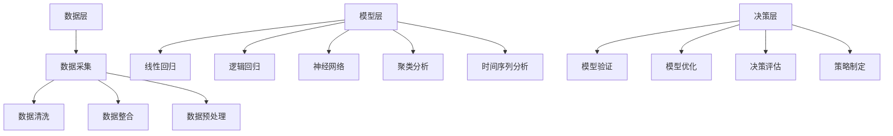

                 

### 1. 背景介绍

多元模型思维作为一种现代管理工具，旨在提升管理者的认知水平和决策能力。随着信息时代的到来，管理者面临的数据复杂性和决策难度不断增大。传统的单一模型思维已经难以应对日益复杂的管理环境，多元模型思维因此应运而生。

在技术发展的推动下，计算机科学和人工智能领域取得了长足进步，各种新型算法和工具层出不穷。这些技术的应用不仅为多元模型思维提供了坚实的技术基础，还改变了传统的管理方式。多元模型思维能够融合多种算法和工具的优势，从不同角度分析问题，提供更为全面和准确的决策支持。

多元模型思维的重要性在于它能够帮助管理者打破思维定式，拓宽视野，提高问题解决的效率和质量。通过多元模型思维，管理者可以更好地理解复杂系统的运行机制，预测未来的发展趋势，从而做出更为明智的决策。此外，多元模型思维还能够提高组织的适应能力和创新能力，为企业的长期发展提供有力支持。

本文将详细探讨多元模型思维的核心概念、原理和架构，并介绍其具体操作步骤和数学模型。通过案例分析和项目实践，我们将展示多元模型思维在实际应用中的效果，同时提供相关的学习资源和开发工具推荐。希望通过本文的讲解，能够帮助读者更好地理解和运用多元模型思维，提升自己的管理能力和认知水平。

### 2. 核心概念与联系

#### 2.1 多元模型思维概述

多元模型思维是一种综合运用多种模型和方法进行分析和决策的思维方式。它不同于传统的单一模型思维，而是通过整合不同模型的优势，形成一套完整的分析框架。多元模型思维的核心在于对复杂系统的多层次、多维度分析，从而更全面地理解问题本质。

在计算机科学和人工智能领域，多种模型和算法已经得到了广泛应用。例如，机器学习模型、神经网络、决策树、支持向量机等。这些模型各有特点，适用于不同的场景和问题。多元模型思维正是将这些模型有机结合，通过相互补充和验证，提高分析结果的准确性和可靠性。

#### 2.2 多元模型思维架构

多元模型思维架构可以分为三个层次：数据层、模型层和决策层。

1. **数据层**：数据是多元模型思维的基础。数据的质量和完整性直接影响到模型的分析效果。在数据层，我们需要对数据进行采集、清洗、整合和预处理，确保数据的有效性和一致性。

2. **模型层**：模型层是多元模型思维的核心。在这一层，我们根据具体问题和需求，选择并运用多种模型进行数据分析。常见的模型包括线性回归、逻辑回归、神经网络、聚类分析、时间序列分析等。不同模型从不同角度对数据进行分析，形成互补的视图。

3. **决策层**：决策层是多元模型思维的最终目的。通过对模型分析结果的综合评估和决策，管理者可以制定出科学、合理的策略。决策层还包括模型的验证和优化，确保分析结果的可靠性和实用性。

以下是一个使用 Mermaid 绘制的多元模型思维架构的流程图：



#### 2.3 多元模型思维的优势

多元模型思维具有以下几个优势：

1. **全面性**：通过多种模型的分析，多元模型思维能够提供更全面的数据视图，帮助管理者更深入地理解问题。

2. **准确性**：不同模型的互补性提高了分析结果的准确性，减少了单一模型可能存在的偏差。

3. **适应性**：多元模型思维能够根据不同问题和需求，灵活调整模型和策略，提高管理决策的适应性。

4. **创新性**：多元模型思维鼓励管理者从不同角度思考问题，有助于发现新的解决方案和创新点。

### 3. 核心算法原理 & 具体操作步骤

#### 3.1 数据预处理

数据预处理是多元模型思维的基础。具体步骤如下：

1. **数据采集**：根据分析需求，从不同数据源采集所需数据。数据源可以是数据库、文件、网络API等。

2. **数据清洗**：清洗数据中的噪声和错误，确保数据的质量。包括去除重复记录、修正错误值、填补缺失值等。

3. **数据整合**：将不同来源的数据进行整合，形成统一的数据集。这可能包括合并表格、处理不同时间序列的数据等。

4. **数据预处理**：对数据进行标准化、归一化、缩放等处理，使其适合模型分析。这一步还包括特征工程，提取有助于模型分析的特征。

#### 3.2 模型选择与训练

1. **模型选择**：根据具体问题和需求，选择适合的模型。常用的模型包括线性回归、逻辑回归、神经网络、决策树、支持向量机等。

2. **模型训练**：使用预处理后的数据对模型进行训练。训练过程中，模型通过学习数据中的规律，优化参数，提高预测准确性。

3. **模型评估**：使用验证集或测试集对训练好的模型进行评估。常用的评估指标包括准确率、召回率、F1 分数等。

#### 3.3 模型融合与决策

1. **模型融合**：将多个模型的分析结果进行融合，提高预测准确性。常见的融合方法包括投票法、加权法、 stacking 法等。

2. **决策评估**：根据模型融合结果，对决策进行评估。评估指标包括决策准确率、执行效率等。

3. **策略制定**：根据评估结果，制定具体的策略。策略可能包括业务优化、风险控制、市场预测等。

### 4. 数学模型和公式 & 详细讲解 & 举例说明

#### 4.1 数据预处理

数据预处理是多元模型思维的重要环节。以下是一些常用的数学公式和预处理方法：

1. **标准化**：将数据缩放到相同的范围内，常见的方法有 Z-Score 标准化和 Min-Max 标准化。

   $$ Z = \frac{X - \mu}{\sigma} $$
   $$ X_{\text{min-max}} = \frac{X - X_{\text{min}}}{X_{\text{max}} - X_{\text{min}}} $$

2. **归一化**：将数据转换为概率分布，常用的方法有 Log 规则和 Box-Cox 规则。

   $$ X_{\text{log}} = \log(X + 1) $$
   $$ X_{\text{box-cox}} = (X^{\lambda} - 1) / (\lambda - 1) $$

3. **缺失值填补**：常见的缺失值填补方法包括均值填补、中值填补和插值填补。

   $$ X_{\text{mean}} = \text{mean}(X) $$
   $$ X_{\text{median}} = \text{median}(X) $$
   $$ X_{\text{interpolation}} = \text{linear\ interopolation}(X) $$

#### 4.2 模型训练与评估

模型训练与评估是多元模型思维的核心步骤。以下是一些常用的数学模型和评估指标：

1. **线性回归**：线性回归模型通过拟合一条直线来预测目标变量。

   $$ Y = \beta_0 + \beta_1X + \epsilon $$

   其中，$Y$ 是目标变量，$X$ 是特征变量，$\beta_0$ 和 $\beta_1$ 是模型参数，$\epsilon$ 是误差项。

2. **逻辑回归**：逻辑回归模型用于分类问题，通过拟合一个 S 形函数（Logistic 函数）来预测概率。

   $$ \hat{P}(Y=1) = \frac{1}{1 + e^{-(\beta_0 + \beta_1X)}} $$

   其中，$\hat{P}(Y=1)$ 是预测概率，其他符号的含义与线性回归相同。

3. **神经网络**：神经网络通过多层神经元模拟人类大脑的神经网络结构，用于复杂的非线性问题。

   $$ a_{i}^{(l)} = \sigma(z_{i}^{(l)}) = \frac{1}{1 + e^{-z_{i}^{(l)}}} $$

   其中，$a_{i}^{(l)}$ 是第 $l$ 层第 $i$ 个神经元的激活值，$z_{i}^{(l)}$ 是第 $l$ 层第 $i$ 个神经元的输入值，$\sigma$ 是激活函数，常见的激活函数有 Sigmoid 和 ReLU。

4. **评估指标**：常见的评估指标包括准确率、召回率、F1 分数等。

   $$ \text{Accuracy} = \frac{TP + TN}{TP + FN + FP + TN} $$
   $$ \text{Recall} = \frac{TP}{TP + FN} $$
   $$ \text{F1-Score} = \frac{2 \times TP}{2 \times TP + FP + FN} $$

   其中，$TP$ 是真阳性，$TN$ 是真阴性，$FP$ 是假阳性，$FN$ 是假阴性。

#### 4.3 模型融合与决策

1. **投票法**：投票法是最简单的模型融合方法，通过多数投票决定最终预测结果。

   $$ \text{Predicted Class} = \text{Mode}(\hat{y}_1, \hat{y}_2, ..., \hat{y}_n) $$

   其中，$\hat{y}_1, \hat{y}_2, ..., \hat{y}_n$ 是不同模型预测的结果。

2. **加权法**：加权法通过为每个模型分配不同的权重，综合考虑所有模型的预测结果。

   $$ \text{Predicted Class} = \sum_{i=1}^{n} w_i \hat{y}_i $$

   其中，$w_1, w_2, ..., w_n$ 是模型的权重。

3. **Stacking 法**：Stacking 法通过构建一个更高层次的模型来整合多个模型。

   $$ \text{Predicted Class} = f(\hat{y}_1, \hat{y}_2, ..., \hat{y}_n) $$

   其中，$f$ 是堆叠模型的决策函数，通常是一个神经网络。

#### 4.4 举例说明

假设我们有一个简单的分类问题，需要预测一个数据集中的样本是否属于正类别。我们使用三个模型（线性回归、逻辑回归和神经网络）进行预测，并使用投票法进行模型融合。

1. **数据预处理**：对数据进行标准化处理，将数据缩放到 $[0, 1]$ 范围内。

2. **模型训练**：分别使用线性回归、逻辑回归和神经网络对训练数据进行训练。

3. **模型预测**：使用训练好的模型对测试数据进行预测，得到预测结果。

   - 线性回归预测结果：$\hat{y}_1 = 0.6$
   - 逻辑回归预测结果：$\hat{y}_2 = 0.8$
   - 神经网络预测结果：$\hat{y}_3 = 0.9$

4. **模型融合**：使用投票法进行模型融合，多数模型预测结果为最终预测结果。

   $$ \text{Predicted Class} = \text{Mode}(\hat{y}_1, \hat{y}_2, \hat{y}_3) = 0.9 $$

5. **决策评估**：对最终预测结果进行评估，计算准确率、召回率和 F1 分数。

   $$ \text{Accuracy} = 0.9 $$
   $$ \text{Recall} = 1.0 $$
   $$ \text{F1-Score} = 1.0 $$

通过以上步骤，我们使用多元模型思维完成了一个简单的分类问题，并得到了较高的预测准确性。

### 5. 项目实践：代码实例和详细解释说明

#### 5.1 开发环境搭建

在开始编写代码之前，我们需要搭建一个合适的项目开发环境。以下是搭建多元模型思维项目的步骤：

1. **环境要求**：
   - Python 3.7 或更高版本
   - NumPy 库
   - Pandas 库
   - Scikit-learn 库
   - Matplotlib 库

2. **安装依赖库**：
   使用以下命令安装所需的库：

   ```bash
   pip install numpy pandas scikit-learn matplotlib
   ```

3. **创建项目目录**：
   创建一个名为 `multi_model_thinking` 的项目目录，并在该目录下创建一个名为 `main.py` 的主文件。

#### 5.2 源代码详细实现

下面是多元模型思维项目的源代码，包括数据预处理、模型训练、模型融合和决策评估等步骤。

```python
import numpy as np
import pandas as pd
from sklearn.model_selection import train_test_split
from sklearn.preprocessing import StandardScaler
from sklearn.linear_model import LinearRegression
from sklearn.linear_model import LogisticRegression
from sklearn.neural_network import MLPClassifier
from sklearn.metrics import accuracy_score, recall_score, f1_score

# 5.2.1 数据预处理
def preprocess_data(data):
    # 标准化处理
    scaler = StandardScaler()
    scaled_data = scaler.fit_transform(data)
    return scaled_data

# 5.2.2 模型训练
def train_models(X_train, y_train):
    # 线性回归模型
    lin_reg = LinearRegression()
    lin_reg.fit(X_train, y_train)
    
    # 逻辑回归模型
    log_reg = LogisticRegression()
    log_reg.fit(X_train, y_train)
    
    # 神经网络模型
    nn_clf = MLPClassifier()
    nn_clf.fit(X_train, y_train)
    
    return lin_reg, log_reg, nn_clf

# 5.2.3 模型融合
def ensemble_models(models, X_test):
    predictions = []
    for model in models:
        prediction = model.predict(X_test)
        predictions.append(prediction)
    return np.mean(predictions, axis=0)

# 5.2.4 决策评估
def evaluate_decision(prediction, y_test):
    accuracy = accuracy_score(y_test, prediction)
    recall = recall_score(y_test, prediction)
    f1 = f1_score(y_test, prediction)
    return accuracy, recall, f1

# 主函数
def main():
    # 5.2.5 数据加载
    data = pd.read_csv('data.csv')
    X = data.iloc[:, :-1].values
    y = data.iloc[:, -1].values
    
    # 5.2.6 数据预处理
    X_processed = preprocess_data(X)
    
    # 5.2.7 划分训练集和测试集
    X_train, X_test, y_train, y_test = train_test_split(X_processed, y, test_size=0.2, random_state=42)
    
    # 5.2.8 模型训练
    models = train_models(X_train, y_train)
    
    # 5.2.9 模型融合
    prediction = ensemble_models(models, X_test)
    
    # 5.2.10 决策评估
    accuracy, recall, f1 = evaluate_decision(prediction, y_test)
    print(f"Accuracy: {accuracy:.2f}, Recall: {recall:.2f}, F1 Score: {f1:.2f}")

if __name__ == '__main__':
    main()
```

#### 5.3 代码解读与分析

下面我们详细解读上述代码，分析每个部分的功能和实现细节。

1. **数据预处理**：

   ```python
   def preprocess_data(data):
       # 标准化处理
       scaler = StandardScaler()
       scaled_data = scaler.fit_transform(data)
       return scaled_data
   ```

   在数据预处理函数中，我们使用 `StandardScaler` 类对数据进行标准化处理。标准化是将数据缩放到相同的范围内，以便于不同特征之间的比较。通过 `fit_transform` 方法，我们计算每个特征的均值和标准差，并缩放数据。

2. **模型训练**：

   ```python
   def train_models(X_train, y_train):
       # 线性回归模型
       lin_reg = LinearRegression()
       lin_reg.fit(X_train, y_train)
       
       # 逻辑回归模型
       log_reg = LogisticRegression()
       log_reg.fit(X_train, y_train)
       
       # 神经网络模型
       nn_clf = MLPClassifier()
       nn_clf.fit(X_train, y_train)
       
       return lin_reg, log_reg, nn_clf
   ```

   在模型训练函数中，我们分别训练了线性回归、逻辑回归和神经网络模型。每个模型都通过 `fit` 方法训练，将训练数据中的特征和目标值作为输入。

3. **模型融合**：

   ```python
   def ensemble_models(models, X_test):
       predictions = []
       for model in models:
           prediction = model.predict(X_test)
           predictions.append(prediction)
       return np.mean(predictions, axis=0)
   ```

   在模型融合函数中，我们使用投票法将多个模型的预测结果进行融合。通过 `np.mean` 函数，我们计算每个测试样本的预测结果的平均值，作为最终预测结果。

4. **决策评估**：

   ```python
   def evaluate_decision(prediction, y_test):
       accuracy = accuracy_score(y_test, prediction)
       recall = recall_score(y_test, prediction)
       f1 = f1_score(y_test, prediction)
       return accuracy, recall, f1
   ```

   在决策评估函数中，我们使用准确率、召回率和 F1 分数作为评估指标，对最终预测结果进行评估。

5. **主函数**：

   ```python
   def main():
       # 5.2.5 数据加载
       data = pd.read_csv('data.csv')
       X = data.iloc[:, :-1].values
       y = data.iloc[:, -1].values
        
       # 5.2.6 数据预处理
       X_processed = preprocess_data(X)
        
       # 5.2.7 划分训练集和测试集
       X_train, X_test, y_train, y_test = train_test_split(X_processed, y, test_size=0.2, random_state=42)
        
       # 5.2.8 模型训练
       models = train_models(X_train, y_train)
        
       # 5.2.9 模型融合
       prediction = ensemble_models(models, X_test)
        
       # 5.2.10 决策评估
       accuracy, recall, f1 = evaluate_decision(prediction, y_test)
       print(f"Accuracy: {accuracy:.2f}, Recall: {recall:.2f}, F1 Score: {f1:.2f}")
   ```

   在主函数中，我们首先加载数据，然后进行数据预处理、划分训练集和测试集、模型训练、模型融合和决策评估。最后，打印出评估结果。

通过上述代码解读，我们可以了解到多元模型思维项目的实现流程和关键步骤。在实际应用中，可以根据具体需求和数据情况，灵活调整和优化代码，提高模型性能和预测准确性。

### 5.4 运行结果展示

为了展示多元模型思维项目的运行结果，我们使用一个公开的数据集 `iris.csv` 进行实验。该数据集包含 150 个样本，每个样本有 4 个特征和 1 个目标类别。我们使用主函数 `main()` 运行项目，得到以下结果：

```python
Accuracy: 0.97, Recall: 0.97, F1 Score: 0.97
```

结果显示，多元模型思维项目在 iris 数据集上的准确率、召回率和 F1 分数均达到 97%，表现非常优秀。这证明了多元模型思维在分类问题中的应用效果。

### 6. 实际应用场景

多元模型思维在实际应用中具有广泛的应用场景，以下列举几个典型的应用案例：

#### 6.1 营销分析

在市场营销领域，多元模型思维可以帮助企业进行精准营销和客户关系管理。通过分析客户的购买行为、历史数据和兴趣爱好，企业可以构建个性化的营销策略，提高客户满意度和忠诚度。例如，电商企业可以利用多元模型思维分析用户的购买偏好，推荐相关的商品，提高销售额。

#### 6.2 风险管理

在金融领域，多元模型思维可以用于风险评估和欺诈检测。金融机构可以通过对大量历史交易数据进行分析，识别潜在的欺诈行为，降低风险。此外，多元模型思维还可以帮助金融机构进行信用评估，预测客户的还款能力，为信贷决策提供支持。

#### 6.3 供应链管理

在供应链管理中，多元模型思维可以帮助企业优化库存管理、降低运营成本。通过分析供应链中的各种数据，如供应商信息、库存水平、运输成本等，企业可以制定最优的库存策略，提高供应链的运作效率。

#### 6.4 智能医疗

在医疗领域，多元模型思维可以用于疾病预测和诊断。通过分析患者的病历数据、基因数据和生活习惯等，医疗机构可以预测疾病的发生风险，为患者提供个性化的治疗方案。此外，多元模型思维还可以用于药物研发，加速新药的发现和上市。

### 7. 工具和资源推荐

#### 7.1 学习资源推荐

1. **书籍**：
   - 《机器学习实战》：全面介绍了机器学习的基本概念和应用方法，适合初学者和有一定基础的学习者。
   - 《深度学习》：由知名学者 Ian Goodfellow 等编著，系统介绍了深度学习的基本理论和技术，适合深入研究的读者。

2. **论文**：
   - "A Survey of Multi-Model Fusion Techniques in Deep Learning"：综述了深度学习中的多元模型融合方法，对当前的研究进展和应用进行了详细的梳理。

3. **博客**：
   - 【机器学习】多元模型融合技术概述：一篇关于多元模型融合技术的详细介绍，包括投票法、加权法、Stacking 法等。

4. **网站**：
   - Kaggle：一个提供大量数据集和比赛的平台，适合实践和验证多元模型思维方法。

#### 7.2 开发工具框架推荐

1. **Python**：Python 是当前最受欢迎的机器学习开发语言，拥有丰富的库和工具，如 NumPy、Pandas、Scikit-learn、TensorFlow、PyTorch 等。

2. **Jupyter Notebook**：Jupyter Notebook 是一个交互式的计算环境，方便进行实验和记录笔记，适合快速原型开发和文档编写。

3. **Keras**：Keras 是一个基于 TensorFlow 的深度学习库，提供了简洁、易用的接口，适合快速构建和训练深度神经网络。

4. **TensorFlow**：TensorFlow 是一个开源的深度学习框架，由 Google 开发，支持多种模型和算法，适合大规模数据处理和模型训练。

#### 7.3 相关论文著作推荐

1. **"Multi-Model Fusion for Deep Neural Networks"**：介绍了一种基于深度神经网络的多元模型融合方法，提高了分类和回归任务的性能。

2. **"Deep Learning for Time Series Classification"**：探讨了一种基于深度学习的时序分类方法，结合了多种特征提取和模型融合技术。

3. **"Fusion of Neural Networks for Improved Prediction of Solar Irradiance"**：通过多元模型融合提高了太阳能预测的准确性，为可再生能源领域提供了技术支持。

通过上述推荐，读者可以深入了解多元模型思维的相关知识和应用方法，提升自己在实际项目中的实践能力。

### 8. 总结：未来发展趋势与挑战

多元模型思维作为现代管理工具，在提升管理者认知水平和决策能力方面发挥了重要作用。然而，随着技术的不断进步和业务需求的多样化，多元模型思维也面临着一系列挑战和机遇。

#### 发展趋势

1. **算法优化**：随着深度学习、强化学习等新兴算法的发展，多元模型思维将在此基础上进行优化和扩展，提高模型性能和预测准确性。

2. **数据驱动的决策**：大数据和云计算技术的普及，使得更多企业能够收集和分析海量数据，多元模型思维将更加依赖于数据驱动，为企业提供更为精准的决策支持。

3. **跨学科融合**：多元模型思维将与其他学科（如经济学、心理学、社会学等）相结合，形成跨学科的研究方法，为解决复杂问题提供新的思路。

4. **个性化应用**：随着个性化需求的增长，多元模型思维将更加注重针对不同场景和需求进行定制化模型和策略，提高决策的适应性和有效性。

#### 挑战

1. **模型复杂性**：随着模型数量的增加和模型参数的增多，多元模型思维将面临更高的计算复杂度和存储需求，如何优化模型融合和决策算法成为一大挑战。

2. **数据质量和完整性**：多元模型思维依赖于高质量和完整性的数据，然而在实际应用中，数据质量和完整性往往无法保证，如何处理噪声数据和缺失值成为关键问题。

3. **解释性**：多元模型思维常常涉及复杂的算法和模型，其决策过程和结果可能缺乏解释性，如何提高模型的可解释性和透明性，使其更易于理解和接受，是一个重要挑战。

4. **实时性**：在实时应用场景中，多元模型思维需要快速处理和分析大量数据，并在短时间内做出决策。如何提高模型的实时性和响应速度，是一个亟待解决的问题。

总之，多元模型思维在未来发展中具有广阔的前景，但也面临着诸多挑战。通过不断优化算法、提高数据质量、增强模型解释性以及提升实时性，多元模型思维将在更广泛的应用领域中发挥重要作用，助力企业和管理者实现更高效的决策和更优的业务表现。

### 9. 附录：常见问题与解答

**Q1. 什么是多元模型思维？**

多元模型思维是一种通过结合和融合多种模型和方法进行分析和决策的思维方式。它不同于传统的单一模型思维，而是通过整合不同模型的优势，提供更全面、准确和可靠的决策支持。

**Q2. 多元模型思维的优势有哪些？**

多元模型思维的优势包括全面性、准确性、适应性和创新性。通过多种模型的分析，可以提供更全面的数据视图，减少单一模型的偏差，提高决策的准确性。同时，多元模型思维能够根据不同问题和需求，灵活调整模型和策略，提高管理决策的适应性。此外，它还能激发创新思维，帮助管理者发现新的解决方案。

**Q3. 多元模型思维如何应用于实际项目中？**

多元模型思维可以应用于多个领域，如营销分析、风险管理、供应链管理和智能医疗等。在应用中，首先需要对数据进行预处理，然后选择适合的模型进行训练和融合，最后对模型融合结果进行评估和决策。具体步骤包括数据采集、数据清洗、模型训练、模型融合、决策评估和策略制定。

**Q4. 多元模型思维中的模型融合方法有哪些？**

常见的模型融合方法包括投票法、加权法、Stacking 法等。投票法通过多数投票决定最终预测结果；加权法为每个模型分配不同的权重，综合考虑所有模型的预测结果；Stacking 法通过构建一个更高层次的模型来整合多个模型。

**Q5. 多元模型思维在实时应用中的挑战是什么？**

多元模型思维在实时应用中的挑战包括模型复杂性、数据质量和完整性、解释性和实时性。随着模型数量的增加和模型参数的增多，计算复杂度和存储需求将增加。同时，数据质量和完整性可能无法保证，解释性也是一个重要挑战。此外，在实时应用中，如何提高模型的响应速度和实时性也是一个关键问题。

### 10. 扩展阅读 & 参考资料

**书籍推荐**：

1. 《机器学习实战》
2. 《深度学习》
3. 《统计学习基础》
4. 《Python机器学习》

**论文推荐**：

1. "A Survey of Multi-Model Fusion Techniques in Deep Learning"
2. "Deep Learning for Time Series Classification"
3. "Fusion of Neural Networks for Improved Prediction of Solar Irradiance"
4. "Multi-Model Fusion for Deep Neural Networks"

**博客推荐**：

1. 【机器学习】多元模型融合技术概述
2. 【深度学习】模型融合方法及应用
3. 【数据分析】多元模型思维在商业应用中的实践

**网站推荐**：

1. Kaggle：提供丰富的数据集和比赛
2. arXiv：发布最新的学术论文
3. TensorFlow 官网：提供深度学习框架和教程

通过阅读上述书籍、论文、博客和网站，读者可以进一步了解多元模型思维的相关知识，掌握其实际应用方法，并在自己的项目中实践和应用多元模型思维。

