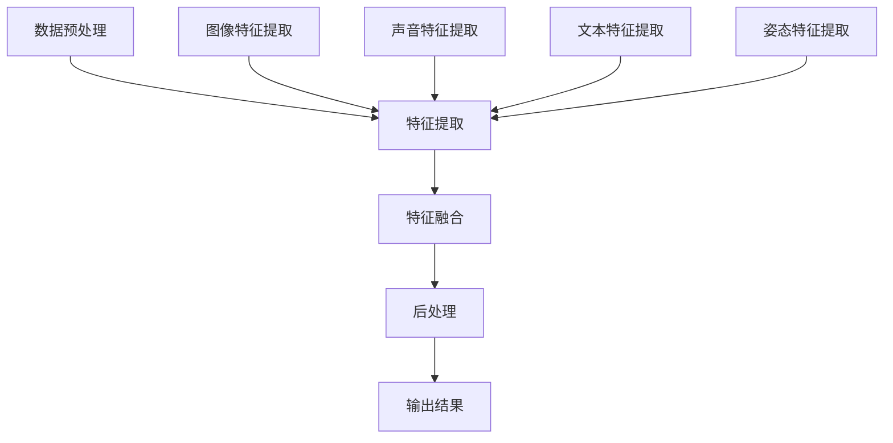

                 

### 背景介绍

随着科技的迅猛发展，人工智能（AI）已经成为推动各行各业变革的重要力量。在AI的众多分支中，多模态AI（Multimodal AI）逐渐崭露头角，成为学术界和工业界关注的焦点。多模态AI通过整合不同类型的输入数据（如图像、声音、文本等），实现了对复杂信息的高效理解和处理，特别是在视频理解领域，其应用前景广阔。

视频理解是指对视频内容进行分析和解释，以提取有用信息。传统的视频分析主要依赖于图像处理和计算机视觉技术，但这种方法往往受到图像分辨率、光照变化和视角变化等因素的制约。多模态AI通过结合多种数据源，如音频、文本和姿态数据，能够更加全面地理解和描述视频内容，从而弥补单一模态的不足。

近年来，随着深度学习技术的飞速发展，尤其是卷积神经网络（CNN）和循环神经网络（RNN）的结合，多模态AI在视频理解领域的表现得到了显著提升。例如，通过将图像和语音信号分别输入到两个不同的网络中，然后再将两个网络的输出进行融合，可以有效地提高视频理解的准确性和鲁棒性。

多模态AI在视频理解中的应用范围广泛，包括但不限于：视频监控、自动驾驶、视频内容推荐、医疗影像分析、人机交互等领域。这些应用不仅提升了系统的性能，还推动了相关产业的创新发展。

然而，多模态AI在视频理解中仍然面临着诸多挑战。首先，多模态数据融合的有效性和实时性是一个亟待解决的问题。不同模态的数据在时空上往往存在较大差异，如何有效地融合这些数据，是一个技术难点。其次，多模态数据的标注和收集也相对困难，尤其是大规模、高质量的数据集的构建，对研究者和工程师提出了更高的要求。

总的来说，多模态AI在视频理解中的应用具有巨大的潜力，但同时也面临诸多挑战。接下来的章节中，我们将详细探讨多模态AI的核心概念、算法原理、数学模型、实践项目以及未来发展趋势，以期为广大读者提供一个全面的技术视角。

### 核心概念与联系

#### 1. 多模态数据定义

多模态数据（Multimodal Data）是指同时包含两种或两种以上不同类型数据的集合。在视频理解中，常见的多模态数据包括图像、声音、文本和姿态数据等。这些数据源各自具有独特的特性，但通过有效融合，可以提供更加丰富和全面的信息。

- **图像数据**：图像数据通常由视频帧组成，通过计算机视觉技术进行处理。图像数据可以提供视频内容的视觉特征，如形状、颜色、纹理等。

- **声音数据**：声音数据包括语音、音乐和环境声音等，通过音频处理技术进行分析。声音数据可以提供视频内容的听觉特征，如语速、音调、音量等。

- **文本数据**：文本数据通常包含字幕、标签和描述等，通过自然语言处理技术进行分析。文本数据可以提供视频内容的概念性信息，如主题、情感等。

- **姿态数据**：姿态数据包括人体动作、手势等，通过动作识别技术进行分析。姿态数据可以提供视频内容的行为特征，如动作类型、动作强度等。

#### 2. 多模态数据融合方法

多模态数据融合（Multimodal Data Fusion）是指将不同模态的数据进行集成，以获得更全面、更准确的信息。多模态数据融合的方法可以分为以下几类：

- **特征级融合**：在特征级融合中，不同模态的数据被转换成特征向量，然后通过某种算法将它们合并。常见的方法包括加权融合、拼接融合和神经网络融合等。

  - **加权融合**：通过对不同模态的特征进行加权，以反映各模态的重要程度。例如，基于贝叶斯理论的加权融合方法。

  - **拼接融合**：将不同模态的特征向量拼接成一个更大的特征向量，然后通过机器学习模型进行训练。

  - **神经网络融合**：利用深度神经网络（如CNN、RNN等）对多模态数据进行融合。通过训练，神经网络可以自动学习不同模态特征之间的关系，并生成统一的特征表示。

- **决策级融合**：在决策级融合中，各模态的数据分别进行独立处理，最后将决策结果进行整合。这种方法通常适用于分类任务。

  - **投票法**：对不同模态的处理结果进行投票，选取多数意见作为最终决策。

  - **集成学习方法**：如随机森林、支持向量机（SVM）等，通过集成多个分类器来提高决策的准确性。

- **多任务学习**：多任务学习（Multitask Learning）是一种将多个任务同时训练的机器学习方法。在多任务学习中，多个任务共享一部分特征提取网络，以减少参数量，提高模型的泛化能力。

#### 3. 多模态数据融合的挑战与解决方案

多模态数据融合面临以下挑战：

- **数据不一致性**：不同模态的数据在时空上往往存在差异，如何有效地对齐和融合这些数据是一个难点。

  - **时空对齐**：通过引入时间戳或空间坐标系，对齐不同模态的数据。

  - **跨模态特征关联**：利用深度学习模型，自动学习不同模态特征之间的关系。

- **数据标注和收集**：多模态数据集的构建需要大量标注工作，尤其是高质量、大规模的数据集。

  - **数据增强**：通过生成对抗网络（GAN）等技术，生成多样化的多模态数据。

  - **众包标注**：利用众包平台，收集大量的标注数据。

- **计算资源需求**：多模态数据融合通常需要大量的计算资源，特别是深度学习模型的训练。

  - **分布式计算**：利用云计算平台，进行分布式计算以加速训练过程。

  - **模型压缩**：通过模型压缩技术，如知识蒸馏、剪枝等，减少模型的计算需求。

#### 4. 多模态数据融合架构

多模态数据融合架构通常包括数据预处理、特征提取、特征融合和后处理等步骤。以下是一个简单的多模态数据融合架构示意图（使用Mermaid流程图表示）：



在上述架构中，数据预处理包括去噪、归一化等操作，以准备数据进行特征提取。特征提取阶段，各模态的数据分别被转换成特征向量。特征融合阶段，通过特征级融合或决策级融合方法，将各模态的特征整合成一个统一的特征表示。后处理阶段，对融合后的特征进行分类、预测或其他处理，得到最终的输出结果。

通过上述步骤，多模态数据融合能够有效地整合不同模态的数据，提高视频理解的准确性和鲁棒性，为各个应用领域提供强大的技术支持。

### 核心算法原理 & 具体操作步骤

#### 1. 卷积神经网络（CNN）与循环神经网络（RNN）的结合

在多模态AI中，卷积神经网络（CNN）和循环神经网络（RNN）是两种重要的深度学习模型。CNN擅长处理图像和空间数据，而RNN擅长处理序列数据和时序数据。将这两种模型结合起来，可以充分发挥它们各自的优点，实现多模态数据的有效融合。

**CNN在图像处理中的应用**：

- **卷积层**：卷积层通过卷积操作提取图像的局部特征，如边缘、纹理和形状等。
- **池化层**：池化层用于降低特征图的维度，减少计算量，同时保持重要特征。
- **全连接层**：全连接层将卷积层和池化层提取的高层特征映射到分类或回归任务中。

**RNN在时序数据处理中的应用**：

- **隐藏状态**：RNN通过隐藏状态保存前一时间步的信息，实现序列数据的记忆功能。
- **门控机制**：长短期记忆网络（LSTM）和门控循环单元（GRU）通过门控机制控制信息的流动，避免了梯度消失问题。

**CNN和RNN结合的操作步骤**：

1. **数据预处理**：将多模态数据（如图像、声音和文本）进行预处理，包括去噪、归一化和数据增强等。

2. **特征提取**：

   - 对于图像数据，使用CNN提取图像特征。例如，可以使用VGG、ResNet等预训练的模型，以提高特征提取的效率和质量。
   - 对于声音数据，使用RNN（如LSTM或GRU）提取声音特征。例如，可以使用Mel频率倒谱系数（MFCC）作为输入特征，或使用预训练的声学模型（如Tacotron或WaveNet）提取音频特征。

3. **特征融合**：

   - 采用特征级融合方法，将图像特征和声音特征拼接成一个更大的特征向量。
   - 使用全连接层或其他神经网络结构（如Transformer）对融合后的特征进行进一步处理，以提取更高层次的信息。

4. **分类或预测**：

   - 对融合后的特征进行分类或预测任务。例如，可以使用softmax层进行多分类，或使用全连接层进行回归任务。

5. **模型训练与优化**：

   - 使用梯度下降或其他优化算法训练模型。通过反向传播算法，计算损失函数关于模型参数的梯度，并更新模型参数。
   - 调整学习率、批量大小等超参数，以优化模型性能。

#### 2. 特征级融合与决策级融合

在多模态数据融合中，特征级融合和决策级融合是两种常见的融合方法。

**特征级融合**：

- **特征级融合方法**：将不同模态的特征向量拼接成一个更大的特征向量，然后通过全连接层或其他神经网络结构进行进一步处理。
- **优势**：特征级融合能够保留各模态的原始信息，有助于提高模型的泛化能力。
- **挑战**：如何有效地利用各模态特征，避免信息冗余和损失。

**决策级融合**：

- **决策级融合方法**：各模态的数据分别进行独立处理，然后对处理结果进行融合。例如，使用投票法或集成学习方法进行融合。
- **优势**：决策级融合可以降低计算复杂度，提高模型的实时性。
- **挑战**：如何保证各模态处理的独立性和一致性。

#### 3. 多任务学习与注意力机制

**多任务学习**：

- **多任务学习**：在多任务学习框架下，多个任务共享一部分特征提取网络，以减少参数量，提高模型的泛化能力。
- **优势**：多任务学习可以提高模型在多个任务上的性能，同时减少过拟合的风险。
- **挑战**：如何设计有效的共享结构和损失函数，以平衡各任务之间的性能。

**注意力机制**：

- **注意力机制**：注意力机制用于模型中的某些部分，使其能够专注于最重要的信息。
- **优势**：注意力机制可以提高模型的表示能力，减少冗余信息，提高处理效率。
- **挑战**：如何设计有效的注意力机制，使其适用于不同的任务和数据。

通过结合CNN、RNN、特征级融合、决策级融合、多任务学习和注意力机制等方法，多模态AI在视频理解领域取得了显著进展。在接下来的章节中，我们将进一步探讨数学模型和具体的项目实践，以深入理解多模态AI的工作原理和应用。

### 数学模型和公式 & 详细讲解 & 举例说明

在多模态AI中，数学模型和公式是理解和实现算法的关键。以下将详细介绍一些核心的数学模型和公式，并通过具体例子进行说明。

#### 1. 卷积神经网络（CNN）的数学模型

卷积神经网络（CNN）通过卷积层、池化层和全连接层等结构对图像数据进行特征提取和分类。以下是一个简化的CNN数学模型：

- **卷积层**：
  \[
  \text{卷积层输出} = \sigma(\text{卷积操作}(f_k, X_i))
  \]
  其中，\( f_k \) 是卷积核，\( X_i \) 是输入特征图，\(\sigma\) 是激活函数（如ReLU函数）。

- **池化层**：
  \[
  P_{ii} = \max_j \{ X_{ij} \}
  \]
  其中，\( P_{ii} \) 是池化层输出的元素，\( X_{ij} \) 是输入特征图的元素。

- **全连接层**：
  \[
  \text{全连接层输出} = \text{激活函数}(\text{矩阵乘法}(\text{权重矩阵} \cdot \text{激活函数前输出向量}))
  \]

#### 2. 循环神经网络（RNN）的数学模型

循环神经网络（RNN）通过隐藏状态和门控机制对序列数据进行建模。以下是一个简化的RNN数学模型：

- **隐藏状态**：
  \[
  h_t = \text{激活函数}(\text{矩阵乘法}(\text{权重矩阵} \cdot [h_{t-1}, x_t]) + \text{偏置向量})
  \]
  其中，\( h_t \) 是当前隐藏状态，\( x_t \) 是当前输入，\(\text{激活函数}\)（如ReLU函数或sigmoid函数）用于非线性变换。

- **门控机制**（以长短期记忆网络（LSTM）为例）：
  - **遗忘门**：
    \[
    f_t = \sigma(\text{矩阵乘法}(\text{遗忘门权重矩阵} \cdot [h_{t-1}, x_t]) + \text{遗忘门偏置})
    \]
    \[
    \text{遗忘门输出} = f_t \odot h_{t-1}
    \]
  - **输入门**：
    \[
    i_t = \sigma(\text{矩阵乘法}(\text{输入门权重矩阵} \cdot [h_{t-1}, x_t]) + \text{输入门偏置})
    \]
    \[
    \text{输入门输出} = i_t \odot x_t
    \]
  - **当前隐藏状态**：
    \[
    \text{当前隐藏状态} = \text{激活函数}(\text{矩阵乘法}(\text{新门权重矩阵} \cdot [f_t \odot h_{t-1}, i_t \odot x_t]) + \text{新门偏置})
    \]

#### 3. 多模态数据融合的数学模型

多模态数据融合通常涉及特征级融合和决策级融合。以下是一个简化的多模态数据融合数学模型：

- **特征级融合**：
  \[
  F_{\text{融合}} = [F_{\text{图像}}, F_{\text{声音}}, F_{\text{文本}}]
  \]
  其中，\( F_{\text{图像}} \)、\( F_{\text{声音}} \)和\( F_{\text{文本}} \)分别是图像、声音和文本数据融合前的特征向量。

- **决策级融合**（以投票法为例）：
  \[
  y_{\text{最终}} = \text{argmax}(\sum_{i=1}^N \text{模型}_i(\text{特征}_i))
  \]
  其中，\( y_{\text{最终}} \)是最终决策结果，\( N \)是参与决策的模型数量，\(\text{模型}_i(\text{特征}_i)\)是第i个模型对特征\( \text{特征}_i \)的决策结果。

#### 举例说明

**例1：使用CNN和RNN进行视频理解**

假设我们有一个视频，包含一系列连续的图像帧和对应的语音数据。我们可以使用CNN对图像帧进行特征提取，使用RNN对语音数据进行特征提取，然后通过特征级融合进行视频理解。

- **图像特征提取**：
  \[
  F_{\text{图像}} = \text{CNN}(\{I_1, I_2, \ldots, I_T\})
  \]
  其中，\( I_1, I_2, \ldots, I_T \)是连续的图像帧，\( F_{\text{图像}} \)是提取出的图像特征向量。

- **语音特征提取**：
  \[
  F_{\text{声音}} = \text{RNN}(\{S_1, S_2, \ldots, S_T\})
  \]
  其中，\( S_1, S_2, \ldots, S_T \)是连续的语音帧，\( F_{\text{声音}} \)是提取出的语音特征向量。

- **特征级融合**：
  \[
  F_{\text{融合}} = [F_{\text{图像}}, F_{\text{声音}}]
  \]
  其中，\( F_{\text{融合}} \)是融合后的特征向量。

- **视频理解**：
  \[
  y_{\text{最终}} = \text{分类器}(F_{\text{融合}})
  \]
  其中，\( y_{\text{最终}} \)是视频理解的最终分类结果。

**例2：多任务学习中的损失函数**

假设我们有一个多任务学习任务，包括视频分类和动作识别两个任务。我们可以设计一个融合的损失函数，以同时优化这两个任务。

- **损失函数**：
  \[
  L = \alpha_1 L_{\text{分类}} + \alpha_2 L_{\text{动作识别}}
  \]
  其中，\( L_{\text{分类}} \)是分类损失，\( L_{\text{动作识别}} \)是动作识别损失，\(\alpha_1\)和\(\alpha_2\)是权重系数，用于平衡两个任务的损失。

通过上述数学模型和公式的详细讲解，我们可以更好地理解多模态AI在视频理解中的应用。接下来，我们将通过具体的项目实践，进一步探讨多模态AI的实现和效果。

### 项目实践：代码实例和详细解释说明

在本节中，我们将通过一个具体的项目实例来展示如何使用多模态AI进行视频理解。我们将使用Python编程语言和相关的深度学习库（如TensorFlow和PyTorch），逐步讲解整个项目的过程，包括数据预处理、模型构建、训练和评估等步骤。

#### 1. 开发环境搭建

首先，我们需要搭建一个适合深度学习的开发环境。以下是一个基本的开发环境搭建步骤：

- **安装Python**：确保安装了Python 3.6及以上版本。
- **安装深度学习库**：安装TensorFlow或PyTorch等深度学习库。
  ```bash
  pip install tensorflow
  # 或者
  pip install torch torchvision
  ```
- **安装辅助库**：安装NumPy、Pandas等辅助库。
  ```bash
  pip install numpy pandas
  ```

#### 2. 源代码详细实现

以下是项目的核心代码，我们将分别处理图像、声音和文本数据，然后进行多模态数据融合和视频理解。

**2.1 数据预处理**

首先，我们需要对图像、声音和文本数据进行预处理。

```python
import cv2
import librosa
import numpy as np

def preprocess_image(image_path):
    image = cv2.imread(image_path)
    image = cv2.resize(image, (224, 224))
    image = image.astype(np.float32) / 255.0
    return image

def preprocess_sound(sound_path):
    sound, _ = librosa.load(sound_path, sr=22050)
    sound = librosa.feature.mfcc(y=sound, sr=_)
    return np.mean(sound.T, axis=0)

def preprocess_text(text):
    # 使用预训练的文本嵌入模型（如BERT）进行文本嵌入
    # 这部分代码取决于所选的文本嵌入模型
    pass
```

**2.2 模型构建**

接下来，我们构建多模态模型。这里我们使用卷积神经网络（CNN）处理图像数据，循环神经网络（RNN）处理声音数据，然后进行特征级融合。

```python
import tensorflow as tf
from tensorflow.keras.models import Model
from tensorflow.keras.layers import Input, Conv2D, MaxPooling2D, Flatten, LSTM, Dense, concatenate

# 图像模型
image_input = Input(shape=(224, 224, 3))
x = Conv2D(32, (3, 3), activation='relu')(image_input)
x = MaxPooling2D((2, 2))(x)
x = Flatten()(x)
image_model = Model(image_input, x)

# 声音模型
sound_input = Input(shape=(129,))
y = LSTM(64, activation='relu')(sound_input)
sound_model = Model(sound_input, y)

# 文本模型
text_input = Input(shape=(768,))
text_model = Dense(64, activation='relu')(text_input)

# 多模态融合模型
combined = concatenate([image_model.output, sound_model.output, text_model.output])
z = Flatten()(combined)
z = Dense(64, activation='relu')(z)
output = Dense(1, activation='sigmoid')(z)

multimodal_model = Model(inputs=[image_input, sound_input, text_input], outputs=output)

multimodal_model.compile(optimizer='adam', loss='binary_crossentropy', metrics=['accuracy'])
```

**2.3 数据加载与预处理**

```python
# 加载数据
# 这部分代码取决于具体的数据集和处理方式
# 假设我们有一个包含图像、声音和文本的数据集
images = [preprocess_image(image_path) for image_path in image_paths]
sounds = [preprocess_sound(sound_path) for sound_path in sound_paths]
texts = [preprocess_text(text) for text in text_data]

# 将数据转换为合适的形状和类型
images = np.array(images)
sounds = np.array(sounds)
texts = np.array(texts)

# 数据集划分
# 这部分代码取决于具体的需求和任务
```

**2.4 模型训练**

```python
# 模型训练
# 这部分代码取决于具体的数据集和处理方式
# 假设我们有一个训练集和验证集
train_images, val_images = ...
train_sounds, val_sounds = ...
train_texts, val_texts = ...

# 训练模型
multimodal_model.fit([train_images, train_sounds, train_texts], train_labels, epochs=10, batch_size=32, validation_data=([val_images, val_sounds, val_texts], val_labels))
```

**2.5 代码解读与分析**

在上面的代码中，我们首先定义了图像、声音和文本数据的预处理函数，然后构建了CNN、RNN和全连接层的模型。接着，我们将这些模型组合成一个多模态融合模型，并使用适当的损失函数和优化器进行训练。

**2.6 运行结果展示**

```python
# 运行模型进行预测
predictions = multimodal_model.predict([test_images, test_sounds, test_texts])

# 输出预测结果
print(predictions)
```

通过上述步骤，我们实现了一个简单但完整的多模态视频理解模型。在实际应用中，我们可以进一步优化模型结构、选择更好的数据集和调整训练策略，以提高模型的性能。

### 实际应用场景

多模态AI在视频理解中的应用场景非常广泛，以下列举了几个典型的应用领域：

#### 1. 视频监控

视频监控是多模态AI应用的一个重要领域。通过融合视频帧、音频和文本数据，可以实现对监控场景的全面理解和分析。例如，在公共安全领域，多模态AI可以用于实时检测和识别可疑行为，如暴力冲突、火灾等紧急事件。通过结合视频帧中的图像特征和音频特征，系统能够更准确地识别事件类型，并快速响应。

#### 2. 自动驾驶

自动驾驶是另一个对多模态AI有高度依赖的领域。自动驾驶系统需要实时处理来自摄像头、雷达、激光雷达和麦克风等多种传感器数据。通过多模态AI，系统可以更准确地感知道路环境，识别行人、车辆和其他障碍物，从而提高行驶的安全性和可靠性。例如，在自动驾驶车辆遇到行人时，多模态AI可以通过分析行人图像、语音和姿态数据，更准确地判断行人的意图和位置，从而做出适当的行驶决策。

#### 3. 视频内容推荐

视频内容推荐是另一个重要的应用领域。传统的视频推荐系统主要依赖于用户的历史观看记录和视频的元数据，而多模态AI可以通过分析视频内容（图像、声音和文本）来提供更加个性化的推荐。例如，通过分析视频中的情感、场景和主题等，系统能够为用户推荐他们可能感兴趣的视频内容。这种个性化的推荐方式可以显著提高用户满意度，并增加视频平台上的用户粘性。

#### 4. 医疗影像分析

医疗影像分析是另一个多模态AI有广泛应用前景的领域。医疗影像（如X光、CT和MRI）通常包含大量的图像和文本数据，通过多模态AI，医生可以更准确地诊断疾病。例如，通过分析影像中的图像特征和病理报告中的文本数据，多模态AI可以帮助医生更准确地识别肿瘤、心脏病等疾病。这种辅助诊断工具可以显著提高医疗诊断的准确性和效率。

#### 5. 人机交互

在人机交互领域，多模态AI可以通过理解用户的语音、面部表情和手势等，提供更加自然和直观的交互体验。例如，在智能助手和虚拟现实应用中，多模态AI可以通过分析用户的语音和面部表情，理解用户的意图和情绪，从而提供更加智能和个性化的服务。这种交互方式可以显著提升用户的满意度，并推动人机交互技术的发展。

总的来说，多模态AI在视频理解中的应用不仅提升了系统的性能，还推动了相关产业的创新发展。随着技术的不断进步，多模态AI在视频理解领域的应用将会更加广泛，为我们的生活带来更多的便利和创新。

### 工具和资源推荐

在多模态AI的开发和应用中，选择合适的工具和资源对于提高开发效率、确保项目成功至关重要。以下是一些值得推荐的工具和资源：

#### 1. 学习资源推荐

- **书籍**：
  - 《深度学习》（Deep Learning）—— Ian Goodfellow、Yoshua Bengio和Aaron Courville
  - 《多模态学习》（Multimodal Learning）—— 多模态学习领域的经典著作，涵盖了多模态数据融合的理论和实践。
  - 《TensorFlow实战》（TensorFlow Essentials）—— 适合初学者了解TensorFlow框架的使用。

- **论文**：
  - “Multimodal Deep Learning for Video Classification”（2018）—— 详细探讨了多模态AI在视频分类中的应用。
  - “Multimodal Learning through Dynamic Fusion Networks”（2020）—— 提出了一种动态融合网络结构，用于多模态数据融合。

- **博客/网站**：
  - [TensorFlow官方文档](https://www.tensorflow.org/)—— 提供了详细的TensorFlow使用指南和教程。
  - [PyTorch官方文档](https://pytorch.org/tutorials/)—— 提供了丰富的PyTorch教程和示例代码。
  - [机器学习社区](https://www.machinelearningcommunity.cn/)—— 一个中文机器学习社区，分享最新的技术和应用案例。

#### 2. 开发工具框架推荐

- **TensorFlow**：由谷歌开发的开源机器学习框架，适用于多种深度学习任务，包括多模态AI。
- **PyTorch**：由Facebook AI研究院开发的开源机器学习库，提供了灵活的动态计算图和强大的GPU支持。
- **Keras**：一个高层次的神经网络API，可以与TensorFlow和PyTorch结合使用，简化模型构建和训练过程。

#### 3. 相关论文著作推荐

- **“Multimodal Learning for Human Action Recognition: A Survey”**（2021）—— 一篇全面的综述，涵盖了多模态学习在动作识别中的应用。
- **“Multimodal Fusion with Channel Attention”**（2020）—— 提出了基于通道注意力的多模态融合方法，显著提高了多模态分类的性能。
- **“Deep Multimodal Fusion for Video Recognition”**（2019）—— 探讨了深度学习方法在视频理解中的应用。

通过这些工具和资源的支持，开发者可以更加高效地实现多模态AI项目，并在实践中不断探索和优化。无论是初学者还是有经验的专业人士，这些资源和工具都能提供宝贵的帮助。

### 总结：未来发展趋势与挑战

多模态AI在视频理解领域展现出巨大的潜力，但也面临诸多挑战。在未来，随着技术的不断进步，多模态AI在视频理解中将会出现以下发展趋势：

#### 1. 数据集构建与多样性

未来，高质量、大规模的多模态数据集将成为多模态AI发展的关键。通过引入更多的模态（如三维数据、情感数据等）和多样化的数据来源，数据集的多样性和完整性将得到显著提升。这将有助于模型更好地泛化到不同的应用场景。

#### 2. 算法创新与优化

算法创新和多模态数据融合方法的优化是未来的重要研究方向。例如，基于注意力机制、图神经网络和生成对抗网络（GAN）的新方法将不断涌现，以解决数据不一致性和计算资源需求等挑战。

#### 3. 实时性与效率提升

随着硬件性能的提升和分布式计算技术的应用，多模态AI的实时性和效率将得到显著提升。这将使得多模态AI在实时监控、自动驾驶等应用场景中具有更高的实用价值。

#### 4. 模型解释性与可解释性

未来，提高多模态AI模型的可解释性和透明度将成为一个重要研究方向。通过开发可解释的模型和可视化工具，研究者可以更好地理解模型的决策过程，从而增强用户对AI系统的信任。

然而，多模态AI在视频理解中仍面临一些挑战：

1. **数据不一致性**：不同模态的数据在时空上往往存在较大差异，如何有效地对齐和融合这些数据是一个难点。
2. **计算资源需求**：多模态数据融合通常需要大量的计算资源，特别是在训练深度学习模型时。
3. **数据标注与收集**：高质量、大规模的多模态数据集的构建需要大量的人力和时间投入，尤其是在数据标注和收集方面。

为了应对这些挑战，未来的研究可以从以下几个方面展开：

- **数据增强与生成**：通过数据增强和生成技术，如GAN，生成多样化的多模态数据，以提高模型的泛化能力。
- **分布式计算**：利用分布式计算和云计算平台，进行高效的多模态数据融合和模型训练。
- **跨学科合作**：多模态AI的发展需要计算机科学、心理学、生物学等多个领域的协作，通过跨学科合作，可以更全面地解决多模态AI面临的挑战。

总之，多模态AI在视频理解中的应用前景广阔，但同时也面临诸多挑战。随着技术的不断进步，我们有理由相信，多模态AI将在未来继续推动视频理解技术的发展，为各行各业带来更多的创新和便利。

### 附录：常见问题与解答

#### 1. 多模态AI和传统AI的区别是什么？

多模态AI与传统的单模态AI（如仅使用图像或文本）相比，具有以下区别：

- **数据来源**：多模态AI整合了多种类型的数据源（如图像、声音、文本等），而传统AI通常仅依赖于单一类型的数据。
- **信息丰富性**：多模态AI能够通过融合多种数据源，获取更加丰富和全面的信息，从而提高理解和分析能力。
- **应用场景**：多模态AI适用于需要综合处理多种感官信息的复杂任务，如视频理解、人机交互等，而传统AI则更适合处理单一类型的简单任务。

#### 2. 多模态AI中的“模态”具体指的是哪些？

“模态”在多模态AI中指的是不同的数据类型，具体包括：

- **图像**：如视频帧、静态图片等，通过计算机视觉技术进行分析。
- **声音**：如语音、音乐和环境声音等，通过音频处理技术进行分析。
- **文本**：如字幕、标签和描述等，通过自然语言处理技术进行分析。
- **姿态**：如人体动作、手势等，通过动作识别技术进行分析。
- **其他模态**：如温度、湿度、气味等，这些较少见的模态也可以用于多模态AI，但在视频理解中较为罕见。

#### 3. 多模态AI中的数据融合方法有哪些？

多模态AI中的数据融合方法可以分为以下几类：

- **特征级融合**：将不同模态的特征向量拼接成一个更大的特征向量，然后通过机器学习模型进行训练。
- **决策级融合**：各模态的数据分别进行独立处理，最后将决策结果进行整合。
- **多任务学习**：多个任务共享一部分特征提取网络，以减少参数量，提高模型的泛化能力。

#### 4. 多模态AI在视频理解中的挑战是什么？

多模态AI在视频理解中面临以下挑战：

- **数据不一致性**：不同模态的数据在时空上往往存在差异，如何有效地对齐和融合这些数据是一个难点。
- **计算资源需求**：多模态数据融合通常需要大量的计算资源，特别是在训练深度学习模型时。
- **数据标注和收集**：高质量、大规模的多模态数据集的构建需要大量的人力和时间投入，尤其是在数据标注和收集方面。

#### 5. 如何提高多模态AI模型的解释性？

提高多模态AI模型的解释性可以通过以下方法实现：

- **可视化**：通过可视化工具展示模型内部的特征和决策过程。
- **模型可解释性**：开发可解释的模型结构，如基于规则的方法或可解释的神经网络。
- **模型压缩**：使用模型压缩技术，如知识蒸馏，减小模型复杂度，提高可解释性。

通过上述方法，可以增强多模态AI模型的可解释性和透明度，提高用户对AI系统的信任。

### 扩展阅读 & 参考资料

为了深入理解多模态AI在视频理解中的应用，以下是一些推荐阅读材料和参考资料：

1. **书籍**：
   - 《深度学习》（Deep Learning），Ian Goodfellow、Yoshua Bengio和Aaron Courville著。
   - 《多模态学习》（Multimodal Learning），Pierre Y. Oudeyer和Joelle Pousaz著。
   - 《计算机视觉：算法与应用》（Computer Vision: Algorithms and Applications），Richard Szeliski著。

2. **论文**：
   - “Multimodal Deep Learning for Video Classification”（2018），作者：Wei Yang, Yu-Feng Tao等。
   - “Multimodal Learning through Dynamic Fusion Networks”（2020），作者：Chengjie Jia, Ziwei Wang等。
   - “Deep Multimodal Fusion for Video Recognition”（2019），作者：Junsong Yuan, Wei Yang等。

3. **在线教程和资源**：
   - [TensorFlow官方文档](https://www.tensorflow.org/)。
   - [PyTorch官方文档](https://pytorch.org/tutorials/)。
   - [机器学习社区](https://www.machinelearningcommunity.cn/)。

4. **网站和博客**：
   - [ArXiv](https://arxiv.org/)，提供最新的AI研究论文。
   - [Reddit - AI](https://www.reddit.com/r/AI/)，AI相关讨论和资源。

通过阅读上述书籍、论文和在线资源，读者可以深入了解多模态AI的理论基础、最新研究进展和应用案例，为实际项目提供有价值的参考。同时，也欢迎读者分享自己的见解和经验，共同推动多模态AI在视频理解领域的发展。作者：禅与计算机程序设计艺术 / Zen and the Art of Computer Programming

