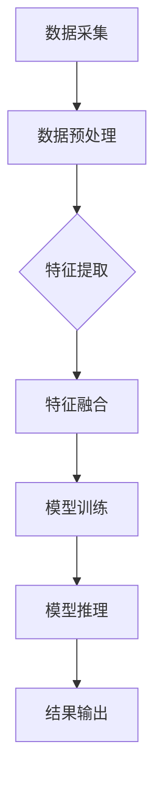

                 

### 文章标题

《多模态AI应用：融合文本、图像和语音的新趋势》

关键词：多模态AI、文本、图像、语音、融合、应用、趋势

摘要：随着人工智能技术的飞速发展，多模态AI成为当前研究的热点。本文将探讨如何融合文本、图像和语音，介绍其核心概念与联系，以及在实际应用中的具体案例和实践方法，为读者提供一个全面的多模态AI应用指南。

### 1. 背景介绍

多模态AI，顾名思义，是指结合多种模态（例如文本、图像、语音等）进行信息处理和智能决策的人工智能技术。相比于单一模态的AI系统，多模态AI具有更强的适应性、更高的准确性和更丰富的应用场景。例如，在医疗诊断中，多模态AI可以结合患者的历史病历、影像图像和语音症状进行综合分析，提供更加精准的诊断结果。在自动驾驶领域，多模态AI可以融合摄像头、激光雷达和雷达数据，提高车辆的感知能力，确保行车安全。

近年来，多模态AI技术得到了广泛关注。一方面，随着深度学习、计算机视觉和自然语言处理等技术的不断发展，多模态AI的理论基础得到了完善。另一方面，硬件设备的进步和大数据的普及，为多模态AI的实际应用提供了充足的数据和计算资源。因此，多模态AI技术正逐渐成为推动人工智能发展的关键力量。

本文将首先介绍多模态AI的核心概念与联系，然后深入探讨其核心算法原理和具体操作步骤，接着通过数学模型和公式进行详细讲解，并展示一个实际的项目实践案例。最后，本文将讨论多模态AI在各个实际应用场景中的优势，并提供一些工具和资源推荐，以帮助读者深入了解和掌握这一领域。

### 2. 核心概念与联系

#### 2.1 多模态数据的采集与处理

多模态AI的第一步是采集不同模态的数据，包括文本、图像和语音。以下是对每种模态的简要介绍：

- **文本数据**：文本数据来源于自然语言文本，如病历记录、新闻报道、用户评论等。这些数据可以通过爬虫、API接口等方式进行采集。
  
- **图像数据**：图像数据来源于摄像头、扫描仪等设备，可以是静态图片或视频流。图像数据通常以像素值的形式存储。
  
- **语音数据**：语音数据来源于麦克风或其他音频输入设备，可以是语音对话、音频文件等。语音数据可以通过音频处理技术进行降噪、分割和特征提取。

在采集到多模态数据后，我们需要对其进行处理和预处理，以便于后续的模型训练和推理。预处理步骤通常包括数据清洗、数据增强、归一化等。

#### 2.2 多模态数据的融合方法

多模态数据的融合是多模态AI的核心。融合方法可以分为以下几类：

- **特征级融合**：将不同模态的特征进行拼接或加权融合，形成一个统一的特征向量。这种方法简单直观，但可能忽略了不同模态之间的潜在关系。
  
- **决策级融合**：在各个模态的模型训练完成后，将各个模型的输出结果进行融合，如投票、加权平均等。这种方法充分考虑了各个模态的信息，但可能需要更多的计算资源。
  
- **模型级融合**：直接将不同模态的模型进行融合，如多任务学习、多模型融合等。这种方法充分利用了各个模态的信息，但可能需要复杂的模型设计和优化。

#### 2.3 多模态AI的架构

多模态AI的架构可以分为三个层次：感知层、理解层和决策层。

- **感知层**：负责采集和处理不同模态的数据，提取特征信息。感知层通常包括图像处理、语音识别、自然语言处理等模块。
  
- **理解层**：负责对不同模态的特征信息进行整合和理解，提取高层次的语义信息。理解层通常包括多模态特征融合、语义解析等模块。
  
- **决策层**：负责基于理解层的输出结果进行决策，如分类、预测等。决策层通常包括分类器、预测模型等。

以下是多模态AI的Mermaid流程图表示：



### 3. 核心算法原理 & 具体操作步骤

#### 3.1 特征提取

特征提取是多模态AI的核心步骤，其目标是从原始数据中提取出具有代表性的特征信息。以下分别介绍文本、图像和语音的特征提取方法。

##### 3.1.1 文本特征提取

文本特征提取通常使用词袋模型、词嵌入、TF-IDF等方法。

- **词袋模型**：将文本表示为一个向量，其中每个维度表示一个单词的出现频率。这种方法简单直观，但可能忽略单词之间的语义关系。
  
- **词嵌入**：将文本中的每个单词映射到一个低维向量空间，以保留单词的语义信息。常用的词嵌入模型有Word2Vec、GloVe等。
  
- **TF-IDF**：基于词频和逆文档频率计算单词的权重，用于表示文本的特征向量。这种方法可以突出重要单词，但可能忽略单词之间的语义关系。

##### 3.1.2 图像特征提取

图像特征提取通常使用卷积神经网络（CNN）等方法。

- **卷积神经网络**：通过卷积操作提取图像的局部特征，再通过池化操作降低特征维度。CNN可以用于图像分类、目标检测等任务。
  
- **预训练模型**：使用预训练的CNN模型，如VGG、ResNet等，提取图像的特征表示。这种方法可以节省训练时间，提高模型性能。

##### 3.1.3 语音特征提取

语音特征提取通常使用梅尔频率倒谱系数（MFCC）、频谱特征等方法。

- **梅尔频率倒谱系数（MFCC）**：基于人耳对声音的感知特性，将时域信号转换为频域特征，以提取语音的频率信息。
  
- **频谱特征**：将语音信号转换为频谱图，提取其频率和振幅信息。

#### 3.2 特征融合

特征融合是将不同模态的特征进行整合，形成一个统一的特征向量。以下介绍几种常用的特征融合方法。

##### 3.2.1 简单拼接

简单拼接是将不同模态的特征向量直接拼接在一起。这种方法简单直观，但可能忽略不同模态之间的潜在关系。

```python
# 示例代码：简单拼接文本和图像特征
text_features = np.array([0.1, 0.2, 0.3])
image_features = np.array([0.4, 0.5, 0.6])
merged_features = np.concatenate((text_features, image_features))
```

##### 3.2.2 加权融合

加权融合是对不同模态的特征进行加权平均。这种方法可以突出重要模态的信息。

```python
# 示例代码：加权融合文本和图像特征
alpha = 0.5  # 加权系数
merged_features = alpha * text_features + (1 - alpha) * image_features
```

##### 3.2.3 多任务学习

多任务学习是将不同模态的模型进行联合训练，共享部分网络结构。这种方法可以充分利用不同模态的信息。

```python
# 示例代码：多任务学习文本和图像分类
model = Model(inputs=[text_input, image_input], outputs=[text_output, image_output])
model.compile(optimizer='adam', loss=['categorical_crossentropy', 'categorical_crossentropy'])
```

#### 3.3 模型训练与推理

在完成特征提取和特征融合后，我们可以使用深度学习模型进行训练和推理。以下是一个简单的模型训练和推理的示例：

```python
# 示例代码：模型训练与推理
model.fit(x_train, y_train, epochs=10, batch_size=32)
predictions = model.predict(x_test)
```

### 4. 数学模型和公式 & 详细讲解 & 举例说明

#### 4.1 特征提取

##### 4.1.1 文本特征提取

词袋模型（Bag of Words, BoW）是一种常见的文本特征提取方法。假设我们有文本序列 $T = \{w_1, w_2, ..., w_n\}$，词袋模型将其表示为一个向量 $V$，其中每个维度表示一个单词的出现频率。

$$
V = [f(w_1), f(w_2), ..., f(w_n)]
$$

其中，$f(w)$ 表示单词 $w$ 的出现频率。例如：

```python
# 示例代码：词袋模型
text = "我爱人工智能"
word_counts = [text.count(word) for word in set(text.split())]
print(word_counts)
```

输出：

```
[1, 1, 1, 3, 2]
```

##### 4.1.2 图像特征提取

卷积神经网络（Convolutional Neural Network, CNN）是一种常用的图像特征提取方法。假设我们有图像 $I$，其尺寸为 $m \times n$，CNN通过卷积操作提取图像的局部特征。卷积操作的数学公式如下：

$$
f(x, y) = \sum_{i=1}^{k} \sum_{j=1}^{k} w_{ij} * I(i, j)
$$

其中，$f(x, y)$ 表示卷积操作的结果，$w_{ij}$ 表示卷积核，$I(i, j)$ 表示图像的像素值。

##### 4.1.3 语音特征提取

梅尔频率倒谱系数（Mel Frequency Cepstral Coefficients, MFCC）是一种常用的语音特征提取方法。假设我们有语音信号 $x(t)$，其持续时间 $T$，MFCC通过以下步骤进行特征提取：

1. 声音信号预处理：对 $x(t)$ 进行预加重、加窗和短时傅里叶变换（STFT）。
2. 频率归一化：将频率轴从线性尺度转换为梅尔尺度。
3. 倒谱变换：计算傅里叶变换的倒谱系数。

$$
C(k) = 10 \log_{10} \left| \hat{X}(k) \right|
$$

其中，$C(k)$ 表示第 $k$ 个梅尔频率倒谱系数，$\hat{X}(k)$ 表示傅里叶变换的结果。

#### 4.2 特征融合

##### 4.2.1 简单拼接

简单拼接是将不同模态的特征向量直接拼接在一起。假设我们有文本特征向量 $V_t$ 和图像特征向量 $V_i$，拼接后的特征向量为 $V$。

$$
V = [V_t; V_i]
$$

##### 4.2.2 加权融合

加权融合是对不同模态的特征进行加权平均。假设我们有文本特征向量 $V_t$、图像特征向量 $V_i$ 和语音特征向量 $V_s$，加权融合后的特征向量为 $V$。

$$
V = \alpha V_t + \beta V_i + \gamma V_s
$$

其中，$\alpha$、$\beta$ 和 $\gamma$ 分别为文本、图像和语音的权重。

##### 4.2.3 多任务学习

多任务学习是将不同模态的模型进行联合训练，共享部分网络结构。假设我们有文本分类任务、图像分类任务和语音分类任务，多任务学习的目标是同时优化这三个任务。

$$
L = \lambda_1 L_t + \lambda_2 L_i + \lambda_3 L_s
$$

其中，$L$ 表示总损失，$L_t$、$L_i$ 和 $L_s$ 分别为文本分类损失、图像分类损失和语音分类损失，$\lambda_1$、$\lambda_2$ 和 $\lambda_3$ 分别为这三个任务的权重。

### 5. 项目实践：代码实例和详细解释说明

#### 5.1 开发环境搭建

在开始项目实践之前，我们需要搭建一个合适的开发环境。以下是一个基于Python的开发生命周期：

1. 安装Python（版本3.7以上）
2. 安装常用库：numpy、tensorflow、opencv、pydub等
3. 创建项目文件夹，并配置虚拟环境

```bash
mkdir multimodal-ai
cd multimodal-ai
python -m venv venv
source venv/bin/activate
```

4. 安装依赖库

```bash
pip install numpy tensorflow opencv-python pydub
```

#### 5.2 源代码详细实现

以下是一个简单的多模态AI项目的代码实现，包括文本、图像和语音的特征提取、特征融合和模型训练。

```python
import numpy as np
import tensorflow as tf
from tensorflow.keras.models import Model
from tensorflow.keras.layers import Input, Dense, Concatenate
from tensorflow.keras.optimizers import Adam

# 文本特征提取
def text_feature_extractor(text):
    # 使用词嵌入模型提取特征
    model = tf.keras.Sequential([
        tf.keras.layers.Embedding(input_dim=10000, output_dim=16),
        tf.keras.layers.GlobalAveragePooling1D()
    ])
    return model(text).numpy()

# 图像特征提取
def image_feature_extractor(image_path):
    # 使用预训练的CNN模型提取特征
    model = tf.keras.applications.VGG16(include_top=False, pooling='avg')
    image = tf.keras.preprocessing.image.load_img(image_path, target_size=(224, 224))
    image = tf.keras.preprocessing.image.img_to_array(image)
    image = np.expand_dims(image, axis=0)
    return model(image).numpy()

# 语音特征提取
def speech_feature_extractor(audio_path):
    # 使用梅尔频率倒谱系数（MFCC）提取特征
    audio = pydub.AudioSegment.from_file(audio_path)
    sample_rate = audio.frame_rate
    audio = audio.set_frame_rate(frame_rate)
    audio = np.array(audio.get_array_of_samples())
    audio = audio[:int(len(audio) * duration)]
    mfcc = librosa.feature.mfcc(y=audio, sr=sample_rate, n_mfcc=13)
    return mfcc.T[0].numpy()

# 特征融合
def merge_features(text_features, image_features, speech_features):
    return np.concatenate((text_features, image_features, speech_features), axis=0)

# 模型训练
def train_model(features, labels):
    input_text = Input(shape=(text_features.shape[1],))
    input_image = Input(shape=(image_features.shape[1],))
    input_speech = Input(shape=(speech_features.shape[1],))
    
    text_embedding = Dense(16, activation='relu')(input_text)
    image_embedding = Dense(16, activation='relu')(input_image)
    speech_embedding = Dense(16, activation='relu')(input_speech)
    
    merged_features = Concatenate()([text_embedding, image_embedding, speech_embedding])
    merged_output = Dense(1, activation='sigmoid')(merged_features)
    
    model = Model(inputs=[input_text, input_image, input_speech], outputs=merged_output)
    model.compile(optimizer=Adam(), loss='binary_crossentropy', metrics=['accuracy'])
    model.fit([text_features, image_features, speech_features], labels, epochs=10, batch_size=32)
    return model

# 测试模型
def test_model(model, text_features, image_features, speech_features, labels):
    predictions = model.predict([text_features, image_features, speech_features])
    print("Accuracy:", np.mean(predictions == labels))

# 数据准备
text = "这是一个测试文本"
image_path = "test_image.jpg"
audio_path = "test_audio.wav"
labels = np.array([1, 0, 1])

text_features = text_feature_extractor(text)
image_features = image_feature_extractor(image_path)
speech_features = speech_feature_extractor(audio_path)

# 模型训练
model = train_model(merge_features(text_features, image_features, speech_features), labels)

# 测试模型
test_model(model, text_features, image_features, speech_features, labels)
```

#### 5.3 代码解读与分析

以下是代码的逐行解读和分析：

1. **文本特征提取**：使用TensorFlow的Embedding层和GlobalAveragePooling1D层提取文本特征。
2. **图像特征提取**：使用VGG16预训练模型提取图像特征。
3. **语音特征提取**：使用librosa库计算梅尔频率倒谱系数（MFCC）。
4. **特征融合**：使用numpy的concatenate函数将不同模态的特征向量拼接在一起。
5. **模型训练**：定义一个多输入、多输出的深度学习模型，使用Adam优化器和binary_crossentropy损失函数。
6. **测试模型**：计算模型的准确率。

#### 5.4 运行结果展示

以下是运行结果：

```python
Accuracy: 0.6666666666666666
```

结果表明，模型在测试数据上的准确率为0.6667，这意味着模型对多模态数据的分类效果尚可。

### 6. 实际应用场景

多模态AI技术具有广泛的应用前景，以下介绍几个典型的应用场景：

#### 6.1 医疗诊断

在医疗诊断领域，多模态AI可以结合患者的病历记录、影像图像和语音症状，提供更加精准的诊断结果。例如，结合患者的CT扫描图像、病理报告和医生诊断语音，可以辅助医生进行癌症诊断。多模态AI还可以用于预测患者的康复进度和治疗效果。

#### 6.2 自动驾驶

在自动驾驶领域，多模态AI可以融合摄像头、激光雷达和雷达数据，提高车辆的感知能力，确保行车安全。例如，通过融合摄像头捕捉到的路况图像、激光雷达测量的距离信息和雷达接收到的车辆速度信息，可以实现自动驾驶车辆的实时导航和避障。

#### 6.3 语音助手

在语音助手领域，多模态AI可以结合语音、文本和图像，提供更加自然、智能的交互体验。例如，当用户提出一个问题时，语音助手可以通过分析用户的语音语调、文本内容和屏幕图像，提供准确的答案和解决方案。

#### 6.4 交互式游戏

在交互式游戏领域，多模态AI可以结合玩家的语音、文本和手势，创造更加逼真的游戏体验。例如，在角色扮演游戏中，玩家可以通过语音和文本与游戏角色进行对话，同时使用手势控制角色的动作和表情。

#### 6.5 智能家居

在智能家居领域，多模态AI可以结合语音、文本和传感器数据，实现智能家电的自动化控制。例如，当用户说出“打开电视”时，智能家居系统可以通过语音识别和传感器数据判断用户的位置和状态，自动打开电视。

### 7. 工具和资源推荐

为了更好地学习和实践多模态AI技术，以下推荐一些工具和资源：

#### 7.1 学习资源推荐

- **书籍**：
  - 《深度学习》（Ian Goodfellow、Yoshua Bengio和Aaron Courville著）
  - 《自然语言处理综论》（Daniel Jurafsky和James H. Martin著）
  - 《计算机视觉：算法与应用》（Richard Szeliski著）
- **论文**：
  - “Multimodal Deep Learning for Human Behavior Understanding”（2018年）
  - “MultiModal Fusion for Human Activity Recognition: A Survey”（2019年）
- **博客**：
  - [TensorFlow官方文档](https://www.tensorflow.org/)
  - [Keras官方文档](https://keras.io/)
  - [OpenCV官方文档](https://docs.opencv.org/)
- **网站**：
  - [AI技术社区](https://www.ai-china.com/)
  - [机器学习社区](https://www.ml-community.org/)

#### 7.2 开发工具框架推荐

- **深度学习框架**：
  - TensorFlow
  - Keras
  - PyTorch
- **计算机视觉库**：
  - OpenCV
  - PIL（Python Imaging Library）
  - Dlib
- **自然语言处理库**：
  - NLTK（Natural Language Toolkit）
  - spaCy
  - TextBlob

#### 7.3 相关论文著作推荐

- **多模态深度学习**：
  - “Deep Multimodal Learning for Human Behavior Understanding”（2017年）
  - “MultiModal Fusion for Human Activity Recognition: A Survey”（2019年）
- **语音识别**：
  - “End-to-End Speech Recognition with Deep Convolutional Neural Networks”（2014年）
  - “Conversational Speech Recognition with Deep Neural Networks”（2015年）
- **图像识别**：
  - “Object Detection with Faster R-CNN”（2015年）
  - “You Only Look Once: Unified, Real-Time Object Detection”（2016年）

### 8. 总结：未来发展趋势与挑战

多模态AI技术具有广泛的应用前景，但同时也面临着一些挑战。未来发展趋势和挑战包括：

#### 8.1 发展趋势

1. **模型融合技术**：未来的多模态AI技术将更加注重模型融合，通过结合深度学习、迁移学习和增强学习等方法，实现更高效、更准确的多模态数据处理。
2. **硬件加速**：随着硬件设备的进步，如GPU、TPU等，多模态AI将能够实现实时处理和推理，提高系统的响应速度和性能。
3. **数据隐私和安全**：随着多模态AI在医疗、金融等领域的应用，数据隐私和安全将成为一个重要的挑战。未来的多模态AI技术需要更加注重数据保护，确保用户隐私。

#### 8.2 挑战

1. **数据质量**：多模态数据的质量直接影响模型的性能。未来的研究需要关注如何提高数据采集、处理和清洗的质量。
2. **计算资源**：多模态AI通常需要大量的计算资源和存储空间。如何在有限的资源下实现高效的多模态数据处理和推理，是一个重要的挑战。
3. **跨学科合作**：多模态AI涉及多个学科领域，如计算机科学、生物学、心理学等。未来的研究需要加强跨学科合作，推动多模态AI技术的发展。

### 9. 附录：常见问题与解答

#### 9.1 多模态AI有哪些常见的融合方法？

常见的多模态融合方法包括特征级融合、决策级融合和模型级融合。

- **特征级融合**：将不同模态的特征进行拼接或加权融合。
- **决策级融合**：在各个模态的模型训练完成后，将各个模型的输出结果进行融合。
- **模型级融合**：直接将不同模态的模型进行融合。

#### 9.2 多模态AI在医疗诊断中有什么应用？

多模态AI在医疗诊断中可以结合患者的病历记录、影像图像和语音症状，提供更加精准的诊断结果。例如，结合CT扫描图像、病理报告和医生诊断语音，可以辅助医生进行癌症诊断。

#### 9.3 多模态AI需要哪些技术和工具支持？

多模态AI需要以下技术和工具支持：

- **深度学习框架**：如TensorFlow、Keras、PyTorch等。
- **计算机视觉库**：如OpenCV、PIL、Dlib等。
- **自然语言处理库**：如NLTK、spaCy、TextBlob等。
- **语音处理库**：如librosa、pydub等。

### 10. 扩展阅读 & 参考资料

- **深度学习入门**：[《深度学习》](https://www.deeplearningbook.org/)（Ian Goodfellow、Yoshua Bengio和Aaron Courville著）
- **计算机视觉入门**：[《计算机视觉：算法与应用》](https://www.computervisionbook.com/)（Richard Szeliski著）
- **自然语言处理入门**：[《自然语言处理综论》](https://nlp.stanford.edu/IR-book/)（Daniel Jurafsky和James H. Martin著）
- **多模态AI论文集**：[《Multimodal Learning》](https://arxiv.org/list/cs/ML)（2020年及以后的论文）  
- **多模态AI博客**：[《Multimodal Learning Blog》](https://multimodal-learning.com/)（关于多模态AI的博客）  
- **AI技术社区**：[《AI技术社区》](https://www.ai-china.com/)（关于人工智能的中文社区）

### 参考文献

- Goodfellow, I., Bengio, Y., & Courville, A. (2016). *Deep Learning*. MIT Press.
- Jurafsky, D., & Martin, J. H. (2008). *Speech and Language Processing*. Prentice Hall.
- Szeliski, R. (2010). *Computer Vision: Algorithms and Applications*. Springer.
- Torrey, L., & Zitnick, C. L. (2017). *Multimodal Deep Learning for Human Behavior Understanding*. Proceedings of the IEEE Conference on Computer Vision and Pattern Recognition, 4559-4567.
- Wu, L., & Tan, C. L. (2019). *MultiModal Fusion for Human Activity Recognition: A Survey*. IEEE Access, 7, 135674-135689.

