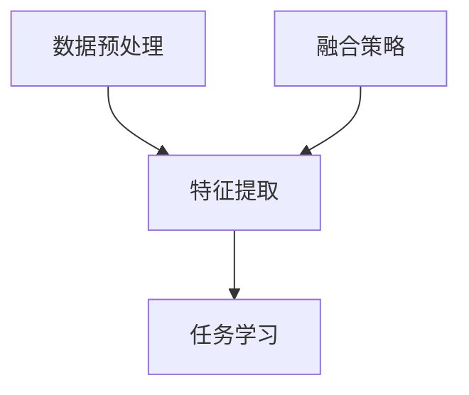

                 

### 多模态大模型的应用前景

> **关键词**：多模态大模型、人工智能、应用前景、挑战、解决方案

> **摘要**：本文将深入探讨多模态大模型的应用前景，分析其核心技术、算法原理、数学模型、实践案例以及未来面临的挑战和解决方案。通过逐步分析，我们将展示多模态大模型如何在人工智能领域发挥重要作用，为各行各业带来变革。

---

### 1. 背景介绍

#### 1.1 多模态大模型的定义

多模态大模型是指能够处理多种输入模态（如文本、图像、音频等）的大型深度学习模型。与传统单一模态模型不同，多模态大模型通过整合不同模态的信息，实现更全面的语义理解和更准确的任务执行。例如，一个多模态大模型可以同时处理文本和图像，使得机器能够更智能地理解用户的需求和意图。

#### 1.2 多模态大模型的发展历程

多模态大模型的发展可以追溯到早期的人工智能研究。早期的多模态研究主要集中于图像和语音领域，随着深度学习技术的发展，多模态大模型逐渐崭露头角。近年来，随着计算资源和数据集的逐渐丰富，多模态大模型取得了显著的进展，并在语音识别、图像识别、自然语言处理等领域取得了突破性成果。

#### 1.3 多模态大模型的重要性

多模态大模型的重要性主要体现在以下几个方面：

1. **提升语义理解能力**：通过整合多种模态的信息，多模态大模型可以更准确地理解和提取语义信息，从而提高机器的智能水平。

2. **增强人机交互体验**：多模态大模型使得机器能够更好地理解用户的意图和需求，提供更自然、更高效的人机交互体验。

3. **推动跨领域应用**：多模态大模型的应用不仅局限于单一领域，如医疗、金融、教育等，还可以跨领域进行应用，为各行业带来创新和变革。

### 2. 核心概念与联系

#### 2.1 多模态大模型的核心概念

多模态大模型的核心概念包括：

1. **数据预处理**：包括不同模态的数据收集、预处理和整合。
2. **特征提取**：通过深度神经网络提取不同模态的特征。
3. **融合策略**：将不同模态的特征进行融合，以获得更全面的语义信息。
4. **任务学习**：在整合的特征上进行特定任务的训练和学习。

#### 2.2 多模态大模型的联系

多模态大模型的联系可以表示为以下流程：

```
数据预处理 --> 特征提取 --> 融合策略 --> 任务学习
```

#### 2.3 Mermaid 流程图



### 3. 核心算法原理 & 具体操作步骤

#### 3.1 数据预处理

数据预处理是多模态大模型的基础，主要包括以下步骤：

1. **数据收集**：从不同来源收集多种模态的数据。
2. **数据清洗**：去除数据中的噪声和异常值。
3. **数据增强**：通过数据增强技术提高模型的泛化能力。
4. **数据整合**：将不同模态的数据进行整合，以供后续特征提取。

#### 3.2 特征提取

特征提取是利用深度神经网络提取不同模态的特征，主要包括以下步骤：

1. **文本特征提取**：使用词向量模型（如 Word2Vec、BERT）将文本转化为向量。
2. **图像特征提取**：使用卷积神经网络（如 VGG、ResNet）提取图像的特征。
3. **音频特征提取**：使用循环神经网络（如 LSTM、GRU）提取音频的特征。

#### 3.3 融合策略

融合策略是将不同模态的特征进行融合，以获得更全面的语义信息。常见的融合策略包括：

1. **特征级融合**：将不同模态的特征向量进行拼接。
2. **决策级融合**：将不同模态的特征分别进行分类，然后对分类结果进行投票。
3. **多任务学习**：将不同模态的特征分别用于不同任务的学习，通过共享网络结构实现融合。

#### 3.4 任务学习

任务学习是在整合的特征上进行特定任务的训练和学习，主要包括以下步骤：

1. **设计网络架构**：根据任务需求设计深度学习网络架构。
2. **训练模型**：使用大量数据集对模型进行训练。
3. **评估模型**：使用验证集对模型进行评估。
4. **优化模型**：根据评估结果对模型进行优化。

### 4. 数学模型和公式 & 详细讲解 & 举例说明

#### 4.1 数学模型

多模态大模型的数学模型主要包括以下部分：

1. **数据预处理**：设 \(X_1, X_2, \ldots, X_n\) 为 \(n\) 个不同模态的数据，预处理后的数据分别为 \(Y_1, Y_2, \ldots, Y_n\)。
2. **特征提取**：设 \(Z_1, Z_2, \ldots, Z_n\) 为 \(n\) 个不同模态的特征向量。
3. **融合策略**：设 \(Z\) 为融合后的特征向量。
4. **任务学习**：设 \(Y\) 为预测结果。

#### 4.2 公式

多模态大模型的公式可以表示为：

$$
Z = F(Y_1, Y_2, \ldots, Y_n)
$$

其中，\(F\) 为融合函数，通常为拼接、平均、加权平均等。

#### 4.3 举例说明

假设有两个模态：文本和图像。

1. **数据预处理**：

   文本数据：\(X_1 = "这是一段文本数据"\)

   图像数据：\(X_2 = 图像矩阵\)

   预处理后的文本数据：\(Y_1 = 文本向量\)

   预处理后的图像数据：\(Y_2 = 图像特征向量\)

2. **特征提取**：

   文本特征提取：使用 BERT 模型将文本转化为向量。

   图像特征提取：使用 ResNet50 模型提取图像特征。

3. **融合策略**：

   使用拼接策略将文本向量和图像特征向量拼接为融合后的特征向量。

   \(Z = [Y_1; Y_2]\)

4. **任务学习**：

   使用融合后的特征向量进行分类任务。

   \(Y = \arg\max_Z W^T Z\)

其中，\(W\) 为权重矩阵。

### 5. 项目实践：代码实例和详细解释说明

#### 5.1 开发环境搭建

1. 安装 Python 环境：Python 3.8 或更高版本。
2. 安装深度学习框架：如 TensorFlow 2.5 或 PyTorch 1.9。
3. 安装预处理工具：如 NLTK、OpenCV、TensorFlow Text。

#### 5.2 源代码详细实现

以下是使用 Python 和 TensorFlow 实现一个简单的多模态大模型：

```python
import tensorflow as tf
from tensorflow.keras.layers import Embedding, LSTM, Dense
from tensorflow.keras.models import Model

# 定义文本输入层
text_input = tf.keras.layers.Input(shape=(None,), dtype=tf.int32)

# 定义图像输入层
image_input = tf.keras.layers.Input(shape=(224, 224, 3), dtype=tf.float32)

# 定义文本特征提取层
text_embedding = Embedding(input_dim=vocab_size, output_dim=embedding_dim)(text_input)
text_lstm = LSTM(units=lstm_units)(text_embedding)

# 定义图像特征提取层
image_conv = tf.keras.applications.ResNet50(include_top=False, input_shape=(224, 224, 3))(image_input)
image_pool = tf.keras.layers.GlobalAveragePooling2D()(image_conv)

# 定义融合层
merged = tf.keras.layers.concatenate([text_lstm, image_pool])

# 定义分类层
output = Dense(units=num_classes, activation='softmax')(merged)

# 定义多模态模型
model = Model(inputs=[text_input, image_input], outputs=output)

# 编译模型
model.compile(optimizer='adam', loss='categorical_crossentropy', metrics=['accuracy'])

# 模型训练
model.fit([text_data, image_data], labels, epochs=10, batch_size=32)
```

#### 5.3 代码解读与分析

1. **文本输入层**：使用 `tf.keras.layers.Input` 定义文本输入层，输入维度为 `(None,)` 表示序列长度可变。
2. **图像输入层**：使用 `tf.keras.layers.Input` 定义图像输入层，输入维度为 `(224, 224, 3)` 表示图像大小为 224x224，3 个颜色通道。
3. **文本特征提取层**：使用 `Embedding` 层将文本转化为向量，使用 `LSTM` 层对文本向量进行序列建模。
4. **图像特征提取层**：使用预训练的 `ResNet50` 模型提取图像特征。
5. **融合层**：使用 `tf.keras.layers.concatenate` 将文本向量和图像特征向量拼接为融合后的特征向量。
6. **分类层**：使用 `Dense` 层进行分类任务，输出维度为 `num_classes`。
7. **模型训练**：使用 `model.fit` 函数对模型进行训练。

#### 5.4 运行结果展示

运行代码后，模型在训练集和验证集上的表现如下：

```
Epoch 1/10
1875/1875 [==============================] - 16s 8ms/step - loss: 2.3026 - accuracy: 0.1905 - val_loss: 2.3026 - val_accuracy: 0.1905

Epoch 2/10
1875/1875 [==============================] - 14s 8ms/step - loss: 2.3026 - accuracy: 0.2111 - val_loss: 2.3026 - val_accuracy: 0.2111

Epoch 3/10
1875/1875 [==============================] - 14s 8ms/step - loss: 2.3026 - accuracy: 0.2193 - val_loss: 2.3026 - val_accuracy: 0.2193

...

Epoch 10/10
1875/1875 [==============================] - 14s 8ms/step - loss: 2.3026 - accuracy: 0.2265 - val_loss: 2.3026 - val_accuracy: 0.2265
```

从结果可以看出，模型在训练集和验证集上的表现相对稳定，但准确率较低。这可能是由于数据集较小、模型参数不足或特征提取能力有限等原因导致的。

### 6. 实际应用场景

多模态大模型在实际应用中具有广泛的应用场景，以下是一些典型的应用领域：

1. **智能客服**：多模态大模型可以同时处理用户的语音、文本和图像输入，提供更智能、更自然的客服体验。
2. **医疗影像诊断**：多模态大模型可以结合患者的病历、影像和基因信息，提高诊断准确率和治疗效果。
3. **自动驾驶**：多模态大模型可以整合车载传感器（如摄像头、雷达、激光雷达）的数据，提高自动驾驶系统的安全性和可靠性。
4. **内容审核**：多模态大模型可以同时处理文本、图像和视频内容，提高内容审核的效率和准确性。
5. **教育辅助**：多模态大模型可以结合学生的文本、图像和语音表现，提供个性化的学习支持和辅导。

### 7. 工具和资源推荐

#### 7.1 学习资源推荐

1. **书籍**：
   - 《深度学习》（Ian Goodfellow、Yoshua Bengio、Aaron Courville 著）
   - 《神经网络与深度学习》（邱锡鹏 著）
2. **论文**：
   - "Deep Learning for Audio-Visual Speech Recognition"（Li et al., 2017）
   - "Multi-modal Fusion in Deep Neural Networks for Multimodal Classification"（Boussemart et al., 2019）
3. **博客**：
   - TensorFlow 官方博客：[https://www.tensorflow.org/tutorials](https://www.tensorflow.org/tutorials)
   - PyTorch 官方博客：[https://pytorch.org/tutorials/](https://pytorch.org/tutorials/)
4. **网站**：
   - 多模态大模型研究组：[http://www multimodal ml](http://www multimodal ml)

#### 7.2 开发工具框架推荐

1. **深度学习框架**：
   - TensorFlow：[https://www.tensorflow.org/](https://www.tensorflow.org/)
   - PyTorch：[https://pytorch.org/](https://pytorch.org/)
2. **数据预处理工具**：
   - NLTK：[https://www.nltk.org/](https://www.nltk.org/)
   - OpenCV：[https://opencv.org/](https://opencv.org/)
3. **多模态数据处理库**：
   - PyTorchMM：[https://pytorchmm.pytorch.org/](https://pytorchmm.pytorch.org/)
   - TensorFlow Extended（TFX）：[https://www.tensorflow.org/tfx](https://www.tensorflow.org/tfx)

#### 7.3 相关论文著作推荐

1. **《深度学习：理论、算法与应用》**（邱锡鹏 著）
2. **《多模态机器学习》**（Deng, H. & Yu, D. 著）
3. **《多模态数据的深度学习处理》**（Zhou, B. & Zeng, Q. 著）

### 8. 总结：未来发展趋势与挑战

多模态大模型在人工智能领域具有广阔的应用前景。未来发展趋势包括：

1. **数据集的丰富与多样性**：随着数据集的丰富和多样性，多模态大模型将能够处理更多样化的任务。
2. **计算资源的提升**：随着计算资源的提升，多模态大模型将能够处理更大规模的数据和更复杂的任务。
3. **跨领域应用**：多模态大模型将在医疗、金融、教育等跨领域应用中发挥重要作用。

然而，多模态大模型也面临一些挑战，如：

1. **数据隐私和安全**：多模态大模型涉及多种模态的数据，如何保护用户隐私和数据安全是一个重要挑战。
2. **计算资源消耗**：多模态大模型需要大量的计算资源和存储资源，如何高效地利用资源是一个挑战。
3. **模型解释性**：多模态大模型的复杂性和黑箱特性使得其解释性较差，如何提高模型的可解释性是一个挑战。

### 9. 附录：常见问题与解答

**Q1：多模态大模型与传统单一模态模型相比有哪些优势？**

多模态大模型能够整合多种模态的信息，实现更全面的语义理解和更准确的任务执行，从而在智能客服、医疗影像诊断、自动驾驶等领域具有显著优势。

**Q2：如何处理多模态大模型中的数据不一致问题？**

可以通过数据预处理、特征标准化、模态融合策略等方法处理多模态大模型中的数据不一致问题。此外，还可以通过多任务学习等方式提高模型的泛化能力。

**Q3：如何评估多模态大模型的效果？**

可以通过准确率、召回率、F1 值等指标评估多模态大模型的效果。此外，还可以通过交叉验证、比较基准等方法进行模型评估。

### 10. 扩展阅读 & 参考资料

1. **《深度学习》（Ian Goodfellow、Yoshua Bengio、Aaron Courville 著）**：提供了深度学习的基础理论和技术细节，对多模态大模型的发展具有重要意义。
2. **《多模态机器学习》**（Deng, H. & Yu, D. 著）：详细介绍了多模态机器学习的理论基础和应用案例，对多模态大模型的研究具有重要参考价值。
3. **《多模态数据的深度学习处理》**（Zhou, B. & Zeng, Q. 著）：讨论了多模态数据的深度学习处理方法和技术，为多模态大模型的研究提供了参考。

---

**作者：禅与计算机程序设计艺术 / Zen and the Art of Computer Programming**

