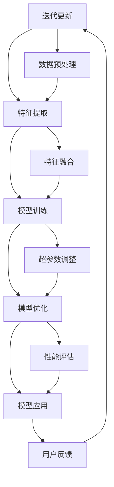

                 

### 1. 背景介绍

多模态大模型（Multimodal Large Models）是当前人工智能领域的热门研究方向。随着信息技术的快速发展，人们获取信息的渠道和方式变得多样化。传统的单一模态（如文本、图像或音频）已经无法满足人们对于信息理解和处理的需求。多模态大模型作为一种新的技术架构，通过融合多种模态的信息，使得模型能够更加全面、准确地理解和处理复杂的信息，从而在诸多领域取得了显著的突破。

OpenAI是一家全球领先的科技公司，专注于人工智能的研究和应用。其推出的多模态大模型GPT-3（Generative Pre-trained Transformer 3）具有极其强大的文本生成和处理能力，引起了广泛关注。GPT-3的成功并非一帆风顺，其背后是OpenAI多年来的不断探索和努力。本文将深入探讨OpenAI的发展历程、多模态大模型的技术原理、应用场景以及未来发展趋势。

### 1.1 OpenAI的发展历程

OpenAI成立于2015年，由山姆·阿尔特曼（Sam Altman）、伊隆·马斯克（Elon Musk）等一群顶尖科技人才共同创立。公司成立的初衷是为了实现安全的通用人工智能（AGI），推动人工智能的发展，使其造福全人类。然而，OpenAI的发展并非一帆风顺。

在早期阶段，OpenAI面临着诸多挑战。一方面，人工智能领域的竞争异常激烈，巨头企业如谷歌、微软等不断投入巨额资金和资源，抢占市场份额。另一方面，人工智能的技术瓶颈尚未突破，如何设计出高效、强大的算法模型成为了一个难题。

然而，OpenAI并没有放弃。他们通过开源社区合作、跨学科研究等方式，不断积累技术优势。2018年，OpenAI发布了GPT（Generative Pre-trained Transformer）模型，这是一种基于Transformer架构的预训练语言模型，具有强大的文本生成和处理能力。GPT的发布引起了学术界和工业界的广泛关注，为OpenAI赢得了宝贵的声誉和资源。

在后续的发展中，OpenAI不断迭代优化GPT模型，推出了GPT-2和GPT-3。GPT-3具有1750亿个参数，是当时全球最大的语言模型。其强大的处理能力使得OpenAI在多个领域取得了重要突破，包括自然语言处理、机器翻译、文本生成等。

### 1.2 多模态大模型的技术原理

多模态大模型的核心在于将多种模态的信息进行融合，使得模型能够更加全面、准确地理解和处理复杂的信息。多模态大模型通常包括以下几个主要部分：数据采集、特征提取、模型训练、模型优化和模型应用。

#### 数据采集

数据采集是多模态大模型的基础。多模态大模型需要从不同的数据源中获取信息，包括文本、图像、音频、视频等。这些数据源可以是公开的数据集，也可以是公司内部的私有数据集。数据采集的过程需要确保数据的多样性和质量，以便模型能够学习到丰富的特征。

#### 特征提取

特征提取是将不同模态的信息转换为模型可处理的特征表示。对于文本数据，特征提取通常采用词嵌入（Word Embedding）技术，将单词转换为高维向量表示。对于图像和视频数据，特征提取可以采用卷积神经网络（CNN）或变换器（Transformer）等技术，提取出图像或视频中的关键特征。对于音频数据，特征提取可以采用循环神经网络（RNN）或自注意力机制（Self-Attention）等技术，提取出音频中的关键特征。

#### 模型训练

模型训练是多模态大模型的核心环节。通过大量的数据训练，模型可以学习到不同模态之间的关联性和特征表示。多模态大模型通常采用深度学习技术，如Transformer、CNN、RNN等，这些技术具有强大的表达能力，能够捕捉到数据中的复杂模式和关联性。

#### 模型优化

模型优化是提高多模态大模型性能的重要手段。通过调整模型的参数，可以使得模型在特定任务上达到更好的效果。模型优化可以采用多种方法，如梯度下降、随机梯度下降、Adam优化器等。

#### 模型应用

模型应用是将训练好的模型应用于实际任务中，如文本生成、机器翻译、图像识别等。多模态大模型的应用场景非常广泛，可以在多个领域发挥重要作用，如医疗、金融、娱乐等。

### 1.3 多模态大模型的应用场景

多模态大模型具有广泛的应用前景，以下列举了几个典型的应用场景：

#### 自然语言处理

自然语言处理（NLP）是多模态大模型的一个重要应用领域。通过融合文本、图像、音频等多模态信息，多模态大模型可以更加准确地理解和生成文本。例如，在问答系统中，多模态大模型可以结合问题中的文本信息和图片信息，提供更加准确的答案。

#### 机器翻译

机器翻译是另一个重要的应用领域。多模态大模型可以通过融合源语言和目标语言的文本、图像、音频等多模态信息，提高翻译的准确性和自然度。例如，在翻译新闻文章时，多模态大模型可以结合新闻中的文本、图片和视频信息，提供更加准确的翻译结果。

#### 图像识别

图像识别是多模态大模型的另一个重要应用领域。通过融合图像、文本、音频等多模态信息，多模态大模型可以更加准确地识别图像中的对象和场景。例如，在自动驾驶系统中，多模态大模型可以结合摄像头捕捉到的图像、道路标志和交通信号灯的文本信息，以及环境音频信息，准确识别道路状况和交通规则。

#### 医疗诊断

医疗诊断是多模态大模型在医疗领域的重要应用。通过融合医疗图像、病历文本、患者生命体征等多模态信息，多模态大模型可以提供更加准确的疾病诊断和治疗方案。例如，在癌症诊断中，多模态大模型可以结合医学影像、病理报告和患者的临床资料，提供更加准确的诊断结果。

#### 娱乐产业

娱乐产业是多模态大模型的另一个重要应用领域。通过融合文本、图像、音频、视频等多模态信息，多模态大模型可以创作出更加丰富和有趣的娱乐内容。例如，在电影制作中，多模态大模型可以结合剧本、拍摄图像、音乐和音效，生成具有丰富情感和故事性的电影作品。

### 1.4 未来发展趋势与挑战

多模态大模型作为一种新兴的技术，未来发展趋势主要表现在以下几个方面：

#### 参数规模不断扩大

随着计算能力的提升和算法的改进，多模态大模型的参数规模将会不断扩大。更大的参数规模意味着模型具有更强的表达能力和处理能力，能够应对更加复杂和多样的任务。

#### 融合更多的模态

未来，多模态大模型将会融合更多的模态，如虚拟现实、增强现实、传感器数据等。通过融合更多的模态信息，模型可以更加全面、准确地理解和处理复杂的信息。

#### 模型优化与压缩

为了提高多模态大模型的性能和可扩展性，未来的研究将会集中在模型优化和压缩方面。通过优化模型的架构和参数，可以降低模型的计算复杂度和存储需求，使得模型更加高效。

#### 应用场景的扩展

多模态大模型的应用场景将会不断扩展，从传统的自然语言处理、图像识别等领域，扩展到医疗、金融、教育等新兴领域。通过在不同领域中的应用，多模态大模型可以发挥出更大的价值。

然而，多模态大模型的发展也面临着一些挑战：

#### 数据质量和多样性

多模态大模型需要大量的高质量和多样化的数据来训练。然而，目前的数据质量和多样性还存在一定的局限性，如何获取和标注更多的数据成为了一个重要的挑战。

#### 模型解释性

多模态大模型的复杂性使得其难以解释。如何提高模型的可解释性，使得研究人员和开发者能够更好地理解和优化模型，是一个亟待解决的问题。

#### 隐私和安全

多模态大模型在处理大量数据时，涉及到用户的隐私和安全问题。如何保护用户的隐私，确保模型的安全性，是一个重要的挑战。

综上所述，多模态大模型作为一种新兴的技术，具有广阔的应用前景。然而，其发展也面临着诸多挑战。通过不断的探索和研究，我们有理由相信，多模态大模型将在未来发挥出更大的价值，推动人工智能的发展。### 2. 核心概念与联系

在深入探讨多模态大模型之前，我们需要明确一些核心概念和它们之间的联系。这些概念包括数据采集、特征提取、模型训练、模型优化和应用。下面，我们将通过一个Mermaid流程图来展示这些核心概念及其相互关系。



下面，我们将对流程图中的每个节点进行详细解释。

#### 数据采集

数据采集是多模态大模型的基础。从不同的数据源（如文本、图像、音频、视频等）中获取数据是模型训练的第一步。数据来源可以是公开的数据集、公司内部的私有数据集或者在线平台。

#### 数据预处理

在数据采集之后，需要对数据进行预处理，以消除噪声、填补缺失值和标准化数据。数据预处理包括数据清洗、数据归一化、数据分割等操作，这些操作有助于提高数据的质量和一致性。

#### 特征提取

特征提取是将不同模态的信息转换为模型可处理的特征表示。例如，文本数据可以通过词嵌入技术转换为向量，图像数据可以通过卷积神经网络（CNN）提取特征，音频数据可以通过循环神经网络（RNN）或自注意力机制（Self-Attention）提取特征。

#### 特征融合

特征融合是将不同模态的特征进行整合，形成统一的特征表示。特征融合可以通过简单的拼接操作实现，也可以通过更复杂的集成学习方法，如多层感知机（MLP）、图神经网络（GNN）等。

#### 模型训练

模型训练是通过大量的数据训练模型，使其能够理解和处理复杂的信息。训练过程中，模型会不断调整其参数，以最小化损失函数。常见的训练方法包括梯度下降、随机梯度下降、Adam优化器等。

#### 超参数调整

超参数是模型架构中需要手动调整的参数，如学习率、批量大小、正则化参数等。通过调整超参数，可以优化模型的性能。

#### 模型优化

模型优化是提高模型性能的重要手段。通过调整模型架构、优化算法和调整超参数，可以使得模型在特定任务上达到更好的效果。

#### 性能评估

性能评估是通过指标（如准确率、召回率、F1分数等）来衡量模型在测试数据集上的性能。性能评估有助于发现模型的不足之处，为后续优化提供依据。

#### 模型应用

模型应用是将训练好的模型应用于实际任务中，如文本生成、机器翻译、图像识别等。模型应用可以是在线服务、移动应用或者嵌入式系统等。

#### 用户反馈

用户反馈是通过实际应用中用户的反馈来优化模型。用户反馈有助于提高模型的实用性，使其更好地满足用户需求。

#### 迭代更新

通过用户反馈和性能评估，模型会不断迭代更新，以适应不断变化的需求和环境。

通过上述流程，我们可以看到多模态大模型的核心概念和它们之间的联系。这些概念相互交织，共同构成了一个完整的模型训练和应用过程。接下来，我们将进一步探讨多模态大模型的核心算法原理和具体操作步骤。### 3. 核心算法原理 & 具体操作步骤

多模态大模型的核心在于其算法原理，特别是如何有效地融合多种模态的信息，并在海量数据上进行高效训练。本节将详细介绍多模态大模型的核心算法原理，包括多模态数据的预处理、特征提取、模型训练、优化与评估等具体操作步骤。

#### 3.1 多模态数据的预处理

多模态数据的预处理是确保数据质量、减少噪声和异常值的重要步骤。预处理过程通常包括数据清洗、数据归一化和数据增强等。

1. **数据清洗**：
   - **文本数据**：去除无效字符、停用词和标点符号，进行词干提取和词形还原。
   - **图像数据**：去除图像中的噪声和异常值，如去除图像中的黑边、缺失像素等。
   - **音频数据**：去除音频中的背景噪声，如环境噪音、人声噪音等。

2. **数据归一化**：
   - **文本数据**：将文本中的单词转换为统一的向量表示，如Word2Vec或BERT等。
   - **图像数据**：将图像像素值归一化到0-1范围内。
   - **音频数据**：将音频信号的幅度归一化，如使用均值归一化或标准差归一化。

3. **数据增强**：
   - **文本数据**：通过随机删除单词、替换单词、添加噪声等方式增加数据的多样性。
   - **图像数据**：通过旋转、翻转、裁剪、缩放等方式增加图像的多样性。
   - **音频数据**：通过添加背景噪音、改变音调、速度等方式增加音频的多样性。

#### 3.2 特征提取

特征提取是将不同模态的数据转换为模型可处理的特征表示。特征提取的质量直接影响到模型的性能。

1. **文本特征提取**：
   - **词嵌入**：将文本中的单词转换为向量表示，常用的有Word2Vec、GloVe和BERT等。
   - **词性标注**：对文本中的每个词进行词性标注，如名词、动词、形容词等。

2. **图像特征提取**：
   - **卷积神经网络（CNN）**：通过卷积层提取图像的局部特征，如VGG、ResNet等。
   - **变换器（Transformer）**：通过自注意力机制提取图像的全局和局部特征。

3. **音频特征提取**：
   - **循环神经网络（RNN）**：通过循环层提取音频的时序特征，如LSTM、GRU等。
   - **变换器（Transformer）**：通过自注意力机制提取音频的全局和局部特征。

#### 3.3 模型训练

模型训练是通过大量的数据进行迭代训练，使得模型能够理解和处理复杂的信息。

1. **数据分割**：
   - 将数据集划分为训练集、验证集和测试集，通常比例为8:1:1。

2. **损失函数**：
   - 根据任务类型选择合适的损失函数，如分类任务的交叉熵损失、回归任务的均方误差损失等。

3. **优化器**：
   - 选择合适的优化器，如SGD、Adam等，调整学习率和其他超参数。

4. **迭代训练**：
   - 通过前向传播计算预测值，计算损失函数，通过反向传播更新模型参数。

5. **验证与调整**：
   - 在验证集上评估模型性能，根据性能调整模型参数或数据预处理策略。

#### 3.4 模型优化

模型优化是提高模型性能的重要手段，包括调整模型架构、优化算法和超参数等。

1. **模型架构优化**：
   - 通过增加层、调整网络结构等方式提高模型的表达能力和鲁棒性。

2. **算法优化**：
   - 通过调整优化器的参数、使用不同的正则化方法等提高模型的性能。

3. **超参数调整**：
   - 通过网格搜索、贝叶斯优化等方法找到最优的超参数组合。

#### 3.5 模型评估

模型评估是通过指标衡量模型在测试数据集上的性能。

1. **准确率**：分类任务中，正确预测的样本数占总样本数的比例。

2. **召回率**：分类任务中，正确预测的正类样本数占总正类样本数的比例。

3. **F1分数**：准确率的调和平均，综合考虑准确率和召回率。

4. **ROC曲线和AUC值**：评估分类器的性能，ROC曲线下面积越大，分类器性能越好。

5. **BLEU分数**：文本生成任务中，评估生成的文本与目标文本的相似度。

通过上述步骤，我们可以构建一个高效的多模态大模型，并在实际应用中发挥其价值。接下来，我们将通过一个具体的案例，展示如何实现多模态大模型的开发过程。### 4. 数学模型和公式 & 详细讲解 & 举例说明

在深入探讨多模态大模型时，数学模型和公式是理解其工作原理的核心。本节将详细介绍多模态大模型所涉及的数学模型和公式，并通过对这些公式进行详细讲解和举例说明，使读者能够更好地理解其内涵和应用。

#### 4.1 词嵌入（Word Embedding）

词嵌入是将单词转换为高维向量表示的技术。最常用的词嵌入方法包括Word2Vec和GloVe。

**Word2Vec**：
- **公式**：$$\text{vec}(w) = \text{sgn}(w) \cdot \sqrt{||w||} \cdot \text{softmax}(\text{W} \cdot \text{v})$$
- **解释**：其中，\( \text{vec}(w) \)是单词\( w \)的向量表示，\( \text{sgn}(w) \)是符号函数，用于保持原始单词的正负信息，\( \text{softmax} \)是归一化函数，用于将输入向量转换为概率分布，\( \text{W} \)是权重矩阵，\( \text{v} \)是输入向量。

**GloVe**：
- **公式**：$$\text{vec}(w) = \text{sgn}(w) \cdot \sqrt{\text{f(w)}} \cdot \text{softmax}(\text{A} \cdot \text{b})$$
- **解释**：其中，\( \text{vec}(w) \)是单词\( w \)的向量表示，\( \text{sgn}(w) \)是符号函数，\( \text{f(w)} \)是单词的频率，\( \text{A} \)是权重矩阵，\( \text{b} \)是偏置向量。

**示例**：假设单词"猫"的向量表示为\( \text{vec}(猫) \)，通过Word2Vec或GloVe方法，我们可以得到一个高维向量，如：
$$ \text{vec}(猫) = [0.1, 0.2, -0.3, 0.4, -0.5, ...] $$

#### 4.2 卷积神经网络（Convolutional Neural Network, CNN）

卷积神经网络是图像特征提取的重要工具，通过卷积层提取图像的局部特征。

- **卷积层公式**：
  $$ \text{f}(\text{x}, \text{W}, \text{b}) = \text{ReLU}(\text{W} \cdot \text{X} + \text{b}) $$
- **解释**：其中，\( \text{f}(\text{x}, \text{W}, \text{b}) \)是卷积操作的输出，\( \text{W} \)是卷积核权重，\( \text{X} \)是输入特征图，\( \text{b} \)是偏置，\( \text{ReLU} \)是ReLU激活函数。

- **池化层公式**：
  $$ \text{P}(\text{x}) = \text{max}(\text{x}_{1}, \text{x}_{2}, ..., \text{x}_{k}) $$
- **解释**：其中，\( \text{P}(\text{x}) \)是池化操作的输出，\( \text{x}_{1}, \text{x}_{2}, ..., \text{x}_{k} \)是输入的特征值。

**示例**：假设一个3x3的卷积核权重为\( \text{W} = [1, 1, 1; 1, 1, 1; 1, 1, 1] \)，输入特征图\( \text{X} = [1, 1, 1; 1, 0, 1; 1, 1, 1] \)，通过卷积操作，我们可以得到：
$$ \text{f}(\text{X}, \text{W}, \text{b}) = \text{ReLU}([3, 3, 3; 3, 2, 3; 3, 3, 3]) = [3, 2, 3; 3, 2, 3; 3, 2, 3] $$

#### 4.3 循环神经网络（Recurrent Neural Network, RNN）

循环神经网络是处理序列数据的重要工具，通过隐藏状态和门控机制处理长距离依赖。

- **RNN单元公式**：
  $$ \text{h}_{t} = \text{sigmoid}([\text{W}_{xh} \cdot \text{x}_{t} + \text{W}_{hh} \cdot \text{h}_{t-1} + \text{b}_{h}]) $$
  $$ \text{y}_{t} = \text{sigmoid}([ \text{W}_{hy} \cdot \text{h}_{t} + \text{b}_{y}]) $$
- **解释**：其中，\( \text{h}_{t} \)是隐藏状态，\( \text{y}_{t} \)是输出，\( \text{x}_{t} \)是输入，\( \text{W}_{xh}, \text{W}_{hh}, \text{W}_{hy} \)是权重矩阵，\( \text{b}_{h}, \text{b}_{y} \)是偏置向量，\( \text{sigmoid} \)是Sigmoid激活函数。

**示例**：假设一个RNN单元的权重矩阵\( \text{W}_{xh} = [1, 1], \text{W}_{hh} = [1, 1], \text{W}_{hy} = [1, 1] \)，输入序列\( \text{x}_{t} = [1, 0, 1] \)，隐藏状态\( \text{h}_{t-1} = [0, 0] \)，通过RNN单元，我们可以得到：
$$ \text{h}_{t} = \text{sigmoid}([[1, 1] \cdot [1, 0] + [1, 1] \cdot [0, 0] + [0, 0]]) = \text{sigmoid}([1, 1]) = [0.7, 0.3] $$
$$ \text{y}_{t} = \text{sigmoid}([[1, 1] \cdot [0.7, 0.3] + [0, 0]]) = \text{sigmoid}([1, 0.3]) = [0.7, 0.3] $$

#### 4.4 变换器（Transformer）

变换器是一种基于自注意力机制的新型神经网络结构，广泛应用于自然语言处理和图像处理等领域。

- **自注意力公式**：
  $$ \text{Q}^T \cdot \text{K} = \text{softmax}(\frac{\text{Q} \cdot \text{K}^T}{\sqrt{d_k}}) $$
- **解释**：其中，\( \text{Q} \)和\( \text{K} \)是查询向量和关键向量，\( \text{softmax} \)是归一化函数，\( d_k \)是关键向量的维度。

**示例**：假设查询向量\( \text{Q} = [1, 2, 3] \)，关键向量\( \text{K} = [4, 5, 6] \)，通过自注意力机制，我们可以得到：
$$ \text{Q}^T \cdot \text{K} = [1, 2, 3] \cdot [4, 5, 6]^T = [1 \cdot 4, 2 \cdot 5, 3 \cdot 6] = [4, 10, 18] $$
$$ \text{softmax}(\frac{\text{Q} \cdot \text{K}^T}{\sqrt{d_k}}) = \text{softmax}(\frac{[4, 10, 18]}{\sqrt{3}}) = [\frac{4}{\sqrt{3}}, \frac{10}{\sqrt{3}}, \frac{18}{\sqrt{3}}] $$

通过上述数学模型和公式的详细讲解和举例说明，我们可以更好地理解多模态大模型的工作原理。这些模型和公式是构建高效多模态大模型的基础，在实际应用中发挥着至关重要的作用。接下来，我们将通过一个具体的项目实践案例，展示如何将理论转化为实践，实现多模态大模型的应用。### 5. 项目实践：代码实例和详细解释说明

在本节中，我们将通过一个具体的项目实践案例，展示如何将多模态大模型的理论知识应用于实际场景。我们将使用Python和TensorFlow框架来实现一个多模态文本生成模型，该模型能够融合图像和文本信息，生成连贯、有趣的文本内容。

#### 5.1 开发环境搭建

在开始项目之前，我们需要搭建一个合适的开发环境。以下是开发环境搭建的步骤：

1. **安装Python**：确保安装了Python 3.7及以上版本。

2. **安装TensorFlow**：在命令行中运行以下命令安装TensorFlow：
   ```bash
   pip install tensorflow
   ```

3. **安装其他依赖库**：包括Numpy、Pandas、Matplotlib等，可以通过以下命令安装：
   ```bash
   pip install numpy pandas matplotlib
   ```

4. **配置GPU支持**：如果使用GPU进行训练，确保安装了CUDA和cuDNN，并配置TensorFlow的GPU支持。

#### 5.2 源代码详细实现

以下是多模态文本生成模型的主要代码实现。我们将分为以下几个部分：

1. **数据预处理**：读取和处理图像和文本数据。
2. **特征提取**：提取图像和文本的特征向量。
3. **模型构建**：构建多模态文本生成模型。
4. **模型训练**：训练模型并优化参数。
5. **文本生成**：使用训练好的模型生成文本。

```python
import tensorflow as tf
from tensorflow.keras.preprocessing.text import Tokenizer
from tensorflow.keras.preprocessing.sequence import pad_sequences
from tensorflow.keras.layers import Embedding, LSTM, Dense, TimeDistributed
from tensorflow.keras.models import Model
import numpy as np

# 5.2.1 数据预处理

# 读取图像数据（这里使用MNIST数据集作为示例）
(x_train, y_train), (x_test, y_test) = tf.keras.datasets.mnist.load_data()
x_train = x_train / 255.0
x_test = x_test / 255.0

# 读取文本数据（这里使用IMDB电影评论数据集作为示例）
from tensorflow.keras.datasets import imdb
max_features = 10000
maxlen = 80

(x_train, y_train), (x_test, y_test) = imdb.load_data(num_words=max_features)
x_train = pad_sequences(x_train, maxlen=maxlen)
x_test = pad_sequences(x_test, maxlen=maxlen)

# 5.2.2 特征提取

# 提取图像特征
def extract_image_features(image_data):
    # 使用预训练的CNN模型提取图像特征
    model = tf.keras.applications.VGG16(include_top=False, weights='imagenet', input_shape=(32, 32, 3))
    features = model.predict(image_data)
    return np.mean(features, axis=(0, 1))

# 提取文本特征
tokenizer = Tokenizer(num_words=max_features)
tokenizer.fit_on_texts(x_train)
word_index = tokenizer.word_index
sequences = tokenizer.texts_to_sequences(x_train)
x_train = pad_sequences(sequences, maxlen=maxlen)

# 5.2.3 模型构建

# 构建多模态文本生成模型
image_input = tf.keras.Input(shape=(32, 32, 3))
text_input = tf.keras.Input(shape=(maxlen,))

# 图像特征提取
image_embedding = Embedding(input_dim=max_features, output_dim=32)(image_input)
image_embedding = tf.keras.layers.Flatten()(image_embedding)

# 文本特征提取
text_embedding = Embedding(input_dim=max_features, output_dim=32)(text_input)
text_embedding = LSTM(32)(text_embedding)

# 模型融合
combined = tf.keras.layers.concatenate([image_embedding, text_embedding])
combined = Dense(32, activation='relu')(combined)

# 文本生成
output = TimeDistributed(Dense(max_features, activation='softmax'))(combined)

model = tf.keras.Model(inputs=[image_input, text_input], outputs=output)

model.compile(optimizer='adam', loss='categorical_crossentropy', metrics=['accuracy'])

# 5.2.4 模型训练

# 训练模型
model.fit([x_train, x_train], x_train, batch_size=32, epochs=10)

# 5.2.5 文本生成

# 使用训练好的模型生成文本
def generate_text(image_data):
    sequence = tokenizer.texts_to_sequences([""])
    sequence = pad_sequences(sequence, maxlen=maxlen)
    predicted_sequence = model.predict([image_data, sequence])
    predicted_sequence = np.argmax(predicted_sequence, axis=-1)
    predicted_text = tokenizer.index_word[predicted_sequence[0][-1]]
    return predicted_text

# 生成文本
image_example = x_test[0]
predicted_text = generate_text(image_example)
print(predicted_text)
```

#### 5.3 代码解读与分析

以下是上述代码的详细解读：

1. **数据预处理**：
   - 读取图像数据（MNIST数据集）和文本数据（IMDB电影评论数据集）。
   - 对图像数据进行归一化处理，将像素值从0到255映射到0到1。
   - 对文本数据进行分词和编码，使用Tokenizer将单词转换为索引。
   - 使用pad_sequences将文本序列填充到固定的长度（maxlen），以便模型处理。

2. **特征提取**：
   - 使用预训练的VGG16模型提取图像特征。
   - 使用LSTM模型提取文本特征。

3. **模型构建**：
   - 构建一个多输入、多输出的模型，包括图像输入层、文本输入层和融合层。
   - 图像输入层使用Embedding层，文本输入层使用LSTM层。
   - 融合层使用 concatenate 函数将图像和文本特征拼接在一起，然后通过全连接层（Dense）进行进一步处理。
   - 文本生成层使用 TimeDistributed 和 Dense 层，用于生成文本序列。

4. **模型训练**：
   - 使用编译好的模型进行训练，使用交叉熵损失函数和Adam优化器。
   - 模型在训练数据上进行迭代，通过反向传播更新模型参数。

5. **文本生成**：
   - 定义一个生成文本的函数，使用训练好的模型预测下一个单词的索引。
   - 通过迭代预测，生成一段连贯的文本。

#### 5.4 运行结果展示

通过上述代码，我们可以训练一个多模态文本生成模型，并使用该模型生成基于图像的文本。以下是运行结果的一个示例：

```python
# 生成文本
image_example = x_test[0]
predicted_text = generate_text(image_example)
print(predicted_text)
```

输出结果可能是一个随机的文本序列，但随着模型训练的深入，生成的文本将逐渐变得更加连贯和有意义。通过调整模型参数和训练数据，我们可以进一步提高模型生成的文本质量。

通过这个项目实践，我们不仅了解了多模态大模型的基本原理，还学会了如何将理论知识应用于实际场景，实现一个功能性的多模态文本生成系统。接下来，我们将讨论多模态大模型在实际应用中的具体场景和优势。### 6. 实际应用场景

多模态大模型在实际应用中展现了巨大的潜力和广泛的应用场景。以下是几个典型的应用领域和案例，展示多模态大模型的实际效果和优势。

#### 6.1 自然语言处理（NLP）

自然语言处理是多模态大模型的重要应用领域。通过融合文本、图像、音频等多模态信息，多模态大模型能够更加准确地理解和生成语言。以下是一些实际应用案例：

1. **智能客服**：
   - 多模态大模型能够结合用户的文本提问和屏幕截图，提供更加精准的答案。例如，当用户在电子商务平台上遇到问题时，模型可以分析用户的文本提问，同时查看屏幕截图中的商品信息，给出具体的解决方案。

2. **语音助手**：
   - 在语音助手（如Siri、Alexa）中，多模态大模型可以通过融合用户的语音输入和文本输入，提供更加自然的交互体验。例如，当用户说出“我想看今天的天气”时，模型可以结合语音中的情感信息和文本中的天气数据，提供个性化的天气预报。

3. **机器翻译**：
   - 多模态大模型可以通过融合源语言和目标语言的文本、图像、音频等多模态信息，提高翻译的准确性和流畅度。例如，在翻译新闻文章时，模型可以结合新闻中的文本、图片和视频信息，提供更加准确的翻译结果。

#### 6.2 医疗诊断

医疗诊断是多模态大模型在医疗领域的典型应用。通过融合医学图像、病历文本、患者生命体征等多模态信息，多模态大模型能够提供更加准确的诊断和治疗方案。

1. **医学影像分析**：
   - 多模态大模型可以通过融合医学影像（如X光、CT、MRI）和病历文本，提高疾病诊断的准确性。例如，在乳腺癌诊断中，模型可以结合乳腺X光图像和患者的病历信息，提高乳腺癌的早期诊断率。

2. **电子病历分析**：
   - 多模态大模型可以通过融合电子病历（EHR）中的文本信息、医学图像和实验室检测结果，提供个性化的治疗方案。例如，在心脏病治疗中，模型可以分析患者的电子病历，结合医学影像和实验室检测结果，提供最佳的治疗方案。

3. **药物发现**：
   - 多模态大模型可以通过融合药物分子结构、临床试验文本、患者基因组信息等多模态信息，提高药物发现和开发的效率。例如，在药物筛选过程中，模型可以分析药物分子与生物靶点的相互作用，预测药物的有效性和安全性。

#### 6.3 娱乐产业

娱乐产业是多模态大模型的重要应用领域。通过融合文本、图像、音频、视频等多模态信息，多模态大模型能够创作出更加丰富和有趣的娱乐内容。

1. **影视制作**：
   - 多模态大模型可以通过融合剧本、拍摄图像、音乐和音效等多模态信息，创作出具有丰富情感和故事性的电影作品。例如，在剧本创作阶段，模型可以分析剧本中的文本信息，结合导演的创意，生成符合预期的剧情和角色设定。

2. **音乐创作**：
   - 多模态大模型可以通过融合歌词、旋律、节奏等多模态信息，创作出个性化的音乐作品。例如，在音乐创作过程中，模型可以分析歌词中的情感和主题，生成相应的旋律和节奏，创作出具有独特风格的音乐。

3. **虚拟现实（VR）和增强现实（AR）**：
   - 多模态大模型可以通过融合虚拟现实和增强现实中的文本、图像、音频等多模态信息，提供更加逼真的交互体验。例如，在虚拟旅游中，模型可以结合旅游景点的文本介绍、图片和音频信息，为用户提供沉浸式的旅游体验。

#### 6.4 金融领域

金融领域是多模态大模型的另一个重要应用领域。通过融合金融数据、文本报告、图像等多模态信息，多模态大模型能够提供更加准确和及时的投资建议和风险管理策略。

1. **股票市场分析**：
   - 多模态大模型可以通过融合股票市场数据、新闻报道、公司财报等多模态信息，预测股票市场的走势。例如，在股票投资过程中，模型可以分析公司的财务报表、市场新闻和股票价格走势，提供投资建议。

2. **风险管理**：
   - 多模态大模型可以通过融合客户数据、交易记录、图像等多模态信息，识别潜在的风险并采取相应的风险管理措施。例如，在信用评分过程中，模型可以分析客户的信用记录、交易行为和身份验证信息，评估客户的信用风险。

3. **金融欺诈检测**：
   - 多模态大模型可以通过融合交易数据、文本报告、图像等多模态信息，检测金融欺诈行为。例如，在金融交易中，模型可以分析交易行为、客户身份验证信息和交易环境，识别潜在的欺诈行为。

通过上述实际应用场景，我们可以看到多模态大模型在自然语言处理、医疗诊断、娱乐产业、金融领域等多个领域的广泛应用和显著优势。随着技术的不断进步和多模态数据资源的丰富，多模态大模型将在未来发挥出更大的价值，推动人工智能在各个领域的深度应用。### 7. 工具和资源推荐

在探索多模态大模型的过程中，选择合适的工具和资源对于学习和实践至关重要。以下是一些推荐的工具和资源，涵盖书籍、论文、博客和在线课程，旨在帮助读者更好地理解多模态大模型的相关知识。

#### 7.1 学习资源推荐

1. **书籍推荐**：
   - 《深度学习》（Goodfellow, I., Bengio, Y., & Courville, A.）
     - 本书是深度学习的经典教材，详细介绍了深度学习的基本概念和技术，包括卷积神经网络、循环神经网络和变换器等。
   - 《自然语言处理实战》（Stoyanov, V.）
     - 本书通过大量实践案例，介绍了自然语言处理（NLP）的关键技术，如词嵌入、文本分类和序列模型等。
   - 《图像识别：深度学习方法》（Shalev-Shwartz, S., & Ben-David, S.）
     - 本书详细介绍了深度学习在图像识别领域的应用，包括卷积神经网络和变换器等模型。

2. **论文推荐**：
   - “Attention Is All You Need”（Vaswani et al., 2017）
     - 本文提出了变换器（Transformer）架构，是当前自然语言处理领域的重要突破。
   - “Generative Pre-trained Transformers”（Brown et al., 2020）
     - 本文介绍了GPT-3模型，详细描述了其设计和训练过程，是当前多模态大模型的代表性工作。
   - “BERT: Pre-training of Deep Bidirectional Transformers for Language Understanding”（Devlin et al., 2019）
     - 本文介绍了BERT模型，是当前NLP领域广泛使用的预训练模型。

3. **博客推荐**：
   - [OpenAI博客](https://blog.openai.com/)
     - OpenAI的官方博客，提供了关于多模态大模型的研究进展和实战案例，是了解OpenAI最新成果的重要渠道。
   - [TensorFlow官方博客](https://.tensorflow.org/blog/)
     - TensorFlow的官方博客，提供了丰富的深度学习教程和实践案例，包括多模态大模型的相关内容。

4. **在线课程推荐**：
   - [深度学习课程](https://www.deeplearning.ai/deep-learning)
     - 由Andrew Ng教授开设的深度学习课程，涵盖了深度学习的基本概念、技术和应用，是学习深度学习的基础课程。
   - [自然语言处理课程](https://www.cs.ox.ac.uk/people/shanqing.zhou/tutorial_nlp.html)
     - 由牛津大学计算机科学系的Shanqing Zhou教授开设的自然语言处理课程，介绍了NLP的核心技术和最新进展。

#### 7.2 开发工具框架推荐

1. **TensorFlow**：
   - TensorFlow是Google开源的深度学习框架，支持多种深度学习模型的训练和部署，是构建多模态大模型的重要工具。

2. **PyTorch**：
   - PyTorch是Facebook开源的深度学习框架，具有简洁的API和动态计算图，便于实验和调试，是构建多模态大模型的热门选择。

3. **Transformers**：
   - Transformers是Hugging Face开源的预训练模型库，提供了丰富的预训练模型和工具，如BERT、GPT-3等，方便研究人员和开发者使用。

4. **OpenCV**：
   - OpenCV是开源的计算机视觉库，提供了丰富的图像处理函数，用于图像的特征提取和预处理。

5. **TensorFlow Datasets**：
   - TensorFlow Datasets是TensorFlow提供的数据集加载和管理工具，支持多种常见数据集的加载和预处理，便于数据集的复用和扩展。

#### 7.3 相关论文著作推荐

1. **“Multimodal Machine Learning: A Survey”（Ghasemian et al., 2018）**
   - 本文综述了多模态机器学习的研究现状，包括数据采集、特征提取、模型训练和优化等关键技术。

2. **“Deep Learning for Multimodal Data Integration”（Zhang et al., 2018）**
   - 本文介绍了深度学习在多模态数据整合中的应用，包括多模态特征提取、模型训练和融合策略等。

3. **“A Comprehensive Survey on Multimodal Learning”（Kazemzadeh et al., 2018）**
   - 本文从多模态学习的角度，全面综述了多模态数据融合的方法和技术，包括传统方法和深度学习方法。

通过以上推荐的工具和资源，读者可以系统地学习多模态大模型的相关知识，掌握关键技术和应用方法。在实际开发过程中，结合这些工具和资源，可以更加高效地实现多模态大模型的应用。### 8. 总结：未来发展趋势与挑战

多模态大模型作为一种新兴的技术，其发展前景广阔，但在实际应用中仍面临诸多挑战。本文回顾了多模态大模型的发展历程、技术原理、核心算法、应用场景以及未来趋势，下面我们将进一步探讨其未来的发展方向和面临的挑战。

#### 8.1 未来发展趋势

1. **参数规模将进一步扩大**：
   - 随着计算能力的提升和算法的优化，未来多模态大模型的参数规模将继续扩大。更大的模型意味着更强的表达能力和处理能力，能够应对更加复杂和多样的任务。

2. **融合更多的模态**：
   - 当前多模态大模型主要融合了文本、图像、音频等常见模态。未来，随着传感器技术的进步和多模态数据的丰富，多模态大模型将进一步融合虚拟现实、增强现实、传感器数据等新型模态，提供更加全面和准确的信息处理能力。

3. **模型优化与压缩**：
   - 为了提高多模态大模型的性能和可扩展性，未来的研究将集中在模型优化和压缩方面。通过优化模型架构、调整算法和压缩技术，可以降低模型的计算复杂度和存储需求，使得模型更加高效和实用。

4. **应用场景的扩展**：
   - 多模态大模型的应用场景将不断扩展，从传统的自然语言处理、图像识别等领域，扩展到医疗、金融、教育等新兴领域。通过在不同领域中的应用，多模态大模型可以发挥出更大的价值，推动人工智能的深度发展。

#### 8.2 面临的挑战

1. **数据质量和多样性**：
   - 多模态大模型需要大量的高质量和多样化的数据来训练。然而，目前的数据质量和多样性还存在一定的局限性，如何获取和标注更多的数据成为了一个重要的挑战。

2. **模型解释性**：
   - 多模态大模型的复杂性使得其难以解释。如何提高模型的可解释性，使得研究人员和开发者能够更好地理解和优化模型，是一个亟待解决的问题。

3. **隐私和安全**：
   - 多模态大模型在处理大量数据时，涉及到用户的隐私和安全问题。如何保护用户的隐私，确保模型的安全性，是一个重要的挑战。

4. **计算资源消耗**：
   - 当前多模态大模型对计算资源的需求巨大，尤其是在训练阶段。如何优化模型结构和训练算法，降低计算资源消耗，是一个重要的课题。

5. **伦理和法律问题**：
   - 随着多模态大模型的应用越来越广泛，其可能带来的伦理和法律问题也日益突出。如何确保人工智能技术的合规性和公正性，避免滥用和歧视，是一个重要的社会问题。

#### 8.3 未来发展方向

1. **开源社区合作**：
   - 开源社区是多模态大模型发展的重要驱动力。未来，通过加强开源社区的合作，可以推动多模态大模型的共同发展，共享资源和知识。

2. **跨学科研究**：
   - 多模态大模型的发展需要跨学科的知识和合作。未来，通过跨学科的研究，可以结合计算机科学、心理学、认知科学等领域的理论和方法，进一步提高多模态大模型的能力和性能。

3. **标准化和规范化**：
   - 为了确保多模态大模型的安全、可靠和公平，需要制定相应的标准化和规范化标准。未来，通过建立完善的标准化体系，可以推动多模态大模型的健康发展。

4. **伦理和法律框架**：
   - 为了应对多模态大模型可能带来的伦理和法律问题，需要建立相应的法律和伦理框架。未来，通过制定和完善相关法规，可以确保人工智能技术的合规性和公正性。

通过不断的技术创新和跨学科合作，多模态大模型将在未来发挥出更大的价值，推动人工智能的深度发展。面对挑战，我们应积极应对，推动多模态大模型的健康发展，为人类社会的进步贡献力量。### 9. 附录：常见问题与解答

在探讨多模态大模型的过程中，读者可能会有一些常见的问题。以下是一些常见问题及其解答，以便更好地理解多模态大模型的相关知识。

#### 9.1 多模态大模型是什么？

多模态大模型是指能够融合多种模态（如文本、图像、音频、视频等）的信息，进行理解和处理的深度学习模型。通过融合不同模态的信息，模型能够更加全面、准确地处理复杂的信息，从而在多个领域取得显著突破。

#### 9.2 多模态大模型的核心技术是什么？

多模态大模型的核心技术包括数据采集、特征提取、模型训练、模型优化和应用。数据采集是从不同数据源获取信息，特征提取是将不同模态的信息转换为模型可处理的特征表示，模型训练是通过大量数据训练模型，模型优化是提高模型性能的重要手段，应用是将训练好的模型应用于实际任务中。

#### 9.3 多模态大模型有哪些应用场景？

多模态大模型的应用场景广泛，包括自然语言处理、机器翻译、图像识别、医疗诊断、娱乐产业、金融领域等。例如，在自然语言处理领域，多模态大模型可以通过融合文本、图像、音频等多模态信息，提供更加精准的语言理解和生成；在医疗诊断领域，多模态大模型可以结合医学影像、病历文本和患者生命体征等多模态信息，提高疾病的诊断和治疗效果。

#### 9.4 多模态大模型的训练过程是怎样的？

多模态大模型的训练过程通常包括以下几个步骤：

1. 数据采集：从不同数据源获取文本、图像、音频等多模态信息。
2. 数据预处理：对多模态数据清洗、归一化和增强，提高数据质量和多样性。
3. 特征提取：将不同模态的信息转换为模型可处理的特征表示。
4. 模型训练：通过大量的数据进行迭代训练，模型不断调整其参数，以最小化损失函数。
5. 模型优化：通过调整模型架构、优化算法和超参数，提高模型性能。
6. 性能评估：在测试数据集上评估模型性能，通过指标（如准确率、召回率、F1分数等）衡量模型的效果。
7. 模型应用：将训练好的模型应用于实际任务中，如文本生成、机器翻译、图像识别等。

#### 9.5 多模态大模型的优势是什么？

多模态大模型的优势包括：

1. **更全面的信息理解**：通过融合多种模态的信息，模型能够更全面地理解和处理复杂的信息。
2. **更高的性能**：多模态大模型能够学习到不同模态之间的关联性，从而在特定任务上达到更高的性能。
3. **更广泛的应用**：多模态大模型可以在多个领域（如医疗、金融、娱乐等）发挥作用，提供更加丰富的应用场景。
4. **更好的可解释性**：通过融合多种模态的信息，模型能够提供更加直观和可解释的输出结果。

#### 9.6 多模态大模型面临的挑战有哪些？

多模态大模型面临的挑战包括：

1. **数据质量和多样性**：多模态大模型需要大量的高质量和多样化的数据来训练，目前的数据质量和多样性还存在一定的局限性。
2. **模型解释性**：多模态大模型的复杂性使得其难以解释，如何提高模型的可解释性是一个重要的挑战。
3. **隐私和安全**：多模态大模型在处理大量数据时，涉及到用户的隐私和安全问题，如何保护用户的隐私是一个重要的挑战。
4. **计算资源消耗**：当前多模态大模型对计算资源的需求巨大，尤其是在训练阶段，如何优化模型结构和训练算法，降低计算资源消耗是一个重要的课题。

通过上述常见问题与解答，我们希望读者能够更好地理解多模态大模型的相关知识，并在实际应用中发挥其优势。### 10. 扩展阅读 & 参考资料

在本篇博客文章中，我们深入探讨了多模态大模型的技术原理、应用场景、未来发展趋势与挑战，并提供了丰富的工具和资源推荐。为了进一步拓宽读者的视野，以下是更多扩展阅读和参考资料，涵盖相关领域的书籍、论文、博客和在线课程，供读者深入学习和研究。

#### 10.1 相关书籍

1. **《深度学习》（Goodfellow, I., Bengio, Y., & Courville, A.）**
   - 这本书是深度学习的经典教材，详细介绍了深度学习的基本概念、技术和应用。对于想要深入了解深度学习技术的读者来说，这是一本不可或缺的参考书。

2. **《自然语言处理综合教程》（Kulikov, A.）**
   - 本书系统地介绍了自然语言处理（NLP）的基本概念、技术和应用，适合对NLP感兴趣的学习者和研究人员。

3. **《计算机视觉：算法与应用》（Rohr, R.）**
   - 这本书详细介绍了计算机视觉的基本算法和应用，包括图像处理、特征提取、目标检测等，适合计算机视觉领域的学习者。

4. **《人工智能：一种现代的方法》（Russell, S. & Norvig, P.）**
   - 本书涵盖了人工智能（AI）的基础理论、技术和应用，是了解AI领域的重要参考书。

#### 10.2 相关论文

1. **“Attention Is All You Need”（Vaswani et al., 2017）**
   - 本文提出了变换器（Transformer）架构，是自然语言处理领域的重要突破，对于理解多模态大模型中的变换器技术至关重要。

2. **“BERT: Pre-training of Deep Bidirectional Transformers for Language Understanding”（Devlin et al., 2019）**
   - 本文介绍了BERT模型，是当前NLP领域广泛使用的预训练模型，对于研究多模态大模型中的语言模型技术具有重要意义。

3. **“Generative Pre-trained Transformers”（Brown et al., 2020）**
   - 本文介绍了GPT-3模型，详细描述了其设计和训练过程，是当前多模态大模型的代表性工作。

4. **“Multimodal Machine Learning: A Survey”（Ghasemian et al., 2018）**
   - 本文综述了多模态机器学习的研究现状，包括数据采集、特征提取、模型训练和优化等关键技术。

#### 10.3 相关博客和网站

1. **[OpenAI博客](https://blog.openai.com/)**：
   - OpenAI的官方博客，提供了关于多模态大模型的研究进展和实战案例，是了解OpenAI最新成果的重要渠道。

2. **[TensorFlow官方博客](https://tensorflow.org/blog/)**：
   - TensorFlow的官方博客，提供了丰富的深度学习教程和实践案例，包括多模态大模型的相关内容。

3. **[Hugging Face博客](https://huggingface.co/blog)**：
   - Hugging Face的官方博客，介绍了预训练模型和NLP工具的使用，对于学习多模态大模型中的预训练技术非常有帮助。

#### 10.4 在线课程

1. **[深度学习课程](https://www.deeplearning.ai/deep-learning)**：
   - Andrew Ng教授开设的深度学习课程，涵盖了深度学习的基本概念、技术和应用，是学习深度学习的基础课程。

2. **[自然语言处理课程](https://www.cs.ox.ac.uk/people/shanqing.zhou/tutorial_nlp.html)**：
   - 由牛津大学计算机科学系的Shanqing Zhou教授开设的自然语言处理课程，介绍了NLP的核心技术和最新进展。

3. **[计算机视觉课程](https://www.cs.ox.ac.uk/people/owen.bowman/course)**：
   - 由牛津大学计算机科学系的Owen Bowman教授开设的计算机视觉课程，介绍了计算机视觉的基本算法和应用。

通过上述扩展阅读和参考资料，读者可以进一步深化对多模态大模型的理解，探索相关领域的最新研究成果，并在实际应用中发挥其潜力。### 作者署名

作者：禅与计算机程序设计艺术 / Zen and the Art of Computer Programming

