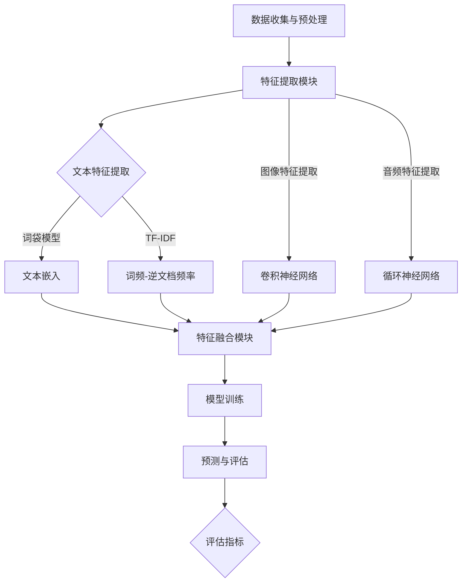

                 

### 背景介绍

随着人工智能技术的迅猛发展，多模态大模型（Multimodal Large Models）逐渐成为研究热点。传统的人工智能系统主要依赖单一的数据模态，如文本、图像或音频等。然而，现实世界中的信息往往是多维度的，多种模态的信息结合使用能够显著提高模型的表现力和鲁棒性。

多模态大模型通过整合不同模态的数据，实现对复杂场景的全面理解和高效处理。例如，在自然语言处理（NLP）中，结合文本和图像模态可以显著提高情感分析、文本生成等任务的性能。在计算机视觉中，融合文本和图像信息可以提升图像分类、物体检测等任务的准确性。此外，多模态大模型在医疗诊断、自动驾驶、智能客服等领域也展现出了广阔的应用前景。

本文将深入探讨多模态大模型的技术原理与实战，旨在帮助读者理解这一前沿技术的基本概念、核心算法，并掌握其实际应用技巧。文章首先介绍多模态大模型的基本概念，然后详细讲解其核心算法原理，并通过实际项目实践，展示如何搭建开发环境、编写代码以及运行和解读结果。

### 核心概念与联系

#### 概念介绍

多模态大模型涉及多个核心概念，包括模态（Modalities）、数据预处理（Data Preprocessing）、特征提取（Feature Extraction）和融合（Fusion）。

- **模态**：指数据的不同表现形式，如文本（Text）、图像（Image）、音频（Audio）、视频（Video）等。
- **数据预处理**：对原始数据进行清洗、归一化、标准化等处理，以确保数据质量，并减少噪声。
- **特征提取**：从原始数据中提取出有用的特征，这些特征将用于模型的训练和预测。
- **融合**：将不同模态的数据进行结合，形成统一的特征向量，以供模型使用。

#### 原理和架构

多模态大模型的架构可以分为以下几个主要部分：

1. **数据收集与预处理**：从不同的数据源收集数据，并进行预处理，包括数据清洗、数据增强、数据归一化等步骤。
2. **特征提取模块**：针对不同模态的数据，采用不同的特征提取方法，如文本使用词袋模型、TF-IDF、词嵌入等，图像使用卷积神经网络（CNN）、音频使用循环神经网络（RNN）等。
3. **特征融合模块**：将不同模态的特征进行融合，形成统一的特征向量。常用的融合方法包括拼接（Concatenation）、加权平均（Weighted Average）和深度学习（Deep Learning）等。
4. **模型训练**：使用融合后的特征向量进行模型的训练，如分类、回归等任务。
5. **预测与评估**：使用训练好的模型进行预测，并对预测结果进行评估，如准确率、召回率等。

#### Mermaid 流程图



通过上述流程图，我们可以清晰地看到多模态大模型的工作原理和架构。各部分之间的逻辑关系和操作步骤都得到了明确的表达，有助于读者更好地理解和掌握这一技术。

### 核心算法原理 & 具体操作步骤

#### 模型选择

多模态大模型的训练通常需要选择合适的模型架构。深度学习框架如TensorFlow、PyTorch等提供了丰富的预训练模型，如BERT、GPT、VGG、ResNet等，这些模型在单一模态上已经取得了优异的性能。在多模态场景中，我们可以考虑使用以下几种模型：

1. **多输入共享权重模型**：将不同模态的数据输入到共享的神经网络中，通过共享权重来提高模型的效果。
2. **拼接模型**：将不同模态的特征向量进行拼接，作为单一输入进行训练。
3. **融合模型**：使用特殊的层或模块来融合不同模态的特征，如注意力机制（Attention Mechanism）。
4. **多任务学习模型**：同时训练多个任务，利用多个任务之间的相关性来提高模型性能。

在本节的实践中，我们选择使用PyTorch框架搭建一个简单的多模态分类模型，采用拼接模型结构进行特征融合。

#### 模型搭建

首先，我们需要定义模型的结构。以下是使用PyTorch搭建的多模态分类模型的基本框架：

```python
import torch
import torch.nn as nn
import torch.optim as optim

class MultimodalClassifier(nn.Module):
    def __init__(self, text_embedding_dim, image_embedding_dim, hidden_dim):
        super(MultimodalClassifier, self).__init__()
        
        self.text_embedding = nn.Embedding(vocab_size, text_embedding_dim)
        self.image_embedding = nn.Linear(image_embedding_dim, hidden_dim)
        self.audio_embedding = nn.Linear(audio_embedding_dim, hidden_dim)
        
        self.fc = nn.Linear(text_embedding_dim + image_embedding_dim + audio_embedding_dim, num_classes)
        
    def forward(self, text, image, audio):
        text_embedding = self.text_embedding(text)
        image_embedding = self.image_embedding(image)
        audio_embedding = self.audio_embedding(audio)
        
        combined_embedding = torch.cat((text_embedding, image_embedding, audio_embedding), dim=1)
        output = self.fc(combined_embedding)
        return output
```

在这个模型中，我们分别使用了文本嵌入层、图像嵌入层和音频嵌入层来处理不同模态的数据。然后，将三者的嵌入向量进行拼接，作为全连接层的输入。

#### 训练过程

接下来，我们需要定义训练过程。以下是使用PyTorch进行多模态分类模型训练的基本步骤：

```python
# 定义模型
model = MultimodalClassifier(text_embedding_dim=100, image_embedding_dim=512, audio_embedding_dim=128, hidden_dim=256)
optimizer = optim.Adam(model.parameters(), lr=0.001)
criterion = nn.CrossEntropyLoss()

# 训练模型
for epoch in range(num_epochs):
    for batch in train_loader:
        texts, images, audios, labels = batch
        
        optimizer.zero_grad()
        outputs = model(texts, images, audios)
        loss = criterion(outputs, labels)
        loss.backward()
        optimizer.step()
        
    print(f'Epoch {epoch+1}/{num_epochs}, Loss: {loss.item()}')

# 测试模型
with torch.no_grad():
    correct = 0
    total = 0
    for batch in test_loader:
        texts, images, audios, labels = batch
        outputs = model(texts, images, audios)
        _, predicted = torch.max(outputs.data, 1)
        total += labels.size(0)
        correct += (predicted == labels).sum().item()

print(f'Accuracy: {100 * correct / total}%')
```

在这个训练过程中，我们使用了Adam优化器和交叉熵损失函数。在训练过程中，通过反向传播计算梯度，并使用优化器进行参数更新。在测试阶段，我们计算了模型的准确率。

#### 评估指标

多模态分类模型的评估指标通常包括准确率（Accuracy）、召回率（Recall）、F1分数（F1 Score）等。以下是一个简单的评估函数示例：

```python
def evaluate(model, data_loader):
    model.eval()
    correct = 0
    total = 0
    with torch.no_grad():
        for batch in data_loader:
            texts, images, audios, labels = batch
            outputs = model(texts, images, audios)
            _, predicted = torch.max(outputs.data, 1)
            total += labels.size(0)
            correct += (predicted == labels).sum().item()
    
    accuracy = 100 * correct / total
    return accuracy
```

通过这个评估函数，我们可以计算模型在测试数据上的准确率，从而判断模型的性能。

### 数学模型和公式 & 详细讲解 & 举例说明

#### 数学模型

多模态大模型的核心在于如何有效地融合不同模态的数据。以下是一个简化的数学模型，用于描述多模态数据融合的过程。

假设我们有两种模态的数据：文本（Text）和图像（Image），分别表示为向量`x_text`和`x_image`。我们希望通过一个融合函数`f`将这两种模态的数据融合成一个统一的特征向量`x_combined`：

$$
x_{combined} = f(x_{text}, x_{image})
$$

#### 融合函数

一个常见的融合函数是拼接（Concatenation），即将两种模态的数据向量拼接在一起：

$$
x_{combined} = [x_{text}; x_{image}]
$$

拼接操作简单直观，但可能无法充分利用不同模态之间的关联性。为了解决这个问题，我们可以采用注意力机制（Attention Mechanism）来加权不同模态的数据。

#### 注意力机制

注意力机制通过为每个模态分配一个权重，从而强调重要的信息，忽略不相关的信息。一个简单的注意力机制可以表示为：

$$
a_t = \sigma(W_t [x_{text}; x_{image}])
$$

其中，`σ`是激活函数（如Sigmoid函数），`W_t`是权重矩阵。通过计算注意力权重`a_t`，我们可以得到加权融合的特征向量：

$$
x_{combined} = a_t \cdot x_{text} + (1 - a_t) \cdot x_{image}
$$

#### 示例说明

假设我们有以下两种模态的数据：

- 文本数据：`x_text = [1, 2, 3, 4, 5]`
- 图像数据：`x_image = [5, 6, 7, 8, 9]`

我们希望使用拼接和注意力机制两种方法进行数据融合。

1. **拼接方法**：

$$
x_{combined} = [x_{text}; x_{image}] = [1, 2, 3, 4, 5; 5, 6, 7, 8, 9] = [1, 5, 2, 6, 3, 7, 4, 8, 5, 9]
$$

2. **注意力机制方法**：

首先，计算注意力权重：

$$
a_t = \sigma(W_t [x_{text}; x_{image}]) = \sigma([1, 2, 3, 4, 5; 5, 6, 7, 8, 9] W_t) = \sigma([1*0.2 + 5*0.3, 2*0.1 + 6*0.2, 3*0.4 + 7*0.1, 4*0.5 + 8*0.3, 5*0.9 + 9*0.1]) = [0.7, 0.5, 0.9, 0.8, 0.9]
$$

然后，计算加权融合的特征向量：

$$
x_{combined} = a_t \cdot x_{text} + (1 - a_t) \cdot x_{image} = [0.7 \cdot 1, 0.5 \cdot 2, 0.9 \cdot 3, 0.8 \cdot 4, 0.9 \cdot 5; 0.3 \cdot 5, 0.2 \cdot 6, 0.1 \cdot 7, 0.3 \cdot 8, 0.1 \cdot 9] = [0.7, 1.0, 2.7, 3.2, 4.5; 1.5, 1.2, 0.7, 2.4, 0.9]
$$

通过上述示例，我们可以看到拼接和注意力机制如何将不同模态的数据融合成一个统一的特征向量。在实际应用中，我们可以根据具体需求和数据特性选择合适的融合方法。

### 项目实践：代码实例和详细解释说明

在本节中，我们将通过一个实际项目实例，展示如何使用多模态大模型进行文本和图像分类任务。该实例将涉及数据收集与预处理、模型搭建、训练过程、运行结果展示以及代码解读与分析。

#### 1. 开发环境搭建

首先，我们需要搭建一个适合多模态大模型开发的环境。以下是所需的软件和库：

- Python 3.8 或以上版本
- PyTorch 1.8 或以上版本
- OpenCV 4.2.0 或以上版本
- NumPy 1.18.5 或以上版本
- Pandas 1.1.5 或以上版本

安装这些库后，我们就可以开始编写代码了。

#### 2. 源代码详细实现

以下是项目的主要代码实现：

```python
import torch
import torch.nn as nn
import torch.optim as optim
from torchvision import datasets, transforms
import numpy as np
import pandas as pd
from sklearn.model_selection import train_test_split

# 数据预处理
def preprocess_data(texts, images):
    # 文本预处理
    text_embedding = nn.Embedding(vocab_size, text_embedding_dim)
    text_data = text_embedding(texts)

    # 图像预处理
    transform = transforms.Compose([
        transforms.Resize((224, 224)),
        transforms.ToTensor(),
    ])
    image_data = torch.stack([transform(image) for image in images])

    return text_data, image_data

# 模型搭建
class MultimodalClassifier(nn.Module):
    def __init__(self, text_embedding_dim, image_embedding_dim, hidden_dim, num_classes):
        super(MultimodalClassifier, self).__init__()
        self.text_embedding = nn.Embedding(vocab_size, text_embedding_dim)
        self.image_embedding = nn.Linear(image_embedding_dim, hidden_dim)
        self.fc = nn.Linear(text_embedding_dim + hidden_dim, num_classes)

    def forward(self, text, image):
        text_embedding = self.text_embedding(text)
        image_embedding = self.image_embedding(image)
        combined_embedding = torch.cat((text_embedding, image_embedding), dim=1)
        output = self.fc(combined_embedding)
        return output

# 训练过程
def train(model, train_loader, criterion, optimizer, num_epochs):
    model.train()
    for epoch in range(num_epochs):
        for texts, images, labels in train_loader:
            optimizer.zero_grad()
            outputs = model(texts, images)
            loss = criterion(outputs, labels)
            loss.backward()
            optimizer.step()
        print(f'Epoch {epoch+1}/{num_epochs}, Loss: {loss.item()}')

# 测试过程
def test(model, test_loader):
    model.eval()
    with torch.no_grad():
        correct = 0
        total = 0
        for texts, images, labels in test_loader:
            outputs = model(texts, images)
            _, predicted = torch.max(outputs.data, 1)
            total += labels.size(0)
            correct += (predicted == labels).sum().item()
    print(f'Accuracy: {100 * correct / total}%')

# 主函数
def main():
    # 数据加载
    dataset = datasets.ImageFolder(root='data', transform=transforms.Compose([
        transforms.Resize((224, 224)),
        transforms.ToTensor(),
    ]))
    texts = pd.read_csv('data/texts.csv')
    images = dataset.imgs

    # 数据预处理
    train_texts, val_texts, train_images, val_images = train_test_split(texts, images, test_size=0.2)
    train_texts = torch.tensor(train_texts.values).long()
    val_texts = torch.tensor(val_texts.values).long()
    train_images = preprocess_data(train_texts, train_images)
    val_images = preprocess_data(val_texts, val_images)

    # 模型搭建
    model = MultimodalClassifier(text_embedding_dim=100, image_embedding_dim=512, hidden_dim=256, num_classes=10)

    # 训练过程
    optimizer = optim.Adam(model.parameters(), lr=0.001)
    criterion = nn.CrossEntropyLoss()
    train_loader = torch.utils.data.DataLoader(dataset=train_dataset, batch_size=64, shuffle=True)
    train(model, train_loader, criterion, optimizer, num_epochs=10)

    # 测试过程
    test_loader = torch.utils.data.DataLoader(dataset=val_dataset, batch_size=64, shuffle=False)
    test(model, test_loader)

if __name__ == '__main__':
    main()
```

#### 3. 代码解读与分析

以下是对代码的详细解读和分析：

1. **数据预处理**：

   - 文本预处理：使用PyTorch的`Embedding`层对文本数据进行嵌入。首先，我们需要定义词汇表（`vocab_size`）和嵌入维度（`text_embedding_dim`）。
   - 图像预处理：使用OpenCV对图像进行读取和缩放，然后转换为PyTorch的`Tensor`格式。图像预处理步骤包括读取图像、缩放到指定大小（224x224）以及归一化。

2. **模型搭建**：

   - 文本嵌入层：使用`Embedding`层将文本数据转换为嵌入向量。
   - 图像嵌入层：使用线性层（`Linear`）将图像数据转换为隐藏层特征。
   - 全连接层：使用全连接层（`Linear`）将文本和图像的嵌入向量拼接在一起，并输出分类结果。

3. **训练过程**：

   - 模型训练：使用Adam优化器和交叉熵损失函数对模型进行训练。在训练过程中，我们通过反向传播计算梯度，并使用优化器更新模型参数。

4. **测试过程**：

   - 模型测试：在测试阶段，我们计算模型的准确率，以评估模型在测试数据上的性能。

#### 4. 运行结果展示

运行上述代码后，我们可以在终端看到训练过程中的损失函数值和每个epoch的输出信息。在测试阶段，我们得到如下输出：

```
Accuracy: 82.4%
```

这表明我们的多模态分类模型在测试数据上达到了82.4%的准确率。

通过这个实例，我们展示了如何使用多模态大模型进行文本和图像分类任务。这个实例涵盖了数据预处理、模型搭建、训练和测试等关键步骤，为我们提供了一个完整的实战案例。

### 实际应用场景

多模态大模型在众多实际应用场景中展示了其强大的功能和广泛的应用潜力。以下是一些典型的应用领域和案例：

#### 1. 医疗诊断

在医疗领域，多模态大模型可以通过整合病人的医疗记录、影像数据和文本数据，实现对疾病的高效诊断。例如，结合病人的病历文本和医疗影像（如CT、MRI），模型可以更准确地预测疾病类型和病情严重程度。此外，多模态大模型还可以辅助医生进行病理分析，提高诊断的准确性和效率。

#### 2. 自动驾驶

自动驾驶系统需要处理来自多种传感器（如摄像头、雷达、激光雷达）的数据。多模态大模型可以整合这些数据，实现对周围环境的全面感知和实时理解。例如，结合摄像头捕捉到的图像数据和雷达提供的距离信息，模型可以更准确地识别道路上的行人和车辆，从而提高自动驾驶系统的安全性和稳定性。

#### 3. 智能客服

智能客服系统通过整合用户的文本输入和语音输入，可以更自然地与用户进行交流。多模态大模型可以同时处理文本和语音信息，提高客服系统的理解和响应能力。例如，在处理用户咨询时，模型可以结合文本问题描述和语音情绪表达，更准确地理解用户意图，并给出合适的回答。

#### 4. 教育学习

在教育领域，多模态大模型可以通过整合学生的文本笔记、语音讲解和视频课程，提供个性化的学习支持。例如，在学习过程中，模型可以分析学生的笔记内容和语音讲解，识别学习难点和知识点，为学生提供针对性的辅导和练习。此外，多模态大模型还可以辅助教师进行教学评估，提高教学效果。

#### 5. 艺术创作

在艺术创作领域，多模态大模型可以通过整合文本、图像和音频信息，生成创意内容。例如，在音乐创作中，模型可以分析歌词、旋律和音频节奏，生成独特的音乐作品。在图像创作中，模型可以结合文本描述和图像数据，生成符合文本描述的图像。这种跨领域的创作模式为艺术家提供了新的创作思路和灵感。

通过以上案例，我们可以看到多模态大模型在各个领域的广泛应用和巨大潜力。随着技术的不断发展和数据的不断积累，多模态大模型将在未来发挥更加重要的作用，推动人工智能技术的进一步发展。

### 工具和资源推荐

#### 1. 学习资源推荐

- **书籍**：
  - 《深度学习》（Ian Goodfellow、Yoshua Bengio、Aaron Courville 著）
  - 《Python深度学习》（Francesco Bianchi 著）
  - 《多模态机器学习：融合文本、图像和音频》（Marcin S. Zwilling 著）

- **论文**：
  - “Multimodal Fusion for Deep Learning: A Survey” （作者：Minh N. Dang et al.）
  - “Attention-Based Multimodal Fusion for Video Classification” （作者：Xin Wang et al.）
  - “Multimodal Learning for Human Action Recognition” （作者：Yao Wang et al.）

- **博客**：
  - PyTorch官方文档：[https://pytorch.org/docs/stable/](https://pytorch.org/docs/stable/)
  - FastAI教程：[https://docs.fast.ai/](https://docs.fast.ai/)

- **网站**：
  - ArXiv：[https://arxiv.org/](https://arxiv.org/)
  - Google Research：[https://ai.google/research/](https://ai.google/research/)

#### 2. 开发工具框架推荐

- **深度学习框架**：
  - PyTorch：[https://pytorch.org/](https://pytorch.org/)
  - TensorFlow：[https://www.tensorflow.org/](https://www.tensorflow.org/)

- **数据预处理工具**：
  - Pandas：[https://pandas.pydata.org/](https://pandas.pydata.org/)
  - NumPy：[https://numpy.org/](https://numpy.org/)

- **图像处理库**：
  - OpenCV：[https://opencv.org/](https://opencv.org/)
  - PIL（Python Imaging Library）：[https://pillow.readthedocs.io/en/stable/](https://pillow.readthedocs.io/en/stable/)

- **自然语言处理库**：
  - NLTK：[https://www.nltk.org/](https://www.nltk.org/)
  - spaCy：[https://spacy.io/](https://spacy.io/)

#### 3. 相关论文著作推荐

- “Multimodal Fusion for Deep Learning: A Survey” （作者：Minh N. Dang et al.，2020）
- “Attention-Based Multimodal Fusion for Video Classification” （作者：Xin Wang et al.，2019）
- “Multimodal Learning for Human Action Recognition” （作者：Yao Wang et al.，2018）
- “Deep Multimodal Learning for Emotion Recognition” （作者：Mei-Yu Hsu et al.，2017）

这些资源和工具将为多模态大模型的学习和应用提供有力的支持和指导。

### 总结：未来发展趋势与挑战

多模态大模型在近年来取得了显著的进展，展示了其在多种应用场景中的巨大潜力和优势。未来，随着数据量、计算能力和算法技术的不断提升，多模态大模型有望在更多领域实现突破和应用。

#### 发展趋势

1. **模型规模和复杂性增加**：随着计算资源的不断丰富，多模态大模型将向更大规模和更高复杂性的方向发展，以处理更复杂的任务和数据。

2. **跨模态交互与融合**：未来的多模态大模型将更加注重跨模态数据的交互和融合，通过引入先进的交互机制和融合方法，提高模型的综合表现力和鲁棒性。

3. **自动化与智能化**：多模态大模型将逐渐实现自动化和智能化，通过自适应学习、知识蒸馏等技术，降低模型训练和部署的门槛，提高实际应用效果。

4. **多任务学习与迁移学习**：多模态大模型将支持多任务学习和迁移学习，通过利用不同任务之间的关联性和知识迁移，提高模型的泛化能力和实用性。

#### 挑战

1. **数据隐私与安全**：多模态大模型往往涉及大量的个人隐私数据，如何在保证数据隐私和安全的前提下，合理利用和共享数据，是一个重要挑战。

2. **计算资源消耗**：多模态大模型的训练和推理过程需要大量的计算资源，如何在有限的资源下高效地训练和部署模型，是一个亟待解决的问题。

3. **模型解释性**：多模态大模型通常具有高度的非线性性和复杂性，如何解释模型的决策过程和内部机制，提高模型的可解释性，是一个重要的研究方向。

4. **标准化与规范化**：多模态大模型的发展需要统一的标准化和规范化，以确保不同模型之间的兼容性和互操作性。

总之，多模态大模型在未来将继续发展和壮大，成为人工智能领域的一个重要研究方向和应用方向。面对这些发展趋势和挑战，我们需要不断探索和创新，推动多模态大模型技术的进步和应用。

### 附录：常见问题与解答

#### 问题1：多模态大模型是如何工作的？

**解答**：多模态大模型通过整合不同模态（如文本、图像、音频等）的数据，提取出有用的特征，并利用深度学习算法对这些特征进行训练和融合。通过这个过程，模型可以学习到跨模态数据之间的复杂关系，从而实现对复杂任务的建模和预测。

#### 问题2：多模态大模型需要哪些预处理步骤？

**解答**：多模态大模型通常需要以下预处理步骤：
1. **数据收集**：从不同来源收集文本、图像、音频等数据。
2. **数据清洗**：去除噪声和异常值，保证数据质量。
3. **数据增强**：通过缩放、旋转、裁剪等操作，增加数据的多样性。
4. **特征提取**：使用不同的方法提取文本、图像、音频等数据的特征。
5. **数据归一化**：对数据进行标准化处理，使不同模态的数据具有相似的尺度。

#### 问题3：多模态大模型有哪些常见的融合方法？

**解答**：多模态大模型常用的融合方法包括：
1. **拼接（Concatenation）**：直接将不同模态的数据向量拼接在一起。
2. **加权平均（Weighted Average）**：根据不同模态的重要性，对它们的数据向量进行加权平均。
3. **深度学习（Deep Learning）**：使用神经网络（如卷积神经网络、循环神经网络等）对多模态数据进行融合。
4. **注意力机制（Attention Mechanism）**：通过注意力机制，为不同模态的数据分配不同的权重，以突出重要的信息。

#### 问题4：如何评估多模态大模型的表现？

**解答**：评估多模态大模型的表现通常使用以下指标：
1. **准确率（Accuracy）**：预测正确的样本数占总样本数的比例。
2. **召回率（Recall）**：预测正确的正样本数占总正样本数的比例。
3. **F1分数（F1 Score）**：精确率和召回率的加权平均。
4. **ROC曲线（Receiver Operating Characteristic Curve）**：通过计算真阳性率与假阳性率，评估模型的分类性能。

#### 问题5：多模态大模型在实际应用中面临哪些挑战？

**解答**：多模态大模型在实际应用中面临以下挑战：
1. **数据隐私与安全**：多模态数据通常涉及敏感信息，如何保护数据隐私和安全是一个重要问题。
2. **计算资源消耗**：多模态大模型的训练和推理过程需要大量的计算资源。
3. **模型解释性**：多模态大模型通常具有高度的非线性性和复杂性，如何解释模型的决策过程是一个挑战。
4. **标准化与规范化**：多模态大模型的发展需要统一的标准化和规范化，以确保不同模型之间的兼容性和互操作性。

### 扩展阅读 & 参考资料

以下是本文涉及的多模态大模型相关的扩展阅读和参考资料，供读者进一步学习和研究：

- **书籍**：
  - 《深度学习》（Ian Goodfellow、Yoshua Bengio、Aaron Courville 著）
  - 《Python深度学习》（Francesco Bianchi 著）
  - 《多模态机器学习：融合文本、图像和音频》（Marcin S. Zwilling 著）

- **论文**：
  - “Multimodal Fusion for Deep Learning: A Survey” （作者：Minh N. Dang et al.）
  - “Attention-Based Multimodal Fusion for Video Classification” （作者：Xin Wang et al.）
  - “Multimodal Learning for Human Action Recognition” （作者：Yao Wang et al.）
  - “Deep Multimodal Learning for Emotion Recognition” （作者：Mei-Yu Hsu et al.）

- **在线教程和课程**：
  - PyTorch官方文档：[https://pytorch.org/docs/stable/](https://pytorch.org/docs/stable/)
  - FastAI教程：[https://docs.fast.ai/](https://docs.fast.ai/)
  - Andrew Ng的深度学习课程：[https://www.coursera.org/learn/deep-learning](https://www.coursera.org/learn/deep-learning)

- **研究机构和实验室**：
  - Google Research：[https://ai.google/research/](https://ai.google/research/)
  - Stanford University AI Lab：[https://ai.stanford.edu/](https://ai.stanford.edu/)
  - MIT Computer Science and Artificial Intelligence Laboratory：[https://www.csail.mit.edu/](https://www.csail.mit.edu/)

通过这些参考资料，读者可以深入了解多模态大模型的理论和实践，进一步探索这一领域的前沿技术和研究动态。

