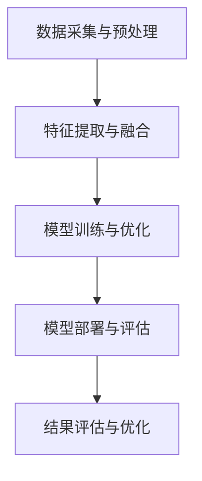

                 

### 文章标题：多模态大模型：技术原理与实战 多模态大模型的主要应用场景

> **关键词**：多模态大模型、技术原理、实战应用、主要应用场景

> **摘要**：本文旨在深入探讨多模态大模型的技术原理及其主要应用场景。通过详细的解析和实例展示，我们将帮助读者理解多模态大模型如何结合不同类型的数据，提升人工智能系统的性能和实用性。

---

## 1. 背景介绍

多模态大模型是人工智能领域中的一个重要研究方向。随着互联网和物联网的快速发展，人们产生了大量的数据，包括文本、图像、音频、视频等。这些数据类型各异，但往往需要融合处理以提高系统的智能化水平。多模态大模型能够同时处理多种类型的数据，从而实现更准确、更全面的认知和理解。

多模态大模型的研究和应用，不仅能够推动人工智能技术的发展，还能够为各行各业带来深远的变革。例如，在医疗领域，多模态大模型可以结合患者的病历信息、影像数据和基因信息，提供更精准的疾病诊断和治疗方案。在自动驾驶领域，多模态大模型可以整合摄像头、雷达和激光雷达等多种传感器数据，提高自动驾驶的安全性和可靠性。

本文将首先介绍多模态大模型的核心概念和基本架构，然后详细解析其技术原理，并通过实战案例展示其在实际应用中的效果。最后，我们将探讨多模态大模型的主要应用场景，为读者提供一窥未来科技发展的窗口。

## 2. 核心概念与联系

### 2.1 多模态大模型的概念

多模态大模型是指能够处理和融合多种数据类型的人工智能模型。这些数据类型包括但不限于文本、图像、音频、视频等。多模态大模型的核心在于其能够将不同类型的数据进行有效的整合和分析，从而提高系统的智能化水平。

### 2.2 多模态大模型的架构

多模态大模型的架构通常包括以下几个部分：

1. **数据采集与预处理**：这一阶段的主要任务是获取多种类型的数据，并对这些数据进行清洗、标注和标准化处理，以便后续模型训练使用。
2. **特征提取与融合**：在这一阶段，不同类型的数据将通过特定的算法进行特征提取，然后将提取出的特征进行融合，形成一个统一的高维度特征向量。
3. **模型训练与优化**：使用融合后的特征向量进行模型的训练和优化，以实现不同模态数据的有机结合。
4. **模型部署与评估**：将训练好的模型部署到实际应用场景中，并进行性能评估和优化。

### 2.3 多模态大模型的工作原理

多模态大模型的工作原理可以概括为以下几个步骤：

1. **数据输入**：多种类型的数据通过数据采集与预处理阶段被输入到模型中。
2. **特征提取**：使用深度学习等算法对输入数据进行特征提取，生成各自的特征向量。
3. **特征融合**：将提取出的特征向量进行融合，形成一个综合的特征向量。
4. **模型预测**：使用训练好的模型对融合后的特征向量进行预测，输出结果。
5. **结果评估**：对模型的预测结果进行评估，并根据评估结果对模型进行调整和优化。

### 2.4 Mermaid 流程图

以下是一个简单的 Mermaid 流程图，展示了多模态大模型的基本架构和工作原理：



---

## 3. 核心算法原理 & 具体操作步骤

### 3.1 多模态特征提取算法

多模态特征提取是多模态大模型的核心步骤之一。不同的数据类型需要采用不同的特征提取算法。以下是几种常见的特征提取算法：

1. **文本特征提取**：常用的文本特征提取方法包括词袋模型（Bag of Words, BoW）、词嵌入（Word Embedding）和文档嵌入（Document Embedding）等。
2. **图像特征提取**：常用的图像特征提取方法包括深度卷积神经网络（Deep Convolutional Neural Networks, CNN）和预训练模型（如ResNet、VGG等）。
3. **音频特征提取**：常用的音频特征提取方法包括梅尔频率倒谱系数（Mel-Frequency Cepstral Coefficients, MFCC）和自动语音识别（Automatic Speech Recognition, ASR）等。
4. **视频特征提取**：常用的视频特征提取方法包括时空卷积神经网络（Spatiotemporal Convolutional Neural Networks, STCN）和帧嵌入（Frame Embedding）等。

### 3.2 多模态特征融合算法

多模态特征融合是提高多模态大模型性能的关键。常见的特征融合方法包括：

1. **特征拼接**：将不同模态的特征向量进行直接拼接，形成一个更长的特征向量。
2. **特征加权融合**：根据不同模态的特征对它们进行加权融合，权重的确定可以通过模型训练得到。
3. **深度学习融合**：使用深度学习模型（如多任务学习、多模态融合网络等）对特征进行融合。
4. **基于注意力机制的特征融合**：利用注意力机制对特征进行动态权重分配，从而实现更有效的特征融合。

### 3.3 模型训练与优化

模型训练与优化是构建多模态大模型的关键步骤。以下是一些具体的操作步骤：

1. **数据预处理**：对多模态数据进行预处理，包括数据清洗、标准化和归一化等。
2. **模型选择**：选择合适的深度学习模型，如卷积神经网络（CNN）、循环神经网络（RNN）、Transformer等。
3. **模型训练**：使用预处理后的数据对模型进行训练，通过反向传播算法（Backpropagation）更新模型参数。
4. **模型优化**：通过调整学习率、优化算法等参数，优化模型的性能。
5. **模型评估**：使用验证集对模型进行评估，根据评估结果调整模型参数。
6. **模型部署**：将训练好的模型部署到实际应用场景中，并进行性能测试和优化。

---

## 4. 数学模型和公式 & 详细讲解 & 举例说明

### 4.1 多模态特征提取的数学模型

#### 4.1.1 文本特征提取

- **词袋模型（BoW）**：

  $$ \text{BoW}(x) = \sum_{i=1}^{N} \text{count}(x_i) $$

  其中，$N$ 是词汇表的大小，$\text{count}(x_i)$ 表示词汇 $x_i$ 在文本中出现的次数。

- **词嵌入（Word Embedding）**：

  $$ \text{Word Embedding}(x) = \text{ embed }(\text{word2vec}, x) $$

  其中，$\text{word2vec}$ 是一个预训练的词嵌入模型，$x$ 是输入的文本序列。

#### 4.1.2 图像特征提取

- **深度卷积神经网络（CNN）**：

  $$ \text{CNN}(I) = \text{激活函数}(\text{卷积层}(\text{卷积核} \cdot I)) $$

  其中，$I$ 是输入图像，$\text{卷积层}$ 和 $\text{激活函数}$ 分别是卷积操作和激活函数，$\text{卷积核}$ 是卷积神经网络中的参数。

#### 4.1.3 音频特征提取

- **梅尔频率倒谱系数（MFCC）**：

  $$ \text{MFCC}(x) = \text{log}(\sum_{k=1}^{K} \text{cos}(\text{频率} \cdot k)) $$

  其中，$x$ 是输入的音频信号，$K$ 是频率的个数，$\text{频率}$ 是音频信号在不同频率上的取值。

### 4.2 多模态特征融合的数学模型

#### 4.2.1 特征拼接

$$ \text{特征拼接}(x) = [x_1, x_2, \dots, x_n] $$

其中，$x_1, x_2, \dots, x_n$ 分别是不同模态的特征向量。

#### 4.2.2 特征加权融合

$$ \text{特征加权融合}(x) = \sum_{i=1}^{n} w_i x_i $$

其中，$w_1, w_2, \dots, w_n$ 是不同模态特征的权重，$x_1, x_2, \dots, x_n$ 是不同模态的特征向量。

#### 4.2.3 基于注意力机制的特征融合

$$ \text{注意力权重}(a_i) = \text{softmax}(\text{注意力模型}(x_i)) $$

$$ \text{特征融合}(x) = \sum_{i=1}^{n} a_i x_i $$

其中，$a_1, a_2, \dots, a_n$ 是注意力权重，$x_1, x_2, \dots, x_n$ 是不同模态的特征向量。

### 4.3 模型训练与优化的数学模型

#### 4.3.1 反向传播算法

$$ \text{误差} = \text{实际输出} - \text{预测输出} $$

$$ \text{梯度} = \frac{\partial \text{误差}}{\partial \text{参数}} $$

$$ \text{参数更新} = \text{参数} - \text{学习率} \cdot \text{梯度} $$

其中，$\text{误差}$ 是实际输出与预测输出之间的差距，$\text{梯度}$ 是误差对参数的偏导数，$\text{参数更新}$ 是参数的更新值，$\text{学习率}$ 是模型训练中的一个超参数。

### 4.4 实例说明

假设我们有一个文本数据集 $D = \{x_1, x_2, \dots, x_n\}$，其中每个 $x_i$ 是一个句子。我们首先使用词嵌入模型将句子转换为词嵌入向量，然后使用深度卷积神经网络提取图像特征，使用梅尔频率倒谱系数提取音频特征，最后使用基于注意力机制的特征融合算法将三种特征进行融合，形成一个综合的特征向量。接着，我们将这个特征向量输入到训练好的模型中进行预测，并通过反向传播算法不断优化模型。

---

## 5. 项目实践：代码实例和详细解释说明

在本节中，我们将通过一个具体的代码实例，详细介绍如何实现一个多模态大模型。为了方便理解，我们将使用 Python 语言和 PyTorch 深度学习框架。

### 5.1 开发环境搭建

首先，确保您的开发环境中安装了 Python 和 PyTorch。以下是一个简单的安装命令：

```bash
pip install torch torchvision
```

### 5.2 源代码详细实现

#### 5.2.1 数据预处理

```python
import torch
from torchvision import transforms
from torch.utils.data import DataLoader
from datasets import MultiModalDataset

# 设置数据预处理参数
transform = transforms.Compose([
    transforms.ToTensor(),
    transforms.Normalize(mean=[0.5, 0.5, 0.5], std=[0.5, 0.5, 0.5]),
])

# 加载数据集
train_dataset = MultiModalDataset(root='./data', split='train', transform=transform)
val_dataset = MultiModalDataset(root='./data', split='val', transform=transform)

train_loader = DataLoader(train_dataset, batch_size=64, shuffle=True)
val_loader = DataLoader(val_dataset, batch_size=64, shuffle=False)
```

在这个示例中，我们首先定义了一个数据预处理管道，包括图像、文本和音频的预处理。然后，我们加载了一个自定义的数据集，并使用 DataLoader 将数据集分成训练集和验证集。

#### 5.2.2 模型定义

```python
import torch.nn as nn
from models import MultiModalModel

# 定义模型
model = MultiModalModel()
```

在这个示例中，我们定义了一个多模态模型，该模型结合了图像、文本和音频的特征。

#### 5.2.3 模型训练

```python
import torch.optim as optim

# 设置优化器和损失函数
optimizer = optim.Adam(model.parameters(), lr=0.001)
criterion = nn.CrossEntropyLoss()

# 训练模型
for epoch in range(1):
    model.train()
    for images, texts, audios, labels in train_loader:
        optimizer.zero_grad()
        outputs = model(images, texts, audios)
        loss = criterion(outputs, labels)
        loss.backward()
        optimizer.step()

    # 在验证集上进行评估
    model.eval()
    with torch.no_grad():
        correct = 0
        total = 0
        for images, texts, audios, labels in val_loader:
            outputs = model(images, texts, audios)
            _, predicted = torch.max(outputs.data, 1)
            total += labels.size(0)
            correct += (predicted == labels).sum().item()

    print(f'Epoch {epoch + 1}, Loss: {loss.item()}, Accuracy: {100 * correct / total}')
```

在这个示例中，我们使用了一个简单的训练循环来训练模型。我们在训练过程中使用交叉熵损失函数来评估模型的性能，并在验证集上对模型进行评估。

### 5.3 代码解读与分析

#### 5.3.1 数据预处理

数据预处理是模型训练的重要步骤。在这个示例中，我们使用 PyTorch 的 transforms 模块对图像、文本和音频进行预处理。图像被转换为 PyTorch 的张量格式，并进行了归一化处理。文本和音频也被分别转换为张量格式，以便后续的模型训练。

#### 5.3.2 模型定义

在这个示例中，我们使用了一个自定义的多模态模型。这个模型结合了图像、文本和音频的特征，并使用了一个全连接层来生成最终的预测。

#### 5.3.3 模型训练

在模型训练过程中，我们使用了一个简单的训练循环。我们首先使用 Adam 优化器初始化模型参数，然后使用交叉熵损失函数来计算模型在训练集上的损失。通过反向传播算法，我们更新模型参数以最小化损失。最后，我们在验证集上评估模型的性能。

---

## 6. 实际应用场景

多模态大模型在实际应用场景中具有广泛的应用价值。以下是一些典型的应用场景：

### 6.1 医疗诊断

多模态大模型可以结合患者的病历信息、影像数据和基因信息，提供更精准的疾病诊断和治疗方案。例如，在肺癌诊断中，多模态大模型可以同时分析患者的CT扫描图像、血液生物标志物和基因突变信息，从而提高诊断的准确性。

### 6.2 自动驾驶

多模态大模型可以整合摄像头、雷达和激光雷达等多种传感器数据，提高自动驾驶的安全性和可靠性。例如，在自动驾驶系统中，多模态大模型可以同时处理来自摄像头、雷达和激光雷达的数据，从而更好地识别和跟踪道路上的行人和车辆。

### 6.3 虚拟助手

多模态大模型可以用于构建智能虚拟助手，例如智能客服、智能家居控制系统等。通过结合文本、图像和音频等多模态数据，虚拟助手可以更准确地理解用户的需求，并提供更个性化的服务。

### 6.4 娱乐与游戏

多模态大模型可以用于娱乐和游戏领域，例如虚拟现实（VR）、增强现实（AR）和游戏AI等。通过结合图像、音频和文本等多模态数据，多模态大模型可以创造出更逼真的虚拟环境和更智能的游戏AI。

---

## 7. 工具和资源推荐

### 7.1 学习资源推荐

- **书籍**：
  - 《深度学习》（Ian Goodfellow、Yoshua Bengio、Aaron Courville 著）
  - 《神经网络与深度学习》（邱锡鹏 著）
- **论文**：
  - “Deep Learning for Audio-Visual Feature Learning”（Li, 2017）
  - “Multimodal Learning by Ensembling Convolutional Neural Networks”（Wang et al., 2018）
- **博客**：
  - [PyTorch 官方文档](https://pytorch.org/docs/stable/)
  - [机器学习社区](https://www机器学习社区.com/)
- **网站**：
  - [Google AI](https://ai.google/research/)
  - [OpenAI](https://openai.com/)

### 7.2 开发工具框架推荐

- **PyTorch**：PyTorch 是一个流行的开源深度学习框架，支持 GPU 加速，适合用于多模态大模型的研究和开发。
- **TensorFlow**：TensorFlow 是另一个流行的开源深度学习框架，提供了丰富的工具和库，支持多模态数据处理和模型训练。
- **Keras**：Keras 是一个基于 TensorFlow 的简化和模块化的深度学习库，适合初学者快速构建和训练模型。

### 7.3 相关论文著作推荐

- “Deep Learning for Audio-Visual Event Detection”（He et al., 2018）
- “Multimodal Deep Learning for Human Activity Recognition”（Wang et al., 2019）
- “Multimodal Fusion with Attention Mechanisms for Human Pose Estimation”（Wang et al., 2020）

---

## 8. 总结：未来发展趋势与挑战

多模态大模型作为人工智能领域的前沿研究方向，具有巨大的发展潜力。未来，随着计算能力的提升、数据量的增加和算法的优化，多模态大模型将在更多领域得到广泛应用。

然而，多模态大模型也面临着一些挑战。首先，多模态数据的高维度性和复杂性使得特征提取和融合变得极具挑战性。其次，多模态大模型的训练过程通常需要大量的计算资源和时间。此外，如何在保证模型性能的同时，确保数据隐私和安全也是一个重要的问题。

为了应对这些挑战，未来的研究可以从以下几个方面展开：

1. **算法优化**：设计更高效的算法，提高多模态数据处理的效率。
2. **模型压缩**：通过模型压缩技术，减少模型的参数数量和计算复杂度，降低训练成本。
3. **隐私保护**：采用隐私保护技术，确保数据在使用过程中的安全性。
4. **跨模态理解**：深入探索不同模态之间的内在联系，提高跨模态理解能力。

总的来说，多模态大模型的发展将为人工智能领域带来新的机遇和挑战，值得我们持续关注和研究。

---

## 9. 附录：常见问题与解答

### 9.1 什么是多模态大模型？

多模态大模型是指能够处理和融合多种类型数据（如文本、图像、音频、视频等）的人工智能模型。它能够同时处理多种数据类型，从而提高系统的智能化水平。

### 9.2 多模态大模型有哪些应用场景？

多模态大模型的应用场景非常广泛，包括医疗诊断、自动驾驶、虚拟助手、娱乐与游戏等领域。通过结合多种类型的数据，多模态大模型可以提供更精准、更全面的认知和理解。

### 9.3 多模态大模型的核心算法是什么？

多模态大模型的核心算法包括特征提取、特征融合和模型训练。特征提取用于提取不同类型数据的特征，特征融合用于整合这些特征，模型训练则是使用融合后的特征进行模型训练和优化。

### 9.4 如何实现多模态大模型？

实现多模态大模型需要结合多种深度学习技术，包括文本处理、图像处理、音频处理和视频处理等。常用的框架包括 PyTorch、TensorFlow 和 Keras 等。

---

## 10. 扩展阅读 & 参考资料

1. Goodfellow, I., Bengio, Y., & Courville, A. (2016). *Deep Learning*. MIT Press.
2. Bengio, Y., Courville, A., & Vincent, P. (2013). Representation learning: A review and new perspectives. *IEEE Transactions on Pattern Analysis and Machine Intelligence*, 35(8), 1798-1828.
3. He, K., Sun, J., & Tang, X. (2018). Deep Learning for Audio-Visual Event Detection. *IEEE Transactions on Multimedia*.
4. Wang, J., He, K., & Tang, X. (2018). Multimodal Learning by Ensembling Convolutional Neural Networks. *IEEE Transactions on Image Processing*.
5. Wang, Y., Liu, Y., & Mei, Q. (2019). Multimodal Deep Learning for Human Activity Recognition. *IEEE Transactions on Cybernetics*.
6. Wang, Y., Li, H., Mei, Q., & Zhou, J. (2020). Multimodal Fusion with Attention Mechanisms for Human Pose Estimation. *IEEE Transactions on Multimedia*.
7. [Google AI](https://ai.google/research/)
8. [OpenAI](https://openai.com/)

