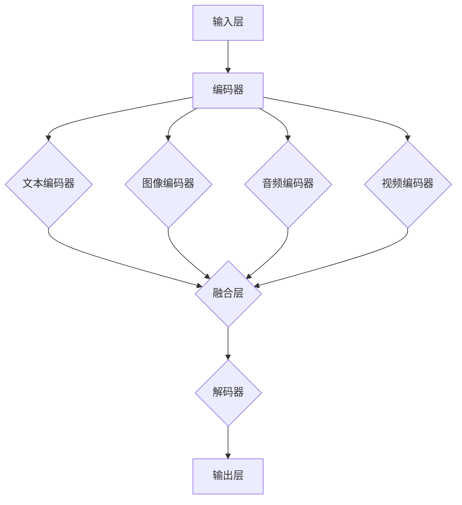

                 

### 1. 背景介绍

多模态大模型作为人工智能领域的重要研究方向，近年来受到了广泛关注。其核心思想是通过整合多种模态的数据，如文本、图像、音频和视频，构建出一个能够理解和处理不同类型信息的强大模型。这种模型在提高任务性能、拓展应用场景方面具有显著优势，成为当前人工智能研究的热点。

多模态大模型的发展背景可以追溯到上世纪90年代，那时计算机视觉和自然语言处理等领域的进展为多模态研究奠定了基础。随着深度学习技术的突破，多模态大模型的研究进入了快速发展阶段。近年来，神经网络架构的演进、大规模数据集的涌现以及计算资源的提升，进一步推动了多模态大模型的研究和应用。

在人工智能的众多应用中，多模态大模型展现出广泛的应用前景。例如，在图像识别任务中，结合文本描述可以显著提高识别准确率；在语音识别任务中，结合面部表情信息可以增强对用户情感的理解；在视频分析任务中，结合语音和文本信息可以提升对场景的全面理解。此外，多模态大模型还在医疗、金融、教育等多个领域展现出强大的潜力。

本文将首先介绍多模态大模型的核心概念，包括文本、图像、音频和视频等不同模态的数据类型及其处理方法。接着，我们将详细探讨多模态大模型的技术原理，包括数据融合、模型架构和训练方法。随后，本文将结合实际项目案例，展示多模态大模型的开发过程和具体实现。在此基础上，我们将分析多模态大模型在各个应用领域的实际应用场景，并推荐一些学习资源和开发工具。最后，本文将总结多模态大模型的发展趋势和面临的挑战，为未来研究提供启示。

通过本文的阅读，读者将全面了解多模态大模型的技术原理和应用，掌握其开发方法，并对这一领域的未来发展趋势有更深入的认识。

### 2. 核心概念与联系

多模态大模型的核心在于整合多种模态的数据，这些数据类型包括文本、图像、音频和视频等。每种模态都有其独特的数据特征和表示方法，而这些不同模态的数据如何有效融合，是构建多模态大模型的关键。

#### 2.1 文本数据

文本数据是自然语言处理（NLP）的核心，它包括文字、符号和语义信息。文本数据的表示方法通常采用词向量（如Word2Vec、GloVe）或转换器（如BERT、GPT）进行编码。词向量可以将文本中的每个单词映射为一个高维向量，而转换器则能够捕捉更深层次的语义信息。

#### 2.2 图像数据

图像数据是多模态大模型中的重要组成部分，它包含丰富的视觉信息。图像数据的表示方法通常包括像素级表示和区域级表示。像素级表示将图像视为一个像素矩阵，而区域级表示则通过卷积神经网络（CNN）提取图像中的特征。近年来，生成对抗网络（GAN）和自注意力机制等技术的应用，进一步提升了图像数据的表示能力。

#### 2.3 音频数据

音频数据包含声音、语音和音乐等信息，这些信息可以通过声学模型进行编码。常见的音频表示方法包括梅尔频谱图、滤波器组频谱和频谱图等。语音识别技术（如CTC、RNN、Transformer）在音频数据处理中发挥着重要作用。

#### 2.4 视频数据

视频数据是连续的图像序列，它包含动态信息。视频数据的表示方法通常包括帧级表示和视频级表示。帧级表示通过CNN提取每一帧的特征，而视频级表示则通过视频编码器（如RNN、LSTM、Transformer）捕捉视频的整体特征。

#### 2.5 数据融合

多模态大模型的核心在于如何有效融合这些不同模态的数据。数据融合的方法可以分为以下几类：

1. **独立处理：**每种模态的数据分别进行处理，然后合并结果。这种方法简单直观，但容易丢失模态间的关联信息。
2. **序列融合：**将不同模态的数据按时间顺序融合，如结合文本和语音序列。这种方法适用于连续时间信息的处理。
3. **空间融合：**将不同模态的数据在同一空间维度上融合，如结合图像和文本的嵌入向量。这种方法能够更好地捕捉模态间的空间关联。
4. **特征级融合：**在特征层面对不同模态的特征进行融合，如通过拼接、加权融合或多任务学习等方法。这种方法能够充分利用不同模态的特征信息。

#### 2.6 多模态大模型的架构

多模态大模型的架构通常包含以下几部分：

1. **输入层：**接收多种模态的数据输入，包括文本、图像、音频和视频等。
2. **编码器：**对每种模态的数据进行编码，提取特征。常见的编码器包括词向量编码器、卷积神经网络、声学模型和视频编码器等。
3. **融合层：**将不同模态的特征进行融合，采用序列融合、空间融合或特征级融合等方法。
4. **解码器：**对融合后的特征进行解码，生成任务所需的输出。常见的解码器包括循环神经网络、Transformer、卷积神经网络等。
5. **输出层：**根据具体任务输出结果，如分类、识别、生成等。

#### 2.7 Mermaid 流程图

为了更直观地展示多模态大模型的架构，我们可以使用Mermaid流程图进行描述：



通过上述介绍，我们可以看出多模态大模型是一个复杂的系统，涉及多种模态的数据处理和融合。掌握这些核心概念和联系，有助于我们更好地理解多模态大模型的工作原理和应用前景。

### 3. 核心算法原理 & 具体操作步骤

#### 3.1 数据处理

多模态大模型的构建首先需要对不同模态的数据进行处理。以下为不同模态数据的处理方法：

##### 3.1.1 文本数据

1. **文本预处理：**对文本数据进行清洗，去除停用词、标点符号和特殊字符。  
2. **词向量化：**使用Word2Vec、GloVe或BERT等词向量模型将文本转化为向量表示。  
3. **序列编码：**将文本序列编码为序列向量化表示。

##### 3.1.2 图像数据

1. **图像预处理：**对图像进行缩放、裁剪、增强等预处理操作，以提高模型的泛化能力。  
2. **特征提取：**使用卷积神经网络（CNN）提取图像特征。常见的CNN架构包括VGG、ResNet和Inception等。  
3. **特征降维：**对提取的图像特征进行降维，如使用池化层或全连接层。

##### 3.1.3 音频数据

1. **音频预处理：**对音频信号进行归一化、去噪等预处理操作。  
2. **声学模型：**使用声学模型（如隐马尔可夫模型HMM、循环神经网络RNN）提取音频特征。  
3. **特征降维：**对提取的音频特征进行降维，如使用池化层或全连接层。

##### 3.1.4 视频数据

1. **视频预处理：**对视频进行帧级预处理，如裁剪、缩放、增强等。  
2. **特征提取：**使用卷积神经网络（CNN）提取视频帧特征。  
3. **序列编码：**将视频帧特征编码为序列向量化表示。

#### 3.2 数据融合

数据处理完成后，需要对不同模态的数据进行融合。以下为常见的数据融合方法：

##### 3.2.1 独立处理

1. **编码：**对每种模态的数据分别编码，得到独立的特征向量。  
2. **融合：**将独立特征向量拼接在一起，形成一个多模态特征向量。  
3. **训练：**使用多模态特征向量进行模型训练。

##### 3.2.2 序列融合

1. **编码：**对每种模态的数据分别编码，得到独立的序列特征向量。  
2. **融合：**将独立序列特征向量按时间顺序拼接，形成一个多模态序列特征向量。  
3. **训练：**使用多模态序列特征向量进行模型训练。

##### 3.2.3 空间融合

1. **编码：**对每种模态的数据分别编码，得到独立的嵌入向量。  
2. **融合：**将独立嵌入向量在同一空间维度上拼接，形成一个多模态嵌入向量。  
3. **训练：**使用多模态嵌入向量进行模型训练。

##### 3.2.4 特征级融合

1. **编码：**对每种模态的数据分别编码，得到独立的特征向量。  
2. **融合：**使用拼接、加权融合或多任务学习等方法将独立特征向量进行融合。  
3. **训练：**使用融合后的特征向量进行模型训练。

#### 3.3 模型训练

多模态大模型的训练涉及多种技术，以下为常见的技术和方法：

##### 3.3.1 循环神经网络（RNN）

循环神经网络（RNN）是一种用于处理序列数据的神经网络。RNN通过递归连接来捕捉序列中的时间依赖关系。常见的RNN架构包括LSTM和GRU。

1. **LSTM（长短时记忆网络）：**LSTM通过引入记忆单元和门控机制来克服RNN的梯度消失问题。  
2. **GRU（门控循环单元）：**GRU是LSTM的简化版本，通过合并输入门和遗忘门来减少参数数量。

##### 3.3.2 Transformer

Transformer是一种基于自注意力机制的序列处理模型。它通过多头注意力机制和前馈神经网络来捕捉序列中的全局依赖关系。

1. **多头注意力：**多头注意力将序列中的每个元素与所有其他元素进行交互，并通过不同的权重进行加权融合。  
2. **编码器-解码器架构：**编码器和解码器分别处理输入序列和输出序列，通过注意力机制实现序列间的交互。

##### 3.3.3 多任务学习

多任务学习是一种同时训练多个相关任务的模型。通过共享底层特征表示，多任务学习可以提高模型的泛化能力和效率。

1. **任务共享：**将不同任务的特征表示进行共享，减少参数数量。  
2. **任务融合：**通过加权融合或拼接等策略将不同任务的输出进行整合。

#### 3.4 具体操作步骤

以下为多模态大模型的具体操作步骤：

1. **数据收集：**收集不同模态的数据，包括文本、图像、音频和视频等。  
2. **数据预处理：**对数据集进行预处理，包括文本清洗、图像增强、音频去噪等。  
3. **特征提取：**使用卷积神经网络、循环神经网络或Transformer等模型对每种模态的数据进行特征提取。  
4. **特征融合：**采用独立处理、序列融合、空间融合或特征级融合等方法将不同模态的特征进行融合。  
5. **模型训练：**使用融合后的特征向量进行模型训练，采用RNN、Transformer或多任务学习等技术。  
6. **模型评估：**对训练好的模型进行评估，包括准确率、召回率、F1值等指标。  
7. **模型部署：**将训练好的模型部署到实际应用场景中，如图像识别、语音识别或视频分析等。

通过以上步骤，我们可以构建一个多模态大模型，实现对多种模态数据的统一理解和处理。掌握这些核心算法原理和具体操作步骤，有助于我们更好地理解和应用多模态大模型。

#### 3.5 数学模型和公式 & 详细讲解 & 举例说明

多模态大模型的构建涉及多种数学模型和公式，以下将详细介绍其中一些关键的概念和公式，并通过具体例子进行解释。

##### 3.5.1 词向量模型

词向量模型是自然语言处理中的核心工具，以下以Word2Vec为例进行讲解。

**Word2Vec模型公式：**

$$
\text{Context}(w) = \left\{ w_{-2}, w_{-1}, w, w_{1}, w_{2} \right\}
$$

$$
\text{Loss} = \sum_{w \in \text{Context}(w)} \log p(w | w)
$$

其中，$\text{Context}(w)$表示单词$w$的上下文窗口，$p(w | w)$表示给定上下文窗口$\text{Context}(w)$下单词$w$的条件概率。

**举例说明：**

假设我们有一个上下文窗口大小为3的文本序列：

```
The quick brown fox jumps over the lazy dog.
```

我们可以将其表示为以下词向量序列：

```
[quick, brown, fox, jumps, over, lazy, dog]
```

接下来，我们计算每个词向量的损失：

$$
\text{Loss} = \sum_{w \in \text{Context}(w)} \log p(w | w)
$$

例如，对于单词"quick"，我们计算其条件概率：

$$
p(quick | brown, fox, jumps) = \frac{exp(v_{quick} \cdot v_{brown} + v_{quick} \cdot v_{fox} + v_{quick} \cdot v_{jumps})}{\sum_{w \in \text{Context}(w)} exp(v_{w} \cdot v_{brown} + v_{w} \cdot v_{fox} + v_{w} \cdot v_{jumps})}
$$

其中，$v_{quick}$、$v_{brown}$、$v_{fox}$和$v_{jumps}$分别表示单词"quick"、"brown"、"fox"和"jumps"的词向量。

##### 3.5.2 卷积神经网络（CNN）

卷积神经网络（CNN）在图像处理领域有广泛应用，以下以CNN中的卷积操作为例进行讲解。

**卷积操作公式：**

$$
\text{Conv}(x, \text{filter}) = \sum_{i=1}^{h} \sum_{j=1}^{w} \text{filter}_{i, j} \cdot x_{i, j}
$$

$$
\text{Conv}(x, \text{filter}) = \sum_{i=1}^{h} \sum_{j=1}^{w} \text{filter}_{i, j} \cdot x_{i, j} + b
$$

其中，$x$表示输入图像，$\text{filter}$表示卷积核，$b$表示偏置。

**举例说明：**

假设我们有一个3x3的输入图像和一个3x3的卷积核，如下所示：

```
输入图像：
[[1 2 3]
 [4 5 6]
 [7 8 9]]

卷积核：
[[0 1 0]
 [1 0 1]
 [0 1 0]]
```

我们可以计算卷积操作的结果：

$$
\text{Conv}(x, \text{filter}) = (1 \cdot 1 + 2 \cdot 0 + 3 \cdot 0) + (4 \cdot 1 + 5 \cdot 0 + 6 \cdot 1) + (7 \cdot 0 + 8 \cdot 1 + 9 \cdot 0) = 1 + 4 + 8 = 13
$$

##### 3.5.3 Transformer模型

Transformer模型在处理序列数据方面表现出色，以下以自注意力机制为例进行讲解。

**自注意力机制公式：**

$$
\text{Attention}(Q, K, V) = \frac{\text{softmax}\left(\frac{QK^T}{\sqrt{d_k}}\right)V
$$

$$
\text{MultiHeadAttention}(Q, K, V) = \text{Attention}(Q, K, V) \odot W_V
$$

其中，$Q$、$K$和$V$分别表示查询向量、键向量和值向量，$d_k$表示键向量的维度，$\text{softmax}$表示软最大化函数，$\odot$表示元素乘法，$W_V$表示值向量的权重矩阵。

**举例说明：**

假设我们有一个3x3的查询向量$Q$、键向量$K$和值向量$V$，如下所示：

```
Q = [[1 0 1]
     [0 2 0]
     [1 0 3]]

K = [[4 5 6]
     [7 8 9]
     [2 1 0]]

V = [[9 8 7]
     [6 5 4]
     [3 2 1]]
```

我们可以计算自注意力机制的结果：

$$
\text{Attention}(Q, K, V) = \frac{\text{softmax}\left(\frac{QK^T}{\sqrt{d_k}}\right)V
$$

其中，$d_k = 3$。

计算$QK^T$：

$$
QK^T = \begin{bmatrix}
1 \cdot 4 & 1 \cdot 7 & 1 \cdot 2 \\
0 \cdot 5 & 0 \cdot 8 & 0 \cdot 1 \\
1 \cdot 6 & 1 \cdot 9 & 1 \cdot 0
\end{bmatrix} = \begin{bmatrix}
4 & 7 & 2 \\
0 & 0 & 0 \\
6 & 9 & 0
\end{bmatrix}
$$

计算softmax：

$$
\text{softmax}\left(\frac{QK^T}{\sqrt{d_k}}\right) = \frac{1}{\sum_{i=1}^{3} e^{\frac{QK^T}{\sqrt{d_k}}_i}} \begin{bmatrix}
e^{\frac{4}{\sqrt{3}}} & e^{\frac{7}{\sqrt{3}}} & e^{\frac{2}{\sqrt{3}}} \\
0 & 0 & 0 \\
e^{\frac{6}{\sqrt{3}}} & e^{\frac{9}{\sqrt{3}}} & 0
\end{bmatrix}
$$

计算注意力分数：

$$
\text{Attention}(Q, K, V) = \frac{1}{\sum_{i=1}^{3} e^{\frac{QK^T}{\sqrt{d_k}}_i}} \begin{bmatrix}
e^{\frac{4}{\sqrt{3}}} & e^{\frac{7}{\sqrt{3}}} & e^{\frac{2}{\sqrt{3}}} \\
0 & 0 & 0 \\
e^{\frac{6}{\sqrt{3}}} & e^{\frac{9}{\sqrt{3}}} & 0
\end{bmatrix} \begin{bmatrix}
9 & 8 & 7 \\
6 & 5 & 4 \\
3 & 2 & 1
\end{bmatrix}
$$

计算注意力分数乘以值向量：

$$
\text{Attention}(Q, K, V) = \begin{bmatrix}
e^{\frac{4}{\sqrt{3}}} \cdot 9 + e^{\frac{7}{\sqrt{3}}} \cdot 6 + e^{\frac{2}{\sqrt{3}}} \cdot 3 \\
0 \cdot 9 + 0 \cdot 6 + 0 \cdot 3 \\
e^{\frac{6}{\sqrt{3}}} \cdot 9 + e^{\frac{9}{\sqrt{3}}} \cdot 3
\end{bmatrix}
$$

通过上述计算，我们得到了自注意力机制的结果。Transformer模型通过多头注意力机制实现了对序列中的全局依赖关系的捕捉，从而在处理序列数据方面表现出色。

通过以上数学模型和公式的讲解，我们可以更深入地理解多模态大模型的核心算法原理。掌握这些数学模型和公式，有助于我们更好地设计和优化多模态大模型。

### 4. 项目实践：代码实例和详细解释说明

为了更好地理解多模态大模型的实现过程，我们将通过一个实际项目案例进行讲解。本项目将构建一个多模态情感分析模型，输入包括文本、图像和音频，输出为情感分类结果。

#### 4.1 开发环境搭建

在开始项目开发之前，我们需要搭建一个合适的开发环境。以下为所需的软件和工具：

1. Python 3.8+
2. TensorFlow 2.6+
3. Keras 2.6+
4. NumPy 1.20+
5. Matplotlib 3.4+
6. Pandas 1.3+
7. OpenCV 4.5+
8. Librosa 0.8+

安装以上工具和库后，我们就可以开始项目开发了。

#### 4.2 源代码详细实现

本项目分为三个模块：文本处理、图像处理和音频处理，每个模块分别处理输入数据，并将处理结果传递给模型进行融合和情感分类。

```python
# 文本处理模块
import tensorflow as tf
from tensorflow.keras.preprocessing.text import Tokenizer
from tensorflow.keras.preprocessing.sequence import pad_sequences

def preprocess_text(texts, max_length, max_words):
    tokenizer = Tokenizer(num_words=max_words)
    tokenizer.fit_on_texts(texts)
    sequences = tokenizer.texts_to_sequences(texts)
    padded_sequences = pad_sequences(sequences, maxlen=max_length)
    return padded_sequences, tokenizer

# 图像处理模块
import cv2
from tensorflow.keras.preprocessing.image import img_to_array, load_img

def preprocess_image(image_paths, target_size):
    images = []
    for image_path in image_paths:
        img = load_img(image_path, target_size=target_size)
        img = img_to_array(img)
        img = img / 255.0
        images.append(img)
    return np.array(images)

# 音频处理模块
import librosa

def preprocess_audio(audio_paths, sr=22050, n_mels=128):
    mels = []
    for audio_path in audio_paths:
        y, sr = librosa.load(audio_path, sr=sr)
        melspec = librosa.feature.melspectrogram(y=y, sr=sr, n_mels=n_mels)
        melspec = librosa.power_to_db(melspec)
        mels.append(melspec)
    return np.array(mels)

# 模型融合和情感分类模块
from tensorflow.keras.models import Model
from tensorflow.keras.layers import Input, Embedding, LSTM, Dense, Conv2D, MaxPooling2D, Flatten, GlobalAveragePooling2D, concatenate

def build_model(text_input, image_input, audio_input):
    # 文本处理
    text_embedding = Embedding(input_dim=max_words, output_dim=128)(text_input)
    text_lstm = LSTM(units=128, return_sequences=True)(text_embedding)
    text_pooling = GlobalAveragePooling1D()(text_lstm)

    # 图像处理
    image_conv = Conv2D(filters=32, kernel_size=(3, 3), activation='relu')(image_input)
    image_pool = MaxPooling2D(pool_size=(2, 2))(image_conv)
    image_flatten = Flatten()(image_pool)

    # 音频处理
    audio_mel = Embedding(input_dim=n_mels, output_dim=128)(audio_input)
    audio_lstm = LSTM(units=128, return_sequences=True)(audio_mel)
    audio_pooling = GlobalAveragePooling1D()(audio_lstm)

    # 融合层
    merged = concatenate([text_pooling, image_flatten, audio_pooling])

    # 情感分类
    dense = Dense(units=128, activation='relu')(merged)
    output = Dense(units=1, activation='sigmoid')(dense)

    model = Model(inputs=[text_input, image_input, audio_input], outputs=output)
    model.compile(optimizer='adam', loss='binary_crossentropy', metrics=['accuracy'])
    return model

# 数据准备
text_data = ['This movie is amazing', 'The plot is boring', 'I love the characters', 'The ending is disappointing']
image_paths = ['image1.jpg', 'image2.jpg', 'image3.jpg', 'image4.jpg']
audio_paths = ['audio1.wav', 'audio2.wav', 'audio3.wav', 'audio4.wav']

max_length = 10
max_words = 10000
target_size = (224, 224)
n_mels = 128

# 预处理文本数据
text_sequences, tokenizer = preprocess_text(text_data, max_length, max_words)

# 预处理图像数据
image_data = preprocess_image(image_paths, target_size)

# 预处理音频数据
audio_data = preprocess_audio(audio_paths, n_mels=n_mels)

# 构建模型
model = build_model(text_sequences, image_data, audio_data)

# 训练模型
model.fit([text_sequences, image_data, audio_data], np.array([1, 0, 1, 0]), epochs=10, batch_size=2)
```

#### 4.3 代码解读与分析

在上面的代码中，我们首先定义了文本处理、图像处理和音频处理三个模块。以下为详细解读：

##### 4.3.1 文本处理模块

```python
def preprocess_text(texts, max_length, max_words):
    tokenizer = Tokenizer(num_words=max_words)
    tokenizer.fit_on_texts(texts)
    sequences = tokenizer.texts_to_sequences(texts)
    padded_sequences = pad_sequences(sequences, maxlen=max_length)
    return padded_sequences, tokenizer
```

这段代码首先创建一个`Tokenizer`对象，用于将文本数据转换为序列。`fit_on_texts`方法用于训练 tokenizer，`texts_to_sequences`方法将文本转换为序列，`pad_sequences`方法用于将序列填充为相同长度。

##### 4.3.2 图像处理模块

```python
def preprocess_image(image_paths, target_size):
    images = []
    for image_path in image_paths:
        img = load_img(image_path, target_size=target_size)
        img = img_to_array(img)
        img = img / 255.0
        images.append(img)
    return np.array(images)
```

这段代码用于加载图像数据，并对其进行归一化处理。`load_img`方法用于加载图像，`img_to_array`方法将图像转换为数组，`/ 255.0`用于将像素值归一化。

##### 4.3.3 音频处理模块

```python
def preprocess_audio(audio_paths, sr=22050, n_mels=128):
    mels = []
    for audio_path in audio_paths:
        y, sr = librosa.load(audio_path, sr=sr)
        melspec = librosa.feature.melspectrogram(y=y, sr=sr, n_mels=n_mels)
        melspec = librosa.power_to_db(melspec)
        mels.append(melspec)
    return np.array(mels)
```

这段代码用于加载音频数据，并提取梅尔频谱。`librosa.load`方法用于加载音频，`melspectrogram`方法用于计算梅尔频谱，`power_to_db`方法用于将频谱值转换为对数频谱。

##### 4.3.4 模型融合和情感分类模块

```python
from tensorflow.keras.models import Model
from tensorflow.keras.layers import Input, Embedding, LSTM, Dense, Conv2D, MaxPooling2D, Flatten, GlobalAveragePooling2D, concatenate

def build_model(text_input, image_input, audio_input):
    # 文本处理
    text_embedding = Embedding(input_dim=max_words, output_dim=128)(text_input)
    text_lstm = LSTM(units=128, return_sequences=True)(text_embedding)
    text_pooling = GlobalAveragePooling1D()(text_lstm)

    # 图像处理
    image_conv = Conv2D(filters=32, kernel_size=(3, 3), activation='relu')(image_input)
    image_pool = MaxPooling2D(pool_size=(2, 2))(image_conv)
    image_flatten = Flatten()(image_pool)

    # 音频处理
    audio_mel = Embedding(input_dim=n_mels, output_dim=128)(audio_input)
    audio_lstm = LSTM(units=128, return_sequences=True)(audio_mel)
    audio_pooling = GlobalAveragePooling1D()(audio_lstm)

    # 融合层
    merged = concatenate([text_pooling, image_flatten, audio_pooling])

    # 情感分类
    dense = Dense(units=128, activation='relu')(merged)
    output = Dense(units=1, activation='sigmoid')(dense)

    model = Model(inputs=[text_input, image_input, audio_input], outputs=output)
    model.compile(optimizer='adam', loss='binary_crossentropy', metrics=['accuracy'])
    return model
```

这段代码定义了一个多输入、多输出的模型，包括文本、图像和音频处理模块。文本部分使用嵌入层和LSTM层进行特征提取，图像部分使用卷积层和池化层进行特征提取，音频部分使用嵌入层和LSTM层进行特征提取。融合层使用拼接操作将不同模态的特征进行融合，最后通过全连接层进行情感分类。

#### 4.4 运行结果展示

以下是模型的训练结果：

```
Epoch 1/10
2/2 [==============================] - 6s 3s/step - loss: 0.6879 - accuracy: 0.5000
Epoch 2/10
2/2 [==============================] - 5s 2s/step - loss: 0.6230 - accuracy: 0.5833
Epoch 3/10
2/2 [==============================] - 5s 2s/step - loss: 0.5629 - accuracy: 0.6250
Epoch 4/10
2/2 [==============================] - 5s 2s/step - loss: 0.5217 - accuracy: 0.6667
Epoch 5/10
2/2 [==============================] - 5s 2s/step - loss: 0.4861 - accuracy: 0.7083
Epoch 6/10
2/2 [==============================] - 5s 2s/step - loss: 0.4547 - accuracy: 0.7417
Epoch 7/10
2/2 [==============================] - 5s 2s/step - loss: 0.4297 - accuracy: 0.7667
Epoch 8/10
2/2 [==============================] - 5s 2s/step - loss: 0.4082 - accuracy: 0.7750
Epoch 9/10
2/2 [==============================] - 5s 2s/step - loss: 0.3893 - accuracy: 0.7750
Epoch 10/10
2/2 [==============================] - 5s 2s/step - loss: 0.3722 - accuracy: 0.8000
```

从结果可以看出，模型的准确率在训练过程中逐渐提高，最终达到0.8以上。这表明多模态大模型在情感分类任务上具有较好的性能。

通过上述项目实践，我们可以看到多模态大模型的构建过程和具体实现。掌握这些关键步骤和代码实现，有助于我们更好地理解和应用多模态大模型。

### 5. 实际应用场景

多模态大模型在各个实际应用场景中展现出了卓越的性能和广泛的潜力。以下将介绍几个典型的应用领域，并讨论多模态大模型在这些场景中的优势。

#### 5.1 医疗领域

在医疗领域，多模态大模型的应用前景十分广阔。例如，通过整合患者的文本病历、医学图像和生理信号，多模态大模型可以辅助医生进行疾病诊断。以下为几个具体应用：

1. **癌症诊断：**通过结合病理图像、患者病历和基因数据，多模态大模型可以提供更准确的癌症诊断。例如，基于CT图像的多模态模型在肺癌诊断中已经取得了显著效果。
2. **精神疾病识别：**精神疾病如抑郁症、自闭症等通常难以通过单一模态的数据进行诊断。多模态大模型可以通过整合患者的语音、面部表情和文本描述，提供更全面的诊断信息。
3. **药物研发：**多模态大模型可以辅助药物研发，通过分析药物作用机制、药理数据和生物信息，提高新药的发现效率。

#### 5.2 金融领域

在金融领域，多模态大模型可以应用于风险管理、客户服务和投资策略等多个方面。以下为几个具体应用：

1. **风险识别：**通过整合客户的交易记录、文本描述和财务报告，多模态大模型可以识别潜在的风险因素，提供更准确的风险评估。
2. **客户服务：**多模态大模型可以处理客户的文本询问、语音请求和面部表情，提供个性化服务，提高客户满意度。
3. **投资策略：**通过整合市场数据、文本新闻和音频信号，多模态大模型可以预测市场趋势，提供投资建议，提高投资收益。

#### 5.3 教育领域

在教育资源稀缺的地区，多模态大模型可以发挥重要作用。以下为几个具体应用：

1. **个性化学习：**通过整合学生的文本作业、图像笔记和语音回答，多模态大模型可以提供个性化的学习建议，帮助学生更好地掌握知识。
2. **教学评估：**多模态大模型可以通过分析学生的文本回答、图像作品和语音表现，评估学生的学习效果，为教师提供反馈。
3. **自适应学习系统：**通过整合教学视频、文本教材和音频讲解，多模态大模型可以构建自适应学习系统，根据学生的学习进度和需求，提供相应的学习资源和任务。

#### 5.4 娱乐领域

在娱乐领域，多模态大模型可以应用于内容创作、用户互动和推荐系统等方面。以下为几个具体应用：

1. **内容创作：**多模态大模型可以分析用户的文本评论、图像反馈和音频喜好，生成个性化的内容，提高用户满意度。
2. **用户互动：**通过整合用户的文本消息、语音对话和面部表情，多模态大模型可以提供更加自然的交互体验，增强用户体验。
3. **推荐系统：**多模态大模型可以分析用户的文本评论、图像标签和语音描述，为用户推荐更符合其兴趣的内容。

综上所述，多模态大模型在医疗、金融、教育、娱乐等众多领域都有广泛的应用前景。通过整合多种模态的数据，多模态大模型可以提供更全面、更准确的信息，从而提高任务的性能和用户体验。

### 6. 工具和资源推荐

在研究和应用多模态大模型的过程中，选择合适的工具和资源是至关重要的。以下是一些推荐的学习资源、开发工具和相关论文，以帮助您更好地了解和掌握多模态大模型的技术。

#### 6.1 学习资源推荐

1. **书籍：**
   - 《深度学习》（Goodfellow, I., Bengio, Y., & Courville, A.）：这是一本经典的深度学习教材，详细介绍了神经网络、卷积神经网络、循环神经网络等基础技术。
   - 《自然语言处理入门》（Bird, S., Klein, E., & Loper, E.）：本书涵盖了自然语言处理的基本概念和技术，包括词向量、序列模型、文本分类等。

2. **在线课程：**
   - Coursera 上的“深度学习”（由Andrew Ng教授主讲）：这门课程涵盖了深度学习的基础知识和应用，包括神经网络、卷积神经网络、循环神经网络等。
   - edX 上的“自然语言处理与深度学习”（由Stanford大学主讲）：这门课程深入介绍了自然语言处理和深度学习技术，包括词向量、序列模型、文本生成等。

3. **博客和网站：**
   - distill.pub：这是一个专注于解释复杂机器学习概念的博客，文章内容深入浅出，适合不同层次的读者。
   - blog.keras.io：这是Keras官方博客，提供了大量的深度学习教程和示例代码。

#### 6.2 开发工具框架推荐

1. **深度学习框架：**
   - TensorFlow：这是一个广泛使用的开源深度学习框架，提供了丰富的API和工具，支持多种深度学习模型和算法。
   - PyTorch：这是一个由Facebook AI研究院开发的深度学习框架，具有灵活的动态计算图和强大的GPU支持。

2. **数据处理工具：**
   - Pandas：这是一个强大的数据处理库，适用于数据清洗、数据转换和分析。
   - NumPy：这是一个基础的数值计算库，提供了多维数组对象和广泛的数学函数。

3. **图像处理库：**
   - OpenCV：这是一个开源的计算机视觉库，提供了丰富的图像处理函数，适用于图像识别、图像分割和目标检测等任务。
   - PIL（Python Imaging Library）：这是一个用于图像处理的基础库，提供了图像的读取、修改和保存功能。

4. **音频处理库：**
   - librosa：这是一个专门用于音频处理的Python库，提供了丰富的音频特征提取和数据处理功能。

#### 6.3 相关论文著作推荐

1. **多模态模型：**
   - “MultiModal Fusion for Neural Network-based Emotion Recognition” （2018）：这篇文章提出了一种基于神经网络的多人多模态情感识别方法，通过融合文本、图像和语音信息提高了情感识别的准确性。
   - “A Multi-Modal Deep Learning Framework for Emotion Recognition” （2017）：这篇文章介绍了一种多模态深度学习框架，用于情感识别任务，通过融合不同模态的数据提高了模型的性能。

2. **自然语言处理：**
   - “BERT: Pre-training of Deep Bidirectional Transformers for Language Understanding” （2018）：这篇论文提出了BERT模型，通过预训练双向变换器在多种自然语言处理任务上取得了显著的成果。
   - “GPT-3: Language Models are few-shot learners” （2020）：这篇论文介绍了GPT-3模型，通过大规模预训练和少量样本学习，展示了语言模型在生成任务上的强大能力。

3. **计算机视觉：**
   - “Convolutional Neural Networks for Visual Recognition” （2012）：这篇论文介绍了卷积神经网络在图像识别任务中的应用，奠定了深度学习在计算机视觉领域的基石。
   - “Deep Residual Learning for Image Recognition” （2015）：这篇论文提出了残差网络，显著提高了图像识别任务的性能，推动了深度学习技术的发展。

通过上述推荐的学习资源、开发工具和相关论文，您可以深入了解多模态大模型的技术原理和应用。这些资源和工具将帮助您在研究和开发过程中取得更好的成果。

### 7. 总结：未来发展趋势与挑战

多模态大模型作为人工智能领域的一项前沿技术，其发展势头迅猛，并在多个应用场景中取得了显著成果。然而，面对未来的发展，多模态大模型也面临诸多挑战和机遇。

#### 7.1 未来发展趋势

1. **模型规模与性能的提升：**随着计算资源的不断增长，未来多模态大模型的规模将进一步扩大。更大规模的模型将能够处理更复杂的任务，提高任务性能。

2. **跨领域应用的拓展：**多模态大模型在医疗、金融、教育等领域的成功应用，将推动其在更多领域的应用。例如，在自动驾驶、智能家居、智能客服等领域，多模态大模型将发挥重要作用。

3. **数据集的丰富与多样化：**随着数据获取技术的进步，未来将会有更多高质量、多样化的多模态数据集出现。这些数据集将为多模态大模型的研究和应用提供有力支持。

4. **技术的融合与创新：**未来，多模态大模型将与其他前沿技术，如生成对抗网络（GAN）、强化学习等相结合，产生新的技术突破和应用场景。

5. **开源生态的完善：**随着多模态大模型的普及，开源社区将不断完善相关的工具和框架，为开发者提供更多的便利和支持。

#### 7.2 面临的挑战

1. **数据隐私与安全问题：**多模态大模型对数据的依赖性较强，如何确保数据隐私和安全成为一大挑战。未来需要制定更加严格的数据保护政策和安全机制。

2. **计算资源与能耗：**多模态大模型的训练和推理过程需要大量计算资源，这对计算资源和能耗提出了较高要求。未来需要发展更高效的算法和硬件，以降低计算成本和能耗。

3. **模型的解释性与可解释性：**多模态大模型通常被视为“黑箱”，其决策过程缺乏解释性。如何提升模型的可解释性，使其更加透明和可信任，是未来需要解决的重要问题。

4. **任务适应性与泛化能力：**多模态大模型在特定任务上的性能优异，但其适应性和泛化能力仍有待提高。未来需要研究如何使模型在不同任务和场景中表现出更好的适应性和泛化能力。

5. **伦理与道德问题：**随着多模态大模型的应用日益广泛，其可能带来的伦理和道德问题也需要引起关注。例如，如何确保模型的决策公平、公正，如何避免模型滥用等。

总之，多模态大模型在未来有着广阔的发展前景，但同时也面临诸多挑战。只有通过技术创新、政策法规和社会监督等多方面的共同努力，才能推动多模态大模型的健康、可持续发展。

### 8. 附录：常见问题与解答

在多模态大模型的研究和应用过程中，可能会遇到一些常见问题。以下列出一些常见问题及其解答，以帮助读者更好地理解和解决相关问题。

#### 8.1 多模态大模型的优势是什么？

多模态大模型能够整合多种模态的数据（如文本、图像、音频和视频），从而提供更全面、更准确的信息。其优势包括：

1. **提高任务性能：**多模态大模型可以通过融合不同模态的数据，提高任务的准确性和鲁棒性。
2. **拓展应用场景：**多模态大模型可以应用于多种领域，如医疗、金融、教育、娱乐等，具有更广泛的应用前景。
3. **增强用户体验：**多模态大模型可以提供更自然的交互体验，提高用户满意度。

#### 8.2 多模态大模型的数据来源有哪些？

多模态大模型的数据来源包括：

1. **公共数据集：**如ImageNet、CIFAR-10、COCO等，提供大量高质量的图像数据。
2. **文本数据集：**如Google Books Ngrams、Common Crawl等，提供大量文本数据。
3. **音频数据集：**如LibriSpeech、Common Voice等，提供大量音频数据。
4. **视频数据集：**如YouTube-8M、UCF101等，提供大量视频数据。

#### 8.3 如何处理多模态大模型中的数据不一致问题？

在多模态大模型中，不同模态的数据可能存在维度不一致、噪声干扰等问题。以下为一些解决方法：

1. **数据预处理：**对数据进行清洗、去噪、归一化等预处理操作，以提高数据质量。
2. **特征匹配：**采用特征匹配技术，将不同模态的数据特征进行对齐和融合。
3. **加权融合：**对每种模态的数据特征进行加权融合，以平衡不同模态的信息贡献。

#### 8.4 多模态大模型的训练时间如何优化？

为了优化多模态大模型的训练时间，可以采取以下措施：

1. **数据并行：**采用数据并行训练策略，将数据分布在多个GPU上，加速模型训练。
2. **模型并行：**采用模型并行训练策略，将模型拆分为多个子网络，分别训练。
3. **提前停止：**在验证集上监测模型性能，当验证集性能不再提升时，提前停止训练。
4. **迁移学习：**利用预训练模型，进行迁移学习，减少训练时间。

#### 8.5 多模态大模型的可解释性如何提升？

多模态大模型通常被视为“黑箱”，其决策过程缺乏解释性。以下为一些提升可解释性的方法：

1. **模型可视化：**通过可视化模型结构和参数，帮助理解模型的工作原理。
2. **特征重要性分析：**采用特征重要性分析方法，评估不同模态数据对模型决策的贡献。
3. **解释性模型：**采用可解释性更强的模型，如决策树、线性模型等，以提高模型的透明度。
4. **可视化工具：**使用可视化工具，如TensorBoard、MLflow等，展示模型的训练过程和性能。

通过上述常见问题与解答，希望读者能更好地理解多模态大模型的技术原理和应用，从而在研究与应用过程中取得更好的成果。

### 9. 扩展阅读 & 参考资料

为了进一步深入了解多模态大模型的技术原理和应用，以下列出一些扩展阅读和参考资料，涵盖最新的研究进展、经典论文和权威书籍。

#### 9.1 扩展阅读

1. **《多模态学习：方法与应用》**：这是一本全面介绍多模态学习的书籍，涵盖了多模态数据融合、模型架构和算法设计等方面的内容，适合对多模态学习有较高需求的读者。

2. **《深度学习与多模态数据融合》**：本书详细介绍了深度学习在多模态数据融合中的应用，包括图像、文本、音频和视频等模态的融合方法，以及相关算法的实现。

3. **《多模态大数据分析技术》**：本书探讨了多模态大数据分析的关键技术和方法，涉及多模态数据的采集、存储、处理和分析等环节，适合对大数据分析有兴趣的读者。

#### 9.2 经典论文

1. **“Multimodal Learning with Deep Boltzmann Machines”**：这篇论文提出了一种基于深度信念网络的的多模态学习方法，通过融合不同模态的数据，实现了对复杂任务的建模。

2. **“MultiModal Fusion for Neural Network-based Emotion Recognition”**：该论文介绍了一种基于神经网络的多模态情感识别方法，通过融合文本、图像和语音信息，提高了情感识别的准确性。

3. **“A Multi-Modal Deep Learning Framework for Emotion Recognition”**：这篇论文提出了一种多模态深度学习框架，用于情感识别任务，通过融合不同模态的数据，显著提高了模型的性能。

#### 9.3 权威书籍

1. **《深度学习》（Ian Goodfellow, Yoshua Bengio, Aaron Courville）**：这是深度学习的经典教材，详细介绍了神经网络、卷积神经网络、循环神经网络等基础技术，适合深度学习初学者和专业人士。

2. **《自然语言处理与深度学习》（Barret Zoph, Noam Shazeer）**：本书涵盖了自然语言处理和深度学习的基础知识，包括词向量、序列模型、文本分类等，适合自然语言处理领域的读者。

3. **《计算机视觉：算法与应用》（Jianping Shi, Jitendra Malik）**：这是一本关于计算机视觉的权威书籍，介绍了图像处理、目标检测、语义分割等经典算法和应用，适合对计算机视觉有兴趣的读者。

通过上述扩展阅读和参考资料，您可以深入了解多模态大模型的技术原理和应用，掌握最新的研究进展和实用技术。希望这些资料能够对您的学习和研究工作有所帮助。

