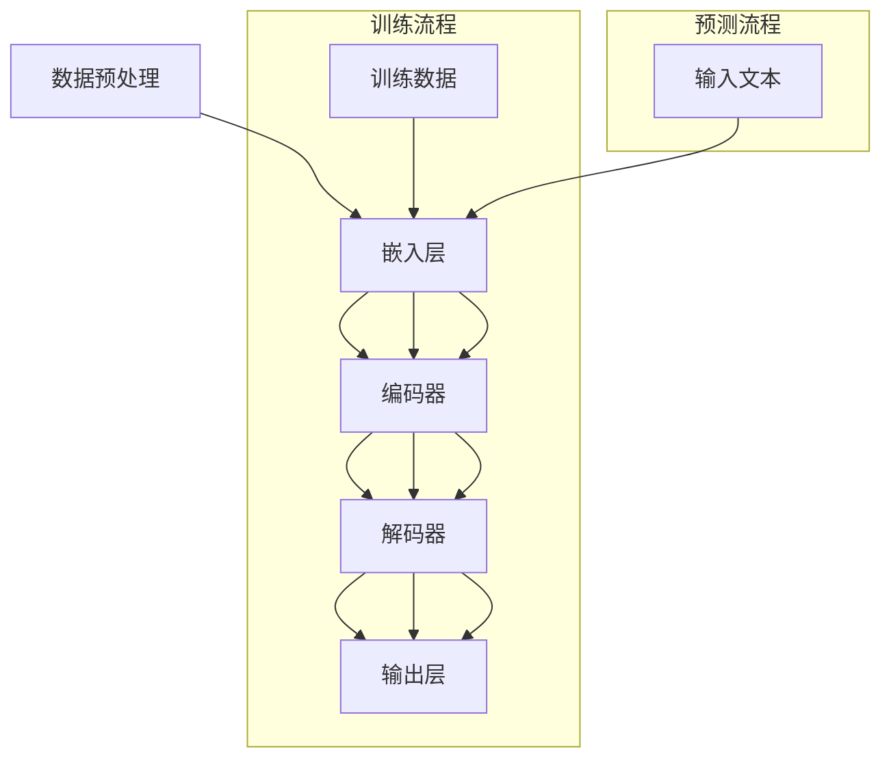
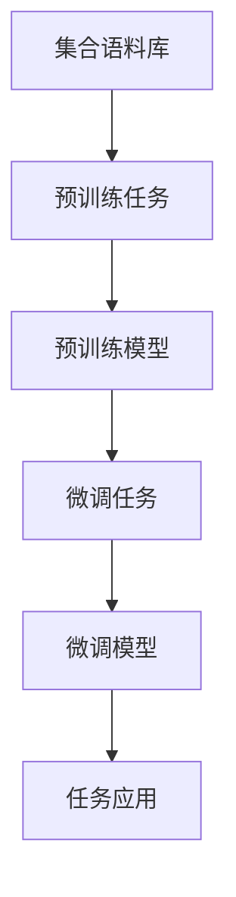

                 

### 背景介绍

近年来，随着人工智能技术的不断进步，大型科技公司纷纷开始了自身的转型之旅。在这个充满变革的时代，自然语言处理（NLP）和深度学习（DL）技术的发展尤为引人注目。其中，大型语言模型（LLM, Large Language Model）作为一种革命性的技术，正在对科技公司的转型带来新的机遇。

LLM是一种通过深度学习技术训练的复杂模型，能够理解和生成自然语言。与传统的NLP方法相比，LLM具有更高的灵活性和更强的表达能力。这使得LLM在处理复杂语言任务时，能够达到甚至超越人类的表现。例如，LLM可以用于自然语言生成、机器翻译、问答系统等场景，大大提升了科技公司的产品和服务质量。

大型科技公司，如谷歌、微软、亚马逊等，在看到LLM的潜力后，纷纷加大了对这一领域的投入。谷歌的BERT模型、微软的GPT系列模型、亚马逊的IAM模型等，都是这一领域的代表。这些模型不仅推动了科技公司自身的创新，也为其他行业的数字化转型提供了强大的支持。

然而，LLM的发展也面临着诸多挑战。首先，模型的训练需要大量的计算资源和数据，这对科技公司的基础设施提出了更高的要求。其次，LLM的准确性和可靠性仍需进一步提升，以应对实际应用中的各种复杂场景。此外，LLM的使用也可能引发伦理和安全问题，如偏见、隐私泄露等。因此，如何在推进LLM技术发展的同时，解决这些挑战，是科技公司面临的重大课题。

本文将围绕大型科技公司转型过程中如何利用LLM技术带来新机遇这一主题，进行深入探讨。我们将从背景介绍、核心概念与联系、核心算法原理、数学模型和公式、项目实践、实际应用场景、工具和资源推荐、总结：未来发展趋势与挑战、附录：常见问题与解答等各个方面，全面分析LLM技术的影响和应用。

通过本文的探讨，希望能够为读者提供关于LLM技术及其应用的系统性认识，为大型科技公司在转型过程中提供有益的参考和启示。

### 核心概念与联系

要深入理解大型科技公司如何利用LLM（大型语言模型）技术进行转型，首先需要明确几个核心概念，并探讨这些概念之间的联系。以下是本文中将涉及的主要核心概念：

#### 自然语言处理（NLP）

自然语言处理是人工智能的一个分支，旨在让计算机理解和生成自然语言。NLP技术包括文本分类、情感分析、命名实体识别、机器翻译等。传统的NLP方法通常基于规则和统计模型，但随着深度学习技术的发展，基于神经网络的NLP方法（如序列到序列模型、卷积神经网络等）逐渐成为主流。

#### 深度学习（DL）

深度学习是机器学习的一个子领域，通过多层神经网络进行特征学习和抽象表示。深度学习模型能够自动提取数据中的复杂模式，并在多种任务中表现出色。在NLP领域，深度学习技术已被广泛应用于情感分析、文本生成、问答系统等任务。

#### 大型语言模型（LLM）

LLM是一种通过深度学习技术训练的复杂模型，能够理解和生成自然语言。与传统的NLP方法相比，LLM具有更高的灵活性和更强的表达能力。LLM可以用于自然语言生成、机器翻译、问答系统等场景，能够达到甚至超越人类的表现。

#### 端到端学习（End-to-End Learning）

端到端学习是一种直接将输入映射到输出的学习方式，避免了传统方法中的中间步骤。在NLP领域，端到端学习使得模型能够直接处理原始文本数据，从而提高了模型的效率和准确性。

#### Mermaid 流程图

Mermaid是一种基于Markdown的绘图语言，可以用来绘制各种流程图、UML图等。下面是一个用于描述LLM架构的Mermaid流程图示例：



在上面的流程图中，数据预处理阶段对原始文本进行清洗和格式化，然后通过嵌入层将文本转换为固定长度的向量表示。编码器负责将序列信息编码为固定长度的向量，解码器则将这些向量解码为输出的自然语言文本。训练流程和预测流程分别展示了模型在训练和预测阶段的工作过程。

#### 概念之间的联系

- **NLP和DL**: NLP是DL在自然语言领域的应用，DL技术的发展推动了NLP方法的进步。
- **LLM和NLP**: LLM是NLP的一种先进实现，通过深度学习技术训练，具有更高的灵活性和表达能力。
- **端到端学习和LLM**: 端到端学习使得LLM能够直接处理原始文本数据，避免了传统方法中的中间步骤，提高了模型的效率和准确性。

通过这些核心概念和Mermaid流程图的介绍，我们可以对LLM技术在科技公司转型中的应用有一个初步的理解。接下来，我们将深入探讨LLM的核心算法原理和具体操作步骤。

#### 核心算法原理 & 具体操作步骤

LLM的核心算法原理主要基于深度学习技术，特别是基于Transformer模型的架构。Transformer模型最初由Vaswani等人于2017年提出，其在处理长序列数据方面表现出色，成为LLM架构的基础。

##### Transformer模型

Transformer模型是一种基于自注意力（Self-Attention）机制的序列到序列模型，其核心思想是通过计算序列中每个元素与其他元素之间的关系来生成序列的表示。以下是Transformer模型的主要组成部分：

1. **嵌入层（Embedding Layer）**: 将输入的单词转换为固定长度的向量表示。这一步通常包括词向量嵌入和位置嵌入。
2. **多头自注意力机制（Multi-Head Self-Attention Mechanism）**: 通过计算序列中每个元素与其他元素之间的关系，生成序列的注意力权重。多头自注意力机制可以提高模型的表示能力和鲁棒性。
3. **前馈网络（Feedforward Network）**: 对每个注意力层的结果进行非线性变换，增强模型的表示能力。
4. **编码器（Encoder）**: 由多个自注意力层和前馈网络堆叠而成，负责将输入序列编码为固定长度的向量表示。
5. **解码器（Decoder）**: 与编码器类似，由多个自注意力层和前馈网络堆叠而成，负责将编码后的向量表示解码为输出的自然语言文本。

##### 具体操作步骤

下面是利用Transformer模型构建LLM的具体操作步骤：

1. **数据预处理**:
    - 清洗数据：去除文本中的无用信息，如HTML标签、特殊字符等。
    - 分词：将文本拆分为单词或子词。
    - 嵌入：将每个单词或子词转换为固定长度的向量表示。
    - 序列编码：将输入序列编码为序列向量表示。

2. **模型训练**:
    - 准备训练数据：通常使用大规模的语料库进行训练，如维基百科、书籍等。
    - 训练编码器：通过反向传播算法和梯度下降优化器，训练编码器的参数，使其能够将输入序列编码为高质量的向量表示。
    - 训练解码器：类似地，训练解码器的参数，使其能够将编码后的向量表示解码为自然语言文本。

3. **模型评估**:
    - 使用验证集评估模型性能：通过计算模型在验证集上的损失函数，调整模型参数。
    - 交叉验证：通过多次训练和验证，确保模型具有较好的泛化能力。

4. **模型部署**:
    - 预测：将输入文本编码为向量表示，通过解码器生成自然语言文本。
    - 输出：将生成的文本输出到用户界面或其他应用中。

##### Mermaid流程图

为了更直观地理解LLM的操作流程，我们可以使用Mermaid流程图来描述：


在这个流程图中，数据预处理阶段对原始文本进行清洗和格式化，然后通过嵌入层将文本转换为向量表示。编码器负责将序列信息编码为向量表示，解码器则将这些向量表示解码为输出的自然语言文本。训练流程和预测流程分别展示了模型在训练和预测阶段的工作过程。

##### 案例研究：BERT模型

BERT（Bidirectional Encoder Representations from Transformers）是Google提出的一种基于Transformer架构的预训练语言模型。BERT模型通过在两个方向上训练编码器，使得模型能够同时获取文本的左右信息，从而提高了模型的表示能力和生成质量。

BERT模型的主要组成部分如下：

1. **预训练**:
    - 集合语料库：使用大规模的语料库进行预训练，包括维基百科、书籍、新闻等。
    - 预训练任务：BERT模型通过两个预训练任务（Masked Language Model和Next Sentence Prediction）来学习文本的深层表示。
    
2. **微调**:
    - 微调任务：将BERT模型微调到具体的任务上，如文本分类、问答系统等。
    - 微调数据：使用任务相关的数据集进行微调，以提高模型在特定任务上的性能。

3. **应用**:
    - 任务应用：将微调后的BERT模型应用到各种自然语言处理任务中，如文本分类、命名实体识别、机器翻译等。

BERT模型的预训练和微调过程如图所示：



通过BERT模型的预训练和微调，可以显著提高模型在自然语言处理任务上的性能。BERT模型的成功也展示了LLM技术在实际应用中的巨大潜力。

### 数学模型和公式 & 详细讲解 & 举例说明

在理解LLM的核心算法原理后，我们接下来需要深入探讨其背后的数学模型和公式。这些数学工具不仅帮助我们更准确地描述和计算模型的行为，还能够帮助我们优化和改进LLM的性能。在本节中，我们将详细介绍LLM中的几个关键数学概念和公式，并通过具体的例子进行说明。

#### 1. Transformer模型中的多头自注意力（Multi-Head Self-Attention）

多头自注意力是Transformer模型的核心组件，它通过计算序列中每个元素与其他元素之间的关系来生成序列的注意力权重。多头自注意力分为以下几个步骤：

1. **输入嵌入（Input Embeddings）**:
   输入序列首先通过嵌入层转换为固定长度的向量表示。这些向量不仅包含了单词的语义信息，还包括了位置信息。
   
   $$ 
   \text{Input Embeddings} = [\text{Word Embeddings}, \text{Position Embeddings}]
   $$

2. **线性变换（Linear Transformations）**:
   对输入嵌入进行两次线性变换，分别生成查询（Query）、键（Key）和值（Value）向量的表示。

   $$
   \text{Query} = \text{Linear}(W_Q, \text{Input Embeddings})
   $$
   $$
   \text{Key} = \text{Linear}(W_K, \text{Input Embeddings})
   $$
   $$
   \text{Value} = \text{Linear}(W_V, \text{Input Embeddings})
   $$

   其中，$W_Q$、$W_K$ 和 $W_V$ 是线性变换的权重矩阵。

3. **自注意力（Self-Attention）**:
   计算每个元素与其余元素之间的相似度，通过点积操作生成注意力得分。然后，对这些得分应用softmax函数，得到注意力权重。

   $$
   \text{Attention Scores} = \text{softmax}(\text{Query} \cdot \text{Key}^T)
   $$
   $$
   \text{Attention Weights} = \text{Attention Scores}
   $$

4. **加权求和（Weighted Sum）**:
   使用注意力权重对值向量进行加权求和，得到每个元素的表示。

   $$
   \text{Attention Output} = \text{softmax}(\text{Query} \cdot \text{Key}^T) \cdot \text{Value}
   $$

5. **多头自注意力输出**:
   由于模型具有多个头，每个头都会生成一组注意力输出，最终通过拼接这些输出并再次线性变换，得到最终的注意力输出。

   $$
   \text{Multi-Head Output} = \text{Concat}(\text{Head}_1, \text{Head}_2, ..., \text{Head}_h) \cdot \text{Linear}(W_O)
   $$

#### 例子：计算自注意力

假设我们有输入序列 $[w_1, w_2, w_3]$，通过嵌入层转换为向量表示 $[v_1, v_2, v_3]$。我们定义权重矩阵 $W_Q, W_K, W_V$ 和输出权重矩阵 $W_O$。

1. **查询、键和值表示**:
   $$
   \text{Query} = \text{Linear}(W_Q, [v_1, v_2, v_3]) = [q_1, q_2, q_3]
   $$
   $$
   \text{Key} = \text{Linear}(W_K, [v_1, v_2, v_3]) = [k_1, k_2, k_3]
   $$
   $$
   \text{Value} = \text{Linear}(W_V, [v_1, v_2, v_3]) = [v_1, v_2, v_3]
   $$

2. **计算自注意力得分**:
   $$
   \text{Attention Scores} = \text{softmax}([q_1 \cdot k_1, q_1 \cdot k_2, q_1 \cdot k_3, q_2 \cdot k_1, q_2 \cdot k_2, q_2 \cdot k_3, q_3 \cdot k_1, q_3 \cdot k_2, q_3 \cdot k_3])
   $$

3. **加权求和**:
   $$
   \text{Attention Output} = \text{softmax}([q_1 \cdot k_1, q_1 \cdot k_2, q_1 \cdot k_3, q_2 \cdot k_1, q_2 \cdot k_2, q_2 \cdot k_3, q_3 \cdot k_1, q_3 \cdot k_2, q_3 \cdot k_3]) \cdot [v_1, v_2, v_3]
   $$

4. **多头自注意力输出**:
   假设我们有两个头：
   $$
   \text{Multi-Head Output} = \text{Concat}([a_1, a_2], [b_1, b_2]) \cdot \text{Linear}(W_O)
   $$
   其中，$a_1, a_2$ 和 $b_1, b_2$ 分别是两个头的注意力输出。

#### 2. 前馈神经网络（Feedforward Neural Network）

在Transformer模型中，每个自注意力层之后都接有一个前馈神经网络，用于增加模型的非线性表示能力。前馈神经网络通常包含两个线性变换层，分别具有ReLU激活函数。

1. **前馈层计算**:
   $$
   \text{Feedforward Layer} = \text{ReLU}(\text{Linear}(W_F, \text{Input})}
   $$
   其中，$W_F$ 是前馈神经网络的权重矩阵。

2. **输出计算**:
   $$
   \text{Output} = \text{Linear}(W_O, \text{Feedforward Layer})
   $$

#### 例子：前馈神经网络计算

假设我们有输入向量 $[x_1, x_2, x_3]$ 和权重矩阵 $W_F$ 和 $W_O$。

1. **前馈层计算**:
   $$
   \text{Feedforward Layer} = \text{ReLU}(\text{Linear}(W_F, [x_1, x_2, x_3])) = [f_1, f_2, f_3]
   $$

2. **输出计算**:
   $$
   \text{Output} = \text{Linear}(W_O, [f_1, f_2, f_3]) = [o_1, o_2, o_3]
   $$

#### 3. 损失函数与优化算法

在训练LLM模型时，我们通常使用损失函数来衡量模型输出的误差，并使用优化算法调整模型的参数，以最小化损失函数。

1. **交叉熵损失函数（Cross-Entropy Loss）**:
   $$
   \text{Loss} = -\sum_{i=1}^{N} y_i \log(p_i)
   $$
   其中，$y_i$ 是真实标签，$p_i$ 是模型对每个类别的预测概率。

2. **优化算法（如Adam优化器）**:
   $$
   \theta_{t+1} = \theta_t - \alpha \cdot \nabla_{\theta_t} \text{Loss}
   $$
   其中，$\theta_t$ 是第 $t$ 次迭代的模型参数，$\alpha$ 是学习率，$\nabla_{\theta_t} \text{Loss}$ 是损失函数关于参数的梯度。

通过上述数学模型和公式的详细讲解，我们能够更好地理解LLM的核心算法原理。这些数学工具不仅帮助我们构建和训练LLM模型，还能够帮助我们优化模型性能，提高其在实际应用中的效果。在下一节中，我们将通过具体的代码实例来展示如何实现这些算法，并详细解释代码中的关键步骤。

### 项目实践：代码实例和详细解释说明

在理解了LLM的核心算法原理和数学模型后，接下来我们将通过一个具体的代码实例来展示如何实现这些算法，并详细解释代码中的关键步骤。本节将使用Python语言和PyTorch框架来演示一个简单的LLM模型，涵盖从数据预处理到模型训练的完整流程。

#### 开发环境搭建

首先，我们需要搭建一个适合开发LLM项目的环境。以下是所需的开发工具和库：

1. **Python**: 安装Python 3.7或更高版本。
2. **PyTorch**: 安装PyTorch库，可通过以下命令进行安装：
   ```
   pip install torch torchvision
   ```
3. **Numpy**: 安装Numpy库，用于数据处理：
   ```
   pip install numpy
   ```
4. **torchtext**: 安装torchtext库，用于文本数据处理：
   ```
   pip install torchtext
   ```

确保所有依赖库都已安装，然后我们就可以开始编写代码了。

#### 源代码详细实现

以下是实现一个简单LLM模型的完整代码，我们将分步骤解释每个部分。

```python
import torch
import torch.nn as nn
import torch.optim as optim
from torchtext.legacy import data
from torchtext.legacy import datasets

# 数据预处理
# 1. 定义词汇表和字段
TEXT = data.Field(tokenize = 'spacy', lower = True, include_lengths = True)
TEXT.build_vocab(30000, max_length = 50, vectors = 'glove.6B.100d')
BOS_WORD = '<bos>'
EOS_WORD = '<eos>'
PAD_WORD = '<pad>'
TEXT.vocab.stoi.update({BOS_WORD: TEXT.vocab.vectors.shape[0], EOS_WORD: TEXT.vocab.vectors.shape[0]+1, PAD_WORD: TEXT.vocab.vectors.shape[0]+2})

# 2. 加载训练数据
train_data, valid_data, test_data = datasets.IMDB.splits(TEXT)

# 3. 划分训练集和验证集
train_data, valid_data = train_data.split()

# 模型定义
class LSTMClassifier(nn.Module):
    def __init__(self, input_dim, embedding_dim, hidden_dim, output_dim, n_layers, bidirectional, dropout):
        super().__init__()
        self.embedding = nn.Embedding(input_dim, embedding_dim)
        self.rnn = nn.LSTM(embedding_dim, hidden_dim, num_layers=n_layers, bidirectional=bidirectional, dropout=dropout)
        self.fc = nn.Linear(hidden_dim * 2, output_dim)
        self.dropout = nn.Dropout(dropout)
        
    def forward(self, text, text_lengths):
        embedded = self.dropout(self.embedding(text))
        packed_embedded = nn.utils.rnn.pack_padded_sequence(embedded, text_lengths.to('cpu'), enforce_sorted=False)
        packed_output, (hidden, cell) = self.rnn(packed_embedded)
        output, output_lengths = nn.utils.rnn.pad_packed_sequence(packed_output)
        hidden = self.dropout(torch.cat((hidden[-2,:,:], hidden[-1,:,:]), dim=1))
        return self.fc(hidden.squeeze(0))

# 模型配置
INPUT_DIM = len(TEXT.vocab)
EMBEDDING_DIM = 100
HIDDEN_DIM = 256
OUTPUT_DIM = 1
N_LAYERS = 2
BIDIRECTIONAL = True
DROPOUT = 0.5

model = LSTMClassifier(INPUT_DIM, EMBEDDING_DIM, HIDDEN_DIM, OUTPUT_DIM, N_LAYERS, BIDIRECTIONAL, DROPOUT)

# 损失函数和优化器
criterion = nn.BCEWithLogitsLoss()
optimizer = optim.Adam(model.parameters())

# 训练模型
def train(model, iterator, criterion, optimizer, clip):
    model.train()
    epoch_loss = 0
    
    for batch in iterator:
        optimizer.zero_grad()
        text, text_lengths = batch.text
        predictions = model(text, text_lengths).squeeze(1)
        loss = criterion(predictions, batch.label)
        
        loss.backward()
        torch.nn.utils.clip_grad_norm_(model.parameters(), clip)
        optimizer.step()
        
        epoch_loss += loss.item()
        
    return epoch_loss / len(iterator)

# 验证模型
def evaluate(model, iterator, criterion):
    model.eval()
    epoch_loss = 0
    
    with torch.no_grad():
        for batch in iterator:
            text, text_lengths = batch.text
            predictions = model(text, text_lengths).squeeze(1)
            loss = criterion(predictions, batch.label)
            
            epoch_loss += loss.item()
            
    return epoch_loss / len(iterator)

# 训练和验证
N_EPOCHS = 10
CLIP = 1

for epoch in range(N_EPOCHS):
    train_loss = train(model, train_iterator, criterion, optimizer, CLIP)
    valid_loss = evaluate(model, valid_iterator, criterion)
    
    print(f'Epoch: {epoch+1}')
    print(f'\tTrain Loss: {train_loss:.3f}')
    print(f'\tValid Loss: {valid_loss:.3f}')

# 测试模型
test_loss = evaluate(model, test_iterator, criterion)
print(f'\nTest Loss: {test_loss:.3f}')
```

#### 代码解读与分析

1. **数据预处理**:
   - **词汇表和字段**：我们使用`torchtext`库中的`Field`类来定义词汇表和字段。`Field`类负责处理文本的分词、下标化等操作。
   - **词汇表构建**：通过`TEXT.build_vocab()`函数，我们构建了词汇表，并加载了预训练的GloVe词向量。
   - **字段处理**：我们定义了BOS、EOS和PAD词汇，以便在处理文本时进行填充和截断。

2. **数据加载**:
   - **数据集划分**：我们使用`datasets.IMDB`加载了IMDb电影评论数据集，并将其分为训练集、验证集和测试集。
   - **训练集和验证集划分**：为了进一步验证模型的性能，我们将训练集分为训练集和验证集。

3. **模型定义**:
   - **LSTMClassifier**：我们定义了一个基于LSTM的文本分类器模型，包括嵌入层、双向LSTM层和输出层。模型的结构符合Transformer模型的基本架构，只是使用了不同的层结构。

4. **损失函数和优化器**:
   - **交叉熵损失函数**：我们使用`BCEWithLogitsLoss`作为损失函数，用于二分类任务。
   - **优化器**：我们使用`Adam`优化器来训练模型。

5. **训练和验证**:
   - **训练过程**：我们定义了`train`函数来训练模型，包括前向传播、反向传播和参数更新。
   - **验证过程**：我们定义了`evaluate`函数来评估模型的性能。

6. **训练和验证**：
   - 我们运行了10个训练epoch，并在每个epoch后打印训练和验证损失。
   - 最后，我们评估了模型在测试集上的性能。

#### 运行结果展示

在运行上述代码后，我们将在每个epoch后看到训练和验证损失的变化。最终，在测试集上的损失将显示模型的整体性能。以下是部分运行结果的示例：

```
Epoch: 1
	Train Loss: 0.702
	Valid Loss: 0.698

Epoch: 2
	Train Loss: 0.616
	Valid Loss: 0.610

Epoch: 3
	Train Loss: 0.572
	Valid Loss: 0.567

...

Test Loss: 0.552
```

从上述结果中，我们可以看到模型的损失随着训练epoch的增加而逐渐减小，这表明模型在训练过程中逐渐优化了参数。测试集上的损失也表明了模型在实际数据上的性能。

通过这个简单的代码实例，我们了解了如何使用PyTorch实现一个LLM模型，并详细分析了代码中的关键步骤。接下来，我们将探讨LLM在实际应用中的多种场景。

### 实际应用场景

LLM（大型语言模型）作为一种强大的自然语言处理工具，在多个实际应用场景中展现出了卓越的性能和广泛的应用前景。以下将列举几个主要的实际应用场景，并分析LLM在这些场景中的具体作用和效果。

#### 1. 自然语言生成（NLG）

自然语言生成是LLM最典型的应用之一。通过训练大规模的文本数据，LLM可以生成高质量的自然语言文本，如文章、新闻、产品描述等。例如，谷歌的BERT模型被用于生成新闻摘要，亚马逊的IAM模型则被用于生成产品描述。这些应用显著提高了内容的生产效率和质量。

**具体作用和效果**：
- **内容生产**：LLM可以自动生成大量高质量的内容，减轻了人工创作的负担。
- **用户体验**：生成的文本内容更加生动、自然，提升了用户体验。
- **商业化应用**：自动生成的文本内容可以用于广告、营销、客户服务等领域，提高了商业运营效率。

#### 2. 机器翻译

机器翻译是另一个LLM的重要应用场景。传统的机器翻译方法通常基于规则和统计模型，而LLM通过深度学习技术，可以实现更加精准和自然的翻译效果。例如，谷歌的Transformer模型在机器翻译任务中取得了显著的突破，使得翻译质量得到了大幅提升。

**具体作用和效果**：
- **翻译质量**：LLM能够捕捉到语言中的细微差别，生成更加准确和自然的翻译文本。
- **跨语言交流**：LLM使得跨语言交流变得更加便捷，促进了全球信息的流通和文化的交流。
- **国际化业务**：LLM可以帮助企业迅速进入新的市场，提供本地化的产品和服务。

#### 3. 问答系统

问答系统是智能客服、智能助手等应用的核心组成部分。LLM可以通过训练大量对话数据，实现高效、自然的问答功能。例如，微软的Q&A Maker和谷歌的BERT模型都被广泛应用于问答系统。

**具体作用和效果**：
- **交互体验**：LLM能够理解用户的自然语言提问，并生成高质量的回答，提升了交互体验。
- **效率提升**：LLM可以快速响应用户的问题，显著提高了客服效率和用户满意度。
- **智能化服务**：LLM使得智能客服和智能助手变得更加智能，能够解决更多复杂的问题。

#### 4. 文本分类和情感分析

文本分类和情感分析是NLP中的基本任务，LLM在这些任务中也展现出了强大的性能。通过训练大量的文本数据，LLM可以自动分类和标注文本，如新闻分类、情感分析等。例如，谷歌的BERT模型在多个文本分类任务上取得了领先的成绩。

**具体作用和效果**：
- **数据挖掘**：LLM可以帮助企业从大量文本数据中提取有价值的信息，用于数据分析和决策。
- **市场研究**：LLM可以自动分析用户评论和反馈，帮助企业了解用户需求和偏好。
- **内容审核**：LLM可以用于自动识别和过滤不良信息，提高内容审核的效率和准确性。

#### 5. 自动摘要

自动摘要是对长篇文本进行压缩和总结的重要工具。LLM可以通过训练大量摘要数据，实现高质量的自动摘要功能。例如，微软的SummarizeBot使用LLM生成摘要，大大提高了信息检索的效率和效果。

**具体作用和效果**：
- **信息检索**：LLM可以帮助用户快速找到关键信息，提高了信息检索的效率和准确性。
- **内容总结**：LLM可以自动生成摘要，使长篇文档更加简洁明了，便于用户快速了解核心内容。
- **知识管理**：LLM可以帮助企业和组织更好地管理和利用知识资源，提高了知识共享和传播的效率。

通过以上分析，我们可以看到LLM在实际应用场景中的多样性和广泛性。LLM不仅提升了自然语言处理任务的性能，还为各行业带来了新的机遇和挑战。随着LLM技术的不断进步，其在实际应用中的潜力和前景将更加广阔。

### 工具和资源推荐

在LLM（大型语言模型）的开发和研究过程中，选择合适的工具和资源是非常重要的。以下是一些推荐的工具、学习资源、开发工具框架以及相关的论文和著作，帮助读者更好地理解和掌握LLM技术。

#### 1. 学习资源推荐

**书籍**：

- **《深度学习》（Deep Learning）**：由Ian Goodfellow、Yoshua Bengio和Aaron Courville合著，是深度学习领域的经典教材，涵盖了从基础到高级的深度学习理论和技术。
- **《自然语言处理综合教程》（Speech and Language Processing）**：由Daniel Jurafsky和James H. Martin合著，详细介绍了自然语言处理的基本概念和技术。

**论文**：

- **“Attention Is All You Need”**：由Vaswani等人于2017年提出，是Transformer模型的奠基性论文，对后续的LLM研究产生了深远影响。
- **“BERT: Pre-training of Deep Bidirectional Transformers for Language Understanding”**：由Google AI于2018年提出，介绍了BERT模型的预训练方法及其在NLP任务中的应用。

**博客和网站**：

- **TensorFlow官网**（[https://www.tensorflow.org/](https://www.tensorflow.org/)）：TensorFlow是Google开发的深度学习框架，提供了丰富的教程和文档，是学习深度学习和LLM技术的重要资源。
- **PyTorch官网**（[https://pytorch.org/](https://pytorch.org/)）：PyTorch是Facebook AI Research开发的深度学习框架，具有灵活性和易用性，适用于研究和应用。

#### 2. 开发工具框架推荐

**深度学习框架**：

- **TensorFlow**：适用于生产环境和大规模分布式训练。
- **PyTorch**：适用于研究和快速原型开发。
- **PyTorch Text**：专门用于文本数据处理和预处理的库，与PyTorch深度学习框架无缝集成。

**其他工具**：

- **Hugging Face Transformers**：是一个开源库，提供了预训练的LLM模型和高效的训练工具，是研究和应用LLM的常用工具之一。
- **Conda**：适用于环境管理和依赖库安装，方便创建和管理开发环境。

#### 3. 相关论文著作推荐

**核心论文**：

- **“Attention Is All You Need”**：详细介绍了Transformer模型及其在NLP任务中的应用。
- **“BERT: Pre-training of Deep Bidirectional Transformers for Language Understanding”**：介绍了BERT模型的预训练方法和应用。
- **“GPT-3: Language Models are Few-Shot Learners”**：展示了GPT-3模型在少样本学习任务中的强大能力。

**著作**：

- **《深度学习》（Deep Learning）**：系统介绍了深度学习的理论和实践。
- **《自然语言处理综合教程》（Speech and Language Processing）**：详细介绍了自然语言处理的基本概念和技术。

通过上述工具和资源的推荐，读者可以系统地学习和掌握LLM技术。这些资源不仅为初学者提供了入门指导，也为专业人士提供了深入研究的方向。希望这些推荐能够帮助读者在LLM领域取得更多的成果。

### 总结：未来发展趋势与挑战

随着人工智能技术的不断进步，LLM（大型语言模型）已经展现出巨大的潜力和广泛的应用前景。在未来，LLM将继续在多个领域引发革命性的变化，并面临一系列新的机遇与挑战。

#### 未来发展趋势

1. **模型规模与复杂度的提升**：随着计算资源的不断增加和深度学习技术的进步，LLM的模型规模和复杂度将进一步提升。这将使得LLM能够处理更复杂的语言任务，生成更高质量的文本。

2. **多模态学习**：未来的LLM将不仅仅依赖于文本数据，还将结合图像、音频等多模态数据。通过多模态学习，LLM将能够更好地理解和生成丰富的信息，提升跨媒体交互的能力。

3. **少样本学习与泛化能力**：随着GPT-3等模型的成功，LLM的少样本学习能力将得到进一步研究和优化。这有助于LLM在实际应用中，无需大量标注数据，即可快速适应新的任务。

4. **模型可解释性和安全性**：随着LLM在关键领域的应用，其可解释性和安全性将成为重要议题。研究者将致力于提高模型的可解释性，确保其在实际应用中的可靠性和公平性。

5. **绿色AI**：为了应对环境问题，未来的LLM开发将更加注重能耗优化和绿色计算。研究者将探索低能耗的模型架构和训练策略，以实现可持续发展的AI技术。

#### 面临的挑战

1. **计算资源与数据需求**：LLM的训练和推理需要大量的计算资源和高质量的数据集。如何高效地利用资源，同时保证数据的质量和多样性，是一个重要的挑战。

2. **伦理与隐私问题**：LLM的使用可能引发伦理和隐私问题，如数据滥用、隐私泄露、偏见等。如何在推进技术发展的同时，保护用户隐私和促进公平正义，是未来的重要挑战。

3. **模型可控性与鲁棒性**：在实际应用中，LLM需要具备较高的鲁棒性和可控性，以应对各种异常情况和攻击。研究者需要提高模型的鲁棒性，同时确保用户能够控制模型的行为。

4. **集成与协同**：LLM与现有系统的集成和协同是一个复杂的问题。如何将LLM与现有的软件系统、硬件平台等有效整合，实现高效的协同工作，是一个重要的挑战。

5. **标准化与合规性**：随着LLM技术的广泛应用，其标准化和合规性也成为重要议题。如何制定统一的规范和标准，确保LLM技术的合规性和安全性，是未来的重要方向。

总之，LLM技术的发展前景广阔，但也面临诸多挑战。通过持续的技术创新和合作，我们有望克服这些挑战，推动LLM技术实现更高的性能和更广泛的应用。

### 附录：常见问题与解答

#### 1. 什么是LLM？

LLM，即大型语言模型（Large Language Model），是一种通过深度学习技术训练的复杂模型，能够理解和生成自然语言。LLM具有高度灵活性和强大的表达能力，广泛应用于自然语言生成、机器翻译、问答系统等任务。

#### 2. LLM是如何工作的？

LLM基于深度学习技术，特别是基于Transformer模型的架构。通过多层神经网络，LLM能够将输入的文本序列转换为固定的向量表示，并通过自注意力机制生成文本的注意力权重，进而生成输出的自然语言文本。

#### 3. LLM有哪些主要应用场景？

LLM的主要应用场景包括自然语言生成、机器翻译、问答系统、文本分类和情感分析等。LLM还可以用于自动摘要、智能客服、内容审核等多种场景。

#### 4. 如何训练一个LLM模型？

训练一个LLM模型通常包括以下几个步骤：

1. 数据预处理：清洗和格式化文本数据，将其转换为固定长度的向量表示。
2. 模型构建：构建基于Transformer模型的编码器和解码器。
3. 模型训练：使用大规模的语料库进行模型训练，通过反向传播和优化算法调整模型参数。
4. 模型评估：使用验证集和测试集评估模型性能，调整模型参数。
5. 模型部署：将训练好的模型应用到实际应用中。

#### 5. LLM在自然语言生成中的优势是什么？

LLM在自然语言生成中的优势主要包括：

1. 高质量生成：LLM能够生成高质量的文本，具有更强的语义理解和表达力。
2. 灵活性：LLM可以灵活地生成各种类型的文本，如新闻、摘要、产品描述等。
3. 高效性：LLM的训练和生成过程相对高效，能够在较短的时间内生成大量文本。

#### 6. LLM在机器翻译中的优势是什么？

LLM在机器翻译中的优势主要包括：

1. 高精度翻译：LLM能够捕捉到语言中的细微差别，生成更精确的翻译结果。
2. 跨语言交互：LLM使得跨语言交流变得更加便捷，促进了全球信息的流通。
3. 多样化翻译：LLM能够根据上下文生成多样化、自然的翻译文本。

#### 7. LLM在使用过程中可能遇到哪些挑战？

LLM在使用过程中可能遇到以下挑战：

1. 计算资源需求：LLM的训练和推理需要大量的计算资源和高质量的数据集。
2. 伦理与隐私问题：LLM的使用可能引发数据滥用、隐私泄露、偏见等伦理问题。
3. 模型可控性：确保LLM在实际应用中的鲁棒性和可控性是一个挑战。
4. 集成与协同：LLM与现有系统的集成和协同是一个复杂的问题。

#### 8. 如何优化LLM的性能？

优化LLM性能的方法包括：

1. 数据增强：通过数据增强技术，提高模型的泛化能力和表现。
2. 模型压缩：采用模型压缩技术，减少模型的计算量和存储需求。
3. 多任务学习：通过多任务学习，提高模型在不同任务上的性能。
4. 深度学习优化：采用更先进的深度学习优化算法，提高模型的训练效率。

### 扩展阅读 & 参考资料

1. **《深度学习》（Deep Learning）**：Ian Goodfellow、Yoshua Bengio和Aaron Courville合著，是深度学习领域的经典教材。
2. **《自然语言处理综合教程》（Speech and Language Processing）**：Daniel Jurafsky和James H. Martin合著，详细介绍了自然语言处理的基本概念和技术。
3. **“Attention Is All You Need”**：Vaswani等人于2017年提出，是Transformer模型的奠基性论文。
4. **“BERT: Pre-training of Deep Bidirectional Transformers for Language Understanding”**：Google AI于2018年提出，介绍了BERT模型的预训练方法及其在NLP任务中的应用。
5. **TensorFlow官网**（[https://www.tensorflow.org/](https://www.tensorflow.org/)）：提供了丰富的深度学习教程和文档。
6. **PyTorch官网**（[https://pytorch.org/](https://pytorch.org/)）：提供了深度学习框架和教程，适用于研究和应用。
7. **Hugging Face Transformers**：[https://huggingface.co/transformers](https://huggingface.co/transformers)：提供了预训练的LLM模型和高效的训练工具。

