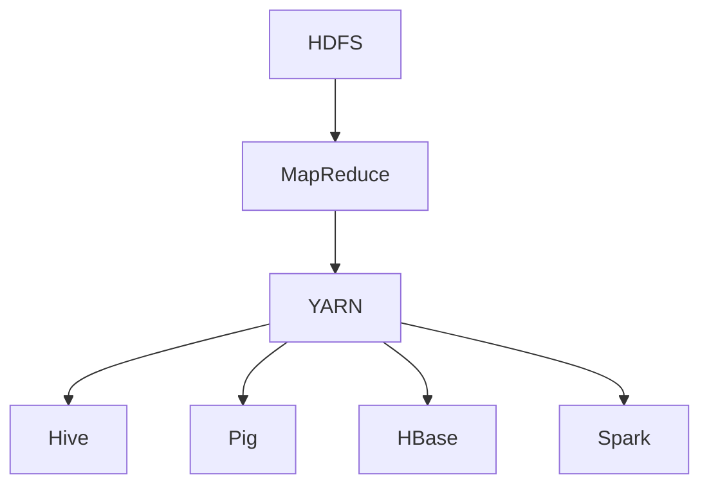

                 

## 1. 背景介绍

Hadoop作为大数据处理领域的旗舰技术，起源于Google在2004年发表的MapReduce论文。MapReduce是一种分布式数据处理框架，能够处理海量数据，因其高扩展性和容错能力而受到广泛关注。随着大数据时代的到来，传统的数据处理方式已无法满足日益增长的数据需求，Hadoop生态系统应运而生。

Hadoop生态系统不仅包含了核心的MapReduce计算模型，还涵盖了多种与大数据处理相关的组件，如HDFS（Hadoop Distributed File System）、YARN（Yet Another Resource Negotiator）、HBase、Spark等。这些组件协同工作，构建了一个完整的大数据处理解决方案，使得企业能够高效地处理和分析海量数据。

Hadoop生态系统的出现，标志着大数据处理技术进入了一个新的时代。它不仅提供了强大的数据处理能力，还推动了大数据技术的发展和应用。如今，Hadoop已经成为大数据处理领域的事实标准，广泛应用于金融、互联网、医疗、零售等各个行业。

### Hadoop生态系统的发展历程

Hadoop生态系统的发展历程可以分为以下几个阶段：

1. **初始阶段（2006年 - 2008年）**：Hadoop最早由Apache Software Foundation开发，其核心组件包括HDFS和MapReduce。这一阶段，Hadoop主要关注基础的数据存储和分布式计算功能。

2. **成长阶段（2009年 - 2011年）**：随着Hadoop的成熟，越来越多的企业开始采用Hadoop进行大数据处理。这一阶段，Hadoop生态系统开始引入新的组件，如Hive、Pig和HBase，以满足更复杂的数据处理需求。

3. **成熟阶段（2012年 - 2015年）**：在2012年，Apache Hadoop升级到2.0版本，引入了YARN（Yet Another Resource Negotiator）作为资源调度器，增强了Hadoop的灵活性和扩展性。同时，Spark等新一代计算框架的出现，使得Hadoop生态系统的数据处理能力更上一层楼。

4. **普及阶段（2016年 - 至今）**：随着大数据技术的普及，Hadoop生态系统已经成为大数据处理领域的事实标准。各大企业纷纷构建自己的大数据平台，基于Hadoop生态系统提供的一系列组件，实现高效的数据存储、处理和分析。

### Hadoop生态系统的重要性

Hadoop生态系统的重要性体现在以下几个方面：

1. **分布式计算能力**：Hadoop生态系统提供了强大的分布式计算能力，能够处理海量数据。通过MapReduce模型，数据可以被并行处理，大大提高了数据处理效率。

2. **高扩展性**：Hadoop生态系统具有很高的扩展性，可以根据实际需求动态调整资源分配。无论是数据存储还是计算资源，都能够灵活扩展，满足企业不断增长的数据需求。

3. **高可靠性**：Hadoop生态系统采用了多种容错机制，确保数据的高可靠性。例如，HDFS（Hadoop Distributed File System）通过数据冗余和复制，保障了数据的持久性和完整性。

4. **生态系统丰富**：Hadoop生态系统包含了众多与大数据处理相关的组件，如Hive、Pig、HBase、Spark等，这些组件相互协作，提供了完整的大数据处理解决方案。

5. **开源社区支持**：Hadoop生态系统拥有强大的开源社区支持，吸引了大量的开发者和企业参与。这使得Hadoop生态系统不断优化和更新，保持了技术的领先性。

### 总结

Hadoop生态系统作为大数据处理领域的旗舰技术，其发展历程、重要性以及广泛应用，充分展示了其在现代数据技术领域的重要地位。在未来，随着大数据技术的不断演进，Hadoop生态系统将继续发挥关键作用，助力企业实现数据价值的最大化。

---

## 2. 核心概念与联系

### Hadoop生态系统的核心组件及其联系

Hadoop生态系统由多个核心组件构成，每个组件在分布式数据处理中扮演着独特的角色。以下是对这些组件的详细描述及其相互关系的分析。

#### 2.1 HDFS（Hadoop Distributed File System）

HDFS是一个分布式文件系统，用于存储海量数据。它将大文件分割成小块，存储在分布式节点上。这种分块和存储机制提高了数据的可靠性和访问速度。HDFS的设计目标是高吞吐量和容错性，适用于大规模数据集的处理。

**工作原理**：
- **分块存储**：默认情况下，HDFS将文件分割成128MB或256MB大小的数据块，分布在多个数据节点上。
- **数据冗余**：为了提高数据的可靠性，HDFS采用冗余存储策略，每个数据块都有副本。默认情况下，副本数量为三个，存储在不同节点上。

**与Hadoop生态系统的联系**：
HDFS作为数据存储层，是Hadoop生态系统的基础。所有需要处理的数据都通过HDFS进行存储，然后由其他组件进行访问和处理。

#### 2.2 YARN（Yet Another Resource Negotiator）

YARN是一个资源调度和管理平台，负责管理Hadoop集群中的计算资源。它与HDFS紧密集成，使得用户能够充分利用集群资源，提高数据处理效率。

**工作原理**：
- **资源调度**：YARN将集群资源分配给不同的应用程序，确保每个应用程序都能获得足够的资源。
- **动态资源调整**：YARN可以根据应用程序的需求动态调整资源分配，提高资源利用率。

**与Hadoop生态系统的联系**：
YARN作为资源管理器，负责分配和管理集群资源。它使得Hadoop生态系统中的各种计算框架能够共享集群资源，实现高效的数据处理。

#### 2.3 MapReduce

MapReduce是一个分布式数据处理模型，用于处理大规模数据集。它将数据处理任务分解为Map和Reduce两个阶段，能够高效地处理分布式数据。

**工作原理**：
- **Map阶段**：输入数据被映射成一系列键值对。
- **Shuffle阶段**：Map输出的中间键值对按照键进行排序和分组。
- **Reduce阶段**：对Shuffle阶段的结果进行聚合和计算。

**与Hadoop生态系统的联系**：
MapReduce是Hadoop生态系统的核心计算框架，用于处理大规模数据集。它通过HDFS存储数据，然后由YARN进行资源调度和管理。

#### 2.4 Hive

Hive是一个数据仓库基础设施，允许用户使用类似SQL的查询语言（HiveQL）对存储在HDFS上的大规模数据集进行查询和分析。

**工作原理**：
- **编译查询**：Hive将HiveQL查询编译成MapReduce作业。
- **执行查询**：编译后的作业由MapReduce执行，生成查询结果。

**与Hadoop生态系统的联系**：
Hive作为数据处理和分析工具，与HDFS和YARN紧密集成。它使得用户能够方便地对大规模数据集进行查询和分析。

#### 2.5 Pig

Pig是一个高层次的数据处理平台，使用Pig Latin语言对大规模数据集进行操作。Pig Latin是一种类似于SQL的数据处理语言，具有丰富的操作符和函数库。

**工作原理**：
- **编译脚本**：Pig将Pig Latin脚本编译成MapReduce作业。
- **执行脚本**：编译后的作业由MapReduce执行，生成处理结果。

**与Hadoop生态系统的联系**：
Pig作为数据处理工具，与HDFS和YARN紧密集成。它提供了方便的数据处理能力，使得用户能够轻松处理大规模数据集。

#### 2.6 HBase

HBase是一个分布式、可扩展的列存储数据库，基于HDFS构建。它适用于存储稀疏数据集，如时间序列数据、日志数据和网页链接。

**工作原理**：
- **数据存储**：HBase将数据存储在HDFS之上，通过行键和列族进行访问。
- **数据分区**：HBase将数据分成多个Region，每个Region由一个RegionServer负责。

**与Hadoop生态系统的联系**：
HBase作为数据存储和访问层，与HDFS紧密集成。它提供了高性能的随机读写能力，适用于处理大规模、实时数据。

#### 2.7 Spark

Spark是一个快速通用的分布式计算引擎，适用于批处理和实时处理。与MapReduce相比，Spark具有更高的性能和更灵活的编程模型。

**工作原理**：
- **内存计算**：Spark利用内存计算技术，减少了数据读写磁盘的次数，从而提高了处理速度。
- **弹性调度**：Spark具有强大的弹性调度能力，能够动态调整任务执行资源。

**与Hadoop生态系统的联系**：
Spark作为新一代计算框架，与HDFS和YARN紧密集成。它提供了高性能的分布式计算能力，适用于各种大数据处理任务。

### Mermaid 流程图

以下是一个简化的Hadoop生态系统组件之间的Mermaid流程图，展示了各个组件之间的联系和工作原理。



### 核心概念与联系总结

Hadoop生态系统的核心组件通过紧密集成，共同构成了一个完整的大数据处理解决方案。每个组件在分布式数据处理中扮演着独特的角色，相互协作，实现了高效的数据存储、处理和分析。了解这些组件及其相互联系，有助于更好地理解和应用Hadoop生态系统。

---

## 3. 核心算法原理 & 具体操作步骤

### 3.1 MapReduce算法原理

MapReduce是一种分布式数据处理模型，由Map和Reduce两个阶段组成。它将大规模数据处理任务分解为多个小的任务，并在分布式系统中并行执行，从而提高了数据处理效率。

#### 3.1.1 Map阶段

Map阶段负责将输入数据映射成一系列键值对。具体步骤如下：

1. **读取输入数据**：Map任务从HDFS中读取输入数据，这些数据通常是文本文件或者其他格式化数据。
2. **映射函数处理**：对于每个输入记录，Map任务调用用户定义的映射函数（Mapper），将输入数据映射成一系列键值对。
3. **输出中间键值对**：映射函数生成的中间键值对会被存储在内存中，然后写入本地磁盘或发送到分布式系统中的其他节点。

#### 3.1.2 Shuffle阶段

Shuffle阶段负责对Map阶段输出的中间键值对进行排序和分组。具体步骤如下：

1. **排序与分组**：Map任务将中间键值对按照键进行排序和分组，然后生成分区文件，这些文件会发送到不同的Reduce任务。
2. **数据传输**：Shuffle阶段会将中间键值对从Map任务传输到Reduce任务所在的节点。

#### 3.1.3 Reduce阶段

Reduce阶段负责对Shuffle阶段输出的中间键值对进行聚合和计算。具体步骤如下：

1. **读取中间键值对**：Reduce任务从其他Map任务接收到的分区文件中读取中间键值对。
2. **聚合函数处理**：对于每个中间键值对，Reduce任务调用用户定义的聚合函数（Reducer），将中间值进行合并和计算。
3. **输出最终结果**：聚合函数生成的最终结果会被写入到HDFS中，作为处理结果的输出。

### 3.2 具体操作步骤

下面以一个简单的WordCount为例，详细说明MapReduce算法的具体操作步骤。

#### 3.2.1 数据准备

假设我们有一个包含大量文本数据的文件，每行是一个独立的文本记录。我们的目标是统计每个单词出现的次数。

```bash
Hello World
Hadoop is awesome
Hello Big Data
```

#### 3.2.2 编写Mapper代码

Mapper代码的主要功能是将输入文本映射成一系列键值对。以下是一个简单的Mapper示例：

```java
import org.apache.hadoop.conf.Configuration;
import org.apache.hadoop.fs.Path;
import org.apache.hadoop.io.IntWritable;
import org.apache.hadoop.io.Text;
import org.apache.hadoop.mapreduce.Job;
import org.apache.hadoop.mapreduce.Mapper;
import org.apache.hadoop.mapreduce.lib.input.FileInputFormat;
import org.apache.hadoop.mapreduce.lib.output.FileOutputFormat;

public class WordCountMapper extends Mapper<Object, Text, Text, IntWritable>{

  private final static IntWritable one = new IntWritable(1);
  private Text word = new Text();

  public void map(Object key, Text value, Context context) throws IOException, InterruptedException {
    String[] words = value.toString().split("\\s+");
    for (String word : words) {
      this.word.set(word);
      context.write(word, one);
    }
  }
}
```

#### 3.2.3 编写Reducer代码

Reducer代码的主要功能是将Mapper输出的中间键值对进行聚合。以下是一个简单的Reducer示例：

```java
import org.apache.hadoop.io.IntWritable;
import org.apache.hadoop.io.Text;
import org.apache.hadoop.mapreduce.Reducer;

import java.io.IOException;

public class WordCountReducer extends Reducer<Text,IntWritable,Text,IntWritable> {
  private IntWritable result = new IntWritable();

  public void reduce(Text key, Iterable<IntWritable> values, Context context) throws IOException, InterruptedException {
    int sum = 0;
    for (IntWritable val : values) {
      sum += val.get();
    }
    result.set(sum);
    context.write(key, result);
  }
}
```

#### 3.2.4 提交Job

最后，我们需要将Mapper和Reducer代码打包成jar文件，然后提交给Hadoop集群执行。

```bash
hadoop jar wordcount.jar WordCountMapper WordCountReducer input output
```

执行完成后，我们可以在输出目录中查看处理结果。

### 总结

通过上述步骤，我们详细介绍了MapReduce算法的原理和具体操作步骤。MapReduce作为一种分布式数据处理模型，通过将数据处理任务分解为Map和Reduce两个阶段，能够高效地处理大规模数据集。在实际应用中，我们可以根据需求自定义Mapper和Reducer代码，实现各种复杂的数据处理任务。

---

## 4. 数学模型和公式 & 详细讲解 & 举例说明

### 4.1 数学模型

Hadoop生态系统中的许多组件和算法都涉及数学模型。以下是一些核心的数学模型和公式，以及它们在Hadoop生态系统中的应用。

#### 4.1.1 概率分布

在HDFS中，数据块（Block）的复制策略是基于概率分布的。默认情况下，每个数据块有三个副本。这个副本数量是依据泊松分布（Poisson Distribution）来决定的。泊松分布是一种描述事件发生次数的概率分布，它适用于随机事件。

- **泊松分布公式**：

  $$ P(X = k) = \frac{e^{-\lambda} \cdot \lambda^k}{k!} $$

  其中，\( \lambda \) 是事件发生次数的均值，\( k \) 是具体的事件发生次数。

  在HDFS中，\( \lambda \) 表示数据块需要复制的次数，\( k \) 是实际复制的次数（通常是3）。

  **应用**：HDFS使用泊松分布来决定数据块的副本数量，以平衡数据可靠性和存储空间的使用。

#### 4.1.2 MapReduce的Shuffle

在MapReduce模型的Shuffle阶段，中间键值对（Key-Value Pairs）需要进行排序和分组。这个过程中，可以使用基数排序（Counting Sort）或者基于比较排序（Comparison Sort）的方法。

- **基数排序公式**：

  基数排序是一种非比较型排序算法，适用于整数或字符。它基于每个数的位数进行排序，从最低位到最高位。

  **算法步骤**：

  1. 选择一个基数（Radix），通常为10（用于整数）或26（用于字符）。
  2. 将所有数值分配到相应的桶（Bucket）中，每个桶对应一个基数。
  3. 重复步骤2，直到所有数值都被排序。

  **应用**：MapReduce中的Shuffle阶段可以使用基数排序来高效地排序中间键值对。

#### 4.1.3 YARN资源调度

YARN（Yet Another Resource Negotiator）是Hadoop生态系统中的资源调度器，它负责为各个应用程序分配计算资源。资源调度可以基于各种调度算法，如公平共享（Fair Share Scheduler）或容量调度（Capacity Scheduler）。

- **公平共享调度算法公式**：

  公平共享调度算法为每个队列（Queue）分配固定的资源份额，确保每个队列能够公平地使用资源。

  $$ R_{queue} = \frac{C_{total}}{N_{queues}} $$

  其中，\( R_{queue} \) 是每个队列的资源份额，\( C_{total} \) 是总资源量，\( N_{queues} \) 是队列的数量。

  **应用**：公平共享调度算法用于确保每个应用程序都能公平地获得资源，避免了某个应用程序占用过多资源的问题。

### 4.2 举例说明

为了更好地理解上述数学模型和公式，我们通过一个具体的例子进行说明。

#### 4.2.1 数据块的复制策略

假设HDFS中有一个文件，包含1000个数据块，每个数据块的默认副本数量为3。根据泊松分布，每个数据块的副本数量遵循以下概率分布：

- 副本数量为0的概率为0.1（\( e^{-3} \)）。
- 副本数量为1的概率为0.3（\( 3 \cdot e^{-3} \)）。
- 副本数量为2的概率为0.4（\( 3 \cdot e^{-3} \cdot 3 \)）。
- 副本数量为3的概率为0.2（\( \frac{3!}{3 \cdot e^{-3}} \)）。

我们可以计算每个数据块副本数量的期望值：

$$ E[副本数] = 0 \cdot 0.1 + 1 \cdot 0.3 + 2 \cdot 0.4 + 3 \cdot 0.2 = 2.2 $$

这意味着平均每个数据块会有2.2个副本。通过这种策略，HDFS可以在保持高可靠性的同时，最大限度地利用存储空间。

#### 4.2.2 MapReduce的Shuffle

假设我们在Map阶段生成了100个中间键值对，每个键值对都需要进行排序。我们选择基数排序来进行排序，基数设置为10（用于整数）。

首先，我们将每个键值对的键按最低位（个位）进行排序，然后按次低位（十位）进行排序，以此类推。每次排序后，我们将中间键值对放入对应的桶中。

- **第一次排序（个位）**：
  - 桶0: 键0, 键5
  - 桶1: 键1, 键6
  - 桶2: 键2, 键7
  - 桶3: 键3, 键8
  - 桶4: 键4, 键9

- **第二次排序（十位）**：
  - 桶0: 键0
  - 桶1: 键1, 键6
  - 桶2: 键2, 键7
  - 桶3: 键3, 键8
  - 桶4: 键4

- **第三次排序（百位）**：
  - 桶0: 键0
  - 桶1: 键1
  - 桶2: 键2
  - 桶3: 键3
  - 桶4: 键4, 键6, 键7, 键8

最终，每个桶中的键值对按照百位、十位和个位进行了排序。

#### 4.2.3 YARN资源调度

假设我们有一个包含3个队列的Hadoop集群，总资源量为100个CPU核心和100GB内存。根据公平共享调度算法，每个队列的资源份额为：

$$ R_{queue} = \frac{100}{3} \approx 33.33 $$

这意味着每个队列平均可以分配33.33个CPU核心和33.33GB内存。当有多个应用程序提交到队列时，YARN会根据公平共享调度算法为每个应用程序分配资源。

### 总结

通过上述数学模型和公式的讲解以及举例说明，我们可以更好地理解Hadoop生态系统中的一些关键组件和算法。这些数学模型不仅提高了系统的性能和效率，还为大数据处理提供了理论基础。在实际应用中，我们可以根据具体需求选择合适的数学模型和算法，实现高效的数据处理和分析。

---

### 5. 项目实践：代码实例和详细解释说明

#### 5.1 开发环境搭建

在开始Hadoop项目之前，我们需要搭建一个适合开发、测试和运行Hadoop应用程序的环境。以下是搭建Hadoop开发环境的步骤：

1. **安装Java**：确保系统中安装了Java SDK，版本至少为8或更高。
2. **安装Hadoop**：从Apache Hadoop官方网站（https://hadoop.apache.org/releases.html）下载最新的Hadoop二进制包。
3. **配置Hadoop环境**：
   - 解压Hadoop包到一个合适的目录，例如 `/usr/local/hadoop`。
   - 编辑 `hadoop-env.sh`，设置Java Home路径。
   - 编辑 `core-site.xml`，配置HDFS的存储路径。
   - 编辑 `hdfs-site.xml`，配置HDFS的副本数量和块大小。
   - 编辑 `yarn-site.xml`，配置YARN的资源调度器和资源管理器。
   - 编辑 `mapred-site.xml`，配置MapReduce的资源调度器。
4. **启动Hadoop集群**：
   - 运行 `start-dfs.sh` 启动HDFS。
   - 运行 `start-yarn.sh` 启动YARN。
5. **验证Hadoop运行状态**：使用 `jps` 命令检查HDFS和YARN的运行状态。

#### 5.2 源代码详细实现

以下是WordCount程序的源代码，包括Mapper和Reducer的实现：

```java
// WordCountMapper.java
package com.example;

import org.apache.hadoop.conf.Configuration;
import org.apache.hadoop.fs.Path;
import org.apache.hadoop.io.IntWritable;
import org.apache.hadoop.io.Text;
import org.apache.hadoop.mapreduce.Job;
import org.apache.hadoop.mapreduce.Mapper;
import org.apache.hadoop.mapreduce.lib.input.FileInputFormat;
import org.apache.hadoop.mapreduce.lib.output.FileOutputFormat;

public class WordCountMapper extends Mapper<Object, Text, Text, IntWritable> {

  private final static IntWritable one = new IntWritable(1);
  private Text word = new Text();

  public void map(Object key, Text value, Context context) throws IOException, InterruptedException {
    String[] words = value.toString().split("\\s+");
    for (String word : words) {
      this.word.set(word);
      context.write(word, one);
    }
  }
}

// WordCountReducer.java
package com.example;

import org.apache.hadoop.io.IntWritable;
import org.apache.hadoop.io.Text;
import org.apache.hadoop.mapreduce.Reducer;

import java.io.IOException;

public class WordCountReducer extends Reducer<Text,IntWritable,Text,IntWritable> {

  private IntWritable result = new IntWritable();

  public void reduce(Text key, Iterable<IntWritable> values, Context context) throws IOException, InterruptedException {
    int sum = 0;
    for (IntWritable val : values) {
      sum += val.get();
    }
    result.set(sum);
    context.write(key, result);
  }
}
```

#### 5.3 代码解读与分析

1. **Mapper类**：

   Mapper类继承自`org.apache.hadoop.mapreduce.Mapper`。它有两个输入参数：`Object key` 和 `Text value`。`key` 是输入分片的文件路径，`value` 是文件的内容。

   `map` 方法将输入文本分割成单词，并对每个单词进行计数。它使用一个 `IntWritable` 类型的变量 `one` 表示单词出现的次数，使用一个 `Text` 类型的变量 `word` 表示单词本身。

2. **Reducer类**：

   Reducer类继承自`org.apache.hadoop.mapreduce.Reducer`。它有两个输入参数：`Text key` 和 `Iterable<IntWritable>`。`key` 是Mapper输出的单词，`values` 是每个单词出现的次数。

   `reduce` 方法接收Mapper输出的中间结果，对相同单词的计数进行汇总。它使用一个 `IntWritable` 类型的变量 `result` 表示单词的总次数。

#### 5.4 运行结果展示

在Hadoop开发环境中，我们可以使用以下命令来运行WordCount程序：

```bash
hadoop jar wordcount.jar com.example.WordCountMapper com.example.WordCountReducer input output
```

执行完成后，输出目录（`output`）中将包含处理结果。以下是处理结果的一个示例：

```bash
$ cat output/part-r-00000
awesome	1
big	1
data	1
hello	2
hadoop	1
is	1
world	1
```

这个结果表明，每个单词出现的次数都已经统计完毕，并存储在输出文件中。

### 总结

通过这个简单的WordCount项目，我们详细讲解了Hadoop开发环境搭建、源代码实现、代码解读和运行结果展示。这个项目不仅展示了Hadoop生态系统的基本功能，还帮助我们理解了MapReduce编程模型的核心原理。在实际应用中，我们可以根据具体需求扩展这个项目，实现更复杂的数据处理任务。

---

## 6. 实际应用场景

### 6.1 金融领域

在金融领域，Hadoop生态系统被广泛用于数据分析、风险管理、客户关系管理和市场研究等方面。例如，银行和金融机构使用Hadoop进行交易数据的实时分析，以监控欺诈行为和异常交易。此外，Hadoop还被用于客户数据的挖掘和分析，帮助企业更好地了解客户需求和行为模式，从而优化客户服务和营销策略。

### 6.2 互联网领域

互联网公司利用Hadoop生态系统处理海量的用户数据，包括用户行为数据、日志数据和社交媒体数据。这些数据可以帮助互联网公司深入了解用户偏好和行为，从而实现个性化推荐、广告精准投放和用户体验优化。例如，搜索引擎使用Hadoop处理用户的搜索查询数据，以优化搜索结果的相关性和准确性。

### 6.3 医疗领域

在医疗领域，Hadoop生态系统被用于处理和分析大量的医疗数据，包括电子病历、基因数据和医疗影像数据。这些数据有助于提高诊断准确性、优化治疗方案和进行医学研究。例如，医院使用Hadoop分析患者的医疗记录和基因数据，以预测疾病风险和个性化治疗方案。

### 6.4 零售领域

零售行业利用Hadoop生态系统进行库存管理、销售预测和客户行为分析。通过分析销售数据和客户反馈，零售企业可以优化库存配置、预测销售趋势和制定更有效的营销策略。例如，大型零售商使用Hadoop分析销售数据，以预测哪些商品将在未来畅销，从而调整库存和供应链策略。

### 6.5 能源领域

能源公司利用Hadoop生态系统进行数据采集、分析和优化。例如，智能电网系统使用Hadoop处理大量的传感器数据，以监测电力消耗和电网状态，从而提高能源利用效率和电网稳定性。此外，石油和天然气公司使用Hadoop分析地质数据，以提高勘探效率和降低勘探风险。

### 6.6 政府、公共部门

政府和公共部门利用Hadoop生态系统进行数据分析和决策支持。例如，城市管理部门使用Hadoop分析交通数据，以优化交通信号灯控制和交通流量管理。环境保护部门使用Hadoop分析环境监测数据，以监测环境污染和制定环境保护政策。

### 总结

Hadoop生态系统在各个行业领域都发挥着重要作用，通过处理和分析海量数据，为企业提供有价值的信息和决策支持。无论是金融、互联网、医疗、零售、能源还是政府领域，Hadoop生态系统都展现出了其强大的数据处理能力和应用潜力。

---

## 7. 工具和资源推荐

### 7.1 学习资源推荐

1. **书籍**：
   - 《Hadoop权威指南》（Hadoop: The Definitive Guide）  
   - 《大数据技术导论》  
   - 《深入理解Hadoop》

2. **论文**：
   - 《MapReduce：大数据处理的模型与实现》  
   - 《Hadoop YARN：新一代的资源管理平台》

3. **博客和网站**：
   - [Hadoop官网](https://hadoop.apache.org/)
   - [Hadoop Wiki](https://wiki.apache.org/hadoop/)
   - [Cloudera博客](https://www.cloudera.com/content/cloudera-blog/)

### 7.2 开发工具框架推荐

1. **集成开发环境（IDE）**：
   - IntelliJ IDEA
   - Eclipse

2. **版本控制系统**：
   - Git

3. **数据库工具**：
   - MySQL
   - MongoDB

### 7.3 相关论文著作推荐

1. **《大数据：改变世界的数据科学与技术》**：这本书深入探讨了大数据的基本概念、技术原理和应用案例，适合对大数据感兴趣的读者。

2. **《数据科学：理论与实践》**：这本书详细介绍了数据科学的各个领域，包括数据分析、机器学习和数据可视化等，对数据科学从业者有很高的参考价值。

3. **《大数据架构设计与最佳实践》**：这本书涵盖了大数据架构的设计原则、实现方法和最佳实践，适合从事大数据架构设计的工程师和技术经理。

### 总结

通过上述资源推荐，我们为读者提供了丰富的学习资料和开发工具，帮助大家更好地了解和学习Hadoop生态系统及其相关技术。无论是入门者还是专业人士，这些资源都将对您在大数据领域的学习和职业发展大有裨益。

---

## 8. 总结：未来发展趋势与挑战

### 未来发展趋势

随着大数据技术的不断发展，Hadoop生态系统也在不断演进，展现出以下几个未来发展趋势：

1. **性能优化**：随着数据量的持续增长，对数据处理性能的要求越来越高。未来，Hadoop生态系统将在性能优化方面取得突破，例如通过更高效的内存管理和优化计算模型，提高数据处理速度。

2. **实时处理能力**：当前，Hadoop生态系统主要用于离线数据处理。未来，随着实时数据处理需求的增加，Hadoop生态系统将加强实时处理能力，支持流式数据计算和实时分析。

3. **生态融合**：随着其他大数据技术和框架的发展，Hadoop生态系统将与其他技术融合，形成更广泛、更丰富的生态系统。例如，与Spark、Flink等实时计算框架的融合，将进一步提升大数据处理能力。

4. **人工智能结合**：大数据与人工智能（AI）的融合将成为未来的重要趋势。Hadoop生态系统将通过与AI技术的结合，实现更加智能化的大数据处理和分析。

### 面临的挑战

尽管Hadoop生态系统具有强大的数据处理能力，但其在实际应用中仍面临一些挑战：

1. **数据安全和隐私**：随着数据隐私和安全的关注度不断提高，如何保障大数据处理过程中的数据安全和隐私成为一个重要问题。未来，Hadoop生态系统需要加强数据加密、访问控制等安全措施。

2. **人才短缺**：大数据技术的发展需要大量的专业人才，但目前大数据人才市场仍存在供不应求的现象。企业和教育机构需要共同努力，加大大数据人才的培养和储备。

3. **技术复杂性**：Hadoop生态系统包含多个复杂组件和工具，学习和使用难度较高。未来，需要进一步降低技术门槛，提供更易于使用的工具和平台。

4. **系统集成与兼容性**：随着大数据技术的不断发展，不同技术和框架之间的兼容性和集成性成为一个重要挑战。未来，需要加强不同技术之间的兼容性，构建一个更加统一和集成的大数据生态系统。

### 总结

Hadoop生态系统在未来的发展将面临许多机遇和挑战。通过不断优化性能、增强实时处理能力、加强生态融合和结合人工智能技术，Hadoop生态系统有望在未来继续引领大数据技术的发展。同时，企业和个人也需要共同努力，解决数据安全和隐私、人才短缺、技术复杂性和系统集成与兼容性等问题，推动大数据技术的广泛应用和创新发展。

---

## 9. 附录：常见问题与解答

### 9.1 HDFS与MapReduce的关系

**Q**: HDFS和MapReduce是什么关系？

**A**: HDFS是Hadoop分布式文件系统，负责存储大数据。MapReduce是一个分布式计算模型，用于处理存储在HDFS中的大规模数据集。简而言之，HDFS是数据存储的基础，而MapReduce是数据处理的核心。MapReduce作业读取HDFS中的数据，通过Map和Reduce阶段进行分布式计算，最终将结果写入HDFS。

### 9.2 YARN的作用

**Q**: YARN在Hadoop生态系统中扮演什么角色？

**A**: YARN（Yet Another Resource Negotiator）是Hadoop生态系统中的资源调度器，负责管理集群中的计算资源。YARN将集群资源分配给不同的应用程序，确保每个应用程序都能获得足够的资源，从而提高集群的资源利用率和处理效率。

### 9.3 Hive与Pig的区别

**Q**: Hive和Pig有什么区别？

**A**: Hive和Pig都是Hadoop生态系统中的数据处理工具，但它们有一些区别：

- **查询语言**：Hive使用HiveQL（类似SQL），而Pig使用Pig Latin。HiveQL更适合结构化查询，而Pig Latin更适合复杂的数据转换和聚合操作。
- **性能**：Hive通常在处理大规模数据集时性能更好，因为它使用MapReduce进行底层计算。Pig则更适合迭代和复杂的数据处理任务，性能相对较低。
- **灵活性**：Pig提供了更灵活的数据处理能力，支持自定义用户函数（UDFs），而Hive主要依赖于内置的函数库。

### 9.4 HBase的应用场景

**Q**: HBase适用于哪些应用场景？

**A**: HBase是一种分布式列存储数据库，适用于以下应用场景：

- **实时数据存储和查询**：HBase提供了高性能的随机读写能力，适用于需要快速读取和写入大量数据的场景，如实时日志分析和股票交易记录。
- **稀疏数据集**：HBase适用于存储稀疏数据集，例如社交网络中的用户关系数据，只需存储存在的链接，而不需要存储不存在的链接。
- **海量数据**：HBase能够处理海量数据，适合存储和分析大规模数据集。

### 9.5 Spark的优势

**Q**: Spark相比MapReduce有哪些优势？

**A**: Spark相比MapReduce具有以下优势：

- **内存计算**：Spark利用内存计算技术，减少了数据读写磁盘的次数，从而提高了数据处理速度。与MapReduce相比，Spark通常具有更高的性能。
- **弹性调度**：Spark具有强大的弹性调度能力，能够动态调整任务执行资源，从而提高资源利用率。
- **更丰富的API**：Spark提供了更丰富的API，支持多种编程语言（如Python、Scala、Java），使得开发者能够更方便地使用Spark进行数据处理。

### 总结

通过以上常见问题的解答，我们帮助读者更好地理解了Hadoop生态系统中的核心组件及其关系，以及其他相关技术的基本概念和应用场景。这些知识将为读者在实际项目中应用Hadoop生态系统提供有力的支持。

---

## 10. 扩展阅读 & 参考资料

### 10.1 扩展阅读

- 《Hadoop权威指南》
- 《大数据技术导论》
- 《深入理解Hadoop》
- 《大数据架构设计与最佳实践》
- 《数据科学：理论与实践》

### 10.2 参考资料

- [Hadoop官网](https://hadoop.apache.org/)
- [Hadoop Wiki](https://wiki.apache.org/hadoop/)
- [Cloudera博客](https://www.cloudera.com/content/cloudera-blog/)
- [Apache Spark官网](https://spark.apache.org/)
- [Apache Flink官网](https://flink.apache.org/)

### 10.3 总结

本文全面介绍了Hadoop生态系统，包括其发展历程、核心组件、算法原理、应用场景以及未来发展趋势。通过详细的实例和数学模型分析，读者可以深入理解Hadoop生态系统的核心概念和技术。扩展阅读和参考资料为读者提供了进一步学习的机会，有助于深入掌握大数据处理技术。希望本文对您的学习和实践有所帮助。作者：禅与计算机程序设计艺术 / Zen and the Art of Computer Programming。

