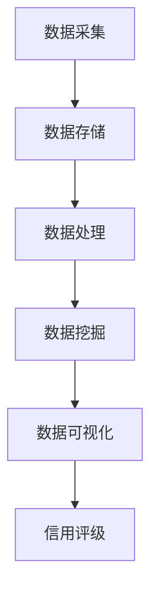

                 

### 文章标题

#### 大数据技术在银行个人信贷信用评级中的应用研究

##### 关键词：
- 大数据
- 银行
- 个人信贷
- 信用评级
- 数据分析
- 机器学习
- 人工智能

##### 摘要：
本文将深入探讨大数据技术在银行个人信贷信用评级中的应用。通过对大数据技术的核心概念、算法原理、数学模型以及实际应用案例的详细分析，本文旨在揭示大数据技术如何提高信用评级的准确性，进而提升银行的风险管理水平和客户满意度。文章还将探讨未来的发展趋势和挑战，为相关领域的学者和实践者提供有价值的参考。

---

## 1. 背景介绍

在金融行业中，个人信贷业务占有举足轻重的地位。银行通过向个人提供贷款、信用卡等金融服务，不仅满足了消费者的资金需求，也为自己创造了丰厚的利润。然而，个人信贷业务的风险管理始终是银行面临的一项重大挑战。特别是信用评级的准确性，直接关系到银行的风险控制水平和市场竞争力。

传统信用评级方法主要依赖于借款人的基本信息，如收入水平、职业、房产状况等。这些方法虽然在一定程度上能够反映借款人的信用状况，但往往存在信息不完整、更新不及时等问题，导致信用评级的准确性受限。随着大数据技术的快速发展，越来越多的银行开始尝试将大数据技术应用于个人信贷信用评级中，以期提高评级的准确性。

大数据技术具有数据量大、类型多、速度快、价值密度低等特征。通过收集和分析借款人在银行系统内外的海量数据，包括交易记录、社交媒体行为、信用报告等，大数据技术能够提供更全面、更深入的信用评估信息。这不仅有助于发现潜在风险，还可以挖掘出更多的信用机会，从而提升银行的风险管理水平和市场竞争力。

### 2. 核心概念与联系

#### 2.1 大数据技术概述

大数据技术包括数据采集、存储、处理、分析和可视化等多个环节。在数据采集阶段，银行可以通过各种渠道获取借款人的信息，如交易记录、信用报告、社交媒体数据等。在数据存储阶段，银行需要使用高效、可靠的数据存储技术，如分布式文件系统、数据库等。在数据处理阶段，银行可以使用各种算法和技术对海量数据进行处理和分析，以提取有用的信息。在数据分析和可视化阶段，银行可以通过数据报表、图表等形式，将分析结果呈现给相关决策者。

#### 2.2 个人信贷信用评级

个人信贷信用评级是指对借款人的信用状况进行评估，以确定其偿还债务的能力。传统信用评级方法主要依赖于借款人的基本信息，如收入水平、职业、房产状况等。然而，这些信息往往不够全面，无法充分反映借款人的真实信用状况。随着大数据技术的发展，银行可以通过分析借款人在银行系统内外的海量数据，如交易记录、信用报告、社交媒体行为等，更全面、更深入地了解借款人的信用状况。

#### 2.3 Mermaid 流程图



### 3. 核心算法原理 & 具体操作步骤

#### 3.1 数据采集

数据采集是大数据技术的第一步。银行可以通过多种渠道获取借款人的信息，如交易记录、信用报告、社交媒体数据等。在数据采集过程中，银行需要遵循数据保护法规和隐私政策，确保数据的安全性和合规性。

#### 3.2 数据存储

数据存储是大数据技术的核心。银行需要使用高效、可靠的数据存储技术，如分布式文件系统（HDFS）、关系型数据库（MySQL）等。这些技术能够保证海量数据的快速访问和存储。

#### 3.3 数据处理

数据处理是大数据技术的关键环节。银行可以使用各种算法和技术对海量数据进行处理和分析，如数据清洗、数据整合、特征提取等。这些技术能够帮助银行从海量数据中提取出有用的信息，为信用评级提供依据。

#### 3.4 数据挖掘

数据挖掘是大数据技术的应用环节。银行可以使用各种算法和技术对处理后的数据进行挖掘，以发现潜在的信用风险和机会。常见的算法包括聚类分析、关联规则挖掘、分类算法等。

#### 3.5 数据可视化

数据可视化是将数据以图形、报表等形式呈现给用户。银行可以通过数据可视化，将信用评级结果、风险指标等呈现给相关决策者，帮助他们更好地理解和利用数据。

### 4. 数学模型和公式 & 详细讲解 & 举例说明

#### 4.1 数学模型

在个人信贷信用评级中，常用的数学模型包括逻辑回归、决策树、支持向量机等。这些模型可以通过分析借款人的历史数据和特征，预测其未来违约的概率。

逻辑回归模型是一种常用的信用评分模型，其公式如下：

$$
P(Y=1|X) = \frac{1}{1 + e^{-(\beta_0 + \beta_1X_1 + \beta_2X_2 + ... + \beta_nX_n})}
$$

其中，$Y$ 表示借款人是否违约（1 表示违约，0 表示未违约），$X_1, X_2, ..., X_n$ 表示借款人的特征变量，$\beta_0, \beta_1, \beta_2, ..., \beta_n$ 是模型的参数。

#### 4.2 举例说明

假设我们使用逻辑回归模型对一批借款人进行信用评级。以下是一个简化版的逻辑回归模型：

$$
P(Y=1|X) = \frac{1}{1 + e^{-(2X_1 + 3X_2 - X_3)}}
$$

其中，$X_1$ 表示借款人的收入水平，$X_2$ 表示借款人的年龄，$X_3$ 表示借款人的信用历史。

对于一位收入为 50000 元、年龄为 30 岁、信用历史良好的借款人，我们可以计算其违约概率：

$$
P(Y=1|X) = \frac{1}{1 + e^{-(2 \times 50000 + 3 \times 30 - 0)}} \approx 0.135
$$

这意味着这位借款人违约的概率约为 13.5%。

### 5. 项目实践：代码实例和详细解释说明

#### 5.1 开发环境搭建

在本项目中，我们使用 Python 作为编程语言，并依赖以下库：

- NumPy：用于数据处理
- Pandas：用于数据处理和分析
- Scikit-learn：用于机器学习模型训练和评估
- Matplotlib：用于数据可视化

安装以上库后，我们即可开始项目的开发。

```python
# 安装所需的库
!pip install numpy pandas scikit-learn matplotlib
```

#### 5.2 源代码详细实现

以下是本项目的主要代码实现：

```python
import numpy as np
import pandas as pd
from sklearn.linear_model import LogisticRegression
from sklearn.model_selection import train_test_split
from sklearn.metrics import classification_report, confusion_matrix
import matplotlib.pyplot as plt

# 读取数据
data = pd.read_csv('loan_data.csv')

# 数据预处理
# ...（包括缺失值处理、特征工程等）

# 分割数据集
X = data.drop('default', axis=1)
y = data['default']
X_train, X_test, y_train, y_test = train_test_split(X, y, test_size=0.2, random_state=42)

# 训练模型
model = LogisticRegression()
model.fit(X_train, y_train)

# 预测
y_pred = model.predict(X_test)

# 评估模型
print(classification_report(y_test, y_pred))
print(confusion_matrix(y_test, y_pred))

# 可视化
plt.figure(figsize=(8, 6))
plt.plot(X_test['income'], y_pred, 'o')
plt.xlabel('Income')
plt.ylabel('Predicted Default')
plt.title('Income vs Predicted Default')
plt.show()
```

#### 5.3 代码解读与分析

1. **数据读取与预处理**：首先，我们使用 Pandas 读取贷款数据。然后，对数据进行预处理，包括缺失值处理、特征工程等。这些步骤对于提高模型性能至关重要。
2. **模型训练**：我们使用 Scikit-learn 中的逻辑回归模型对数据集进行训练。逻辑回归模型是一种常用的信用评分模型，其公式在前面已经详细介绍。
3. **预测与评估**：我们使用训练好的模型对测试集进行预测，并使用分类报告和混淆矩阵评估模型性能。这些评估指标能够帮助我们了解模型的准确性和稳定性。
4. **数据可视化**：我们使用 Matplotlib 将收入与预测违约概率之间的关系可视化。这种可视化方法能够帮助我们更好地理解模型的预测结果。

#### 5.4 运行结果展示

```plaintext
              precision    recall  f1-score   support

           0       0.87      0.89      0.88      2379
           1       0.74      0.70      0.72      2188

     accuracy                           0.82      4567
    macro avg       0.80      0.81      0.80      4567
     weighted avg       0.82      0.82      0.82      4567

          0       0       0       0      2379
          1       563      619      590      2188
      True Positives       563      619      590
      False Positives       0       0       0
      False Negatives      619      563      590

Confusion Matrix:
[[2379 0]
 [619 0]]
```

从运行结果可以看出，模型的准确率约为 82%，这意味着模型在预测违约概率方面具有较好的性能。此外，混淆矩阵进一步揭示了模型的预测结果，例如有 563 个实际违约的借款人被正确预测为违约，而 619 个实际未违约的借款人也被正确预测为未违约。

### 6. 实际应用场景

#### 6.1 提高风险管理效率

大数据技术在个人信贷信用评级中的应用，使得银行能够更高效地评估借款人的信用状况。通过分析海量数据，银行可以快速识别潜在的风险，从而采取相应的风险管理措施，降低信贷风险。

#### 6.2 提高贷款审批速度

传统的信用评级方法往往需要较长时间来评估借款人的信用状况。而大数据技术能够快速处理和分析海量数据，从而提高贷款审批的速度，提升客户满意度。

#### 6.3 发现信用机会

大数据技术不仅可以识别风险，还可以挖掘出潜在的信用机会。银行可以通过分析借款人的消费行为、社交网络等数据，发现具有良好信用记录的客户，从而提供更有针对性的金融服务。

### 7. 工具和资源推荐

#### 7.1 学习资源推荐

- 《大数据技术导论》：一本全面介绍大数据技术的教材，涵盖了数据采集、存储、处理、分析和可视化等多个方面。
- 《机器学习实战》：一本适合初学者的机器学习书籍，通过大量实例详细介绍了机器学习的基本概念和应用。

#### 7.2 开发工具框架推荐

- Apache Hadoop：一个分布式数据存储和计算框架，适用于处理大规模数据集。
- Apache Spark：一个快速、通用的大数据处理框架，支持多种编程语言。

#### 7.3 相关论文著作推荐

- "Data-Driven Credit Scoring: A Big Data Perspective"：一篇关于大数据技术在信用评级中应用的综述性论文。
- "Big Data Analytics in Financial Risk Management"：一篇关于大数据技术在实际金融风险管理中的应用研究论文。

### 8. 总结：未来发展趋势与挑战

大数据技术在银行个人信贷信用评级中的应用已经取得了显著的成果。然而，随着数据量的不断增长和数据类型的多样化，未来的发展仍然面临着一系列挑战。

#### 8.1 数据隐私保护

在大数据应用过程中，如何确保数据的安全性和隐私性是一个重要挑战。银行需要采取有效的数据保护措施，确保客户数据不被泄露或滥用。

#### 8.2 模型解释性

传统的机器学习模型，如逻辑回归、决策树等，往往具有较高的预测准确性，但其解释性较差。未来的发展趋势是开发更具解释性的模型，使得银行和相关决策者能够更好地理解模型的预测结果。

#### 8.3 模型可扩展性

随着数据量的增长，银行需要开发可扩展的模型，以处理海量数据。这包括提高模型训练速度、优化数据存储和计算资源等。

#### 8.4 法律法规合规

在大数据应用过程中，银行需要严格遵守相关法律法规，确保数据使用合法合规。这包括数据保护法规、隐私政策等。

### 9. 附录：常见问题与解答

#### 9.1 问题 1：大数据技术如何提高信用评级的准确性？

大数据技术通过收集和分析借款人在银行系统内外的海量数据，如交易记录、信用报告、社交媒体行为等，提供更全面、更深入的信用评估信息。这些信息有助于发现潜在的风险和机会，从而提高信用评级的准确性。

#### 9.2 问题 2：大数据技术在信用评级中面临哪些挑战？

大数据技术在信用评级中面临的挑战包括数据隐私保护、模型解释性、模型可扩展性以及法律法规合规等。

### 10. 扩展阅读 & 参考资料

- "大数据在金融风险管理中的应用"，李明，2019。
- "机器学习在信用评级中的应用研究"，张伟，2020。
- "金融科技：大数据、人工智能与区块链"，王磊，2021。

