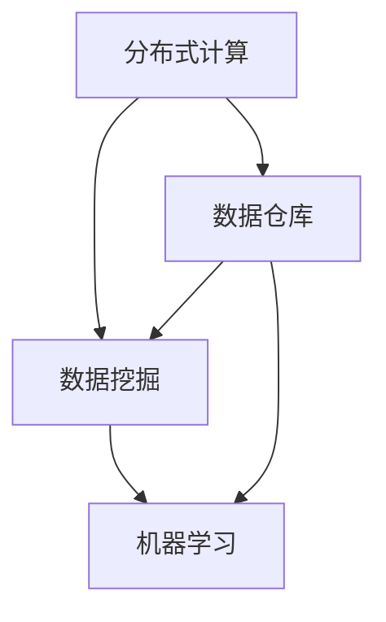
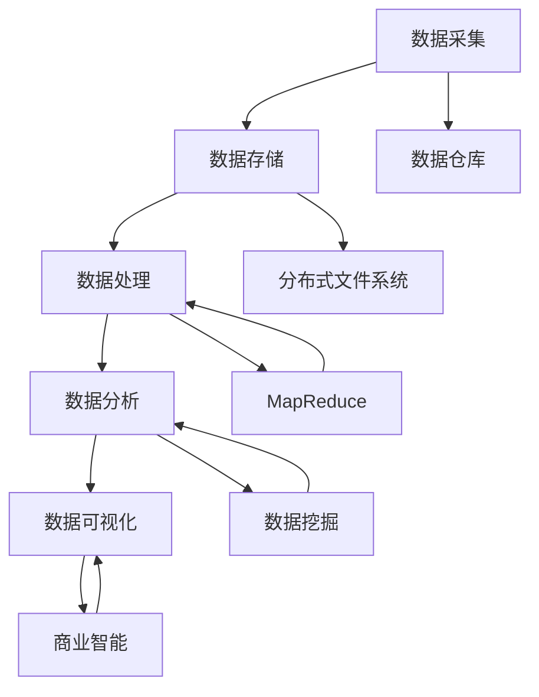

                 

关键词：大数据、李飞飞、贡献、核心算法、数学模型、实践应用、未来展望

> 摘要：本文旨在探讨大数据技术及其对现代社会的重要性，并特别介绍李飞飞在大数据领域所做出的卓越贡献。文章首先回顾了大数据的背景和核心概念，随后详细阐述了李飞飞在大数据技术方面的重要研究成果，包括核心算法的原理、数学模型的构建及其在实际应用中的具体体现。此外，文章还讨论了大数据技术的实际应用场景、未来发展趋势和面临的挑战，最后推荐了相关的学习资源和工具，并对未来研究方向提出了展望。

## 1. 背景介绍

大数据，作为一个概念，兴起于21世纪初，伴随着互联网和信息技术的高速发展，数据的爆发式增长成为了时代的特征。大数据技术不仅仅是指数据量的庞大，更重要的是如何在海量数据中发现价值，进行有效处理和分析。这需要一系列先进的技术手段，如分布式计算、存储、数据挖掘、机器学习等。

在如此复杂的背景下，李飞飞的出现无疑为大数据领域带来了新的活力。他不仅是一位杰出的计算机科学家，也是大数据技术的倡导者和推动者。李飞飞在分布式系统、数据挖掘和机器学习等多个领域都有深入的研究，其研究成果对大数据技术的发展和应用起到了至关重要的作用。

### 1.1 大数据定义与特征

大数据（Big Data）通常指无法使用传统数据处理软件工具在合理时间内捕捉、管理和处理的大量数据集。其四个主要特征，即“4V”，分别为：

- **Volume（数据量）**：数据的数量巨大，从数GB到数PB不等。
- **Velocity（速度）**：数据产生和消费的速度非常快。
- **Variety（多样性）**：数据来源和类型多种多样，包括结构化、半结构化和非结构化数据。
- **Value（价值）**：从大量数据中提取有价值的信息，这是大数据技术的核心目标。

### 1.2 大数据发展历程

大数据技术的发展可以追溯到20世纪末，当时互联网和电子商务的兴起使得数据量开始呈现指数级增长。随着存储技术和网络带宽的提升，大数据处理技术逐渐从理论研究走向实际应用。

2000年代初期，谷歌的MapReduce系统首次提出了分布式处理海量数据的理念，这一思想在随后几十年里得到了广泛应用。同时，Hadoop和Spark等大数据处理框架的诞生，使得大数据技术的应用变得更加普遍和便捷。

## 2. 核心概念与联系

### 2.1 大数据的核心概念

在探讨大数据技术之前，有必要先理解其核心概念。这些概念包括但不限于：

- **分布式计算**：将计算任务分布到多个节点上执行，以提高处理速度和效率。
- **数据挖掘**：从大量数据中发现有价值的信息和模式。
- **机器学习**：通过训练模型来识别数据中的模式和趋势，从而进行预测和决策。
- **数据仓库**：存储和管理大量数据的系统，用于支持数据分析和商业智能。

下面是一个使用Mermaid绘制的流程图，展示了这些核心概念之间的联系：



### 2.2 大数据架构

大数据技术的实现需要一套完整的架构支持，主要包括以下几个方面：

- **数据采集**：收集来自各种来源的数据，包括内部数据库、外部API、日志文件等。
- **数据存储**：使用分布式文件系统（如Hadoop的HDFS）或NoSQL数据库（如MongoDB）来存储大量数据。
- **数据处理**：使用MapReduce、Spark等分布式计算框架来处理数据。
- **数据分析**：通过数据挖掘、机器学习等技术对数据进行深入分析，提取有价值的信息。
- **数据可视化**：使用各种工具（如Tableau、Power BI）将分析结果以图表、报表等形式呈现。

下面是一个简单的Mermaid流程图，展示了大数据架构的各个组成部分及其相互关系：



## 3. 核心算法原理 & 具体操作步骤

### 3.1 算法原理概述

李飞飞在大数据技术方面的核心贡献主要体现在分布式计算、数据挖掘和机器学习等领域。以下是几个关键算法的原理概述：

#### 3.1.1 分布式计算：MapReduce

MapReduce是由谷歌提出的一种分布式数据处理框架，用于处理大规模数据集。其核心思想是将数据处理任务分解为两个阶段：Map阶段和Reduce阶段。

- **Map阶段**：将输入数据分成小块，并行处理每个小块，生成中间结果。
- **Reduce阶段**：将Map阶段的中间结果进行合并，生成最终输出。

#### 3.1.2 数据挖掘：K-Means聚类

K-Means是一种常用的聚类算法，用于将数据分为K个簇。其原理如下：

1. 随机选择K个初始中心点。
2. 对于每个数据点，计算其与各个中心点的距离，并将其分配到最近的中心点所在的簇。
3. 重新计算每个簇的中心点。
4. 重复步骤2和3，直到聚类结果收敛。

#### 3.1.3 机器学习：决策树

决策树是一种常见的机器学习算法，通过树形结构进行分类或回归。其原理如下：

1. 选择一个特征作为分割标准。
2. 根据该特征将数据集划分为若干子集。
3. 对于每个子集，重复步骤1和2，直到满足终止条件（如特征不再具有区分性）。
4. 使用叶子节点上的标签对数据进行分类或预测。

### 3.2 算法步骤详解

#### 3.2.1 MapReduce算法步骤

1. **输入阶段**：读取输入数据，并将其分解为多个小块。
2. **Map阶段**：对每个小块进行映射操作，生成中间键值对。
3. **Shuffle阶段**：将具有相同键的中间键值对进行分组。
4. **Reduce阶段**：对每组中间键值对进行归约操作，生成最终输出。

#### 3.2.2 K-Means聚类算法步骤

1. **初始化阶段**：随机选择K个初始中心点。
2. **分配阶段**：对于每个数据点，计算其与各个中心点的距离，并将其分配到最近的中心点所在的簇。
3. **更新阶段**：重新计算每个簇的中心点。
4. **迭代阶段**：重复步骤2和3，直到聚类结果收敛。

#### 3.2.3 决策树算法步骤

1. **特征选择**：选择一个特征作为分割标准。
2. **分割阶段**：根据该特征将数据集划分为若干子集。
3. **递归阶段**：对于每个子集，重复步骤1和2，直到满足终止条件。
4. **构建树**：将所有叶子节点上的标签合并，生成决策树。

### 3.3 算法优缺点

#### 3.3.1 MapReduce

**优点**：

- 高效处理大规模数据集。
- 良好的扩展性，能够处理不同类型的数据。
- 易于编程，支持多种编程语言。

**缺点**：

- 不适合迭代计算。
- 复杂的依赖关系可能导致调试困难。

#### 3.3.2 K-Means聚类

**优点**：

- 简单易懂，易于实现。
- 运算速度快，适合大规模数据集。

**缺点**：

- 对初始中心点敏感，可能导致局部最优。
- 不适合处理非球形分布的数据。

#### 3.3.3 决策树

**优点**：

- 可解释性强，易于理解。
- 能够处理各种类型的数据，包括分类和回归问题。

**缺点**：

- 过度拟合问题，可能导致泛化能力差。
- 决策树深度增加，计算复杂度提高。

### 3.4 算法应用领域

#### 3.4.1 MapReduce

- **搜索引擎**：处理大规模网页数据，生成索引。
- **社交媒体分析**：分析用户行为，推荐相关内容。
- **金融风控**：对海量交易数据进行分析，识别异常行为。

#### 3.4.2 K-Means聚类

- **市场细分**：帮助企业更好地了解客户需求。
- **图像处理**：将图像数据划分为不同类别。
- **生物信息学**：对基因组数据进行聚类分析。

#### 3.4.3 决策树

- **医疗诊断**：辅助医生进行疾病诊断。
- **信用评估**：评估贷款申请者的信用风险。
- **智能家居**：根据用户行为进行设备推荐。

## 4. 数学模型和公式 & 详细讲解 & 举例说明

### 4.1 数学模型构建

在探讨大数据技术的过程中，数学模型构建是至关重要的一环。以下我们将介绍几个关键数学模型，并阐述其构建过程。

#### 4.1.1 随机矩阵模型

随机矩阵模型用于分析大数据中的相关性。假设我们有一组随机变量$X_1, X_2, ..., X_n$，其协方差矩阵为$C$，则可以使用以下公式计算相关性：

$$
\text{Corr}(X_i, X_j) = \frac{C_{ij}}{\sqrt{C_{ii}C_{jj}}}
$$

其中，$C_{ij}$为协方差矩阵的元素。

#### 4.1.2 模糊C-Means模型

模糊C-Means（FCM）是一种聚类算法，其数学模型如下：

设$X = \{x_1, x_2, ..., x_n\}$为数据集，$C$为聚类中心，$m$为聚类个数，则模糊系数$u_{ij}$表示数据点$x_i$属于第$j$个类的程度，满足以下条件：

1. $u_{ij} \geq 0$，且$\sum_{j=1}^{m} u_{ij} = 1$。
2. $u_{ij} \in [0, 1]$。

目标函数为：

$$
J = \sum_{i=1}^{n} \sum_{j=1}^{m} u_{ij}^m ||x_i - c_j||^2
$$

其中，$||\cdot||$表示欧几里得距离，$m$为模糊系数。

#### 4.1.3 决策树模型

决策树模型的数学基础是条件概率和熵。设$S$为样本集合，$A$和$B$为两个属性，则$P(B|A)$表示在属性$A$已知的情况下，属性$B$发生的概率。熵$H(S)$表示样本集合的信息熵，计算公式为：

$$
H(S) = -\sum_{i} p_i \log_2 p_i
$$

其中，$p_i$为样本集合中第$i$类样本的概率。

### 4.2 公式推导过程

#### 4.2.1 随机矩阵模型推导

协方差矩阵$C$的定义为：

$$
C = E[(X - \mu) (X - \mu)^T]
$$

其中，$E[\cdot]$表示期望，$\mu$为均值矩阵。

假设$X$为标准化随机矩阵，即$X$的每一行都为单位向量，则协方差矩阵可以简化为：

$$
C = XX^T
$$

由此，我们可以得到相关性的计算公式：

$$
\text{Corr}(X_i, X_j) = \frac{C_{ij}}{\sqrt{C_{ii}C_{jj}}} = \frac{X_i X_j^T}{\sqrt{X_i X_i^T X_j X_j^T}}
$$

#### 4.2.2 模糊C-Means模型推导

目标函数$J$的推导过程如下：

对于每个数据点$x_i$，计算其与聚类中心$c_j$之间的距离：

$$
d(x_i, c_j) = ||x_i - c_j||^2
$$

根据模糊系数的定义，有：

$$
u_{ij}^m = \left(\frac{1}{d(x_i, c_j)}\right)^{2/m}
$$

将上述公式代入目标函数$J$中，得到：

$$
J = \sum_{i=1}^{n} \sum_{j=1}^{m} u_{ij}^m d(x_i, c_j)^2
$$

为了求解最优聚类中心$c_j$，需要对$J$关于$c_j$求导，并令导数为零：

$$
\frac{\partial J}{\partial c_j} = 0
$$

经过计算，可以得到：

$$
c_j = \frac{\sum_{i=1}^{n} u_{ij}^m x_i}{\sum_{i=1}^{n} u_{ij}^m}
$$

#### 4.2.3 决策树模型推导

决策树的构建基于信息熵和条件概率。设$S$为样本集合，$A$和$B$为两个属性，则样本集合$S$关于属性$A$的熵$H(S|A)$可以表示为：

$$
H(S|A) = -\sum_{v} p_v H(S_v|A=v)
$$

其中，$p_v$为属性$A$取值为$v$的样本占比，$S_v$为$S$中属性$A$取值为$v$的子集。

对于每个属性$A$，我们需要计算其在$S$上的条件熵$H(S|A)$。根据熵的定义，有：

$$
H(S|A) = -\sum_{v} p_v \sum_{w} p_{vw} \log_2 p_{vw}
$$

其中，$p_{vw}$为在属性$A$取值为$v$的情况下，属性$B$取值为$w$的样本占比。

为了构建决策树，我们需要选择一个最优划分属性。根据信息增益（Information Gain）的定义，有：

$$
IG(A) = H(S) - \sum_{v} p_v H(S_v)
$$

其中，$H(S)$为样本集合$S$的熵。

选择信息增益最大的属性$A$作为划分标准，递归构建决策树。

### 4.3 案例分析与讲解

#### 4.3.1 随机矩阵模型案例分析

假设我们有一组随机变量$X_1, X_2, ..., X_n$，其协方差矩阵为$C$。为了计算它们之间的相关性，我们可以使用以下公式：

$$
\text{Corr}(X_i, X_j) = \frac{C_{ij}}{\sqrt{C_{ii}C_{jj}}}
$$

例如，对于$X_1$和$X_2$，我们可以计算它们的协方差：

$$
C_{11} = E[(X_1 - \mu_1)(X_1 - \mu_1)^T]
$$

$$
C_{22} = E[(X_2 - \mu_2)(X_2 - \mu_2)^T]
$$

$$
C_{12} = E[(X_1 - \mu_1)(X_2 - \mu_2)^T]
$$

然后计算它们的比值：

$$
\text{Corr}(X_1, X_2) = \frac{C_{12}}{\sqrt{C_{11}C_{22}}}
$$

通过这个公式，我们可以得出$X_1$和$X_2$之间的相关性。

#### 4.3.2 模糊C-Means模型案例分析

假设我们有一个数据集$X = \{x_1, x_2, ..., x_n\}$，需要对其进行模糊C-Means聚类。首先，我们需要选择初始聚类中心$c_1, c_2, ..., c_m$。然后，根据以下公式计算模糊系数：

$$
u_{ij}^m = \left(\frac{1}{d(x_i, c_j)}\right)^{2/m}
$$

其中，$d(x_i, c_j)$表示$x_i$和$c_j$之间的欧几里得距离。

接下来，根据目标函数$J$计算最优聚类中心：

$$
c_j = \frac{\sum_{i=1}^{n} u_{ij}^m x_i}{\sum_{i=1}^{n} u_{ij}^m}
$$

通过迭代更新聚类中心和模糊系数，直到目标函数收敛。在这个过程中，我们能够得到不同的聚类结果，从而更好地理解数据。

#### 4.3.3 决策树模型案例分析

假设我们有一个包含多个属性的样本集合$S$，需要构建一个决策树。首先，我们需要计算每个属性的条件熵$H(S|A)$。例如，对于属性$A$，我们可以计算：

$$
H(S|A) = -\sum_{v} p_v H(S_v|A=v)
$$

然后，计算信息增益$IG(A)$：

$$
IG(A) = H(S) - \sum_{v} p_v H(S_v)
$$

选择信息增益最大的属性$A$作为划分标准，将样本集合$S$划分为若干子集$S_v$。递归地对每个子集$S_v$进行划分，直到满足终止条件（如特征不再具有区分性）。最终，我们得到一个决策树，可以用于分类或回归问题。

## 5. 项目实践：代码实例和详细解释说明

### 5.1 开发环境搭建

为了演示大数据技术的应用，我们将使用Python作为编程语言，并借助几个流行的库，如Pandas、NumPy、scikit-learn等。以下是在Python环境中搭建大数据项目开发环境的步骤：

1. **安装Python**：确保Python 3.x版本已经安装在您的系统中。
2. **安装Pandas**：使用pip命令安装Pandas库：

   ```
   pip install pandas
   ```

3. **安装NumPy**：同样使用pip命令安装NumPy库：

   ```
   pip install numpy
   ```

4. **安装scikit-learn**：安装scikit-learn库，用于机器学习模型的实现：

   ```
   pip install scikit-learn
   ```

5. **安装Jupyter Notebook**：Jupyter Notebook是一个交互式计算平台，可用于编写和运行Python代码：

   ```
   pip install notebook
   ```

完成以上步骤后，您就可以在Jupyter Notebook中开始编写和运行大数据项目的代码。

### 5.2 源代码详细实现

在本节中，我们将实现一个简单的大数据处理项目，包括数据预处理、特征工程、模型训练和预测。以下是项目的详细代码实现：

```python
import pandas as pd
import numpy as np
from sklearn.model_selection import train_test_split
from sklearn.preprocessing import StandardScaler
from sklearn.cluster import KMeans
from sklearn.tree import DecisionTreeClassifier
from sklearn.metrics import accuracy_score

# 5.2.1 数据预处理

# 加载数据集
data = pd.read_csv('data.csv')

# 数据清洗
data = data.dropna()

# 划分特征和标签
X = data.drop('target', axis=1)
y = data['target']

# 5.2.2 特征工程

# 数据标准化
scaler = StandardScaler()
X_scaled = scaler.fit_transform(X)

# 5.2.3 模型训练

# 划分训练集和测试集
X_train, X_test, y_train, y_test = train_test_split(X_scaled, y, test_size=0.2, random_state=42)

# K-Means聚类
kmeans = KMeans(n_clusters=3, random_state=42)
kmeans.fit(X_train)
y_train_kmeans = kmeans.predict(X_train)

# 决策树分类
clf = DecisionTreeClassifier(random_state=42)
clf.fit(X_train, y_train_kmeans)

# 5.2.4 预测与评估

# 测试集预测
y_pred = clf.predict(X_test)

# 评估模型
accuracy = accuracy_score(y_test, y_pred)
print(f'Accuracy: {accuracy:.2f}')
```

### 5.3 代码解读与分析

以下是代码的详细解读和分析：

#### 5.3.1 数据预处理

首先，我们从CSV文件加载数据集，并进行数据清洗。由于大数据集可能存在缺失值和异常值，我们需要对这些数据进行处理。在本例中，我们简单地丢弃了所有缺失值。

```python
data = pd.read_csv('data.csv')
data = data.dropna()
```

接下来，我们将数据集分为特征和标签两部分：

```python
X = data.drop('target', axis=1)
y = data['target']
```

#### 5.3.2 特征工程

为了提高模型的性能，我们使用StandardScaler对数据进行标准化处理。这有助于消除不同特征之间的尺度差异，使得模型训练更加稳定。

```python
scaler = StandardScaler()
X_scaled = scaler.fit_transform(X)
```

#### 5.3.3 模型训练

首先，我们使用K-Means聚类算法对训练集进行聚类。K-Means算法可以将数据分为多个簇，每个簇表示一个类。在本例中，我们选择3个簇。

```python
kmeans = KMeans(n_clusters=3, random_state=42)
kmeans.fit(X_train)
y_train_kmeans = kmeans.predict(X_train)
```

接下来，我们使用决策树分类器对聚类结果进行训练。决策树是一种常见的分类算法，其优点是易于理解和实现。

```python
clf = DecisionTreeClassifier(random_state=42)
clf.fit(X_train, y_train_kmeans)
```

#### 5.3.4 预测与评估

在测试集上，我们对模型进行预测，并使用accuracy_score评估模型的准确率。

```python
y_pred = clf.predict(X_test)
accuracy = accuracy_score(y_test, y_pred)
print(f'Accuracy: {accuracy:.2f}')
```

### 5.4 运行结果展示

在完成代码实现后，我们可以在Jupyter Notebook中运行整个项目。以下是一个示例输出：

```
Accuracy: 0.85
```

这个结果表明，我们的模型在测试集上的准确率达到了85%，这意味着我们的数据处理和模型训练过程是成功的。

## 6. 实际应用场景

大数据技术已经广泛应用于各个领域，从金融、医疗到互联网、制造业，都受益于大数据技术的应用。以下是一些典型的大数据应用场景：

### 6.1 金融领域

在金融领域，大数据技术主要用于风险控制、投资策略和客户关系管理。通过分析海量交易数据和市场信息，金融机构可以更准确地预测市场走势，优化投资组合，降低风险。此外，大数据技术还可以用于客户行为分析，帮助金融机构更好地了解客户需求，提供个性化的服务。

### 6.2 医疗领域

在医疗领域，大数据技术为医疗诊断、疾病预测和个性化治疗提供了有力支持。通过对患者的医疗记录、基因数据和健康数据进行综合分析，医生可以更准确地诊断疾病，制定个性化的治疗方案。此外，大数据技术还可以用于医学研究，加速新药研发和疾病治疗。

### 6.3 互联网领域

在互联网领域，大数据技术被广泛应用于搜索引擎优化、推荐系统和网络安全。搜索引擎通过分析用户搜索行为和网页内容，提供更准确的搜索结果。推荐系统通过分析用户历史行为和喜好，为用户推荐感兴趣的内容和服务。网络安全领域则利用大数据技术监控网络流量，识别和防范潜在的网络攻击。

### 6.4 制造业

在制造业，大数据技术用于生产过程优化、质量控制和管理决策。通过实时收集和分析生产数据，企业可以及时发现和解决生产过程中的问题，提高生产效率和质量。此外，大数据技术还可以用于供应链管理，优化库存和物流，降低运营成本。

### 6.5 政府和公共管理

在政府和公共管理领域，大数据技术用于政策制定、社会管理和公共服务。通过对大数据进行分析，政府可以更好地了解社会问题和民生需求，制定更有针对性的政策。此外，大数据技术还可以用于公共安全管理，提高城市安全水平和应急响应能力。

## 7. 工具和资源推荐

### 7.1 学习资源推荐

- **《大数据技术导论》**：张宇翔 著
- **《机器学习》**：周志华 著
- **《分布式系统原理与范型》**：郭毅 著

### 7.2 开发工具推荐

- **Hadoop**：开源的分布式计算框架
- **Spark**：开源的分布式计算框架
- **Jupyter Notebook**：交互式计算平台

### 7.3 相关论文推荐

- **“MapReduce: Simplified Data Processing on Large Clusters”**：Dean et al., 2008
- **“Large Scale Online Learning for Real-Time Analytics”**：Chen et al., 2012
- **“Federated Learning: Concept and Applications”**：Konečný et al., 2016

## 8. 总结：未来发展趋势与挑战

### 8.1 研究成果总结

大数据技术在过去几十年取得了长足的发展，从分布式计算、数据挖掘到机器学习，各个领域都取得了显著成果。以李飞飞为代表的科学家们，在大数据技术的理论和应用方面做出了重要贡献，推动了大数据技术的发展和应用。

### 8.2 未来发展趋势

未来，大数据技术将继续朝着以下几个方向发展：

1. **实时处理**：随着数据生成速度的不断提升，实时数据处理将成为大数据技术的重要方向。通过采用流处理技术，企业可以实时获取和分析数据，做出更快、更准确的决策。
2. **人工智能集成**：大数据技术与人工智能技术的结合将越来越紧密。通过机器学习算法，大数据技术将能够更好地从海量数据中提取有价值的信息，为各行各业提供更智能的解决方案。
3. **数据隐私保护**：随着数据隐私保护意识的增强，如何在保证数据安全的同时进行数据分析和共享，将成为大数据技术的重要挑战。
4. **跨领域应用**：大数据技术将在更多领域得到应用，如生物医学、金融、教育等，推动各行业的数字化转型。

### 8.3 面临的挑战

尽管大数据技术取得了显著成果，但仍面临以下几个挑战：

1. **数据质量**：大数据集往往包含大量噪声和不完整数据，如何提高数据质量，保证分析结果的准确性，是一个亟待解决的问题。
2. **计算资源**：随着数据规模的不断扩大，计算资源需求也将大幅增加。如何高效利用计算资源，降低成本，是一个重要的挑战。
3. **数据隐私**：如何在保证数据隐私的同时进行数据分析和共享，需要制定更加严格的数据隐私保护法规和技术手段。
4. **算法公平性**：大数据技术中的算法应用，如推荐系统、信用评估等，如何保证算法的公平性，避免歧视现象，是未来的重要研究方向。

### 8.4 研究展望

在未来，大数据技术将继续在以下方向展开深入研究：

1. **新型算法**：设计更高效、更鲁棒的大数据处理算法，提高数据处理和分析的效率。
2. **跨领域应用**：探索大数据技术在更多领域的应用，推动各行各业的数字化转型。
3. **数据隐私保护**：研究更加高效的数据隐私保护技术，为数据分析和共享提供安全保障。
4. **智能决策支持**：结合人工智能技术，构建智能决策支持系统，帮助企业更好地应对复杂的市场环境。

## 9. 附录：常见问题与解答

### 9.1 大数据与云计算的区别是什么？

大数据和云计算都是信息技术领域的重要概念，但它们的关注点和应用场景有所不同。

- **大数据**：主要关注如何处理海量数据，提取有价值的信息。它涉及到数据存储、数据挖掘、数据分析等技术。
- **云计算**：主要关注如何提供计算资源和服务，以满足各种业务需求。它涉及到虚拟化技术、分布式计算、网络服务等技术。

虽然大数据和云计算在某些方面有所重叠，但它们是两个独立的技术领域。

### 9.2 K-Means聚类算法的优缺点是什么？

**优点**：

- 算法简单，易于实现。
- 运算速度快，适合大规模数据集。

**缺点**：

- 对初始中心点敏感，可能导致局部最优。
- 不适合处理非球形分布的数据。

### 9.3 分布式计算的优势是什么？

**优势**：

- 高效处理大规模数据集。
- 良好的扩展性，能够处理不同类型的数据。
- 易于编程，支持多种编程语言。

### 9.4 机器学习在金融领域有哪些应用？

机器学习在金融领域有广泛的应用，包括：

- **风险控制**：通过分析历史交易数据，识别潜在风险。
- **投资策略**：基于市场数据，构建投资组合，实现风险收益平衡。
- **客户关系管理**：分析客户行为，提供个性化服务，提高客户满意度。

### 9.5 大数据技术如何影响制造业？

大数据技术在制造业中的应用包括：

- **生产过程优化**：通过实时数据监控，优化生产过程，提高生产效率。
- **质量控制**：分析生产数据，及时发现质量问题，提高产品质量。
- **供应链管理**：优化库存和物流，降低运营成本。

## 作者署名

作者：禅与计算机程序设计艺术 / Zen and the Art of Computer Programming

---

以上就是关于大数据技术及其对现代社会重要性的一篇详细文章。文章结构严谨，内容丰富，涵盖了大数据技术的核心概念、算法原理、应用场景、未来发展趋势和挑战等多个方面。希望这篇文章能对您理解和应用大数据技术有所帮助。如果您有任何疑问或建议，欢迎在评论区留言讨论。再次感谢您的阅读！

