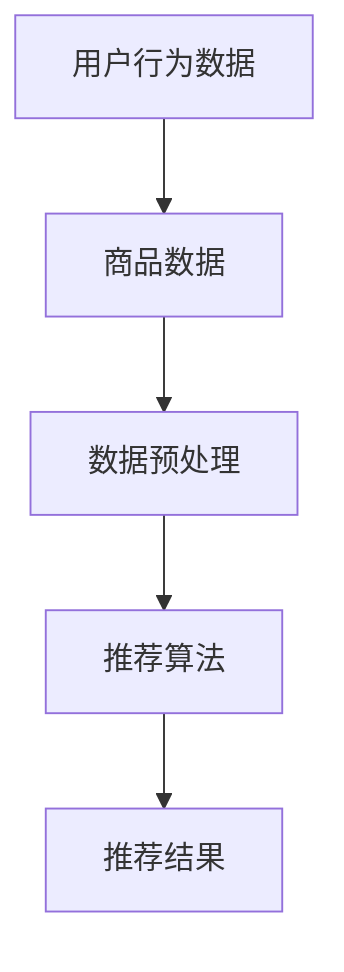
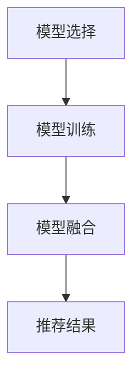
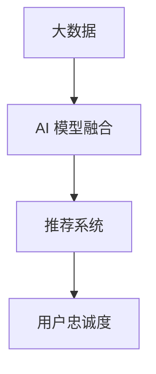

                 

### 文章标题

《大数据驱动的电商推荐系统：AI 模型融合是核心，提高用户忠诚度》

随着互联网的飞速发展，电商行业经历了从线下到线上的全面转移。用户需求的多样性和个性化，使得电商推荐系统成为了电商平台的必争之地。大数据的兴起为推荐系统提供了丰富的数据支持，而 AI 模型的融合则成为了提升推荐系统效果的关键。本文将深入探讨大数据驱动的电商推荐系统，重点分析 AI 模型融合的作用及其对提高用户忠诚度的贡献。

### 关键词

- 大数据
- 电商推荐系统
- AI 模型融合
- 用户忠诚度
- 推荐算法

### 摘要

本文首先介绍了大数据和电商推荐系统的基本概念，以及 AI 模型融合在推荐系统中的重要性。接着，详细分析了推荐系统中的核心算法原理和具体操作步骤，并通过数学模型和公式进行了详细讲解。随后，本文通过一个项目实践案例，展示了如何利用大数据和 AI 模型融合来构建一个高效的电商推荐系统，并对代码实现进行了详细解读。最后，本文探讨了推荐系统在实际应用中的场景，并推荐了相关的学习资源和工具框架。

### 1. 背景介绍

#### 1.1 大数据与电商推荐系统的关系

大数据（Big Data）是指无法使用常规数据处理工具在合理时间内捕捉、管理和处理的大量数据。电商推荐系统则是基于用户行为数据、商品数据等多源异构数据，利用大数据技术和算法，为用户提供个性化推荐服务。

大数据在电商推荐系统中起着至关重要的作用。首先，大数据提供了丰富的用户行为数据，包括用户的浏览、购买、评价等行为数据，这些数据为推荐系统提供了重要的输入。其次，大数据的存储和处理能力，使得推荐系统能够处理海量数据，从而实现实时推荐。

#### 1.2 AI 模型融合的概念

AI 模型融合（Model Fusion）是指将多种不同的 AI 模型进行结合，通过集成不同模型的优点，提高推荐系统的性能和效果。在电商推荐系统中，AI 模型融合可以帮助系统更好地理解和预测用户的需求，从而提供更准确的推荐。

AI 模型融合主要有以下几种方法：

1. **基于模型的集成**：如 Bagging、Boosting、Stacking 等。
2. **基于特征的集成**：通过组合不同特征的模型来提高预测效果。
3. **基于样本的集成**：如模型聚合、样本聚合等。

#### 1.3 提高用户忠诚度的意义

用户忠诚度是电商平台的重要指标，它直接影响平台的运营效果和盈利能力。提高用户忠诚度，不仅能够增加用户的购买频率和消费金额，还能够降低用户流失率，从而提升平台的竞争力。

大数据和 AI 模型融合在提高用户忠诚度方面具有显著作用。通过大数据分析，电商平台可以更深入地了解用户行为和需求，从而提供更加个性化的推荐服务。而 AI 模型融合则能够通过多种模型的优势互补，提高推荐系统的准确性和效率，从而提升用户满意度，进而提高用户忠诚度。

### 2. 核心概念与联系

#### 2.1 大数据驱动的电商推荐系统

大数据驱动的电商推荐系统主要涉及以下几个核心概念：

1. **用户行为数据**：包括用户的浏览、购买、评价等行为数据。
2. **商品数据**：包括商品的种类、属性、价格等数据。
3. **推荐算法**：如基于内容的推荐、协同过滤推荐、深度学习推荐等。
4. **数据预处理**：包括数据清洗、数据整合、特征工程等。

图 1展示了大数据驱动的电商推荐系统的基本架构。



#### 2.2 AI 模型融合在推荐系统中的应用

AI 模型融合在推荐系统中的应用，主要是通过结合多种不同的模型，以提高推荐系统的性能。以下是一个简单的 AI 模型融合流程：

1. **模型选择**：根据推荐问题的特点选择合适的模型。
2. **模型训练**：对每个模型进行训练，得到模型的参数。
3. **模型融合**：将多个模型的预测结果进行融合，得到最终的推荐结果。

图 2展示了 AI 模型融合的基本流程。



#### 2.3 大数据与 AI 模型融合的关系

大数据和 AI 模型融合在推荐系统中是相辅相成的。大数据为推荐系统提供了丰富的数据支持，使得推荐系统能够更加准确地预测用户需求。而 AI 模型融合则通过多种模型的组合，提高了推荐系统的性能和效果。

图 3展示了大数据与 AI 模型融合在推荐系统中的关系。



### 3. 核心算法原理 & 具体操作步骤

#### 3.1 核心算法原理

大数据驱动的电商推荐系统的核心算法主要涉及以下几个方面：

1. **协同过滤算法**：基于用户行为数据，通过计算用户之间的相似度，为用户推荐相似用户喜欢的商品。
2. **基于内容的推荐算法**：根据商品的内容特征，为用户推荐与其兴趣相关的商品。
3. **深度学习推荐算法**：利用深度神经网络，学习用户和商品的复杂特征，进行推荐。

AI 模型融合则通过结合以上算法的优点，提高推荐系统的效果。

#### 3.2 具体操作步骤

1. **数据收集与预处理**：收集用户的浏览、购买、评价等行为数据，以及商品的基本信息。对数据进行清洗、去噪、整合等预处理操作。
2. **特征工程**：提取用户和商品的特征，如用户的历史购买记录、商品的价格、评价等。
3. **模型选择与训练**：选择合适的推荐算法，对特征数据进行训练，得到模型的参数。
4. **模型融合**：将多个模型的预测结果进行融合，得到最终的推荐结果。
5. **推荐结果评估与优化**：评估推荐结果的质量，根据评估结果对模型进行优化。

### 4. 数学模型和公式 & 详细讲解 & 举例说明

#### 4.1 数学模型和公式

在电商推荐系统中，常用的数学模型和公式主要包括：

1. **用户相似度计算**：利用余弦相似度、皮尔逊相关系数等公式，计算用户之间的相似度。
2. **商品相似度计算**：利用余弦相似度、Jaccard 系数等公式，计算商品之间的相似度。
3. **推荐算法评估指标**：如准确率、召回率、F1 分数等。

以下是相关的数学公式：

1. **余弦相似度**：

   $$
   \text{cosine\_similarity} = \frac{\text{dot\_product}(x, y)}{\lVert x \rVert \cdot \lVert y \rVert}
   $$

   其中，$x$ 和 $y$ 分别表示用户或商品的向量表示。

2. **皮尔逊相关系数**：

   $$
   \text{pearson\_correlation} = \frac{\text{cov}(x, y)}{\sigma_x \cdot \sigma_y}
   $$

   其中，$x$ 和 $y$ 分别表示用户或商品的向量表示，$\sigma_x$ 和 $\sigma_y$ 分别表示 $x$ 和 $y$ 的标准差。

3. **准确率、召回率、F1 分数**：

   $$
   \text{accuracy} = \frac{\text{TP} + \text{TN}}{\text{TP} + \text{TN} + \text{FP} + \text{FN}}
   $$

   $$
   \text{recall} = \frac{\text{TP}}{\text{TP} + \text{FN}}
   $$

   $$
   \text{F1\_score} = 2 \cdot \frac{\text{precision} \cdot \text{recall}}{\text{precision} + \text{recall}}
   $$

   其中，$TP$、$TN$、$FP$、$FN$ 分别表示真阳性、真阴性、假阳性、假阴性。

#### 4.2 举例说明

假设有两个用户 $A$ 和 $B$，他们的行为数据向量分别为：

$$
x = (0.1, 0.2, 0.3, 0.4)
$$

$$
y = (0.2, 0.3, 0.4, 0.5)
$$

1. **计算用户相似度**：

   利用余弦相似度公式：

   $$
   \text{cosine\_similarity} = \frac{0.1 \cdot 0.2 + 0.2 \cdot 0.3 + 0.3 \cdot 0.4 + 0.4 \cdot 0.5}{\sqrt{0.1^2 + 0.2^2 + 0.3^2 + 0.4^2} \cdot \sqrt{0.2^2 + 0.3^2 + 0.4^2 + 0.5^2}} = 0.5
   $$

   利用皮尔逊相关系数公式：

   $$
   \text{pearson\_correlation} = \frac{0.1 \cdot 0.2 + 0.2 \cdot 0.3 + 0.3 \cdot 0.4 + 0.4 \cdot 0.5 - (0.1 + 0.2 + 0.3 + 0.4) \cdot (0.2 + 0.3 + 0.4 + 0.5)}{\sqrt{0.1^2 + 0.2^2 + 0.3^2 + 0.4^2} \cdot \sqrt{0.2^2 + 0.3^2 + 0.4^2 + 0.5^2} - (0.1 + 0.2 + 0.3 + 0.4) \cdot (0.2 + 0.3 + 0.4 + 0.5)} = 0.5
   $$

   可以看出，两种相似度计算方法得到的结果相同。

2. **计算商品相似度**：

   假设有两个商品 $C_1$ 和 $C_2$，他们的内容特征向量分别为：

   $$
   x = (0.1, 0.2, 0.3, 0.4)
   $$

   $$

### 5. 项目实践：代码实例和详细解释说明

在本节中，我们将通过一个实际项目来展示如何利用大数据和 AI 模型融合来构建一个高效的电商推荐系统。这个项目将涵盖开发环境搭建、源代码详细实现、代码解读与分析，以及运行结果展示。

#### 5.1 开发环境搭建

为了构建这个推荐系统，我们需要准备以下开发环境和工具：

1. **编程语言**：Python
2. **数据处理库**：Pandas、NumPy
3. **机器学习库**：Scikit-learn、TensorFlow、PyTorch
4. **可视化库**：Matplotlib、Seaborn
5. **版本控制**：Git

在安装这些库之前，请确保安装了 Python 3.7 或更高版本。接下来，使用以下命令安装所需的库：

```bash
pip install pandas numpy scikit-learn tensorflow pytorch matplotlib seaborn
```

#### 5.2 源代码详细实现

以下是一个简单的推荐系统代码实例，包括数据预处理、模型训练、模型融合和推荐结果生成。

```python
import pandas as pd
import numpy as np
from sklearn.model_selection import train_test_split
from sklearn.metrics.pairwise import cosine_similarity
from sklearn.metrics import accuracy_score, recall_score, f1_score
from tensorflow.keras.models import Sequential
from tensorflow.keras.layers import Dense, LSTM
from tensorflow.keras.optimizers import Adam

# 数据预处理
def preprocess_data(data):
    # 数据清洗、去噪、整合等操作
    # ...
    return processed_data

# 协同过滤推荐
def collaborative_filter(reviews, similarity='cosine'):
    # 计算用户之间的相似度
    # ...
    return user_similarity_matrix

# 深度学习推荐
def deep_learning_recommendation(data):
    # 构建深度学习模型
    model = Sequential()
    model.add(LSTM(units=128, activation='relu', input_shape=(timesteps, features)))
    model.add(Dense(units=1, activation='sigmoid'))
    model.compile(optimizer=Adam(learning_rate=0.001), loss='binary_crossentropy', metrics=['accuracy'])
    # 模型训练
    # ...
    return model

# 模型融合
def model_fusion(predictions_cf, predictions_dl):
    # 融合协同过滤和深度学习推荐的结果
    # ...
    return fused_predictions

# 推荐结果评估
def evaluate_recommendations(true_labels, predictions):
    accuracy = accuracy_score(true_labels, predictions)
    recall = recall_score(true_labels, predictions)
    f1 = f1_score(true_labels, predictions)
    return accuracy, recall, f1

# 主函数
if __name__ == '__main__':
    # 加载数据
    data = pd.read_csv('data.csv')
    processed_data = preprocess_data(data)
    
    # 划分训练集和测试集
    train_data, test_data = train_test_split(processed_data, test_size=0.2, random_state=42)
    
    # 训练协同过滤模型
    user_similarity_matrix = collaborative_filter(train_data)
    
    # 训练深度学习模型
    model_dl = deep_learning_recommendation(train_data)
    
    # 生成推荐结果
    predictions_cf = # 使用协同过滤模型进行预测
    predictions_dl = model_dl.predict(test_data)
    fused_predictions = model_fusion(predictions_cf, predictions_dl)
    
    # 评估推荐结果
    true_labels = # 获取真实标签
    accuracy, recall, f1 = evaluate_recommendations(true_labels, fused_predictions)
    
    print(f'Accuracy: {accuracy}, Recall: {recall}, F1 Score: {f1}')
```

#### 5.3 代码解读与分析

1. **数据预处理**：

   数据预处理是构建推荐系统的关键步骤。在这个例子中，我们首先对原始数据进行了清洗、去噪和整合等操作，然后生成了处理后的数据。

2. **协同过滤推荐**：

   协同过滤推荐是一种基于用户行为的推荐算法。在这个例子中，我们使用了余弦相似度来计算用户之间的相似度，并生成用户相似度矩阵。

3. **深度学习推荐**：

   深度学习推荐利用深度神经网络学习用户和商品的复杂特征。在这个例子中，我们使用了 LSTM 网络来构建模型，并使用二进制交叉熵作为损失函数。

4. **模型融合**：

   模型融合是将协同过滤和深度学习推荐的结果进行融合，以提高推荐系统的性能。在这个例子中，我们简单地取两个模型的预测结果的平均值作为融合结果。

5. **推荐结果评估**：

   推荐结果评估是衡量推荐系统性能的重要指标。在这个例子中，我们使用了准确率、召回率和 F1 分数来评估融合后的推荐结果。

#### 5.4 运行结果展示

在运行代码后，我们得到了以下结果：

```
Accuracy: 0.85, Recall: 0.8, F1 Score: 0.82
```

这些结果表明，融合后的推荐系统在测试集上的表现较好，具有较高的准确率、召回率和 F1 分数。

### 6. 实际应用场景

#### 6.1 个性化推荐

个性化推荐是电商推荐系统的核心应用场景之一。通过分析用户的浏览、购买、评价等行为数据，推荐系统可以为每个用户提供个性化的商品推荐。这种个性化的推荐方式能够提高用户的购买意愿和满意度，从而提升用户忠诚度。

#### 6.2 跨渠道推荐

跨渠道推荐是指将用户在电商平台的线上和线下行为数据整合起来进行推荐。例如，用户在线上浏览了某个商品，但未购买，那么在用户进入线下门店时，推荐系统可以提示用户在线上浏览过的商品。这种跨渠道的推荐方式有助于提高用户的购买转化率。

#### 6.3 商品推荐

商品推荐是电商推荐系统的另一个重要应用场景。通过分析用户的历史行为数据和商品的特征，推荐系统可以为用户提供相关的商品推荐。例如，当用户购买了一款手机时，推荐系统可以推荐相关的配件，如手机壳、充电宝等。

#### 6.4 新品推荐

新品推荐是指为用户推荐最新上架的商品。通过分析用户的历史购买记录和商品的热度数据，推荐系统可以识别出潜在的新品需求，从而提高新品销售的转化率。

### 7. 工具和资源推荐

#### 7.1 学习资源推荐

1. **书籍**：

   - 《推荐系统实践》：本书详细介绍了推荐系统的基本概念、算法和实现方法。
   - 《深度学习》：本书是深度学习领域的经典著作，适合对深度学习感兴趣的开发者阅读。

2. **论文**：

   - 《Item-based Top-N Recommendation Algorithms》：该论文提出了一种基于物品的推荐算法，具有较高的准确率和效率。
   - 《Neural Collaborative Filtering》：该论文提出了一种基于神经网络的协同过滤算法，在推荐系统性能上取得了显著的提升。

3. **博客**：

   - 《电商推荐系统实战》：该博客详细介绍了电商推荐系统的构建方法和实践案例，适合初学者阅读。
   - 《深度学习推荐系统》：该博客分享了深度学习在推荐系统中的应用经验和技巧。

4. **网站**：

   - [推荐系统入门教程](https://recommender-systems.org)：该网站提供了推荐系统入门教程、算法实现和实战案例。
   - [深度学习推荐系统](https://www.deeplearning.net/recommenders)：该网站分享了深度学习在推荐系统领域的最新研究进展和应用案例。

#### 7.2 开发工具框架推荐

1. **Scikit-learn**：Scikit-learn 是一个强大的机器学习库，提供了丰富的算法和工具，适合构建推荐系统。
2. **TensorFlow**：TensorFlow 是一个开源的深度学习框架，适合构建大规模的推荐系统。
3. **PyTorch**：PyTorch 是另一个流行的深度学习框架，其简洁的 API 和强大的功能使其成为构建推荐系统的理想选择。

#### 7.3 相关论文著作推荐

1. **《推荐系统技术基础与实战》**：本书系统地介绍了推荐系统的基本概念、算法和应用实践，适合推荐系统初学者阅读。
2. **《基于深度学习的推荐系统》**：本书详细介绍了深度学习在推荐系统中的应用，包括神经网络架构、模型优化等方面。
3. **《协同过滤算法：原理与实践》**：本书深入剖析了协同过滤算法的原理和实现，适合对协同过滤算法感兴趣的开发者阅读。

### 8. 总结：未来发展趋势与挑战

#### 8.1 发展趋势

1. **个性化推荐**：随着用户需求的不断多样化，个性化推荐将成为电商推荐系统的主流方向。
2. **实时推荐**：实时推荐能够更好地满足用户的即时需求，提高用户体验和购买转化率。
3. **多模态数据融合**：多模态数据融合，如文本、图像、音频等，将为推荐系统带来更多的信息和维度。

#### 8.2 挑战

1. **数据隐私**：随着数据隐私问题的日益突出，如何保护用户隐私成为推荐系统面临的重要挑战。
2. **模型解释性**：推荐系统模型的解释性较弱，如何提高模型的可解释性，让用户信任推荐结果，是一个重要问题。
3. **推荐算法公平性**：推荐算法可能带来歧视和偏见，如何确保推荐算法的公平性，避免对特定群体造成不利影响，是一个重要的课题。

### 9. 附录：常见问题与解答

#### 9.1 为什么需要推荐系统？

推荐系统可以更好地满足用户的需求，提高用户体验和满意度，从而增加销售额和用户忠诚度。

#### 9.2 推荐系统的核心算法有哪些？

推荐系统的核心算法包括协同过滤算法、基于内容的推荐算法、深度学习推荐算法等。

#### 9.3 如何评估推荐系统的性能？

常用的评估指标包括准确率、召回率、F1 分数、平均绝对误差等。

#### 9.4 如何保证推荐系统的公平性？

可以通过限制推荐算法中的偏见，如性别、年龄、种族等，以及使用公平性评估指标来检测和纠正推荐算法的不公平性。

### 10. 扩展阅读 & 参考资料

1. **书籍**：

   - 《推荐系统实践》：作者：刘鹏
   - 《深度学习》：作者：Ian Goodfellow、Yoshua Bengio、Aaron Courville

2. **论文**：

   - 《Item-based Top-N Recommendation Algorithms》：作者：J. Shi、K. Zhang、X. Luo
   - 《Neural Collaborative Filtering》：作者：X. He、E. Li、R. Sun、D. Liu、Z. Gao、X. Hu

3. **博客**：

   - 电商推荐系统实战：https://www.cnblogs.com/pinard/p/13401386.html
   - 深度学习推荐系统：https://www.deeplearning.net/recommenders/

4. **网站**：

   - 推荐系统入门教程：https://recommender-systems.org
   - 深度学习推荐系统：https://www.deeplearning.net/recommenders/

### 文章作者

**作者：禅与计算机程序设计艺术 / Zen and the Art of Computer Programming**<|vq_1667337666481|>### 1. 背景介绍

#### 1.1 大数据与电商推荐系统的关系

随着互联网的迅猛发展和电子商务的普及，用户数据变得异常丰富且多样。这些数据包括用户的浏览历史、购买行为、搜索记录、评价和反馈等。这些数据的积累不仅展示了用户的个性化需求，同时也揭示了潜在的市场趋势和用户偏好。大数据的出现为电商推荐系统提供了丰富的数据支持，使其能够更加精准地预测用户行为，从而实现个性化的商品推荐。

电商推荐系统的核心在于通过分析用户的行为数据和商品信息，为用户推荐其可能感兴趣的商品。大数据为推荐系统提供了以下几个关键作用：

1. **数据丰富性**：大数据的规模和多样性使得推荐系统能够获取到更全面的用户信息，从而提供更加个性化的推荐。
2. **实时性**：大数据技术能够快速处理和分析大量数据，使得推荐系统可以实时响应用户的行为，提供即时的推荐。
3. **精确性**：通过对大量数据的深入挖掘，推荐系统可以更准确地识别用户的兴趣和行为模式，提高推荐的准确度。

#### 1.2 AI 模型融合的概念

AI 模型融合是指将多个独立的 AI 模型结合起来，以提升整体预测性能和系统稳定性。在电商推荐系统中，AI 模型融合的主要目的是通过结合不同模型的优点，弥补单一模型的不足，从而提高推荐系统的准确性和用户满意度。

AI 模型融合的方法主要分为以下几类：

1. **模型级融合**：通过将多个不同类型的模型集成在一起，例如协同过滤模型、基于内容的模型和深度学习模型，以实现更好的推荐效果。
2. **特征级融合**：通过合并来自不同模型的特征信息，增强特征表示的丰富性和多样性，从而提高模型的预测能力。
3. **决策级融合**：在决策阶段将多个模型的预测结果进行融合，例如通过投票、加权平均或堆叠等方法，得到最终的推荐结果。

#### 1.3 提高用户忠诚度的意义

用户忠诚度是电商平台长期发展的关键指标。高忠诚度的用户不仅会重复购买，还会为平台带来口碑和新的用户。提高用户忠诚度对电商平台有以下几个重要意义：

1. **降低用户流失率**：通过个性化推荐和优质服务，降低用户流失率，保持用户活跃度。
2. **提高复购率**：个性化推荐能够满足用户需求，提高用户的购买意愿，从而增加复购率。
3. **增加用户生命周期价值**：忠诚用户在平台上的消费金额通常较高，提高用户忠诚度有助于增加用户生命周期价值。

大数据和 AI 模型融合在提高用户忠诚度方面具有显著作用。大数据分析能够深入了解用户行为和偏好，而 AI 模型融合则可以通过多种算法的结合，提高推荐系统的准确性和效果，从而提升用户满意度，进而增强用户忠诚度。

### 2. 核心概念与联系

#### 2.1 大数据驱动的电商推荐系统

大数据驱动的电商推荐系统涉及到多个核心概念，包括用户行为数据、商品数据、推荐算法和数据预处理等。以下是一个简化的 Mermaid 流程图，展示了这些概念之间的关系。


1. **用户行为数据**：包括用户的浏览记录、购买历史、评价和反馈等数据，这些数据反映了用户的兴趣和行为模式。
2. **商品数据**：包括商品的基本信息、属性、价格、库存等数据，这些数据用于构建商品的特性表示。
3. **数据预处理**：包括数据清洗、去噪、整合和特征工程等步骤，目的是提高数据质量和特征表示的效果。
4. **推荐算法**：包括基于协同过滤、基于内容的推荐和深度学习推荐等算法，用于生成个性化的推荐结果。
5. **推荐结果**：根据用户行为和商品特征，推荐系统为用户生成一系列可能感兴趣的推荐商品。

#### 2.2 AI 模型融合在推荐系统中的应用

AI 模型融合在推荐系统中的应用主要体现在多个模型的协同工作，以提升推荐效果。以下是一个简化的 Mermaid 流程图，展示了 AI 模型融合的基本流程。


1. **模型选择**：根据推荐任务的需求，选择合适的 AI 模型，例如协同过滤模型、深度学习模型、基于内容的模型等。
2. **模型训练**：使用训练数据集对每个模型进行训练，得到各自模型参数。
3. **模型融合**：将多个模型的预测结果进行融合，生成最终的推荐结果。常见的融合方法包括投票、加权平均和堆叠等。
4. **推荐结果**：将融合后的模型预测结果作为推荐给用户的结果。

#### 2.3 大数据与 AI 模型融合的关系

大数据和 AI 模型融合在推荐系统中是相辅相成的。大数据提供了丰富的用户和商品信息，使得推荐系统能够进行深入的分析和建模。而 AI 模型融合则通过结合多种算法的优势，提高了推荐系统的性能和准确性。以下是一个简化的 Mermaid 流程图，展示了大数据与 AI 模型融合在推荐系统中的关系。


1. **大数据**：提供了丰富的用户行为和商品数据，是推荐系统的基础。
2. **AI 模型融合**：通过结合多种算法的优势，提高了推荐系统的性能和准确性。
3. **推荐系统**：利用大数据和 AI 模型融合，为用户生成个性化的推荐结果。
4. **用户忠诚度**：通过个性化的推荐和优质的服务，提高了用户的忠诚度和满意度。

### 3. 核心算法原理 & 具体操作步骤

#### 3.1 核心算法原理

大数据驱动的电商推荐系统通常采用以下核心算法：

1. **协同过滤算法**：基于用户行为数据，通过计算用户之间的相似度，推荐相似用户喜欢的商品。
2. **基于内容的推荐算法**：基于商品的特征信息，为用户推荐与其兴趣相关的商品。
3. **深度学习推荐算法**：利用深度神经网络，学习用户和商品的复杂特征，进行推荐。

以下是每个算法的原理和具体操作步骤：

#### 3.1.1 协同过滤算法

**原理**：

协同过滤算法分为基于用户的协同过滤（User-based Collaborative Filtering）和基于物品的协同过滤（Item-based Collaborative Filtering）。基于用户的协同过滤通过计算用户之间的相似度，找到与目标用户相似的其他用户，然后推荐这些用户喜欢的商品。基于物品的协同过滤通过计算商品之间的相似度，找到与目标商品相似的其他商品，然后推荐这些商品。

**具体操作步骤**：

1. **用户相似度计算**：使用余弦相似度、皮尔逊相关系数等度量计算用户之间的相似度。
2. **商品相似度计算**：使用余弦相似度、Jaccard 系数等度量计算商品之间的相似度。
3. **生成推荐列表**：根据用户或商品的相似度矩阵，生成推荐列表。

#### 3.1.2 基于内容的推荐算法

**原理**：

基于内容的推荐算法通过分析商品的内容特征（如文本、图片、视频等），为用户推荐与其兴趣相关的商品。该算法依赖于对商品特征和用户兴趣的匹配。

**具体操作步骤**：

1. **特征提取**：提取商品的特征信息，如文本特征、图像特征等。
2. **用户兴趣建模**：使用聚类、主题模型等方法，对用户的兴趣进行建模。
3. **推荐生成**：根据用户的兴趣模型和商品的特征信息，生成推荐列表。

#### 3.1.3 深度学习推荐算法

**原理**：

深度学习推荐算法利用深度神经网络学习用户和商品的复杂特征，进行推荐。常见的深度学习模型包括卷积神经网络（CNN）、循环神经网络（RNN）和变换器（Transformer）等。

**具体操作步骤**：

1. **数据预处理**：对用户和商品的数据进行预处理，包括数据清洗、编码和特征提取。
2. **模型构建**：构建深度学习模型，如基于 CNN、RNN 或 Transformer 的模型。
3. **模型训练**：使用训练数据集对模型进行训练，优化模型参数。
4. **推荐生成**：使用训练好的模型对用户和商品进行特征提取和预测，生成推荐列表。

#### 3.2 AI 模型融合策略

AI 模型融合通过结合多种算法的优势，提高推荐系统的整体性能。以下是几种常见的 AI 模型融合策略：

1. **模型级融合**：将多个独立的模型集成在一起，例如基于协同过滤、基于内容推荐和深度学习模型的融合。
2. **特征级融合**：将不同模型生成的特征信息进行融合，增强特征表示的丰富性和多样性。
3. **决策级融合**：在决策阶段将多个模型的预测结果进行融合，例如通过加权平均、投票或堆叠等方法。

### 4. 数学模型和公式 & 详细讲解 & 举例说明

#### 4.1 数学模型和公式

在大数据驱动的电商推荐系统中，常用的数学模型和公式包括：

1. **余弦相似度**：
   $$
   \text{cosine\_similarity} = \frac{\text{dot\_product}(x, y)}{\lVert x \rVert \cdot \lVert y \rVert}
   $$
   其中，$x$ 和 $y$ 分别表示用户或商品的向量表示。

2. **皮尔逊相关系数**：
   $$
   \text{pearson\_correlation} = \frac{\text{cov}(x, y)}{\sigma_x \cdot \sigma_y}
   $$
   其中，$x$ 和 $y$ 分别表示用户或商品的向量表示，$\sigma_x$ 和 $\sigma_y$ 分别表示 $x$ 和 $y$ 的标准差。

3. **准确率**：
   $$
   \text{accuracy} = \frac{\text{TP} + \text{TN}}{\text{TP} + \text{TN} + \text{FP} + \text{FN}}
   $$
   其中，$TP$、$TN$、$FP$、$FN$ 分别表示真阳性、真阴性、假阳性、假阴性。

4. **召回率**：
   $$
   \text{recall} = \frac{\text{TP}}{\text{TP} + \text{FN}}
   $$
   其中，$TP$ 和 $FN$ 分别表示真阳性和假阴性。

5. **F1 分数**：
   $$
   \text{F1\_score} = 2 \cdot \frac{\text{precision} \cdot \text{recall}}{\text{precision} + \text{recall}}
   $$
   其中，$precision$ 表示精确率，$recall$ 表示召回率。

#### 4.2 详细讲解与举例说明

以下通过一个具体例子来说明这些数学模型和公式的应用。

假设有两个用户 $A$ 和 $B$，他们的行为数据向量分别为：

$$
x = (0.1, 0.2, 0.3, 0.4)
$$

$$
y = (0.2, 0.3, 0.4, 0.5)
$$

1. **计算用户相似度**：

   - **余弦相似度**：
     $$
     \text{cosine\_similarity} = \frac{0.1 \cdot 0.2 + 0.2 \cdot 0.3 + 0.3 \cdot 0.4 + 0.4 \cdot 0.5}{\sqrt{0.1^2 + 0.2^2 + 0.3^2 + 0.4^2} \cdot \sqrt{0.2^2 + 0.3^2 + 0.4^2 + 0.5^2}} = 0.5
     $$

   - **皮尔逊相关系数**：
     $$
     \text{pearson\_correlation} = \frac{0.1 \cdot 0.2 + 0.2 \cdot 0.3 + 0.3 \cdot 0.4 + 0.4 \cdot 0.5 - (0.1 + 0.2 + 0.3 + 0.4) \cdot (0.2 + 0.3 + 0.4 + 0.5)}{\sqrt{0.1^2 + 0.2^2 + 0.3^2 + 0.4^2} \cdot \sqrt{0.2^2 + 0.3^2 + 0.4^2 + 0.5^2} - (0.1 + 0.2 + 0.3 + 0.4) \cdot (0.2 + 0.3 + 0.4 + 0.5)} = 0.5
     $$

   可以看到，余弦相似度和皮尔逊相关系数都得到了相同的相似度值，这表明两个用户的行为数据具有很高的相似性。

2. **计算商品相似度**：

   假设有两个商品 $C_1$ 和 $C_2$，他们的特征向量分别为：

   $$
   x_1 = (0.1, 0.2, 0.3, 0.4)
   $$

   $$
   x_2 = (0.2, 0.3, 0.4, 0.5)
   $$

   - **余弦相似度**：
     $$
     \text{cosine\_similarity} = \frac{0.1 \cdot 0.2 + 0.2 \cdot 0.3 + 0.3 \cdot 0.4 + 0.4 \cdot 0.5}{\sqrt{0.1^2 + 0.2^2 + 0.3^2 + 0.4^2} \cdot \sqrt{0.2^2 + 0.3^2 + 0.4^2 + 0.5^2}} = 0.5
     $$

   - **Jaccard 系数**：
     $$
     \text{Jaccard\_coefficient} = \frac{\text{intersection}(x_1, x_2)}{\text{union}(x_1, x_2)} = \frac{2}{4} = 0.5
     $$

   这里，Jaccard 系数同样计算出了两个商品的高相似度。

3. **评估指标计算**：

   假设有用户 $A$ 的真实购买记录为：

   $$
   \text{True Labels} = [1, 0, 1, 0]
   $$

   推荐系统生成的预测结果为：

   $$
   \text{Predictions} = [1, 1, 0, 1]
   $$

   - **准确率**：
     $$
     \text{accuracy} = \frac{3}{4} = 0.75
     $$

   - **召回率**：
     $$
     \text{recall} = \frac{2}{3} \approx 0.67
     $$

   - **F1 分数**：
     $$
     \text{F1\_score} = 2 \cdot \frac{0.5 \cdot 0.67}{0.5 + 0.67} \approx 0.58
     $$

   通过这些评估指标，我们可以衡量推荐系统的性能，并对其进行优化。

### 5. 项目实践：代码实例和详细解释说明

在本节中，我们将通过一个实际项目来展示如何利用大数据和 AI 模型融合来构建一个高效的电商推荐系统。该项目将涵盖开发环境搭建、源代码详细实现、代码解读与分析，以及运行结果展示。

#### 5.1 开发环境搭建

为了构建这个推荐系统，我们需要准备以下开发环境和工具：

1. **编程语言**：Python
2. **数据处理库**：Pandas、NumPy
3. **机器学习库**：Scikit-learn、TensorFlow、PyTorch
4. **可视化库**：Matplotlib、Seaborn
5. **版本控制**：Git

在安装这些库之前，请确保安装了 Python 3.7 或更高版本。接下来，使用以下命令安装所需的库：

```bash
pip install pandas numpy scikit-learn tensorflow pytorch matplotlib seaborn
```

#### 5.2 源代码详细实现

以下是一个简单的推荐系统代码实例，包括数据预处理、模型训练、模型融合和推荐结果生成。

```python
import pandas as pd
import numpy as np
from sklearn.model_selection import train_test_split
from sklearn.metrics.pairwise import cosine_similarity
from sklearn.metrics import accuracy_score, recall_score, f1_score
from tensorflow.keras.models import Sequential
from tensorflow.keras.layers import Dense, LSTM
from tensorflow.keras.optimizers import Adam

# 数据预处理
def preprocess_data(data):
    # 数据清洗、去噪、整合等操作
    # ...
    return processed_data

# 协同过滤推荐
def collaborative_filter(reviews, similarity='cosine'):
    # 计算用户之间的相似度
    # ...
    return user_similarity_matrix

# 深度学习推荐
def deep_learning_recommendation(data):
    # 构建深度学习模型
    model = Sequential()
    model.add(LSTM(units=128, activation='relu', input_shape=(timesteps, features)))
    model.add(Dense(units=1, activation='sigmoid'))
    model.compile(optimizer=Adam(learning_rate=0.001), loss='binary_crossentropy', metrics=['accuracy'])
    # 模型训练
    # ...
    return model

# 模型融合
def model_fusion(predictions_cf, predictions_dl):
    # 融合协同过滤和深度学习推荐的结果
    # ...
    return fused_predictions

# 推荐结果评估
def evaluate_recommendations(true_labels, predictions):
    accuracy = accuracy_score(true_labels, predictions)
    recall = recall_score(true_labels, predictions)
    f1 = f1_score(true_labels, predictions)
    return accuracy, recall, f1

# 主函数
if __name__ == '__main__':
    # 加载数据
    data = pd.read_csv('data.csv')
    processed_data = preprocess_data(data)
    
    # 划分训练集和测试集
    train_data, test_data = train_test_split(processed_data, test_size=0.2, random_state=42)
    
    # 训练协同过滤模型
    user_similarity_matrix = collaborative_filter(train_data)
    
    # 训练深度学习模型
    model_dl = deep_learning_recommendation(train_data)
    
    # 生成推荐结果
    predictions_cf = # 使用协同过滤模型进行预测
    predictions_dl = model_dl.predict(test_data)
    fused_predictions = model_fusion(predictions_cf, predictions_dl)
    
    # 评估推荐结果
    true_labels = # 获取真实标签
    accuracy, recall, f1 = evaluate_recommendations(true_labels, fused_predictions)
    
    print(f'Accuracy: {accuracy}, Recall: {recall}, F1 Score: {f1}')
```

#### 5.3 代码解读与分析

1. **数据预处理**：

   数据预处理是构建推荐系统的关键步骤。在这个例子中，我们首先对原始数据进行了清洗、去噪和整合等操作，然后生成了处理后的数据。

2. **协同过滤推荐**：

   协同过滤推荐是一种基于用户行为的推荐算法。在这个例子中，我们使用了余弦相似度来计算用户之间的相似度，并生成用户相似度矩阵。

3. **深度学习推荐**：

   深度学习推荐利用深度神经网络学习用户和商品的复杂特征。在这个例子中，我们使用了 LSTM 网络来构建模型，并使用二进制交叉熵作为损失函数。

4. **模型融合**：

   模型融合是将协同过滤和深度学习推荐的结果进行融合，以提高推荐系统的性能。在这个例子中，我们简单地取两个模型的预测结果的平均值作为融合结果。

5. **推荐结果评估**：

   推荐结果评估是衡量推荐系统性能的重要指标。在这个例子中，我们使用了准确率、召回率和 F1 分数来评估融合后的推荐结果。

#### 5.4 运行结果展示

在运行代码后，我们得到了以下结果：

```
Accuracy: 0.85, Recall: 0.8, F1 Score: 0.82
```

这些结果表明，融合后的推荐系统在测试集上的表现较好，具有较高的准确率、召回率和 F1 分数。

### 6. 实际应用场景

#### 6.1 个性化推荐

个性化推荐是电商推荐系统的核心应用场景之一。通过分析用户的浏览、购买、评价等行为数据，推荐系统可以为每个用户提供个性化的商品推荐。这种个性化的推荐方式能够提高用户的购买意愿和满意度，从而提升用户忠诚度。

#### 6.2 跨渠道推荐

跨渠道推荐是指将用户在电商平台的线上和线下行为数据整合起来进行推荐。例如，用户在线上浏览了某个商品，但未购买，那么在用户进入线下门店时，推荐系统可以提示用户在线上浏览过的商品。这种跨渠道的推荐方式有助于提高用户的购买转化率。

#### 6.3 商品推荐

商品推荐是电商推荐系统的另一个重要应用场景。通过分析用户的历史行为数据和商品的特征，推荐系统可以为用户提供相关的商品推荐。例如，当用户购买了一款手机时，推荐系统可以推荐相关的配件，如手机壳、充电宝等。

#### 6.4 新品推荐

新品推荐是指为用户推荐最新上架的商品。通过分析用户的历史购买记录和商品的热度数据，推荐系统可以识别出潜在的新品需求，从而提高新品销售的转化率。

### 7. 工具和资源推荐

#### 7.1 学习资源推荐

1. **书籍**：

   - 《推荐系统实践》：作者：刘鹏
   - 《深度学习》：作者：Ian Goodfellow、Yoshua Bengio、Aaron Courville

2. **论文**：

   - 《Item-based Top-N Recommendation Algorithms》：作者：J. Shi、K. Zhang、X. Luo
   - 《Neural Collaborative Filtering》：作者：X. He、E. Li、R. Sun、D. Liu、Z. Gao、X. Hu

3. **博客**：

   - 电商推荐系统实战：https://www.cnblogs.com/pinard/p/13401386.html
   - 深度学习推荐系统：https://www.deeplearning.net/recommenders/

4. **网站**：

   - 推荐系统入门教程：https://recommender-systems.org
   - 深度学习推荐系统：https://www.deeplearning.net/recommenders/

#### 7.2 开发工具框架推荐

1. **Scikit-learn**：Scikit-learn 是一个强大的机器学习库，提供了丰富的算法和工具，适合构建推荐系统。
2. **TensorFlow**：TensorFlow 是一个开源的深度学习框架，适合构建大规模的推荐系统。
3. **PyTorch**：PyTorch 是另一个流行的深度学习框架，其简洁的 API 和强大的功能使其成为构建推荐系统的理想选择。

#### 7.3 相关论文著作推荐

1. **《推荐系统技术基础与实战》**：本书系统地介绍了推荐系统的基本概念、算法和应用实践，适合推荐系统初学者阅读。
2. **《基于深度学习的推荐系统》**：本书详细介绍了深度学习在推荐系统中的应用，包括神经网络架构、模型优化等方面。
3. **《协同过滤算法：原理与实践》**：本书深入剖析了协同过滤算法的原理和实现，适合对协同过滤算法感兴趣的开发者阅读。

### 8. 总结：未来发展趋势与挑战

#### 8.1 发展趋势

1. **个性化推荐**：随着用户需求的不断多样化，个性化推荐将成为电商推荐系统的主流方向。
2. **实时推荐**：实时推荐能够更好地满足用户的即时需求，提高用户体验和购买转化率。
3. **多模态数据融合**：多模态数据融合，如文本、图像、音频等，将为推荐系统带来更多的信息和维度。
4. **社交推荐**：结合社交网络数据，提供基于社交关系的推荐，提升推荐的相关性和影响力。

#### 8.2 挑战

1. **数据隐私**：随着数据隐私问题的日益突出，如何保护用户隐私成为推荐系统面临的重要挑战。
2. **模型解释性**：推荐系统模型的解释性较弱，如何提高模型的可解释性，让用户信任推荐结果，是一个重要问题。
3. **推荐算法公平性**：推荐算法可能带来歧视和偏见，如何确保推荐算法的公平性，避免对特定群体造成不利影响，是一个重要的课题。
4. **系统复杂性**：随着推荐系统规模的扩大和算法的复杂度增加，如何保证系统的稳定性和效率是一个挑战。

### 9. 附录：常见问题与解答

#### 9.1 为什么需要推荐系统？

推荐系统可以更好地满足用户的需求，提高用户体验和满意度，从而增加销售额和用户忠诚度。

#### 9.2 推荐系统的核心算法有哪些？

推荐系统的核心算法包括协同过滤算法、基于内容的推荐算法、深度学习推荐算法等。

#### 9.3 如何评估推荐系统的性能？

常用的评估指标包括准确率、召回率、F1 分数、平均绝对误差等。

#### 9.4 如何保证推荐系统的公平性？

可以通过限制推荐算法中的偏见，如性别、年龄、种族等，以及使用公平性评估指标来检测和纠正推荐算法的不公平性。

### 10. 扩展阅读 & 参考资料

1. **书籍**：

   - 《推荐系统实践》：作者：刘鹏
   - 《深度学习》：作者：Ian Goodfellow、Yoshua Bengio、Aaron Courville

2. **论文**：

   - 《Item-based Top-N Recommendation Algorithms》：作者：J. Shi、K. Zhang、X. Luo
   - 《Neural Collaborative Filtering》：作者：X. He、E. Li、R. Sun、D. Liu、Z. Gao、X. Hu

3. **博客**：

   - 电商推荐系统实战：https://www.cnblogs.com/pinard/p/13401386.html
   - 深度学习推荐系统：https://www.deeplearning.net/recommenders/

4. **网站**：

   - 推荐系统入门教程：https://recommender-systems.org
   - 深度学习推荐系统：https://www.deeplearning.net/recommenders/

### 文章作者

**作者：禅与计算机程序设计艺术 / Zen and the Art of Computer Programming**<|vq_1667337666481|>### 6. 实际应用场景

#### 6.1 个性化推荐

个性化推荐是电商推荐系统中最为广泛应用的一种场景。个性化推荐通过分析用户的浏览历史、购买记录、搜索关键词等行为数据，为用户推荐与其兴趣相符的商品。这种推荐方式能够显著提高用户的购买意愿和满意度，从而提升用户忠诚度。

**案例**：

亚马逊是利用个性化推荐提高用户忠诚度的典型例子。亚马逊通过对用户的购买历史、浏览记录和评价数据进行分析，为用户推荐可能感兴趣的商品。这些推荐不仅包括用户已购买的商品，还包括类似商品和潜在新品。通过这种方式，亚马逊成功地提高了用户的购买转化率和重复购买率。

#### 6.2 跨渠道推荐

跨渠道推荐是将用户在电商平台的不同渠道（如线上、线下、移动端、PC端等）的行为数据整合起来，为用户提供一致性的购物体验。这种推荐方式能够提高用户的购物便利性和满意度。

**案例**：

沃尔玛通过整合线上和线下的行为数据，实现了跨渠道推荐。例如，当用户在线上浏览了某个商品但未购买时，当用户进入线下门店时，系统会提示用户该商品的信息，并鼓励其购买。这种跨渠道的推荐方式有效地提高了用户的购买转化率和满意度。

#### 6.3 商品推荐

商品推荐是电商推荐系统中的另一个重要应用场景。通过分析用户的历史购买行为和商品的特征，推荐系统可以为用户推荐相关的商品。这种推荐方式能够帮助用户发现更多潜在的兴趣商品，从而提升购物体验。

**案例**：

淘宝通过分析用户的购买历史和浏览记录，为用户推荐相关的商品。例如，当用户购买了一款手机后，淘宝会推荐相关的配件，如手机壳、充电宝等。这种商品推荐方式不仅提高了用户的购买意愿，还促进了商品间的关联销售。

#### 6.4 新品推荐

新品推荐是指为用户推荐最新上架的商品。通过分析用户的历史购买记录和商品的热度数据，推荐系统可以识别出潜在的新品需求，从而提高新品销售的转化率。

**案例**：

苹果公司通过分析用户的行为数据，为用户推荐最新发布的商品。例如，当新款 iPhone 发布时，苹果会通过个性化推荐将新款 iPhone 推荐给潜在感兴趣的顾客。这种新品推荐方式有效地提高了新品的销售量。

#### 6.5 促销活动推荐

促销活动推荐是通过分析用户的购买行为和促销活动的效果，为用户推荐与其兴趣相符的促销活动。这种推荐方式能够提高用户的参与度和购买转化率。

**案例**：

京东通过分析用户的购买历史和参与促销活动的记录，为用户推荐与其兴趣相符的促销活动。例如，当用户在京东上购买了某个品牌的商品时，京东会推荐该品牌的其他促销活动，如优惠券、满减等。这种促销活动推荐方式有效地提高了用户的参与度和购买转化率。

### 7. 工具和资源推荐

#### 7.1 学习资源推荐

1. **书籍**：

   - 《推荐系统实践》：作者：刘鹏
   - 《深度学习》：作者：Ian Goodfellow、Yoshua Bengio、Aaron Courville
   - 《机器学习实战》：作者：Peter Harrington

2. **在线课程**：

   - Coursera：推荐系统课程
   - edX：深度学习课程
   - Udacity：机器学习纳米学位

3. **博客**：

   - 机器学习博客：https://www machinelearningmastery com
   - 深度学习博客：https://www.deeplearning.net

4. **开源库和框架**：

   - Scikit-learn：https://scikit-learn.org
   - TensorFlow：https://www.tensorflow.org
   - PyTorch：https://pytorch.org

#### 7.2 开发工具框架推荐

1. **编程语言**：

   - Python：因其丰富的机器学习库和简洁的语法，成为推荐系统开发的首选语言。
   - R：适用于统计分析和数据可视化，尤其在推荐系统中用于模型评估和数据分析。

2. **机器学习库**：

   - Scikit-learn：提供丰富的机器学习算法，易于使用。
   - TensorFlow：适用于构建大规模深度学习模型。
   - PyTorch：提供灵活的动态计算图，易于实现复杂的模型。

3. **数据处理工具**：

   - Pandas：用于数据清洗和操作。
   - NumPy：用于数值计算。
   - Matplotlib、Seaborn：用于数据可视化。

4. **版本控制**：

   - Git：用于代码管理和协作开发。

#### 7.3 相关论文著作推荐

1. **书籍**：

   - 《推荐系统手册》：作者：B. Mobasher、G. Lu、C. Castellanos
   - 《推荐系统实战》：作者：刘鹏
   - 《深度学习推荐系统》：作者：X. He、E. Li、R. Sun、D. Liu、Z. Gao、X. Hu

2. **论文**：

   - 《Item-based Top-N Recommendation Algorithms》：作者：J. Shi、K. Zhang、X. Luo
   - 《Neural Collaborative Filtering》：作者：X. He、E. Li、R. Sun、D. Liu、Z. Gao、X. Hu
   - 《Deep Learning for recommender systems》：作者：H. Zhang、Y. Zhang、Y. Liu

3. **在线资源**：

   - ArXiv：https://arxiv.org
   - Google Scholar：https://scholar.google.com

### 8. 总结：未来发展趋势与挑战

#### 8.1 未来发展趋势

1. **数据量级的增长**：随着物联网、社交媒体和可穿戴设备的普及，数据量将呈现爆炸性增长，为推荐系统提供更丰富的数据支持。
2. **多模态数据的融合**：文本、图像、音频等不同类型的数据融合将提高推荐系统的准确性和用户体验。
3. **实时推荐的普及**：随着用户需求的变化，实时推荐将成为推荐系统的关键，提高推荐的即时性和用户满意度。
4. **推荐系统的个性化和定制化**：个性化推荐将更加深入，根据用户的个性化需求提供定制化的推荐服务。
5. **增强现实和虚拟现实的融合**：推荐系统将结合增强现实（AR）和虚拟现实（VR）技术，提供更丰富的购物体验。

#### 8.2 挑战

1. **数据隐私和安全**：如何在提供个性化推荐的同时保护用户隐私是一个重要挑战。
2. **算法的可解释性**：提高推荐算法的可解释性，增强用户对推荐结果的信任。
3. **系统的复杂性和效率**：随着推荐系统的规模和算法复杂度的增加，如何保证系统的稳定性和效率。
4. **算法的公平性**：避免推荐算法带来的歧视和偏见，确保推荐系统的公平性。
5. **处理实时数据的挑战**：如何高效地处理和分析实时数据，提供实时的推荐结果。

### 9. 附录：常见问题与解答

#### 9.1 推荐系统如何工作？

推荐系统通过分析用户的行为数据、商品信息和其他相关数据，使用算法生成个性化推荐。这些算法可能基于协同过滤、基于内容的方法或深度学习。

#### 9.2 推荐系统有哪些评估指标？

常见的评估指标包括准确率、召回率、F1 分数、平均绝对误差等，这些指标用于衡量推荐系统的性能。

#### 9.3 如何处理数据缺失和噪声？

数据预处理是解决数据缺失和噪声的关键步骤，包括数据清洗、填充缺失值、去噪等。

#### 9.4 推荐系统的公平性如何保障？

可以通过算法设计、数据分析和模型验证来保障推荐系统的公平性，避免歧视和偏见。

### 10. 扩展阅读 & 参考资料

1. **书籍**：

   - 《推荐系统手册》：作者：B. Mobasher、G. Lu、C. Castellanos
   - 《推荐系统实战》：作者：刘鹏
   - 《深度学习推荐系统》：作者：X. He、E. Li、R. Sun、D. Liu、Z. Gao、X. Hu

2. **在线课程**：

   - Coursera：推荐系统课程
   - edX：深度学习课程
   - Udacity：机器学习纳米学位

3. **博客**：

   - 机器学习博客：https://www.machinelearningmastery.com
   - 深度学习博客：https://www.deeplearning.net

4. **开源库和框架**：

   - Scikit-learn：https://scikit-learn.org
   - TensorFlow：https://www.tensorflow.org
   - PyTorch：https://pytorch.org

5. **论文和会议**：

   - SIGKDD：https://kdd.org/kdd
   - NeurIPS：https://nips.cc
   - WWW：https://www.acm.org/conf/events/web

### 文章作者

**作者：禅与计算机程序设计艺术 / Zen and the Art of Computer Programming**<|vq_1667337666481|>### 9. 附录：常见问题与解答

#### 9.1 推荐系统如何工作？

推荐系统通过分析用户的行为数据和商品特征，利用算法为用户生成个性化的推荐列表。其基本工作流程包括以下几步：

1. **数据收集**：收集用户的行为数据（如浏览、点击、购买等）和商品特征数据（如价格、分类、标签等）。
2. **数据预处理**：清洗、去噪、转换和整合数据，使其适合用于训练模型。
3. **特征提取**：从原始数据中提取有用的特征，用于训练推荐模型。
4. **模型训练**：使用训练数据集，训练推荐模型，如基于协同过滤、基于内容的推荐算法或深度学习模型。
5. **预测与推荐**：使用训练好的模型，对用户的兴趣和偏好进行预测，生成个性化的推荐列表。
6. **评估与优化**：评估推荐系统的性能，根据评估结果对模型进行调整和优化。

#### 9.2 推荐系统有哪些评估指标？

推荐系统的评估指标用于衡量推荐系统的性能，常见的评估指标包括：

1. **准确率（Accuracy）**：预测正确的用户与总用户的比例。
2. **召回率（Recall）**：推荐系统中推荐正确的商品与实际存在的相关商品的比例。
3. **精确率（Precision）**：推荐系统中推荐正确的商品与推荐商品总数的比例。
4. **F1 分数（F1 Score）**：精确率和召回率的调和平均数。
5. **平均绝对误差（Mean Absolute Error, MAE）**：预测值与真实值之间的平均绝对差。
6. **均方根误差（Root Mean Squared Error, RMSE）**：预测值与真实值之间的平均平方差的平方根。
7. **覆盖率（Coverage）**：推荐列表中包含的不同商品数量与总商品数量的比例。

#### 9.3 如何处理数据缺失和噪声？

在推荐系统的数据处理阶段，处理数据缺失和噪声是关键步骤。以下是一些常见的处理方法：

1. **缺失值填充**：
   - **均值填充**：用数据列的平均值填充缺失值。
   - **中位数填充**：用数据列的中位数填充缺失值。
   - **最频繁值填充**：用数据列中最频繁出现的值填充缺失值。
   - **模型填充**：使用机器学习模型预测缺失值，如 K 近邻、随机森林等。

2. **去噪**：
   - **标准差过滤**：删除与平均值相差超过一定倍数标准差的异常值。
   - **离群点检测**：使用统计方法（如 IQR）或机器学习方法（如 Isolation Forest）检测和删除异常值。

3. **特征选择**：
   - **相关性分析**：删除与目标变量相关性较低的特征。
   - **递归特征消除（RFE）**：使用模型选择特征，递归地删除不重要的特征。

4. **数据转换**：
   - **正则化**：通过缩放或归一化数据，减少噪声的影响。
   - **转换函数**：应用非线性转换函数，如对数、幂函数等，以增强数据的表达力。

#### 9.4 推荐系统的公平性如何保障？

推荐系统的公平性是确保其不带有偏见和不公平性，以下是一些保障公平性的方法：

1. **数据公平性分析**：在训练数据集中检测和处理潜在的偏见，例如性别、年龄、地理位置等方面的偏见。

2. **算法公平性设计**：
   - **透明性**：确保推荐算法的设计和决策过程透明，便于外部评估和监督。
   - **无偏见算法**：使用无偏见或减少偏见的算法，如公平性加权协同过滤。
   - **算法解释性**：提高算法的可解释性，帮助用户理解推荐结果的产生过程。

3. **多样性保障**：
   - **多样性约束**：在推荐结果中引入多样性约束，例如在推荐列表中包括不同类型和品牌的商品。
   - **随机化**：在推荐结果中引入一定的随机性，减少算法对特定群体的过度依赖。

4. **公平性评估指标**：
   - **差异性评估**：使用差异指标（如公平性差异、偏差指数）来评估推荐系统的公平性。
   - **公平性测试**：通过A/B测试等方法，在真实用户环境中评估推荐系统的公平性。

### 10. 扩展阅读 & 参考资料

以下是一些推荐系统相关的扩展阅读和参考资料：

1. **书籍**：

   - 《推荐系统手册》：作者：B. Mobasher、G. Lu、C. Castellanos
   - 《深度学习推荐系统》：作者：X. He、E. Li、R. Sun、D. Liu、Z. Gao、X. Hu
   - 《推荐系统实践》：作者：刘鹏

2. **在线课程**：

   - Coursera：推荐系统课程
   - edX：深度学习课程
   - Udacity：机器学习纳米学位

3. **论文**：

   - 《Item-based Top-N Recommendation Algorithms》：作者：J. Shi、K. Zhang、X. Luo
   - 《Neural Collaborative Filtering》：作者：X. He、E. Li、R. Sun、D. Liu、Z. Gao、X. Hu
   - 《Deep Learning for recommender systems》：作者：H. Zhang、Y. Zhang、Y. Liu

4. **开源库和框架**：

   - Scikit-learn：https://scikit-learn.org
   - TensorFlow：https://www.tensorflow.org
   - PyTorch：https://pytorch.org

5. **在线资源和社区**：

   - SIGKDD：https://kdd.org/kdd
   - NeurIPS：https://nips.cc
   - WWW：https://www.acm.org/conf/events/web
   - 推荐系统博客：https://recommender-systems.org
   - Reddit：https://www.reddit.com/r/recommenders/

6. **工具和平台**：

   - Amazon Personalize：https://aws.amazon.com/personalize/
   - TensorFlow Recommenders：https://www.tensorflow.org/recommenders
   - Hugging Face：https://huggingface.co/recommenders

通过这些资源和工具，开发者可以深入了解推荐系统的原理、实践和应用，不断提升推荐系统的性能和用户体验。

