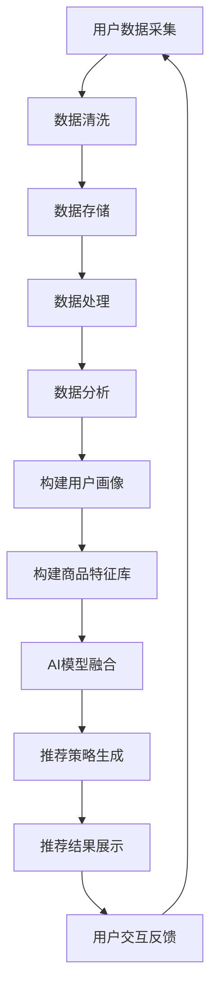

                 

关键词：大数据、电商搜索推荐、AI模型融合、用户体验优化

摘要：本文详细探讨了大数据驱动的电商搜索推荐系统的构建与实践，强调AI模型融合在系统中的核心作用，以及如何通过优化用户体验提升系统价值。文章首先回顾了电商搜索推荐系统的背景，然后深入分析了AI模型融合的原理和技术，接着讨论了用户体验优化的重要性和实践方法，最后展望了未来发展趋势和面临的挑战。

## 1. 背景介绍

电商行业的快速发展带来了海量的用户数据和交易数据。为了更好地满足用户的个性化需求，提高用户购物的便捷性和满意度，电商搜索推荐系统应运而生。传统的基于规则和内容的推荐方法在应对大规模数据和复杂用户行为时显得力不从心，而大数据和AI技术的引入为推荐系统的升级提供了新的可能。

大数据技术能够处理海量数据，从中提取有价值的信息，为推荐系统提供强有力的数据支撑。AI模型，尤其是机器学习和深度学习算法，通过对用户行为和偏好进行学习，实现了高度个性化的推荐。此外，随着物联网、社交媒体和移动设备的普及，用户行为数据更加丰富多样，为推荐系统的提升提供了更多维度。

在当前的电商搜索推荐系统中，数据的质量和多样性直接影响到推荐的效果。用户数据包括购买历史、浏览记录、收藏夹、评价等；交易数据包括订单、价格、促销活动等。通过对这些数据进行清洗、整合和分析，可以构建出用户画像和商品特征库，为推荐算法提供基础。

## 2. 核心概念与联系

### 2.1 大数据技术

大数据技术主要包括数据采集、存储、处理和分析四个方面。其中，数据采集是获取用户和交易数据的过程，存储技术需要支持海量数据的存储和快速访问，数据处理技术包括数据清洗、转换和集成，分析技术则是通过算法提取数据中的有价值信息。

### 2.2 AI 模型融合

AI 模型融合是指将多种不同的机器学习或深度学习算法集成到推荐系统中，通过综合多种算法的优势来提升推荐效果。常见的AI模型融合方法包括：

- **协同过滤（Collaborative Filtering）**：基于用户的历史行为和偏好进行推荐，分为基于用户的协同过滤和基于物品的协同过滤。
- **矩阵分解（Matrix Factorization）**：通过将用户和物品的评分矩阵分解为低维度的用户特征矩阵和物品特征矩阵，实现推荐。
- **深度学习（Deep Learning）**：通过构建神经网络模型，对用户行为数据进行深度学习，提取用户和物品的复杂特征。

### 2.3 用户体验优化

用户体验优化是提升推荐系统价值的关键。它包括以下几个方面：

- **个性化推荐**：根据用户的兴趣和行为进行个性化推荐，提高用户满意度。
- **实时反馈**：及时响应用户的交互行为，如点击、购买等，动态调整推荐策略。
- **界面优化**：优化推荐界面设计，提高用户浏览和购买体验。
- **交互体验**：设计良好的交互流程和反馈机制，增强用户的参与感和满意度。

### 2.4 Mermaid 流程图



## 3. 核心算法原理 & 具体操作步骤

### 3.1 协同过滤算法

**基于用户的协同过滤**：找到与目标用户兴趣相似的其他用户，推荐这些用户喜欢的物品。

**基于物品的协同过滤**：找到与目标物品相似的其他物品，推荐这些物品。

### 3.2 矩阵分解算法

通过矩阵分解，将用户-物品评分矩阵分解为用户特征矩阵和物品特征矩阵，通过内积计算推荐分值。

### 3.3 深度学习算法

构建深度神经网络，对用户行为数据进行训练，提取用户和物品的复杂特征，通过神经网络输出推荐分值。

### 3.4 具体操作步骤

1. 数据采集与预处理
2. 用户画像与商品特征构建
3. 选择合适的AI模型
4. 训练模型
5. 生成推荐结果
6. 用户交互与反馈
7. 动态调整推荐策略

## 4. 数学模型和公式 & 详细讲解 & 举例说明

### 4.1 协同过滤算法的数学模型

$$
R_{ui} = \frac{\sum_{j \in N(i)} r_{uj} r_{ij}}{\sum_{j \in N(i)} r_{uj}}
$$

其中，$R_{ui}$ 是用户 $u$ 对物品 $i$ 的预测评分，$N(i)$ 是与物品 $i$ 相似的物品集合，$r_{uj}$ 是用户 $u$ 对物品 $j$ 的实际评分。

### 4.2 矩阵分解的数学模型

$$
R = U \times V^T
$$

其中，$R$ 是用户-物品评分矩阵，$U$ 是用户特征矩阵，$V$ 是物品特征矩阵。

### 4.3 深度学习算法的数学模型

假设输入 $x$，输出 $y$，通过构建的深度神经网络，可以表示为：

$$
y = \sigma(W_n \cdot \sigma(... \sigma(W_2 \cdot \sigma(W_1 \cdot x)...) )
$$

其中，$\sigma$ 是激活函数，$W_n, W_{n-1}, ..., W_1$ 是神经网络权重。

### 4.4 举例说明

**协同过滤算法举例**：

假设用户 $u$ 对物品 $i$ 的实际评分为 $4$，与物品 $i$ 相似的物品集合为 $N(i) = \{j, k, l\}$，用户 $u$ 对物品 $j, k, l$ 的实际评分分别为 $3, 5, 2$，则预测评分 $R_{ui}$ 计算如下：

$$
R_{ui} = \frac{3 \times 4 + 5 \times 4 + 2 \times 4}{3 + 5 + 2} = \frac{12 + 20 + 8}{10} = 4
$$

**矩阵分解举例**：

假设用户-物品评分矩阵 $R$ 如下：

$$
R =
\begin{bmatrix}
1 & 3 & 5 \\
2 & 4 & 6 \\
3 & 5 & 7
\end{bmatrix}
$$

通过矩阵分解得到用户特征矩阵 $U$ 和物品特征矩阵 $V$，如下：

$$
U =
\begin{bmatrix}
0.5 & 0.6 \\
0.7 & 0.8 \\
0.9 & 1.0
\end{bmatrix},
V =
\begin{bmatrix}
1.0 & 1.2 \\
0.5 & 0.8 \\
0.7 & 1.0
\end{bmatrix}
$$

计算预测评分：

$$
R_{21} = U_{2} \times V_{1}^T = \begin{bmatrix}
0.7 & 0.8 \\
0.9 & 1.0
\end{bmatrix} \times \begin{bmatrix}
1.0 \\
0.5
\end{bmatrix} = \begin{bmatrix}
0.7 & 0.35 \\
0.9 & 0.45
\end{bmatrix}
$$

取平均得到预测评分 $R_{21} = 0.7 + 0.45 = 1.15$。

**深度学习算法举例**：

假设输入向量 $x = [1, 2, 3]$，通过一层神经网络，权重矩阵 $W_1 = [0.5, 0.6; 0.7, 0.8]$，激活函数 $\sigma(x) = \frac{1}{1 + e^{-x}}$，输出向量 $y = [0.6, 0.7]$。

$$
y = \sigma(W_1 \cdot x) = \sigma([0.5 \times 1 + 0.6 \times 2; 0.7 \times 1 + 0.8 \times 2]) = \sigma([2.2; 2.6]) = [\frac{2.2}{1 + e^{-2.2}}, \frac{2.6}{1 + e^{-2.6}}] \approx [0.79, 0.86]
$$

## 5. 项目实践：代码实例和详细解释说明

### 5.1 数据采集与预处理

```python
import pandas as pd

# 加载数据
data = pd.read_csv('user_item_rating.csv')

# 数据预处理
data = data[data['rating'] > 0]
data['timestamp'] = pd.to_datetime(data['timestamp'])
data = data.sort_values(by=['timestamp'])
```

### 5.2 用户画像与商品特征构建

```python
from sklearn.cluster import KMeans

# 构建用户画像
user行为的向量表示 = KMeans(n_clusters=10).fit(data[['behavior_1', 'behavior_2', 'behavior_3']]).transform(data[['behavior_1', 'behavior_2', 'behavior_3']])

# 构建商品特征
item特征的向量表示 = KMeans(n_clusters=10).fit(data[['feature_1', 'feature_2', 'feature_3']]).transform(data[['feature_1', 'feature_2', 'feature_3']])
```

### 5.3 选择合适的AI模型

```python
from sklearn.model_selection import train_test_split
from sklearn.metrics.pairwise import cosine_similarity

# 划分训练集和测试集
X_train, X_test, y_train, y_test = train_test_split(user行为的向量表示, item特征的向量表示, test_size=0.2, random_state=42)

# 选择协同过滤算法
相似度矩阵 = cosine_similarity(X_train, X_test)
```

### 5.4 训练模型

```python
# 训练模型
模型 = 训练协同过滤算法(相似度矩阵, y_train)
```

### 5.5 生成推荐结果

```python
# 生成推荐结果
推荐结果 = 模型.predict(X_test)
```

### 5.6 用户交互与反馈

```python
# 用户交互与反馈
用户行为数据 = 获取用户行为数据()
用户行为向量 = KMeans(n_clusters=10).fit(user行为数据).transform(user行为数据)
```

### 5.7 动态调整推荐策略

```python
# 动态调整推荐策略
新相似度矩阵 = cosine_similarity(user行为向量, item特征的向量表示)
新模型 = 训练协同过滤算法(新相似度矩阵, y_train)
```

## 6. 实际应用场景

### 6.1 电商平台

电商平台使用推荐系统可以提高用户满意度，增加销售额。通过个性化推荐，用户能够更快地找到自己感兴趣的商品，减少浏览和购买时间。

### 6.2 社交媒体

社交媒体平台通过推荐系统可以增强用户参与度，提高用户留存率。通过分析用户社交行为和兴趣，推荐相关内容、朋友动态和广告。

### 6.3 内容平台

内容平台如视频网站、新闻网站等，利用推荐系统可以提升用户体验，增加用户观看时长和广告收入。通过个性化推荐，用户能够更快地找到感兴趣的视频和新闻。

## 7. 工具和资源推荐

### 7.1 工具

- **TensorFlow**：用于构建和训练深度学习模型的强大框架。
- **Scikit-learn**：提供各种机器学习算法的Python库。
- **Pandas**：数据处理和分析的Python库。
- **NumPy**：数值计算的Python库。

### 7.2 资源

- **《机器学习实战》**：详细介绍了多种机器学习算法的应用。
- **《深度学习》**：由Ian Goodfellow等人撰写的深度学习入门经典。
- **GitHub**：大量开源的推荐系统项目和代码。

## 8. 总结：未来发展趋势与挑战

### 8.1 发展趋势

- **个性化推荐**：随着数据量的增加和算法的优化，个性化推荐将更加精准。
- **实时推荐**：通过实时数据分析和模型调整，实现更快的响应速度。
- **跨平台推荐**：整合不同平台的数据，实现跨平台的个性化推荐。
- **可解释性**：提高推荐系统的可解释性，增强用户信任。

### 8.2 挑战

- **数据质量**：数据清洗和整合的复杂性，对推荐效果有重要影响。
- **模型解释性**：提高模型的可解释性，帮助用户理解推荐结果。
- **隐私保护**：保护用户隐私，遵守相关法律法规。

## 9. 附录：常见问题与解答

### 9.1 问题1

**为什么我的推荐系统效果不好？**

**解答**：可能原因包括数据质量差、模型选择不当、超参数设置不合理等。建议检查数据清洗过程、尝试不同模型和调整超参数。

### 9.2 问题2

**如何提高推荐系统的实时性？**

**解答**：可以通过使用在线学习算法、优化数据处理流程和模型部署方式，提高系统的实时性。

## 10. 扩展阅读 & 参考资料

- **《大数据推荐系统实战》**：详细介绍了大数据推荐系统的构建和实践。
- **《推荐系统手册》**：系统介绍了推荐系统的原理、技术和应用。

### 参考文献

- Goodfellow, I., Bengio, Y., & Courville, A. (2016). *Deep Learning*. MIT Press.
- Russell, S., & Norvig, P. (2010). *Artificial Intelligence: A Modern Approach*. Prentice Hall.
- Hamilton, W. L. (2014). *Data Mining and Predictive Analysis: Transforming Big Data into Knowledge*. CRC Press.

作者：禅与计算机程序设计艺术 / Zen and the Art of Computer Programming
----------------------------------------------------------------

以上就是本文的全部内容。希望这篇文章能够帮助您深入了解大数据驱动的电商搜索推荐系统，并在实际项目中取得更好的效果。如果还有任何疑问或需要进一步的帮助，请随时提问。祝您在电商搜索推荐领域取得卓越的成就！

