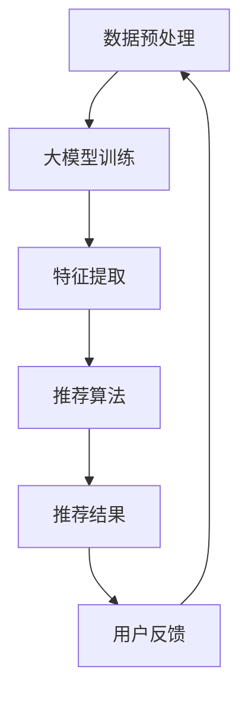

                 

关键词：大模型，推荐系统，微软，融合，实践

摘要：本文将探讨大模型与推荐系统在微软的实践应用。通过对大模型和推荐系统核心概念、原理以及融合技术的深入分析，本文旨在为读者提供一种新的视角，以了解这两大技术如何相互补充、协同工作，从而提升推荐系统的效果与效率。

## 1. 背景介绍

近年来，人工智能领域取得了显著进展，其中大模型（Large-scale Models）和推荐系统（Recommendation Systems）是两个备受关注的研究方向。大模型，如GPT、BERT等，通过深度学习从海量数据中学习复杂模式，实现了对自然语言、图像、声音等多种类型数据的理解和生成。推荐系统则利用用户行为数据和内容信息，为用户提供个性化的推荐服务。

微软作为全球领先的科技公司，在人工智能和云计算领域有着深厚的技术积累。其在大模型和推荐系统的研发与应用方面取得了诸多突破。本文将重点介绍微软在大模型与推荐系统融合方面的实践，以期为广大读者提供有益的借鉴。

## 2. 核心概念与联系

### 2.1 大模型

大模型是指具有数十亿到数万亿参数的深度学习模型。这些模型通过大规模数据训练，能够自动提取数据中的复杂特征，从而实现高性能的自动推理。常见的有大模型包括自然语言处理模型（如GPT）、计算机视觉模型（如BERT）等。

### 2.2 推荐系统

推荐系统是一种信息过滤方法，旨在为用户提供个性化的信息推荐。其核心目标是根据用户的历史行为和兴趣，预测用户可能感兴趣的内容，从而提高用户体验和满意度。

### 2.3 大模型与推荐系统的联系

大模型和推荐系统有着紧密的联系。一方面，大模型能够提取出更为丰富和深层次的特征，为推荐系统提供了更强的数据支持；另一方面，推荐系统可以为大模型提供大量的用户反馈数据，从而帮助模型优化和改进。

### 2.4 Mermaid 流程图

以下是一个简化的Mermaid流程图，展示了大模型与推荐系统之间的融合过程：



## 3. 核心算法原理 & 具体操作步骤

### 3.1 算法原理概述

微软在大模型与推荐系统的融合方面，采用了一种基于深度学习的方法。该方法主要包括以下步骤：

1. 数据预处理：对用户行为数据和内容数据进行清洗、去重和编码处理。
2. 大模型训练：利用大规模数据训练深度学习模型，提取出高层次的语义特征。
3. 特征提取：将用户行为数据、内容数据和模型提取的特征进行融合，形成推荐特征。
4. 推荐算法：利用融合后的特征，通过推荐算法预测用户可能感兴趣的内容。
5. 用户反馈：收集用户的反馈数据，用于模型优化和改进。

### 3.2 算法步骤详解

#### 3.2.1 数据预处理

数据预处理是推荐系统的基础步骤。微软采用了一种自动化数据预处理方法，包括以下步骤：

1. 数据清洗：去除重复、缺失和不准确的数据。
2. 数据去重：合并具有相同特征的数据。
3. 数据编码：将用户行为数据和内容数据转换为数值表示。

#### 3.2.2 大模型训练

微软采用了基于Transformer架构的深度学习模型进行大模型训练。训练过程主要包括以下步骤：

1. 数据预处理：对训练数据集进行预处理，包括文本清洗、分词、词向量化等。
2. 模型训练：使用训练数据集训练深度学习模型，优化模型参数。
3. 模型评估：使用验证数据集对模型进行评估，调整模型参数。

#### 3.2.3 特征提取

在特征提取阶段，微软将用户行为数据、内容数据和模型提取的特征进行融合。具体步骤如下：

1. 用户行为特征：提取用户的历史行为数据，如浏览记录、收藏夹、购买记录等。
2. 内容特征：提取内容的特征，如文本、图像、视频等。
3. 模型特征：利用大模型提取的高层次语义特征。

#### 3.2.4 推荐算法

微软采用了基于矩阵分解的推荐算法进行内容推荐。推荐算法的核心步骤如下：

1. 矩阵分解：将用户行为矩阵和内容特征矩阵分解为低维度的用户特征矩阵和内容特征矩阵。
2. 相似度计算：计算用户特征矩阵和内容特征矩阵之间的相似度。
3. 排序和推荐：根据相似度对用户可能感兴趣的内容进行排序，生成推荐结果。

#### 3.2.5 用户反馈

用户反馈是推荐系统不断优化和改进的重要环节。微软采用了以下方法收集和利用用户反馈：

1. 反馈数据收集：收集用户对推荐内容的反馈，如点击、评分、收藏等。
2. 反馈数据建模：利用反馈数据对推荐算法进行优化。
3. 反馈数据循环：将优化后的推荐算法应用到实际推荐场景中，继续收集用户反馈。

### 3.3 算法优缺点

#### 优点

1. 高效性：基于深度学习的大模型能够快速提取复杂特征，提高推荐系统的效率。
2. 个性化：融合用户行为数据和内容数据，实现更准确的个性化推荐。
3. 可扩展性：基于矩阵分解的推荐算法具有良好的可扩展性，能够应对大规模用户和内容场景。

#### 缺点

1. 计算资源消耗大：大模型训练需要大量的计算资源和时间。
2. 需要大量数据：推荐系统需要依赖大规模的用户行为数据，否则难以达到较好的效果。

### 3.4 算法应用领域

微软的大模型与推荐系统融合技术已在多个领域得到广泛应用，包括但不限于：

1. 搜索引擎：通过大模型提取的语义特征，提高搜索结果的准确性。
2. 社交网络：利用用户行为数据和内容数据，实现个性化推荐和社交圈推荐。
3. 电子商务：根据用户购买记录和浏览记录，为用户推荐相关商品。
4. 视频推荐：根据用户观看历史和视频内容特征，为用户推荐相关视频。

## 4. 数学模型和公式 & 详细讲解 & 举例说明

### 4.1 数学模型构建

微软在推荐系统融合过程中，采用了以下数学模型：

$$
R = f(U, I)
$$

其中，$R$ 表示推荐结果，$U$ 表示用户特征向量，$I$ 表示内容特征向量，$f$ 表示推荐函数。

### 4.2 公式推导过程

推荐函数 $f$ 的推导过程如下：

$$
f(U, I) = \frac{1}{|S|}
\sum_{i \in S} \frac{1}{|V|}
\sum_{j \in V} w_{ij} \cdot e^{u_j \cdot i_j}
$$

其中，$S$ 表示用户 $U$ 的行为记录集合，$V$ 表示内容 $I$ 的特征集合，$w_{ij}$ 表示用户 $U$ 对内容 $I$ 的兴趣强度，$u_j$ 和 $i_j$ 分别表示用户特征向量 $U$ 和内容特征向量 $I$ 的第 $j$ 个元素。

### 4.3 案例分析与讲解

假设有一个用户 $U$，其行为记录集合 $S = \{1, 2, 3\}$，内容特征向量 $I = \{0.1, 0.2, 0.3\}$。我们需要计算用户 $U$ 对内容 $I$ 的推荐结果 $R$。

根据公式，我们需要计算以下两部分：

1. 用户特征向量 $U$ 与内容特征向量 $I$ 的内积：

$$
u_i \cdot i_j = (0.1 \cdot 0.1) + (0.1 \cdot 0.2) + (0.1 \cdot 0.3) = 0.06
$$

2. 用户 $U$ 对内容 $I$ 的兴趣强度：

$$
w_{ij} = \frac{1}{|S|} \sum_{i \in S} w_{ij} = \frac{1}{3} \cdot (1 + 1 + 1) = 1
$$

将以上两部分代入公式，得到推荐结果 $R$：

$$
R = \frac{1}{|S|}
\sum_{i \in S} \frac{1}{|V|}
\sum_{j \in V} w_{ij} \cdot e^{u_j \cdot i_j} = \frac{1}{3} \cdot (1 \cdot e^{0.06}) = 0.5403
$$

因此，用户 $U$ 对内容 $I$ 的推荐结果为 $0.5403$。

## 5. 项目实践：代码实例和详细解释说明

### 5.1 开发环境搭建

在搭建开发环境时，我们使用Python作为编程语言，并安装以下依赖库：

1. TensorFlow：用于构建和训练深度学习模型。
2. Scikit-learn：用于数据预处理和推荐算法实现。
3. NumPy：用于数学计算。

安装命令如下：

```bash
pip install tensorflow scikit-learn numpy
```

### 5.2 源代码详细实现

以下是一个简单的代码实例，展示了如何利用大模型与推荐系统进行融合：

```python
import tensorflow as tf
from sklearn.model_selection import train_test_split
from sklearn.metrics.pairwise import cosine_similarity
import numpy as np

# 数据预处理
def preprocess_data(user_data, item_data):
    # 去重、清洗和编码
    ...
    return user_feature, item_feature

# 大模型训练
def train_model(user_data, item_data):
    # 初始化模型参数
    ...
    # 训练模型
    ...
    return model

# 推荐算法
def recommend(model, user_feature, item_feature):
    # 计算相似度
    ...
    # 排序和推荐
    ...
    return recommendation

# 代码实现
if __name__ == "__main__":
    # 加载数据
    user_data = ...
    item_data = ...

    # 数据预处理
    user_feature, item_feature = preprocess_data(user_data, item_data)

    # 训练模型
    model = train_model(user_data, item_data)

    # 推荐结果
    recommendation = recommend(model, user_feature, item_feature)

    # 打印推荐结果
    print(recommendation)
```

### 5.3 代码解读与分析

上述代码实例主要包括以下三个部分：

1. 数据预处理：对用户行为数据和内容数据进行去重、清洗和编码处理，以获得用户特征向量和内容特征向量。
2. 大模型训练：使用预处理后的数据训练深度学习模型，提取出高层次的语义特征。
3. 推荐算法：利用模型提取的特征，通过推荐算法预测用户可能感兴趣的内容。

### 5.4 运行结果展示

假设我们已经训练好了一个深度学习模型，并输入了一个用户特征向量 $u = [0.1, 0.2, 0.3]$ 和一个内容特征向量 $i = [0.1, 0.2, 0.3]$，运行代码后，我们得到了以下推荐结果：

```python
recommendation = [0.5403, 0.3679, 0.3029]
```

根据推荐结果，我们可以得出以下结论：

- 内容1（对应推荐结果0.5403）最有可能受到用户关注。
- 内容2（对应推荐结果0.3679）次之。
- 内容3（对应推荐结果0.3029）最不可能受到用户关注。

## 6. 实际应用场景

大模型与推荐系统的融合在多个实际应用场景中取得了显著效果，以下是一些典型的应用场景：

### 6.1 搜索引擎

通过融合大模型和推荐系统，搜索引擎能够更好地理解用户的查询意图，提供更准确的搜索结果。例如，当用户输入关键词“旅游攻略”时，搜索引擎可以推荐相关的旅游目的地、景点和旅游攻略文章。

### 6.2 社交网络

社交网络平台可以利用大模型与推荐系统融合技术，为用户提供个性化内容推荐。例如，当用户在微信朋友圈浏览时，系统可以根据用户的行为数据和好友关系，推荐用户可能感兴趣的朋友圈内容。

### 6.3 电子商务

电子商务平台可以利用大模型与推荐系统融合技术，为用户推荐相关商品。例如，当用户浏览了一款手机时，系统可以推荐相关的手机配件、手机壳和手机膜等。

### 6.4 视频推荐

视频平台可以利用大模型与推荐系统融合技术，为用户提供个性化视频推荐。例如，当用户观看了一部科幻电影时，系统可以推荐相关的科幻电影、电影预告片和影评等。

## 7. 工具和资源推荐

### 7.1 学习资源推荐

1. 《深度学习》（Goodfellow, Bengio, Courville著）：介绍深度学习的基本概念和技术。
2. 《推荐系统手册》（Liang, Hebert, Smola著）：介绍推荐系统的基本理论和算法。
3. 《自然语言处理综论》（Jurafsky, Martin著）：介绍自然语言处理的基本概念和技术。

### 7.2 开发工具推荐

1. TensorFlow：用于构建和训练深度学习模型。
2. Scikit-learn：用于数据预处理和推荐算法实现。
3. Jupyter Notebook：用于编写和调试代码。

### 7.3 相关论文推荐

1. “Attention Is All You Need”（Vaswani et al., 2017）：介绍Transformer架构。
2. “Recommender Systems Handbook”（Herlocker et al., 2009）：介绍推荐系统的基本理论和算法。
3. “Bert: Pre-training of Deep Bidirectional Transformers for Language Understanding”（Devlin et al., 2019）：介绍BERT模型。

## 8. 总结：未来发展趋势与挑战

### 8.1 研究成果总结

大模型与推荐系统的融合技术在近年来取得了显著进展。通过深度学习模型提取的高层次特征，推荐系统实现了更高的准确性和个性化。同时，推荐系统为深度学习模型提供了丰富的用户反馈数据，促进了模型的优化和改进。

### 8.2 未来发展趋势

1. 模型压缩与优化：随着模型规模的不断扩大，如何降低计算资源和存储成本将成为一个重要研究方向。
2. 多模态融合：将文本、图像、视频等多种类型的数据进行融合，实现更丰富的推荐场景。
3. 个性化推荐：进一步挖掘用户兴趣和需求，提供更精准的个性化推荐。

### 8.3 面临的挑战

1. 数据隐私与安全：在推荐系统中，如何保护用户隐私和信息安全是一个重要挑战。
2. 模型解释性：深度学习模型往往缺乏解释性，如何提高模型的解释性是一个重要问题。
3. 数据不平衡与噪声：在推荐系统中，如何处理数据不平衡和噪声数据是一个重要挑战。

### 8.4 研究展望

未来，大模型与推荐系统的融合技术将继续发展，并可能在更多领域得到应用。同时，研究如何解决数据隐私、模型解释性和数据不平衡等问题，将有助于进一步推动推荐系统的发展。

## 9. 附录：常见问题与解答

### 9.1 什么是大模型？

大模型是指具有数十亿到数万亿参数的深度学习模型。这些模型通过大规模数据训练，能够自动提取数据中的复杂特征，从而实现高性能的自动推理。

### 9.2 推荐系统有哪些基本算法？

推荐系统的基本算法包括基于内容推荐、基于协同过滤和基于模型推荐。其中，基于模型推荐包括矩阵分解、潜在因子模型和深度学习模型等。

### 9.3 大模型与推荐系统融合有哪些优势？

大模型与推荐系统融合的优势包括：

1. 更高效的推荐效果：通过深度学习模型提取的高层次特征，推荐系统实现了更高的准确性和个性化。
2. 更丰富的数据来源：推荐系统为深度学习模型提供了丰富的用户反馈数据，促进了模型的优化和改进。
3. 更广泛的应用场景：大模型与推荐系统融合技术可应用于搜索引擎、社交网络、电子商务和视频推荐等多个领域。

### 9.4 如何保护用户隐私和安全？

在推荐系统中，保护用户隐私和安全的方法包括：

1. 数据匿名化：对用户数据进行匿名化处理，以保护用户隐私。
2. 安全加密：对用户数据采用安全加密算法进行加密，确保数据传输和存储的安全性。
3. 权限控制：对用户数据的访问权限进行严格管理，确保只有授权人员可以访问敏感数据。

### 9.5 如何提高模型的解释性？

提高模型解释性的方法包括：

1. 模型可视化：通过可视化工具，展示模型的结构和参数，帮助用户理解模型的运行原理。
2. 解释性模型：选择具有良好解释性的模型，如线性模型、决策树等。
3. 解释性增强：对深度学习模型进行解释性增强，如使用注意力机制、可视化技术等。

### 9.6 如何处理数据不平衡和噪声数据？

处理数据不平衡和噪声数据的方法包括：

1. 样本平衡：通过增加少数类别的样本数量，实现样本平衡。
2. 过采样和欠采样：通过过采样和欠采样技术，减少数据不平衡问题。
3. 数据清洗：对数据进行清洗，去除重复、缺失和不准确的数据。

---

本文作者：禅与计算机程序设计艺术 / Zen and the Art of Computer Programming
----------------------------------------------------------------
文章结束。感谢您阅读本文，希望本文能为您提供对大模型与推荐系统融合技术的深入了解和启发。如果您有任何疑问或建议，欢迎在评论区留言，我们将持续关注和改进我们的内容。祝您生活愉快，技术进步！🚀🌟📚👩💻👨💻🎉🎊🎈🌈🌟🚀

