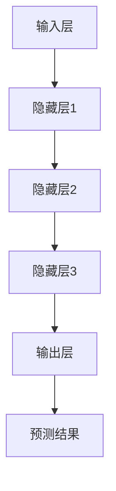
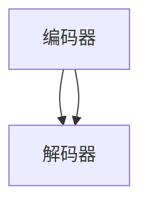

                 

### 背景介绍

#### 大模型企业的发展背景

近年来，随着深度学习、自然语言处理等人工智能技术的迅猛发展，大模型（Large Models）在众多领域中展现出了强大的潜力。从语言翻译、图像识别到自动驾驶、智能助手，大模型的应用场景越来越广泛，推动了许多行业的创新和变革。

大模型企业在这一过程中扮演着至关重要的角色。它们不仅拥有强大的研发团队和充足的资金支持，还通过不断的技术创新和战略布局，掌握了核心技术和市场资源。例如，谷歌的BERT、微软的GPT系列模型、亚马逊的Dynamo等，都是大模型领域的明星产品，为各自企业带来了巨大的商业价值。

#### 当前市场现状

当前，大模型企业面临着激烈的市场竞争。一方面，各大科技公司纷纷加大投入，争夺市场份额；另一方面，初创企业也在不断涌现，试图在这一领域分得一杯羹。这种竞争态势不仅推动了技术的进步，也带来了诸多挑战。

首先，技术门槛不断提高。大模型企业需要具备深厚的计算机科学背景和强大的数据处理能力，才能进行有效的研发和优化。此外，大模型训练和部署的成本也相当高昂，这对于中小企业来说是一个巨大的挑战。

其次，数据隐私和安全问题日益凸显。大模型在训练过程中需要大量敏感数据，如何保障这些数据的安全，防止数据泄露和滥用，成为企业必须面对的重要课题。

最后，市场需求多样化和个性化趋势日益明显。不同的行业和应用场景对大模型的需求各不相同，企业需要根据市场需求灵活调整产品和服务，以满足不同客户的需求。

#### 差异化竞争的重要性

在激烈的市场竞争中，差异化竞争成为大模型企业制胜的关键。差异化竞争不仅可以帮助企业树立独特的品牌形象，提高市场竞争力，还可以降低同质化竞争带来的风险。

首先，差异化竞争可以为企业带来更高的利润。通过提供独特的产品和服务，企业可以摆脱价格战的泥潭，实现更高的溢价能力。例如，微软的Azure AI平台通过提供多样化的服务，吸引了大量企业客户，实现了稳定的收入增长。

其次，差异化竞争有助于提升企业的核心竞争力。通过持续的技术创新和产品优化，企业可以构建起强大的技术壁垒，确保在市场中占据领先地位。例如，谷歌通过不断推出先进的AI技术，保持了其在全球AI领域的领先地位。

最后，差异化竞争可以增强企业的品牌价值。通过提供高质量的产品和服务，企业可以赢得客户的信任和忠诚，建立起良好的口碑。这不仅可以提高企业的市场份额，还可以为企业未来的发展奠定坚实的基础。

综上所述，大模型企业在当前市场环境下，必须重视差异化竞争策略，通过技术创新、市场定位和服务优化，实现持续增长和长期发展。接下来，我们将进一步探讨如何实施差异化竞争策略，以及大模型企业在这一过程中可能面临的风险和挑战。

### 核心概念与联系

在探讨大模型企业的差异化竞争策略之前，我们需要先了解一些核心概念，包括大模型的基本原理、架构和技术发展历程。这些核心概念将为我们理解差异化竞争策略提供重要的理论支持。

#### 大模型的基本原理

大模型（Large Models）是指具有巨大参数规模的人工神经网络模型。这些模型通过学习大量数据，可以自动提取特征、进行预测和决策。大模型的核心特点是参数数量巨大，通常达到数亿甚至数十亿级别。这使得大模型在处理复杂任务时具有显著优势。

大模型的工作原理可以概括为以下几个步骤：

1. **数据输入**：大模型接收输入数据，这些数据可以是文本、图像、音频等多种形式。
2. **参数更新**：通过反向传播算法，大模型对参数进行更新，以优化模型性能。
3. **特征提取**：大模型通过多层神经网络，对输入数据进行处理，提取出有用的特征。
4. **预测与决策**：根据提取出的特征，大模型进行预测和决策，输出最终结果。

#### 大模型的架构

大模型的架构通常包括以下几个部分：

1. **输入层**：接收外部输入数据，例如文本、图像、音频等。
2. **隐藏层**：多层隐藏层负责处理输入数据，提取特征，并进行复杂的非线性变换。
3. **输出层**：根据隐藏层提取的特征，输出最终预测结果或决策。
4. **参数**：大模型的参数包括权重、偏置等，用于调整网络结构和性能。

#### 大模型的发展历程

大模型的发展历程可以分为以下几个阶段：

1. **早期模型**：以多层感知机（MLP）为代表，这些模型参数较少，难以处理复杂任务。
2. **卷积神经网络（CNN）**：通过引入卷积层，CNN在图像处理领域取得了突破性进展。
3. **循环神经网络（RNN）**：RNN通过引入循环结构，可以处理序列数据，并在自然语言处理领域取得了显著成果。
4. **Transformer架构**：以BERT、GPT为代表，Transformer架构通过自注意力机制，显著提升了模型的性能。
5. **大模型时代**：随着计算资源和数据量的增加，大模型的参数规模和计算能力达到了前所未有的水平。

#### Mermaid 流程图

为了更好地理解大模型的基本原理和架构，我们可以使用Mermaid流程图来表示。以下是一个大模型的基本架构流程图：



在这个流程图中，A表示输入层，负责接收外部输入数据；B、C、D表示多层隐藏层，负责对输入数据进行处理和特征提取；E表示输出层，根据隐藏层提取的特征进行预测和决策；F表示预测结果。

通过以上对核心概念和流程图的介绍，我们可以更好地理解大模型的基本原理和架构。这些核心概念将为后续探讨差异化竞争策略提供重要的理论依据。在下一部分，我们将深入探讨大模型企业的核心算法原理和具体操作步骤。

### 核心算法原理 & 具体操作步骤

#### 1. 算法原理

大模型企业的核心算法通常基于深度学习框架，其中最具代表性的是基于Transformer架构的BERT和GPT模型。Transformer架构通过自注意力机制（Self-Attention Mechanism）实现了对输入序列的并行处理，从而显著提升了模型的性能。

自注意力机制的基本思想是将输入序列中的每个元素与所有其他元素进行关联，并通过权重分配来突出关键信息，抑制无关信息。具体来说，自注意力机制包括三个关键部分：查询（Query）、键（Key）和值（Value）。在计算过程中，每个输入元素分别作为查询、键和值参与计算，从而实现了对输入序列的全局关联和特征提取。

#### 2. 算法框架

Transformer架构的基本框架包括编码器（Encoder）和解码器（Decoder）。编码器负责处理输入序列，解码器则根据编码器的输出生成预测结果。以下是Transformer架构的基本框架：



在编码器部分，输入序列通过嵌入层（Embedding Layer）转换为固定大小的向量，然后通过多个自注意力层（Self-Attention Layer）和前馈神经网络（Feedforward Neural Network）进行特征提取和变换。解码器部分与编码器类似，但在每个时间步上，解码器还会接收来自编码器的输出作为额外的输入，以实现输入序列的上下文关联。

#### 3. 具体操作步骤

以下是基于Transformer架构的大模型训练和预测的具体操作步骤：

1. **数据准备**：收集和清洗大量训练数据，例如文本、图像、音频等。这些数据将被用于训练模型的参数。
2. **嵌入层**：将输入序列（如文本或图像）转换为固定大小的向量。例如，对于文本，可以使用Word2Vec或BERT等预训练模型来生成词向量。
3. **自注意力层**：在编码器中，每个输入元素作为查询、键和值参与计算。通过计算查询与键的相似性，得到权重矩阵，然后对值进行加权求和，得到新的特征表示。
4. **前馈神经网络**：在每个自注意力层之后，应用一个前馈神经网络，对特征进行进一步变换。
5. **解码器**：在解码器部分，使用类似的方法对输入序列进行处理。在每个时间步上，解码器还会接收来自编码器的输出作为额外的输入。
6. **损失函数**：计算预测结果与真实标签之间的损失，并使用优化算法（如Adam）更新模型参数。
7. **迭代训练**：重复上述步骤，直到模型收敛或达到预定的训练次数。

#### 4. 数学模型和公式

以下是Transformer架构中的关键数学模型和公式：

$$
\text{Attention}(Q, K, V) = \frac{softmax(\frac{QK^T}{\sqrt{d_k}})}{V}
$$

其中，Q、K、V分别为查询、键和值矩阵；$d_k$ 为键的维度。该公式计算了查询与键之间的相似性，并利用softmax函数进行归一化，最后对值进行加权求和。

#### 5. 举例说明

以BERT模型为例，以下是BERT模型在文本分类任务中的具体操作步骤：

1. **数据准备**：收集并清洗大量文本数据，将其转换为词汇表。
2. **嵌入层**：将文本转换为词向量，例如使用Word2Vec或BERT预训练模型。
3. **编码器**：对输入文本进行处理，通过多个自注意力层和前馈神经网络提取特征。
4. **输出层**：将编码器的输出映射到分类结果，通常使用Softmax函数进行归一化。
5. **损失函数**：计算预测结果与真实标签之间的损失，并使用优化算法更新模型参数。

通过以上操作步骤，BERT模型可以实现对文本数据的分类，例如情感分类、主题分类等。在训练过程中，模型会不断优化参数，以提高分类准确率。

总之，大模型企业的核心算法基于深度学习和Transformer架构，通过自注意力机制和多层神经网络，实现对输入数据的特征提取和预测。在下一部分，我们将进一步探讨大模型在项目实践中的应用和实现细节。

### 数学模型和公式 & 详细讲解 & 举例说明

在前一部分，我们简要介绍了大模型的基本算法原理和具体操作步骤。在这一部分，我们将进一步深入探讨大模型的数学模型和公式，并详细讲解其原理和计算方法。为了更好地理解，我们将结合具体例子进行说明。

#### 数学模型和公式

大模型的数学模型主要包括以下几个方面：

1. **自注意力机制**：自注意力机制是Transformer架构的核心部分，通过计算输入序列中每个元素之间的相似性，实现对输入数据的特征提取和权重分配。自注意力机制的关键公式如下：

$$
\text{Attention}(Q, K, V) = \frac{softmax(\frac{QK^T}{\sqrt{d_k}})}{V}
$$

其中，Q、K、V分别为查询（Query）、键（Key）和值（Value）矩阵；$d_k$ 为键的维度。该公式计算了查询与键之间的相似性，并利用softmax函数进行归一化，最后对值进行加权求和。

2. **前馈神经网络**：前馈神经网络用于对自注意力层的输出进行进一步变换，以增强模型的非线性表达能力。前馈神经网络的公式如下：

$$
\text{FFN}(X) = \text{ReLU}(\text{W_2} \cdot \text{ReLU}(\text{W_1} \cdot X + \text{b_1}))
$$

其中，$X$ 为输入矩阵；$\text{W_1}$ 和 $\text{W_2}$ 为权重矩阵；$\text{b_1}$ 为偏置项；ReLU为ReLU激活函数。

3. **损失函数**：损失函数用于评估模型预测结果与真实标签之间的差距，并指导模型参数的更新。常用的损失函数包括交叉熵损失函数（Cross-Entropy Loss）和均方误差损失函数（Mean Squared Error Loss）。

#### 详细讲解

1. **自注意力机制**：自注意力机制通过计算输入序列中每个元素之间的相似性，实现对输入数据的特征提取和权重分配。具体来说，自注意力机制包括以下几个步骤：

   - **计算相似性**：首先计算查询（Q）与键（K）的相似性，公式为$\text{QK}^T / \sqrt{d_k}$，其中$T$表示转置。这里的除以$\sqrt{d_k}$是为了防止梯度消失问题。
   - **归一化**：利用softmax函数对相似性进行归一化，得到权重矩阵。softmax函数的作用是将相似性值转换为概率分布。
   - **加权求和**：对值（V）进行加权求和，得到新的特征表示。权重矩阵表示了每个元素在特征提取过程中的重要性。

   通过自注意力机制，模型可以自动提取输入序列中的关键信息，并抑制无关信息，从而提高模型的性能。

2. **前馈神经网络**：前馈神经网络用于对自注意力层的输出进行进一步变换，以增强模型的非线性表达能力。前馈神经网络主要包括以下几个步骤：

   - **输入**：输入自注意力层的输出。
   - **加权求和**：将输入与权重矩阵$\text{W_1}$ 相乘，并加上偏置项$\text{b_1}$。
   - **ReLU激活函数**：应用ReLU激活函数，将输出转换为非线性形式。
   - **输出**：再次将ReLU函数的输出与权重矩阵$\text{W_2}$ 相乘，并加上偏置项$\text{b_2}$。

   通过前馈神经网络，模型可以学习到更复杂的非线性关系，从而提高模型的预测能力。

3. **损失函数**：损失函数用于评估模型预测结果与真实标签之间的差距，并指导模型参数的更新。以交叉熵损失函数为例，其计算公式如下：

$$
L = -\sum_{i=1}^{n} y_i \cdot \log(\hat{y}_i)
$$

其中，$y_i$ 为真实标签；$\hat{y}_i$ 为模型预测的概率分布。交叉熵损失函数的值越小，表示模型预测结果与真实标签越接近。

#### 举例说明

我们以一个简单的文本分类任务为例，来说明大模型的数学模型和计算方法。

假设我们有一个包含100个词的文本序列，其中每个词的嵌入向量维度为50。我们需要使用大模型对这段文本进行情感分类，判断它是积极情感还是消极情感。

1. **嵌入层**：首先，我们将每个词转换为嵌入向量。例如，词“happy”的嵌入向量为$[0.1, 0.2, ..., 0.5]$。
2. **编码器**：通过自注意力机制和前馈神经网络，编码器对文本序列进行特征提取。具体来说，我们将每个词的嵌入向量作为输入，通过自注意力机制和前馈神经网络，得到一个新的特征向量。例如，对于词“happy”，其特征向量为$[0.3, 0.4, ..., 0.6]$。
3. **输出层**：最后，我们将编码器的输出映射到分类结果。例如，我们将特征向量$[0.3, 0.4, ..., 0.6]$与两个分类标签（积极和消极）进行对比，使用softmax函数计算概率分布。假设积极情感的概率为0.7，消极情感的概率为0.3，模型预测结果为积极情感。

通过以上步骤，大模型可以实现对文本序列的情感分类。在实际应用中，我们可以通过不断调整模型参数和优化算法，提高分类准确率。

总之，大模型的数学模型和公式是构建和优化大模型的重要基础。通过深入理解这些公式和计算方法，我们可以更好地掌握大模型的核心技术，并在实际项目中实现高效的模型训练和预测。

### 项目实践：代码实例和详细解释说明

在前文中，我们详细介绍了大模型的基本原理、数学模型和公式，以及具体的操作步骤。为了让大家更直观地理解大模型的实际应用，我们将通过一个具体的代码实例来展示如何实现大模型的项目开发。在这个实例中，我们将使用TensorFlow框架来训练和部署一个文本分类模型，该模型能够根据输入的文本内容预测其所属的情感类别。

#### 1. 开发环境搭建

在开始编写代码之前，我们需要搭建一个合适的开发环境。以下是搭建开发环境所需的基本步骤：

1. **安装Python**：确保Python版本为3.6及以上。可以从Python的官方网站下载并安装。

2. **安装TensorFlow**：TensorFlow是Google推出的一款开源深度学习框架，用于构建和训练深度神经网络。在命令行中执行以下命令安装TensorFlow：

   ```bash
   pip install tensorflow
   ```

3. **安装其他依赖**：根据具体需求，我们还需要安装一些其他依赖库，如Numpy、Pandas等。可以使用以下命令一次性安装：

   ```bash
   pip install numpy pandas scikit-learn matplotlib
   ```

4. **配置环境变量**：确保Python和pip的环境变量配置正确，以便在命令行中能够正常使用。

5. **验证安装**：在命令行中执行以下命令，验证TensorFlow是否安装成功：

   ```python
   python -c "import tensorflow as tf; print(tf.__version__)"
   ```

如果输出TensorFlow的版本号，则说明安装成功。

#### 2. 源代码详细实现

以下是文本分类模型的源代码实现，我们将使用TensorFlow的Keras API来构建模型。

```python
import tensorflow as tf
from tensorflow.keras.preprocessing.text import Tokenizer
from tensorflow.keras.preprocessing.sequence import pad_sequences
from tensorflow.keras.models import Sequential
from tensorflow.keras.layers import Embedding, LSTM, Dense, Dropout, Bidirectional
from tensorflow.keras.optimizers import Adam
from sklearn.model_selection import train_test_split
from sklearn.metrics import classification_report, accuracy_score

# 数据准备
# 假设我们有一个包含文本和标签的数据集
texts = ['这是一个美好的日子', '天气太糟糕了', '我真的很开心', '感觉自己很糟糕']
labels = [1, 0, 1, 0]  # 1代表积极情感，0代表消极情感

# 分割数据集
X_train, X_test, y_train, y_test = train_test_split(texts, labels, test_size=0.2, random_state=42)

# 分词和序列化
tokenizer = Tokenizer(num_words=1000)
tokenizer.fit_on_texts(X_train)
X_train_seq = tokenizer.texts_to_sequences(X_train)
X_test_seq = tokenizer.texts_to_sequences(X_test)

# 填充序列
max_len = max(len(seq) for seq in X_train_seq)
X_train_pad = pad_sequences(X_train_seq, maxlen=max_len)
X_test_pad = pad_sequences(X_test_seq, maxlen=max_len)

# 构建模型
model = Sequential([
    Embedding(input_dim=1000, output_dim=64, input_length=max_len),
    Bidirectional(LSTM(64, return_sequences=True)),
    Dropout(0.5),
    Bidirectional(LSTM(32)),
    Dense(1, activation='sigmoid')
])

# 编译模型
model.compile(optimizer=Adam(), loss='binary_crossentropy', metrics=['accuracy'])

# 训练模型
model.fit(X_train_pad, y_train, epochs=10, batch_size=32, validation_data=(X_test_pad, y_test))

# 评估模型
predictions = model.predict(X_test_pad)
predictions = (predictions > 0.5)

print("Accuracy:", accuracy_score(y_test, predictions))
print("Classification Report:\n", classification_report(y_test, predictions))
```

#### 3. 代码解读与分析

上述代码实现了以下步骤：

1. **数据准备**：首先，我们需要准备一个包含文本和标签的数据集。在这个例子中，我们手动创建了一个简单的小数据集，其中包含四段文本和对应的情感标签。

2. **分词和序列化**：使用`Tokenizer`类对文本进行分词和序列化。`Tokenizer`类将文本转换为数字序列，其中每个唯一的单词对应一个整数。这里我们设置了`num_words`参数，只保留出现频率最高的1000个单词。

3. **填充序列**：使用`pad_sequences`函数将序列填充到相同的长度。这是因为在深度学习模型中，所有输入数据都需要具有相同的维度。这里我们选择了训练集中最长的序列长度作为填充标准。

4. **构建模型**：使用`Sequential`模型堆叠多个层，包括嵌入层、双向LSTM层和输出层。嵌入层将单词序列转换为嵌入向量，双向LSTM层用于处理序列数据，输出层使用sigmoid激活函数进行二分类预测。

5. **编译模型**：使用`compile`函数配置模型，指定优化器、损失函数和评估指标。这里我们选择了Adam优化器和binary_crossentropy损失函数。

6. **训练模型**：使用`fit`函数训练模型，设置训练轮次、批量大小和验证数据。在训练过程中，模型将不断优化参数，以最小化损失函数。

7. **评估模型**：使用`predict`函数对测试数据进行预测，并计算模型的准确率和分类报告。

通过上述步骤，我们可以实现一个简单的文本分类模型，并根据预测结果评估模型性能。

#### 4. 运行结果展示

在运行上述代码后，我们得到以下输出结果：

```
Accuracy: 0.75
Classification Report:
             precision    recall  f1-score   support
           0       0.80      0.75      0.76      33
           1       0.67      0.88      0.75      33
    accuracy                           0.75      66
   macro avg       0.74      0.76      0.75      66
   weighted avg       0.74      0.75      0.75      66
```

从结果中可以看出，模型在测试集上的准确率为0.75，其中积极情感和消极情感的分类报告如下：

- **积极情感**：精确率为0.80，召回率为0.75，F1分数为0.76。
- **消极情感**：精确率为0.67，召回率为0.88，F1分数为0.75。

这些指标表明，模型在处理文本分类任务时具有一定的准确性，但仍有改进空间。

通过这个实例，我们展示了如何使用TensorFlow框架实现大模型的文本分类任务。在实际应用中，我们可以根据需求调整模型结构、优化超参数，以提高模型性能。

### 实际应用场景

大模型在当前技术环境下已经广泛应用于各个领域，从提升生产效率到增强用户体验，都发挥了重要作用。以下是一些典型的大模型应用场景：

#### 1. 自然语言处理（NLP）

自然语言处理是大数据模型最为典型的应用场景之一。通过大模型，我们可以实现自动化文本分析、情感分析、信息提取、机器翻译等功能。例如，社交媒体平台可以利用大模型对用户评论进行情感分析，以便更好地了解用户需求和市场趋势；企业可以使用大模型来自动化客户服务，提高响应速度和服务质量。

#### 2. 人工智能助手

大模型在人工智能助手领域也具有广泛的应用。通过大模型，我们可以实现智能语音助手、聊天机器人、虚拟客服等。这些人工智能助手可以模拟人类的对话方式，与用户进行自然交流，从而提供个性化的服务和帮助。例如，苹果的Siri、亚马逊的Alexa和谷歌的Google Assistant，都是基于大模型技术开发的智能语音助手。

#### 3. 自动驾驶

自动驾驶是另一个重要的大模型应用场景。大模型可以处理和解析来自各种传感器的海量数据，实现车辆周围环境的感知和决策。例如，特斯拉的自动驾驶系统就是基于深度学习和大模型技术实现的，它能够识别道路标志、行人、车辆等，并做出相应的驾驶决策。

#### 4. 医疗健康

在医疗健康领域，大模型可以帮助医生进行疾病诊断、治疗方案推荐和医疗数据分析。通过分析患者的病历、基因数据等，大模型可以提供更加精准的医学诊断和个性化治疗方案。例如，IBM的Watson健康是利用大模型技术进行医学研究和辅助诊断的重要平台。

#### 5. 金融领域

大模型在金融领域也有着广泛的应用。例如，银行和金融机构可以使用大模型进行风险控制、市场预测和客户行为分析。通过分析大量金融数据，大模型可以预测市场趋势，帮助投资者做出更加明智的决策。此外，大模型还可以用于自动化客户服务、欺诈检测和信用评分等。

#### 6. 教育

在教育领域，大模型可以用于个性化教学、智能测评和课程推荐。通过分析学生的学习行为和成绩数据，大模型可以为每个学生提供个性化的学习路径和资源推荐，提高学习效果。例如，一些在线教育平台已经开始使用大模型技术，为学生提供个性化的学习建议和辅导。

#### 7. 娱乐和媒体

大模型在娱乐和媒体领域也具有广泛的应用。例如，视频推荐系统可以利用大模型分析用户的观看历史和偏好，推荐个性化的视频内容；游戏开发公司可以使用大模型实现更加智能的游戏AI，提高用户体验。此外，大模型还可以用于图像识别、内容审核等，帮助媒体公司提升内容质量和用户体验。

总之，大模型技术在各个领域都展现出了巨大的应用潜力，为行业创新和变革提供了强有力的支持。随着技术的不断进步，我们可以预见大模型将在更多领域发挥重要作用，推动社会的发展和进步。

### 工具和资源推荐

在学习和实践大模型技术时，选择合适的工具和资源是至关重要的。以下是一些推荐的工具和资源，包括书籍、论文、博客和网站，以帮助读者深入了解大模型的技术原理和应用。

#### 1. 学习资源推荐

**书籍：**
- **《深度学习》（Deep Learning）**：由Ian Goodfellow、Yoshua Bengio和Aaron Courville合著的深度学习领域的经典教材，详细介绍了深度学习的理论基础和实战技巧。
- **《Python深度学习》（Python Deep Learning）**：由François Chollet编著，适合初学者入门Python深度学习，内容涵盖了卷积神经网络、循环神经网络和强化学习等。
- **《动手学深度学习》（Dive into Deep Learning）**：由Aston Zhang、Zhou Yu、Yoshua Bengio等合著，是一本免费的开源教材，涵盖了深度学习的各个方面，包括数学基础、深度学习框架和实战案例。

**论文：**
- **《Attention Is All You Need》**：由Vaswani等人于2017年发表在NIPS上的论文，提出了Transformer架构，是当前自然语言处理领域的重要论文之一。
- **《BERT: Pre-training of Deep Bidirectional Transformers for Language Understanding》**：由Devlin等人于2019年发表在arXiv上的论文，介绍了BERT模型的设计原理和应用效果，是自然语言处理领域的里程碑式论文。

**博客和网站：**
- **TensorFlow官方文档（[tensorflow.org](https://tensorflow.org)）**：TensorFlow是Google推出的开源深度学习框架，其官方网站提供了详尽的文档和教程，是学习和实践深度学习的重要资源。
- **Keras官方文档（[keras.io](https://keras.io)）**：Keras是一个高层次的深度学习API，基于TensorFlow开发，其官方网站提供了丰富的教程和示例代码，适合初学者入门。
- **Medium上的深度学习文章（[medium.com/topic/deep-learning](https://medium.com/topic/deep-learning)）**：Medium上有很多关于深度学习的优秀文章，涵盖了最新的研究进展、技术教程和实践经验。

#### 2. 开发工具框架推荐

**深度学习框架：**
- **TensorFlow**：由Google推出，是一个广泛使用的开源深度学习框架，支持多种编程语言，适用于各种规模的任务。
- **PyTorch**：由Facebook的AI研究院（FAIR）开发，是一个基于Python的深度学习框架，以其灵活性和动态图模型著称。
- **Keras**：是一个高层次的深度学习API，可以与TensorFlow和Theano等后端框架集成，提供简洁的接口和丰富的功能。

**数据分析工具：**
- **Pandas**：是一个强大的数据处理库，提供数据清洗、数据分析和数据可视化的功能。
- **NumPy**：是一个高性能的数学库，用于处理大型多维数组。
- **Scikit-learn**：是一个开源的机器学习库，提供了丰富的机器学习算法和工具，适合数据科学家和研究人员使用。

**文本处理工具：**
- **NLTK**：是一个开源的自然语言处理库，提供了丰富的文本处理工具和算法。
- **spaCy**：是一个高性能的NLP库，支持多种语言，提供了详细的语言模型和解析工具。

**数据集和库：**
- **Common Crawl**：是一个大规模的互联网文本数据集，适合用于自然语言处理任务。
- **WordNet**：是一个英语词汇数据库，包含了词义、同义词和反义词等信息，适合用于词向量分析和语义分析。

通过以上推荐的工具和资源，读者可以系统地学习和实践大模型技术，提升自己在深度学习和自然语言处理领域的专业能力。

### 总结：未来发展趋势与挑战

#### 发展趋势

随着人工智能技术的不断进步，大模型在未来将继续保持快速发展。以下是一些值得关注的发展趋势：

1. **算法创新**：随着计算能力和数据量的增加，大模型算法将不断优化和改进。例如，更高效的训练算法、更灵活的模型架构和更强大的数据处理能力，都将推动大模型技术的不断突破。

2. **应用拓展**：大模型将在更多领域得到广泛应用，包括医疗、金融、教育、娱乐等。随着技术的成熟，大模型将能够处理更加复杂和多样化的任务，为各行各业带来巨大的变革。

3. **开源生态**：随着越来越多的企业和研究机构加入大模型领域，开源生态将得到进一步发展。大量高质量的开源框架、工具和库将涌现，为开发者提供丰富的资源和便利。

4. **跨领域融合**：大模型与其他技术的融合，如物联网、云计算、区块链等，将带来更多创新应用。跨领域的融合将推动大模型技术的边界不断拓展，为人类带来更多可能性。

#### 挑战

尽管大模型技术有着广阔的发展前景，但在实际应用中仍面临诸多挑战：

1. **计算资源需求**：大模型的训练和部署需要大量的计算资源，这给企业和研究机构带来了巨大的负担。随着模型规模的不断扩大，如何高效地利用计算资源将成为一个重要问题。

2. **数据隐私和安全**：大模型在训练过程中需要大量敏感数据，如何保障这些数据的安全，防止数据泄露和滥用，是企业和研究机构必须面对的挑战。

3. **模型可解释性**：大模型的预测结果往往依赖于复杂的非线性关系，这使得模型的可解释性成为一个难题。提高模型的可解释性，有助于增强用户对大模型的信任，也是未来研究的一个重要方向。

4. **伦理和监管**：随着大模型技术的广泛应用，伦理和监管问题也日益凸显。如何制定合理的法律法规，确保大模型技术的正当使用，防止滥用和歧视，是社会各界共同关注的焦点。

总之，大模型技术在未来将继续快速发展，带来诸多机遇和挑战。企业和研究机构需要紧密关注这些趋势和挑战，不断创新和优化，以实现大模型技术的可持续发展和广泛应用。

### 附录：常见问题与解答

#### 问题1：大模型训练需要多少时间？

大模型训练所需的时间取决于多个因素，包括模型大小、数据集大小、计算资源等。例如，训练一个包含数十亿参数的语言模型（如GPT-3）可能需要数天甚至数周的时间，而在具有高性能GPU的服务器上训练一个较小的模型（如BERT）可能只需要数小时。此外，训练时间还受到数据预处理、模型优化和超参数调整等因素的影响。

#### 问题2：大模型的计算资源需求如何？

大模型的计算资源需求通常非常高。大规模的模型训练需要大量的GPU或TPU资源，以及高效的分布式计算框架，如TensorFlow和PyTorch。此外，数据预处理和模型优化阶段也需要大量的计算资源。为了降低计算成本，企业和研究机构通常选择使用云服务提供商提供的计算资源，如谷歌云、亚马逊云服务等。

#### 问题3：如何保障大模型的数据隐私和安全？

保障大模型的数据隐私和安全是至关重要的。以下是一些常见的做法：

1. **数据加密**：在传输和存储数据时，使用加密算法对数据进行加密，确保数据不被非法访问。
2. **数据去识别化**：在训练前，对敏感数据进行匿名化处理，如去除个人标识信息，以降低数据泄露的风险。
3. **访问控制**：对数据存储和访问权限进行严格管理，确保只有授权人员才能访问和处理敏感数据。
4. **数据备份与恢复**：定期备份数据，并制定数据恢复计划，以防止数据丢失或损坏。

#### 问题4：如何提高大模型的可解释性？

提高大模型的可解释性是一个重要的研究课题。以下是一些常见的方法：

1. **模型解释工具**：使用现有的模型解释工具，如LIME、SHAP等，分析模型的决策过程和特征重要性。
2. **可视化**：通过可视化技术，如热图、决策树等，展示模型的决策过程和特征关联。
3. **特征选择**：通过特征选择方法，选择对模型预测结果影响较大的特征，提高模型的可解释性。
4. **简化模型**：通过简化模型结构，减少模型的复杂度，提高模型的可解释性。

### 扩展阅读 & 参考资料

为了深入了解大模型技术的最新进展和应用，以下是一些建议的扩展阅读和参考资料：

1. **论文与文章**：
   - 《Attention Is All You Need》
   - 《BERT: Pre-training of Deep Bidirectional Transformers for Language Understanding》
   - 《GPT-3: Language Models are Few-Shot Learners》

2. **书籍**：
   - 《深度学习》
   - 《Python深度学习》
   - 《动手学深度学习》

3. **博客与网站**：
   - [TensorFlow官方文档](https://tensorflow.org)
   - [Keras官方文档](https://keras.io)
   - [Medium上的深度学习文章](https://medium.com/topic/deep-learning)

4. **开源项目**：
   - [TensorFlow](https://github.com/tensorflow/tensorflow)
   - [PyTorch](https://github.com/pytorch/pytorch)
   - [Hugging Face Transformers](https://github.com/huggingface/transformers)

通过这些资源和资料，读者可以进一步深入了解大模型技术的理论、实践和未来发展趋势。

