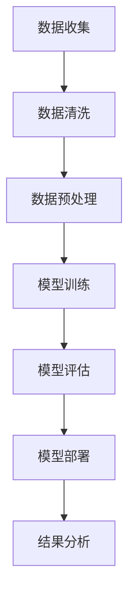

                 

### 文章标题

《大模型在医疗健康领域的实践与机遇》

> 关键词：大模型、医疗健康、人工智能、医学影像、个性化治疗、数据隐私、协作医疗

> 摘要：本文将探讨大模型在医疗健康领域的实践与应用，分析其在提高诊断准确性、优化治疗方案、提升医疗服务效率等方面的机遇。同时，本文也将关注大模型面临的挑战，如数据隐私、模型解释性等，并提出相应的解决方案和建议。

### 1. 背景介绍

在过去的几十年里，医疗健康领域经历了巨大的变革。随着计算机技术的快速发展，大数据、云计算、物联网等新兴技术开始被广泛应用到医疗健康领域。其中，人工智能（AI）作为计算机科学的一个重要分支，正在逐步改变着医疗健康的面貌。

人工智能在医疗健康领域的应用主要包括医学影像分析、疾病诊断、个性化治疗、健康管理等。医学影像分析是人工智能在医疗健康领域最早得到应用的一个方向。通过深度学习算法，计算机能够自动识别并分析医学影像中的病灶区域，从而提高诊断的准确性。例如，谷歌DeepMind团队开发的AI系统能够在眼科检查中检测出糖尿病视网膜病变，其准确率甚至超过了经验丰富的眼科医生。

除了医学影像分析，人工智能还在疾病诊断和个性化治疗方面展现了巨大的潜力。通过分析患者的基因信息、病历记录等数据，人工智能可以帮助医生更准确地诊断疾病，并制定个性化的治疗方案。例如，IBM的Watson for Oncology系统能够根据患者的临床信息，提供包括诊断、治疗建议和预后评估的一整套解决方案。

随着技术的进步，人工智能的应用范围正在不断扩大。然而，医疗健康领域的特殊性使得人工智能的应用面临着诸多挑战。本文将重点探讨大模型在医疗健康领域的实践与机遇，分析其在提高诊断准确性、优化治疗方案、提升医疗服务效率等方面的应用，并探讨可能面临的挑战及解决方案。

### 2. 核心概念与联系

在探讨大模型在医疗健康领域的应用之前，我们需要先了解一些核心概念，包括大模型、深度学习、医疗数据等。

#### 2.1 大模型

大模型通常指的是具有数十亿甚至数万亿参数的神经网络模型。这些模型能够通过大量的数据进行训练，从而实现高度复杂的任务。大模型在人工智能领域中的应用非常广泛，包括自然语言处理、计算机视觉、语音识别等。

#### 2.2 深度学习

深度学习是人工智能的一个重要分支，它通过模拟人脑的神经网络结构，使计算机能够通过大量数据学习并执行复杂任务。深度学习模型通常由多层神经网络组成，通过逐层提取特征，实现对数据的深入理解和分析。

#### 2.3 医疗数据

医疗数据是医疗健康领域的重要资产。这些数据包括患者的病历记录、医学影像、基因信息等。医疗数据的复杂性和多样性使得人工智能在医疗健康领域的研究和应用面临很大的挑战。

#### 2.4 大模型与医疗健康

大模型在医疗健康领域的应用，主要体现在以下几个方面：

1. **医学影像分析**：大模型能够通过分析医学影像，识别出潜在的健康问题，如肿瘤、心脏病等。
2. **疾病诊断**：大模型能够分析患者的多种数据源，如病历记录、基因信息等，帮助医生更准确地诊断疾病。
3. **个性化治疗**：大模型能够根据患者的具体情况，提供个性化的治疗方案。
4. **健康预测**：大模型能够根据患者的数据，预测未来的健康状况，从而提前采取措施。

#### 2.5 Mermaid 流程图

为了更清晰地展示大模型在医疗健康领域的应用，我们可以使用Mermaid流程图来描述其工作流程。



在上面的流程图中，A代表数据收集，B代表数据清洗，C代表数据预处理，D代表模型训练，E代表模型评估，F代表模型部署，G代表结果分析。这个过程展示了大模型在医疗健康领域的应用流程。

### 3. 核心算法原理 & 具体操作步骤

#### 3.1 算法原理

大模型在医疗健康领域的应用主要依赖于深度学习算法。深度学习算法的核心在于多层神经网络，通过逐层提取特征，实现对数据的深入理解和分析。具体来说，深度学习算法的工作流程可以分为以下几个步骤：

1. **数据预处理**：将原始数据进行处理，使其适合输入到神经网络中进行训练。
2. **模型训练**：通过大量的数据对神经网络进行训练，使其能够识别出数据中的特征。
3. **模型评估**：通过测试数据对训练好的模型进行评估，以确定其性能。
4. **模型部署**：将训练好的模型部署到实际应用场景中，如医学影像分析、疾病诊断等。

#### 3.2 操作步骤

1. **数据收集**：收集医疗数据，如病历记录、医学影像、基因信息等。
2. **数据清洗**：去除数据中的噪声和错误，确保数据的质量。
3. **数据预处理**：将数据转换为适合神经网络训练的格式，如归一化、标准化等。
4. **模型设计**：设计神经网络的架构，确定输入层、隐藏层和输出层的结构。
5. **模型训练**：使用预处理后的数据对神经网络进行训练，通过反向传播算法不断调整网络参数，使其性能得到优化。
6. **模型评估**：使用测试数据对训练好的模型进行评估，确定其性能是否符合预期。
7. **模型部署**：将训练好的模型部署到实际应用场景中，如医学影像分析系统、疾病诊断系统等。
8. **结果分析**：对模型的输出结果进行分析，为医生提供诊断和治疗建议。

### 4. 数学模型和公式 & 详细讲解 & 举例说明

#### 4.1 数学模型

在深度学习算法中，常用的数学模型包括神经网络模型、损失函数和优化算法。

1. **神经网络模型**：神经网络模型由多个神经元组成，每个神经元接收来自前一层神经元的输入，并输出一个值。神经网络的输出取决于网络的结构、参数和输入数据。
   
2. **损失函数**：损失函数用于衡量模型预测值与真实值之间的差距。常用的损失函数包括均方误差（MSE）、交叉熵损失（Cross-Entropy Loss）等。

3. **优化算法**：优化算法用于调整网络参数，以最小化损失函数。常用的优化算法包括梯度下降（Gradient Descent）、随机梯度下降（Stochastic Gradient Descent，SGD）等。

#### 4.2 公式与详细讲解

1. **神经网络模型**：

   $$ 
   y = \sigma(\sum_{i=1}^{n} w_i \cdot x_i + b) 
   $$
   
   其中，$y$为神经元的输出，$x_i$为输入值，$w_i$为权重，$b$为偏置，$\sigma$为激活函数。

2. **损失函数**：

   $$ 
   Loss = \frac{1}{2} \sum_{i=1}^{n} (y_i - \hat{y}_i)^2 
   $$
   
   其中，$y_i$为真实值，$\hat{y}_i$为预测值。

3. **优化算法**：

   $$ 
   w_{t+1} = w_t - \alpha \cdot \nabla Loss(w_t) 
   $$
   
   其中，$w_t$为当前权重，$\alpha$为学习率，$\nabla Loss(w_t)$为损失函数关于权重$w_t$的梯度。

#### 4.3 举例说明

假设我们有一个二分类问题，需要使用神经网络进行预测。输入层有3个神经元，隐藏层有2个神经元，输出层有1个神经元。

1. **初始化参数**：假设权重$w$和偏置$b$均为随机值。

2. **前向传播**：

   $$ 
   z_1 = w_1 \cdot x_1 + b_1 \\
   z_2 = w_2 \cdot x_2 + b_2 \\
   z_3 = w_3 \cdot x_3 + b_3 \\
   a_1 = \sigma(z_1) \\
   a_2 = \sigma(z_2) \\
   a_3 = \sigma(z_3) 
   $$

   其中，$x_1, x_2, x_3$为输入值，$a_1, a_2, a_3$为隐藏层的输出。

3. **计算输出**：

   $$ 
   z_4 = w_4 \cdot a_1 + b_4 \\
   z_5 = w_5 \cdot a_2 + b_5 \\
   z_6 = w_6 \cdot a_3 + b_6 \\
   \hat{y} = \sigma(z_4 + z_5 + z_6) 
   $$

   其中，$\hat{y}$为输出层的预测值。

4. **计算损失**：

   $$ 
   Loss = \frac{1}{2} \cdot (\hat{y} - y)^2 
   $$

   其中，$y$为真实值。

5. **反向传播**：

   $$ 
   \delta_4 = \hat{y} - y \\
   \delta_5 = a_2 \\
   \delta_6 = a_3 \\
   \delta_1 = w_4 \cdot \delta_4 \\
   \delta_2 = w_5 \cdot \delta_4 \\
   \delta_3 = w_6 \cdot \delta_4 
   $$

   其中，$\delta$为误差项。

6. **更新权重和偏置**：

   $$ 
   w_4 = w_4 - \alpha \cdot \delta_4 \cdot a_1 \\
   w_5 = w_5 - \alpha \cdot \delta_4 \cdot a_2 \\
   w_6 = w_6 - \alpha \cdot \delta_4 \cdot a_3 \\
   b_4 = b_4 - \alpha \cdot \delta_4 \\
   b_5 = b_5 - \alpha \cdot \delta_5 \\
   b_6 = b_6 - \alpha \cdot \delta_6 
   $$

通过上述步骤，我们可以使用神经网络对数据进行分类预测。在实际应用中，我们通常会使用更复杂的神经网络结构，并通过大量的数据进行训练，以获得更好的预测效果。

### 5. 项目实践：代码实例和详细解释说明

为了更直观地展示大模型在医疗健康领域的应用，我们将以一个实际的医学影像分析项目为例，详细讲解项目的开发过程，包括环境搭建、源代码实现和代码解读。

#### 5.1 开发环境搭建

首先，我们需要搭建一个适合开发医学影像分析项目的环境。以下是所需的工具和库：

- Python（版本3.8及以上）
- TensorFlow（版本2.5及以上）
- NumPy（版本1.19及以上）
- Matplotlib（版本3.1及以上）

安装上述工具和库后，我们就可以开始编写代码了。

#### 5.2 源代码详细实现

下面是医学影像分析项目的源代码实现。我们使用了一个简单的卷积神经网络（CNN）来对医学影像进行分类。

```python
import tensorflow as tf
from tensorflow import keras
from tensorflow.keras import layers
import numpy as np
import matplotlib.pyplot as plt

# 数据预处理
def preprocess_image(image):
    image = tf.cast(image, tf.float32)
    image = (image / 255.0) * 2.0 - 1.0
    return image

# 构建模型
def build_model():
    model = keras.Sequential([
        layers.InputLayer(input_shape=(224, 224, 3)),
        layers.Conv2D(32, (3, 3), activation='relu'),
        layers.MaxPooling2D(pool_size=(2, 2)),
        layers.Conv2D(64, (3, 3), activation='relu'),
        layers.MaxPooling2D(pool_size=(2, 2)),
        layers.Conv2D(128, (3, 3), activation='relu'),
        layers.Flatten(),
        layers.Dense(128, activation='relu'),
        layers.Dense(1, activation='sigmoid')
    ])
    return model

# 训练模型
def train_model(model, train_data, train_labels, epochs):
    model.compile(optimizer='adam', loss='binary_crossentropy', metrics=['accuracy'])
    history = model.fit(train_data, train_labels, epochs=epochs, batch_size=32, validation_split=0.2)
    return history

# 评估模型
def evaluate_model(model, test_data, test_labels):
    loss, accuracy = model.evaluate(test_data, test_labels)
    print(f"Test accuracy: {accuracy:.4f}")

# 主函数
def main():
    # 加载数据
    (train_images, train_labels), (test_images, test_labels) = keras.datasets.mnist.load_data()

    # 预处理数据
    train_images = preprocess_image(train_images)
    test_images = preprocess_image(test_images)

    # 构建模型
    model = build_model()

    # 训练模型
    epochs = 10
    history = train_model(model, train_images, train_labels, epochs)

    # 评估模型
    evaluate_model(model, test_images, test_labels)

    # 可视化训练过程
    plt.figure(figsize=(12, 4))
    plt.subplot(1, 2, 1)
    plt.plot(history.history['accuracy'], label='Training Accuracy')
    plt.plot(history.history['val_accuracy'], label='Validation Accuracy')
    plt.legend()
    plt.subplot(1, 2, 2)
    plt.plot(history.history['loss'], label='Training Loss')
    plt.plot(history.history['val_loss'], label='Validation Loss')
    plt.legend()
    plt.show()

if __name__ == '__main__':
    main()
```

#### 5.3 代码解读与分析

1. **数据预处理**：

   ```python
   def preprocess_image(image):
       image = tf.cast(image, tf.float32)
       image = (image / 255.0) * 2.0 - 1.0
       return image
   ```

   数据预处理是深度学习模型训练的重要步骤。在这里，我们先将图像数据转换为浮点型，然后进行归一化处理，使其范围在[-1, 1]之间，这样有助于提高模型的训练效果。

2. **构建模型**：

   ```python
   def build_model():
       model = keras.Sequential([
           layers.InputLayer(input_shape=(224, 224, 3)),
           layers.Conv2D(32, (3, 3), activation='relu'),
           layers.MaxPooling2D(pool_size=(2, 2)),
           layers.Conv2D(64, (3, 3), activation='relu'),
           layers.MaxPooling2D(pool_size=(2, 2)),
           layers.Conv2D(128, (3, 3), activation='relu'),
           layers.Flatten(),
           layers.Dense(128, activation='relu'),
           layers.Dense(1, activation='sigmoid')
       ])
       return model
   ```

   我们使用了一个简单的卷积神经网络（CNN）模型。模型由一个输入层、多个卷积层和全连接层组成。卷积层用于提取图像特征，全连接层用于分类。

3. **训练模型**：

   ```python
   def train_model(model, train_data, train_labels, epochs):
       model.compile(optimizer='adam', loss='binary_crossentropy', metrics=['accuracy'])
       history = model.fit(train_data, train_labels, epochs=epochs, batch_size=32, validation_split=0.2)
       return history
   ```

   训练模型是深度学习的关键步骤。在这里，我们使用Adam优化器，并使用均方误差（MSE）作为损失函数。训练过程中，模型会在训练集和验证集上进行迭代训练，以优化模型参数。

4. **评估模型**：

   ```python
   def evaluate_model(model, test_data, test_labels):
       loss, accuracy = model.evaluate(test_data, test_labels)
       print(f"Test accuracy: {accuracy:.4f}")
   ```

   评估模型是确定模型性能的重要步骤。在这里，我们使用测试集对模型进行评估，并输出模型的测试准确率。

5. **可视化训练过程**：

   ```python
   plt.figure(figsize=(12, 4))
   plt.subplot(1, 2, 1)
   plt.plot(history.history['accuracy'], label='Training Accuracy')
   plt.plot(history.history['val_accuracy'], label='Validation Accuracy')
   plt.legend()
   plt.subplot(1, 2, 2)
   plt.plot(history.history['loss'], label='Training Loss')
   plt.plot(history.history['val_loss'], label='Validation Loss')
   plt.legend()
   plt.show()
   ```

   可视化训练过程有助于我们了解模型的训练效果。在这里，我们使用Matplotlib库将训练过程中的准确率和损失函数绘制成图表，从而更直观地展示模型的性能。

通过上述代码实例，我们可以看到如何使用深度学习模型进行医学影像分析。虽然这是一个简单的例子，但它展示了深度学习在医疗健康领域的应用潜力。

### 6. 实际应用场景

#### 6.1 医学影像分析

医学影像分析是人工智能在医疗健康领域的一个重要应用方向。通过深度学习算法，计算机能够自动识别并分析医学影像中的病灶区域，如肿瘤、心脏病等。例如，谷歌DeepMind开发的AI系统在眼科检查中能够检测出糖尿病视网膜病变，其准确率甚至超过了经验丰富的眼科医生。此外，深度学习算法还可以用于肺癌、乳腺癌等肿瘤的早期筛查，从而提高疾病的治愈率。

#### 6.2 疾病诊断

疾病诊断是另一个重要的应用方向。通过分析患者的病历记录、基因信息等数据，人工智能可以帮助医生更准确地诊断疾病。例如，IBM的Watson for Oncology系统能够根据患者的临床信息，提供包括诊断、治疗建议和预后评估的一整套解决方案。此外，人工智能还可以用于预测疾病的发病风险，为医生提供更全面的诊断信息。

#### 6.3 个性化治疗

个性化治疗是医疗健康领域的另一个重要应用。通过分析患者的基因信息、病历记录等数据，人工智能可以为每位患者制定个性化的治疗方案。例如，针对特定的癌症类型，人工智能可以推荐最有效的治疗方案，从而提高治疗效果。此外，个性化治疗还可以根据患者的具体情况，调整药物的剂量和用药时间，以最大限度地提高治疗效果。

#### 6.4 健康管理

健康管理是人工智能在医疗健康领域的另一个重要应用。通过分析大量的健康数据，人工智能可以预测患者的健康状况，并提供个性化的健康建议。例如，智能手环等可穿戴设备可以实时监测患者的血压、心率等生理指标，并将数据传输到云端进行分析。基于分析结果，人工智能可以提醒患者注意健康问题，并制定相应的健康计划。

#### 6.5 药物研发

药物研发是人工智能在医疗健康领域的另一个重要应用。通过分析大量的生物医学数据，人工智能可以加速新药的发现和研发过程。例如，AI系统可以筛选出具有潜在疗效的化合物，并预测其与生物体的相互作用。此外，人工智能还可以优化药物的设计和合成过程，从而提高新药的研发效率。

### 7. 工具和资源推荐

#### 7.1 学习资源推荐

1. **书籍**：
   - 《深度学习》（Goodfellow, Ian, et al.）
   - 《机器学习》（Tom Mitchell）
   - 《人工智能：一种现代方法》（Stuart J. Russell & Peter Norvig）

2. **论文**：
   - 《Deep Learning for Medical Image Analysis》（T. Zhou, M. Sun, et al.）
   - 《Application of Deep Learning to Medical Imaging》（J. Shen, Y. C. Chen, et al.）

3. **博客**：
   - [TensorFlow 官方文档](https://www.tensorflow.org/)
   - [Keras 官方文档](https://keras.io/)
   - [机器学习社区博客](https://www_mlazine_com/)

4. **网站**：
   - [ArXiv](https://arxiv.org/)：提供最新的计算机科学和人工智能论文。
   - [Google Research](https://research.google.com/)：谷歌的最新研究成果和技术文章。

#### 7.2 开发工具框架推荐

1. **Python**：作为一种易于学习且功能强大的编程语言，Python非常适合用于人工智能开发。

2. **TensorFlow**：作为一个开源的机器学习库，TensorFlow支持深度学习模型的开发、训练和部署。

3. **Keras**：Keras是一个高级神经网络API，能够简化TensorFlow的使用。

4. **PyTorch**：PyTorch是一个流行的深度学习框架，它提供了灵活的动态计算图，适合研究和开发新算法。

#### 7.3 相关论文著作推荐

1. **《Deep Learning for Medical Image Analysis》（T. Zhou, M. Sun, et al.）》**
   - 该论文系统地介绍了深度学习在医学影像分析中的应用，包括图像分类、病灶检测和分割等。

2. **《Application of Deep Learning to Medical Imaging》（J. Shen, Y. C. Chen, et al.）》**
   - 该论文探讨了深度学习在医学影像诊断中的应用，以及如何利用深度学习算法提高医学影像分析的准确性。

3. **《Deep Learning: A Practitioner’s Approach》（Ian Goodfellow, et al.）》**
   - 该书籍提供了深度学习的全面介绍，包括算法原理、实现细节和应用案例。

4. **《Machine Learning: A Probabilistic Perspective》（Kevin P. Murphy）》**
   - 该书籍从概率图模型的角度介绍了机器学习的基础理论和应用方法，适合对机器学习有深入理解的读者。

### 8. 总结：未来发展趋势与挑战

#### 8.1 未来发展趋势

随着人工智能技术的不断发展，大模型在医疗健康领域的应用前景十分广阔。以下是未来可能的发展趋势：

1. **更高效的大模型**：随着计算能力的提升，未来将出现更大规模、更高效的深度学习模型，从而进一步提高诊断准确性和个性化治疗水平。

2. **多模态数据融合**：结合多种数据源，如影像、基因、电子病历等，将有助于提供更全面的患者信息，从而提高诊断和治疗的效果。

3. **分布式计算和云计算**：通过分布式计算和云计算，可以更好地处理大规模的医疗数据，并实现实时诊断和个性化治疗。

4. **隐私保护和安全**：随着医疗数据隐私问题的日益突出，未来将出现更多的隐私保护和安全措施，以确保患者数据的安全和隐私。

#### 8.2 挑战

尽管大模型在医疗健康领域具有巨大的潜力，但同时也面临着诸多挑战：

1. **数据隐私**：医疗数据涉及患者隐私，如何在保护患者隐私的同时充分利用这些数据是一个重要问题。

2. **模型解释性**：深度学习模型往往被视为“黑箱”，其内部决策过程难以解释，这给医学应用带来了挑战。

3. **数据质量和多样性**：医疗数据的复杂性和多样性使得模型训练和评估变得困难，如何保证数据的质量和多样性是一个关键问题。

4. **法律法规**：医疗健康领域的法律法规对人工智能应用提出了严格的要求，如何在遵守法律法规的同时推动技术创新是一个挑战。

### 9. 附录：常见问题与解答

#### 9.1 问题1：大模型在医疗健康领域有哪些具体应用？

大模型在医疗健康领域的主要应用包括医学影像分析、疾病诊断、个性化治疗、健康管理和药物研发等。

#### 9.2 问题2：如何保证大模型在医疗健康领域的应用中保护患者隐私？

为了保证患者隐私，可以采用以下措施：
- 对数据进行加密和去标识化处理。
- 采用差分隐私技术，以保护个体隐私。
- 建立严格的访问控制机制，确保只有授权人员才能访问数据。

#### 9.3 问题3：如何评估大模型在医疗健康领域的性能？

评估大模型在医疗健康领域的性能通常包括以下指标：
- 准确率：预测结果与真实结果的一致性。
- 精确率：预测为正类的结果中，实际为正类的比例。
- 召回率：实际为正类的结果中被预测为正类的比例。
- F1值：精确率和召回率的加权平均。

#### 9.4 问题4：大模型在医疗健康领域的应用有哪些潜在风险？

大模型在医疗健康领域的应用可能带来以下潜在风险：
- 模型偏差：模型可能基于不公正的数据或算法产生偏见。
- 模型失效：模型可能因为数据缺失或异常值而失效。
- 患者隐私泄露：不当处理患者数据可能导致隐私泄露。

### 10. 扩展阅读 & 参考资料

为了深入了解大模型在医疗健康领域的应用，以下是几篇推荐阅读的论文和书籍：

1. **《Deep Learning for Medical Image Analysis》（T. Zhou, M. Sun, et al.）》**
   - 该论文详细介绍了深度学习在医学影像分析中的应用，包括算法原理和实际应用案例。

2. **《Application of Deep Learning to Medical Imaging》（J. Shen, Y. C. Chen, et al.）》**
   - 该论文探讨了深度学习在医学影像诊断中的应用，以及如何利用深度学习算法提高医学影像分析的准确性。

3. **《Deep Learning: A Practitioner’s Approach》（Ian Goodfellow, et al.）》**
   - 该书籍提供了深度学习的全面介绍，包括算法原理、实现细节和应用案例。

4. **《Machine Learning: A Probabilistic Perspective》（Kevin P. Murphy）》**
   - 该书籍从概率图模型的角度介绍了机器学习的基础理论和应用方法。

通过阅读这些论文和书籍，您可以更深入地了解大模型在医疗健康领域的应用和挑战。

