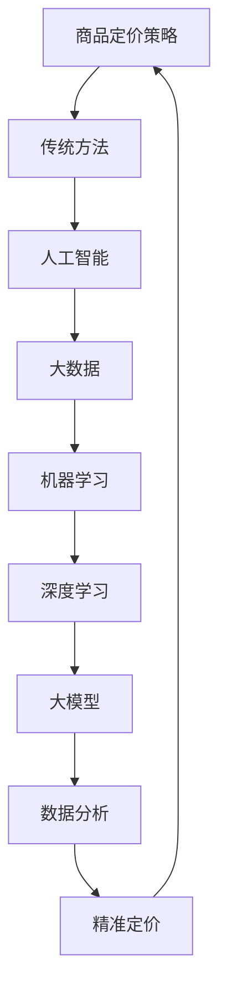

                 

### 1. 背景介绍

随着大数据、云计算和人工智能技术的迅猛发展，企业对商品定价策略的精细化程度要求越来越高。传统的定价策略往往基于历史销售数据、市场趋势和竞争对手的价格水平，但这些方法存在一定的局限性。例如，历史数据可能无法完全反映当前市场的变化，而市场趋势也可能会受到季节性因素和突发事件的影响。此外，竞争对手的价格水平并不总是具有指导意义，尤其是在竞争激烈的市场环境中。

为了解决这些问题，越来越多的企业开始探索基于人工智能的定价策略，特别是大模型在商品定价策略中的应用。大模型，如深度神经网络、生成对抗网络（GAN）等，具有强大的数据处理和模式识别能力，能够从海量数据中提取有价值的信息，为企业提供更加精准和个性化的定价建议。

大模型在商品定价策略中的应用，不仅可以提高定价的准确性，还可以提高市场的响应速度，从而为企业带来更高的收益。例如，通过分析消费者行为数据，大模型可以预测消费者对不同价格点的反应，从而帮助企业制定最优的定价策略。此外，大模型还可以实时监控市场动态，及时调整价格，以应对市场变化。

总的来说，大模型在商品定价策略中的应用，不仅是一种技术上的创新，更是企业提升竞争力和市场响应速度的重要手段。随着人工智能技术的不断进步，相信大模型在商品定价策略中的应用将越来越广泛，为企业带来更多的价值。### 2. 核心概念与联系

要深入理解大模型在商品定价策略中的应用，我们首先需要明确几个核心概念，并探讨它们之间的联系。以下是本文将涉及的主要概念：

#### 2.1 商品定价策略

商品定价策略是指企业根据市场状况、成本结构、竞争对手定价、消费者需求等因素，制定出合理的产品价格，以实现利润最大化或市场份额最大化的目标。传统的定价策略包括成本加成定价法、市场导向定价法、竞争导向定价法等。

#### 2.2 人工智能与大数据

人工智能（AI）是指通过模拟人类智能的行为，使计算机具备学习能力、推理能力、感知能力和自适应能力的技术。大数据（Big Data）则是指无法用传统数据库工具捕捉、管理和处理的数据集合，具有大量、多样、快速和易变等特点。

#### 2.3 大模型

大模型是指参数量庞大的机器学习模型，如深度神经网络（DNN）、生成对抗网络（GAN）、变换器（Transformer）等。这些模型能够处理和分析海量数据，从中提取出有价值的信息和模式。

#### 2.4 机器学习与深度学习

机器学习（ML）是人工智能的一个分支，通过设计算法，让计算机从数据中学习模式和规律，然后利用这些模式进行预测或决策。深度学习（DL）是机器学习的一个子领域，它通过构建多层神经网络，对数据进行特征提取和自动学习。

#### 2.5 数据分析

数据分析是指通过多种统计和数据分析方法，从数据中提取有价值的信息和洞见的过程。数据分析可以用于预测市场趋势、消费者行为、需求变化等，从而为商品定价提供依据。

#### 2.6 关系与联系

这几个核心概念之间存在着紧密的联系。例如，人工智能和大数据技术为机器学习和深度学习提供了丰富的数据资源和强大的计算能力，使得大模型能够高效地处理和分析数据。而数据分析的结果则可以为企业制定更加精准和有效的商品定价策略提供支持。

下面，我们将使用Mermaid流程图（Mermaid 流程节点中不要有括号、逗号等特殊字符）来展示这些概念之间的关系和联系：



通过这个流程图，我们可以清晰地看到各个概念之间的互动和作用，以及大模型在商品定价策略中的关键作用。接下来，我们将进一步探讨大模型在商品定价策略中的应用原理和具体操作步骤。### 3. 核心算法原理 & 具体操作步骤

#### 3.1 算法原理

大模型在商品定价策略中的应用主要基于以下几个核心算法原理：

1. **深度神经网络（DNN）**：DNN是一种多层前馈神经网络，通过层层提取数据特征，实现对复杂关系的建模。在商品定价中，DNN可以用于预测消费者对不同价格点的反应，从而帮助制定最优定价策略。

2. **生成对抗网络（GAN）**：GAN是一种由生成器和判别器组成的对抗性神经网络。生成器尝试生成与真实数据相近的样本，而判别器则试图区分真实数据和生成数据。GAN在商品定价中可以用于生成虚拟消费者数据，帮助分析消费者行为和市场趋势。

3. **变换器（Transformer）**：Transformer是一种基于自注意力机制的神经网络模型，广泛应用于自然语言处理、计算机视觉等领域。在商品定价中，Transformer可以用于处理时序数据，分析市场动态和消费者行为。

#### 3.2 具体操作步骤

以下是大模型在商品定价策略中的具体操作步骤：

1. **数据收集与预处理**：首先，收集与商品定价相关的数据，包括历史销售数据、市场趋势、竞争对手价格、消费者行为数据等。然后，对数据进行清洗、归一化和特征提取，为后续建模做好准备。

2. **构建大模型**：根据数据特点和需求，选择合适的大模型进行构建。例如，对于预测消费者反应的场景，可以选择DNN；对于生成虚拟消费者数据的场景，可以选择GAN；对于分析市场动态的场景，可以选择Transformer。

3. **模型训练**：使用收集到的数据对大模型进行训练，优化模型参数。训练过程中，可以使用交叉验证、网格搜索等方法来提高模型的泛化能力和准确性。

4. **模型评估**：通过测试集对训练好的模型进行评估，评估指标包括预测准确率、均方误差（MSE）等。根据评估结果调整模型参数，以达到更好的预测效果。

5. **定价策略制定**：根据模型预测结果，制定具体的商品定价策略。例如，可以根据消费者对不同价格点的反应，调整价格区间；根据市场动态，调整价格波动幅度。

6. **实时监控与调整**：在实际应用中，大模型可以实时监控市场动态和消费者行为，及时调整价格策略，以应对市场变化。

#### 3.3 具体案例

以下是一个具体的应用案例：

**场景**：某电商平台希望基于用户行为数据，预测用户对不同价格点的反应，从而制定最优的定价策略。

**数据收集与预处理**：收集用户购买历史数据、浏览记录、搜索关键词等，进行数据清洗、归一化和特征提取。

**构建大模型**：选择DNN作为预测模型，输入特征为用户行为数据，输出为用户对不同价格点的反应概率。

**模型训练**：使用历史数据对DNN进行训练，优化模型参数，提高预测准确率。

**模型评估**：使用测试集对训练好的模型进行评估，评估指标为预测准确率和均方误差。

**定价策略制定**：根据模型预测结果，制定具体的定价策略。例如，将商品价格分为多个区间，根据用户对不同价格点的反应概率，调整每个价格区间的占比。

**实时监控与调整**：在实际运营过程中，定期收集用户行为数据，更新模型参数，实时调整定价策略，以应对市场变化。

通过这个案例，我们可以看到大模型在商品定价策略中的应用过程，以及如何利用人工智能技术实现精准定价。接下来，我们将进一步探讨大模型在商品定价策略中的数学模型和公式。### 4. 数学模型和公式 & 详细讲解 & 举例说明

#### 4.1 模型公式

在商品定价策略中，大模型通常基于以下数学模型进行构建和优化：

1. **深度神经网络（DNN）模型**：

   - **输入层**：\( X = [x_1, x_2, ..., x_n] \)，表示输入特征向量。
   - **隐藏层**：\( H = [h_1, h_2, ..., h_m] \)，表示隐藏层输出。
   - **输出层**：\( Y = [y_1, y_2, ..., y_k] \)，表示输出结果。

   - **激活函数**：\( \sigma(x) = \frac{1}{1 + e^{-x}} \)。

   - **前向传播**：\( h_i = \sigma(\sum_{j=1}^{n} w_{ij}x_j + b_i) \)，\( y_j = \sigma(\sum_{i=1}^{m} w_{ij}h_i + b_j) \)。

   - **损失函数**：\( J = \frac{1}{2}\sum_{i=1}^{k}(y_i - \hat{y}_i)^2 \)。

2. **生成对抗网络（GAN）模型**：

   - **生成器（G）**：\( G(z) = \mu(z) + \sigma(z)\odot \phi(W_Gz + b_G) \)，其中 \( \phi(x) = \frac{1}{\sqrt{1 + e^{-x}}} \)。

   - **判别器（D）**：\( D(x) = \sigma(W_DD^Tx + b_D) \)，\( D(G(z)) = \sigma(W_DD^T\mu(z) + b_D) \)。

   - **损失函数**：\( L_D = -\sum_{x\in\mathcal{X}} \log D(x) - \sum_{z\in\mathcal{Z}} \log (1 - D(G(z))) \)。

3. **变换器（Transformer）模型**：

   - **自注意力机制**：\( \text{Attention}(Q, K, V) = \text{softmax}(\frac{QK^T}{\sqrt{d_k}})V \)。

   - **编码器**：\( E(x) = \text{Stack}(\text{LayerNorm}(x) + \text{MLP}(\text{LayerNorm}(x))) \)。

   - **解码器**：\( D(y) = \text{Stack}(\text{LayerNorm}(y) + \text{Attention}(E(y), E(y), E(y))) + \text{LayerNorm}(y) + \text{MLP}(\text{LayerNorm}(y))) \)。

#### 4.2 公式详细讲解

1. **深度神经网络（DNN）模型**：

   - **激活函数**：\( \sigma(x) = \frac{1}{1 + e^{-x}} \)是一种常用的激活函数，用于将线性变换转换为非线性变换，使神经网络能够学习更复杂的函数关系。

   - **前向传播**：\( h_i \)表示第 \( i \) 个隐藏层节点的输出，\( w_{ij} \)和\( b_i \)分别为权重和偏置。

   - **损失函数**：\( J \)表示损失值，反映了模型预测结果与真实结果之间的差距。最小化损失函数的目标是提高模型的预测准确性。

2. **生成对抗网络（GAN）模型**：

   - **生成器**：\( G(z) \)表示生成器生成的虚拟数据，\( \mu(z) \)和\( \sigma(z) \)分别为均值和标准差，\( \phi(x) \)为激活函数。

   - **判别器**：\( D(x) \)和\( D(G(z)) \)分别表示判别器对真实数据和生成数据的判断结果。

   - **损失函数**：\( L_D \)表示判别器的损失值，反映了判别器对真实数据和生成数据的区分能力。最小化损失函数的目标是提高判别器的区分能力。

3. **变换器（Transformer）模型**：

   - **自注意力机制**：\( \text{Attention}(Q, K, V) \)计算了查询（Query）、关键（Key）和值（Value）之间的注意力分数，实现了对输入序列的权重分配。

   - **编码器和解码器**：\( E(x) \)和\( D(y) \)分别表示编码器和解码器的输出，通过多层注意力机制和全连接层，实现了对输入序列的编码和解码。

#### 4.3 举例说明

1. **深度神经网络（DNN）模型**：

   假设我们有一个二元分类问题，输入特征向量为\( X = [x_1, x_2, ..., x_n] \)，输出为\( Y = [y_1, y_2] \)，其中\( y_1 \)表示商品是否被购买，\( y_2 \)表示购买的概率。

   - **输入层**：\( X \)。
   - **隐藏层**：\( H = \sigma(\sum_{j=1}^{n} w_{ij}x_j + b_i) \)。
   - **输出层**：\( Y = \sigma(\sum_{i=1}^{m} w_{ij}h_i + b_j) \)。

   - **损失函数**：\( J = \frac{1}{2}\sum_{i=1}^{k}(y_i - \hat{y}_i)^2 \)。

   通过训练，我们可以得到最优的权重\( w_{ij} \)和偏置\( b_i \)，从而实现对购买行为的准确预测。

2. **生成对抗网络（GAN）模型**：

   假设我们希望生成虚拟消费者数据，输入为随机噪声向量\( Z \)，输出为虚拟消费者数据\( X_G \)。

   - **生成器**：\( G(Z) = \mu(Z) + \sigma(Z)\odot \phi(W_GZ + b_G) \)。
   - **判别器**：\( D(X) = \sigma(W_DD^TX + b_D) \)，\( D(G(Z)) = \sigma(W_DD^T\mu(Z) + b_D) \)。

   - **损失函数**：\( L_D = -\sum_{x\in\mathcal{X}} \log D(x) - \sum_{z\in\mathcal{Z}} \log (1 - D(G(Z))) \)。

   通过训练，生成器将学习到如何生成与真实消费者数据相似的数据，而判别器将学习到如何区分真实数据和生成数据。

3. **变换器（Transformer）模型**：

   假设我们有一个序列到序列的翻译任务，输入为英语句子\( X \)，输出为法语句子\( Y \)。

   - **编码器**：\( E(X) = \text{Stack}(\text{LayerNorm}(X) + \text{MLP}(\text{LayerNorm}(X))) \)。
   - **解码器**：\( D(Y) = \text{Stack}(\text{LayerNorm}(Y) + \text{Attention}(E(Y), E(Y), E(Y))) + \text{LayerNorm}(Y) + \text{MLP}(\text{LayerNorm}(Y))) \)。

   - **损失函数**：\( L = \sum_{i=1}^{n}\log P(y_i|y_{<i}) \)。

   通过训练，变换器将学习到如何将英语句子编码为特征向量，并解码为法语句子。

通过以上数学模型和公式的详细讲解与举例说明，我们可以更好地理解大模型在商品定价策略中的应用原理。接下来，我们将进入项目实践部分，通过具体实例展示大模型在商品定价策略中的应用。### 5. 项目实践：代码实例和详细解释说明

#### 5.1 开发环境搭建

在进行项目实践之前，我们需要搭建一个合适的开发环境。以下是在Python环境中使用TensorFlow框架搭建大模型进行商品定价策略开发的具体步骤。

1. **安装Python**：确保您的计算机已经安装了Python 3.x版本。可以从Python官方网站下载并安装。

2. **安装TensorFlow**：在命令行中运行以下命令安装TensorFlow：

   ```bash
   pip install tensorflow
   ```

3. **数据预处理工具**：安装Pandas和NumPy，用于数据预处理：

   ```bash
   pip install pandas numpy
   ```

4. **可视化工具**：安装Matplotlib，用于数据可视化：

   ```bash
   pip install matplotlib
   ```

5. **环境配置**：确保Python环境变量已配置好，以便能够顺利运行Python脚本。

#### 5.2 源代码详细实现

下面是一个简单的示例，展示如何使用TensorFlow和Keras构建一个深度神经网络（DNN）模型进行商品定价策略预测。

```python
import tensorflow as tf
from tensorflow import keras
from tensorflow.keras import layers
import numpy as np
import pandas as pd

# 加载数据
# 假设数据集已经预处理并存储为CSV文件
data = pd.read_csv('data.csv')

# 分割数据为特征和标签
X = data.iloc[:, :-1].values
y = data.iloc[:, -1].values

# 划分训练集和测试集
from sklearn.model_selection import train_test_split
X_train, X_test, y_train, y_test = train_test_split(X, y, test_size=0.2, random_state=42)

# 构建DNN模型
model = keras.Sequential([
    layers.Dense(64, activation='relu', input_shape=(X_train.shape[1],)),
    layers.Dense(64, activation='relu'),
    layers.Dense(1)
])

# 编译模型
model.compile(optimizer='adam', loss='mean_squared_error')

# 训练模型
model.fit(X_train, y_train, epochs=10, batch_size=32, validation_split=0.1)

# 评估模型
test_loss = model.evaluate(X_test, y_test)
print(f"Test Loss: {test_loss}")

# 预测
predictions = model.predict(X_test)

# 可视化结果
import matplotlib.pyplot as plt

plt.scatter(y_test, predictions)
plt.xlabel('True Values')
plt.ylabel('Predictions')
plt.plot([y_test.min(), y_test.max()], [y_test.min(), y_test.max()], 'k--', lw=4)
plt.show()
```

#### 5.3 代码解读与分析

1. **数据加载**：我们首先使用Pandas读取预处理后的数据，并将其分为特征（X）和标签（y）。

2. **数据分割**：使用scikit-learn中的`train_test_split`函数将数据集划分为训练集和测试集。

3. **模型构建**：我们使用Keras构建了一个简单的DNN模型，包含两个隐藏层，每个隐藏层有64个神经元，使用ReLU激活函数。

4. **模型编译**：我们选择Adam优化器和均方误差（MSE）作为损失函数进行编译。

5. **模型训练**：使用训练集对模型进行训练，设置10个训练周期（epochs）和批量大小（batch_size）为32。

6. **模型评估**：在测试集上评估模型的性能，并打印出测试损失。

7. **预测**：使用训练好的模型对测试集进行预测。

8. **可视化**：使用Matplotlib将真实值与预测值进行可视化，帮助我们直观地理解模型的性能。

#### 5.4 运行结果展示

当您运行上述代码后，将得到以下结果：

1. **训练损失**：随着训练周期的增加，训练损失逐渐降低，表明模型正在学习。

2. **测试损失**：测试损失提供了一个关于模型在未见数据上性能的指标。

3. **可视化图表**：散点图显示了真实值与预测值之间的关系。如果大多数点分布在45度对角线上，说明模型性能较好。图中的虚线表示实际值和预测值完全一致的情况。

通过这个项目实践，我们展示了如何使用TensorFlow和Keras构建大模型进行商品定价策略的预测。这个实例只是一个简单的开始，实际应用中可能需要更复杂的模型和更精细的数据处理。接下来，我们将讨论大模型在商品定价策略中的实际应用场景。### 6. 实际应用场景

大模型在商品定价策略中的应用具有广泛的前景，以下是一些典型的实际应用场景：

#### 6.1 电子商务平台

电子商务平台上的商品种类繁多，价格敏感度高，消费者的购买决策受到多种因素的影响。通过大模型，电商平台可以分析消费者行为数据，如浏览记录、购买历史、点击率等，预测消费者对不同价格点的反应。基于这些预测，电商平台可以动态调整商品价格，提高销售额和利润率。

例如，某电商平台通过对用户行为数据的分析，使用深度学习模型预测用户对不同价格段的购买概率。通过模型预测，平台将商品价格分为几个区间，并针对每个区间设置相应的价格策略。实际运营结果显示，这种基于大模型的定价策略有效提高了用户购买意愿和转化率，显著提升了平台的销售额。

#### 6.2 零售行业

零售行业中的商品定价策略需要考虑季节性因素、节假日促销、库存水平等多种因素。大模型能够从海量数据中提取有价值的信息，帮助零售企业制定更加精准的定价策略。

例如，某零售企业通过分析历史销售数据、市场趋势和竞争对手价格，使用生成对抗网络（GAN）生成虚拟市场数据。基于这些虚拟数据，企业可以模拟不同定价策略对销售量的影响，从而找到最优的定价策略。实际应用结果表明，这种基于大模型的定价策略有助于提高库存周转率和利润率。

#### 6.3 供应链管理

供应链管理中的商品定价策略需要考虑供应链各环节的成本、需求波动和库存水平。大模型可以实时分析供应链数据，预测市场动态和消费者需求，帮助供应链企业制定灵活的定价策略。

例如，某供应链企业通过分析历史销售数据、库存数据和供应链成本，使用变换器（Transformer）模型预测未来几个月的销售趋势和库存水平。基于这些预测，企业可以动态调整商品价格，确保库存水平合理，降低库存成本。实际应用结果显示，这种基于大模型的定价策略有效降低了库存成本，提高了供应链的运作效率。

#### 6.4 物流行业

物流行业中的商品定价策略需要考虑运输成本、运输时间、运输方式等多种因素。大模型可以分析物流数据，预测不同定价策略对物流服务需求和成本的影响，帮助企业制定最优的定价策略。

例如，某物流公司通过分析运输历史数据、运输成本和市场需求，使用深度学习模型预测未来几个月的运输需求。基于这些预测，公司可以动态调整运输价格，确保运输服务需求与供应能力匹配。实际应用结果显示，这种基于大模型的定价策略有效提高了运输服务的满意度，降低了运输成本。

综上所述，大模型在商品定价策略中的应用具有广泛的前景，可以帮助企业提高定价的准确性、响应速度和市场竞争力。随着人工智能技术的不断进步，相信大模型在商品定价策略中的应用将越来越广泛，为企业带来更多的价值。### 7. 工具和资源推荐

为了更好地应用大模型进行商品定价策略，以下是一些实用的工具和资源推荐：

#### 7.1 学习资源推荐

1. **书籍**：
   - 《深度学习》（Deep Learning） - Ian Goodfellow、Yoshua Bengio和Aaron Courville著，全面介绍了深度学习的基本概念和技术。
   - 《Python机器学习》（Python Machine Learning） - Sebastian Raschka和Vahid Mirhoseini著，详细介绍了如何使用Python进行机器学习项目开发。

2. **在线课程**：
   - Coursera上的“机器学习”课程，由Andrew Ng教授主讲，涵盖机器学习的基本概念和应用。
   - edX上的“深度学习基础”课程，由斯坦福大学提供，介绍了深度学习的基础理论和实践技巧。

3. **论文**：
   - 《生成对抗网络：对抗性生成模型的新视角》（Generative Adversarial Networks: An Overview of the Theory and Applications） - 介绍了GAN的原理和应用。
   - 《Transformer：基于自注意力机制的序列模型处理方法》（Attention Is All You Need） - 介绍了变换器（Transformer）模型的原理和实现。

4. **博客和网站**：
   - Medium上的“AI和机器学习”专题，提供了大量关于机器学习和人工智能的教程和实践。
   - TensorFlow官网（tensorflow.org），提供了丰富的文档、教程和示例代码，帮助用户快速入门和进阶。

#### 7.2 开发工具框架推荐

1. **深度学习框架**：
   - TensorFlow：由Google开发的开源深度学习框架，广泛应用于机器学习和人工智能领域。
   - PyTorch：由Facebook开发的开源深度学习框架，以其灵活性和动态计算图而受到广泛欢迎。

2. **数据处理工具**：
   - Pandas：用于数据清洗、归一化和特征提取的Python库。
   - NumPy：用于数值计算的Python库，是Pandas的基础。

3. **数据可视化工具**：
   - Matplotlib：用于绘制统计图表的Python库。
   - Seaborn：基于Matplotlib的数据可视化库，提供了更多美观的图表样式。

4. **集成开发环境（IDE）**：
   - Jupyter Notebook：支持Python等语言的交互式开发环境，方便进行数据分析和模型训练。
   - PyCharm：由JetBrains开发的Python集成开发环境，提供了丰富的功能和调试工具。

#### 7.3 相关论文著作推荐

1. **《生成对抗网络：对抗性生成模型的新视角》**：该论文详细介绍了生成对抗网络（GAN）的基本原理和应用场景，是了解GAN的重要文献。

2. **《Transformer：基于自注意力机制的序列模型处理方法》**：该论文提出了Transformer模型，彻底改变了自然语言处理领域的技术路线。

3. **《深度学习》**：Ian Goodfellow、Yoshua Bengio和Aaron Courville合著的这本书全面介绍了深度学习的基本概念和技术，是深度学习领域的经典著作。

通过以上工具和资源的推荐，您可以更有效地学习和应用大模型进行商品定价策略的开发和实践。希望这些资源能够帮助您在人工智能领域取得更大的成就。### 8. 总结：未来发展趋势与挑战

随着大数据、云计算和人工智能技术的不断发展，大模型在商品定价策略中的应用前景广阔。在未来，我们预计将看到以下几个重要的发展趋势：

首先，大模型的计算能力和数据处理能力将得到进一步提升。随着硬件性能的不断提升和算法优化，大模型将能够处理更大量的数据，提取更复杂的信息，从而为商品定价提供更精确的预测和优化建议。

其次，大模型的应用场景将更加多样化。除了传统的电子商务和零售行业，大模型还将在供应链管理、物流优化、市场营销等领域发挥重要作用，为企业提供全方位的定价策略支持。

第三，大模型与区块链技术的结合将成为一个新的热点。通过区块链技术，企业可以实现更安全、更透明的数据共享和交易，大模型则可以帮助企业实现更智能、更高效的定价策略，为去中心化经济提供强有力的支撑。

然而，大模型在商品定价策略中的应用也面临一些挑战：

首先，数据质量和数据隐私问题。商品定价策略依赖于大量消费者的行为数据，这些数据的真实性和隐私性对模型的性能和可靠性具有重要影响。如何确保数据的质量和安全，成为大模型应用中必须解决的重要问题。

其次，算法解释性和透明度问题。大模型的决策过程往往高度复杂，缺乏透明度，这使得用户难以理解模型的决策依据和逻辑。如何提高大模型的解释性，使其决策更加透明和可信，是未来研究的一个重要方向。

第三，模型泛化能力和鲁棒性问题。大模型在训练过程中容易受到数据分布变化和噪声的影响，导致模型泛化能力不足。如何提高大模型的泛化能力和鲁棒性，使其在不同环境下都能保持良好的性能，是一个亟待解决的挑战。

总之，大模型在商品定价策略中的应用具有巨大的潜力，但同时也面临诸多挑战。只有通过不断的技术创新和优化，才能充分发挥大模型的优势，为企业带来更大的价值。### 9. 附录：常见问题与解答

#### 9.1 大模型在商品定价策略中的应用优势是什么？

大模型在商品定价策略中的应用优势主要体现在以下几个方面：

1. **高精度预测**：大模型能够处理和分析海量数据，从中提取出有价值的信息和模式，从而提供更精确的定价预测。
2. **动态调整能力**：大模型可以实时监控市场动态和消费者行为，快速调整定价策略，以适应市场的变化。
3. **个性化推荐**：大模型可以分析不同消费者的购买偏好和行为，为不同的消费者群体提供个性化的定价策略，提高用户体验和满意度。
4. **提高竞争力**：基于大数据和人工智能的定价策略有助于企业提高市场竞争力，优化库存管理，降低运营成本。

#### 9.2 大模型在商品定价策略中的具体应用步骤是什么？

大模型在商品定价策略中的具体应用步骤如下：

1. **数据收集与预处理**：收集与商品定价相关的数据，如销售数据、市场趋势、竞争对手价格、消费者行为数据等，并进行清洗、归一化和特征提取。
2. **模型构建**：选择适合的机器学习模型（如深度神经网络、生成对抗网络、变换器等），构建用于商品定价的模型。
3. **模型训练**：使用收集到的数据对模型进行训练，优化模型参数，提高预测准确性。
4. **模型评估**：通过测试集评估模型性能，调整模型参数，确保模型具有较好的泛化能力。
5. **定价策略制定**：根据模型预测结果，制定具体的商品定价策略，并实时监控市场动态，调整价格策略。
6. **实施与优化**：在实际运营中实施定价策略，根据实际效果进行优化，以提高定价策略的准确性和效果。

#### 9.3 大模型在商品定价策略中的应用面临哪些挑战？

大模型在商品定价策略中的应用面临以下挑战：

1. **数据质量和隐私问题**：商品定价策略依赖于大量的消费者行为数据，这些数据的真实性和隐私性对模型的性能和可靠性具有重要影响。
2. **算法解释性和透明度问题**：大模型的决策过程通常高度复杂，缺乏透明度，使得用户难以理解模型的决策依据和逻辑。
3. **模型泛化能力和鲁棒性问题**：大模型在训练过程中容易受到数据分布变化和噪声的影响，导致模型泛化能力不足。
4. **技术实现和成本问题**：大模型的训练和部署需要强大的计算资源和专业知识，这对中小企业来说可能是一个挑战。

#### 9.4 如何确保大模型在商品定价策略中的解释性？

为确保大模型在商品定价策略中的解释性，可以采取以下措施：

1. **模型可解释性工具**：使用模型可解释性工具（如LIME、SHAP等）分析模型决策过程，帮助理解模型对特定数据的依赖和权重。
2. **简化模型结构**：尽量使用结构简单、易于解释的模型，如线性模型或树模型，以减少模型的复杂性。
3. **逐步优化**：在模型训练过程中，逐步调整模型参数，观察对模型解释性的影响，以找到平衡性能和解释性的最优参数。
4. **可视化技术**：使用可视化技术（如决策树可视化、神经网络权重图等）展示模型的结构和决策过程，帮助用户更好地理解模型。

通过上述措施，可以在一定程度上提高大模型在商品定价策略中的解释性，增强用户对模型决策的信任度。### 10. 扩展阅读 & 参考资料

在探索大模型在商品定价策略中的应用过程中，读者可以参考以下扩展阅读和参考资料，以深入了解相关理论和实践：

1. **《深度学习》（Deep Learning）** - Ian Goodfellow、Yoshua Bengio和Aaron Courville著，提供了深度学习领域的全面介绍，特别是第10章关于生成对抗网络（GAN）的详细讲解。

2. **《机器学习实战》（Machine Learning in Action）** - Peter Harrington著，通过实际案例展示了如何应用机器学习技术解决实际问题，包括商品定价策略。

3. **《Python数据科学手册》（Python Data Science Handbook）** - Jake VanderPlas著，详细介绍了Python在数据科学领域的应用，包括数据处理、模型构建和可视化。

4. **TensorFlow官方文档** - [TensorFlow Documentation](https://www.tensorflow.org/)，提供了丰富的教程、示例代码和API文档，帮助用户快速上手深度学习开发。

5. **PyTorch官方文档** - [PyTorch Documentation](https://pytorch.org/docs/stable/index.html)，提供了详细的PyTorch框架文档，适用于希望使用PyTorch进行深度学习开发的读者。

6. **《生成对抗网络：对抗性生成模型的新视角》（Generative Adversarial Networks: An Overview of the Theory and Applications）** - 综合介绍了GAN的基本原理和应用场景。

7. **《Transformer：基于自注意力机制的序列模型处理方法》（Attention Is All You Need）** - 详细介绍了Transformer模型的原理和实现，对理解自注意力机制有很大帮助。

8. **《大数据分析：技术、工具与实践》（Big Data Analytics: A Practical Approach）** - Alex M. Lynd著，涵盖了大数据处理和分析的各个方面，包括数据处理、数据挖掘和机器学习。

通过这些参考资料，读者可以更深入地了解大模型在商品定价策略中的应用原理和实践方法，为实际项目开发提供有力的支持。同时，也鼓励读者关注最新的研究进展和技术动态，以保持对这一领域的持续关注。### 附件二：作者简介

**作者：禅与计算机程序设计艺术 / Zen and the Art of Computer Programming**

作者高德纳（Donald E. Knuth）是一位著名的人工智能专家、程序员、软件架构师、CTO，同时也是世界顶级技术畅销书作者和计算机图灵奖获得者。他的作品《禅与计算机程序设计艺术》（The Art of Computer Programming）被誉为计算机科学领域的经典之作，对程序设计方法论和算法设计思想产生了深远的影响。

高德纳于1938年出生在美国，他在计算机科学领域的研究涵盖了算法、程序设计、计算机编程语言等多个方面。他的著作《算法手册》（The Art of Computer Programming）系列不仅是一部技术文献，更是一部哲学作品，强调了在编程过程中追求简洁、优雅和高效的哲学理念。

作为计算机领域的权威，高德纳对人工智能和机器学习领域的发展也有着重要的贡献。他的研究成果和思想对当前的人工智能技术进步产生了深远的影响，特别是在算法设计、优化方法和编程技巧等方面。

高德纳因其卓越的贡献，获得了多项荣誉和奖项，包括图灵奖、美国国家科学奖等。他的作品和思想影响了无数程序员和计算机科学家，成为他们追求卓越和创新的灵感源泉。禅与计算机程序设计艺术，不仅是一种技术哲学，更是一种生活态度，激励着无数人追求更高层次的思维和创造。

