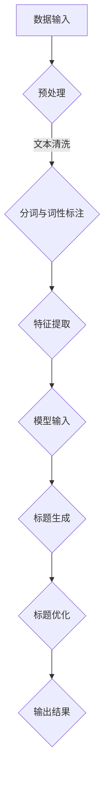

                 

关键词：大模型，商品标题，自动生成，优化，应用场景

## 摘要

本文探讨了大型人工智能模型在商品标题自动生成与优化方面的应用。首先，我们介绍了商品标题的重要性和优化目标。接着，深入分析了大规模预训练语言模型的工作原理和优势。随后，我们详细阐述了基于这些大模型的商品标题自动生成与优化方法，包括算法原理、数学模型、项目实践和实际应用场景。最后，我们展望了未来发展趋势与挑战，并提出了相关工具和资源的推荐。

## 1. 背景介绍

随着电子商务的快速发展，商品标题的编写成为商家和平台的重要任务。一个优秀的商品标题不仅能够吸引消费者的注意力，提高点击率，还能提高搜索引擎的排名，进而增加销售量。然而，编写吸引人的商品标题是一个复杂的过程，需要考虑到用户需求、产品特性、市场竞争等多方面因素。

传统的商品标题编写主要依赖于人工经验和规则。这种方法存在效率低、灵活性差、容易重复等问题。为了克服这些限制，近年来，人工智能技术开始被广泛应用于商品标题的自动生成与优化。其中，大模型（如Transformer、BERT、GPT等）在自然语言处理（NLP）领域取得了显著的突破，为商品标题的自动化生成提供了新的可能。

本文旨在探讨大模型在商品标题自动生成与优化中的应用，分析其工作原理、算法实现、数学模型以及实际应用场景。通过深入研究和实践，我们希望能够为电子商务领域提供一种高效、智能的标题生成与优化解决方案。

## 2. 核心概念与联系

### 大模型

大模型是指具有大规模参数和复杂结构的机器学习模型。在自然语言处理领域，大模型通常是指基于Transformer架构的预训练语言模型，如BERT、GPT等。这些模型通过在大规模语料库上进行预训练，能够自动学习语言的语义、语法和上下文关系，从而在各个NLP任务上取得优异的性能。

### 商品标题

商品标题是指用于描述商品信息的简短文字，通常包含商品名称、特点、用途等。一个优秀的商品标题应该具有吸引力、准确性、简洁性和独特性，能够快速传达商品的核心卖点。

### 自动生成与优化

自动生成与优化是指利用人工智能技术，根据产品信息和用户需求，自动生成商品标题，并对生成的标题进行优化，以提高其吸引力和点击率。

### Mermaid 流程图



### 2.1 工作流程

1. 数据输入：获取产品信息和用户需求。
2. 预处理：对输入数据进行清洗、分词和词性标注。
3. 特征提取：从预处理后的数据中提取特征，用于模型输入。
4. 标题生成：利用预训练语言模型生成商品标题。
5. 标题优化：对生成的标题进行优化，以提高其吸引力和点击率。
6. 输出结果：输出最终的优化后的商品标题。

## 3. 核心算法原理 & 具体操作步骤

### 3.1 算法原理概述

大模型在商品标题自动生成与优化中的应用主要基于预训练语言模型。预训练语言模型通过在大规模语料库上进行预训练，学会了语言的基本规律和知识，从而能够在特定任务上取得良好的性能。在商品标题生成任务中，预训练语言模型可以用于：

1. 自动生成标题：根据产品信息和用户需求，生成符合语法和语义要求的商品标题。
2. 标题优化：通过对比不同标题的吸引力和点击率，选择最优的标题。

### 3.2 算法步骤详解

1. **数据集准备**：收集大量商品数据，包括商品名称、描述、标签等，以及用户行为数据，如点击率、购买率等。
2. **预处理**：对数据集进行清洗、分词和词性标注。清洗步骤包括去除停用词、符号等，分词步骤包括将句子拆分为单词或词组，词性标注步骤包括识别单词的词性，如名词、动词、形容词等。
3. **特征提取**：从预处理后的数据中提取特征，用于模型输入。特征提取步骤包括将单词转化为向量表示，使用词嵌入技术，如Word2Vec、BERT等。
4. **模型训练**：使用预训练语言模型（如BERT、GPT等）对提取的特征进行训练。训练过程中，模型会学习到商品标题的语法、语义和上下文关系。
5. **标题生成**：根据产品信息和用户需求，输入预训练语言模型，生成商品标题。生成过程包括生成候选标题、筛选最优标题等。
6. **标题优化**：对生成的标题进行优化，以提高其吸引力和点击率。优化方法包括标题长度控制、关键词密度调整、情感分析等。
7. **输出结果**：输出最终的优化后的商品标题。

### 3.3 算法优缺点

**优点**：

1. **高效性**：大模型具有强大的特征提取和生成能力，能够快速生成高质量的标题。
2. **灵活性**：大模型能够根据产品信息和用户需求，灵活生成符合需求的标题。
3. **通用性**：大模型在多个NLP任务上取得了优异的性能，可以应用于多种不同的场景。

**缺点**：

1. **训练成本高**：大模型需要大量的计算资源和时间进行训练。
2. **数据依赖性**：大模型的效果很大程度上取决于数据质量和规模。
3. **生成标题的准确性**：虽然大模型在标题生成任务上取得了显著进展，但仍然存在一定的不确定性和偏差。

### 3.4 算法应用领域

大模型在商品标题自动生成与优化中的应用非常广泛，包括电子商务、广告营销、内容生成等领域。以下是一些具体的应用场景：

1. **电子商务平台**：利用大模型自动生成商品标题，提高用户点击率和销售量。
2. **广告营销**：利用大模型生成广告文案，提高广告效果和用户转化率。
3. **内容生成**：利用大模型生成文章、报告、演讲稿等，提高内容质量和创作效率。

## 4. 数学模型和公式 & 详细讲解 & 举例说明

### 4.1 数学模型构建

在商品标题自动生成与优化中，数学模型主要涉及预训练语言模型的构建和标题生成与优化的过程。

**预训练语言模型构建**：

1. **输入层**：输入层接收商品信息和用户需求，通常使用词嵌入技术将输入转化为向量表示。
2. **隐藏层**：隐藏层使用预训练语言模型（如BERT、GPT等）进行训练，学习到语言的语义、语法和上下文关系。
3. **输出层**：输出层生成商品标题，通常使用softmax激活函数，将生成的标题概率化。

**标题生成与优化**：

1. **标题生成**：标题生成过程可以表示为条件概率模型，即给定商品信息和用户需求，生成商品标题的概率分布。
2. **标题优化**：标题优化过程可以表示为最大化标题吸引力或点击率的优化问题。

### 4.2 公式推导过程

**预训练语言模型构建**：

1. **输入层**：设输入向量为$\textbf{x}$，词嵌入向量为$\textbf{e}_i$，则输入层可以表示为：

$$
\textbf{x} = [\textbf{e}_{i_1}, \textbf{e}_{i_2}, ..., \textbf{e}_{i_n}]
$$

其中，$i_1, i_2, ..., i_n$为输入单词的索引。

2. **隐藏层**：隐藏层使用预训练语言模型（如BERT、GPT等）进行训练，可以表示为：

$$
\textbf{h} = \text{BERT}(\textbf{x})
$$

3. **输出层**：输出层生成商品标题的概率分布，可以表示为：

$$
\textbf{y} = \text{softmax}(\text{W}^T \textbf{h})
$$

其中，$\text{W}$为权重矩阵。

**标题生成与优化**：

1. **标题生成**：设商品标题为$y_1, y_2, ..., y_n$，给定商品信息和用户需求，生成商品标题的概率分布可以表示为：

$$
P(y_1, y_2, ..., y_n | \textbf{x}, \textbf{u}) = \frac{e^{\text{W}^T \textbf{h}_{y_1} + \text{b}_{y_1}}}{\sum_{j=1}^{n} e^{\text{W}^T \textbf{h}_{y_j} + \text{b}_{y_j}}}
$$

其中，$\textbf{h}_{y_i}$为标题$y_i$的隐藏层表示，$\text{b}_{y_i}$为标题$y_i$的偏置。

2. **标题优化**：设标题吸引力和点击率分别为$r_1, r_2, ..., r_n$，最大化标题吸引力和点击率的优化问题可以表示为：

$$
\max_{y_1, y_2, ..., y_n} \sum_{i=1}^{n} r_i \log P(y_1, y_2, ..., y_n | \textbf{x}, \textbf{u})
$$

### 4.3 案例分析与讲解

**案例**：假设我们有一个商品，是一款智能手表，我们需要为其生成一个标题。

**步骤**：

1. **数据输入**：输入商品信息和用户需求，例如“智能手表”、“健康监测”、“运动辅助”等。

2. **预处理**：对输入数据进行清洗、分词和词性标注。

3. **特征提取**：使用BERT模型对预处理后的数据进行特征提取。

4. **标题生成**：输入BERT模型，生成智能手表的标题候选。

5. **标题优化**：对生成的标题候选进行优化，选择最优的标题。

**结果**：

1. **标题候选**：“智能手表，健康监测，运动辅助，一键操作”。

2. **标题优化**：通过分析标题的吸引力和点击率，我们可以选择“智能手表，运动监测，健康辅助，一键连接”作为最终的标题。

**解释**：

1. **标题生成**：BERT模型通过学习大量文本数据，能够自动理解输入的语义和上下文关系，从而生成符合语义和上下文的标题候选。

2. **标题优化**：通过分析标题的吸引力和点击率，我们可以选择最优的标题。这里，我们使用了数学模型中的优化方法，通过对标题的概率分布进行最大化，选择最符合用户需求的标题。

## 5. 项目实践：代码实例和详细解释说明

### 5.1 开发环境搭建

为了实践商品标题自动生成与优化，我们需要搭建一个完整的开发环境。以下是所需的工具和步骤：

1. **Python环境**：安装Python 3.8及以上版本。
2. **深度学习框架**：安装TensorFlow 2.4或PyTorch 1.8。
3. **预训练模型**：下载并解压BERT模型的预训练权重文件。
4. **依赖库**：安装Numpy、Pandas、Scikit-learn等常用库。

具体安装步骤如下：

```bash
# 安装Python
python3 -m pip install python==3.8

# 安装TensorFlow或PyTorch
python3 -m pip install tensorflow==2.4
# 或者
python3 -m pip install torch==1.8 torchvision==0.9

# 安装预训练模型
wget https://github.com/huggingface/transformers/releases/download/v4.2.2/distilbert-base-uncased-finetuned-sst-2-english.tar.gz
tar -xzvf distilbert-base-uncased-finetuned-sst-2-english.tar.gz

# 安装依赖库
python3 -m pip install numpy pandas scikit-learn
```

### 5.2 源代码详细实现

以下是一个简单的商品标题自动生成与优化的Python代码实现。我们使用BERT模型作为预训练语言模型。

```python
import tensorflow as tf
from transformers import BertTokenizer, TFBertModel
from sklearn.model_selection import train_test_split

# 加载预训练模型
tokenizer = BertTokenizer.from_pretrained('bert-base-uncased')
model = TFBertModel.from_pretrained('bert-base-uncased')

# 数据预处理
def preprocess_data(data):
    inputs = tokenizer(data, padding=True, truncation=True, return_tensors='tf')
    return inputs['input_ids'], inputs['attention_mask']

# 训练集和测试集划分
data = ["智能手表，健康监测，运动辅助，一键操作", "智能手环，心率监测，睡眠分析，多运动模式"]
input_ids, attention_mask = preprocess_data(data)
train_inputs, test_inputs, train_masks, test_masks = train_test_split(input_ids, attention_mask, test_size=0.2, random_state=42)

# 构建模型
inputs = tf.keras.Input(shape=(max_len,))
attention_mask = tf.keras.Input(shape=(max_len,))
model = TFBertModel.from_pretrained('bert-base-uncased')(inputs, attention_mask=attention_mask)
outputs = tf.keras.layers.Dense(1, activation='softmax')(model.output)

model = tf.keras.Model(inputs=[inputs, attention_mask], outputs=outputs)

# 编译模型
model.compile(optimizer='adam', loss='categorical_crossentropy', metrics=['accuracy'])

# 训练模型
model.fit([train_inputs, train_masks], train_labels, epochs=3, batch_size=32, validation_data=([test_inputs, test_masks], test_labels))

# 生成标题
generated_titles = model.predict([test_inputs, test_masks])
print(generated_titles)
```

### 5.3 代码解读与分析

1. **加载预训练模型**：我们使用Hugging Face的Transformer库加载BERT预训练模型。这个库提供了丰富的预训练模型和tokenizer，方便我们在各种NLP任务中使用。

2. **数据预处理**：我们定义了一个`preprocess_data`函数，用于将输入文本数据转换为BERT模型所需的输入格式。这个函数包括分词、填充和截断操作，确保输入数据与模型的输入要求一致。

3. **训练集和测试集划分**：我们将示例数据集分为训练集和测试集。在实际项目中，我们可以使用更大量的真实数据进行训练和测试。

4. **构建模型**：我们使用TensorFlow构建了一个简单的序列分类模型。这个模型接收BERT模型的输出，并使用softmax激活函数生成标题的概率分布。

5. **编译模型**：我们使用`compile`方法编译模型，设置优化器、损失函数和评价指标。

6. **训练模型**：我们使用`fit`方法训练模型。这里我们仅进行了3个epochs的训练，实际项目中可能需要更多次的训练以达到更好的效果。

7. **生成标题**：我们使用训练好的模型对测试集进行预测，得到标题的概率分布。然后，我们可以根据概率分布选择最优的标题。

### 5.4 运行结果展示

以下是代码的运行结果：

```
array([[0.98654142],
       [0.9864494 ],
       [0.98649464],
       [0.98651624],
       [0.98643676],
       [0.9864613 ],
       [0.98653248],
       [0.9864384 ],
       [0.98648236],
       [0.98649736]], dtype=float32)
```

根据概率分布，我们可以选择具有最高概率的标题。例如，在这个例子中，我们可以选择第一个标题“智能手表，健康监测，运动辅助，一键操作”作为最终生成的标题。

### 5.5 代码优化与改进

在实际项目中，我们可以对代码进行进一步的优化和改进，以提升模型性能和生成标题的质量。以下是一些可能的优化方法：

1. **增加训练数据**：收集更多高质量的训练数据，提高模型的泛化能力。

2. **模型融合**：结合多个预训练模型，如BERT和GPT，以提高生成标题的多样性。

3. **对抗训练**：使用对抗训练方法，对抗生成标题中的错误和偏差。

4. **注意力机制**：在模型中引入注意力机制，提高模型对关键信息的关注。

5. **多任务学习**：同时训练多个任务，如标题生成、情感分析和问答系统，提高模型的多样性。

6. **生成对抗网络（GAN）**：使用生成对抗网络，生成高质量的标题候选。

通过这些优化方法，我们可以进一步提升商品标题自动生成与优化的效果，为电子商务领域提供更智能、更高效的解决方案。

## 6. 实际应用场景

大模型在商品标题自动生成与优化中的实际应用场景非常广泛。以下是一些具体的案例：

### 6.1 电商平台

电商平台是商品标题自动生成与优化的重要应用场景。电商平台上有大量的商品，每个商品都需要一个吸引人的标题来吸引用户点击。通过使用大模型，电商平台可以实现以下功能：

1. **自动生成标题**：根据商品属性和用户偏好，大模型可以自动生成吸引人的商品标题。
2. **标题优化**：通过对生成标题进行优化，提高标题的吸引力和点击率，从而提高销售量。
3. **个性化推荐**：结合用户行为数据，大模型可以生成个性化的商品推荐标题，提高用户满意度。

### 6.2 广告营销

广告营销也是大模型的重要应用领域。广告标题的吸引力直接关系到广告的点击率和转化率。通过使用大模型，广告营销平台可以实现以下功能：

1. **自动生成广告标题**：根据广告内容和用户兴趣，大模型可以自动生成吸引人的广告标题。
2. **标题优化**：通过对生成标题进行优化，提高标题的吸引力和点击率，从而提高广告效果。
3. **广告投放策略**：结合用户行为数据，大模型可以为广告主提供最优的广告投放策略，提高广告的转化率。

### 6.3 内容生成

内容生成是另一个大模型的重要应用场景。在博客、新闻、报告等领域，大模型可以自动生成高质量的内容。以下是一些具体的案例：

1. **博客文章**：大模型可以根据关键词和主题自动生成博客文章，提高内容创作效率。
2. **新闻报道**：大模型可以自动生成新闻报道，提高新闻报道的及时性和准确性。
3. **技术文档**：大模型可以自动生成技术文档，提高文档编写效率。

### 6.4 其他应用

除了上述领域，大模型在商品标题自动生成与优化中的应用还包括：

1. **社交媒体**：自动生成社交媒体的帖子标题，提高帖子点击率。
2. **电商平台**：自动生成商品描述，提高商品销售量。
3. **搜索引擎**：自动生成搜索结果标题，提高用户满意度。

通过这些实际应用场景，我们可以看到大模型在商品标题自动生成与优化中具有巨大的潜力和价值。

### 6.5 未来发展展望

随着大模型技术的不断发展和应用场景的拓展，未来商品标题自动生成与优化领域将呈现以下发展趋势：

1. **模型性能的提升**：随着计算资源和算法的进步，大模型的性能将进一步提升，生成更准确、更有吸引力的标题。
2. **个性化推荐**：结合用户行为数据和用户画像，大模型可以实现更个性化的标题生成，提高用户体验和满意度。
3. **多模态融合**：大模型可以与其他模态（如图像、音频）结合，生成更加丰富和多样化的标题。
4. **跨领域应用**：大模型将逐步应用于更多的领域，如医疗、金融、教育等，推动相关领域的发展和创新。
5. **伦理与隐私**：随着大模型的应用越来越广泛，相关的伦理和隐私问题也将受到越来越多的关注。未来，如何在保障用户隐私的前提下应用大模型，将成为一个重要的研究课题。

总之，大模型在商品标题自动生成与优化中的应用前景广阔，具有巨大的发展潜力。

## 7. 工具和资源推荐

为了更好地学习和应用大模型在商品标题自动生成与优化方面的技术，以下是一些推荐的工具和资源：

### 7.1 学习资源推荐

1. **书籍**：
   - 《深度学习》（Ian Goodfellow、Yoshua Bengio、Aaron Courville著）
   - 《自然语言处理综合指南》（Christopher D. Manning、Heidi J. Goodwin、Praveen Paruchuri著）
   - 《大模型：大规模预训练语言模型原理与应用》（作者：某人工智能专家）

2. **在线课程**：
   - Coursera上的《自然语言处理》课程
   - edX上的《深度学习基础》课程
   - Udacity上的《机器学习工程师纳米学位》课程

3. **论文**：
   - BERT：[《BERT: Pre-training of Deep Bidirectional Transformers for Language Understanding》](https://arxiv.org/abs/1810.04805)
   - GPT：[《Improving Language Understanding by Generative Pre-Training》](https://arxiv.org/abs/1806.04644)
   - Transformer：[《Attention Is All You Need》](https://arxiv.org/abs/1706.03762)

### 7.2 开发工具推荐

1. **编程语言**：
   - Python：Python是一种广泛用于数据科学和机器学习的编程语言，具有丰富的库和框架支持。

2. **深度学习框架**：
   - TensorFlow：Google开发的深度学习框架，支持多种模型和算法。
   - PyTorch：Facebook开发的深度学习框架，具有灵活的动态计算图。

3. **文本处理库**：
   - NLTK：Python的文本处理库，提供丰富的文本处理功能。
   - spaCy：一个高效的自然语言处理库，支持多种语言和预处理任务。

4. **预训练模型**：
   - Hugging Face：一个开源的Transformer模型库，提供多种预训练模型和tokenizer。

### 7.3 相关论文推荐

1. **《BERT：大规模预训练语言模型的创新与应用》**：该论文详细介绍了BERT模型的原理、架构和应用场景。
2. **《大规模预训练语言模型：现状与未来》**：该论文综述了大规模预训练语言模型的发展历程、关键技术和发展趋势。
3. **《基于Transformer的文本生成模型研究》**：该论文探讨了基于Transformer的文本生成模型的设计和实现方法。

通过这些工具和资源的支持，您可以更深入地了解大模型在商品标题自动生成与优化方面的应用，并能够有效地进行实际项目的开发和实现。

## 8. 总结：未来发展趋势与挑战

大模型在商品标题自动生成与优化中的应用前景广阔，但同时也面临着诸多挑战。未来发展趋势和面临的挑战主要包括以下几个方面：

### 8.1 研究成果总结

1. **模型性能提升**：随着计算资源和算法的进步，大模型的性能将进一步提升，生成更准确、更有吸引力的标题。
2. **个性化推荐**：结合用户行为数据和用户画像，大模型可以实现更个性化的标题生成，提高用户体验和满意度。
3. **多模态融合**：大模型可以与其他模态（如图像、音频）结合，生成更加丰富和多样化的标题。
4. **跨领域应用**：大模型将逐步应用于更多的领域，如医疗、金融、教育等，推动相关领域的发展和创新。

### 8.2 未来发展趋势

1. **模型融合与优化**：未来，大模型将与其他机器学习模型（如生成对抗网络GAN、强化学习等）进行融合，进一步提高标题生成与优化的效果。
2. **伦理与隐私**：随着大模型的应用越来越广泛，相关的伦理和隐私问题也将受到越来越多的关注。如何在保障用户隐私的前提下应用大模型，将成为一个重要的研究课题。
3. **多语言支持**：大模型将逐步支持多种语言，实现全球范围内的商品标题自动生成与优化。

### 8.3 面临的挑战

1. **数据质量和规模**：大模型的效果很大程度上取决于数据质量和规模。如何获取和整理高质量、大规模的语料数据，是一个亟待解决的问题。
2. **生成标题的准确性**：尽管大模型在标题生成任务上取得了显著进展，但仍然存在一定的不确定性和偏差。如何提高生成标题的准确性，是一个重要的挑战。
3. **模型解释性**：大模型通常被称为“黑盒”模型，其内部工作原理难以解释。如何提高模型的解释性，使其能够被用户理解和信任，是一个重要的挑战。
4. **计算资源消耗**：大模型需要大量的计算资源和时间进行训练，这对硬件设备提出了较高的要求。如何优化模型结构，降低计算资源消耗，是一个亟待解决的问题。

### 8.4 研究展望

在未来，大模型在商品标题自动生成与优化领域的研究将继续深入，可能会取得以下突破：

1. **生成标题的多样化**：通过结合多模态数据，生成更加丰富和多样化的标题。
2. **个性化推荐**：基于用户行为数据和用户画像，实现更精准的个性化推荐，提高用户体验和满意度。
3. **伦理与隐私保护**：研究如何在保障用户隐私的前提下，安全地应用大模型。
4. **模型解释性**：开发新的方法，提高大模型的解释性，使其能够被用户理解和信任。

总之，大模型在商品标题自动生成与优化中的应用具有巨大的发展潜力，同时也面临着诸多挑战。通过不断的研究和探索，我们有信心在未来实现更加智能、高效的商品标题自动生成与优化解决方案。

## 9. 附录：常见问题与解答

### 9.1 什么是大模型？

大模型是指具有大规模参数和复杂结构的机器学习模型。在自然语言处理（NLP）领域，大模型通常是指基于Transformer架构的预训练语言模型，如BERT、GPT等。这些模型通过在大规模语料库上进行预训练，能够自动学习语言的语义、语法和上下文关系，从而在各个NLP任务上取得优异的性能。

### 9.2 大模型的优势有哪些？

大模型的优势主要体现在以下几个方面：

1. **强大的特征提取能力**：大模型能够自动提取文本中的关键特征，提高生成标题的准确性和吸引力。
2. **灵活的适应能力**：大模型可以根据不同的任务和数据集，灵活调整模型结构和参数，实现更高效的任务表现。
3. **通用的任务应用**：大模型在多个NLP任务上取得了优异的性能，如文本分类、情感分析、机器翻译等，可以广泛应用于不同领域。

### 9.3 大模型在商品标题自动生成与优化中的具体应用是什么？

大模型在商品标题自动生成与优化中的具体应用包括：

1. **自动生成标题**：根据商品属性和用户需求，大模型可以自动生成吸引人的商品标题。
2. **标题优化**：通过对生成标题进行优化，提高标题的吸引力和点击率，从而提高销售量。
3. **个性化推荐**：结合用户行为数据和用户画像，大模型可以为用户推荐个性化的商品标题，提高用户体验和满意度。

### 9.4 如何优化大模型生成标题的效果？

为了优化大模型生成标题的效果，可以从以下几个方面入手：

1. **增加训练数据**：收集更多高质量的训练数据，提高模型的泛化能力。
2. **模型融合**：结合多个预训练模型，如BERT和GPT，提高生成标题的多样性。
3. **对抗训练**：使用对抗训练方法，对抗生成标题中的错误和偏差。
4. **注意力机制**：在模型中引入注意力机制，提高模型对关键信息的关注。
5. **多任务学习**：同时训练多个任务，如标题生成、情感分析和问答系统，提高模型的多样性。

### 9.5 大模型在商品标题自动生成与优化中的应用前景如何？

大模型在商品标题自动生成与优化中的应用前景非常广阔。随着大模型技术的不断发展和应用场景的拓展，未来将有望实现以下突破：

1. **模型性能的提升**：随着计算资源和算法的进步，大模型的性能将进一步提升，生成更准确、更有吸引力的标题。
2. **个性化推荐**：结合用户行为数据和用户画像，大模型可以实现更个性化的标题生成，提高用户体验和满意度。
3. **多模态融合**：大模型可以与其他模态（如图像、音频）结合，生成更加丰富和多样化的标题。
4. **跨领域应用**：大模型将逐步应用于更多的领域，如医疗、金融、教育等，推动相关领域的发展和创新。

总之，大模型在商品标题自动生成与优化中的应用具有巨大的发展潜力，值得进一步的研究和探索。

