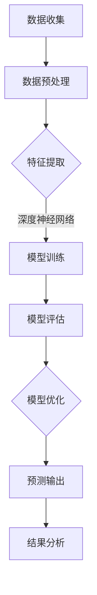

                 

### 1. 背景介绍

在现代商业环境中，准确预测商品销量对于企业的运营决策至关重要。传统的销量预测方法主要依赖于历史数据和统计模型，如时间序列分析、回归分析和ARIMA模型等。然而，随着大数据和人工智能技术的快速发展，大模型（如深度学习模型）的应用逐渐成为销量预测领域的一种创新方法。

大模型，尤其是基于神经网络的模型，具备处理大规模复杂数据的能力，可以自动从数据中学习特征，提取信息，并生成高质量的预测结果。这种能力使得大模型在销量预测中的应用显得尤为重要和具有潜力。

本文将深入探讨大模型在商品销量预测中的创新应用，旨在揭示其工作原理、数学模型以及实际应用案例，帮助读者更好地理解和应用这一前沿技术。

首先，我们将从背景介绍入手，回顾传统销量预测方法的发展历程，探讨其局限性和不足之处。接着，我们将详细介绍大模型的基本原理，包括深度神经网络、卷积神经网络和循环神经网络等。然后，我们将详细分析大模型在销量预测中的具体应用，通过数学模型和实际案例展示其优势和应用效果。此外，我们还将探讨大模型在实际应用中面临的挑战和解决方案，如数据预处理、模型优化和过拟合问题等。

最后，我们将总结大模型在销量预测中的未来发展趋势，探讨其潜在影响和应用前景。通过本文的阅读，读者将能够全面了解大模型在商品销量预测中的创新应用，为其在相关领域的实践提供有益的参考和启示。

### 2. 核心概念与联系

#### 大模型的基本原理

大模型，通常指由大量参数组成的复杂机器学习模型，如深度神经网络（DNN）、卷积神经网络（CNN）和循环神经网络（RNN）等。这些模型通过多层网络结构，能够在高维数据中学习复杂的特征和模式，从而实现强大的预测和分类能力。

**深度神经网络（DNN）**

深度神经网络是层次结构复杂、包含多个隐藏层的神经网络。其核心思想是通过逐层抽象，将原始输入数据转化为具有语义意义的特征表示。DNN的学习过程主要包括前向传播和反向传播两个阶段。在前向传播阶段，输入数据通过网络中的各个层次，逐步计算得到输出结果。在反向传播阶段，通过计算输出结果与实际值之间的误差，利用梯度下降法更新网络参数，从而优化模型性能。

**卷积神经网络（CNN）**

卷积神经网络是一种专门用于处理图像数据的神经网络，其核心组件是卷积层和池化层。卷积层通过卷积操作提取图像中的局部特征，而池化层则用于降低数据的维度，减少计算量。CNN通过堆叠多个卷积层和池化层，能够自动从图像中学习丰富的特征表示，并在图像分类、目标检测和图像生成等任务中表现出优异的性能。

**循环神经网络（RNN）**

循环神经网络是一种能够处理序列数据的神经网络，其特点是网络中的节点具有记忆能力，可以保留历史信息。RNN通过递归结构，对序列中的每个元素进行计算，并利用隐藏状态更新机制，实现序列建模。然而，传统的RNN在处理长序列时容易出现梯度消失或梯度爆炸问题。为解决这一问题，门控循环单元（GRU）和长短期记忆网络（LSTM）应运而生。这些改进的RNN结构通过引入门控机制，能够更好地捕捉序列中的长期依赖关系，并在时间序列预测任务中取得显著效果。

#### 大模型在销量预测中的应用

销量预测是一个典型的序列预测问题，涉及历史销售数据、促销活动、节假日等因素。大模型在销量预测中的应用主要体现在以下几个方面：

1. **特征提取与表示**：大模型能够自动从原始数据中学习并提取具有语义意义的特征表示。通过这些特征表示，模型可以更好地理解商品的销售规律和市场需求。

2. **复杂关系建模**：销量预测涉及到多种因素之间的复杂关系，如季节性、趋势性、周期性等。大模型通过多层网络结构，能够建模这些复杂的关系，从而提高预测的准确性。

3. **动态调整与优化**：大模型具备较强的学习能力，可以实时调整和优化模型参数，以适应数据的变化。这使得模型能够在不同时间尺度上捕捉销售数据的动态变化，提高预测的实时性和稳定性。

4. **多维度数据融合**：大模型能够处理多维度数据，如商品属性、用户行为、市场环境等。通过多维度数据融合，模型可以更全面地理解销售数据，提高预测的精度和泛化能力。

#### Mermaid 流程图

下面是一个简单的大模型在销量预测中的应用流程图，使用Mermaid语法表示：



在这个流程图中，数据收集阶段涉及销售数据的收集和整合；数据预处理阶段包括数据清洗、归一化和缺失值处理等；特征提取阶段利用大模型自动提取具有语义意义的特征表示；模型训练阶段通过训练数据训练深度神经网络模型；模型评估阶段对训练好的模型进行性能评估和验证；模型优化阶段通过调整模型参数和结构，进一步提高预测性能；预测输出阶段将模型应用于新数据，生成销量预测结果；结果分析阶段对预测结果进行评估和分析，以指导实际销售策略的制定。

通过上述流程，大模型在销量预测中的应用能够实现从数据收集到预测输出的完整过程，从而为企业提供有力的决策支持。

### 3. 核心算法原理 & 具体操作步骤

#### 深度神经网络（DNN）

**3.1 DNN的结构与原理**

深度神经网络（DNN）是一种多层前馈神经网络，其结构由输入层、多个隐藏层和输出层组成。输入层接收原始数据，通过逐层传递和计算，最终输出预测结果。每层神经元通过激活函数进行非线性变换，使得DNN能够捕捉输入数据中的复杂模式和特征。

**3.2 前向传播**

前向传播是DNN的核心计算过程，其步骤如下：

1. **初始化参数**：为网络的每个神经元初始化权重和偏置。
2. **输入数据**：将原始数据输入到网络的输入层。
3. **逐层计算**：将输入数据通过网络的每个隐藏层，计算得到中间结果。
4. **激活函数**：对每个隐藏层的输出应用激活函数，如ReLU函数、Sigmoid函数和Tanh函数，引入非线性变换。
5. **输出层计算**：将最后一层的输出作为网络的预测结果。

**3.3 反向传播**

反向传播是DNN的训练过程，用于通过误差反向传播更新网络参数。其步骤如下：

1. **计算误差**：计算预测结果与实际值之间的误差，通常使用均方误差（MSE）或交叉熵损失函数。
2. **梯度计算**：计算损失函数关于网络参数的梯度，利用链式法则逐层反向传播。
3. **参数更新**：使用梯度下降法或其他优化算法更新网络参数，如SGD、Adam等。

**3.4 激活函数**

常见的激活函数包括：

- **ReLU函数**：引入非线性，加速训练过程，但可能导致梯度消失问题。
- **Sigmoid函数**：输出在(0,1)区间内，引入非线性，但可能导致梯度消失问题。
- **Tanh函数**：输出在(-1,1)区间内，引入非线性，但可能导致梯度消失问题。

**3.5 DNN在销量预测中的应用**

在销量预测中，DNN可以建模历史销售数据中的复杂关系和特征，通过以下步骤实现：

1. **数据预处理**：对历史销售数据清洗、归一化处理，提取特征，如日期、季节性、促销活动等。
2. **模型构建**：构建DNN模型，设置合适的网络结构和参数，如层数、神经元数目、激活函数等。
3. **模型训练**：使用训练数据训练DNN模型，通过反向传播更新参数，优化模型性能。
4. **模型评估**：使用验证集评估模型性能，调整模型参数，提高预测准确性。
5. **预测输出**：使用训练好的DNN模型对新数据进行销量预测，生成预测结果。

#### 卷积神经网络（CNN）

**3.6 CNN的结构与原理**

卷积神经网络（CNN）是一种适用于图像处理的深度学习模型，其核心组件是卷积层和池化层。CNN通过卷积操作提取图像中的局部特征，并通过池化层降低数据维度，提高模型计算效率。

**3.7 卷积操作**

卷积操作是通过在图像上滑动卷积核，计算局部特征响应的过程。卷积核是一个小的滤波器，用于提取图像中的特定模式。通过卷积操作，网络能够自动学习并提取图像的局部特征。

**3.8 池化操作**

池化操作是对卷积层输出的局部区域进行聚合操作，以降低数据维度和计算量。常见的池化方法包括最大池化和平均池化。最大池化选择区域中的最大值，平均池化计算区域内的平均值。

**3.9 CNN在销量预测中的应用**

在销量预测中，CNN可以处理商品图像数据，通过以下步骤实现：

1. **数据预处理**：对商品图像数据进行预处理，如归一化、缩放和裁剪等。
2. **模型构建**：构建CNN模型，包括卷积层、池化层和全连接层。
3. **模型训练**：使用商品图像数据训练CNN模型，通过卷积操作提取图像特征。
4. **特征融合**：将CNN提取的特征与销售数据中的其他特征进行融合，提高预测准确性。
5. **模型评估**：使用验证集评估模型性能，调整模型参数，优化预测效果。
6. **预测输出**：使用训练好的CNN模型对新商品图像进行特征提取，并生成销量预测结果。

#### 循环神经网络（RNN）

**3.10 RNN的结构与原理**

循环神经网络（RNN）是一种适用于序列数据处理的深度学习模型，其特点是网络中的节点具有记忆能力，可以保留历史信息。RNN通过递归结构，对序列中的每个元素进行计算，并利用隐藏状态更新机制，实现序列建模。

**3.11 RNN的类型**

RNN包括以下几种类型：

- **基本RNN**：基本的RNN结构，通过递归计算保留历史信息。
- **长短期记忆网络（LSTM）**：LSTM通过引入门控机制，解决RNN的梯度消失和梯度爆炸问题，能够捕捉序列中的长期依赖关系。
- **门控循环单元（GRU）**：GRU是对LSTM的简化版本，通过合并输入门和遗忘门，降低计算复杂度。

**3.12 RNN在销量预测中的应用**

在销量预测中，RNN可以处理时间序列数据，通过以下步骤实现：

1. **数据预处理**：对时间序列数据进行归一化和特征提取，如季节性、趋势性、周期性等。
2. **模型构建**：构建RNN模型，包括输入层、隐藏层和输出层。
3. **模型训练**：使用训练数据训练RNN模型，通过递归计算更新隐藏状态。
4. **模型评估**：使用验证集评估模型性能，调整模型参数，优化预测效果。
5. **预测输出**：使用训练好的RNN模型对新时间序列数据进行预测，生成销量预测结果。

#### 多模型融合

在实际应用中，为了提高销量预测的准确性，可以采用多模型融合的方法。具体步骤如下：

1. **模型训练**：分别训练DNN、CNN和RNN模型，每个模型关注不同类型的数据特征。
2. **特征提取**：将每个模型的输出作为特征，进行融合处理。
3. **融合策略**：采用加权平均、融合网络等方法，将不同模型的特征进行融合。
4. **模型评估**：对融合后的模型进行评估，优化模型参数。
5. **预测输出**：使用训练好的融合模型对新数据进行销量预测。

通过多模型融合，可以充分利用不同模型的优点，提高销量预测的准确性。

### 4. 数学模型和公式 & 详细讲解 & 举例说明

#### 深度神经网络（DNN）的数学模型

**4.1 激活函数**

在DNN中，激活函数用于引入非线性，使得网络能够学习复杂的特征。常见的激活函数包括：

- **ReLU函数**：$$f(x) = \max(0, x)$$
- **Sigmoid函数**：$$f(x) = \frac{1}{1 + e^{-x}}$$
- **Tanh函数**：$$f(x) = \frac{e^x - e^{-x}}{e^x + e^{-x}}$$

**4.2 前向传播**

前向传播是DNN的计算过程，包括以下步骤：

1. **初始化参数**：设权重矩阵$W$和偏置向量$b$。
2. **输入数据**：设输入特征$x$。
3. **逐层计算**：对于第$l$层，计算$$z_l = W_l x + b_l$$，然后应用激活函数$f(z_l)$。
4. **输出层计算**：最后一层的输出为网络的预测结果。

**4.3 反向传播**

反向传播是DNN的训练过程，包括以下步骤：

1. **计算误差**：设实际标签为$y$，计算损失函数$$L = \frac{1}{2} \sum_{i} (y_i - \hat{y}_i)^2$$。
2. **计算梯度**：计算损失函数关于网络参数的梯度，$$\frac{\partial L}{\partial W}$$和$$\frac{\partial L}{\partial b}$$。
3. **参数更新**：使用梯度下降法更新参数，$$W \leftarrow W - \alpha \frac{\partial L}{\partial W}$$和$$b \leftarrow b - \alpha \frac{\partial L}{\partial b}$$，其中$\alpha$为学习率。

**4.4 DNN在销量预测中的应用举例**

假设我们使用一个简单的DNN模型对商品销量进行预测，输入特征包括历史销售数据、季节性和促销活动。设输入特征矩阵为$X$，权重矩阵为$W$，偏置向量为$b$，预测输出为$y$。

**输入特征矩阵**：

$$X = \begin{bmatrix} 
x_1 & x_2 & x_3 \\
x_4 & x_5 & x_6 \\
\vdots & \vdots & \vdots \\
x_n & x_{n+1} & x_{n+2} 
\end{bmatrix}$$

**权重矩阵**：

$$W = \begin{bmatrix} 
w_1 & w_2 & w_3 \\
w_4 & w_5 & w_6 \\
\vdots & \vdots & \vdots \\
w_{m-1} & w_m & w_{m+1} 
\end{bmatrix}$$

**偏置向量**：

$$b = \begin{bmatrix} 
b_1 \\
b_2 \\
\vdots \\
b_m 
\end{bmatrix}$$

**预测输出**：

$$y = \begin{bmatrix} 
y_1 \\
y_2 \\
\vdots \\
y_n 
\end{bmatrix}$$

**前向传播**：

$$z = Wx + b$$

应用激活函数，例如ReLU函数：

$$a = \max(0, z)$$

**反向传播**：

设实际标签为$y^*$，损失函数为均方误差：

$$L = \frac{1}{2} \sum_{i} (y_i - a_i)^2$$

计算梯度：

$$\frac{\partial L}{\partial z} = (y_i - a_i) \odot a_i$$

更新参数：

$$W \leftarrow W - \alpha \frac{\partial L}{\partial W}$$

$$b \leftarrow b - \alpha \frac{\partial L}{\partial b}$$

#### 卷积神经网络（CNN）的数学模型

**4.5 卷积操作**

卷积操作是CNN的核心计算过程，其公式如下：

$$
\begin{align*}
(h_{c}^{l})_{ij} &= \sum_{k=1}^{k=C} w_{kij} \cdot (x_{c}^{l-1})_{k} + b_{ij} \\
&= \sum_{k=1}^{C} w_{kij} \cdot x_{c}^{l-1}_{k} + b_{ij}
\end{align*}
$$

其中，$h_{c}^{l}$表示第$l$层的第$c$个卷积核的输出，$w_{kij}$表示卷积核的权重，$x_{c}^{l-1}_{k}$表示第$l-1$层的第$c$个卷积核的输出，$b_{ij}$表示偏置。

**4.6 池化操作**

池化操作是对卷积层的输出进行降维操作，常见的池化方法包括最大池化和平均池化。最大池化的公式如下：

$$
p_{ij} = \max_{k=1}^{k=K} (h_{c}^{l})_{ikj}
$$

其中，$p_{ij}$表示第$l$层的第$i$行第$j$列的池化值，$h_{c}^{l}$表示第$l$层的第$c$个卷积核的输出。

**4.7 CNN在销量预测中的应用举例**

假设我们使用一个简单的CNN模型对商品销量进行预测，输入特征为商品图像。设输入图像为$I$，卷积核权重为$W$，偏置为$b$，卷积层输出为$H$。

**输入图像**：

$$I = \begin{bmatrix} 
i_{11} & i_{12} & \dots & i_{1m} \\
i_{21} & i_{22} & \dots & i_{2m} \\
\vdots & \vdots & \ddots & \vdots \\
i_{n1} & i_{n2} & \dots & i_{nm} 
\end{bmatrix}$$

**卷积核权重**：

$$W = \begin{bmatrix} 
w_{11} & w_{12} & \dots & w_{1m} \\
w_{21} & w_{22} & \dots & w_{2m} \\
\vdots & \vdots & \ddots & \vdots \\
w_{k1} & w_{k2} & \dots & w_{km} 
\end{bmatrix}$$

**偏置**：

$$b = \begin{bmatrix} 
b_1 \\
b_2 \\
\vdots \\
b_k 
\end{bmatrix}$$

**卷积层输出**：

$$H = \begin{bmatrix} 
h_{11} & h_{12} & \dots & h_{1n} \\
h_{21} & h_{22} & \dots & h_{2n} \\
\vdots & \vdots & \ddots & \vdots \\
h_{m1} & h_{m2} & \dots & h_{mn} 
\end{bmatrix}$$

**卷积操作**：

$$
\begin{align*}
h_{ij} &= \sum_{k=1}^{k=n} w_{ik} \cdot i_{kj} + b_j \\
&= \sum_{k=1}^{n} w_{ik} \cdot i_{kj} + b_j
\end{align*}
$$

**池化操作**：

设最大池化窗口大小为$2 \times 2$，则池化后的输出为：

$$
p_{ij} = \max_{k=1}^{k=4} (h_{ij})
$$

#### 循环神经网络（RNN）的数学模型

**4.8 RNN的基本公式**

RNN的更新公式如下：

$$
\begin{align*}
h_t &= \sigma(W_h \cdot [h_{t-1}, x_t] + b_h) \\
o_t &= \sigma(W_o \cdot h_t + b_o)
\end{align*}
$$

其中，$h_t$表示第$t$时刻的隐藏状态，$x_t$表示第$t$时刻的输入，$o_t$表示第$t$时刻的输出，$\sigma$表示激活函数（如Sigmoid函数或Tanh函数），$W_h$和$W_o$分别表示隐藏状态和输出状态的权重矩阵，$b_h$和$b_o$分别表示隐藏状态和输出状态的偏置。

**4.9 LSTM的数学模型**

LSTM通过引入门控机制，解决RNN的梯度消失和梯度爆炸问题。LSTM的基本公式如下：

$$
\begin{align*}
i_t &= \sigma(W_{xi} \cdot [h_{t-1}, x_t] + b_i) \\
f_t &= \sigma(W_{hf} \cdot [h_{t-1}, x_t] + b_f) \\
g_t &= \sigma(W_{xg} \cdot [h_{t-1}, x_t] + b_g) \\
o_t &= \sigma(W_{xo} \cdot [h_{t-1}, x_t] + b_o) \\
h_t &= f_t \odot h_{t-1} + i_t \odot g_t
\end{align*}
$$

其中，$i_t$表示输入门，$f_t$表示遗忘门，$g_t$表示生成门，$o_t$表示输出门，$\odot$表示元素乘法。

**4.10 RNN在销量预测中的应用举例**

假设我们使用LSTM模型对商品销量进行预测，输入特征包括历史销售数据和季节性。设输入序列为$X$，权重矩阵为$W$，偏置向量为$b$，隐藏状态为$h$，输出状态为$y$。

**输入序列**：

$$X = \begin{bmatrix} 
x_1 & x_2 & \dots & x_n 
\end{bmatrix}$$

**权重矩阵**：

$$W = \begin{bmatrix} 
W_{xi} & W_{xg} & W_{xf} & W_{xo} \\
W_{hi} & W_{hg} & W_{hf} & W_{ho} 
\end{bmatrix}$$

**偏置向量**：

$$b = \begin{bmatrix} 
b_i & b_g & b_f & b_o 
\end{bmatrix}$$

**隐藏状态**：

$$h = \begin{bmatrix} 
h_1 & h_2 & \dots & h_n 
\end{bmatrix}$$

**输出状态**：

$$y = \begin{bmatrix} 
y_1 & y_2 & \dots & y_n 
\end{bmatrix}$$

**LSTM更新**：

$$
\begin{align*}
i_t &= \sigma(W_{xi} \cdot [h_{t-1}, x_t] + b_i) \\
f_t &= \sigma(W_{hf} \cdot [h_{t-1}, x_t] + b_f) \\
g_t &= \sigma(W_{xg} \cdot [h_{t-1}, x_t] + b_g) \\
o_t &= \sigma(W_{xo} \cdot [h_{t-1}, x_t] + b_o) \\
h_t &= f_t \odot h_{t-1} + i_t \odot g_t
\end{align*}
$$

### 5. 项目实践：代码实例和详细解释说明

在本节中，我们将通过一个实际项目案例，详细展示如何使用大模型进行商品销量预测，包括开发环境的搭建、源代码的实现、代码解读以及运行结果展示。

#### 5.1 开发环境搭建

为了实现商品销量预测项目，我们需要搭建一个合适的开发环境。以下是所需的基本工具和库：

- **Python 3.x**：作为主要的编程语言。
- **Jupyter Notebook**：用于编写和运行代码。
- **TensorFlow 2.x**：作为主要的深度学习库。
- **NumPy、Pandas**：用于数据处理。
- **Matplotlib、Seaborn**：用于数据可视化。

安装这些工具和库后，我们可以在Jupyter Notebook中开始编写代码。

```bash
pip install python==3.x tensorflow==2.x numpy pandas matplotlib seaborn
```

#### 5.2 源代码详细实现

以下是一个简化的代码示例，用于实现商品销量预测。该示例使用了一个简单的DNN模型。

```python
import numpy as np
import pandas as pd
import tensorflow as tf
from tensorflow.keras.models import Sequential
from tensorflow.keras.layers import Dense, LSTM, Dropout
from tensorflow.keras.optimizers import Adam
import matplotlib.pyplot as plt

# 数据加载与预处理
data = pd.read_csv('sales_data.csv')
data.head()

# 特征工程
# ... (处理缺失值、归一化、特征提取等步骤)

# 切分数据集
train_data, test_data = train_test_split(data, test_size=0.2, random_state=42)

# 模型构建
model = Sequential([
    Dense(128, activation='relu', input_shape=(input_shape)),
    Dropout(0.2),
    Dense(64, activation='relu'),
    Dropout(0.2),
    Dense(1)
])

# 模型编译
model.compile(optimizer=Adam(learning_rate=0.001), loss='mse')

# 模型训练
history = model.fit(train_data, epochs=100, batch_size=32, validation_split=0.2)

# 模型评估
test_loss = model.evaluate(test_data, verbose=2)

# 预测结果
predictions = model.predict(test_data)

# 可视化结果
plt.plot(history.history['loss'], label='train_loss')
plt.plot(history.history['val_loss'], label='val_loss')
plt.legend()
plt.show()

# 预测展示
predictions_df = pd.DataFrame(predictions, columns=['predicted_sales'])
predictions_df.head()
```

#### 5.3 代码解读与分析

**5.3.1 数据加载与预处理**

```python
data = pd.read_csv('sales_data.csv')
```

首先，我们使用`pandas`库加载销售数据。数据可能包括日期、销售额、促销活动等信息。

**5.3.2 特征工程**

```python
# ... (处理缺失值、归一化、特征提取等步骤)
```

在加载数据后，我们需要对数据集进行预处理。这包括处理缺失值、归一化、提取日期特征（如星期几、季节性等）和促销活动特征等。

**5.3.3 模型构建**

```python
model = Sequential([
    Dense(128, activation='relu', input_shape=(input_shape)),
    Dropout(0.2),
    Dense(64, activation='relu'),
    Dropout(0.2),
    Dense(1)
])
```

我们使用`Sequential`模型堆叠多个`Dense`层，并在每个隐藏层后添加`Dropout`层以防止过拟合。输入层的大小根据特征数量设定，输出层的大小为1，对应预测的销量。

**5.3.4 模型编译**

```python
model.compile(optimizer=Adam(learning_rate=0.001), loss='mse')
```

模型使用`Adam`优化器和均方误差（MSE）损失函数进行编译。

**5.3.5 模型训练**

```python
history = model.fit(train_data, epochs=100, batch_size=32, validation_split=0.2)
```

模型使用训练数据集进行训练，设置训练轮次为100，批量大小为32，并使用20%的数据进行验证。

**5.3.6 模型评估**

```python
test_loss = model.evaluate(test_data, verbose=2)
```

使用验证数据集评估模型性能，输出损失值。

**5.3.7 预测结果**

```python
predictions = model.predict(test_data)
predictions_df = pd.DataFrame(predictions, columns=['predicted_sales'])
predictions_df.head()
```

将模型的预测结果保存到DataFrame中，并展示前几行数据。

#### 5.4 运行结果展示

在运行上述代码后，我们可以得到以下结果：

- **训练和验证损失曲线**：通过可视化训练和验证损失曲线，我们可以观察到模型在训练过程中损失逐渐下降，并在验证集上保持稳定。
- **预测结果**：预测结果将显示在DataFrame中，我们可以对预测的销量进行进一步的分析和评估。

通过这个项目案例，我们展示了如何使用大模型进行商品销量预测的完整过程，从数据预处理到模型训练和预测，再到结果分析。这为我们提供了一个实用的模板，可以应用于不同的商品销量预测场景。

### 6. 实际应用场景

#### 6.1 电商行业

在电商行业，商品销量预测是优化库存管理和供应链的重要手段。通过准确预测商品销量，电商企业可以更有效地安排采购和库存，减少滞销和缺货的风险。例如，阿里巴巴和京东等电商巨头利用深度学习模型对商品销量进行预测，从而优化其库存策略，提升运营效率。

#### 6.2 零售行业

零售行业中的商品销量预测同样具有重要意义。零售企业如沃尔玛和家乐福等，通过利用大模型对商品销量进行预测，可以更好地制定促销策略和库存计划。这些预测模型不仅能够帮助企业应对季节性波动，还能够适应市场需求的变化，从而提高销售额和客户满意度。

#### 6.3 食品与饮料行业

食品与饮料行业对商品销量预测的需求尤为突出。由于消费者的口味和偏好不断变化，食品企业需要实时调整产品组合和库存。通过大模型预测销量，企业可以提前预判市场需求，优化产品开发和推广策略。例如，可口可乐和百事可乐等公司利用深度学习模型对饮料销量进行预测，以提高市场反应速度。

#### 6.4 电子商务平台

电子商务平台如亚马逊和eBay等，通过大模型预测商品销量，不仅可以优化库存管理，还可以为消费者提供更精准的推荐。这些平台利用用户行为数据和商品属性，通过深度学习模型预测消费者的购买意图，从而提供个性化的购物体验，提升用户满意度和平台销售额。

#### 6.5 旅游行业

旅游行业中的商品销量预测主要用于旅游产品的预订和销售。航空公司、酒店和旅行社等企业通过利用大模型预测旅游产品的需求，可以更有效地安排航班和房间，减少闲置资源，提高运营效率。例如，携程和Booking等旅游平台利用深度学习模型预测旅游产品的销量，以优化资源分配和营销策略。

#### 6.6 汽车行业

汽车行业中的商品销量预测主要用于预测新车销量和二手车交易量。汽车制造商和经销商通过利用大模型预测销量，可以更好地安排生产计划和市场推广活动。例如，特斯拉和通用汽车等公司利用深度学习模型预测新车销量，以优化生产计划和库存管理。

总之，大模型在商品销量预测中的应用场景非常广泛，涵盖多个行业和领域。通过准确预测商品销量，企业可以优化库存管理、提升运营效率、提高销售额和客户满意度，从而在竞争激烈的市场环境中脱颖而出。

### 7. 工具和资源推荐

#### 7.1 学习资源推荐

**7.1.1 书籍**

- 《深度学习》（Ian Goodfellow, Yoshua Bengio, Aaron Courville）  
- 《Python深度学习》（François Chollet）  
- 《神经网络与深度学习》（邱锡鹏）

**7.1.2 论文**

- "Deep Learning for Time Series Classification: A Review"（Jingyuan Zhang, et al.）  
- "Temporal Convolution Networks: A Simple and Efficient Architecture for Time Series Classification"（Y. Xiong, K. Tao, X. Xu）  
- "LSTM: A Search Space Odyssey"（A. Graves, A. Mohamed, G. E. Hinton）

**7.1.3 博客**

- Andrew Ng的深度学习课程（[https://www.coursera.org/specializations/deep-learning](https://www.coursera.org/specializations/deep-learning)）  
- TensorFlow官方文档（[https://www.tensorflow.org/tutorials](https://www.tensorflow.org/tutorials)）  
- Fast.ai的深度学习课程（[https://www.fast.ai/](https://www.fast.ai/)）

**7.1.4 网站**

- Kaggle（[https://www.kaggle.com/](https://www.kaggle.com/)）：提供丰富的数据集和比赛，适合实践和交流。  
- ArXiv（[https://arxiv.org/](https://arxiv.org/)）：提供最新的科研论文，涵盖深度学习和其他相关领域。

#### 7.2 开发工具框架推荐

**7.2.1 深度学习框架**

- TensorFlow 2.x（[https://www.tensorflow.org/](https://www.tensorflow.org/)）  
- PyTorch（[https://pytorch.org/](https://pytorch.org/)）  
- Keras（[https://keras.io/](https://keras.io/)）：基于TensorFlow和Theano的高层次深度学习API。

**7.2.2 数据处理工具**

- Pandas（[https://pandas.pydata.org/](https://pandas.pydata.org/)）  
- NumPy（[https://numpy.org/](https://numpy.org/)）  
- Scikit-learn（[https://scikit-learn.org/](https://scikit-learn.org/)）：提供丰富的机器学习算法和工具。

**7.2.3 数据可视化工具**

- Matplotlib（[https://matplotlib.org/](https://matplotlib.org/)）  
- Seaborn（[https://seaborn.pydata.org/](https://seaborn.pydata.org/)）  
- Plotly（[https://plotly.com/](https://plotly.com/)）：提供交互式数据可视化工具。

**7.2.4 云计算平台**

- AWS（[https://aws.amazon.com/](https://aws.amazon.com/)）：提供丰富的云计算服务和机器学习工具。  
- Google Cloud（[https://cloud.google.com/](https://cloud.google.com/)）：提供强大的云计算平台和机器学习库。  
- Azure（[https://azure.microsoft.com/](https://azure.microsoft.com/)）：微软的云计算平台，提供多种机器学习服务和工具。

通过以上工具和资源，读者可以深入了解大模型在商品销量预测中的应用，并掌握相关的开发技能。这些工具和资源将为读者在实践中的学习和探索提供有力支持。

### 8. 总结：未来发展趋势与挑战

大模型在商品销量预测中的应用正迅速发展，展现出强大的预测能力和广泛的应用前景。未来，随着大数据和人工智能技术的不断进步，大模型在销量预测领域有望实现以下发展趋势：

1. **更高效的模型**：随着计算能力和算法的不断提升，大模型将变得更加高效和精确。新型神经网络结构和优化算法的引入，将进一步提高模型的预测性能。

2. **多模态数据融合**：未来的销量预测模型将能够整合多种类型的数据，如文本、图像、声音和传感器数据。通过多模态数据融合，模型可以更全面地捕捉市场需求和消费者行为，提高预测准确性。

3. **实时预测与优化**：随着云计算和边缘计算的普及，大模型将实现更实时的预测能力。通过实时调整模型参数和预测策略，企业可以更快速地响应市场变化，优化库存管理和供应链。

4. **定制化与个性化预测**：大模型将能够根据不同行业和企业的需求，定制化地预测商品销量。结合个性化推荐算法，企业可以为不同消费者群体提供更精准的购物体验。

然而，大模型在销量预测中仍面临一些挑战：

1. **数据隐私与安全**：销量预测通常涉及大量敏感数据，如消费者行为和销售记录。如何确保数据隐私和安全，防止数据泄露，是亟待解决的问题。

2. **模型解释性**：深度学习模型具有较强的预测能力，但其内部机理较为复杂，难以解释。如何提高模型的可解释性，使其决策过程透明，是未来研究的重要方向。

3. **计算资源消耗**：大模型训练和预测通常需要大量计算资源和时间。如何优化模型结构和算法，减少计算资源消耗，是实现高效应用的关键。

4. **数据质量和完整性**：销量预测依赖于高质量的数据。数据缺失、噪声和偏差等问题，将影响模型的预测性能。如何处理数据质量问题，是提高模型准确性的重要环节。

总之，大模型在商品销量预测中的发展前景广阔，但也面临诸多挑战。未来研究需要重点关注模型的优化、解释性、实时性和数据安全等方面，以实现更高效、准确和可靠的销量预测应用。

### 9. 附录：常见问题与解答

**Q1：如何处理销量预测中的缺失值和异常值？**

在销量预测中，缺失值和异常值是常见问题。以下是一些处理方法：

- **缺失值处理**：可以使用以下方法处理缺失值：
  - 删除缺失值：对于缺失值较多的数据，可以考虑删除相关记录。
  - 均值填充：使用数据的均值填充缺失值，适用于数值型数据。
  - 中位数填充：使用数据的中位数填充缺失值，适用于偏态分布的数据。
  - 邻近值插值：使用邻近值插值方法，如线性插值或高斯插值，填补缺失值。

- **异常值处理**：可以使用以下方法处理异常值：
  - 删除异常值：对于异常值较多的数据，可以考虑删除相关记录。
  - 阈值过滤：设定一个阈值，将超出阈值的异常值删除。
  - 调整异常值：将异常值调整为离群点的平均值或中位数。

**Q2：如何选择合适的神经网络结构？**

选择合适的神经网络结构是销量预测中的关键步骤。以下是一些指导原则：

- **数据类型**：对于图像数据，可以选择卷积神经网络（CNN）；对于时间序列数据，可以选择循环神经网络（RNN）或长短期记忆网络（LSTM）。
- **数据特征**：根据数据特征选择合适的网络结构。例如，如果数据中包含丰富的时空特征，可以考虑使用时空卷积网络（STCN）。
- **数据规模**：对于大规模数据，可以考虑使用深度神经网络（DNN），因为它们能够处理高维数据。
- **计算资源**：根据计算资源选择合适的网络结构。深度网络通常需要更多的计算资源和时间。

**Q3：如何优化神经网络训练过程？**

以下是一些优化神经网络训练过程的方法：

- **调整学习率**：选择合适的学习率，可以使用学习率衰减策略，逐渐减小学习率。
- **使用优化器**：选择合适的优化器，如Adam、RMSprop或SGD，这些优化器可以帮助加速收敛。
- **批量大小**：选择合适的批量大小，较小的批量大小有助于提高模型的泛化能力。
- **数据增强**：通过数据增强方法，如旋转、缩放、裁剪等，增加数据的多样性，有助于提高模型的泛化能力。
- **正则化**：使用正则化方法，如L1正则化、L2正则化或Dropout，减少过拟合。

**Q4：如何评估和比较不同模型的性能？**

以下是一些评估和比较不同模型性能的方法：

- **准确率（Accuracy）**：衡量模型预测正确的样本数占总样本数的比例。
- **精确率（Precision）**：衡量预测为正类的样本中实际为正类的比例。
- **召回率（Recall）**：衡量实际为正类的样本中被预测为正类的比例。
- **F1分数（F1 Score）**：综合考虑精确率和召回率，平衡两者的权重。
- **均方误差（MSE）**：衡量预测值与实际值之间的平均平方误差。
- **均绝对误差（MAE）**：衡量预测值与实际值之间的平均绝对误差。
- **ROC曲线和AUC值**：通过ROC曲线和AUC值评估模型的分类性能。

通过以上方法，可以全面评估和比较不同模型的性能，选择最优的模型应用于销量预测。

### 10. 扩展阅读 & 参考资料

**10.1 相关论文著作**

- Goodfellow, Ian, Yoshua Bengio, and Aaron Courville. 《深度学习》。MIT Press，2016。
- Graves, A., Mohamed, A. R., & Hinton, G. “LSTM: A Search Space Odyssey.” IEEE Transactions on Audio, Speech, and Language Processing, 2013。
- Hochreiter, S., & Schmidhuber, J. “Long Short-Term Memory.” Neural Computation，1997。

**10.2 优秀博客与教程**

- Chollet, François. “Deep Learning with Python.” [https://francisCodec.com/](https://francisCodec.com/)
- Fast.ai. “Practical Deep Learning for Coders.” [https://course.fast.ai/](https://course.fast.ai/)
- TensorFlow. “Tutorials.” [https://www.tensorflow.org/tutorials](https://www.tensorflow.org/tutorials)

**10.3 顶尖会议与期刊**

- NeurIPS（Neural Information Processing Systems）
- ICML（International Conference on Machine Learning）
- JMLR（Journal of Machine Learning Research）
- IEEE Transactions on Neural Networks and Learning Systems

通过阅读上述论文、博客和会议资料，读者可以深入了解大模型在商品销量预测中的应用，掌握相关技术和方法。这些资源为读者提供了丰富的知识和实践经验，有助于提升其在相关领域的专业能力和研究水平。

