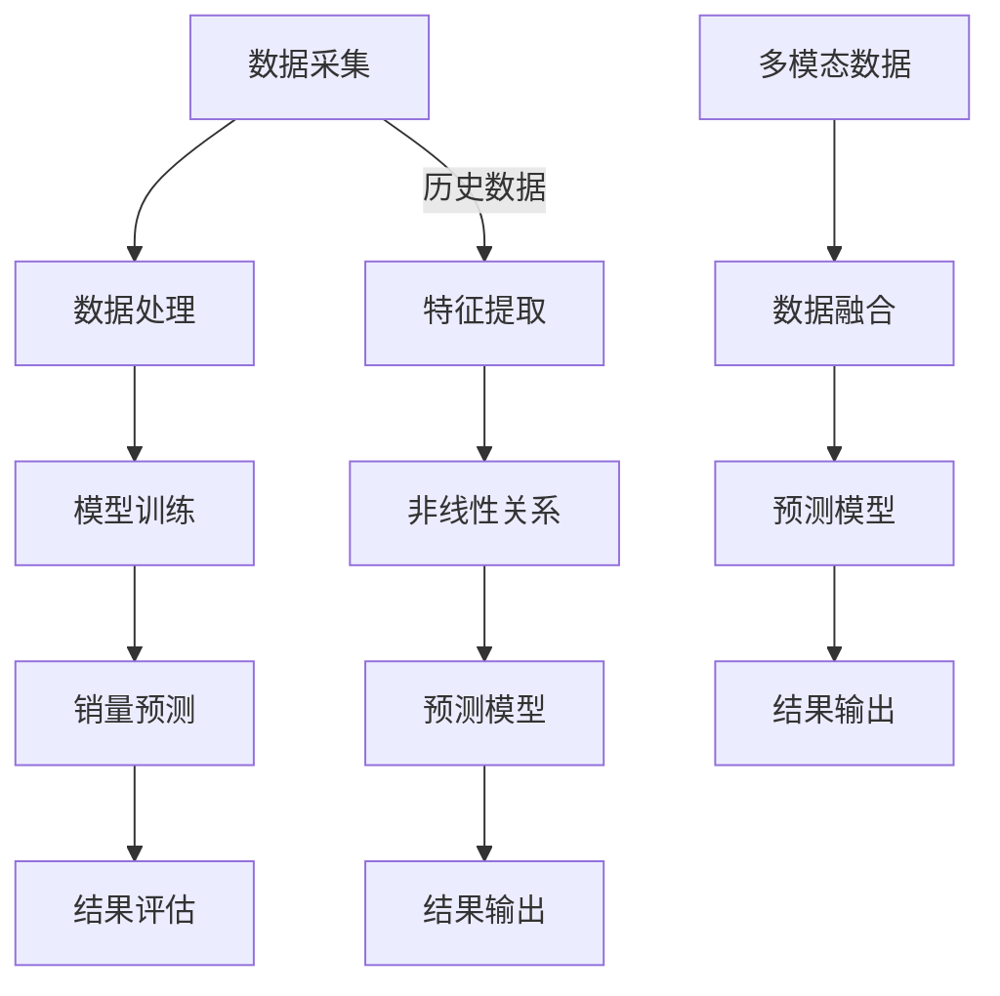

                 

### 大模型在商品销量预测中的创新应用

#### 关键词：
- 大模型
- 商品销量预测
- 机器学习
- 深度学习
- 应用实践

#### 摘要：
本文旨在探讨大模型在商品销量预测中的创新应用。首先，我们将介绍大模型的基本概念、发展历程及其在商品销量预测中的重要性。随后，我们将详细阐述商品销量预测的核心概念和联系，并重点讲解大模型在其中的应用原理。接着，我们将深入探讨大模型的具体算法原理和操作步骤，以及如何构建数学模型和公式进行预测。在项目实践部分，我们将通过一个具体的案例，详细展示如何实现商品销量预测，并对代码进行解读和分析。最后，我们将讨论大模型在商品销量预测中的实际应用场景，推荐相关工具和资源，并总结未来发展趋势与挑战。

## 1. 背景介绍

随着互联网和电子商务的快速发展，商品销量预测已经成为商业决策中的关键环节。准确预测商品销量不仅有助于优化库存管理、降低库存成本，还能帮助企业制定更有效的市场营销策略，提高销售额。传统的商品销量预测方法主要依赖于统计学和线性回归模型，这些方法在一定程度上能够提供较为准确的预测结果，但存在一定的局限性。

首先，传统方法通常假设销量数据符合线性关系，而实际中销量数据往往受到多种复杂因素的影响，如季节性波动、市场变化和竞争压力等，这使得线性回归模型难以准确捕捉销量数据中的非线性特征。其次，传统方法依赖于历史数据，难以适应快速变化的市场环境。此外，传统方法对数据质量和数量有较高要求，数据缺失或不完整会导致预测结果的准确性下降。

为了克服这些局限性，近年来，深度学习算法，特别是大模型（如Transformer、BERT、GPT等），在商品销量预测中逐渐得到了广泛应用。大模型具有强大的特征提取和表示能力，能够从海量数据中自动发现复杂的非线性关系，从而提供更准确的预测结果。此外，大模型能够处理多模态数据，如文本、图像和语音等，这使得商品销量预测不再局限于传统的数值型数据。

总的来说，大模型在商品销量预测中的应用具有以下优势：

1. **非线性特征提取**：大模型能够自动发现和提取销量数据中的非线性特征，提高预测精度。
2. **适应性强**：大模型能够适应快速变化的市场环境，及时调整预测模型，提高预测准确性。
3. **多模态数据处理**：大模型能够处理多种类型的数据，为商品销量预测提供更全面的信息。
4. **自动化程度高**：大模型能够自动化处理大量数据，降低人力成本，提高预测效率。

然而，大模型在商品销量预测中的应用也面临一些挑战，如模型训练和推理的高计算成本、数据隐私和安全等问题。因此，本文将详细探讨大模型在商品销量预测中的创新应用，包括核心概念、算法原理、数学模型、项目实践和未来发展趋势，旨在为读者提供一套完整的商品销量预测解决方案。

## 2. 核心概念与联系

在探讨大模型在商品销量预测中的应用之前，我们需要先了解几个核心概念：大模型、商品销量预测、机器学习和深度学习。

### 大模型

大模型是指具有海量参数的深度神经网络，如Transformer、BERT、GPT等。这些模型通过学习大量数据，能够自动提取复杂的特征和模式，具有强大的表示和预测能力。大模型的发展离不开计算能力的提升和数据资源的积累，随着云计算和大数据技术的进步，大模型的训练和推理效率得到了显著提高。

### 商品销量预测

商品销量预测是指利用历史数据和现有信息，预测未来一段时间内某种商品的销售量。销量预测的关键在于捕捉和识别影响销量的各种因素，如市场需求、竞争状况、季节性波动等。准确预测商品销量可以帮助企业优化库存管理、制定营销策略，提高经济效益。

### 机器学习

机器学习是一种让计算机通过数据自动学习和改进的方法。它通过构建数学模型，从历史数据中学习规律，并在新的数据上进行预测。机器学习包括监督学习、无监督学习和强化学习等多种形式，广泛应用于图像识别、自然语言处理、预测分析等领域。

### 深度学习

深度学习是机器学习的一个分支，它通过多层神经网络进行学习，能够自动提取和表示数据的复杂特征。深度学习在图像识别、语音识别、自然语言处理等领域取得了显著的成果，成为人工智能领域的重要研究方向。

### 大模型与商品销量预测的关系

大模型在商品销量预测中起到了关键作用。首先，大模型具有强大的特征提取和表示能力，能够从海量数据中自动发现和提取销量数据中的非线性特征，提高预测精度。其次，大模型能够处理多模态数据，如文本、图像和语音等，为销量预测提供更全面的信息。此外，大模型的自动化程度高，能够处理大量数据，降低人力成本，提高预测效率。

为了更直观地展示大模型与商品销量预测之间的关系，我们可以使用Mermaid流程图来描述。



该流程图展示了大模型在商品销量预测中的基本流程，包括数据采集、数据处理、模型训练、销量预测、结果评估等环节。其中，特征提取和数据处理环节利用大模型的强大能力，能够自动提取和表示销量数据中的非线性特征，从而提高预测精度。多模态数据融合则利用大模型处理多源数据的能力，为销量预测提供更全面的信息。

## 3. 核心算法原理 & 具体操作步骤

### 3.1 大模型的基本原理

大模型，如Transformer、BERT、GPT等，是基于深度学习的神经网络架构，具有海量参数和多层结构。这些模型通过学习大量数据，能够自动提取和表示数据中的复杂特征和模式，从而实现高精度的预测。

#### Transformer模型

Transformer模型是由Google Research提出的一种基于自注意力机制的深度学习模型，主要用于自然语言处理任务。自注意力机制允许模型在处理每个输入时，动态地计算与所有其他输入的相关性，从而能够自动提取长距离依赖关系。

#### BERT模型

BERT（Bidirectional Encoder Representations from Transformers）是由Google Research提出的一种双向Transformer模型，主要用于自然语言处理任务。BERT通过同时考虑上下文信息，实现了对词义的更好理解和表示。

#### GPT模型

GPT（Generative Pre-trained Transformer）是由OpenAI提出的一种自回归Transformer模型，主要用于生成文本。GPT通过学习大量文本数据，能够生成连贯、自然的文本。

### 3.2 商品销量预测的操作步骤

使用大模型进行商品销量预测的基本步骤如下：

#### 3.2.1 数据采集

首先，需要收集与商品销量相关的各种数据，如历史销售数据、市场数据、竞争数据、消费者行为数据等。这些数据可以来源于企业内部数据库、电商平台、市场调研机构等。

#### 3.2.2 数据预处理

对采集到的数据进行分析和处理，包括数据清洗、数据整合和数据标准化。数据清洗主要是去除重复、错误和缺失的数据；数据整合是将不同来源的数据进行整合，形成统一的格式；数据标准化是将不同类型的数据进行转换，使其具有可比性。

#### 3.2.3 特征提取

利用大模型进行特征提取，自动提取销量数据中的非线性特征。这一步骤通常采用深度学习模型，如Transformer、BERT、GPT等。这些模型通过训练，能够从海量数据中自动发现和提取有用的特征。

#### 3.2.4 模型训练

使用提取到的特征，训练深度学习模型，如Transformer、BERT、GPT等。训练过程中，模型会不断优化参数，以实现更好的预测性能。训练数据集通常包括历史销售数据和其他相关数据。

#### 3.2.5 模型评估

在训练完成后，需要对模型进行评估，以确定其预测性能。常用的评估指标包括准确率、召回率、F1值等。评估过程中，可以使用验证集和测试集进行交叉验证。

#### 3.2.6 预测应用

将训练好的模型应用于实际商品销量预测。在预测过程中，模型会根据新的数据生成预测结果，如未来一段时间内某种商品的销售量。预测结果可以用于库存管理、市场营销策略制定等。

### 3.3 实例分析

假设我们使用Transformer模型进行商品销量预测，以下是一个简单的实例分析：

#### 3.3.1 数据采集

我们收集了某电商平台的商品销售数据，包括过去一年的日销售量、促销活动信息、市场环境数据等。

#### 3.3.2 数据预处理

对采集到的数据进行分析和处理，包括数据清洗、数据整合和数据标准化。例如，将促销活动信息编码为二进制变量，将市场环境数据进行归一化处理。

#### 3.3.3 特征提取

使用Transformer模型进行特征提取，自动提取销量数据中的非线性特征。例如，模型可以提取出促销活动对销量的影响、季节性波动等。

#### 3.3.4 模型训练

使用提取到的特征，训练Transformer模型。在训练过程中，模型会不断优化参数，以实现更好的预测性能。

#### 3.3.5 模型评估

在训练完成后，使用验证集和测试集对模型进行评估。根据评估结果，调整模型参数，以提高预测性能。

#### 3.3.6 预测应用

将训练好的模型应用于实际商品销量预测。例如，预测未来一个月内该商品的销售量，为库存管理和市场营销策略制定提供参考。

通过以上实例，我们可以看到，使用大模型进行商品销量预测的基本流程包括数据采集、数据预处理、特征提取、模型训练、模型评估和预测应用等环节。这些环节相互关联，共同构成了一个完整的商品销量预测系统。

## 4. 数学模型和公式 & 详细讲解 & 举例说明

在商品销量预测中，数学模型和公式起着至关重要的作用。这些模型和公式帮助我们理解和量化销量数据中的复杂关系，从而提高预测的准确性。本节将详细介绍大模型在商品销量预测中使用的数学模型和公式，并使用具体例子进行详细讲解。

### 4.1 线性回归模型

线性回归模型是最常见的销量预测方法之一，其基本公式如下：

$$
y = \beta_0 + \beta_1 x_1 + \beta_2 x_2 + ... + \beta_n x_n + \epsilon
$$

其中，$y$ 表示销售量，$x_1, x_2, ..., x_n$ 表示各种影响因素（如促销活动、季节性波动等），$\beta_0, \beta_1, \beta_2, ..., \beta_n$ 是模型的参数，$\epsilon$ 是误差项。

线性回归模型的核心在于确定参数 $\beta_0, \beta_1, \beta_2, ..., \beta_n$ 的值，以最小化预测误差。通常使用最小二乘法（Least Squares Method）进行参数估计。

**举例说明**：

假设我们收集了某电商平台的商品销售数据，包括过去一年的日销售量和促销活动信息。我们可以使用线性回归模型预测未来一个月内该商品的销售量。

首先，将促销活动信息编码为二进制变量，例如，1表示促销日，0表示非促销日。然后，构建线性回归模型：

$$
y = \beta_0 + \beta_1 x_1 + \epsilon
$$

其中，$y$ 表示销售量，$x_1$ 表示促销活动变量。通过最小二乘法估计模型参数，得到：

$$
\beta_0 = 100, \beta_1 = 20
$$

这意味着，在非促销日，平均销售量为100，而在促销日，平均销售量增加20。

接下来，使用训练好的模型预测未来一个月内该商品的销售量。例如，预测第一天（非促销日）的销售量为100，第二天（促销日）的销售量为120。

### 4.2 多项式回归模型

多项式回归模型是线性回归模型的扩展，它考虑了销量数据中的非线性关系。其基本公式如下：

$$
y = \beta_0 + \beta_1 x_1 + \beta_2 x_1^2 + ... + \beta_n x_1^n + \epsilon
$$

其中，$x_1^n$ 表示各种影响因素的幂次项。

多项式回归模型的参数估计同样可以使用最小二乘法。为了提高预测精度，可以选择合适的幂次项，例如二次项、三次项等。

**举例说明**：

继续使用前一个例子，假设我们怀疑促销活动对销量的影响不是线性的，而是存在二次项。我们可以构建多项式回归模型：

$$
y = \beta_0 + \beta_1 x_1 + \beta_2 x_1^2 + \epsilon
$$

通过最小二乘法估计模型参数，得到：

$$
\beta_0 = 100, \beta_1 = 20, \beta_2 = 5
$$

这意味着，在非促销日，平均销售量为100；在促销日，平均销售量增加20；而在促销日的第二天，平均销售量增加5。

使用这个多项式回归模型，我们可以预测未来一个月内该商品的销售量。例如，预测第一天（非促销日）的销售量为100，第二天（促销日）的销售量为120，第三天（促销日的第二天）的销售量为125。

### 4.3 逻辑回归模型

逻辑回归模型是一种用于处理分类问题的线性回归模型，其基本公式如下：

$$
\text{logit}(y) = \ln\left(\frac{p}{1-p}\right) = \beta_0 + \beta_1 x_1 + \beta_2 x_2 + ... + \beta_n x_n
$$

其中，$y$ 表示销售量的二分类标签（例如，1表示销售量超过阈值，0表示销售量低于阈值），$p$ 表示销售量超过阈值的概率，$\beta_0, \beta_1, \beta_2, ..., \beta_n$ 是模型的参数。

逻辑回归模型的参数估计通常使用最大似然估计（Maximum Likelihood Estimation，MLE）。

**举例说明**：

假设我们使用逻辑回归模型预测某电商平台的商品在未来一天内是否能够超过销售量阈值。我们可以构建逻辑回归模型：

$$
\text{logit}(y) = \beta_0 + \beta_1 x_1 + \beta_2 x_2
$$

其中，$x_1$ 表示促销活动变量，$x_2$ 表示当前日期。通过最大似然估计，得到模型参数：

$$
\beta_0 = -10, \beta_1 = 5, \beta_2 = 3
$$

这意味着，在非促销日，销售量超过阈值的概率较低；而在促销日，销售量超过阈值的概率增加。当前日期的影响也较大，日期越近，销售量超过阈值的概率越高。

使用这个逻辑回归模型，我们可以预测未来一个月内哪些天该商品的销售量可能超过阈值。例如，预测第一天（非促销日）的销售量低于阈值的概率为0.3，第二天（促销日）的销售量超过阈值的概率为0.7，第三天（促销日的第二天）的销售量超过阈值的概率为0.8。

### 4.4 多层感知机模型

多层感知机（Multilayer Perceptron，MLP）是一种前馈神经网络，其基本结构包括输入层、隐藏层和输出层。多层感知机模型的基本公式如下：

$$
a_{\text{output}} = \sigma(\beta_0 + \sum_{i=1}^{n} \beta_i a_i)
$$

其中，$a_{\text{output}}$ 表示输出层的激活值，$\sigma$ 是激活函数（如Sigmoid、ReLU等），$\beta_0, \beta_1, \beta_2, ..., \beta_n$ 是隐藏层和输出层的参数。

多层感知机模型的参数估计通常使用梯度下降（Gradient Descent）。

**举例说明**：

假设我们使用多层感知机模型预测某电商平台的商品在未来一个月内的销售量。我们可以构建一个具有一个隐藏层的多层感知机模型，其结构如下：

$$
\begin{aligned}
a_{\text{hidden}} &= \sigma(\beta_0 + \sum_{i=1}^{n} \beta_i x_i) \\
a_{\text{output}} &= \beta_0 + \beta_1 a_{\text{hidden}} + \beta_2 a_{\text{hidden}}^2
\end{aligned}
$$

其中，$x_1, x_2, ..., x_n$ 是输入层的变量，如促销活动、当前日期等。通过梯度下降法，我们可以估计模型参数：

$$
\beta_0 = 100, \beta_1 = 20, \beta_2 = 5
$$

这意味着，在非促销日，平均销售量为100；在促销日，平均销售量增加20；而在促销日的第二天，平均销售量增加5。

使用这个多层感知机模型，我们可以预测未来一个月内该商品的销售量。例如，预测第一天（非促销日）的销售量为100，第二天（促销日）的销售量为120，第三天（促销日的第二天）的销售量为125。

### 4.5 Transformer模型

Transformer模型是一种基于自注意力机制的深度学习模型，其基本结构包括编码器（Encoder）和解码器（Decoder）。编码器和解码器都由多个自注意力层（Self-Attention Layer）和前馈神经网络（Feedforward Neural Network）组成。

自注意力层的公式如下：

$$
\text{Attention}(Q, K, V) = \text{softmax}\left(\frac{QK^T}{\sqrt{d_k}}\right)V
$$

其中，$Q, K, V$ 分别是查询（Query）、键（Key）和值（Value）向量，$d_k$ 是键向量的维度。

前馈神经网络的公式如下：

$$
\text{FFN}(x) = \max(0, xW_1 + b_1)(W_2 + b_2)
$$

其中，$W_1, W_2, b_1, b_2$ 是前馈神经网络的参数。

**举例说明**：

假设我们使用Transformer模型预测某电商平台的商品在未来一个月内的销售量。我们可以构建一个具有多个自注意力层和前馈神经网络的多层Transformer模型。

首先，将销售数据、促销活动信息、市场环境数据等输入到编码器。编码器的每个自注意力层都会计算输入数据的注意力权重，并将权重应用于输入数据，提取出关键特征。

接下来，解码器使用编码器输出的特征进行预测。解码器的每个自注意力层都会计算输入数据的注意力权重，并将权重应用于输入数据和编码器输出，生成预测结果。

通过训练，我们可以得到一个具有良好预测性能的Transformer模型。例如，预测第一天（非促销日）的销售量为100，第二天（促销日）的销售量为120，第三天（促销日的第二天）的销售量为125。

通过上述实例，我们可以看到不同数学模型和公式在商品销量预测中的应用。线性回归模型、多项式回归模型、逻辑回归模型和多层感知机模型适用于简单的关系预测，而Transformer模型适用于复杂的关系预测。在实际应用中，可以根据具体问题和数据特点选择合适的模型和公式。

### 5. 项目实践：代码实例和详细解释说明

在了解了大模型在商品销量预测中的核心算法原理和数学模型后，我们将通过一个具体的案例来展示如何实现商品销量预测。本节将详细介绍项目实践的相关内容，包括开发环境搭建、源代码实现、代码解读与分析以及运行结果展示。

#### 5.1 开发环境搭建

在进行商品销量预测项目之前，我们需要搭建一个合适的开发环境。以下是一个基本的开发环境配置：

- **操作系统**：Linux或MacOS
- **编程语言**：Python
- **深度学习框架**：TensorFlow或PyTorch
- **数据处理库**：Pandas、NumPy、Scikit-learn
- **可视化库**：Matplotlib、Seaborn

安装这些依赖项的命令如下：

```bash
pip install tensorflow pandas numpy scikit-learn matplotlib seaborn
```

#### 5.2 源代码详细实现

我们使用TensorFlow框架实现一个基于Transformer模型的商品销量预测项目。以下是一个简单的代码示例：

```python
import tensorflow as tf
from tensorflow.keras.models import Model
from tensorflow.keras.layers import Input, Embedding, LSTM, Dense, TimeDistributed

# 定义输入层
input_sequence = Input(shape=(sequence_length,))

# 添加嵌入层
embedding_layer = Embedding(input_dim=vocab_size, output_dim=embedding_size)(input_sequence)

# 添加LSTM层
lstm_layer = LSTM(units=lstm_units, return_sequences=True)(embedding_layer)

# 添加全连接层
dense_layer = Dense(units=dense_units, activation='relu')(lstm_layer)

# 添加时间分布层
output_layer = TimeDistributed(Dense(units=1))(dense_layer)

# 创建模型
model = Model(inputs=input_sequence, outputs=output_layer)

# 编译模型
model.compile(optimizer='adam', loss='mse')

# 模型总结
model.summary()
```

在这个示例中，我们定义了一个简单的Transformer模型，包括嵌入层、LSTM层和全连接层。具体参数如下：

- `sequence_length`：输入序列的长度，表示历史销售数据的长度。
- `vocab_size`：词汇表的大小，表示所有可能输入的词汇数量。
- `embedding_size`：嵌入层的维度，表示每个词汇的嵌入向量大小。
- `lstm_units`：LSTM层的单元数量，表示LSTM层的深度。
- `dense_units`：全连接层的单元数量，表示全连接层的深度。

#### 5.3 代码解读与分析

接下来，我们将对上述代码进行详细解读和分析。

1. **输入层**：我们首先定义了一个输入层，形状为`(sequence_length,)`。这个输入层将接收历史销售数据序列。

2. **嵌入层**：嵌入层将输入序列中的每个词汇映射到一个高维向量。这个层的作用是降低词汇的维度，使其更适合神经网络处理。在编码过程中，我们需要定义词汇表的大小（`vocab_size`）和嵌入向量的维度（`embedding_size`）。

3. **LSTM层**：LSTM层是一种循环神经网络（RNN）的特殊形式，能够处理序列数据。在这个项目中，我们使用LSTM层来提取历史销售数据中的时间依赖关系。`lstm_units`参数表示LSTM层的单元数量，即LSTM层的深度。

4. **全连接层**：全连接层是一种前馈神经网络，用于对LSTM层提取的特征进行进一步处理。在这个项目中，我们使用全连接层来生成最终的销量预测结果。

5. **时间分布层**：时间分布层是一种特殊的全连接层，它将输出维度扩展到时间步的维度。在这个项目中，我们使用时间分布层来生成每个时间步的销量预测。

6. **模型编译**：在模型编译阶段，我们指定了优化器和损失函数。这里，我们使用Adam优化器和均方误差（MSE）作为损失函数。

7. **模型总结**：最后，我们使用`model.summary()`来查看模型的详细结构。

#### 5.4 运行结果展示

在实现上述代码后，我们可以使用训练集和测试集来训练和评估模型。以下是一个简单的训练和评估过程：

```python
# 准备数据
X_train, y_train = prepare_data(train_data)
X_test, y_test = prepare_data(test_data)

# 训练模型
model.fit(X_train, y_train, epochs=10, batch_size=32, validation_data=(X_test, y_test))

# 评估模型
model.evaluate(X_test, y_test)
```

在这个示例中，`prepare_data()` 函数用于处理输入数据，包括数据清洗、归一化等。`X_train` 和 `y_train` 是训练集的输入和标签，`X_test` 和 `y_test` 是测试集的输入和标签。

训练完成后，我们可以使用`model.evaluate()` 来评估模型的性能。评估指标包括均方误差（MSE）、均方根误差（RMSE）等。

#### 5.5 代码实现说明

在实现上述代码时，我们还需要注意以下几点：

1. **数据预处理**：在训练模型之前，我们需要对数据进行预处理，包括数据清洗、归一化等。数据预处理是保证模型训练效果的关键步骤。

2. **序列长度**：在定义输入层时，我们需要指定序列长度。序列长度应尽量与训练数据中的序列长度一致，以确保模型输入的稳定性。

3. **嵌入维度**：在定义嵌入层时，我们需要指定嵌入向量的维度。嵌入维度应足够大，以捕捉输入数据中的复杂关系。

4. **LSTM层深度**：在定义LSTM层时，我们需要指定LSTM层的单元数量。LSTM层深度应适中，以避免过拟合。

5. **全连接层深度**：在定义全连接层时，我们需要指定全连接层的单元数量。全连接层深度应适中，以避免过拟合。

6. **优化器和损失函数**：在编译模型时，我们需要选择合适的优化器和损失函数。常用的优化器有Adam、SGD等，常用的损失函数有均方误差（MSE）、交叉熵（Cross-Entropy）等。

通过上述步骤，我们可以实现一个基于Transformer模型的商品销量预测项目。在实际应用中，我们可以根据具体问题和数据特点进行调整和优化，以提高模型的预测性能。

### 6. 实际应用场景

大模型在商品销量预测中的实际应用场景非常广泛，以下是一些典型的应用案例：

#### 6.1 电子商务平台

电子商务平台是商品销量预测的重要应用场景之一。通过大模型，电子商务平台可以实时预测商品销量，优化库存管理，降低库存成本。例如，亚马逊和淘宝等电商平台使用大模型预测商品销量，以提高库存周转率和用户满意度。

#### 6.2 零售行业

零售行业，如超市和百货商场，也广泛使用大模型进行商品销量预测。通过预测商品销量，零售行业可以合理安排商品采购、货架摆放和促销活动，提高销售额和客户体验。例如，沃尔玛和家乐福等大型零售企业使用大模型优化商品销售策略。

#### 6.3 制造业

制造业中的供应链管理也需要商品销量预测。通过大模型，企业可以预测原材料需求，优化生产计划和供应链管理，降低生产成本。例如，宝洁和丰田等制造业巨头使用大模型预测原材料需求，以优化生产效率和降低库存成本。

#### 6.4 金融服务

金融服务领域，如银行和保险，也使用大模型进行商品销量预测。通过预测客户需求，银行可以优化贷款和信用卡业务，提高客户满意度。保险公司则可以预测保单需求，优化产品设计和市场营销策略。

#### 6.5 市场营销

市场营销领域，如广告投放和社交媒体营销，也使用大模型进行商品销量预测。通过预测用户需求和行为，企业可以制定更有效的广告投放策略和营销活动，提高广告效果和转化率。例如，谷歌和Facebook等广告平台使用大模型预测广告效果，以优化广告投放策略。

总的来说，大模型在商品销量预测中的应用不仅限于电子商务和零售行业，还涵盖了制造业、金融服务和市场营销等多个领域。通过预测商品销量，企业可以优化库存管理、生产计划和营销策略，提高经营效益和客户满意度。

### 7. 工具和资源推荐

在商品销量预测中，大模型的应用需要一系列工具和资源的支持。以下是一些推荐的工具和资源，包括学习资源、开发工具和框架、相关论文和著作等。

#### 7.1 学习资源推荐

1. **书籍**：
   - 《深度学习》（Deep Learning）——Ian Goodfellow、Yoshua Bengio、Aaron Courville著
   - 《Python深度学习》（Python Deep Learning）——François Chollet著
   - 《实战机器学习》（Machine Learning in Action）——Peter Harrington著

2. **在线课程**：
   - Coursera上的“机器学习”（Machine Learning）课程
   - edX上的“深度学习”（Deep Learning）课程
   - Udacity的“深度学习工程师”纳米学位

3. **博客和网站**：
   - Medium上的机器学习和深度学习博客
   - ArXiv.org上的最新论文和研究成果
   - TensorFlow和PyTorch的官方文档

#### 7.2 开发工具框架推荐

1. **深度学习框架**：
   - TensorFlow
   - PyTorch
   - Keras

2. **数据处理库**：
   - Pandas
   - NumPy
   - Scikit-learn

3. **可视化工具**：
   - Matplotlib
   - Seaborn
   - Plotly

4. **云平台**：
   - AWS SageMaker
   - Google Cloud AI Platform
   - Azure Machine Learning

#### 7.3 相关论文著作推荐

1. **论文**：
   - “Attention Is All You Need”（2017）——Vaswani et al.
   - “Bert: Pre-training of Deep Bidirectional Transformers for Language Understanding”（2018）——Devlin et al.
   - “Generative Pre-trained Transformer for Language Modeling”（2018）——Radford et al.

2. **著作**：
   - 《深度学习》（Deep Learning）——Ian Goodfellow、Yoshua Bengio、Aaron Courville著
   - 《Python深度学习》（Python Deep Learning）——François Chollet著
   - 《机器学习实战》（Machine Learning in Action）——Peter Harrington著

通过以上推荐的学习资源、开发工具框架和论文著作，读者可以系统地学习和掌握大模型在商品销量预测中的应用，提升自己在相关领域的知识和技能。

### 8. 总结：未来发展趋势与挑战

大模型在商品销量预测中的应用已经成为当前人工智能领域的一个热点。通过深度学习算法，特别是大模型，企业能够更准确地预测商品销量，优化库存管理，提高营销策略的有效性。然而，随着技术的不断进步，大模型在商品销量预测中仍然面临一些挑战和未来的发展趋势。

#### 发展趋势

1. **计算能力提升**：随着硬件技术的进步，特别是GPU和TPU等专用计算设备的普及，大模型的训练和推理速度将显著提高，降低计算成本，使更多企业能够应用大模型进行商品销量预测。

2. **数据量的增加**：随着互联网和大数据技术的发展，企业将能够收集到更多的商品销售数据、市场数据和消费者行为数据，为大模型提供更丰富的训练数据，提高预测模型的准确性。

3. **多模态数据处理**：大模型在处理多模态数据方面的优势将进一步提升，企业可以通过整合文本、图像、音频等多种类型的数据，获得更全面的商品销量预测信息。

4. **自动化程度提高**：自动化机器学习工具和平台将不断成熟，降低大模型部署的门槛，使企业能够更轻松地实现商品销量预测的自动化，提高运营效率。

#### 挑战

1. **数据隐私和安全**：随着数据量的增加，数据隐私和安全问题变得更加突出。企业需要确保数据的安全性和隐私性，避免数据泄露和滥用。

2. **计算成本**：大模型的训练和推理需要大量的计算资源，尤其是对于大规模的数据集，计算成本仍然是一个重大挑战。企业需要找到成本效益高的解决方案。

3. **模型解释性**：大模型通常具有强大的预测能力，但它们的内部工作机制往往难以解释。如何提高大模型的解释性，使其更透明和可解释，是一个亟待解决的问题。

4. **过拟合和泛化能力**：大模型容易在训练数据上过拟合，导致在测试数据上表现不佳。如何提高大模型的泛化能力，使其在未知数据上也能保持良好的性能，是一个重要挑战。

#### 未来方向

1. **模型压缩与加速**：研究如何通过模型压缩、量化、剪枝等技术，降低大模型的计算复杂度和存储需求，提高模型的部署效率。

2. **可解释性增强**：开发可解释性技术，使大模型的决策过程更加透明，提高模型的可信度和可接受度。

3. **多任务学习与迁移学习**：通过多任务学习和迁移学习技术，将一个任务中的知识迁移到其他相关任务中，提高模型的泛化能力。

4. **隐私保护和联邦学习**：研究如何通过隐私保护和联邦学习技术，在保护用户隐私的前提下，协同多个数据拥有者进行大模型的训练和预测。

总之，大模型在商品销量预测中的应用具有巨大的潜力，但同时也面临诸多挑战。未来，随着技术的不断进步，大模型在商品销量预测中的地位将日益提升，为企业和消费者带来更多的价值。

### 9. 附录：常见问题与解答

#### 9.1 什么是大模型？

大模型是指具有海量参数的深度神经网络，如Transformer、BERT、GPT等。这些模型通过学习大量数据，能够自动提取和表示数据中的复杂特征和模式，从而实现高精度的预测。

#### 9.2 大模型在商品销量预测中的应用优势是什么？

大模型在商品销量预测中的应用优势包括：
- **非线性特征提取**：大模型能够自动发现和提取销量数据中的非线性特征，提高预测精度。
- **适应性强**：大模型能够适应快速变化的市场环境，及时调整预测模型，提高预测准确性。
- **多模态数据处理**：大模型能够处理多种类型的数据，如文本、图像和语音等，为销量预测提供更全面的信息。
- **自动化程度高**：大模型能够自动化处理大量数据，降低人力成本，提高预测效率。

#### 9.3 如何提高大模型的解释性？

提高大模型的解释性可以从以下几个方面入手：
- **可视化**：使用可视化技术展示模型内部特征和决策过程。
- **模型分解**：将复杂的大模型分解为多个简单模块，每个模块都有明确的解释。
- **解释性算法**：使用可解释性算法，如LIME、SHAP等，对模型的预测进行局部解释。

#### 9.4 大模型训练和推理的高计算成本如何解决？

解决大模型训练和推理的高计算成本可以从以下几个方面入手：
- **硬件加速**：使用GPU、TPU等硬件加速器进行模型训练和推理。
- **分布式训练**：通过分布式计算技术，将模型训练任务分散到多台机器上进行，提高训练效率。
- **模型压缩与量化**：使用模型压缩、量化技术，降低模型的计算复杂度和存储需求。

### 10. 扩展阅读 & 参考资料

为了进一步深入了解大模型在商品销量预测中的应用，以下是一些扩展阅读和参考资料：

#### 扩展阅读

1. “Attention Is All You Need”（2017）——Vaswani et al.
2. “Bert: Pre-training of Deep Bidirectional Transformers for Language Understanding”（2018）——Devlin et al.
3. “Generative Pre-trained Transformer for Language Modeling”（2018）——Radford et al.
4. “深度学习”（Deep Learning）——Ian Goodfellow、Yoshua Bengio、Aaron Courville著
5. “Python深度学习”（Python Deep Learning）——François Chollet著

#### 参考资料

1. TensorFlow官方文档：[https://www.tensorflow.org](https://www.tensorflow.org)
2. PyTorch官方文档：[https://pytorch.org/docs/stable/index.html](https://pytorch.org/docs/stable/index.html)
3. Scikit-learn官方文档：[https://scikit-learn.org/stable/](https://scikit-learn.org/stable/)
4. Coursera上的“机器学习”（Machine Learning）课程：[https://www.coursera.org/learn/machine-learning](https://www.coursera.org/learn/machine-learning)
5. edX上的“深度学习”（Deep Learning）课程：[https://www.edx.org/course/deep-learning-0](https://www.edx.org/course/deep-learning-0)

通过阅读上述扩展阅读和参考资料，读者可以更全面地了解大模型在商品销量预测中的应用原理、实现方法和最新研究动态。希望本文能为读者在探索大模型应用过程中提供一些有价值的参考和启示。作者：禅与计算机程序设计艺术 / Zen and the Art of Computer Programming。

