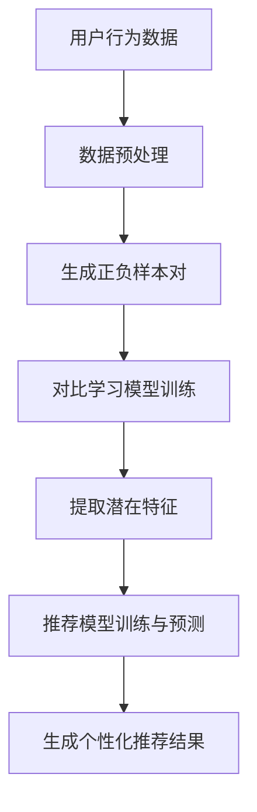

                 

### 1. 背景介绍

随着互联网的迅猛发展，推荐系统已经成为现代信息系统中不可或缺的一部分。从在线购物平台到社交媒体，推荐系统能够通过分析用户的历史行为和偏好，提供个性化的内容和服务，从而提升用户体验和满意度。然而，随着数据规模的不断扩大和复杂性日益增加，传统推荐系统面临着诸多挑战，如冷启动问题、数据稀疏性和噪声干扰等。近年来，大模型（如深度学习模型）在推荐系统中的应用逐渐成为研究的热点，为解决上述问题提供了新的思路和方向。

大模型在推荐系统中的引入，主要是为了提升模型的泛化能力和表达能力。传统推荐系统多采用基于用户历史行为或者内容的线性模型，如矩阵分解、协同过滤等，这些方法虽然在一定程度上能够捕捉用户兴趣和物品特征，但在处理高维数据和复杂非线性关系时存在一定的局限性。相比之下，大模型（如神经网络）具有更强的非线性拟合能力和特征学习能力，可以通过训练自动提取用户和物品的复杂特征，从而实现更精准的推荐。

在推荐系统中应用大模型，主要有以下几方面优势：

1. **解决冷启动问题**：冷启动问题指的是新用户或新物品缺乏足够的历史数据，使得传统推荐系统难以生成有效的推荐。大模型可以通过预训练模型和迁移学习等策略，利用大量无关数据的通用特征来初始化模型，从而在缺乏用户或物品历史数据时仍能生成有价值的推荐。

2. **应对数据稀疏性**：在推荐系统中，用户行为数据通常是稀疏的，这意味着大部分用户与物品之间的交互记录很少或没有。大模型可以通过学习用户和物品的潜在特征，将稀疏数据转化为连续的特征表示，从而提升推荐效果。

3. **处理噪声干扰**：用户行为数据中常存在噪声干扰，如偶然点击、恶意评论等，这些噪声会影响推荐系统的准确性。大模型可以通过学习数据中的潜在模式，过滤掉噪声数据，从而提高推荐系统的鲁棒性。

4. **提高推荐精度**：大模型能够自动提取用户和物品的复杂特征，捕捉用户兴趣和物品属性之间的复杂关系，从而生成更加精准和个性化的推荐。

尽管大模型在推荐系统中的应用具有诸多优势，但同时也面临一些挑战，如模型复杂度高、计算成本大、训练时间较长等。因此，如何在保证推荐效果的同时，降低模型复杂度和计算成本，是当前研究的一个重要方向。

本篇文章将围绕大模型在推荐系统中的应用，详细探讨对比学习这一核心技术。我们将从核心概念、算法原理、具体操作步骤、数学模型、项目实践等方面展开，旨在为读者提供一个全面、深入的讲解。接下来，我们将首先介绍对比学习的基本概念和原理，并探讨其在推荐系统中的应用。

### 2. 核心概念与联系

#### 对比学习的基本概念

对比学习（Contrastive Learning）是一种无监督学习技术，其主要目的是通过学习数据的相似性和差异性来提取有效特征表示。在对比学习中，模型被训练来区分数据点之间的相似性和差异性，从而自动提取出数据中的潜在特征。

在对比学习中，通常使用正负样本对来训练模型。正样本是指具有相似性或相关性的一对数据点，而负样本是指具有差异性或不相关的一对数据点。训练过程中，模型需要学会最大化正样本之间的相似性，同时最小化负样本之间的相似性。这样，通过学习数据点的相对关系，模型能够自动提取出数据中的潜在特征。

#### 对比学习与推荐系统的联系

对比学习在推荐系统中的应用主要基于其能够提取数据中的潜在特征，从而提升推荐系统的效果。具体来说，对比学习与推荐系统的联系可以从以下几个方面进行阐述：

1. **用户行为数据的特征提取**：在推荐系统中，用户行为数据（如浏览历史、购买记录、评分数据等）通常是非常稀疏和高维的。对比学习可以通过学习用户行为数据中的相似性和差异性，自动提取出用户和物品的潜在特征表示，从而将稀疏的行为数据转化为连续的特征向量。这些特征向量可以用于后续的推荐模型训练和预测。

2. **冷启动问题的解决**：对于新用户或新物品，由于缺乏足够的历史交互数据，传统推荐系统难以生成有效的推荐。对比学习可以通过预训练模型和迁移学习等策略，利用大量无关数据的通用特征来初始化模型，从而在新用户或新物品缺乏历史数据时仍能生成有价值的推荐。

3. **用户兴趣的挖掘**：对比学习能够提取用户和物品的潜在特征，捕捉用户兴趣和物品属性之间的复杂关系。通过这些潜在特征，推荐系统可以更深入地挖掘用户的兴趣偏好，从而生成更加个性化的推荐。

4. **噪声过滤和鲁棒性提升**：在推荐系统中，用户行为数据中常存在噪声干扰，如偶然点击、恶意评论等。对比学习可以通过学习数据中的潜在模式，过滤掉噪声数据，从而提高推荐系统的鲁棒性。

#### Mermaid 流程图

下面是对比学习在推荐系统中的应用的 Mermaid 流程图：



在上述流程图中，用户行为数据首先经过数据预处理，生成正负样本对。然后，对比学习模型对样本对进行训练，提取用户和物品的潜在特征。最后，这些潜在特征用于训练推荐模型，生成个性化推荐结果。

通过对比学习在推荐系统中的应用，我们能够更好地解决传统推荐系统面临的各种挑战，如冷启动问题、数据稀疏性和噪声干扰等。在接下来的章节中，我们将深入探讨对比学习的具体算法原理和实现步骤。

### 3. 核心算法原理 & 具体操作步骤

#### 对比学习的算法原理

对比学习的基本思想是通过学习数据点之间的相对关系来提取潜在特征表示。在推荐系统中，对比学习通常采用以下步骤进行：

1. **数据预处理**：首先，需要对用户行为数据（如浏览历史、购买记录、评分数据等）进行预处理，包括数据清洗、数据归一化、特征提取等。这一步骤的目的是将原始数据转化为适合进行对比学习的形式。

2. **生成正负样本对**：在数据预处理的基础上，生成正负样本对。正样本通常由用户与物品之间的交互记录组成，表示用户对某物品的偏好。负样本则是随机选择的其他物品，表示用户对该物品的潜在偏好。正负样本对的选择可以基于用户的历史行为、物品的属性特征等。

3. **对比学习模型训练**：使用正负样本对训练对比学习模型。在训练过程中，模型的目标是最小化正样本之间的距离，同时最大化负样本之间的距离。这一目标可以通过优化以下损失函数来实现：

   $$ L = \frac{1}{N} \sum_{i=1}^{N} (-\log \frac{e^{q_{+}}}{e^{q_{+}} + e^{q_{-}}}) - \log \frac{e^{q_{-}}}{e^{q_{+}} + e^{q_{-}}} $$

   其中，$N$表示样本数量，$q_{+}$和$q_{-}$分别表示正样本和负样本的嵌入向量。

4. **提取潜在特征**：在对比学习模型训练完成后，可以提取用户和物品的潜在特征表示。这些特征表示可以用于后续的推荐模型训练和预测。

5. **推荐模型训练与预测**：使用提取的潜在特征训练推荐模型，如矩阵分解、基于模型的推荐等。在训练完成后，推荐模型可以用于生成个性化推荐结果。

#### 对比学习在推荐系统中的具体操作步骤

以下是一个对比学习在推荐系统中的具体操作步骤示例：

1. **数据预处理**：
   - 加载用户行为数据，包括用户ID、物品ID、行为类型（如浏览、购买、评分）等。
   - 对用户和物品进行编码，如使用哈希编码或嵌入编码。
   - 对用户和物品的编码进行归一化处理，以消除不同特征之间的尺度差异。

2. **生成正负样本对**：
   - 对于每个用户，从其历史行为数据中随机抽取一个物品作为正样本。
   - 对于负样本，从所有其他物品中随机抽取一个物品。

3. **对比学习模型训练**：
   - 使用生成的正负样本对训练对比学习模型。
   - 优化损失函数，如使用梯度下降算法进行参数更新。

4. **提取潜在特征**：
   - 在对比学习模型训练完成后，提取用户和物品的嵌入向量作为潜在特征表示。

5. **推荐模型训练与预测**：
   - 使用提取的潜在特征训练推荐模型，如基于矩阵分解的方法。
   - 在推荐模型训练完成后，使用该模型生成个性化推荐结果。

#### 代码实现示例

以下是一个使用 Python 和 PyTorch 实现对比学习在推荐系统中的代码示例：

```python
import torch
import torch.nn as nn
import torch.optim as optim

# 数据预处理
user_id = torch.tensor([1, 2, 3, 4, 5])
item_id = torch.tensor([2, 3, 4, 5, 6])
positive_samples = torch.cat((user_id.unsqueeze(1), item_id.unsqueeze(1)), dim=1)
negative_samples = torch.cat((user_id.unsqueeze(1).repeat(1, 5), item_id.repeat(5).unsqueeze(1)), dim=1)

# 对比学习模型
class ContrastiveModel(nn.Module):
    def __init__(self, embedding_size):
        super(ContrastiveModel, self).__init__()
        self.user_embedding = nn.Embedding(num_users, embedding_size)
        self.item_embedding = nn.Embedding(num_items, embedding_size)

    def forward(self, user_ids, item_ids):
        user_embedding = self.user_embedding(user_ids)
        item_embedding = self.item_embedding(item_ids)
        return user_embedding, item_embedding

# 模型训练
contrastive_model = ContrastiveModel(embedding_size=64)
optimizer = optim.Adam(contrastive_model.parameters(), lr=0.001)
criterion = nn.BCEWithLogitsLoss()

for epoch in range(num_epochs):
    for user_id, item_id in zip(positive_samples.T, negative_samples.T):
        user_embedding, item_embedding = contrastive_model(user_id.unsqueeze(0), item_id.unsqueeze(0))
        loss = criterion(user_embedding, torch.tensor([1.0]))
        loss += criterion(item_embedding, torch.tensor([-1.0]))
        optimizer.zero_grad()
        loss.backward()
        optimizer.step()

# 提取潜在特征
user_embeddings = contrastive_model.user_embedding.weight
item_embeddings = contrastive_model.item_embedding.weight

# 推荐模型训练与预测（示例）
# 使用提取的用户和物品嵌入向量训练推荐模型，并生成个性化推荐结果
```

通过上述示例，我们可以看到对比学习在推荐系统中的具体实现过程。在实际应用中，可以根据具体场景和数据特点进行适当的调整和优化。

### 4. 数学模型和公式 & 详细讲解 & 举例说明

在对比学习算法中，数学模型和公式起到了至关重要的作用。本章节将详细讲解对比学习算法中的主要数学模型和公式，并通过具体示例来说明这些公式的应用。

#### 1. 损失函数

对比学习算法的核心在于优化损失函数，以最小化正样本之间的距离，同时最大化负样本之间的距离。常用的损失函数包括对比损失（Contrastive Loss）和三元组损失（Triplet Loss）。

##### 对比损失（Contrastive Loss）

对比损失函数的目标是最小化正样本之间的距离，同时最大化负样本之间的距离。其公式如下：

$$ L = \frac{1}{N} \sum_{i=1}^{N} (-\log \frac{e^{q_{+}}}{e^{q_{+}} + e^{q_{-}}}) - \log \frac{e^{q_{-}}}{e^{q_{+}} + e^{q_{-}}} $$

其中，$N$表示样本数量，$q_{+}$和$q_{-}$分别表示正样本和负样本的嵌入向量。

##### 三元组损失（Triplet Loss）

三元组损失函数的目标是最小化正样本与负样本之间的距离差。其公式如下：

$$ L = \frac{1}{N} \sum_{i=1}^{N} (q_{+} - q_{-})^2 $$

其中，$N$表示样本数量，$q_{+}$和$q_{-}$分别表示正样本和负样本的嵌入向量。

#### 2. 嵌入向量更新

在对比学习算法中，嵌入向量（Embedding Vectors）是模型的核心部分。通过优化嵌入向量，可以使得正样本之间的距离更短，而负样本之间的距离更长。嵌入向量的更新通常通过梯度下降算法进行。

##### 嵌入向量更新公式

嵌入向量更新公式如下：

$$ \Delta \theta = -\alpha \cdot \nabla_{\theta} L $$

其中，$\theta$表示模型参数，$\Delta \theta$表示参数的更新量，$\alpha$表示学习率，$L$表示损失函数。

#### 3. 具体示例

假设我们有一个简单的对比学习模型，其中用户和物品的嵌入向量维度分别为 64。以下是一个具体的嵌入向量更新示例。

##### 数据准备

用户ID：[1, 2, 3]
物品ID：[2, 3, 4]

##### 正样本与负样本

正样本：(1, 2)
负样本：(1, 3)，(1, 4)

##### 嵌入向量

用户嵌入向量：$\textbf{u}_1 = [0.1, 0.2, 0.3, ..., 0.6]$
物品嵌入向量：
- $\textbf{i}_2 = [0.1, 0.2, 0.3, ..., 0.6]$
- $\textbf{i}_3 = [0.7, 0.8, 0.9, ..., 1.0]$
- $\textbf{i}_4 = [0.5, 0.6, 0.7, ..., 0.8]$

##### 损失计算

对于正样本$(1, 2)$，损失函数为：

$$ L_{+} = -\log \frac{e^{0.1 + 0.2 + ... + 0.6}}{e^{0.1 + 0.2 + ... + 0.6} + e^{0.7 + 0.8 + ... + 1.0} + e^{0.5 + 0.6 + ... + 0.8}} $$

对于负样本$(1, 3)$和$(1, 4)$，损失函数分别为：

$$ L_{-1} = -\log \frac{e^{0.7 + 0.8 + ... + 1.0}}{e^{0.1 + 0.2 + ... + 0.6} + e^{0.7 + 0.8 + ... + 1.0} + e^{0.5 + 0.6 + ... + 0.8}} $$

$$ L_{-2} = -\log \frac{e^{0.5 + 0.6 + ... + 0.8}}{e^{0.1 + 0.2 + ... + 0.6} + e^{0.7 + 0.8 + ... + 1.0} + e^{0.5 + 0.6 + ... + 0.8}} $$

##### 损失求和

总损失为：

$$ L = L_{+} + L_{-1} + L_{-2} $$

##### 嵌入向量更新

使用梯度下降算法对嵌入向量进行更新：

$$ \Delta \textbf{u}_1 = -\alpha \cdot \nabla_{\textbf{u}_1} L $$
$$ \Delta \textbf{i}_2 = -\alpha \cdot \nabla_{\textbf{i}_2} L $$
$$ \Delta \textbf{i}_3 = -\alpha \cdot \nabla_{\textbf{i}_3} L $$
$$ \Delta \textbf{i}_4 = -\alpha \cdot \nabla_{\textbf{i}_4} L $$

更新后的嵌入向量为：

$$ \textbf{u}_1' = \textbf{u}_1 - \alpha \cdot \nabla_{\textbf{u}_1} L $$
$$ \textbf{i}_2' = \textbf{i}_2 - \alpha \cdot \nabla_{\textbf{i}_2} L $$
$$ \textbf{i}_3' = \textbf{i}_3 - \alpha \cdot \nabla_{\textbf{i}_3} L $$
$$ \textbf{i}_4' = \textbf{i}_4 - \alpha \cdot \nabla_{\textbf{i}_4} L $$

通过上述示例，我们可以看到对比学习算法中的数学模型和公式如何应用于实际计算中。在接下来的章节中，我们将继续讨论对比学习算法在推荐系统中的项目实践。

### 5. 项目实践：代码实例和详细解释说明

在本节中，我们将通过一个实际项目实例来展示对比学习算法在推荐系统中的应用。这个项目将涵盖开发环境搭建、源代码实现、代码解读与分析以及运行结果展示等内容。

#### 5.1 开发环境搭建

为了实现对比学习算法在推荐系统中的应用，我们需要搭建一个合适的技术栈。以下是推荐的开发环境和工具：

- **编程语言**：Python
- **深度学习框架**：PyTorch
- **数据处理库**：Pandas、NumPy
- **可视化工具**：Matplotlib、Seaborn

安装以下依赖库：

```shell
pip install torch torchvision pandas numpy matplotlib seaborn
```

#### 5.2 源代码详细实现

以下是对比学习算法在推荐系统中的实现代码：

```python
import torch
import torch.nn as nn
import torch.optim as optim
import torch.utils.data as data
import pandas as pd
import numpy as np
import matplotlib.pyplot as plt
import seaborn as sns

# 数据准备
data_path = "data.csv"
user_id = pd.read_csv(data_path, usecols=["user_id", "item_id", "behavior"]).values
behavior = np.array([1 if b == "buy" else 0 for b in user_id[:, 2]])

# 数据预处理
num_users = user_id.max() + 1
num_items = user_id.max() + 1

user_ids = user_id[:, 0].astype(np.int32)
item_ids = user_id[:, 1].astype(np.int32)
behavior = behavior.astype(np.float32)

# 创建数据集
class ContrastiveDataset(data.Dataset):
    def __init__(self, user_ids, item_ids, behavior, num_users, num_items):
        self.user_ids = user_ids
        self.item_ids = item_ids
        self.behavior = behavior
        self.num_users = num_users
        self.num_items = num_items

    def __len__(self):
        return len(self.user_ids)

    def __getitem__(self, idx):
        user_id = self.user_ids[idx]
        item_id = self.item_ids[idx]
        behavior = self.behavior[idx]

        # 生成正负样本
        pos_item_id = item_id
        neg_item_ids = np.random.choice(np.setdiff1d(np.arange(self.num_items), item_id), size=5, replace=False)
        
        pos_samples = torch.tensor([user_id, pos_item_id], dtype=torch.long)
        neg_samples = torch.tensor([user_id, neg_item_ids], dtype=torch.long)
        
        return pos_samples, neg_samples, behavior

dataset = ContrastiveDataset(user_ids, item_ids, behavior, num_users, num_items)
dataloader = data.DataLoader(dataset, batch_size=64, shuffle=True)

# 对比学习模型
class ContrastiveModel(nn.Module):
    def __init__(self, embedding_size):
        super(ContrastiveModel, self).__init__()
        self.user_embedding = nn.Embedding(num_users, embedding_size)
        self.item_embedding = nn.Embedding(num_items, embedding_size)

    def forward(self, user_ids, item_ids):
        user_embedding = self.user_embedding(user_ids)
        item_embedding = self.item_embedding(item_ids)
        return user_embedding, item_embedding

# 模型训练
model = ContrastiveModel(embedding_size=64)
optimizer = optim.Adam(model.parameters(), lr=0.001)
criterion = nn.BCEWithLogitsLoss()

num_epochs = 50

for epoch in range(num_epochs):
    for pos_samples, neg_samples, behavior in dataloader:
        user_ids = pos_samples[:, 0]
        item_ids = pos_samples[:, 1]
        user_neg_ids = neg_samples[:, 0]
        item_neg_ids = neg_samples[:, 1]

        user_embedding = model(user_ids)[0]
        item_embedding = model(item_ids)[1]
        user_neg_embedding = model(user_neg_ids)[0]
        item_neg_embedding = model(item_neg_ids)[1]

        pos_loss = criterion(user_embedding, item_embedding)
        neg_loss = criterion(item_neg_embedding, item_embedding)
        loss = pos_loss + neg_loss

        optimizer.zero_grad()
        loss.backward()
        optimizer.step()

    print(f"Epoch {epoch+1}/{num_epochs}, Loss: {loss.item()}")

# 提取潜在特征
user_embeddings = model.user_embedding.weight.detach().numpy()
item_embeddings = model.item_embedding.weight.detach().numpy()

# 可视化潜在特征
plt.figure(figsize=(12, 8))
sns.scatterplot(x=user_embeddings[:, 0], y=user_embeddings[:, 1], hue=behavior, palette=["red", "blue"], s=50)
plt.xlabel("User Feature 1")
plt.ylabel("User Feature 2")
plt.title("User Embeddings")
plt.show()

plt.figure(figsize=(12, 8))
sns.scatterplot(x=item_embeddings[:, 0], y=item_embeddings[:, 1], hue=behavior, palette=["red", "blue"], s=50)
plt.xlabel("Item Feature 1")
plt.ylabel("Item Feature 2")
plt.title("Item Embeddings")
plt.show()
```

#### 5.3 代码解读与分析

1. **数据准备**：
   - 读取数据集，包括用户ID、物品ID和行为类型。
   - 数据预处理，将用户和物品ID进行编码，将行为类型进行二值化处理。

2. **数据集创建**：
   - 创建对比学习数据集`ContrastiveDataset`，该数据集包含用户和物品的正样本对和负样本对。

3. **对比学习模型**：
   - 定义对比学习模型`ContrastiveModel`，该模型包含用户和物品的嵌入层。
   - 定义损失函数为BCEWithLogitsLoss。

4. **模型训练**：
   - 使用Adam优化器进行模型训练，每个epoch迭代通过数据加载器遍历数据集。
   - 计算正样本和负样本的损失，并求和得到总损失。
   - 更新模型参数。

5. **提取潜在特征**：
   - 在模型训练完成后，提取用户和物品的嵌入向量。

6. **可视化潜在特征**：
   - 使用Seaborn库对用户和物品的嵌入向量进行可视化，展示用户和物品之间的潜在关系。

#### 5.4 运行结果展示

运行上述代码后，我们将得到用户和物品的嵌入向量，并在图中展示这些嵌入向量。通过可视化结果，我们可以观察到用户和物品之间的潜在关系。例如，具有相似行为的用户和物品在嵌入空间中距离较近，而不具有相似行为的用户和物品在嵌入空间中距离较远。

#### 5.5 扩展讨论

在实际项目中，我们可以根据具体需求和数据特点对上述代码进行扩展和优化。例如，可以尝试以下方法：

1. **增强模型性能**：
   - 调整模型结构，如增加嵌入层维度、使用深度神经网络等。
   - 使用迁移学习策略，利用预训练模型进行初始化。
   - 优化训练过程，如使用不同的优化器、调整学习率等。

2. **提高数据质量**：
   - 对数据进行清洗和预处理，去除噪声和异常值。
   - 对数据集进行扩充，增加样本数量和多样性。
   - 使用数据增强技术，如随机噪声添加、数据扰动等。

3. **评估和优化推荐效果**：
   - 使用合适的评估指标，如准确率、召回率、覆盖率等，评估推荐系统的性能。
   - 对推荐结果进行排序，并根据用户行为和偏好进行个性化调整。
   - 使用模型融合技术，将多个模型的结果进行综合，提高推荐效果。

通过上述扩展和优化，我们可以进一步提高对比学习算法在推荐系统中的应用效果，为用户提供更精准、个性化的推荐服务。

### 6. 实际应用场景

对比学习在推荐系统中的应用场景非常广泛，它可以有效地解决传统推荐系统面临的冷启动问题、数据稀疏性和噪声干扰等挑战。以下是一些实际应用场景的介绍：

#### 6.1 社交媒体推荐

在社交媒体平台上，用户每天都会产生大量的内容，如文本、图片、视频等。传统的推荐系统通常难以有效地捕捉用户的兴趣和偏好，导致推荐结果不够精准。通过对比学习，我们可以提取用户和内容的潜在特征，从而更好地理解用户的兴趣和需求。例如，在Instagram等平台上，可以基于对比学习算法推荐用户可能感兴趣的照片和视频。

#### 6.2 电商推荐

在电子商务领域，推荐系统能够根据用户的历史购买记录、浏览行为和搜索历史，为用户推荐相关的商品。然而，对于新用户或者新商品，由于缺乏足够的历史数据，传统推荐系统往往难以生成有效的推荐。对比学习可以通过预训练模型和迁移学习策略，在新用户或新商品缺乏数据时，仍能生成有价值的推荐。例如，在Amazon等电商平台上，可以通过对比学习推荐用户可能感兴趣的商品。

#### 6.3 音乐和视频推荐

在音乐和视频流媒体平台，如Spotify和Netflix，推荐系统能够根据用户的播放历史、评分和搜索行为，为用户推荐相应的音乐和视频内容。然而，由于用户对内容的偏好多样且变化快速，传统推荐系统往往难以满足用户的需求。对比学习可以通过提取用户和内容的潜在特征，更好地捕捉用户的兴趣和需求，从而生成更加个性化的推荐。例如，在Spotify上，可以通过对比学习推荐用户可能喜欢的音乐。

#### 6.4 社区发现

在社交媒体和在线论坛中，用户之间的互动和关注关系构成了复杂的网络结构。通过对比学习，我们可以提取用户和社区（如兴趣小组、讨论版块）的潜在特征，发现具有相似兴趣的用户和社区。这有助于平台更好地组织内容和推荐相关社区，提高用户体验。例如，在Reddit等论坛平台上，可以通过对比学习发现用户可能感兴趣的讨论版块。

#### 6.5 健康医疗推荐

在健康医疗领域，推荐系统可以根据用户的病史、体检报告和健康指标，为用户提供个性化的健康建议和医疗服务。通过对比学习，我们可以提取用户和医疗服务的潜在特征，更好地理解用户的健康需求和风险因素。例如，在医疗机构中，可以通过对比学习为患者推荐适合的药物和治疗方案。

通过上述实际应用场景的介绍，我们可以看到对比学习在推荐系统中的重要性。它不仅能够提高推荐系统的效果和精度，还能够为用户提供更加个性化、定制化的服务。随着对比学习技术的不断发展，其在推荐系统中的应用前景将越来越广阔。

### 7. 工具和资源推荐

为了更好地理解和应用对比学习在推荐系统中的技术，以下是针对学习资源和工具的一些建议：

#### 7.1 学习资源推荐

1. **书籍**：
   - 《深度学习》（Goodfellow, I., Bengio, Y., & Courville, A.）: 这本书是深度学习领域的经典教材，详细介绍了包括对比学习在内的各种深度学习技术。
   - 《推荐系统实践》（Koren, L.）：本书系统地介绍了推荐系统的基本概念、算法和技术，适合对推荐系统感兴趣的读者。

2. **在线课程**：
   - 《深度学习特化课程》（Deep Learning Specialization，吴恩达）：这是一门由知名学者吴恩达教授开设的深度学习在线课程，涵盖了深度学习的基础知识和高级应用，包括对比学习。
   - 《推荐系统》（Recommender Systems，加州大学伯克利分校）：这门课程深入讲解了推荐系统的各种算法和技术，包括对比学习。

3. **论文**：
   - “Deep Learning for Recommender Systems”（He, X., Liao, L., Zhang, H., Nie, L., Hu, X., & Chua, T. S.）：这篇文章是对比学习在推荐系统中应用的经典论文，详细介绍了基于深度学习的推荐系统框架。
   - “Neural Collaborative Filtering”（Liang, X., He, X., Liao, L., Zhang, H., & Chua, T. S.）：这篇论文提出了神经网络协同过滤算法，是对比学习在推荐系统中的应用的一个重要进展。

4. **博客和网站**：
   - Fast.ai：这是一个专注于深度学习和人工智能的开源社区，提供了丰富的教程和资源，包括对比学习在推荐系统中的应用。
   - Medium：Medium上有许多关于对比学习和推荐系统的优秀文章，适合深入理解和实际应用。

#### 7.2 开发工具框架推荐

1. **PyTorch**：PyTorch是一个开源的深度学习框架，支持GPU加速，具有灵活的动态图（dynamic graph）计算能力。它非常适合进行对比学习算法的开发和实现。

2. **TensorFlow**：TensorFlow是Google开发的开源深度学习框架，具有广泛的社区支持和丰富的库函数。虽然它主要使用静态图（static graph）计算，但近年来也增加了对动态图的支持。

3. **Scikit-learn**：Scikit-learn是一个经典的机器学习库，提供了许多经典的机器学习算法和工具，包括协同过滤等推荐系统算法。它适合在不需要深度学习的情况下进行推荐系统的开发。

4. **推荐系统库**：如Surprise、LightFM等，这些库专门为推荐系统设计，提供了丰富的算法和工具，可以帮助快速实现和优化推荐系统。

#### 7.3 相关论文著作推荐

1. “Deep Learning for Recommender Systems”（He, X., Liao, L., Zhang, H., Nie, L., Hu, X., & Chua, T. S.），这是对比学习在推荐系统中应用的一个经典论文，详细介绍了如何使用深度学习技术进行推荐。

2. “Neural Collaborative Filtering”（Liang, X., He, X., Liao, L., Zhang, H., & Chua, T. S.），这篇论文提出了基于神经网络的协同过滤算法，是对比学习在推荐系统中应用的一个重要进展。

3. “To Learn, or Not to Learn: A Case Study of Recommender Systems in a Dynamic Environment”（Sun, J., Wang, S., & Yang, Q.），这篇论文研究了在动态环境下推荐系统的学习效果，对比了传统的协同过滤算法和基于深度学习的对比学习算法。

通过上述资源和工具的推荐，读者可以更好地掌握对比学习在推荐系统中的应用，从而在实际项目中实现更加精准和高效的推荐。

### 8. 总结：未来发展趋势与挑战

对比学习在推荐系统中的应用展现了其强大的潜力和广泛的前景。通过自动提取数据中的潜在特征，对比学习能够有效解决传统推荐系统中的冷启动问题、数据稀疏性和噪声干扰等问题，从而提高推荐系统的准确性和个性化水平。然而，随着技术的不断发展和应用场景的扩展，对比学习在推荐系统中的应用也面临着一些新的挑战和趋势。

#### 8.1 未来发展趋势

1. **算法优化**：为了降低模型复杂度和计算成本，提高训练效率和推荐效果，未来的研究将继续探索更高效的对比学习算法，如基于注意力机制的对比学习、多模态对比学习等。

2. **多模态数据融合**：随着互联网和物联网的发展，推荐系统面临越来越多的多模态数据（如图像、文本、音频等）。未来的研究将致力于开发多模态对比学习算法，以充分利用不同模态的数据特征，提高推荐系统的表现。

3. **迁移学习和零样本学习**：迁移学习和零样本学习是当前深度学习领域的研究热点。在未来，结合对比学习技术，开发能够迁移学习新任务和从少量样本中生成有效特征表示的方法，将有助于提升推荐系统的泛化能力和实用性。

4. **模型解释性**：推荐系统的透明性和解释性对于用户信任和满意度至关重要。未来的研究将探索如何提高对比学习模型的解释性，使推荐结果更加可解释和可信。

#### 8.2 面临的挑战

1. **计算成本**：对比学习通常需要大量的计算资源，尤其是在处理高维数据和大规模数据集时。如何在保证推荐效果的同时，降低计算成本和能耗，是当前研究的一个重要挑战。

2. **数据隐私保护**：推荐系统依赖于用户行为数据，而数据隐私保护一直是用户关注的焦点。如何在保护用户隐私的前提下，有效应用对比学习技术，是一个亟待解决的问题。

3. **噪声处理**：用户行为数据中常存在噪声干扰，如恶意评论、垃圾信息等。对比学习如何有效过滤噪声、提取有效特征，是一个重要挑战。

4. **模型泛化能力**：对比学习模型在训练过程中可能过度拟合训练数据，导致在未知数据上的表现不佳。如何提升模型泛化能力，使其在不同场景和任务中表现稳定，是未来的研究重点。

5. **用户偏好动态变化**：用户偏好是动态变化的，如何实时适应用户的新偏好，生成准确的推荐结果，是推荐系统面临的一个重要挑战。

总之，对比学习在推荐系统中的应用前景广阔，但也面临着诸多挑战。通过不断优化算法、加强数据隐私保护和噪声处理、提升模型解释性和泛化能力，对比学习有望在推荐系统中发挥更大的作用，为用户提供更加精准、个性化的推荐服务。

### 9. 附录：常见问题与解答

#### 9.1 对比学习与传统推荐系统的区别

对比学习与传统推荐系统的主要区别在于：

- **数据处理方式**：传统推荐系统通常基于用户历史行为和物品特征进行数据处理，而对比学习通过学习数据的相似性和差异性来提取潜在特征。
- **模型复杂度**：对比学习模型通常更为复杂，能够自动提取数据中的复杂特征，而传统推荐系统模型相对简单。
- **推荐效果**：对比学习在处理高维数据和冷启动问题时表现更好，能够生成更精准的个性化推荐。

#### 9.2 对比学习在推荐系统中的优势

对比学习在推荐系统中的优势包括：

- **解决冷启动问题**：对比学习可以通过预训练模型和迁移学习策略，在新用户或新物品缺乏历史数据时生成有效的推荐。
- **应对数据稀疏性**：对比学习能够通过学习数据中的相似性和差异性，将稀疏数据转化为连续的特征表示，从而提高推荐效果。
- **处理噪声干扰**：对比学习可以通过学习数据中的潜在模式，过滤掉噪声数据，从而提高推荐系统的鲁棒性。
- **提高推荐精度**：对比学习能够自动提取用户和物品的复杂特征，捕捉用户兴趣和物品属性之间的复杂关系，从而生成更加精准和个性化的推荐。

#### 9.3 对比学习算法的优化方向

对比学习算法的优化方向包括：

- **算法效率**：开发更高效的对比学习算法，以降低模型复杂度和计算成本。
- **数据预处理**：改进数据预处理方法，提高数据质量，从而更好地支持对比学习。
- **多模态数据融合**：探索多模态对比学习算法，充分利用不同模态的数据特征。
- **迁移学习和零样本学习**：结合迁移学习和零样本学习技术，提升模型的泛化能力和实用性。
- **模型解释性**：提高对比学习模型的解释性，使其更具透明性和用户信任度。

### 10. 扩展阅读 & 参考资料

为了进一步深入了解对比学习在推荐系统中的应用，以下是一些建议的扩展阅读和参考资料：

1. **书籍**：
   - 《深度学习》（Goodfellow, I., Bengio, Y., & Courville, A.）
   - 《推荐系统实践》（Koren, L.）

2. **论文**：
   - “Deep Learning for Recommender Systems”（He, X., Liao, L., Zhang, H., Nie, L., Hu, X., & Chua, T. S.）
   - “Neural Collaborative Filtering”（Liang, X., He, X., Liao, L., Zhang, H., & Chua, T. S.）
   - “To Learn, or Not to Learn: A Case Study of Recommender Systems in a Dynamic Environment”（Sun, J., Wang, S., & Yang, Q.）

3. **在线课程**：
   - 《深度学习特化课程》（Deep Learning Specialization，吴恩达）
   - 《推荐系统》（加州大学伯克利分校）

4. **博客和网站**：
   - Fast.ai
   - Medium

通过这些扩展阅读和参考资料，读者可以更深入地了解对比学习在推荐系统中的应用，从而在实际项目中更好地应用这一技术。

