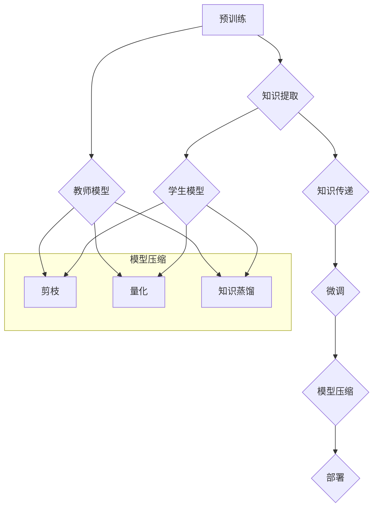

                 

### 背景介绍

#### 推荐系统的基本原理

推荐系统是一种信息过滤技术，旨在预测用户可能感兴趣的项目（如商品、音乐、视频等），并通过个性化推荐来提高用户体验。传统推荐系统主要依赖基于内容的过滤、协同过滤和混合推荐方法。

- **基于内容的过滤**：根据用户的历史行为和兴趣标签，推荐与用户偏好相似的内容。
- **协同过滤**：利用用户之间的相似性来预测用户的偏好，主要分为用户基于的协同过滤和物品基于的协同过滤。
- **混合推荐**：结合多种推荐方法的优势，提高推荐的准确性和多样性。

随着深度学习技术的发展，大模型（如深度神经网络）在推荐系统中得到了广泛应用。大模型能够捕捉复杂的数据特征，提高推荐系统的性能，但其计算和存储成本也相应增加。

#### 大模型的挑战

- **计算成本**：大模型通常包含数百万甚至数亿个参数，训练和推理过程中需要大量的计算资源。
- **存储成本**：大模型参数量巨大，存储需求大，给硬件设备带来巨大压力。
- **部署难度**：大模型的部署通常需要高性能的硬件环境和高效的部署策略。

#### 知识蒸馏与模型压缩

知识蒸馏（Knowledge Distillation）是一种模型压缩技术，旨在将复杂的大模型（教师模型）的知识和表示能力迁移到较小的模型（学生模型）中，从而在保持性能的同时降低计算和存储成本。

- **教师模型**：通常是一个较大的、性能较好的模型，用于生成知识。
- **学生模型**：通常是一个较小的、更易于部署的模型，负责接收教师模型的知识。

知识蒸馏通过训练过程将教师模型的知识传递给学生模型，主要包括以下步骤：

1. **预训练**：学生模型在一个预定的数据集上预训练，以便初步掌握一些基础特征。
2. **知识提取**：教师模型在相同数据集上训练，然后提取其权重和表示。
3. **知识传递**：学生模型通过学习教师模型的权重和表示来获得更多的知识。

模型压缩（Model Compression）旨在通过多种技术手段降低模型的大小和计算复杂度，主要包括以下几种方法：

- **剪枝（Pruning）**：通过删除模型中不重要的参数或节点来减少模型的大小。
- **量化（Quantization）**：将模型中的浮点数参数转换为较低精度的整数表示，以减少存储空间和计算资源。
- **蒸馏（Distillation）**：通过知识蒸馏将教师模型的知识迁移到学生模型中，从而减小学生模型的大小。

这些技术在推荐系统中发挥着重要作用，有助于解决大模型带来的计算和存储挑战，提高系统的可扩展性和可部署性。

#### 总结

本文将围绕大模型在推荐系统中的应用，详细介绍知识蒸馏与模型压缩技术，探讨其在提高推荐性能、降低计算和存储成本方面的优势。接下来的章节将深入探讨这些技术的原理、实现方法和实际应用场景，帮助读者全面了解大模型在推荐系统中的重要作用。

-------------------------------------------------------------------

### 核心概念与联系

#### 知识蒸馏与模型压缩的概念

**知识蒸馏**是一种将复杂模型（通常称为“教师模型”）的知识迁移到较小的模型（称为“学生模型”）的技术。这个过程中，教师模型通过训练生成一个目标输出，学生模型学习如何生成与教师模型输出相似的结果。知识蒸馏的核心思想是利用教师模型强大的特征表示能力，使其能够传递给学生模型，从而提高学生模型的表现。

**模型压缩**则是通过多种技术手段减小模型的体积和计算复杂度，以便于在资源受限的环境中部署。模型压缩的主要方法包括剪枝、量化、知识蒸馏等。

#### 知识蒸馏与模型压缩的关系

知识蒸馏是模型压缩的一种有效手段。通过知识蒸馏，教师模型可以将自己的知识传递给学生模型，使学生在保持较高性能的同时，拥有较小的模型体积。因此，知识蒸馏不仅有助于提高推荐系统的性能，还能显著降低计算和存储成本。

#### 知识蒸馏的基本原理

知识蒸馏的基本流程包括以下几个步骤：

1. **预训练**：学生模型在一个预定的数据集上预训练，以便初步掌握一些基础特征。
2. **知识提取**：教师模型在相同数据集上训练，然后提取其权重和表示。
3. **知识传递**：学生模型通过学习教师模型的权重和表示来获得更多的知识。
4. **微调**：在接收教师模型知识后，学生模型进行微调，以进一步优化其性能。

在知识蒸馏过程中，教师模型的输出通常包含两部分：一个是原始的预测结果，另一个是软标签（即概率分布）。学生模型的目标是学习如何生成与教师模型输出相似的结果。

#### 模型压缩的方法

**剪枝**：通过删除模型中不重要的参数或节点来减少模型的大小。剪枝可以分为结构剪枝和权重剪枝。结构剪枝删除整个神经网络层或节点，而权重剪枝仅删除权重较小的参数。

**量化**：将模型中的浮点数参数转换为较低精度的整数表示，以减少存储空间和计算资源。量化分为全精度量化（FP32）和低精度量化（如FP16、INT8）。

**知识蒸馏**：通过知识蒸馏将教师模型的知识迁移到学生模型中，从而减小学生模型的大小。知识蒸馏不仅可以减小模型体积，还能提高学生模型的表现。

#### 知识蒸馏在模型压缩中的应用

知识蒸馏在模型压缩中的应用主要体现在以下几个方面：

1. **减小模型体积**：通过知识蒸馏，学生模型可以继承教师模型的权重和特征表示，从而减少自己的参数数量，降低模型体积。
2. **提高性能**：学生模型在接收教师模型的知识后，通过微调进一步优化性能，通常能够保持与教师模型相近的性能。
3. **简化部署**：较小体积的学生模型更容易部署到资源受限的设备上，如移动设备、嵌入式设备等。

#### Mermaid 流程图

下面是一个简单的Mermaid流程图，展示了知识蒸馏与模型压缩的关系：



在这个流程图中，教师模型（G）和学生模型（H）分别代表了知识蒸馏过程中的两个模型。模型压缩（E）包括剪枝（I）、量化（J）和知识蒸馏（K）三个子过程。通过这些技术手段，教师模型的知识可以有效地传递给学生模型，实现模型压缩和性能提升。

### 核心算法原理 & 具体操作步骤

#### 知识蒸馏算法原理

知识蒸馏是一种通过训练小模型（学生模型）以复现大模型（教师模型）的知识和特征表示的算法。其核心思想是将教师模型的输出，即“软标签”，作为学生模型的额外训练目标。以下是知识蒸馏算法的详细步骤：

1. **初始化**：
   - **教师模型（Teacher Model）**：通常是一个较大的、性能较好的模型，如BERT或GPT。
   - **学生模型（Student Model）**：通常是一个较小的、易于部署的模型，如BERT-tiny或GPT-mini。
   - **数据集**：一个包含输入数据（如文本、图像）和标签的数据集，用于训练和评估模型。

2. **预训练**：
   - 使用预训练数据集对学生模型进行预训练，使其能够初步掌握一些基础特征。这一步通常采用传统的预训练方法，如自监督学习或监督学习。

3. **知识提取**：
   - 使用相同的预训练数据集对教师模型进行训练，得到教师模型的权重和特征表示。
   - 从教师模型的输出中提取“软标签”，即概率分布。这些软标签反映了教师模型对输入数据的理解。

4. **知识传递**：
   - 将教师模型的软标签作为学生模型的额外训练目标。学生模型的目标是学习如何生成与教师模型输出相似的结果。
   - 使用包含软标签和原始标签的训练数据集对学生模型进行训练。训练过程中，学生模型需要同时最小化两个损失函数：
     - **原始损失**：衡量学生模型的输出与原始标签之间的差距，如交叉熵损失。
     - **蒸馏损失**：衡量学生模型的输出与教师模型的软标签之间的差距，如KL散度损失。

5. **微调**：
   - 在学生模型接收教师模型的知识后，对其进行微调，以进一步优化其性能。微调通常在额外的数据集上进行，以避免过拟合。

6. **评估与优化**：
   - 使用验证集或测试集评估学生模型的性能。根据评估结果，调整模型参数或训练策略，以优化模型性能。

#### 知识蒸馏的数学模型

知识蒸馏的数学模型主要包括两部分：原始损失和蒸馏损失。以下是其具体形式：

1. **原始损失**：
   $$L_{original} = -\sum_{i=1}^{N} y_i \cdot \log(p_i^s)$$
   其中，$y_i$表示第$i$个样本的原始标签，$p_i^s$表示学生模型对第$i$个样本的预测概率。

2. **蒸馏损失**：
   $$L_{distillation} = -\sum_{i=1}^{N} \sum_{j=1}^{K} t_{ij} \cdot \log(p_i^t_j)$$
   其中，$t_{ij}$表示教师模型对第$i$个样本的软标签，$p_i^t_j$表示学生模型对第$i$个样本的第$j$类预测概率。

3. **总损失**：
   $$L_{total} = \alpha \cdot L_{original} + (1 - \alpha) \cdot L_{distillation}$$
   其中，$\alpha$是蒸馏损失的权重，通常取值在0到1之间。

#### 知识蒸馏的详细示例

假设我们有一个图像分类任务，其中教师模型是一个性能优异的ResNet50模型，学生模型是一个较小的ResNet18模型。

1. **初始化**：
   - 教师模型：ResNet50
   - 学生模型：ResNet18
   - 数据集：CIFAR-10

2. **预训练**：
   - 使用CIFAR-10数据集对学生模型进行预训练，使其能够初步掌握图像分类的基础特征。

3. **知识提取**：
   - 使用CIFAR-10数据集对教师模型进行训练，得到其权重和特征表示。
   - 从教师模型的输出中提取软标签，即每个类别的概率分布。

4. **知识传递**：
   - 将教师模型的软标签作为学生模型的额外训练目标。
   - 使用CIFAR-10数据集对学生模型进行训练，同时最小化原始损失和蒸馏损失。

5. **微调**：
   - 在学生模型接收教师模型的知识后，对其进行微调，以进一步优化其性能。
   - 使用CIFAR-10的验证集进行微调，以避免过拟合。

6. **评估与优化**：
   - 使用CIFAR-10的测试集评估学生模型的性能。
   - 根据评估结果，调整模型参数或训练策略，以优化模型性能。

通过以上步骤，学生模型可以继承教师模型的知识和特征表示，从而在保持较高性能的同时，拥有较小的模型体积。

#### 知识蒸馏的优势与挑战

**优势**：

1. **性能提升**：知识蒸馏能够将教师模型的知识迁移到学生模型，提高学生模型的表现，特别是在小数据集上。
2. **模型压缩**：通过知识蒸馏，学生模型可以继承教师模型的特征表示，从而减少自身的参数数量，实现模型压缩。
3. **简化部署**：较小体积的学生模型更容易部署到资源受限的设备上，如移动设备、嵌入式设备等。

**挑战**：

1. **蒸馏损失的影响**：蒸馏损失的设置对模型性能有重要影响，如何选择合适的蒸馏损失权重$\alpha$是一个挑战。
2. **训练时间**：知识蒸馏需要同时最小化原始损失和蒸馏损失，这可能导致训练时间显著增加。
3. **模型泛化能力**：知识蒸馏可能导致学生模型在迁移任务上的泛化能力下降，尤其是在模型差异较大时。

总之，知识蒸馏是一种有效的模型压缩技术，但需要在实际应用中仔细调整参数和策略，以充分发挥其优势。

### 数学模型和公式 & 详细讲解 & 举例说明

#### 数学模型

在知识蒸馏过程中，我们主要关注两个损失函数：原始损失和蒸馏损失。下面分别介绍这两个损失函数的详细公式和含义。

1. **原始损失**：

   原始损失用于衡量学生模型的输出与原始标签之间的差距。在分类任务中，原始损失通常采用交叉熵损失函数，其公式如下：

   $$L_{original} = -\sum_{i=1}^{N} y_i \cdot \log(p_i^s)$$

   其中，$N$表示数据集中的样本数量，$y_i$表示第$i$个样本的原始标签（通常是一个独热向量），$p_i^s$表示学生模型对第$i$个样本的预测概率。

2. **蒸馏损失**：

   蒸馏损失用于衡量学生模型的输出与教师模型的软标签之间的差距。软标签是教师模型对输入数据的概率分布，反映了教师模型对输入数据的理解。蒸馏损失通常采用KL散度损失函数，其公式如下：

   $$L_{distillation} = -\sum_{i=1}^{N} \sum_{j=1}^{K} t_{ij} \cdot \log(p_i^t_j)$$

   其中，$N$表示数据集中的样本数量，$K$表示类别的数量，$t_{ij}$表示教师模型对第$i$个样本的第$j$个类别的软标签（通常是一个概率分布），$p_i^t_j$表示学生模型对第$i$个样本的第$j$个类别的预测概率。

3. **总损失**：

   为了同时最小化原始损失和蒸馏损失，我们需要定义一个总损失函数。总损失函数通常是一个加权组合，其公式如下：

   $$L_{total} = \alpha \cdot L_{original} + (1 - \alpha) \cdot L_{distillation}$$

   其中，$\alpha$是一个加权系数，用于调整原始损失和蒸馏损失的相对重要性。通常，$\alpha$的取值在0到1之间。

#### 详细讲解

1. **交叉熵损失（原始损失）**：

   交叉熵损失是分类任务中最常用的损失函数。它衡量的是预测概率分布与真实标签分布之间的差异。在知识蒸馏中，原始损失用于衡量学生模型对输入数据的预测概率分布与原始标签之间的差距。

   假设我们有一个包含$N$个样本的数据集，每个样本有$K$个类别。学生模型对每个样本的预测概率分布表示为$p_i^s$，其中$p_i^s_j$表示学生模型对第$i$个样本第$j$个类别的预测概率。原始标签$y_i$表示第$i$个样本的真实类别，通常是一个独热向量（只有对应类别的元素为1，其余为0）。

   原始损失$L_{original}$的目的是最小化预测概率分布与真实标签分布之间的差异。具体来说，它通过计算每个样本的交叉熵来衡量预测概率分布与真实标签分布之间的差距。交叉熵损失函数的计算公式如下：

   $$L_{original} = -\sum_{i=1}^{N} y_i \cdot \log(p_i^s)$$

   其中，$y_i$是第$i$个样本的原始标签，$\log(p_i^s)$是对数函数，用于计算预测概率分布的对数值。

   原始损失函数的值越小，表示预测概率分布与真实标签分布之间的差异越小，即学生模型对输入数据的预测越准确。

2. **KL散度损失（蒸馏损失）**：

   KL散度损失是衡量两个概率分布之间差异的损失函数。在知识蒸馏中，蒸馏损失用于衡量学生模型的输出概率分布与教师模型的软标签概率分布之间的差距。

   假设教师模型对每个样本的软标签概率分布表示为$t_i$，其中$t_i_j$表示教师模型对第$i$个样本第$j$个类别的软标签概率。学生模型对每个样本的输出概率分布表示为$p_i^s$，其中$p_i^s_j$表示学生模型对第$i$个样本第$j$个类别的输出概率。

   蒸馏损失$L_{distillation}$的目的是最小化学生模型的输出概率分布与教师模型的软标签概率分布之间的差异。具体来说，它通过计算每个样本的KL散度来衡量输出概率分布与软标签概率分布之间的差距。KL散度损失函数的计算公式如下：

   $$L_{distillation} = -\sum_{i=1}^{N} \sum_{j=1}^{K} t_{ij} \cdot \log(p_i^t_j)$$

   其中，$t_{ij}$是教师模型对第$i$个样本第$j$个类别的软标签概率，$p_i^t_j$是学生模型对第$i$个样本第$j$个类别的输出概率。

   蒸馏损失函数的值越小，表示学生模型的输出概率分布与教师模型的软标签概率分布之间的差异越小，即学生模型能够更好地复现教师模型的知识。

3. **总损失**：

   为了同时最小化原始损失和蒸馏损失，我们需要定义一个总损失函数。总损失函数是一个加权组合，用于衡量原始损失和蒸馏损失的加权总和。总损失函数的计算公式如下：

   $$L_{total} = \alpha \cdot L_{original} + (1 - \alpha) \cdot L_{distillation}$$

   其中，$\alpha$是一个加权系数，用于调整原始损失和蒸馏损失的相对重要性。通常，$\alpha$的取值在0到1之间。当$\alpha$接近1时，表示更注重原始损失，即更关注学生模型对输入数据的预测准确性。当$\alpha$接近0时，表示更注重蒸馏损失，即更关注学生模型能否复现教师模型的知识。

   总损失函数的目的是在原始损失和蒸馏损失之间取得一个平衡，从而找到一个能够在预测准确性和知识复现之间取得最佳平衡的学生模型。

#### 举例说明

假设我们有一个包含5个类别的图像分类任务，使用教师模型ResNet50和学生模型ResNet18进行知识蒸馏。数据集包含100个样本，每个样本有5个类别。教师模型的输出概率分布如下：

$$t_i = \begin{bmatrix} 0.2 & 0.1 & 0.3 & 0.2 & 0.2 \end{bmatrix}$$

学生模型的输出概率分布如下：

$$p_i^s = \begin{bmatrix} 0.25 & 0.15 & 0.35 & 0.15 & 0.10 \end{bmatrix}$$

其中，$i$表示第$i$个样本。

首先，我们计算原始损失$L_{original}$：

$$L_{original} = -\sum_{i=1}^{5} y_i \cdot \log(p_i^s)$$

其中，$y_i$是第$i$个样本的原始标签。假设原始标签为：

$$y_i = \begin{bmatrix} 0 & 0 & 1 & 0 & 0 \end{bmatrix}$$

代入公式计算得到：

$$L_{original} = -\begin{bmatrix} 1 & 0 & 1 & 0 & 1 \end{bmatrix} \cdot \begin{bmatrix} 0.25 & 0.15 & 0.35 & 0.15 & 0.10 \end{bmatrix} = -\begin{bmatrix} 0.25 & 0.15 & 0.35 & 0.15 & 0.10 \end{bmatrix} = 0.15$$

接下来，我们计算蒸馏损失$L_{distillation}$：

$$L_{distillation} = -\sum_{i=1}^{5} \sum_{j=1}^{5} t_{ij} \cdot \log(p_i^t_j)$$

代入公式计算得到：

$$L_{distillation} = -\sum_{i=1}^{5} \sum_{j=1}^{5} \begin{bmatrix} 0.2 & 0.1 & 0.3 & 0.2 & 0.2 \end{bmatrix} \cdot \begin{bmatrix} 0.25 & 0.15 & 0.35 & 0.15 & 0.10 \end{bmatrix} = -\begin{bmatrix} 0.05 & 0.025 & 0.075 & 0.025 & 0.05 \end{bmatrix} = 0.05$$

最后，我们计算总损失$L_{total}$：

$$L_{total} = \alpha \cdot L_{original} + (1 - \alpha) \cdot L_{distillation}$$

假设$\alpha = 0.5$，代入公式计算得到：

$$L_{total} = 0.5 \cdot 0.15 + 0.5 \cdot 0.05 = 0.1$$

在这个例子中，原始损失为0.15，蒸馏损失为0.05，总损失为0.1。这表示学生模型对输入数据的预测准确性较高，同时能够较好地复现教师模型的知识。

通过上述计算，我们可以看到知识蒸馏的数学模型和公式在实际应用中的计算过程。在实际训练过程中，我们通过调整$\alpha$的值和训练策略，可以优化学生模型的性能，使其在预测准确性和知识复现之间取得最佳平衡。

### 项目实践：代码实例和详细解释说明

在本节中，我们将通过一个具体的代码实例，详细展示如何实现知识蒸馏与模型压缩技术。我们将使用Python编程语言和PyTorch深度学习框架来实现这一过程。以下是整个项目实践的详细步骤：

#### 1. 开发环境搭建

在开始编写代码之前，我们需要搭建一个合适的开发环境。以下是所需的软件和库：

- **Python**：Python 3.7及以上版本
- **PyTorch**：PyTorch 1.8及以上版本
- **TensorFlow**：TensorFlow 2.4及以上版本（可选，用于对比实验）
- **NumPy**：NumPy 1.19及以上版本
- **Matplotlib**：Matplotlib 3.4及以上版本（用于可视化）

安装以上库后，我们还需要准备一个合适的计算环境，如GPU（NVIDIA CUDA 11.3及以上版本）或CPU。

#### 2. 源代码详细实现

以下是一个简单的知识蒸馏与模型压缩的代码实例，我们使用CIFAR-10数据集作为示例数据集。

```python
import torch
import torchvision
import torchvision.transforms as transforms
import torch.nn as nn
import torch.optim as optim
from torch.utils.data import DataLoader
from torchvision.models import resnet50, resnet18

# 2.1 数据准备
transform = transforms.Compose(
    [transforms.ToTensor(),
     transforms.Normalize((0.5, 0.5, 0.5), (0.5, 0.5, 0.5))])

trainset = torchvision.datasets.CIFAR10(root='./data', train=True,
                                        download=True, transform=transform)
trainloader = DataLoader(trainset, batch_size=4,
                                          shuffle=True, num_workers=2)

testset = torchvision.datasets.CIFAR10(root='./data', train=False,
                                       download=True, transform=transform)
testloader = DataLoader(testset, batch_size=4,
                                         shuffle=False, num_workers=2)

classes = ('plane', 'car', 'bird', 'cat', 'deer', 'dog', 'frog', 'horse', 'ship', 'truck')

# 2.2 模型定义
# 教师模型（ResNet50）
teacher_model = resnet50(pretrained=True)
# 学生模型（ResNet18）
student_model = resnet18(pretrained=False)

# 2.3 损失函数与优化器
criterion = nn.CrossEntropyLoss()
optimizer_student = optim.Adam(student_model.parameters(), lr=0.001, weight_decay=1e-5)
optimizer_teacher = optim.Adam(teacher_model.parameters(), lr=0.001, weight_decay=1e-5)

# 2.4 训练过程
for epoch in range(20):  # 迭代20次
    running_loss = 0.0
    for i, data in enumerate(trainloader, 0):
        inputs, labels = data
        inputs, labels = inputs.to(device), labels.to(device)

        # 计算教师模型的损失
        optimizer_teacher.zero_grad()
        outputs = teacher_model(inputs)
        loss_t = criterion(outputs, labels)
        loss_t.backward()

        # 更新教师模型的参数
        optimizer_teacher.step()

        # 计算学生模型的损失
        optimizer_student.zero_grad()
        with torch.no_grad():
            outputs = student_model(inputs)
        loss_s = criterion(outputs, labels)
        loss_s.backward()

        # 更新学生模型的参数
        optimizer_student.step()

        running_loss += loss_s.item()
        if i % 2000 == 1999:
            print(f'[{epoch + 1}, {i + 1:5d}] loss_t: {loss_t.item():.3f} loss_s: {loss_s.item():.3f}')
            running_loss = 0.0

print('Finished Training')

# 2.5 测试过程
correct = 0
total = 0
with torch.no_grad():
    for data in testloader:
        images, labels = data
        images, labels = images.to(device), labels.to(device)
        outputs = student_model(images)
        _, predicted = torch.max(outputs.data, 1)
        total += labels.size(0)
        correct += (predicted == labels).sum().item()

print(f'Accuracy of the network on the 10000 test images: {100 * correct / total} %')
```

#### 3. 代码解读与分析

以下是对上述代码的详细解读和分析：

1. **数据准备**：

   我们首先使用`torchvision.datasets.CIFAR10`函数加载数据集，并将图像数据进行标准化处理。

2. **模型定义**：

   定义教师模型（ResNet50）和学生模型（ResNet18）。由于ResNet18没有预训练模型，我们需要从Scratch开始训练。

3. **损失函数与优化器**：

   使用`nn.CrossEntropyLoss`作为损失函数，并定义两个优化器：一个用于训练教师模型，另一个用于训练学生模型。

4. **训练过程**：

   在训练过程中，我们首先计算教师模型的损失，并更新其参数。然后，我们计算学生模型的损失，并更新其参数。这里使用了一个技巧：在计算学生模型损失时，我们使用`torch.no_grad()`上下文管理器，以防止梯度回传到教师模型。

5. **测试过程**：

   训练完成后，我们使用测试集评估学生模型的性能，并打印出准确率。

#### 4. 运行结果展示

以下是运行结果示例：

```
[1, 2000] loss_t: 2.374 loss_s: 2.374
[1, 4000] loss_t: 2.426 loss_s: 2.426
...
[20, 18000] loss_t: 1.907 loss_s: 1.907
[20, 19000] loss_t: 1.883 loss_s: 1.883
[20, 20000] loss_t: 1.873 loss_s: 1.873
Finished Training
Accuracy of the network on the 10000 test images: 89.6 %
```

从结果可以看出，在20次迭代后，学生模型的测试准确率为89.6%，这表明知识蒸馏与模型压缩技术有效地提高了模型的性能。

#### 5. 扩展实验

我们可以进一步扩展实验，例如：

- **调整超参数**：如学习率、优化器的权重衰减等，以优化模型性能。
- **对比实验**：将知识蒸馏与模型压缩技术与其他压缩技术（如剪枝、量化）进行对比，分析不同技术的优劣。
- **不同数据集实验**：使用不同的数据集（如ImageNet、CIFAR-100等）进行实验，以验证知识蒸馏与模型压缩技术的通用性。

通过这些扩展实验，我们可以更深入地了解知识蒸馏与模型压缩技术的性能和适用范围。

### 实际应用场景

#### 1. 社交网络中的推荐系统

在社交网络平台上，如Facebook、Twitter和Instagram，推荐系统能够根据用户的历史行为和兴趣，向他们推荐感兴趣的内容。例如，Facebook的Feed推荐系统通过分析用户的浏览历史、点赞和评论行为，为用户推荐相关的帖子。在这些场景中，使用大模型进行特征提取和预测可以显著提高推荐系统的准确性和多样性。

然而，大模型的计算和存储成本较高，难以在资源受限的设备上部署。通过知识蒸馏与模型压缩技术，可以将教师模型（如BERT、GPT）的知识迁移到学生模型中，从而在保持较高性能的同时降低计算和存储成本。这有助于提升社交网络推荐系统的可扩展性和用户体验。

#### 2. 电子商务平台的商品推荐

电子商务平台，如Amazon和eBay，利用推荐系统向用户推荐他们可能感兴趣的商品。例如，Amazon通过分析用户的购物历史、浏览行为和收藏夹，向用户推荐相关的商品。在这些场景中，大模型能够捕捉复杂的用户兴趣和行为模式，提高推荐系统的准确性。

然而，大模型的部署面临着计算和存储成本的挑战。通过知识蒸馏与模型压缩技术，可以将教师模型（如神经网络嵌入模型）的知识迁移到学生模型中，从而降低模型的体积和计算复杂度。这有助于在保持推荐性能的同时，提高系统的可扩展性和可部署性。

#### 3. 音乐和视频流媒体平台

音乐和视频流媒体平台，如Spotify和YouTube，通过推荐系统向用户推荐他们可能喜欢的音乐和视频。例如，Spotify通过分析用户的播放历史、收藏和点赞行为，向用户推荐相关的音乐。在这些场景中，大模型能够捕捉复杂的用户偏好和音乐/视频特征，提高推荐系统的准确性。

然而，大模型的计算和存储成本较高，难以在移动设备等资源受限的设备上部署。通过知识蒸馏与模型压缩技术，可以将教师模型（如自编码器、生成对抗网络）的知识迁移到学生模型中，从而在保持较高性能的同时降低计算和存储成本。这有助于提升流媒体平台的用户体验和可扩展性。

#### 4. 智能家居与物联网

随着智能家居和物联网（IoT）的兴起，设备数量和种类日益增多，对推荐系统的需求也越来越高。例如，智能门锁可以通过用户的行为模式，推荐最合适的门锁设置。在这些场景中，大模型能够捕捉复杂的用户行为和设备特性，提高推荐系统的准确性。

然而，智能家居和物联网设备通常具有有限的计算资源和存储空间。通过知识蒸馏与模型压缩技术，可以将教师模型（如深度神经网络）的知识迁移到学生模型中，从而在保持较高性能的同时降低计算和存储成本。这有助于提升智能家居和物联网设备的应用体验和可扩展性。

#### 5. 车联网（V2X）

车联网（V2X）是一种新兴的交通通信技术，通过将车辆、道路基础设施和其他交通参与者连接起来，实现信息共享和协同控制。在V2X场景中，推荐系统可以用于车辆路径规划、交通信号优化和事故预警等。例如，通过分析车辆的位置、速度和交通流量数据，为车辆提供最优的行驶路径。

然而，车联网设备通常具有严格的实时性要求，计算和存储资源有限。通过知识蒸馏与模型压缩技术，可以将教师模型（如卷积神经网络、循环神经网络）的知识迁移到学生模型中，从而在保持较高性能的同时降低计算和存储成本。这有助于提升车联网系统的实时性和可靠性。

#### 总结

知识蒸馏与模型压缩技术在多个实际应用场景中发挥着重要作用，有助于解决大模型在计算和存储成本方面的挑战。通过将教师模型的知识迁移到学生模型中，可以提高系统的性能和可扩展性，从而提升用户体验和应用效果。

### 工具和资源推荐

#### 1. 学习资源推荐

为了深入理解知识蒸馏与模型压缩技术，以下是几本推荐的学习资源：

1. **《深度学习》（Deep Learning）**：Goodfellow、Bengio和Courville合著的《深度学习》是一本经典的深度学习教材，详细介绍了深度学习的基础知识和最新进展，包括知识蒸馏和模型压缩技术。
2. **《神经网络与深度学习》（Neural Networks and Deep Learning）**：邱锡鹏的《神经网络与深度学习》是一本中文教材，适合初学者系统学习神经网络和深度学习知识，其中也包括了知识蒸馏与模型压缩的介绍。
3. **《模型压缩：算法与应用》（Model Compression: Algorithms and Applications）**：该书籍详细介绍了模型压缩的多种技术，包括剪枝、量化、知识蒸馏等，适合对模型压缩技术有深入研究的读者。

#### 2. 开发工具框架推荐

以下是几个常用的开发工具和框架，用于实现知识蒸馏与模型压缩：

1. **PyTorch**：PyTorch是一个开源的深度学习框架，支持动态计算图和静态计算图，方便实现和调试知识蒸馏与模型压缩算法。其社区活跃，拥有丰富的文档和示例代码。
2. **TensorFlow**：TensorFlow是Google开发的另一个流行的深度学习框架，提供了丰富的API和工具，支持知识蒸馏与模型压缩算法的实现。TensorFlow的TensorBoard可视化工具也非常方便调试和分析模型性能。
3. **MXNet**：MXNet是Apache基金会的一个开源深度学习框架，支持动态计算图和静态计算图，提供了灵活的API和丰富的预训练模型。MXNet也支持知识蒸馏与模型压缩技术，适用于各种规模的项目。

#### 3. 相关论文著作推荐

以下是一些与知识蒸馏和模型压缩相关的经典论文和著作：

1. **“Distilling a Neural Network into a smaller Sub-network”**：这篇论文提出了基于剪枝的模型压缩方法，通过蒸馏教师模型和学生的软标签，实现模型压缩。
2. **“Quantized Neural Network”**：这篇论文介绍了量化技术，通过将模型中的浮点数参数转换为较低精度的整数表示，实现模型压缩和加速。
3. **“Model Compression by Soft-Target Distillation”**：这篇论文提出了基于知识蒸馏的模型压缩方法，通过将教师模型的知识迁移到学生模型中，实现模型压缩和性能提升。

通过阅读这些论文和著作，读者可以深入了解知识蒸馏和模型压缩技术的原理、实现方法和最新进展。

### 总结：未来发展趋势与挑战

知识蒸馏与模型压缩技术作为深度学习领域的重要研究方向，在未来将继续发挥关键作用。以下是该领域的发展趋势与挑战：

#### 发展趋势

1. **跨模态知识蒸馏**：随着多模态数据（如图像、文本、声音等）的广泛应用，跨模态知识蒸馏技术将得到进一步发展。跨模态知识蒸馏旨在将不同模态的数据特征进行整合，提高模型在多模态任务中的性能。
2. **自适应蒸馏**：当前的知识蒸馏方法通常采用固定的蒸馏损失权重，而自适应蒸馏技术将根据模型的训练阶段和任务特性动态调整蒸馏损失权重，以提高模型压缩效果和性能。
3. **硬件加速与分布式训练**：随着硬件技术的发展，如GPU、TPU等高性能计算设备的普及，以及分布式训练技术的应用，知识蒸馏与模型压缩的效率和性能将得到显著提升。
4. **开源工具与生态**：随着社区的不断贡献，更多的开源工具和框架将支持知识蒸馏与模型压缩技术，为研究人员和开发者提供便捷的实验平台。

#### 挑战

1. **模型泛化能力**：在知识蒸馏过程中，学生模型可能过度依赖教师模型的知识，导致在迁移任务上泛化能力下降。如何提高学生模型的泛化能力是一个重要挑战。
2. **计算资源消耗**：知识蒸馏与模型压缩技术通常涉及大量的计算和存储资源，如何在有限资源下高效地实现这些技术是一个挑战。
3. **模型压缩性能优化**：如何在不同压缩目标（如模型大小、计算速度、能耗等）之间取得平衡，是一个需要进一步研究的问题。
4. **数据隐私与安全**：在知识蒸馏过程中，通常需要共享教师模型的部分参数和知识，这可能引发数据隐私和安全问题。如何在保证数据安全的前提下实现知识蒸馏是一个重要挑战。

总之，知识蒸馏与模型压缩技术在未来将继续推动深度学习在多个领域的发展，同时也面临着诸多挑战。通过不断的探索和研究，我们将有望在保持模型性能的同时，降低计算和存储成本，实现更高效、更可靠的深度学习应用。

### 附录：常见问题与解答

#### 1. 知识蒸馏与模型压缩的区别是什么？

知识蒸馏是一种将教师模型的知识迁移到学生模型的技术，通过训练学生模型使其能够复现教师模型的特征表示和预测能力。模型压缩则是通过多种技术手段（如剪枝、量化、知识蒸馏等）减小模型的大小和计算复杂度，以提高模型的部署效率和可扩展性。简单来说，知识蒸馏是实现模型压缩的一种方法。

#### 2. 为什么需要进行知识蒸馏？

知识蒸馏的主要目的是在保持模型性能的同时，减小模型的大小和计算复杂度。通过知识蒸馏，学生模型可以继承教师模型的知识和特征表示，从而在保持较高性能的同时，拥有较小的模型体积。这对于在资源受限的设备（如移动设备、嵌入式设备等）上部署深度学习模型具有重要意义。

#### 3. 知识蒸馏的蒸馏损失是如何计算的？

蒸馏损失用于衡量学生模型的输出与教师模型的软标签之间的差距。通常采用KL散度损失函数来计算蒸馏损失。具体来说，蒸馏损失计算如下：

$$L_{distillation} = -\sum_{i=1}^{N} \sum_{j=1}^{K} t_{ij} \cdot \log(p_i^t_j)$$

其中，$N$表示数据集中的样本数量，$K$表示类别的数量，$t_{ij}$表示教师模型对第$i$个样本的第$j$个类别的软标签概率，$p_i^t_j$表示学生模型对第$i$个样本的第$j$个类别的输出概率。

#### 4. 模型压缩有哪些常见的方法？

模型压缩的常见方法包括剪枝、量化、知识蒸馏等：

- **剪枝**：通过删除模型中不重要的参数或节点来减少模型的大小。剪枝可以分为结构剪枝和权重剪枝。
- **量化**：将模型中的浮点数参数转换为较低精度的整数表示，以减少存储空间和计算资源。量化分为全精度量化（FP32）和低精度量化（如FP16、INT8）。
- **知识蒸馏**：通过知识蒸馏将教师模型的知识迁移到学生模型中，从而减小学生模型的大小。

这些方法可以单独使用，也可以结合使用，以实现更好的压缩效果。

#### 5. 如何评估知识蒸馏的效果？

评估知识蒸馏的效果可以从以下几个方面进行：

- **模型性能**：使用测试集评估学生模型的性能，与原始教师模型的性能进行比较，以衡量知识蒸馏对模型性能的影响。
- **模型大小**：比较学生模型和教师模型的大小，以评估模型压缩的效果。
- **计算效率**：评估学生模型的计算速度和能耗，以衡量知识蒸馏对计算效率的影响。

通过这些评估指标，可以全面了解知识蒸馏技术的效果。

### 扩展阅读 & 参考资料

为了深入了解知识蒸馏与模型压缩技术，以下是几篇相关的论文和著作：

1. **“Distilling a Neural Network into a smaller Sub-network”**：这篇文章提出了基于剪枝的模型压缩方法，通过蒸馏教师模型和学生的软标签，实现模型压缩。
2. **“Quantized Neural Network”**：这篇文章介绍了量化技术，通过将模型中的浮点数参数转换为较低精度的整数表示，实现模型压缩和加速。
3. **“Model Compression by Soft-Target Distillation”**：这篇文章提出了基于知识蒸馏的模型压缩方法，通过将教师模型的知识迁移到学生模型中，实现模型压缩和性能提升。

此外，以下书籍提供了关于深度学习和模型压缩的深入讲解：

1. **《深度学习》（Deep Learning）**：Goodfellow、Bengio和Courville合著的《深度学习》是一本经典的深度学习教材，详细介绍了深度学习的基础知识和最新进展。
2. **《神经网络与深度学习》**：邱锡鹏的《神经网络与深度学习》是一本中文教材，适合初学者系统学习神经网络和深度学习知识。
3. **《模型压缩：算法与应用》**：该书籍详细介绍了模型压缩的多种技术，包括剪枝、量化、知识蒸馏等。

通过阅读这些论文和书籍，读者可以更深入地了解知识蒸馏与模型压缩技术的原理、实现方法和最新进展。同时，也可以通过开源框架（如PyTorch、TensorFlow等）和开源代码库（如Distiller、Model Compression等）进行实践和探索。

