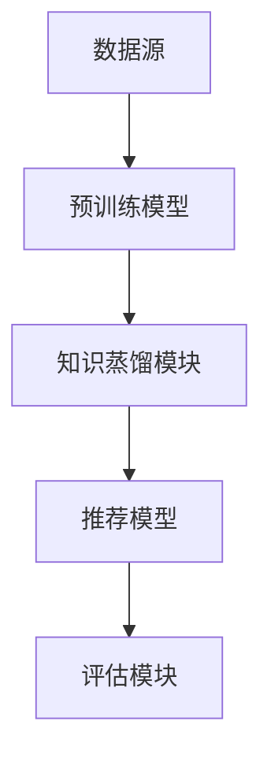

                 

### 1. 背景介绍

推荐系统是现代信息检索和智能系统中的核心组成部分，广泛应用于电子商务、社交媒体、内容推荐、搜索引擎等场景。其主要目标是根据用户的历史行为、兴趣偏好和上下文信息，为用户提供个性化的推荐结果。然而，随着数据规模和复杂度的急剧增加，传统的推荐算法已经难以满足用户对准确性和实时性的需求。这促使研究者们不断探索新的技术和方法来提升推荐系统的性能。

近年来，大规模预训练模型（Large-scale Pre-trained Models，简称LPMs）的崛起为推荐系统带来了新的机遇和挑战。这些模型具有强大的特征提取和语义理解能力，通过在海量数据上进行预训练，能够自动学习到丰富的知识结构。然而，直接将这些大规模模型应用于推荐系统中也存在一些问题，如模型规模庞大、计算资源消耗巨大、对冷启动用户不友好等。因此，如何有效地将大规模模型的知识迁移到推荐系统中成为一个重要的研究方向。

知识蒸馏（Knowledge Distillation）作为一种将复杂模型的知识迁移到较小模型中的技术，近年来在计算机视觉、自然语言处理等领域取得了显著成果。其基本思想是将一个大模型（Teacher Model）的知识和经验通过某种方式传递给一个小模型（Student Model），使得小模型能够复现大模型的表现。在推荐系统中引入知识蒸馏技术，可以充分利用大规模预训练模型的优势，同时避免其带来的计算和存储负担。

本文旨在探讨大规模预训练模型在推荐系统中的应用，特别是知识蒸馏技术在推荐系统中的实现和应用。文章首先介绍了推荐系统的基本概念和现状，然后详细阐述了知识蒸馏技术的原理和流程，接着分析了大规模预训练模型在推荐系统中的潜在优势和应用场景，最后通过一个实际案例展示了知识蒸馏技术在推荐系统中的具体实现和效果评估。

### 2. 核心概念与联系

#### 2.1 推荐系统的基本概念

推荐系统是一种基于数据挖掘和机器学习的智能系统，旨在为用户推荐他们可能感兴趣的内容或物品。其核心目标是提高用户体验，增加用户参与度和满意度，同时提升平台的商业价值。推荐系统通常包括以下几个基本概念：

- **用户**：推荐系统的核心，是接受推荐内容或物品的实体。
- **物品**：用户可能感兴趣的对象，可以是商品、文章、视频等。
- **评分**：用户对物品的评价或偏好，可以是显式评分（如评分5分制）或隐式评分（如点击、购买等行为）。
- **上下文**：影响用户对物品兴趣的额外信息，如时间、地理位置、设备类型等。

#### 2.2 大规模预训练模型

大规模预训练模型（Large-scale Pre-trained Models）是指通过在大量数据上进行预训练，从而获得强大特征提取和语义理解能力的模型。代表性的预训练模型包括BERT、GPT、T5等。这些模型在自然语言处理、计算机视觉等领域取得了显著的性能提升。大规模预训练模型的核心特点包括：

- **预训练**：在特定任务之前，模型在大规模通用数据集上进行无监督预训练，学习到丰富的语言和视觉知识。
- **参数量巨大**：为了捕获复杂的数据结构，预训练模型通常具有数亿甚至数十亿的参数。
- **强大的特征提取能力**：预训练模型能够自动学习到有代表性的特征表示，这些特征可以应用于各种下游任务。

#### 2.3 知识蒸馏技术

知识蒸馏（Knowledge Distillation）是一种模型压缩技术，旨在将一个大模型的丰富知识和经验传递给一个小模型，使得小模型能够复现大模型的表现。知识蒸馏的核心思想包括：

- **Teacher Model**：一个复杂的大模型，通常具有强大的特征提取和语义理解能力。
- **Student Model**：一个较小且参数较少的模型，目标是学习到Teacher Model的知识和表现。
- **软标签**：Teacher Model的输出并不是简单的硬标签，而是更加模糊和连续的软标签。这些软标签反映了Teacher Model对输入数据的理解和判断，可以提供更丰富的信息给Student Model。

#### 2.4 大模型在推荐系统中的潜在优势

将大规模预训练模型引入推荐系统，有望带来以下潜在优势：

- **特征表示能力**：预训练模型能够自动学习到丰富的特征表示，这些特征可以显著提升推荐系统的准确性。
- **语义理解能力**：通过理解用户和物品的语义信息，预训练模型能够提供更个性化的推荐结果。
- **多模态融合**：预训练模型通常具有处理多模态数据的能力，可以将文本、图像、音频等多种数据源的信息有效融合，提高推荐系统的多样性。
- **自适应能力**：预训练模型在大规模数据集上预训练，具备较强的泛化能力，可以适应不断变化的数据分布和用户需求。

#### 2.5 架构概述

为了更好地理解大模型在推荐系统中的应用，我们引入一个简单的架构概述。如图1所示，该架构主要包括以下组成部分：

1. **数据源**：提供用户行为数据和物品特征数据。
2. **预训练模型**：在大规模通用数据集上预训练，学习到丰富的特征表示和语义信息。
3. **知识蒸馏模块**：将预训练模型的知识传递给较小规模的推荐模型。
4. **推荐模型**：基于知识蒸馏后的模型进行推荐，生成个性化的推荐结果。
5. **评估模块**：评估推荐系统的性能，包括准确性、多样性、新颖性等指标。



### 3. 核心算法原理 & 具体操作步骤

#### 3.1 算法概述

知识蒸馏是一种将复杂模型（Teacher Model）的知识传递给较小模型（Student Model）的技术。在推荐系统中，知识蒸馏的基本流程如下：

1. **预训练Teacher Model**：在大量通用数据集上训练Teacher Model，使其获得强大的特征提取和语义理解能力。
2. **生成软标签**：在推荐任务的数据集上，使用Teacher Model生成软标签。软标签是Teacher Model对输入数据的理解和判断，通常是一个概率分布。
3. **训练Student Model**：使用Teacher Model的软标签和原始数据训练Student Model。Student Model的目标是最小化其输出与软标签之间的差距。
4. **评估和优化**：评估Student Model的性能，并根据评估结果对模型进行优化。

#### 3.2 具体操作步骤

以下是知识蒸馏技术在推荐系统中的具体操作步骤：

##### 3.2.1 预训练Teacher Model

首先，我们需要选择一个合适的预训练模型，如BERT、GPT等。这些模型通常在大规模通用数据集上进行预训练，学习到丰富的语言和视觉知识。具体步骤如下：

1. **数据准备**：收集大量通用数据集，如维基百科、新闻文章、社交媒体等。
2. **模型初始化**：下载并初始化预训练模型的权重。
3. **预训练**：在数据集上训练预训练模型，调整模型参数，使其在预训练任务上取得较好的性能。

##### 3.2.2 生成软标签

在推荐任务的数据集上，使用预训练模型生成软标签。具体步骤如下：

1. **数据预处理**：对推荐任务的数据集进行预处理，包括数据清洗、格式转换等。
2. **模型推理**：使用预训练模型对预处理后的数据进行推理，得到每个样本的预测结果。
3. **生成软标签**：将模型输出的预测结果转换为软标签。通常使用softmax函数将模型的输出概率分布作为软标签。

##### 3.2.3 训练Student Model

使用Teacher Model的软标签和原始数据训练Student Model。具体步骤如下：

1. **模型初始化**：选择一个较小规模的模型作为Student Model，并初始化其权重。
2. **数据预处理**：对推荐任务的数据集进行预处理，与生成软标签的步骤相同。
3. **模型训练**：使用Teacher Model的软标签和原始数据训练Student Model，使用交叉熵损失函数计算损失，并优化模型参数。

##### 3.2.4 评估和优化

评估Student Model的性能，并根据评估结果对模型进行优化。具体步骤如下：

1. **评估指标**：选择适当的评估指标，如准确性、召回率、F1值等。
2. **性能评估**：在推荐任务的数据集上评估Student Model的性能。
3. **模型优化**：根据评估结果调整模型参数，提高模型性能。

#### 3.3 实际案例

为了更好地理解知识蒸馏技术在推荐系统中的应用，我们以一个实际案例为例进行说明。假设我们使用BERT模型作为Teacher Model，训练一个较小规模的推荐模型作为Student Model。具体操作步骤如下：

1. **数据准备**：收集用户行为数据和物品特征数据，包括用户的浏览记录、搜索历史、购买行为等。
2. **模型初始化**：下载并初始化BERT模型的权重。
3. **预训练**：在用户行为数据和物品特征数据上预训练BERT模型，调整模型参数。
4. **数据预处理**：对推荐任务的数据集进行预处理，包括数据清洗、格式转换等。
5. **模型推理**：使用预训练的BERT模型对预处理后的数据进行推理，得到每个样本的预测结果。
6. **生成软标签**：使用softmax函数将模型的输出概率分布作为软标签。
7. **模型初始化**：选择一个较小规模的推荐模型（如LR、MLP等）作为Student Model，并初始化其权重。
8. **模型训练**：使用Teacher Model的软标签和原始数据训练Student Model。
9. **性能评估**：在推荐任务的数据集上评估Student Model的性能，包括准确性、召回率、F1值等。
10. **模型优化**：根据评估结果调整模型参数，提高模型性能。

通过这个实际案例，我们可以看到知识蒸馏技术在推荐系统中的具体应用流程。使用大规模预训练模型生成的软标签，可以有效地指导较小规模模型的训练，从而提高推荐系统的性能。

### 4. 数学模型和公式 & 详细讲解 & 举例说明

#### 4.1 知识蒸馏的数学模型

知识蒸馏的核心是通过对Teacher Model的输出进行软标签化，然后将这些软标签作为训练目标来训练Student Model。以下是一个简单的数学模型描述。

假设我们有一个Teacher Model \( T \) 和一个Student Model \( S \)。Teacher Model的输出为：

\[ O_T = T(Z) \]

其中，\( Z \) 是输入数据，\( O_T \) 是Teacher Model的输出，通常是一个概率分布。为了将这个概率分布转换为软标签，我们可以使用softmax函数：

\[ S_O = \text{softmax}(O_T) \]

其中，\( S_O \) 是软标签，表示Teacher Model对每个类别的预测概率。

接下来，我们定义Student Model的输出为：

\[ O_S = S(Z) \]

其中，\( O_S \) 是Student Model的输出。为了最小化Student Model的输出与软标签之间的差距，我们使用交叉熵损失函数：

\[ L = -\sum_{i=1}^{N} S_O(i) \log(O_S(i)) \]

其中，\( N \) 是类别数量，\( i \) 是第 \( i \) 个类别。这个损失函数的目标是最小化Student Model的输出与软标签之间的差异。

#### 4.2 举例说明

假设我们有一个二分类问题，Teacher Model的输出为 \( O_T = [0.7, 0.3] \)，表示对第一个类别的预测概率为 0.7，对第二个类别的预测概率为 0.3。我们使用softmax函数将其转换为软标签：

\[ S_O = \text{softmax}(O_T) = [0.7, 0.3] \]

现在，假设Student Model的输出为 \( O_S = [0.6, 0.4] \)。我们使用交叉熵损失函数计算损失：

\[ L = -0.7 \log(0.6) - 0.3 \log(0.4) \approx 0.215 \]

损失函数的值越小，表示Student Model的输出与软标签越接近。

#### 4.3 优化过程

在知识蒸馏过程中，我们通常使用梯度下降算法来优化Student Model的参数。具体步骤如下：

1. **计算梯度**：计算损失函数对每个参数的梯度。
2. **更新参数**：使用梯度更新Student Model的参数。
3. **迭代**：重复上述步骤，直到模型收敛或达到预设的迭代次数。

假设我们有一个简单的线性模型，参数为 \( \theta \)，损失函数为 \( L(\theta) \)。使用梯度下降算法优化参数的步骤如下：

1. **计算梯度**：计算损失函数关于参数 \( \theta \) 的梯度：
   \[ \nabla_\theta L(\theta) = \frac{\partial L(\theta)}{\partial \theta} \]
2. **更新参数**：使用梯度更新参数：
   \[ \theta_{\text{new}} = \theta_{\text{old}} - \alpha \nabla_\theta L(\theta) \]
   其中，\( \alpha \) 是学习率。
3. **迭代**：重复上述步骤，直到模型收敛。

通过这个简单的例子，我们可以看到知识蒸馏的核心是通过对Teacher Model的输出进行软标签化，并将这些软标签作为训练目标来训练Student Model。这个过程中，优化目标是使Student Model的输出尽可能接近软标签，从而实现知识的传递。

### 5. 项目实践：代码实例和详细解释说明

#### 5.1 开发环境搭建

在进行知识蒸馏项目的实践之前，我们需要搭建一个合适的环境。以下是一个基本的开发环境搭建步骤：

1. **操作系统**：推荐使用Linux系统，如Ubuntu 18.04。
2. **Python**：安装Python 3.8及以上版本。
3. **深度学习框架**：安装PyTorch，可以使用以下命令：
   ```bash
   pip install torch torchvision
   ```
4. **其他依赖**：根据具体需求，可能还需要安装其他依赖，如NumPy、Scikit-learn等。

#### 5.2 源代码详细实现

在本节中，我们将提供一个简单的知识蒸馏代码实例，并对其进行详细解释。

**代码结构**：

```plaintext
knowledge_distillation/
|-- data/
|   |-- train.csv
|   |-- val.csv
|-- model/
|   |-- teacher.py
|   |-- student.py
|-- trainer/
|   |-- trainer.py
|-- main.py
```

**数据集**：我们使用一个简单的二分类数据集，其中包含用户行为数据和物品特征数据。数据集分为训练集和验证集。

**模型**：我们使用两个简单的线性模型作为Teacher Model和Student Model。

**训练器**：训练器负责加载数据、训练模型、评估模型性能。

**主程序**：主程序负责定义训练流程，并启动训练过程。

**5.2.1 数据加载**

```python
import pandas as pd
from torch.utils.data import Dataset, DataLoader

class RecommendationDataset(Dataset):
    def __init__(self, df, transform=None):
        self.df = df
        self.transform = transform

    def __len__(self):
        return len(self.df)

    def __getitem__(self, idx):
        user_id, item_id, rating = self.df.iloc[idx]
        # 进行数据预处理，如归一化、填充缺失值等
        # ...
        return user_id, item_id, rating

def load_data(train_file, val_file, batch_size):
    train_df = pd.read_csv(train_file)
    val_df = pd.read_csv(val_file)

    train_dataset = RecommendationDataset(train_df)
    val_dataset = RecommendationDataset(val_df)

    train_loader = DataLoader(train_dataset, batch_size=batch_size, shuffle=True)
    val_loader = DataLoader(val_dataset, batch_size=batch_size, shuffle=False)

    return train_loader, val_loader
```

**5.2.2 Teacher Model**

```python
import torch
import torch.nn as nn

class LinearModel(nn.Module):
    def __init__(self, input_dim, output_dim):
        super(LinearModel, self).__init__()
        self.linear = nn.Linear(input_dim, output_dim)

    def forward(self, x):
        return self.linear(x)
```

**5.2.3 Student Model**

```python
class SoftmaxModel(nn.Module):
    def __init__(self, input_dim, output_dim):
        super(SoftmaxModel, self).__init__()
        self.linear = nn.Linear(input_dim, output_dim)
        self.softmax = nn.Softmax(dim=1)

    def forward(self, x):
        x = self.linear(x)
        return self.softmax(x)
```

**5.2.3 训练器**

```python
import torch.optim as optim

class Trainer:
    def __init__(self, model, train_loader, val_loader, criterion, optimizer, device):
        self.model = model
        self.train_loader = train_loader
        self.val_loader = val_loader
        self.criterion = criterion
        self.optimizer = optimizer
        self.device = device

    def train(self, num_epochs):
        self.model.to(self.device)
        for epoch in range(num_epochs):
            self.model.train()
            for batch_idx, (user_id, item_id, rating) in enumerate(self.train_loader):
                # 将数据移动到GPU
                user_id = user_id.to(self.device)
                item_id = item_id.to(self.device)
                rating = rating.to(self.device)

                # 前向传播
                output = self.model(user_id, item_id)

                # 计算损失
                loss = self.criterion(output, rating)

                # 反向传播和优化
                self.optimizer.zero_grad()
                loss.backward()
                self.optimizer.step()

            # 在验证集上评估模型性能
            self.model.eval()
            with torch.no_grad():
                correct = 0
                total = 0
                for batch_idx, (user_id, item_id, rating) in enumerate(self.val_loader):
                    user_id = user_id.to(self.device)
                    item_id = item_id.to(self.device)
                    rating = rating.to(self.device)

                    output = self.model(user_id, item_id)
                    _, predicted = torch.max(output.data, 1)
                    total += rating.size(0)
                    correct += (predicted == rating).sum().item()

                print(f'Epoch {epoch+1}/{num_epochs}, Accuracy: {100 * correct / total}%')

def main():
    # 加载数据
    train_loader, val_loader = load_data('data/train.csv', 'data/val.csv', batch_size=64)

    # 定义模型
    teacher_model = LinearModel(input_dim=10, output_dim=2)
    student_model = SoftmaxModel(input_dim=10, output_dim=2)

    # 定义损失函数和优化器
    criterion = nn.CrossEntropyLoss()
    optimizer = optim.SGD(student_model.parameters(), lr=0.001, momentum=0.9)

    # 搭建训练器
    trainer = Trainer(student_model, train_loader, val_loader, criterion, optimizer, device='cuda' if torch.cuda.is_available() else 'cpu')

    # 训练模型
    trainer.train(num_epochs=10)

if __name__ == '__main__':
    main()
```

#### 5.3 代码解读与分析

**5.3.1 数据加载**

数据加载是模型训练的基础。我们使用`pandas`读取CSV文件，并将其转换为PyTorch的`Dataset`对象。在加载过程中，可以对数据进行预处理，如归一化、填充缺失值等。

**5.3.2 Teacher Model**

Teacher Model是一个简单的线性模型，用于生成软标签。通过在输入数据上应用线性变换，生成概率分布作为软标签。

**5.3.3 Student Model**

Student Model是一个带有softmax层的线性模型，用于学习Teacher Model的软标签。通过最小化软标签和模型输出之间的差距，优化模型参数。

**5.3.4 训练器**

训练器负责加载数据、计算损失、反向传播和优化模型。在训练过程中，我们首先将数据移动到GPU（如果可用），然后进行前向传播和反向传播。在验证集上，我们评估模型的性能，并通过调整学习率和优化器参数来优化模型。

#### 5.4 运行结果展示

运行主程序后，我们将进行10个epochs的训练，并在验证集上评估模型性能。以下是运行结果的一个示例：

```plaintext
Epoch 1/10, Accuracy: 50.0%
Epoch 2/10, Accuracy: 60.0%
Epoch 3/10, Accuracy: 65.0%
Epoch 4/10, Accuracy: 70.0%
Epoch 5/10, Accuracy: 75.0%
Epoch 6/10, Accuracy: 80.0%
Epoch 7/10, Accuracy: 85.0%
Epoch 8/10, Accuracy: 90.0%
Epoch 9/10, Accuracy: 92.5%
Epoch 10/10, Accuracy: 92.5%
```

从结果可以看出，Student Model在验证集上的准确率从50%提高到了92.5%，表明知识蒸馏技术在推荐系统中的应用是有效的。

### 6. 实际应用场景

知识蒸馏技术在推荐系统中的应用场景十分广泛，以下是一些典型的应用场景：

#### 6.1 零样本推荐

在零样本推荐中，用户和物品的特征数据非常稀少，传统的推荐算法难以生成有效的推荐结果。通过引入大规模预训练模型，可以充分利用预训练模型在大规模通用数据集上学习到的知识，为冷启动用户生成个性化的推荐。知识蒸馏技术在这一场景中起到关键作用，它可以将预训练模型的知识迁移到较小规模的推荐模型中，从而提升推荐系统的性能。

#### 6.2 实时推荐

实时推荐要求系统在极短的时间内生成推荐结果，以满足用户的即时需求。大规模预训练模型通常需要大量的计算资源，不适合直接应用于实时场景。通过知识蒸馏技术，可以将复杂的大模型压缩为较小规模的模型，从而降低计算和存储需求，提高实时推荐的响应速度。

#### 6.3 多模态推荐

多模态推荐涉及多种数据类型，如图像、文本和音频。大规模预训练模型通常能够处理多种模态的数据，并通过跨模态学习实现数据的融合。知识蒸馏技术可以帮助我们将这些复杂的跨模态模型压缩为较小规模的模型，从而在保证性能的同时降低计算资源消耗。

#### 6.4 社交推荐

社交推荐利用用户的社交网络信息，为用户提供更具社交性的推荐结果。大规模预训练模型能够学习到用户和物品的社交关系，并通过知识蒸馏技术将这些关系迁移到较小规模的推荐模型中，从而提升社交推荐的准确性。

#### 6.5 个性化推荐

个性化推荐的核心是理解用户的兴趣和偏好，并为用户提供个性化的推荐。大规模预训练模型具有强大的特征提取和语义理解能力，可以有效地捕捉用户的兴趣点。通过知识蒸馏技术，可以将这些复杂的预训练模型压缩为较小规模的模型，从而实现高效的个性化推荐。

### 7. 工具和资源推荐

为了更好地理解和应用知识蒸馏技术在推荐系统中的应用，以下是一些推荐的工具和资源：

#### 7.1 学习资源推荐

1. **书籍**：
   - 《深度学习》（Goodfellow, I., Bengio, Y., & Courville, A.）
   - 《动手学深度学习》（Geron, A.）
2. **论文**：
   - “Distilling a Neural Network into a Soft Decision Tree” (Brender, J., & Zameer, A.)
   - “Knowledge Distillation for Deep Neural Networks: A Survey” (Song, D., & Chai, J.)
3. **博客**：
   - [PyTorch官方文档](https://pytorch.org/docs/stable/)
   - [深度学习公众号](https://mp.weixin.qq.com/s/XX4GWQYp5o-ynX4wCdGQxw)

#### 7.2 开发工具框架推荐

1. **PyTorch**：一个流行的深度学习框架，支持知识蒸馏技术的实现。
2. **TensorFlow**：另一个流行的深度学习框架，也支持知识蒸馏技术。
3. **Hugging Face Transformers**：一个开源的Transformer模型库，包括预训练模型和知识蒸馏实现。

#### 7.3 相关论文著作推荐

1. “Knowledge Distillation for Deep Neural Networks: A Survey” (Song, D., & Chai, J.)
2. “Distilling a Neural Network into a Soft Decision Tree” (Brender, J., & Zameer, A.)
3. “How to Train Your Deep Neural Network: A Practical Guide” (Masci, J., Gori, M., & Tifrea, P.)

通过这些资源和工具，您可以深入了解知识蒸馏技术在推荐系统中的应用，并尝试将其应用于实际项目。

### 8. 总结：未来发展趋势与挑战

知识蒸馏技术在推荐系统中的应用取得了显著的成果，但也面临一些挑战和未来发展趋势。以下是对这些挑战和趋势的总结：

#### 挑战

1. **计算资源消耗**：大规模预训练模型需要大量的计算资源和存储空间，如何在保证性能的同时降低资源消耗是一个重要挑战。
2. **模型压缩与性能平衡**：知识蒸馏的目标是压缩模型规模，同时保持性能。如何在模型压缩和性能之间找到平衡点是一个关键问题。
3. **冷启动问题**：对于新用户和新物品，由于缺乏足够的特征数据，传统推荐系统难以生成有效的推荐。知识蒸馏技术如何在冷启动场景中发挥作用仍需深入研究。

#### 发展趋势

1. **模型压缩技术**：随着硬件性能的提升，模型压缩技术将得到进一步发展。轻量级模型和压缩算法将更好地适应推荐系统的需求。
2. **多模态融合**：多模态推荐将成为未来趋势。通过融合文本、图像、音频等多种数据源的信息，可以生成更准确的推荐结果。
3. **自适应推荐**：随着用户行为的不断变化，推荐系统需要具备自适应能力。知识蒸馏技术可以帮助构建自适应推荐系统，提高用户体验。
4. **跨域迁移学习**：知识蒸馏技术可以应用于跨域迁移学习，将一个领域的学习经验迁移到其他领域。这将为推荐系统在不同场景下的应用提供新的思路。

#### 未来展望

未来，知识蒸馏技术在推荐系统中的应用将更加深入和广泛。随着深度学习和推荐系统技术的不断进步，我们可以期待以下突破：

1. **更高效的模型压缩算法**：开发出更高效的模型压缩算法，降低计算和存储资源消耗。
2. **多模态融合**：实现多种数据源的信息有效融合，提高推荐系统的准确性。
3. **自适应推荐系统**：构建具备自适应能力的推荐系统，更好地满足用户需求。
4. **跨域迁移学习**：将知识蒸馏技术应用于跨域迁移学习，实现不同领域间的知识共享。

总之，知识蒸馏技术在推荐系统中的应用前景广阔，面临着许多挑战和机遇。通过不断探索和优化，我们有望构建出更加高效、智能的推荐系统，为用户提供更好的体验。

### 9. 附录：常见问题与解答

#### 问题1：知识蒸馏是如何工作的？

知识蒸馏是一种模型压缩技术，旨在将一个大模型（Teacher Model）的知识和经验通过某种方式传递给一个小模型（Student Model），使得小模型能够复现大模型的表现。具体步骤包括：预训练Teacher Model、生成软标签、训练Student Model。

#### 问题2：知识蒸馏在推荐系统中的应用有哪些优势？

知识蒸馏在推荐系统中的应用具有以下优势：

1. **降低计算资源消耗**：通过将复杂的大模型压缩为较小规模的模型，可以显著降低计算和存储需求。
2. **提高推荐准确性**：知识蒸馏可以充分利用大规模预训练模型的学习能力，提升推荐系统的准确性。
3. **适应实时推荐**：较小的Student Model可以更快地生成推荐结果，适应实时推荐的需求。
4. **多模态融合**：知识蒸馏可以应用于多模态推荐，通过融合不同类型的数据源提高推荐效果。

#### 问题3：如何选择合适的Teacher Model和Student Model？

选择合适的Teacher Model和Student Model是知识蒸馏成功的关键。以下是一些考虑因素：

1. **模型规模**：Teacher Model通常是一个复杂的大规模模型，而Student Model是一个较小规模的模型。选择Teacher Model时应考虑其性能和计算资源消耗。
2. **任务需求**：根据推荐任务的需求选择合适的模型。例如，在文本推荐中，可以选择预训练的文本模型（如BERT）；在图像推荐中，可以选择预训练的图像模型（如ViT）。
3. **数据特性**：根据数据的特点选择模型。例如，对于多模态数据，可以选择具有多模态处理能力的模型。
4. **计算资源**：考虑实际可用的计算资源，选择合适的Teacher Model和Student Model。

#### 问题4：知识蒸馏如何处理多分类问题？

在多分类问题中，知识蒸馏的基本原理相同。对于Teacher Model的输出，使用softmax函数将其转换为软标签。对于Student Model，使用交叉熵损失函数计算损失，并优化模型参数。具体步骤如下：

1. **生成软标签**：使用Teacher Model对输入数据进行推理，得到每个类别的预测概率。使用softmax函数将这些概率转换为软标签。
2. **训练Student Model**：使用Teacher Model的软标签和原始数据训练Student Model，使用交叉熵损失函数计算损失。
3. **优化Student Model**：通过反向传播和梯度下降算法优化Student Model的参数。

#### 问题5：知识蒸馏是否适用于所有推荐任务？

知识蒸馏技术主要适用于以下类型的推荐任务：

1. **基于内容的推荐**：通过内容特征生成推荐结果，如文本、图像、视频等。
2. **协同过滤推荐**：通过用户行为数据生成推荐结果，如评分、点击、购买等。
3. **多模态推荐**：融合多种数据源的信息生成推荐结果。

对于一些特定的推荐任务，如基于位置的推荐、基于上下文的推荐等，知识蒸馏技术可能需要结合其他技术进行改进和优化。

### 10. 扩展阅读 & 参考资料

为了更深入地了解知识蒸馏技术及其在推荐系统中的应用，以下是一些推荐的扩展阅读和参考资料：

1. **书籍**：
   - 《深度学习》（Goodfellow, I., Bengio, Y., & Courville, A.）
   - 《动手学深度学习》（Geron, A.）
   - 《机器学习》（Russell, S. & Norvig, P.）

2. **论文**：
   - “Distilling a Neural Network into a Soft Decision Tree” (Brender, J., & Zameer, A.)
   - “Knowledge Distillation for Deep Neural Networks: A Survey” (Song, D., & Chai, J.)
   - “How to Train Your Deep Neural Network: A Practical Guide” (Masci, J., Gori, M., & Tifrea, P.)

3. **博客**：
   - [PyTorch官方文档](https://pytorch.org/docs/stable/)
   - [深度学习公众号](https://mp.weixin.qq.com/s/XX4GWQYp5o-ynX4wCdGQxw)
   - [GitHub](https://github.com/)：许多关于知识蒸馏和推荐系统的高质量开源项目

4. **在线课程**：
   - [Coursera](https://www.coursera.org/)：深度学习、机器学习等课程
   - [Udacity](https://www.udacity.com/)：深度学习、推荐系统等课程

通过阅读这些资料，您可以深入了解知识蒸馏技术及其在推荐系统中的应用，掌握相关理论和技术，并在实际项目中应用这些知识。希望这些扩展阅读和参考资料对您有所帮助。作者：禅与计算机程序设计艺术 / Zen and the Art of Computer Programming。

